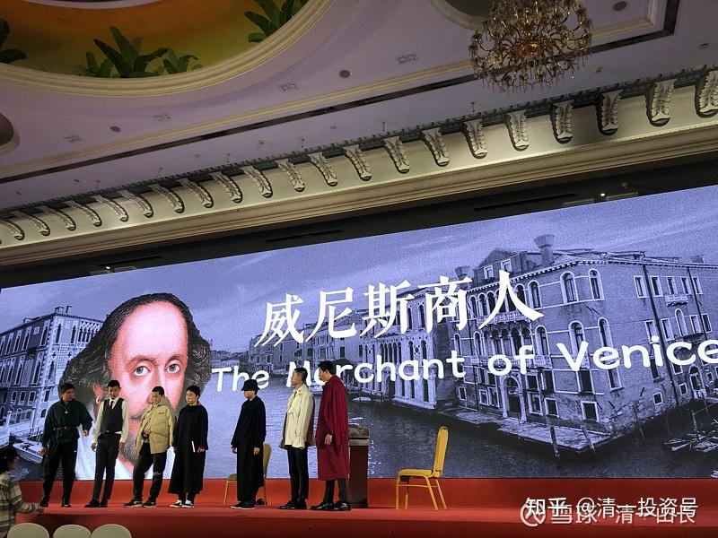
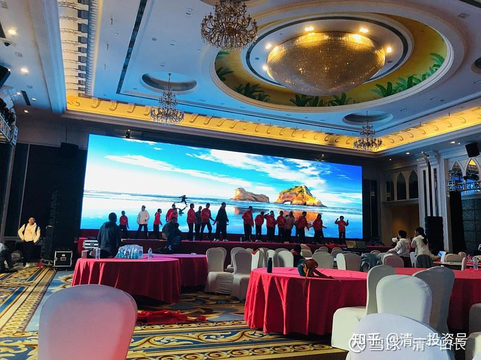
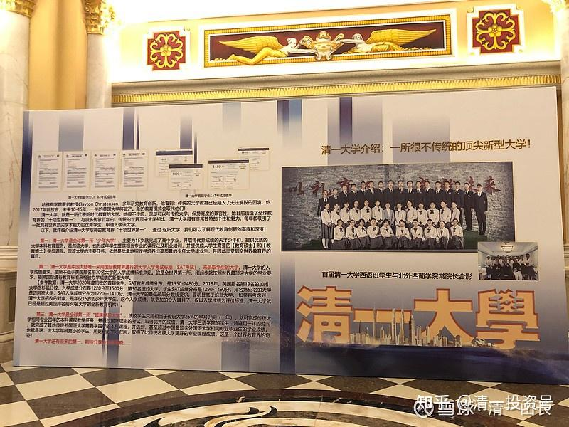
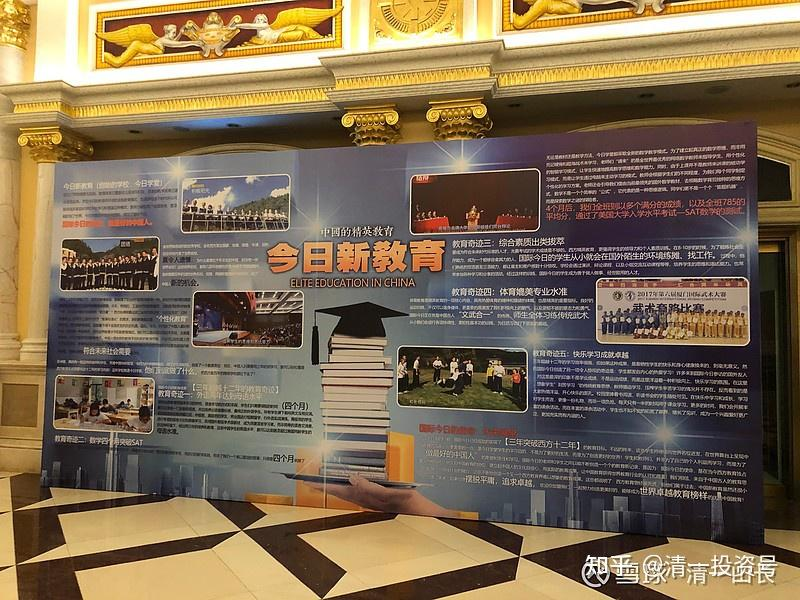
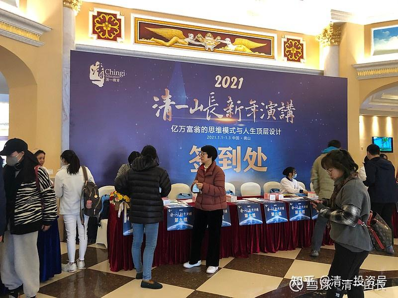
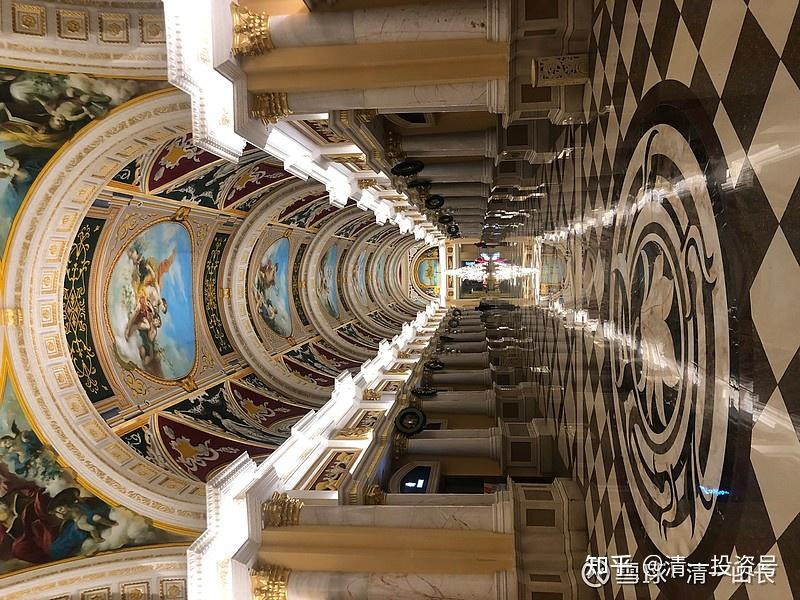
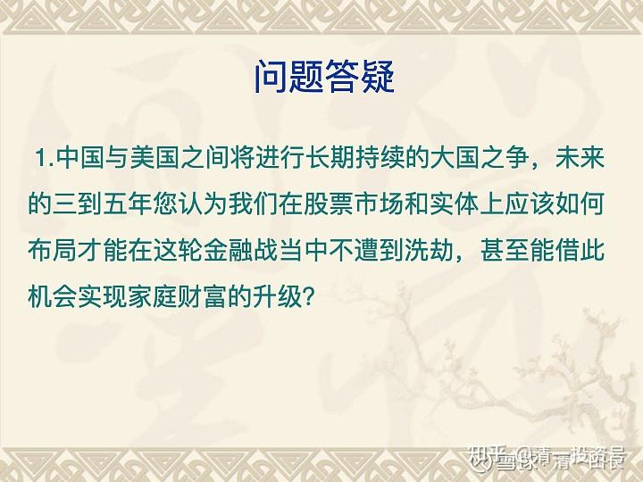
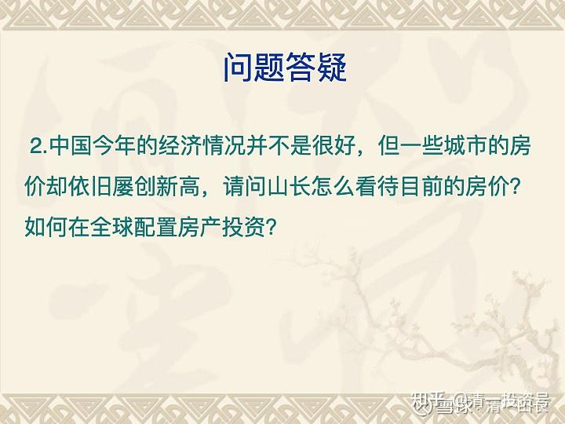
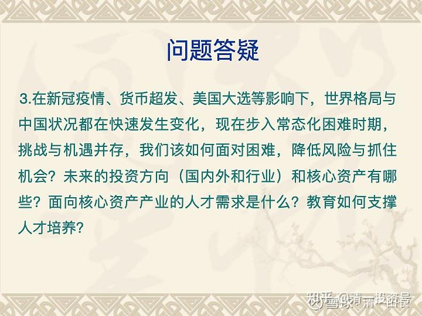

原雪球专栏96篇.明天,清一大学将演出莎士比亚戏剧,迎接新年！

清一山长 2020年12月31日

*图片是今天的彩排现场！*

*会场实景*

*现场的“清一大学介绍资料”*

*今日新教育的介绍*

现场有拿到了入场券的1200人会入场观看表演。

明天我有5个小时的义务服务时间，将为全体嘉宾演讲“亿万富豪的底层思维”，以及“如何判断真教育还是假教育？上大学要学什么？”等课题，还要负责免费回答几十个各种类型的问题：有点压力！

你们先帮我回答一下看看？我先找找思路[为什么]

**问题答疑**

1、中国与美国之间将进行长期持续的大国之争，未来的三到五年，您认为我们在股票市场和实体投资上应该如何布局才能在这轮金融战当中不遭到洗劫，甚至能借此机会实现家庭财富的升级？

2、中国今年的经济情况并不是很好，但一些城市的房价却依旧屡创新高，请问山长怎么看待目前的房价？如何在全球配置房产投资？

3、在新冠疫情、货币超发、美国大选等影响下，世界格局与中国状况都在快速发生变化，现在步入常态化困难时期，挑战与机遇并存，我们该如何面对困难，降低风险与抓住机会？未来的投资方向(国内外和行业)和核心资产有哪些？核心资产产业的人才需求是什么？教育如何支撑人才培养？

4、中国的新兴中产阶级如何避免因为经济波动而重新回到普通阶层？这个转变会给普通阶层带来怎样的发展机会？

5**、**如果疫情持续下去一到两年，中国乃至世界的经济模式将会怎样重新洗牌？这个转变会给普通阶层带来怎样的发展机会？

6、我们生活在物质世界里，每天都要和金钱打交道，大多数人一生都在苦苦追求，但财富自由的人是少之又少，主要的原因是什么？如何毫不费力的吸引金钱？

7、山长您上次说的关于财富的流向，大概率会流到东南亚地区，那么对于家庭年收入少于50万的，是否需要规划部分收入来投资泰国资本市场呢？

8、请山长分析一下港股中已经处于一挫再挫的地摊价企业股（如内地港银股），如何看待，是否具有投资价值。

9、疫情下，欧美国家对中国留学生释放的信号会对[中国的教育](http://link.zhihu.com/?target=https%3A//xueqiu.com/S/CSI931456%3Ffrom%3Dstatus_stock_match)格局会产生怎样的影响？

10、孩子的财商教育什么时候培养？具体如何培养？

11、对于年龄较大的孩子，如果选择到社会历练，是根据自己的喜好或优势选择，还是尽量找短板来补强？

12、世界格局在不断变化，我们如何规划孩子的教育？家长自身的提升又有哪些要求？

13、小明慧目前的教育方式（自主管理，伙伴少而精）感觉比突破班模式更高级，公主预备班升级到公主班后，公主班的教育方式也是类似小明慧目前的教育方式吗？还是会有变化？公主班的教育方式对于小型的外围学堂可以模仿吗？

14、如何引导孩子正确看待团队竞争与合作，帮助孩子平衡外在评价和内在成长？

15、对于青春期孩子，家长应该怎样做才能与其保持良好的亲子关系？

16、对于有志于让孩子入读武道馆、传承捍卫中华武道的家庭，如何对孩子进行0～20岁的培养规划？9岁、10岁的在家上学孩子，跟随示范班学习三年后，有什么路径可以进入武道馆习武和学习传统文化？

17、现在很多孩子从小没吃过苦，也不懂服务与付出，对于不同年龄段的孩子，如**4**岁、**10**岁、**16**岁和**20**岁，如何更好落实吃苦教育？对于男孩与女孩，吃苦教育有哪些需要注意的不同？孩子容易认为吃苦是父母故意折磨他，父母如何消除孩子这个观念？

18、针对12岁和16岁年龄段的社会实践，请问山长有什么建议？为了让社会不良影响对孩子减到最小，特别是青春期两性关系的影响，请教山长，家长事前要做好哪些规划与预案？在打工场所、伙伴、分组等方面，您有哪些建议？

19、16、17岁的孩子虽然懂得习武对思维训练的好处，但内心里还不能接受每天花大量时间去训练武术，更想通过自己擅长的如，看书、听课、写作来训练思维。如果希望孩子心里完全认同并习武，家长如何做？

20、父母在与孩子陪伴式成长的过程中，有什么特别需要把握的要点？

21、如果出国留学，关于文理分科和未来职业发展，请山长给一些建议。

22、《公主经》越读越欢喜，感觉《公主经》整合了新教育的信念系统，能否请山长谈谈《公主经》背后的故事，包括《公主经》是如何“出世”的？现在的公主预备班如何落实《公主经》？怎样可以更好地运用《公主经》帮助孩子调整信念系统？其他学堂是否适合模仿实施公主班的培养模式，有什么是要特别注意的？

23、信念系统究竟是什么？包含哪些要素？新教育信念系统的七大信念如何落地？

24、家长如何觉察自己信念系统问题，找到改进方向，达到调整自己助力孩子的目的？如果觉察到自己信念系统“自利”问题，如何将自己的底层信念由“自利”转为“利他”？

25、头脑里全都是理论、概念的东西，也知道事情要如何去做才更好一些，但经常是心有余而力不足，请问要如何做才能真正做到知行合一？

26、要做个有目标的人，但是又不能执着，这里面怎么平衡？

27、每个人到地球上来都是有自己的任务的，那我们如何用正确的方法快速地找到自己的目标，让自己的人生更有意义？

28、您制定家规、家训的原则是什么，核心要素是什么？

29、对于家族传承，我目前的想法是将自己成长改变的心路，传承给下一代，让他们能站在我之上有更好的眼界和格局。但具体如何传承，除了自己身体力行，影响和引领孩子，还有什么建议吗？

30、家族传承是百年大计，肯定会遇到很多的不确定性事件或者危机，能否用几个核心原则让我们理解并践行家族传承？应对各种不确定因素如疫情，有什么关键要素？

**评论回复：**

**[慧盈1689](http://link.zhihu.com/?target=http%3A//xueqiu.com/n/%25E6%2585%25A7%25E7%259B%25881689)回复[清一山长](http://link.zhihu.com/?target=http%3A//xueqiu.com/n/%25E6%25B8%2585%25E4%25B8%2580%25E5%25B1%25B1%25E9%2595%25BF)：**

感谢山长和刘老师的新年礼物！清一大学的孩子们超级招人喜欢！精气神特别好......

**[清一山长](http://link.zhihu.com/?target=https%3A//xueqiu.com/9310099567)[2021-01-03 09:25](http://link.zhihu.com/?target=https%3A//xueqiu.com/9310099567/167424618)回复[慧盈1689](http://link.zhihu.com/?target=http%3A//xueqiu.com/n/%25E6%2585%25A7%25E7%259B%25881689)：**

喜欢，就把女儿嫁给他们吧[笑]！**我的儿子，我只准他去娶清一大学毕业的女生回家。不然我就不认这儿媳妇。我的女儿，也只准她嫁给清一大学毕业的男生。别的男生我都不放心[大笑]。**

**[奔跑的蝸牛](http://link.zhihu.com/?target=http%3A//xueqiu.com/n/%25E5%25A5%2594%25E8%25B7%2591%25E7%259A%2584%25E8%259D%25B8%25E7%2589%259B)回复[清一山长](http://link.zhihu.com/?target=http%3A//xueqiu.com/n/%25E6%25B8%2585%25E4%25B8%2580%25E5%25B1%25B1%25E9%2595%25BF)：**

违反《婚姻法》的婚姻自由原则。

**[清一山长](http://link.zhihu.com/?target=https%3A//xueqiu.com/9310099567)[2021-01-03 11:34](http://link.zhihu.com/?target=https%3A//xueqiu.com/9310099567/167431030)回复[奔跑的蝸牛](http://link.zhihu.com/?target=http%3A//xueqiu.com/n/%25E5%25A5%2594%25E8%25B7%2591%25E7%259A%2584%25E8%259D%25B8%25E7%2589%259B)：**

谁说我违反婚姻自由的原则了？我儿子当然可以自由地娶他喜欢的任何女孩子，去他自己的家里面。但我也有自由意志来决定，我是不是喜欢他娶回家的女孩子：**如果他娶的女孩子，我不满意，就不能进我的家！这叫做父子平等，彼此之间，都要互相尊重**，懂吗？**他如果敢只谈他自己的权利，我生他养他，却连个意见都不能提，连我孙子的妈是啥档次的人，我都不能要求，这媳妇，这孙子，我不认也罢。免得来我家里气我。我可不是我儿子的奴仆，眼看他的脸色行事。我家也不是平民窟，谁想来就来。如果儿子犯糊涂，娶一头狼进门来，我也要开门接客吗？**这不是笑话吗？

**婚姻不是一个人的事，是两个家族的事。只有穷家小户，才会对儿女的对象不要求。**因为他们根本就没有要求的资格和能力，对子女的婚姻，这些父母也没有任何的发言权！因为儿女们也基本不会考虑他们的意见。他们敢像我一样说：自己有权利不接受儿媳妇回家吗？他们不敢说的。因为，他们老了，就没人理他们的。将来就盼着儿子和媳妇回家来，有人叫他一声爸爸，对他就是恩赐一样。**对我来说，儿女回到家，是他们的机会。谁有资格叫我爸爸，是她的幸运。我怎么能把幸运和机会，随便给我不喜欢的人？**[俏皮]

我儿子自己就是清一大学毕业的，还是商学院的第一名。很多师妹认为他很帅。他要娶一个喜欢他的清一大学小师妹回家，是很容易的，我觉得这样也很正常。难道您觉得，他娶个北外的小女生回家才正常吗？告诉你吧！我儿子觉得这才是不正常的！**他对外面的女子也没兴趣，不敢去惹这些“奇女子”！**

**你们都被利益集团洗脑了。被一些所谓的“自由”，洗成了“孤独的沙子”，都忘记了中国的传统有“家族”这一说。你们除了被利益集团利用，给他们打工外，就没有别的出路了。就像散户一样，虽然人多，也无法与合作一致的小庄家作对。这正是他们需要的结果。**

**我家的儿女，不为别人打工的，不需要去拿打工证。他们只为自己的家族而工作！否则就不配做我的儿女！**

**我们不做散户，我们种自己的“谷子地”，做自己的“谷子庄”。我们是清一教育家族，专注于打造世界级的顶尖教育平台。我的儿子与儿媳妇，也必须参与家族的共建。否则就跟我无关，中国人说的“清理家门”，并不是要杀人、砍人，而是赶出家去！**你们说的上层社会！

告诉大家**什么是真正的中国传统**：一个家族的案例。台湾首富王永庆，有一个家规，就是**不许娶戏子回家**（**很多中国传统家庭都有这个家规，我们家也一样**）。结果他大儿子，就是不听话，非要娶一个女明星，结果他自己也回不了家了。在台湾都呆不下去，只能来跑到大陆混，到处当骗子。到处去宣扬自己是台湾首富王永庆的的大儿子，骗人跟他合作。大陆一些商人，就觉得可以借此拉上关系。结果去台湾确认时，得到的信息是：这个人，跟我们王永庆家族没有关系。我们不承认他，也不会跟他合作。你们要合作，请随意。跟王家无关。

知道了吗？这才是中国的“家族范”。泰国，东南亚国家的家族，至今依然是这样玩的。只是大陆人不知道罢了——大陆哪有什么“家族传承”，都是土鳖。还需要几代人才能出真正的家族！（我也是大陆的土鳖，只是正在慢慢恢复一点传统罢了，起码有样学样，不跟平民窟的人学啥“自由婚姻”）。

**[倪琼芳](http://link.zhihu.com/?target=http%3A//xueqiu.com/n/%25E5%2580%25AA%25E7%2590%25BC%25E8%258A%25B3)回复[清一山长](http://link.zhihu.com/?target=http%3A//xueqiu.com/n/%25E6%25B8%2585%25E4%25B8%2580%25E5%25B1%25B1%25E9%2595%25BF)：**

山长你的大学有动物医学这个专业吗？我儿子今年高考，想做兽医。

**[清一山长](http://link.zhihu.com/?target=https%3A//xueqiu.com/9310099567)[2021-01-03 11:57](http://link.zhihu.com/?target=https%3A//xueqiu.com/9310099567/167432185)回复[倪琼芳](http://link.zhihu.com/?target=http%3A//xueqiu.com/n/%25E5%2580%25AA%25E7%2590%25BC%25E8%258A%25B3):**

只要是清一大学的学生，可以申请上任何他们喜欢的专业和课程，只要喜欢就可以选。但我们不接受中国的高考成绩。我们只接受美国高考的成绩，SAT国际考试。且分数必须达到美国顶尖前30名大学的成绩要求！还要加试体育和运动的成绩，大约相当于国家二级运动员水平吧！如果您的儿子符合这两项成绩要求，欢迎您申请入学[献花花] [笑]。

**[以赛亚](http://link.zhihu.com/?target=http%3A//xueqiu.com/n/%25E4%25BB%25A5%25E8%25B5%259B%25E4%25BA%259A):回复[清一山长](http://link.zhihu.com/?target=http%3A//xueqiu.com/n/%25E6%25B8%2585%25E4%25B8%2580%25E5%25B1%25B1%25E9%2595%25BF)：**

王永庆不许儿子娶戏子。莎士比亚不就是一个戏子吗？

**[清一山长](http://link.zhihu.com/?target=https%3A//xueqiu.com/9310099567)[2021-01-03 12:01](http://link.zhihu.com/?target=https%3A//xueqiu.com/9310099567/167432398)回复[以赛亚](http://link.zhihu.com/?target=http%3A//xueqiu.com/n/%25E4%25BB%25A5%25E8%25B5%259B%25E4%25BA%259A)：**

不娶明星，跟不理明星，是两回事吧？

您知道中国有“票友”这种存在吗？就是：您喜欢艺术，可以去玩玩票友。但您不可以入戏！不然就不是“家族范”。

中国有身份的家族，可以欣赏艺术，欣赏明星，招待明星。请明星做广告等等。但自己的孩子不做明星，更不能娶明星进门！这才是中国传统家族的范儿。

**[心音5ol](http://link.zhihu.com/?target=http%3A//xueqiu.com/n/%25E5%25BF%2583%25E9%259F%25B35ol)回复[清一山长](http://link.zhihu.com/?target=http%3A//xueqiu.com/n/%25E6%25B8%2585%25E4%25B8%2580%25E5%25B1%25B1%25E9%2595%25BF)：**

这么高的要求，怎么惠及普通孩子？我觉得要求这么高，在任何一个大学也都是佼佼者了。希望能降低一下标准。

**[清一山长](http://link.zhihu.com/?target=https%3A//xueqiu.com/9310099567)[2021-01-03 20:36](http://link.zhihu.com/?target=https%3A//xueqiu.com/9310099567/167457616)回复[心音5ol](http://link.zhihu.com/?target=http%3A//xueqiu.com/n/%25E5%25BF%2583%25E9%259F%25B35ol)：**

您应该关心的，并不是要清一大学降低录取标准。而是，真有这么牛的学生，怎么不去上美国的前30名大学，而要跑来上您从来没听说过的清一大学？真的招得到学生吗？还是忽悠人的？

答案：招得到，人还不少！每年好几十个呢！既然这个大学能够招到学生，干嘛要降低标准？自降档次？您干吗不去让清华、北大降低一点分数？惠及大众？别忘了清一大学的学生，一个个都可以轻松击败北大的同专业学生。您还不如去请求北大降分录取更靠谱，而不是去要求比北大更高一个级别的清一大学降分！

您还应该关心第二点：这些能够轻松考上清一大学的牛学生，是什么牛学校毕业的？他们为什么会有这么好的学业成绩？以及运动成绩？

答案：这些学生，都是清一大学附中培养出来的。这个大学牛，是因为这个附中更牛！

至于为什么会这样？很简单，我们是**新教育，相当于教育界的汽车。而体制教育，相当于教育界的马车。**您就知道了：**您就算拿北大这种马车界最牛，最豪华的马车，来跟我们的汽车赛跑，就算是最差的，最慢的夏利车，只要不出故障，驾驶员不睡觉，您的马车跑死了也追不上的！**何况，我们造的车不是夏利，而是奔驰！[俏皮]

所以——关键问题，想要入学的话，不是要求降低录取成绩，而是，你家的马车，怎样换成汽车？

这就是元旦1400个家长，都要坐飞机跑来上课的原因了。因为他们想帮孩子换机芯，不然就注定落后了。

想知道如何换芯？很简单，去看**B站上的“[这就是今日学堂](http://link.zhihu.com/?target=https%3A//space.bilibili.com/487498588/channel/series)”**，上面已经公开了全部的秘籍！每一天怎么学的，都手把手教给您了！您学了，考上清一大学不是梦。您不照着学？您就只能做梦了！

**[高乐高2018](http://link.zhihu.com/?target=http%3A//xueqiu.com/n/%25E9%25AB%2598%25E4%25B9%2590%25E9%25AB%25982018):回复[清一山长](http://link.zhihu.com/?target=http%3A//xueqiu.com/n/%25E6%25B8%2585%25E4%25B8%2580%25E5%25B1%25B1%25E9%2595%25BF)：**

恕我直言，看图片有点像搞传销的[笑]

**[清一山长](http://link.zhihu.com/?target=https%3A//xueqiu.com/9310099567)[20221-01-04 10:46](http://link.zhihu.com/?target=https%3A//xueqiu.com/9310099567/167502215)回复[高乐高2018](http://link.zhihu.com/?target=http%3A//xueqiu.com/n/%25E9%25AB%2598%25E4%25B9%2590%25E9%25AB%25982018)：**

是吗？您真去过传销的场所吗？您知道传销是怎么弄的吗？我好奇，还真去见识过。当然，有人拉我，我就去看看。

您的结论，证明你的眼神有点差，您连表面的东西都看不到，更别说深层次的东西了。比如，最表面的，一个重大的区别就是：这些人都是有钱人，各行各业的成功者。他们来是住豪华宾馆，坐飞机来开上两三天的会议，就回去了。**传销人员，都是一堆穷人，想做富人的穷人**。虽然他们喊口号的时候，很有激情。但生活实在很低调。租小区的房子，打个地铺，吃青菜泡饭，过着乞丐一样的生活。这就是传销人。

还有一个最大的区别：**传销，是用尽办法拉人头去会场，骗人去会场**。拉上一个算一个，生怕你不去。可是，我们这个会场，是你想去还去不了，要有关系，有门路，才有机会。圈外人根本就没机会。有谁是被拉去的？我在雪球发消息让人去不？没有，只是报道一下，分享给你们，知道有人这样过节。你们这么没见识，以为过节都跟你们一样。有人是不一样的，这是让你们长长见识的。

古人说的“有眼无珠”，大约就是在说您这种人吧？[大笑][大笑][大笑]

**[慧盈1689](http://link.zhihu.com/?target=http%3A//xueqiu.com/n/%25E6%2585%25A7%25E7%259B%25881689)回复[清一山长](http://link.zhihu.com/?target=http%3A//xueqiu.com/n/%25E6%25B8%2585%25E4%25B8%2580%25E5%25B1%25B1%25E9%2595%25BF)：**

山长：此生遗憾是没有女儿啊！如果我有女儿有幸和清一大学的孩子结婚，我肯定是很放心、满心欢喜！看到您娶儿媳的标准，让我想起雪球另一位大V：U兄在一次分享会上说：他孩子婚嫁对象必须在清一新教育圈接受10年以上的学习[笑]。

我给儿子的娶儿媳的标准：必须是接受新教育的观念，跟随学习的人。

**[清一山长](http://link.zhihu.com/?target=https%3A//xueqiu.com/9310099567)[2021-01-04 11:28](http://link.zhihu.com/?target=https%3A//xueqiu.com/9310099567/167510344)回复[慧盈1689](http://link.zhihu.com/?target=http%3A//xueqiu.com/n/%25E6%2585%25A7%25E7%259B%25881689)：**

因为U兄的孩子，就要在新教育泡十年以上。他当然不能接受泡的时间不够的人，将来去做他的“家人”了[笑]。

有本事泡十年，特别在顶尖的今日学堂泡十年，这还真不是一般人做的到的。绝大多数人，只能11岁来考突破班，表现优秀的话，可以留到18岁，就离开去海外上大学俩，一共也只有七年。除非**极少数的最优秀学生，才有可能继续留下读“清一研究生”**。或者找机会11岁以前入读国际今日小学。U兄的孩子，起点就说“要泡10年”，他拼的是他的人脉地位，一般人，真没这机会的[俏皮]。

**[清一山长](http://link.zhihu.com/?target=https%3A//xueqiu.com/9310099567)[2021-01-04 13:08](http://link.zhihu.com/?target=https%3A//xueqiu.com/9310099567/167522759)回复糊炒一通：**

说脏话，就滚远点，我不客气了。看看您说话的方式，就证明了您受到的的确是很失败的教育，很不堪的教育[俏皮]。

我跟您不一样，因为**我的本事，并不是中国的学校教给我的。读书认字，都是我的父母教的。学的本事，是我从小自己看书学的，真跟学校没关系。我一直到大学，都是逃课去图书馆自学的。**

**[国学中医黎天焕](http://link.zhihu.com/?target=http%3A//xueqiu.com/n/%25E5%259B%25BD%25E5%25AD%25A6%25E4%25B8%25AD%25E5%258C%25BB%25E9%25BB%258E%25E5%25A4%25A9%25E7%2584%2595)回复[清一山长](http://link.zhihu.com/?target=http%3A//xueqiu.com/n/%25E6%25B8%2585%25E4%25B8%2580%25E5%25B1%25B1%25E9%2595%25BF)：**

从数万之八旗劲旅入关到康乾时代，半部大清史，足见康乾之雄才，能将历代之得失扬长避短而成立国之基，皇家教育亦为历世最严，试看晚清帝皇谁无文化。民间之教育，看晚清左宗棠一个举人就能上马治军，下马治民，曾胡两个文人治兵就完满收拾了天国。现在的清北才子起码就不能上马了！（以上仅是个人言论不针对任何人）

**[清一山长](http://link.zhihu.com/?target=https%3A//xueqiu.com/9310099567)[20221-01-04 13:17](http://link.zhihu.com/?target=https%3A//xueqiu.com/9310099567/167524150)回复[国学中医黎天焕](http://link.zhihu.com/?target=http%3A//xueqiu.com/n/%25E5%259B%25BD%25E5%25AD%25A6%25E4%25B8%25AD%25E5%258C%25BB%25E9%25BB%258E%25E5%25A4%25A9%25E7%2584%2595)：**

大清国教育的档次如何？我本次的演讲，专门提到了。属于很成功的教育，真教育之一。排列第四个档次的教育。至于这四个层次是什么？就不多说了，多说得罪人。听过我课的人，自然知道。没听过的，就不用知道了。知道了徒增烦恼! [大笑]

**参考链接：**

[【清一大学少年班】《威尼斯商人》舞台剧](http://link.zhihu.com/?target=https%3A//www.bilibili.com/video/BV1kh41127CC)

[【清一大学少年班】我们如何在一年中从零突破西语](http://link.zhihu.com/?target=https%3A//www.bilibili.com/video/BV1vA411H7n3/)

[【清一大学少年班】清一大学的办学特色与未来展望](http://link.zhihu.com/?target=https%3A//www.bilibili.com/video/BV13K411u7Sr)

[【清一大学少年班】信念与思维的塑造——清一大学最宝贵的课程](http://link.zhihu.com/?target=https%3A//www.bilibili.com/video/BV1Vr4y1M7KA)

[【清一大学少年班】走进我们的日常生活](http://link.zhihu.com/?target=https%3A//www.bilibili.com/video/BV1Fi4y1F7uK/)