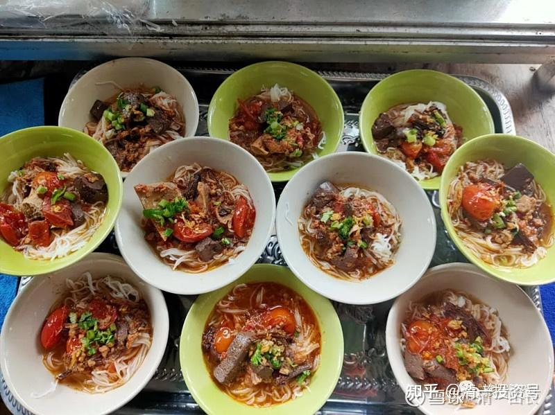
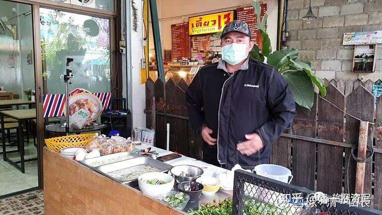
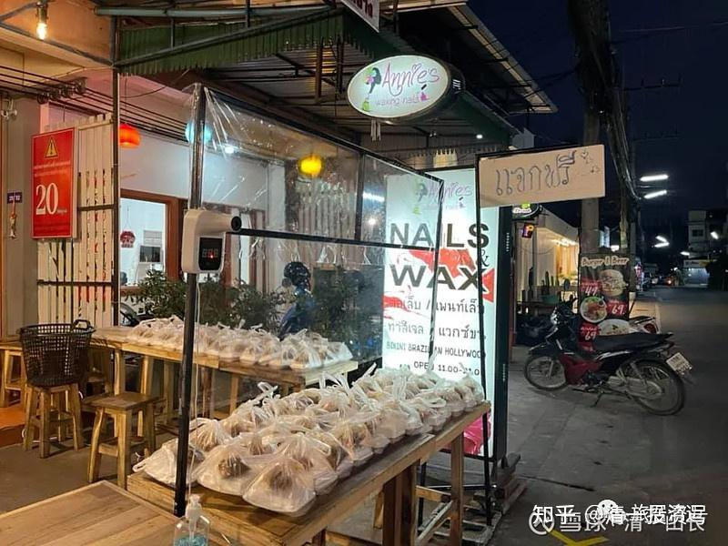

[原雪球专栏](https://zhuanlan.zhihu.com/p/552626231/edit)[100篇.一元钱一碗的米粉是啥样的？善良不需要表演](http://link.zhihu.com/?target=https%3A//xueqiu.com/9310099567/169655199)

清一山长 2021年1月24日

以上就是一元钱的米粉实物和老板的样子。完全的个人行为，没有商业的算计！

这个价格，铁定是没钱赚的。为啥？因为疫情，有人生活困难。这些自己也是小业主的老板，就出面来帮助没钱的人有饭吃，把原来定价25～30泰铢的米粉，降低价格到5泰铢一份。质量却绝不降低，没有偷工减料。

这样的善良和互助，在泰国常常能够看到。

一次有趣的经历，就是我带孩子去旅游，一个市场边上吃饭。我们买的都是简单的素食，很便宜。一个卖烧烤的摊主，正准备收摊回家，可能看我们几个人吃的太寒酸了，可能是“穷人”，没钱吃好的。就走过来送一大份包好的炸鸡给我们。然后高高兴兴地走了。却之不恭，我们就先收下来了。晚上去宾馆，我们把这份礼物转送给了宾馆的看门人，看门人也很开心。

在清迈，不仅仅有低价供应的饭菜，还真的有一些业主**每天免费送餐**。比如这家：每天送两百份快餐，只要去领，不问你有钱没钱，都送。据说有些中国人就跑去领取。不是穷，是想占便宜。

我们外出，也看到过街边有这样的**免费领取食物**的地方。我带孩子们路过看到，就是看看热闹，感受泰国人的善良和互助，但我们绝对不去取用的，宁肯在附近找家便宜的饭店买饭吃。大多数泰国人也是这样，虽然免费赠送食物，但也不是很多人都会蜂拥而来。现场并不热闹，更没有抢的场景。只有真正需要的人会去吧？这个民族的自尊心还是很强的。

与此同时，我们的新教育学堂，却遇到了中国人的“碰瓷”。第三届免费班，有一个学生来今日学堂，全免费，我们免学费，还供应免费的吃喝、住宿，还送校服等。学完回去了，家长感恩不尽，后续这孩子也得到了其他学堂免费教育的机会，因为孩子学习还是很努力的，其他学堂也想好好的培养出来，堂主掏钱来教育她。另外还有两个弟妹，也送去当地的外围学堂去学新教育了，因为觉得新教育的效果好。但这家长是跑货车的人，夫妻俩一起跑车，赚的就是辛苦钱。不幸的是：货车前段时间出了车祸，夫妻俩一起走了。学堂的堂主和老师、家长们对此事件感到非常的震惊，就说：留下来的这三个孩子，真的可怜，既然父母都不在了，现在成了孤儿，而且几个孩子也很懂事，愿意努力学习，这两所学堂的堂主，家长们都商量表示：只要他们的监护人没意见，愿意出钱出力，来供养这三个孩子以后的一切，一直到大学毕业能独立为止。

这种善良的愿望，却被这一群自称是“孩子亲戚”的人，**把灾难视为自己发财的机会：这些以“孩子监护人”自居的亲戚们，用“监护人”的权利，不仅完全违背孩子们想继续学习的愿望，把孩子们强行接回家去。还要污蔑帮助他们的学堂是“X教”，**理由就是因为孩子们不肯去上原来的体制学校，想继续在新教育学堂学习，就被说成是被“洗脑”了。这也就罢了，总有人不理解，总有乱贴标签的蠢蛋。不理解，可以慢慢地学习进步。这群家长，居然还跑去找这两家学堂要敲诈钱财，说：就是因为新教育学堂的收费很高，才导致这夫妻俩不得不没日没夜的跑车，导致出了人命事故。因此要这些学堂来给他们“赔偿损失”。拜托，都已经食宿都免费了，还“高学费”。而且，你们是啥人？为啥要利用灾难来讹诈钱财？你们尊重到死去人的愿望和选择没有？堂主当然不可能答应他们的无理要求。这群家长就跑去教育局、政府部门告状、闹事，要政府出来整死这家“害死了他们家人的学堂”。气得堂主说：以后再也不接受穷人的家长送孩子来了，没赚钱，还贴钱费心思，还要被这些“家人”来泼污水，敲诈勒索。**国人真的太无赖了，底层就是底层！**

中国人，富人可能也有不少昧良心的人。但是，**别以为穷人，就良心好。很多穷人，真的很恶毒的**。像以上这个案例，我相信不会出现在泰国的。我居住的地方是郊区，身边的泰国穷人很多。但这些人再穷，也不会这样无赖。**他人的善良、善举，却被当作了攻击的对象。**该要不该要的东西，都要拼命的去要。脸是不要的，公正是不要的，善良也是不要的。**除了钱，什么都可以不要，连命都可以不要。**这种社会，是不是很可怕？

现在歌舞升平，社会稳定。万一出现吃不饱饭的情况，是不是农民起义马上就要起来了：要吃大户，杀大户了？

我早知中国就是这种局面，历史上一向的多灾多难。所以，早早就带着家人避居泰国了。我们惹不起，还躲得起。在泰国定居，经常看到泰国人的各种善举，觉得：真的要“居善地”。我应该选对了居住的地方！（美国也不行，我看也是打打杀杀的）

信息转发：

向大家汇报一件事情：

原委培生詹##（第三届免费班学生），自父母双亡之后，家里的亲戚们接管了詹和她的姐弟们。现在这些亲戚来讹她所在的学堂，和她弟妹所在的学堂。除了找堂主敲诈钱财外，因为没有得逞。现在已经写信告到政府部门去了。理由是这些孩子被学校洗脑，回去后不愿意上体制学校，面对父母双亡，也不会哭泣，没有人性；认为新教育是XJ（邪教）组织，而且告的名称叫：今日学堂##分校(乱说的，我们根本没有分校）。他们还强调：正是因为这些学校收这么高的学费，所以他们的父母才要努力地挣钱交学费，所以才导致他们死亡。

目前，这两所学堂都受到了不同程度的干扰。借此事件，我们也要注意树立防火墙，当初两位堂主得知父母双亡的信息，和一些善良的家长们，都准备要免费继续培养孩子成人。现在看来，**在利欲熏心的大环境下，很多人是没有一点正常的人类情感的**。希望我们这个圈子里，以及未来培养出来的学生，能够留下一些真正美好的东西，创造更美好的世界。

参考链接：

[清一投资号：23篇.教育是分层的：底层应试教育，中层素质教育！](https://zhuanlan.zhihu.com/p/537522662)

[清一投资号：56篇.真有“穷人之歌”？千万别唱！一辈子穷命！](https://zhuanlan.zhihu.com/p/464630733)

[清一投资号：121篇.千万大礼，送给穷人会是啥结果？](https://zhuanlan.zhihu.com/p/577842173)

[清一投资号：123篇.美团外卖的小哥，花钱订我一万元小时的咨询！](https://zhuanlan.zhihu.com/p/580123623)