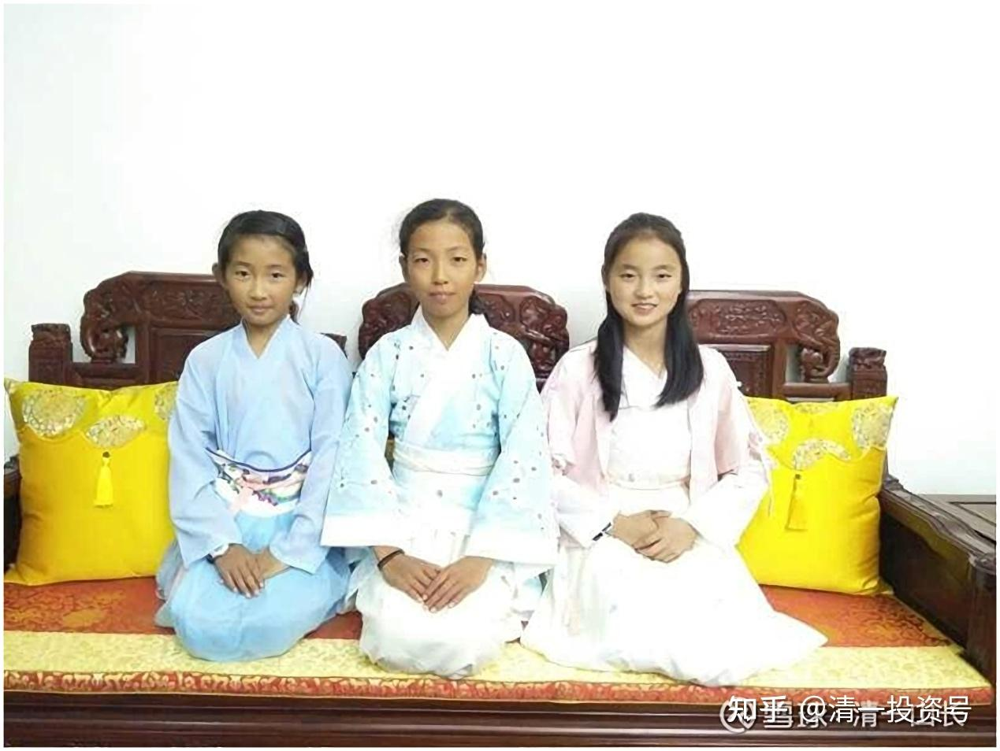

[原雪球专栏](https://zhuanlan.zhihu.com/p/546934508/edit)80篇.[中国公主：新教育送给中国人的礼物](http://link.zhihu.com/?target=https%3A//xueqiu.com/9310099567/158909172)

[清一山长](http://link.zhihu.com/?target=https%3A//xueqiu.com/9310099567/column) 2020年9月11日

**小时候，记得有一句话，让人记忆深刻：“拿什么奉献给你，我的祖国？”**
**是啊！祖国给了我们一切。但我们创造了什么有价值的成果，来奉献给我们的祖国？来荣耀我们的母亲？怎样让中国能够为自己的儿女而骄傲？**

**今天，就是一个特别的日子：不是因为今天是教师节，而是因为从今天开始，明德女塾预备班的几十位女生，每天早上，一起同声诵读“公主经”。以此来聚焦她们的人生目标：成为中国公主！**

**这，就是我们作为中国的新教育教师，用心为我们伟大的祖国，奉献的一份厚重的礼物：全心全意打造中国公主，为祖国争光！**

**以下是她们今天念的“公主经”的内容。您支持这些12岁女孩的理想吗？**

**公主经第一：明志（早课，朗诵）**
我的人生，要用来玩一个最伟大，最精彩的游戏。我的选择，是要成为中国公主，成为中国女性的榜样。我要帮助中国人，获得全世界的尊重和喜爱。我喜欢并享受我选择的目标！我愿意为此付出我生命的一切。我不会因为报酬而选择工作，我愿意为理想而付出人生。在中国，能够为理想和目标而工作的女人，万中无一！我就是这万选之一！中国公主事业，就是我的选择！我在这里，我是中国公主！我承担中国公主的责任，捍卫中国公主的荣誉！做最好的中国人，就是我生命最好的报酬！

说明：我们并没有安排和教导所有的学生们，都必须去做公主，必须去念公主经。我们只是告诉学生们，我们要建立新明德女塾，我们要打造未来的中国公主。做中国公主，不仅仅是荣誉，更重要的是责任。公主们需要放弃对物质享受和利益的追求，只关心是否具有荣誉和理想。**需要超越常人的努力和奋斗，去获得帮助中国人的机会。要学会付出而不计较回报，要学会努力也不抱怨**。所以，只是想过小日子，好日子的人，是不适合申请公主班的。就不要申请进入明德女塾了。爱钱的人，我们教你去考名校，读好专业，进世界五百强。不爱钱的人，才要来公主班，去帮助中国普通人。

但几乎所有的女生，都想要成为中国公主，说明每一个小女生，都有一个公主梦。孩子们不贪钱，她们更愿意无私地付出。但为了防止“中国公主”的理想，仅仅是成为小女生们的一个口号，和走过场的笑话，最终老师们决定：只有班级前十名的女生，才有资格去申请“公主班”。还必须获得家长的支持，学生自己申请无效。还需要试读一年，行动上展现出公主的荣誉和责任后，才能正式进入明德女塾入读。现在，有几十个小女生，正在她们的“公主预备班”一起共同学习，一起走向她们的中国公主理想！
中国人，都可以有中国梦。我们的小女生，也可以有她们的公主梦。让我们一起，去实现我们伟大的中国梦！

**附录一：冠军经（太极门）**
第一：明志（早课，朗诵）
我的人生，要用来玩一个最伟大，最精彩的游戏。我的选择，是要成为中国太极冠军，成为中国武林人的榜样。我要帮助中国人，获得全世界武术界的尊重和敬仰。我喜欢并享受我选择的目标！我愿意为此付出我生命的一切。我不会因为报酬而选择工作，我愿意为理想而付出人生。在中国，能够为理想和目标而工作的人，万中无一！我就是这万选之一！中国太极事业，就是我的选择！我在这里，我是中国太极冠军！我承担中华武术的责任，捍卫中华武术的荣誉！做最好的中国人，就是我生命最好的报酬！
附录二：财富经第一：
我的人生，要用来玩一个最伟大，最精彩的游戏。我的选择，是要成为中国首富，成为中国人赚钱的榜样。我要帮助中国人，从全世界赚取财富。我喜欢并享受我选择的目标！我愿意为此付出我生命的一切。我不会因为报酬而选择工作，我愿意为理想而付出人生。在中国，能够为理想和目标而工作的人，万中无一！我就是这万选之一！中国财富事业，就是我的选择！我在这里，我是中国首富！我承担中国首富的责任，捍卫中国首富的荣誉！做最富的中国人，就是我生命最好的报酬！

**评论回复：**
**清一山长2020-09-11 14:28：**

冠军经（太极门）第一：明志（早课，朗诵）我的人生，要用来玩一个最伟大，最精彩的游戏。我的选择，是要成为中国太极冠军，成为中国武林人的榜样。我要帮助中国人，获得全世界武术界的尊重和敬仰。我喜欢并享受我选择的目标！我愿意为此付出我生命的一切。我不会因为报酬而选择工作，我愿意为理想而付出人生。在中国，能够为理想和目标而工作的人，万中无一！我就是这万选之一！中国太极事业，就是我的选择！我在这里，我是中国太极冠军！我承担中华武术的责任，捍卫中华武术的荣誉！做最好的中国人，就是我生命最好的报酬！

**清一山长[2020-09-11 14:34](http://link.zhihu.com/?target=https%3A//xueqiu.com/9310099567/159025799)：**

财富经第一：我的人生，要用来玩一个最伟大，最精彩的游戏。我的选择，是要成为中国首富，成为中国人赚钱的榜样。我要帮助中国人，赚到全世界的财富。我喜欢并享受我选择的目标！我愿意为此付出我生命的一切。我不会因为报酬而选择工作，我愿意为理想而付出人生。在中国，能够为理想和目标而工作的人，万中无一！我就是这万选之一！中国财富事业，就是我的选择！我在这里，我是中国首富！我承担中国首富的责任，捍卫中国首富的荣誉！做最富的中国人，就是我生命最好的报酬！
该经，后面还有六步。第一是愿望。愿望都没有，后面就是空的。接下来是行动力，再接下来是信念力。七步都做到，不是首富，也是第一等的富人。

别问我，为啥知道怎样做首富，却自己不去做？因为我看得到——要去做首富有多悲惨、多无聊。我觉得当公主都比当首富好。我的钱够用了，当小富就行[大笑]。

**清一山长[2020-09-11 10:38](http://link.zhihu.com/?target=https%3A//xueqiu.com/9310099567/159000072)：**

昨天，我特别交代了带公主预备班的刘灿老师：不要所有的女生都表示想要当公主，你就把她们当公主来教育和培养，必须要征求父母的意见，只有父母们替孩子申请公主课程，你才能带孩子们每天念《公主经》。父母不主动跟你申请的，你就别带。孩子自己申请上公主课程无效。不然，我们真的教出去了，孩子真的学进去了，以后有钱也不想去赚了，家长会骂我们把孩子教傻了，会变新一代清黑的。所以，只是想送孩子来学堂，多学点本事，将来找个好工作，多赚点钱的家庭。每天你就不能带她们去念《公主经》，可以鼓励她们多念一点外语，学好一点数理化，好去世界五百强找工作。千万不要因为你喜欢《公主经》。就让所有的孩子都念《公主经》。

**今日学堂是教学机构，要服务和满足顾客的需求。只要有想法，我们都可以帮忙。想赚钱的，我们可以教你财富之心；想做圣人的，可以教你如何超凡入圣；想打工的，可以教你如何获得最佳公司的offer。**只要你愿意努力，我们都会帮你。至于不想努力的学生，没有目标的学生，我们就放弃。我们这里不是养老院，不是度假村，我们不养闲人。

**[@感恩遇见1920](http://link.zhihu.com/?target=https%3A//xueqiu.com/5580276615)回复清一山长：**

谢谢山长，当时群里在讨论，我只能把我理解的意思说了，但还是有人会不理解，其实《道德经》是心法，新教育即是心教育，一切从心出发，把心搞明白了，同时还能做出来，这是山长您创造新教育最绝活、最厉害的地方，真不是一般人能学会的，大部分人只能看到枝叶的茂盛，比如突破外语、突破数学等等，《道德经》一定是有了人生经历才能稍稍读明白些，正如《道德经》第四十一章：“上士闻道，勤而行之，中士闻道，若存若亡，下士闻道，大笑之，不笑不足以闻道。”所以山长您如果光说道，估计干巴巴的，没多少人愿意听，只有把它打扮得丰富多彩，才会让新教育吸引越来越多的孩子和家庭，但最终将回归、守住朴，那是将来进入有福报今日大学的孩子才能学习到的了。祝福山长和刘老师，感恩此生有幸、有缘跟随学习成长[笑]

**[清一山长](http://link.zhihu.com/?target=https%3A//xueqiu.com/9310099567)[2020-09-11 09:54](http://link.zhihu.com/?target=https%3A//xueqiu.com/9310099567/158994323)回复[@感恩遇见1920](http://link.zhihu.com/?target=https%3A//xueqiu.com/5580276615)：**

“见素抱朴”，能做到这个境界的人，才是真正的人才[赞成]。老子说：没有什么祸害，会比推崇欲望更严重的了（祸莫大于可欲）。但现在的中国教育、西方教育，社会价值观，都在拼命地推崇欲望，展示欲望，这是商家、利益集团的阴谋，他们用欲望来控制你。相信这套消费主义的广告，你就是自己找抽，是自己找个心、脑的链子，戴到自己的脖子上。消费主义的团伙，都已经把我们的教育系统攻陷了，我们把这个鼓励消费，崇尚欲望的教育模式，居然用来教我们的下一代，简直无异于断子绝孙，想要毁家灭族！

所以，我为了自己的孩子不受害，不得不开创新教育。**我现在创立公主学堂，就是为了培养一批不被欲望控制的女子，能救一个女人，可能就救了一家人。**（但我随缘，想学这套的就学。还是想赚钱的，我也教你去赚钱，帮你赚钱。家长必须支持孩子当公主，才可以学老子的哲学。其他人，还是去给利益集团打工吧！有些人，不让他打工他还急呢[吐血]）**你能看懂这点，知道新教育的核心，基于老子的哲学。有大福气**[献花花]

[@感恩遇见1920](http://link.zhihu.com/?target=https%3A//xueqiu.com/5580276615)回复清一山长：山长，我理解的意思是您按《道德经》第五十四章：“修之于身，其德乃真。修之于家，其德乃余。修之于乡，其德乃长。修之于邦，其德乃丰。修之于天下，其德乃普。”您在做教育界的阿里、华为，开免费公开课直播，就是在做教育界的修之于天下的事，我们普通人先把自己和家庭搞好，这也算是在贡献自己的价值，自己和家庭搞好了，有余力再去帮助更多的人，不知理解是否正确？谢谢!

**[清一山长](http://link.zhihu.com/?target=https%3A//xueqiu.com/9310099567)[2020-09-10 22:33](http://link.zhihu.com/?target=https%3A//xueqiu.com/9310099567/158971119%3Fpage%3D1)回复[@感恩遇见1920](http://link.zhihu.com/?target=https%3A//xueqiu.com/5580276615)：**

有悟性，祝福您。**我的人生指导老师，就是老子**[献花花]。

**[@幸福朵朵](http://link.zhihu.com/?target=https%3A//xueqiu.com/2338670871)回复清一山长：**

山长，刚在群里大家讨论什么是“家国天下”，我的理解如下，当时分享给了大家，但是自己觉得还是有不完善的地方……山长可以指正吗？这四个字，我认为可以和“穷则独善其身，达则兼济天下”一起理解。[@清一山长\[¥200.00\]](http://link.zhihu.com/?target=http%3A//xueqiu.com/n/%25E6%25B8%2585%25E4%25B8%2580%25E5%25B1%25B1%25E9%2595%25BF%3Fpaid_mention%3D1)“穷则独善其身”：承担自己的责任，做好自己该做的事。有的人自己的责任都不肯承担，但是却胡乱关心别人家的事。见过一个例子，有个朋友想让孩子走新教育，但是家里的其他亲戚不同意，在中间搅浑水，把孩子接走各种阻止等等。所以，独善其身，也就是“修身”。承担自己的责任，不去乱干预别人的事情。“穷”则是和机缘能力有关。比如山长说新教育，假设倒退50年，是没有成长的土壤的，如果任正非出生在美国，可能从底层爬上来最多是个中层，不可能像现在一样走的更高。

一个人，如果修身修好了，能够做到不乱做事，尊重别人，肯于承担责任，就会是一个比较好相处，比较可靠的人，这样的人在家庭中，就会起到很好的作用。比如现在很多夫妻关系紧张矛盾，很多就是一方不肯承担责任，另一方做得多了却不懂得尊重，又或者自大看不到对方的承担等等。就不是“齐家”。
如果一个“修身”修得好的人，可以顺带把家庭关系维护好，就算另一半有些不“修身”，自己也能把关系理顺，家庭和睦，从小家庭到大家庭，继而影响到对方也慢慢的“修身”。治国和平天下是更高一层了。这片土地，生养了一代一代人，但是国家隔几百年就会变。政权也是，执政的皇帝也是，所以爱国不是爱执政党，不是爱这个朝代，而是爱这片土地上生养我们的人们，是这片大地。如果能够因为自己的所作所为，回报这片土地和人们，“治国”显然是最快速有效的方式。“达则兼济天下”：能够承担更高的责任，能够做利益更多人的事情，能够让世界变得更美好。

山长做的就是这件事，当初在家教张钟瑞，是独善其身，现在把新教育做出来帮助到更多的孩子，进而影响中国教育的变化，培养更多的人才，树立到中国人的形象，给世界一个独立、自尊、自强、谦和、具有仁义礼智信等等品质的中国人形象，而不是现在世界面前那种小家气，唯利是图，没素质等等的中国人形象。就是“达则兼济天下”。

新教育的核心，心理行为教育，信念的教育，把我们的底层信念替换掉，换成高级的信念，最终就是符合宇宙法则的“爱和利他”，如果越多的人能够做到这一点，整个世界都会越来越美好，人和人之间相处越来越舒服，地球能量等级也会随之提升。山长和刘老师做的都是这样的一件事。
[清一山长](http://link.zhihu.com/?target=https%3A//xueqiu.com/9310099567)[2020-09-10 20:47](http://link.zhihu.com/?target=https%3A//xueqiu.com/9310099567/158963874%3Fpage%3D1)回复[@幸福朵朵](http://link.zhihu.com/?target=https%3A//xueqiu.com/2338670871)：你们思考的方向是对的。**一个人的成就，与外围关系极大，这就是运数。但修身、修心，无论何种情况下都需要做好，起码可以把自己的家维持好，维持好家的能耐，跟维持好社区、企业的能耐相比，未必更简单。有些领导当官可以，家一塌糊涂。为啥？——修身没做好。**（红包已退回）

**@无间道上图号回复清一山长：**评论已被删除

**[清一山长](http://link.zhihu.com/?target=https%3A//xueqiu.com/9310099567)2020-09-10 12:26回复@无间道上图号：**

你是不是被谁洗了脑了？看您说话脑子特别不正常，说一些乱七八糟的话。

第一：**我不是新教育的盟主，我只是一个新教育的研究者、开创者、实践者。**我研究出了新的教育方法，就免费地分享给大家，也不要版权。谁想学就学，不学拉倒。国内在网上，有人卖我的书，其实跟我没关系，我说过不要版权，谁想要自己弄去。有卖有买，是你们自己你情我愿，跟我没关系。我不要钱，但有人要钱，有人要给钱。我管得了你们吗？

第二：**我只出资支持我自己办的学堂，做好我的示范教育。**我每年都支持很多免费生来入学。去年是86个学生全免费入学，其实生活费、学费等，我都要出的。我们的老师，不可能让他们免费教学生的。老师们都要养家活口的，必须发工资，工资水平还参照核心大城市的标准来发。我有钱，我任性，我就喜欢这样花。你没钱，也想上今日，欢迎，自己去考我的免费生。如果您考不取，也没关系。就自己学我的方法自己教。今年，为了照顾很多想来学堂，但却来不了的学生（毕竟面授人数有限，接收不了所有的申请者），我就在网上，公开直播教学过程，示范了我们学堂的实际教学内容给你们，公开了所有的教学方法，从早到晚上都有直播，害怕你们错过重要课程，这些重要课程都有回放功能。不直播也可以回看，你笨一点，学不好，还可以多看几次。我们一分钱都不要，您一分钱都不用出。只要您能上网，有上网的钱，就可以跟着一起学习了。您自己不去跟随学习，免费的跟读课程都不要。偏要去找什么人来帮你教孩子，你还对他们不满意，还让我去管这些我根本不认识是谁的人，好像您就是慈禧太后一样，出来吩咐一声——“小德子，干活去，有人你要去管管了。”似乎您想办啥事情，说几句话，我想证明自己是好人，就应该替您跑腿去。不知道是您疯了，还是我疯了？

第三：**如果我的学堂有问题，您找我投诉是应该的。别的学堂好不好，根本就不关我的事情。**我根本不知道的学校，也不关心他们到底干啥，我只关心我干啥。你说他们互相吵架，互相贬低，这是中国人的劣根性，关我啥事？找我干啥？

希望你们这些家长正常一点。您要觉得您钱多、人傻，您就送去请能人帮你进行新教育。您要钱少、人精，就自己学新教育，一分钱不花。比上体制学校还省钱。您瞧不上新教育，不想理新教育，就别操心。老老实实地上体制学校。反正——世上的大路千万条，选你喜欢的一条路。别乱走路，又跑来怪这条路不如你的意！[俏皮]

**@爱浪旅鼠回复[清一山长](http://link.zhihu.com/?target=https%3A//xueqiu.com/9310099567)：**

你在泰国没有办法培养出真正的中国公主。真正的中国公主只能产生在中国。

**[清一山长](http://link.zhihu.com/?target=https%3A//xueqiu.com/9310099567)[2020-09-10 15:56](http://link.zhihu.com/?target=https%3A//xueqiu.com/9310099567/158940208)回复@爱浪旅鼠：**

瞧您这意思，好像中国的教育部，真会去开一家公主学堂，培养真正的中国公主一样。您想跪舔，也不至于这么没有常识吧？[吐血]

**我们是为中国人培养中国公主，不是为中国的ZF（政府）培养中国公主，他们也不需要中国公主。**
中国所有的学校，全都是一个模式。全国也只允许有一个模式存在，不可能有第二种教育。这个唯一的教育模式，就是打造出来您这种人物的教育——严格执行“全国统一教学大纲，一格一格出人才”。孩子们从小上学的目的，就是“考大学”，“上名牌大学”，而考大学的目的，就是“找工作”，“找份好工作”。工作的目的，谈不上啥理想，关键是“多赚钱”。您还发现我们的教育大纲，我们学校的教育目的，还有其他别的，远大的理想吗？起码我找不到中国教育大纲里面，有“培养中国公主”的理想和目标，以及方法。
所以，老天赐予的，不拘一格降人才的中国公主们，不可能在体制内的学校成长。只能在不干预我们教学方式和目标，允许我们自由办学的国家成长。只能由我们中国人，自己办学帮助中国人。**我们并不是泰国人的学校，我们只是“中国人在泰国办学”而已。**

国家ZF（政府）不支持，我们不等、不靠、不怨。**我们的家长和学生，全都用自己私人的钱，没条件也要创造条件，用尽各种办法，来为中国人打造我们未来的希望和荣誉**，还要被您出来说怪话，挖苦讽刺一通，您是什么居心呢？我不得不打赏您一元了，请拿走，不谢[大笑]。

没错，除了打造中国公主，将来，我们可能也会打造“泰国公主”、“西班牙公主”……打造“世界公主”。只要各国的女生们想做公主，我们都愿意帮助她们圆梦。到了这一天。我们就是世界的今日，不仅仅是中国人的学校。但**我们永远是中国人创立的国际级学校！永远代表中国人对世界教育的创新和荣誉！**

@天下为公回复[清一山长](http://link.zhihu.com/?target=https%3A//xueqiu.com/9310099567)：评论已被删除

**[清一山长](http://link.zhihu.com/?target=https%3A//xueqiu.com/9310099567)[2020-09-10 12:57](http://link.zhihu.com/?target=https%3A//xueqiu.com/9310099567/158916852%3Fpage%3D1)回复@天下为公：**

何为政府？何为国家？何为民族？你都无法分辨，好意思乱说？孤寡的散沙族！你以为你是世界上的一枚流浪狗吗？**不懂“家国天下”四个字的中国人，真不配做中国人！**

**[@一弯银河一湾水](http://link.zhihu.com/?target=https%3A//xueqiu.com/1158910649)回复[清一山长](http://link.zhihu.com/?target=https%3A//xueqiu.com/9310099567)：**

明德女塾终于回来了！[献花花]多年前**明德女塾的校训**记忆犹新：
**为父母培养乖巧伶俐的可爱女儿！**
**为丈夫培养贞静贤淑的温柔妻子！**
**为孩子培养慈爱慧智的明达母亲！**
**为中国培养诚敬柔韧的杰出女性！**
**为世界培养优雅灵秀的东方淑女！**
现在，则是：为中国培养中国公主和中国女性的榜样，帮助中国人获得全世界的尊重和喜爱！

**[清一山长](http://link.zhihu.com/?target=https%3A//xueqiu.com/9310099567)[2020-09-10 11:46](http://link.zhihu.com/?target=https%3A//xueqiu.com/9310099567/158912098)回复[@一弯银河一湾水](http://link.zhihu.com/?target=https%3A//xueqiu.com/1158910649)：**

连这都知道——说明是真的老清粉[很赞]。我们的培养目标依然没有变，依然是这五条。只是**目前重点聚焦于“为中国培养诚、敬、柔、韧的杰出女性！**”**，代号是“中国公主”。中国人的传统观念，家国天下，都是一体的。**所以，原来的这个培养目标，也是一样有效的，没有违背。公主班的女孩们问我：“现在要当中国公主，以后，我们要不要还培养‘世界公主’？ ”我说：“等你们先当上‘中国公主’再说！[笑]一个心怀国家，心怀世界的女子，绝对不是小女人，而是家国天下的大女人，大公主！[献花花] ”

[@十万个笑话](http://link.zhihu.com/?target=https%3A//xueqiu.com/tronix)回复[清一山长](http://link.zhihu.com/?target=https%3A//xueqiu.com/9310099567)：“祖国给了我一切“，哪怕是长在孤儿院或体制内都不敢这样说吧！“生我育我者，父母也”，这个是最基本的认知。

**[清一山长](http://link.zhihu.com/?target=https%3A//xueqiu.com/9310099567)2020-09-10 11:59回复[十万个笑话](http://link.zhihu.com/?target=https%3A//xueqiu.com/tronix)：**

孤儿院，就不是祖国给你的？你爹妈，就不是中国人？你吃的就不是中国饭？喝的就不是中国水，说的就不是中国话？读的就不是中国字？数典而忘祖，就是说你这种人吧！恭喜，你被拉黑了。我最讨厌不肖子孙！日本人来了，你就是最快去当汉奸的人！

**参考链接：**
[新春辟谷体验](http://link.zhihu.com/?target=https%3A//mp.weixin.qq.com/s/Xv5K-lDGMXHTGnV0X9qh_w)

[走进公主预备班1：运动、餐厅、学习管理、信念检查](http://link.zhihu.com/?target=https%3A//mp.weixin.qq.com/s/SlMB3hErwEWbISDLvtnV9g)

[亿万身价的企业家太太走进公主预备班](http://link.zhihu.com/?target=https%3A//mp.weixin.qq.com/s/SlMB3hErwEWbISDLvtnV9g)

[走进公主预备班2：搬砖、零食节、辟谷后跑半马](http://link.zhihu.com/?target=https%3A//mp.weixin.qq.com/s/j4hHzlbO0-lELLyc00s6ig)

[走进公主预备班3：军训、山顶演讲、泰语学习、信念检查和引导](http://link.zhihu.com/?target=https%3A//mp.weixin.qq.com/s/RCTlgYIfgHVo0m6GXRMzPw)

[走进公主预备班4](http://link.zhihu.com/?target=https%3A//mp.weixin.qq.com/s/YGxXpzaJMyFLSmaIkeC8GA)

[走进公主预备班5](http://link.zhihu.com/?target=https%3A//mp.weixin.qq.com/s/zL3KhunYMapSF1PaDpuPQQ)

[走进公主预备班6：如何成为目标型人](http://link.zhihu.com/?target=https%3A//mp.weixin.qq.com/s/_w9-QSYVVEhLFeF-8CH_Cg)

[13岁的年龄拥有40岁的人生思考——这些学生是如何做到的？](http://link.zhihu.com/?target=https%3A//mp.weixin.qq.com/s/LVXYhv3OnrkSy9QO3yab0g)

[走进公主预备班7：和两位大咖座谈的精彩节选（一）](http://link.zhihu.com/?target=https%3A//mp.weixin.qq.com/s/4LUTLh21u28ufQJwkSsoOg)

[走进公主预备班8：海燕姐姐两个月的感悟](http://link.zhihu.com/?target=https%3A//mp.weixin.qq.com/s/tFURvGqhhgO-cFbuYfgamw)

[“做最好的自己”深入到孩子内心是什么样的状态？](http://link.zhihu.com/?target=https%3A//mp.weixin.qq.com/s/mS5kBVO_31sEoHW9sk7CjQ)

[走进公主预备班9：大咖对话（二）](http://link.zhihu.com/?target=https%3A//mp.weixin.qq.com/s/JjdWpi1jogDR0zv8W0s-5A)

[走进公主预备班10：什么是真正的老师？](http://link.zhihu.com/?target=https%3A//mp.weixin.qq.com/s/5Yhwj5Jph6-5h1SH-bAWlw)

[走进公主预备班11：看破人间游戏的本质](http://link.zhihu.com/?target=https%3A//mp.weixin.qq.com/s/pSNUnwngbiRHErQ1id7q0Q)

[走进公主预备班12：怎样做知心姐姐？](http://link.zhihu.com/?target=https%3A//mp.weixin.qq.com/s/y9l4xnwMFrnSiF23qKAywg)

[公主夏令营总结——即将开启的新教育3.0时代](http://link.zhihu.com/?target=https%3A//mp.weixin.qq.com/s/5WPT0lmKCLT_EAUQnGd9rg)

[公主营学生大总结](http://link.zhihu.com/?target=https%3A//mp.weixin.qq.com/s/rh8-vFNkn84q3aeBROtYbQ)

**[新明德女塾公主班（音频）](http://link.zhihu.com/?target=https%3A//www.bilibili.com/audio/am32820667)**