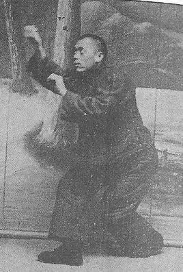
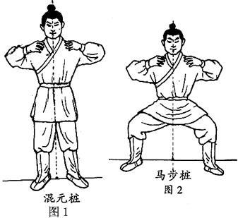

薛颠论武：薛颠论武：【象形拳法真诠》中的描述： “盖武术一途，分内外两家，有武艺道艺之称，练武艺者，注意于姿势重劲力，习道艺者，注意于养气而存神，以意动，以神发也，兹分述如下：

练武艺是双重之姿势也，两足用力中心在于两腿之间，全身用力，用后天之意，一呼一吸，积养气于丹田之内，而吸收有益之成分，久之则身体坚如铁石，站立姿势稳如泰山，一旦与人相较，起如钢锉，落如钩竿，起似伏龙登天，落如霹雷击地，起无象，落无踪，起意好似卷地风，束身而起，长身而落，起如箭，落如风，追风赶日不放松，拳经云，足打七分手打三，五行四稍要合全，气连心意随时用，硬打硬进无遮拦，此谓之浊源，所以为敌将之武艺，固灵根而动心是也，若练到登峰造极至善处，亦可以战胜攻取无敌于天下也。 “练道艺者，是单重之姿势也，一足用力，前虚后实，重心在于后足，前足可虚亦可实，心中不用力，先要虚其心实其腹，使其意思与丹道相合，进退而返，毫无阻滞，进则如弩箭在弦，发出直前而行，退则如飞鸟归巢，飘然而返，勇往迅速绝无反顾迟疑之状态，而且练习之时，心中空空洞洞，无念无想，其姿势虽千变万化，然不勉而中，不思而得，所谓从容中道者是也，偈曰：拳无拳，意无意，无意之中是真意。心无心，心空也，身无身，身空也，释迦所谓，空而不空，不空而空，是谓真空，其殆道艺之学不二法门欤！盖静者动之基，空者实之本，心中空虚则灵不昩，有大智慧，大明悟发生，如有人来击，心中并非有意防范，然随彼意而应之，自然有坚决之抗力，静为本体，动为作用，正是此意也，盖拳发三节，无有象，如有象影不为能，随时而发，一言，一默，一举，一动，行止，坐卧，以致饮食之间，皆是用，所以无人而不自得，无往固不得其道，以致寂然不动，感而遂通，无可无不可，此是养灵根而静心者之用也。”

*典型单重拳照，动态平衡*

*对比：外家拳的马步桩。双重拳*

可以看出薛颠是很懂拳的人，内外兼通之人。一些人号称自己练内家，却不知外家拳，这就是假内家。因为内家拳的练法，攻防用法，处处是针对外家的，专门用来克制外家拳的。如果你根本就不懂外家拳的拳理和练法，你如何去“练内家”？自然只能是雷雷，保国一类虚妄之徒，闭门造车。可惜----国内有几个人练内家拳的人，会认真研究内外两家的区别呢？很多传武师父，都是自高自大，自我吹嘘，瞧不起外家拳的人。但是一上场，就被外家拳虐个半死，实在是丢人！闭门造车，完全忘记了当年的张三丰的太极是怎么来的---**【张三丰既*精于少林,复从而翻之*,是名内家。得其一二者，已足胜少林】**。别人是深入研究外家拳后，专门找到了外家拳的漏洞，来创立的太极拳，内家拳。就像我们专门研究了泰拳，然后专门去练习能够克制泰拳的内家功法一样，泰拳当然就不是对手了。我们只是学了不到三年的太极拳手，针对性练了一个月泰拳，就击败了泰拳。当然---我们是站在老祖宗的研究成果之上，来做的这件事情。否则是不可能实现这个惊人的结果。

内家拳一定比外家拳厉害吗？薛颠说不一定：**外家拳“若练到登峰造极至善处，亦可以战胜攻取，无敌于天下也”。**内家外家，练好了都厉害。谁说外家拳就不行？泰拳可以说是外家拳的巅峰了。为啥这么多年中国这么多练内家的没有击败泰拳？因为别人练出来了真外家。而我们的内家是嘴炮，是假的。所以，假如某个大师，跟你吹嘘内家拳，却嘲笑外家拳，认为练了一点内家基本功，就可以轻松胜过外家拳，一定是骗子。肯定不懂拳。我们打泰拳，绝不敢轻视泰拳。因为一不小心，就会被泰拳打死的。泰拳的威力，一旦发挥出来，真心很强。

内家拳和外家拳的核心区别是啥？

薛颠说“练武艺者，注意于姿势重劲力。习道艺者，注意于养气而存神，以意动，以神发也”

我估计很多人看不懂这句话。甚至认为是忽悠人的，乱说。啥神，意，气的，看不见，摸不着的。其实没骗人，说的就是真的。

外家拳，叫做“外”的原因，就是“看得到”。姿势动作招式等等，肢体动作，都是看得见的。拳手们天天练的，也是这些东西。但内家拳天天练的，并不是“意念”，而是练功过程的外形，必须用“意气”来练。比如练内家的【马形】---野马奋鬃，不是要去模仿马的外形动作。而是要模仿其意，势，像马奔跑踏践一样，飞身上步，全身压上去打人。每一步都要这样练出来，存心就是“我是马”这样的意念。练出来如同奔马践踏，无往不克。但对于不懂看“意气”的人来说，只是一个往前踏步伸手的动作罢了。

在原来的拳馆馆长，认为孩子们的动作很不标准，没有练好泰拳。就停止安排孩子们去参加比赛，要求孩子们必须每天都去拳馆认真练泰拳标准动作的时候，我与拳馆的副教练，去交谈了孩子们练功问题。我问他：有没有发现，两个孩子们擂台比赛的时候，用的功夫不太一样？他有点迷糊：说，她们也是打泰拳呀？我看跟别人一样呀？没啥不一样的。就是动作不太标准，好好来拳馆练就好了。我就提示他注意一些区别：动作是没有啥奇怪的。但他有没有发现：我们的孩子与泰国拳手不同，她们是移动中攻击的。而正宗的泰拳，是站稳攻击的？他突然大悟---好像这的确不一样。我还说:你是否发现对手一直在退让，躲闪她们？为什么？难道从来没有打过的，原来不认识的泰拳手，都一上场就害怕她们吗？他说：我也有点奇怪，每场都是这样，泰方拳手一直后退躲闪。我说你难道没发现，这些拳手每次主动发起进攻的时候，是啥结果？他想了一下：都被打了。是的，一旦泰方敢主动进攻，一定会挨打。所以泰方拳手都是实战经验很丰富的人，知道这一点攻防的常识。因此不断的退开。反而场下的教练看不到，感觉不到这种压力，都在大叫让拳手主动攻击。但每次攻击都被反击打得很惨。

我还问：你们拳馆，一直对两个孩子不太用泰拳最有威力的泰式扫腿有意见，认为她们不好好用功夫，是偷懒。但你是否发现---场上的泰拳对手，也很少用扫腿攻击吗？要比正常的泰拳比赛，使用扫腿的情况少很多？他也奇怪了。说双方好像都不太用扫腿。我说：原因是扫腿的出腿速度更慢，所以我方更愿意用更快的腿法。里合，正蹬和外摆出击。而不是使用扫腿。至于泰方拳手不用的原因，是他们没机会用出来。我们站架给的距离不够发扫腿，我们的身体还不断的向前移动，破坏了泰方使用扫腿的技术设定。所以泰方也不用了。或者说用不出来。勉强用处来就挨打。

说到这里，这个副教练，总算明白了：原来两个木兰打的根本就不是泰拳。没错----从技术到攻防原则，方式，都完全不同。动作看上去有点似是而非，但“神气”是完全不同的。各位去看纯泰比赛的“神意气”，和木兰比赛的“神意气”有何差别？这就是薛颠说的内家外家的差别了。不懂武术的人，用几个太极八卦形意的动作，说这是内家拳。这是胡说八道的。外形不能说明问题。我们完全可以用拳击的动作来打人，来参加比赛。并完全的遵守这个比赛的规则。别人也承认我们就是打拳击，因为双方的动作很像。但打起来的“神意气”，节奏内涵，依然是内家太极的。未来我们会参加“拳击比赛”的，你们会看到与张伟丽的打法很不相同。我们也可以轻易取得超高的胜率。

薛颠也把除了神意气之外的两个可以见到的区别，告诉了我们。描述了两者的【发力方式】原则上不同。薛颠明确指出----外家拳是“双重发力”，利用双腿支撑，腰胯转动的方式来发拳的发力模式。这种方式，更接近普通人的发力习惯。比如王八拳，就是典型的双重发力。只是一般人没练过的话，协调性，速度力量，准确度都很差，没法跟练过的人比。只要是靠体力来取胜。

内家拳是“单重发力”：也就是单足支撑的发力体系。普通人你自己单足站立，试着用力去打人看看？可能你打出去没啥力量，自己先要站不稳倒下去。因此，“单重发力”，是违反人的本能习惯的，一般人都不会。需要非常特别的方式，才能练出来。也就是内家拳，非有明师指点才能入门的。不能光看外形模仿。因此内家拳很不好学。要学到身体不转动，双足不支撑，手上就发出相当于外家拳的打击力量，甚至更大的打击力，难度是很高的。不过一旦学会之后，造成比外家拳更大的打击力一点也不奇怪。泰国人都说两个木兰的“力气很大”，技术很差。其实是因为她们两用上了超越外家拳的发力技术，显得比泰拳手的力气更大。恰好是她们“技术很好”的标志。但因为泰国人没有看到她们使用她们熟悉的发力技术，误以为她们“本力”超强，就是技术训练不够。所以操心着要提高她们的发力技术水平。认为这样就可以“更厉害”了。

另外，打击的效果也不一样。比如外家拳的打击位移很大，比如一个重拳下去，可能打翻人，甚至打断人的骨头。但内家拳的一个重拳打出来，很可能对方身体没啥动静，不会倒下，但会造成内伤。被击中的对象，不会骨头断掉，但很可能一声都没有，就直接慢慢的瘫倒。因为内家高级工夫的发劲过程极其短暂，甚至看不见。但受到打击的人，内脏会受到非常快速和强大的冲击力，导致强烈的震荡而受伤。表现是当场就喘不过来气，呼吸停止良久，身体不能动很长时间，然后才慢慢的缓过来（我受到过这种打击，所以是我的真实体验）。不过：要练到这种冷弹脆快的打击功夫，一般内家拳手做不到。需要上十年的刻苦习练，所以说“太极十年不出门”。只是---如果仅仅是参加现代格斗这种擂台赛，并不需要这么强大的功力就够了。我认为：我来教的话，练三年就足够了----所谓的【得其一二，足以胜少林（外家）】。因为单重发力的内家拳，格斗原则不一样。就算只是练成初级工夫，也就可以让【硬打硬进无遮拦】的外家拳，没有落手下招的空间。薛颠所谓的【心无心，心空也，身无身，身空也】。就是这个意思。其实换一句大家能够理解的话，就是【因敌而变，避其锋芒，击其虚弱】。

两种拳的第二种区别方式，就是具体的打法上，技战术上，也很不相同。外家拳稳扎稳打，拼硬攻，强攻，身体硬度很厉害。如果势均力敌的双方，拼下来一场拳，打完一场比赛，彼此都会伤痕累累，很难说谁胜谁负，偶然性很大。各位看播求打人，是不是【硬打硬进无遮拦】？好像他大力扫出去的腿，打到任何东西都不会疼一样，不断的花大力击打对方。其实这种攻击，双方都疼。就看谁能坚持下来了。

内家拳是利用单重的优势---灵活，速度快。采取“后发先至”的打法。用身法步法，逼对方出手，然后不防守（没有防守动作），而是抢先直接攻击。这种模式的好处，就是双方如果速度和反应程度，训练程度相当的话，内家拳一定会先击到对方。结果就是对方挨打，或者根本就没机会出手。因为我们的训练，就是“不让对方有出手的机会”。我们要用灵活的步伐，身法，迫使对方必须不断的移动，让对方永远瞄不准我们的攻击点，不能稳定下来发动攻击。各位别忘了---外家拳是要稳定支撑下才能发力打人的，你如果迫使他不停的调整身子，步子，他就没机会打出有威胁力的攻击。最终的结果：就是我方可以毫发无伤的结束战斗。而对方很可能就算是金腰带，也像是不会打拳一样，在场上到处躲避，移动，退让。因为----他不退不行，不退就挨打了。进攻也一样挨打。所以，外家拳跟内家拳打擂台，实在很憋屈。就没有出手机会的样子。

各位认真去看看明晓的太极征泰第九场实战视频。这次比赛，打满了五场，对方实力不错，体重比她还重20斤，她有点打不动。但五场下来，对方连一个有效攻击都没有落到明晓身上。相反：对手被明晓击倒多次。只是明晓的功夫，只是入门级，这些打击虽然多，但还不足以伤害对手。如果明晓是练了十年内家功夫的老手，基本上就是一个照面，双方的手一搭上，就结束战斗了。相信明晓将来会有这种水平的。因为她体验过这种真正的内家功夫：只要敢一伸手，就面对被KO的局面。毫无还手之力。古人说的“犯者立扑”。双方只要功力有高下之分，不用纷纷扰扰的打上五局十局的，基本上一见面就结束了。打新手需要两秒钟，打老手也只需要两秒钟。

古人的东西，真没骗人，你看不懂，是你差了。别去嘲笑古人不如你有见识。你看不起古人，吃亏的是你。我们尊重古人的智慧，我们相信留下来的这些拳经拳谱不是骗人的。今天的我们，正在用古传武技术，在泰拳的母国征战，横扫全泰的拳坛。

最近，由于离开了原来不肯继续为我们安排比赛的泰拳馆，我们新换了泰国的经纪人，帮我们安排新的拳场和比赛，未来一周内，我们会有两场征泰比赛。各位就等消息，等战斗视频吧！看我们用【中华道艺】如何来打【国际武艺】的。这是顶流的内家拳----太极----与顶流的外家拳----号称史上最强的地上技泰拳，进行一场一场的龙争虎斗。看谁才是最后站着的人，谁是笑到最后的人！