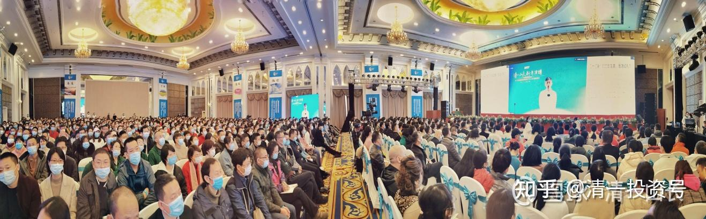
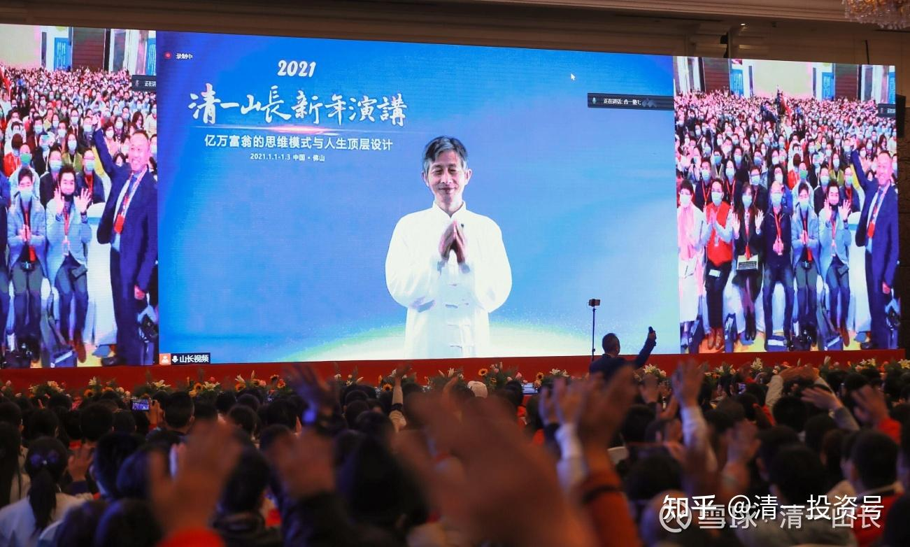

原雪球专栏[101篇.海归富二代患抑郁症，赴死前来上我的“最后一课”！](http://link.zhihu.com/?target=https%3A//xueqiu.com/9310099567/169977706)

清一山长2021年1月26日

我从生死线上拉回了多少人？我都记不得了。还在武大当教师的时候，就有学生说，我的课程救过她一命。我专心去研究和对付抑郁症，是为了我现在的太太。花费了几个月的时间，把她从生死线上拉回来。

现在的这个案例，我几乎忘了。因为我只为她上了一堂课。当时我以为是她的**“最后一课”**，也没指望她能听进去，死马当活马医了。当事人今天公开出来发在我的群内，我才知道很多细节。似乎她在线下的沙龙分享里面，已经讲过她的这段经历了，但我真不知道细节。今天发上来做个纪念。特别提示各位：**您想死之前，最好来找我，做一个心理行为咨询。让我有机会救你一命。另外，我也让你有一个帮助新教育建设的机会。**

苏州慧英：感谢各位老师的点赞和祝福。[笑]我的故事应该有不少伙伴在沙龙听说过了。今天想借此机会，跟大家分享下我的新教育成长历程。
2018年，我是一个严重的抑郁患者，当时家里找遍了不知道多少美国、香港、上海、江苏苏州、广东等地区的心理咨询医生，都没有办法解决我的抑郁症。我们都已经绝望了，我也曾好几次动了了断生命的行动。

而在同年，我的表哥陈汉彪到江苏找我们并推荐了山长的一系列课程。其中课表就有“齐家智慧课程”。当时要去上课的并不是我，是我的长辈家人。但长辈觉得我更加适合去体验这个“齐家智慧”课程。（他们已经拿我没办法了，不知道该如何解救我，觉得让我换个环境去云南走走也好，而且听表哥介绍后，就觉得这个课程有没有可能可以改变我[笑]）。

2018年9月份，我请假了21天来到云南恒大上课。然而第一天不习惯，当时连新教育是什么都不知道[滴汗]完全不知道大家说的是什么。第二天，开始嚷嚷着退课，并且找到当时的助教陈静老师，把我的情况跟她说明。

中午我回宿舍打包行李准备离开（其实也准备去大理结束自己的生命了，觉得生无可恋）。

随后看到班级群里山长发了这样一段话：

“今天是试听最后一天：我下午四点半，送试听的学员一份小礼物——如何用简单有效的方法，治疗好抑郁症。比中国的美国的心理学家的方法都好，治疗效果更彻底。而且不花钱，不劳神，不费劲，简单有效。不仅包教，还包会。当然，你学会了偏不肯照做，就是你喜欢得抑郁症了，我就没办法了。”

我看到了这一段话，我心里猜想山长的这段话有可能是发给我看的。（不管是不是，反正被我看到了，也幸亏我看到了）

明明收拾好行李的我，突然好奇心就启动了，就很想去听听究竟是什么样的方子呢？这么神奇呀！而且不花钱，不劳神，不费劲，简单有效。不仅包教，还包会，有这么神奇的东西怎么我以前花了那么大的力气和精力都没有找到这么好的方子呢？

上课的时候，我满心期待。一首柴可夫斯基的第一钢琴协奏曲就在教室响起来了。当时就不知道为什么，好像灵魂被音乐击中震荡起来，也好像教室里面就有一股神奇的力量，我的眼泪哗啦啦一直流，内心好像慢慢苏醒过来，不再是心如死灰。

一个**齐家智慧课程**，把我的命运改变了。齐家智慧课结束之后，我回到企业，家里、身边所有的人都说我变了，我不一样了。而且同年11月份，慧心工作坊开启，我的长辈家人还说要去云南看看，究竟是什么大神把我给治愈的。

到了2019年1月份泰国财富课的时候，山长再见到我的时候说：“怎么现在看起来一点抑郁症的样子都没有了[笑][献花花] ？”

是的，感恩山长和刘老师的智慧与慈悲大爱，是老师们共同疗愈了我！**老师不但给了我新的生命，还开启了我的慧命**。可以说，他们给了我两条命。[献花花]

2019年6月份7月份我继续上了刘老师的慧心课和山长清心课。

我内心开始重新有了力量，也有了自己真心想做的事业，我辞职离开了公司，开始走进新教育之路。今天刚好是我离开公司一周年了，我走进了新教育，到了昭明学堂当了半年多的明珠班老师。感恩陈静老师和刘天予教练的指导帮助，那半年的带班经验给了我很多启发，也让我开始真正走进新教育。

2020年9月**齐家智慧课程**一周年的时候，我跟当时的齐家智慧同学过俊杰在广东领证结为夫妻。

后来因缘巧合，我又回到广东，那个时候刚好在佛山开启“粤港澳新教育论坛”（后来的2021年清一山长新年演讲），我就去佛山参加会议，也感恩熊杰校长、少金老师、方贵老师等组委会给我的机会，让我可以付出和服务这次的会议。

而这两年期间，无论我怎么变动，唯一没改变的就是消化并且践行**齐家智慧课程**。并在长三角和珠三角地区发起齐家智慧沙龙线下活动和齐家训练营线上打卡。这是改变我命运的课程，我也希望让自己成为能量管道，让山长的智慧和刘老师的大爱可以通过管道传递给更多的人，更多的家庭。

我觉得齐家智慧课程是值得消化一辈子的课程，2021年我们约定一起再度同行。新一年，齐家智慧沙龙和齐家训练营，将会在长三角地区和珠三角地区轮流开启。

祝福你，祝福新人幸福安康，吉祥美满。祝你们一路携手共进，共创美好的未来！

**我在群内的公开回复：**

苏州慧英，你猜对了。当时下午的特别课，的确是专门为你开的专场，是为你而专门设计的课程。因为中午助教找我，汇报了你的情况，说你已经退课，当天就要离开了。但很惋惜，觉得你正在离开你最需要的东西，而且，你离开这里，应该就没救了。虽然她们当时并不知道，你离开就是要去走大理死亡之路的！这个信息我们都不知道。你今天说了才知道的。但你患有抑郁症的事情，是你的推荐人，在你来上课之前，就告诉我们了。所以你当时的病情，我们是大概知道的。

由于**道家秉持“医不叩门”的原则**，就算知道你要死，**只要你没有提出协助的要求，我也不会“送医上门”的。这是违反天道的，除非当事人请求，我们才会介入帮助。**当天，你也不肯来请教我，就自行其是，偏要离开找死去，我们能有啥办法？（**建议各位想死之前，先找我咨询一下有关死亡的事情**。我可能比一般人了解死亡，至少比耶鲁讲死亡课的教授懂得更多的死亡奥秘。我保证：不会劝你“不要死的”，想死就死，我不在意的。但我会告诉你，死亡到底是什么？你需要注意什么问题，避免什么样的麻烦。简单说：**我会提供死亡之旅的旅游指南给你们的**[笑]）

虽然你的表现特别不配合，用退课行为，来贬低了我们的课程价值。但助教依然很关心你的状况，找我想想办法帮你。我就只好当一回江湖医生，出来吆喝一把，死马当活马医了。

我发到班级群内的话，的确也是针对你说的。我算定这样说，你会因为好奇，而跑来看看的。因为你连死都不怕，还怕看人吹牛吗？估计你当时，心中是有点好笑的：你觉得这边疆之地，居然有人敢吹大牛，称自己能治多少国际大医院的专家都治不好的重度抑郁症？只要你还有好奇心，愿意跑来看看热闹，我就有办法治你。结果你真的来了[俏皮]。

你当时来场上听的音乐，也是专门为了你而选择的音乐。柴科夫斯基的“一钢”（第一钢琴协奏曲，柴可夫斯基），磅礴大气，有帝王之相。专治你们这种**“小心眼、小女人、小气病”**的抑郁症。因为**想寻死的人，都是小气鬼**。由于音乐的内容好，加上我们的设备，是我特选的发烧友高级装备，音质特别的好，很有穿透力。而你内心，其实是很有“慧心”的，所以能够接收到这些内涵的信息。如果来人是头牛，就没办法了，对牛弹琴也没用的。这也是你累世积累的福报资粮，我只是用高级类型的音乐，拉回你过去世的“大气格局和记忆”。因为你内心深处，你就是不甘心现在的“小格局”生活模式，才得的抑郁症。你当时在场上的表现，说明这种音乐疗法，的确是有作用的。

当时开这个送给你的**“最后一课”**的想法很简单：就算是你已经退课走了，但只要你来听了这个最后一课。我教的方法，就会产生作用的，会帮助到你的。你应该会记住我教的简单原则，就算你后续的课，你没有留下来继续上，你也会慢慢好起来的。（也没指望你如此低落的心境下，会好好听课的，毕竟课程不是为了病人开的）。就当我在你离开恒大的时候，我送你的一份礼物好了。（没想到你的慧心的确很强，马上就改了主意，第二天就留下来继续上课了，而且状态越来越好。结果获得了最大的改变）。

你当时的运气很好，来上**最后一期的“齐家智慧课”**，现在已经不开了。现在是刘老师的慧心课，取代了它原来的一部分作用——**帮助中国的女人们解脱苦境。**

我现在的课程，主要是**行为心理学课程**，就已经忙不过来了。但这个**“齐家智慧课”**，的确是很重要的，能够帮到你们这些人，很吉祥。现在刘老师的慧心课程，也会很快让各位从抑郁症中解脱出来的。

**老祖宗已经给了我们很多的方便法门，可惜愚蠢的后人，总是抱着西方的一些教科书不放。希望将来我们会有越来越多人，可以去帮助西方人解脱。我们的下一代，就可以做这件很伟大的事情。中国的文化崛起，绝不是去教西方人学古文，让他们穿古装。而是中国人的实力和魅力，让他们不得不拜服，然后他们愿意认真地来学你的文化和传统，穿你的衣服，读你的文字。**

可惜，拥有这个文化实力的中国人太少了，我们只能从头培养起！体制学校是没指望的，你已经上过中外的大学，中小学，你知道根本就没有内涵。希望**我们未来的公主班、王子班，成为中国软实力的代言人。当他们可以像我一样去救治西方人文明病的时候，中国人的软实力、文化实力才能被世界承认。**

让我们一起走在中华文化崛起的路上！祝福大家吉祥如意！

参考链接：

[清一投资号：38篇.亿万富翁的心智模式解析：知与行](https://zhuanlan.zhihu.com/p/464268647)

[2021年清一山长新年演讲答疑](http://link.zhihu.com/?target=https%3A//www.bilibili.com/audio/am32831294)（音频）

[2021年清一山长新年演讲答疑一](http://link.zhihu.com/?target=https%3A//mp.weixin.qq.com/s/_e3YIISLSbUnq7AhjYqQ6w)

[2021年清一山长新年演讲答疑三](http://link.zhihu.com/?target=https%3A//mp.weixin.qq.com/s/dY5vbLFznznk4PhRDcRRpA)

[2021年清一山长新年演讲答疑四](http://link.zhihu.com/?target=https%3A//mp.weixin.qq.com/s/pbdYrqYJXqv8n2gEM8AObA)

[2021年清一山长新年演讲答疑五](http://link.zhihu.com/?target=https%3A//mp.weixin.qq.com/s/AVgqzqK7ZoqZ-vZYu4bHfA)

[2021年清一山长新年演讲答疑六](http://link.zhihu.com/?target=https%3A//mp.weixin.qq.com/s/bo3TromV_40bn9EfdmNT3w)

[2021年清一山长新年演讲答疑七](http://link.zhihu.com/?target=https%3A//mp.weixin.qq.com/s/4EqQVa4mKKAd1XEgwGFy4A)

[2021年清一山长新年演讲答疑八](http://link.zhihu.com/?target=https%3A//mp.weixin.qq.com/s/erfJrxi21aQgzRx3yVQo2g)

[2021年清一山长新年演讲答疑九](http://link.zhihu.com/?target=https%3A//mp.weixin.qq.com/s/IU_K1pZSF31ujJc85SU6nw)

[2021年清一山长新年演讲答疑十](http://link.zhihu.com/?target=https%3A//mp.weixin.qq.com/s/L_Z1yR9I67qJ-JZe7pue2g)

[2021年清一山长新年演讲答疑十一](http://link.zhihu.com/?target=https%3A//mp.weixin.qq.com/s/grWeeVnDdx1Qv6AhPjz3bg)

[2021年清一山长新年演讲答疑十二](http://link.zhihu.com/?target=https%3A//mp.weixin.qq.com/s/20sYMKTy7hY9RRDVn-gvww)

[2021年清一山长新年演讲答疑十三](http://link.zhihu.com/?target=https%3A//mp.weixin.qq.com/s/eCH5y_ywNJ1F00LypmfmiA)

[2021年清一山长新年演讲答疑十四](http://link.zhihu.com/?target=https%3A//mp.weixin.qq.com/s/V80hE-9tLC2S095BldvbSw)

[2021年清一山长新年演讲答疑十五](http://link.zhihu.com/?target=https%3A//mp.weixin.qq.com/s/7tjB3cOsJpUSiP5_huFxjQ)

[2021年清一山长新年演讲答疑十六](http://link.zhihu.com/?target=https%3A//mp.weixin.qq.com/s/gd-2SHhLFqGqPw-mKSVU8Q)

[2021年清一山长新年演讲答疑十七](http://link.zhihu.com/?target=https%3A//mp.weixin.qq.com/s/0bhiFfuncIvXmAtmww7UgA)

[2021年清一山长新年演讲答疑十八](http://link.zhihu.com/?target=https%3A//mp.weixin.qq.com/s/FaC705mS5jEG9bIHb9KroQ)

[2021年清一山长新年演讲答疑十九](http://link.zhihu.com/?target=https%3A//mp.weixin.qq.com/s/wDU9fFGYnsUKKhFs4m8w3A)

[2021年清一山长新年演讲答疑二十一](http://link.zhihu.com/?target=https%3A//mp.weixin.qq.com/s/KmUMob4KUK-2lMuDVny9tA)

[2021年清一山长新年演讲答疑二十二](http://link.zhihu.com/?target=https%3A//mp.weixin.qq.com/s/9LI_1PDyw2LNKVLHRqiqkA)

[2021年清一山长新年演讲答疑二十三](http://link.zhihu.com/?target=https%3A//mp.weixin.qq.com/s/j4aaDHPsvMcNWXrtM_Sa5A)

[2021年清一山长新年演讲答疑二十四](http://link.zhihu.com/?target=https%3A//mp.weixin.qq.com/s/BafQ_fSyFKWph_a6Kvh5eg)

[2021年清一山长新年演讲答疑二十五](http://link.zhihu.com/?target=https%3A//mp.weixin.qq.com/s/BafQ_fSyFKWph_a6Kvh5eg)

[2021年清一山长新年演讲答疑二十六](http://link.zhihu.com/?target=https%3A//mp.weixin.qq.com/s/Ns53F628Eqqz1ODaoIa1Ow)

[2021年清一山长新年演讲答疑二十七](http://link.zhihu.com/?target=https%3A//mp.weixin.qq.com/s/hiusfurwhq-I_33yeQNfmQ)