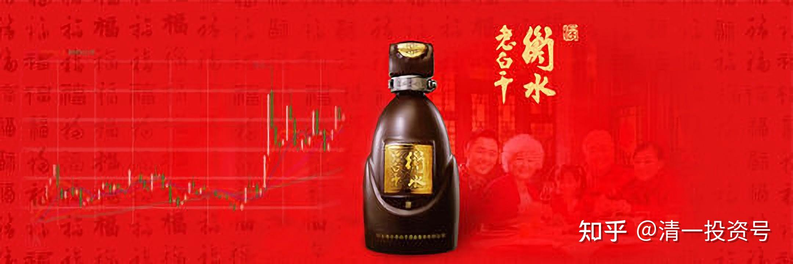
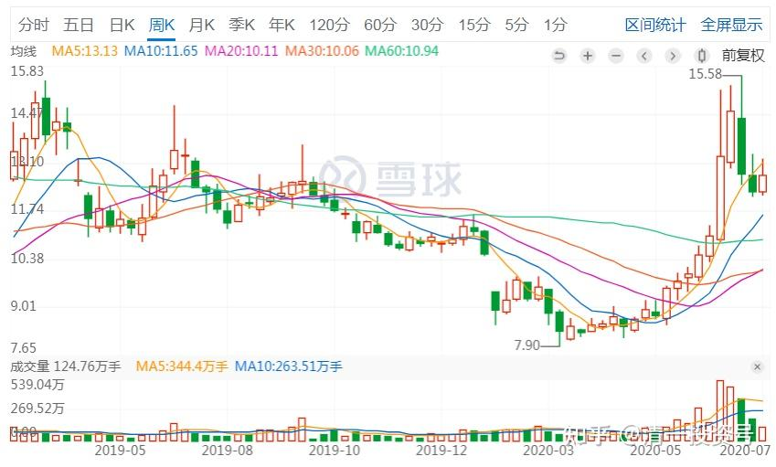
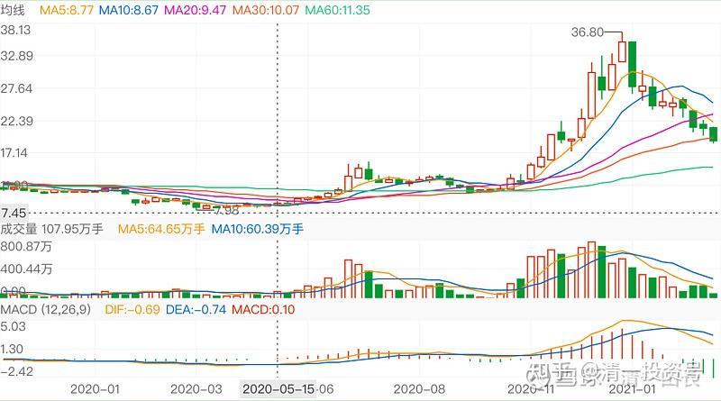
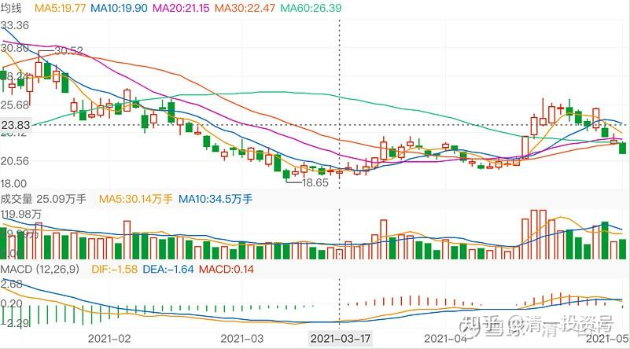
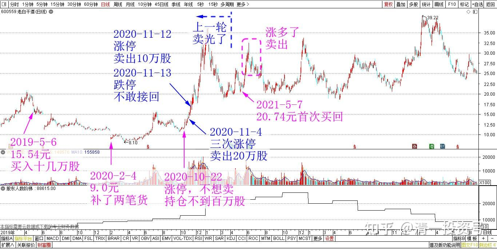
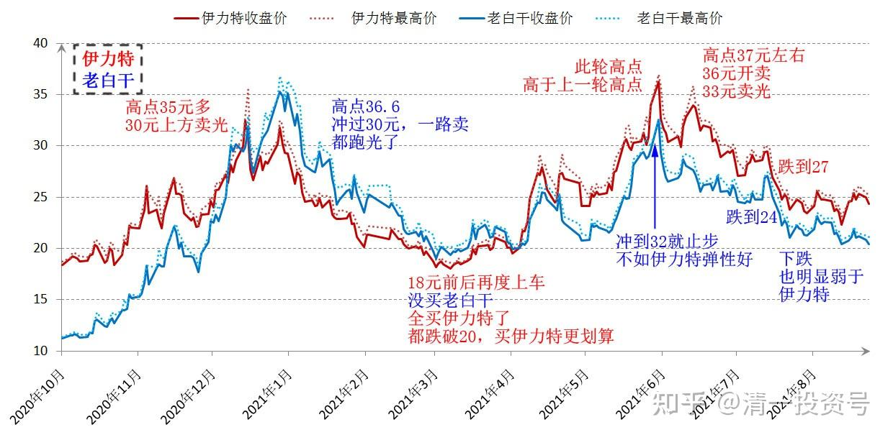

**56篇.白酒系列（一）老白干——人弃我取，人取我予（20230828更新）**

清一山长 2019年5月2～021年7月

**1.跌惨了，建仓**

**[清一山长](http://link.zhihu.com/?target=https%3A//xueqiu.com/9310099567)** 2019-05-06 14:39

15.54，买了十几万股老白干。就是因为他跌得太惨了。我还是第一次买入老白干呢。

**[清一山长](http://link.zhihu.com/?target=https%3A//xueqiu.com/9310099567)** 2019-05-15 16:15

$老白干酒(SH600559)$ 昨天都还在努力加仓中，今天就失去机会了。15元多真心不贵。丰联的并购很成功，难得。最近几年的复合成长也很稳。**在别人不看好，坏消息连天的时候，正是买入的时候。**补回我卖掉老窖和顺鑫的白酒股仓位。在中国做投资，家里没点白酒总觉得不踏实[大笑]，老白干技术分析：从20元的平台跌下来颇不寻常。太刻意了。加上季报我认为有隐藏利润的痕迹，所以跌到15元多的平台，我就开始建仓并不断买入了，目前是白酒仓位前三名了。感谢本次下跌给我的补仓机会。

**[清一山长](http://link.zhihu.com/?target=https%3A//xueqiu.com/9310099567)** [2020-02-04 18:06](http://link.zhihu.com/?target=https%3A//xueqiu.com/9310099567/140453994)

[$老白干酒(SH600559)$](http://link.zhihu.com/?target=http%3A//xueqiu.com/S/SH600559) 今天，9.00补了两笔货。盘面上没有多少买盘，奇怪的是，敲进去后，很快就给我了，都是一笔成交的。第一笔是2万股。我纳闷，就试着放了5万股的买单，也是一笔就给我了。看样子有人盯着等出货。买单有8.99元以下的三笔千手大单，却不主动吃货，像是护盘的样子。尾盘9.00元，9.01元上了千手大单。到底是想卖还是想买？想不通。这点酒，就存起来吧。也许越陈越香。

说明：**老白干不是我的主要投资方向。就是看很便宜，就买一点试试看的。**我比较杂[滴汗]。

**2.多次涨停，卖出一些**

[借股修行](http://link.zhihu.com/?target=http%3A//xueqiu.com/n/%25C3%25A5%25C2%2580%25C2%259F%25C3%25A8%25C2%2582%25C2%25A1%25C3%25A4%25C2%25BF%25C2%25AE%25C3%25A8%25C2%25A1%25C2%258C)回复[清一山长](http://link.zhihu.com/?target=http%3A//xueqiu.com/n/%25C3%25A6%25C2%25B8%25C2%2585%25C3%25A4%25C2%25B8%25C2%2580%25C3%25A5%25C2%25B1%25C2%25B1%25C3%25A9%25C2%2595%25C2%25BF):

老师，老白干涨停了。

**[清一山长](http://link.zhihu.com/?target=https%3A//xueqiu.com/9310099567)** 2020-06-17 12:31回复[借股修行](http://link.zhihu.com/?target=http%3A//xueqiu.com/n/%25C3%25A5%25C2%2580%25C2%259F%25C3%25A8%25C2%2582%25C2%25A1%25C3%25A4%25C2%25BF%25C2%25AE%25C3%25A8%25C2%25A1%25C2%258C):

谢谢各位提醒 [献花花]。这几天，我们一家人出去自驾游了，去了湄公河流域的好几个城市。昨晚很晚才回来，都没看盘。随着中建渐渐的成为主仓，就没看盘的必要了，反正就是纺机的节奏[笑]。老白干还有，**反正跌了我就是不卖的**。

今天看了一下盘，伊力特涨停卖错了。说明我是反向指标。其他还好，没啥惊喜的。上周出清的泰股KBANK每股已经跌掉了17元。长得快，跌得也快。抢了一把泰国的韭菜。继续等待方向中，不买也不卖。

**[成长中的民工](http://link.zhihu.com/?target=http%3A//xueqiu.com/n/%25C3%25A6%25C2%2588%25C2%2590%25C3%25A9%25C2%2595%25C2%25BF%25C3%25A4%25C2%25B8%25C2%25AD%25C3%25A7%25C2%259A%25C2%2584%25C3%25A6%25C2%25B0%25C2%2591%25C3%25A5%25C2%25B7%25C2%25A5)回复[清一山长](http://link.zhihu.com/?target=http%3A//xueqiu.com/n/%25C3%25A6%25C2%25B8%25C2%2585%25C3%25A4%25C2%25B8%25C2%2580%25C3%25A5%25C2%25B1%25C2%25B1%25C3%25A9%25C2%2595%25C2%25BF):**

我的老白干卖飞了，山长您的还在吗？

**[清一山长](http://link.zhihu.com/?target=https%3A//xueqiu.com/9310099567)** **2020-[07-07 10:44](http://link.zhihu.com/?target=https%3A//xueqiu.com/9310099567/153253225)** **回复[成长中的民工](http://link.zhihu.com/?target=http%3A//xueqiu.com/n/%25C3%25A6%25C2%2588%25C2%2590%25C3%25A9%25C2%2595%25C2%25BF%25C3%25A4%25C2%25B8%25C2%25AD%25C3%25A7%25C2%259A%25C2%2584%25C3%25A6%25C2%25B0%25C2%2591%25C3%25A5%25C2%25B7%25C2%25A5): **

买完中建后，我都不打开账户。这个价，有啥好激动的。

**[清一山长](http://link.zhihu.com/?target=https%3A//xueqiu.com/9310099567)** **2020-[10-22 17:37](http://link.zhihu.com/?target=https%3A//xueqiu.com/9310099567/161483938)**

[$老白干酒(SH600559)$](http://link.zhihu.com/?target=http%3A//xueqiu.com/S/SH600559) 燕京没涨停，这个涨停了。可惜我不想卖。这个价不想卖，而且持仓不多，百万不到股级。因为低残才买的，相信它买入的丰联酒业，是很有潜力的。需要慢慢的挖掘。未来是消费时代，不存一点白酒，不好过资本市场的冬天。所以，不破前高，都不想看它。也不想短线操作。结果已经错过好几个涨停和跌停了。**我一直在坐老白的电梯**[滴汗]。

**[清一山长](http://link.zhihu.com/?target=https%3A//xueqiu.com/9310099567)** [2020-11-04 12:00](http://link.zhihu.com/?target=https%3A//xueqiu.com/9310099567/162545153)

[$老白干酒(SH600559)$](http://link.zhihu.com/?target=http%3A//xueqiu.com/S/SH600559) 最近一段时间。**你三次冲涨停，我都根本没理你，连看盘都懒得看，真不好意思。今天你再度涨停了。事不过三，我就该关心一下了。账上动手，卖出20万股老白干，是个意思。表示友好出让一些筹码出来，不吃独食。**

我注意到一点：白酒真的和啤酒不一样。一个上午，成交已经19.44亿元了。涨停板上，依然有十几个亿的资金死死的封锁住涨停板。相反，珠江也算牛股了，珠江、燕京，玩一次涨停。也就两三个亿的成交量。可是珠江、燕京的盘子，比老白干多一倍。资金硬是不青睐啤酒。要把老白干的这资金拿来玩啤酒，啤酒一样要飞天的。我就耐心等等吧。毕竟我的啤酒持仓，比白酒持仓多了一个量级。因为我犯傻了，觉得白酒过热了。其实，我本来有机会买入更多的白酒。账面会更好看的。有点小遗憾。下次有机会再补上吧。

**[清一山长](http://link.zhihu.com/?target=https%3A//xueqiu.com/9310099567)** 2020-11-13 17:58

$老白干酒(SH600559)$ 实话实说，我昨天悄悄卖了十万股出去的。但是我觉得——这股看样子就是要涨的样子，卖出十万股，表示庆祝就行了。超过十元，我也不示范操作的。结果——今天居然跌停！我的成本很低，我倒是无所谓。可是，惠泉涨停卖出后，跌停我敢接回来。**老白干今天也跌停，我为啥就是不敢接回来这十万？胆子还是小了一点。等等看吧。我就不救市了。没这本事！**

**3.低于起涨点补仓**

**[清一山长](http://link.zhihu.com/?target=https%3A//xueqiu.com/9310099567)** 2021-[03-09 23:51](http://link.zhihu.com/?target=https%3A//xueqiu.com/9310099567/173977023)

[$老白干酒(SH600559)$](http://link.zhihu.com/?target=http%3A//xueqiu.com/S/SH600559) 以为永别了，没想到再回头。居然腰斩了——长得急，跌得也快。不可思议。坚守白酒的小散，心里很苦吧？我们的啤酒觉得不好喝，没想白酒更难喝。[捂脸]

**[清一山长](http://link.zhihu.com/?target=https%3A//xueqiu.com/9310099567) 2021-[05-06 20:07](http://link.zhihu.com/?target=https%3A//xueqiu.com/9310099567/179103776)**

[$老白干酒(SH600559)$](http://link.zhihu.com/?target=http%3A//xueqiu.com/S/SH600559) 上一轮伊力特和老白干都卖光了。回落的时候，伊力特因为先跌破20，我就开始拣货回来了。老白干因为没有跌破20，就没有买。这一轮，伊力特居然快速涨上去，高位也减了一点。现在两只股都在回调。如果回补仓位的话，似乎老白干的价位更理想一些。只是——低位的成交好高呀。为啥这样子？继续看看再说。跌破20肯定拣货。没跌破就还是继续看算了。

[清一山长](http://link.zhihu.com/?target=https%3A//xueqiu.com/9310099567) 2021-[05-07 14:34](http://link.zhihu.com/?target=https%3A//xueqiu.com/9310099567/179183620)

[$老白干酒(SH600559)$](http://link.zhihu.com/?target=http%3A//xueqiu.com/S/SH600559) 今天20.74元首次买回原来卖掉的老白干，今天开仓买了第一笔。这个价格，是低于4月15日的收盘价20.75元的，第二天老白干来了一个涨停，连续五天放量上涨超过25元。我觉得：**低于起涨点的这个价格，起码感觉安全系数高一点。如果被套牢，就当原来没有卖好了。**目前的成本，是负的400多元一股，持仓5位数级别。

有趣的是：老白干的年报公布前，前一天大涨6.67%。20亿资金抢进去了。收盘价25.28。第二天跌停，估计聪明的狐狸们脸肿的不行。然后连续四天下跌，应该是抢年报消息的投资资金认输退出的结果。今天买入，纯是好玩。判断老白干跌破20元，应该是很正常的。茅台都跌，你不跌不够意思。

股价是中国建筑的4倍，分红还不如中国建筑。才一毛多钱。这世道，真说不清楚。投机股，玩的。别跟我学。

**4.涨多了，卖出**

**[清一山长](http://link.zhihu.com/?target=https%3A//xueqiu.com/9310099567)** 2021-05-24 14:01

[$伊力特(SH600197)$](http://link.zhihu.com/?target=http%3A//xueqiu.com/S/SH600197) 真不喜欢你出来秀，到处勾引人[捂脸]。今天先放过你。以后敢继续再出来，乱秀身材勾引人，我们就离婚[哭泣]。

**[清一山长](http://link.zhihu.com/?target=https%3A//xueqiu.com/9310099567)** [2021-05-24 14:01](http://link.zhihu.com/?target=https%3A//xueqiu.com/9310099567/180686993)

[$老白干酒(SH600559)$](http://link.zhihu.com/?target=http%3A//xueqiu.com/S/SH600559) 你也一样。都不是好东西

**[清一山长](http://link.zhihu.com/?target=https%3A//xueqiu.com/9310099567)** [2021-06-07 14:57](http://link.zhihu.com/?target=https%3A//xueqiu.com/6451611049/181978787)

[$老白干酒(SH600559)$](http://link.zhihu.com/?target=http%3A//xueqiu.com/S/SH600559) 今天我的持仓，居然有三个涨停的[为什么]。都懒得看了。两只酒股。看样子，国人喝酒是必须的，投资买酒是必须的。

**[欲速则不达-](http://link.zhihu.com/?target=http%3A//xueqiu.com/n/-%25C3%25A6%25C2%25AC%25C2%25B2%25C3%25A9%25C2%2580%25C2%259F%25C3%25A5%25C2%2588%25C2%2599%25C3%25A4%25C2%25B8%25C2%258D%25C3%25A8%25C2%25BE%25C2%25BE-):回复[清一山长](http://link.zhihu.com/?target=http%3A//xueqiu.com/n/%25C3%25A6%25C2%25B8%25C2%2585%25C3%25A4%25C2%25B8%25C2%2580%25C3%25A5%25C2%25B1%25C2%25B1%25C3%25A9%25C2%2595%25C2%25BF):**

山长，您不还有老白干吗？

**[清一山长](http://link.zhihu.com/?target=https%3A//xueqiu.com/9310099567)** **[2021-07-09 15:27](http://link.zhihu.com/?target=https%3A//xueqiu.com/9310099567/189943516)回复[-欲速则不达-](http://link.zhihu.com/?target=http%3A//xueqiu.com/n/-%25C3%25A6%25C2%25AC%25C2%25B2%25C3%25A9%25C2%2580%25C2%259F%25C3%25A5%25C2%2588%25C2%2599%25C3%25A4%25C2%25B8%25C2%258D%25C3%25A8%25C2%25BE%25C2%25BE-): **

**涨了这么多，干嘛不卖？难道我要一直坐电梯吗？**[鼓鼓掌]。现在也正考虑接回来的事情，但与伊力特价格差不多的话，还是谁更稳买谁。

**5.与伊力特比较**

**[小乔w](http://link.zhihu.com/?target=http%3A//xueqiu.com/n/%25C3%25A5%25C2%25B0%25C2%258F%25C3%25A4%25C2%25B9%25C2%2594w)回复[清一山长](http://link.zhihu.com/?target=http%3A//xueqiu.com/n/%25C3%25A6%25C2%25B8%25C2%2585%25C3%25A4%25C2%25B8%25C2%2580%25C3%25A5%25C2%25B1%25C2%25B1%25C3%25A9%25C2%2595%25C2%25BF):**

老白干比伊力特有潜力。

**[清一山长](http://link.zhihu.com/?target=https%3A//xueqiu.com/9310099567)** **[2021-07-10 08:41](http://link.zhihu.com/?target=https%3A//xueqiu.com/9310099567/190002164)回复[小乔w](http://link.zhihu.com/?target=http%3A//xueqiu.com/n/%25C3%25A5%25C2%25B0%25C2%258F%25C3%25A4%25C2%25B9%25C2%2594w): **

此言谬也。光从K线走势来说，伊力特此轮高点，高于上一轮该高点。最近几个月，上一轮高点35元多，30元上方我也卖光了。回调到18元前后，我再度上车的。这一轮高点冲到了37元左右，我36元开卖，33元卖光，现在回调到27元。会不会再跌，天知道。

老白干，上一轮我是持仓数量上最多的白酒股，比伊力特多，因为他跌破10元，害得我不得不多买一点。上一轮高点36.6元。但冲过30多元，我就一路卖，全跑光了。回调到18元的这一轮的抄底，我居然就没买老白干。全买伊力特了。因为：**我认为两个股价格一样，都跌破20，但这个价格显然买伊力特更划算**。所以——的确这一轮她冲更高。而最近一轮的反弹，老白干只冲到32就止步了，远远不如伊力特的弹性好。现在已经跌到24了，下跌也明显弱于伊力特。如果按这个走势，一波比一波低，难说老白干调整的低点，也会超过上一轮的低点，这样就悲剧了。

您居然说老白干比伊力特有潜力。不知依据是什么。没依据，说什么都是拍脑袋。

股市上，拍脑袋是很危险的。可能会让你的兵（资金）分分钟战死的[鼓鼓掌]。

不过，两个股价差在3元左右的时候，买老白干或者伊力特，我认为都差不多。还是可以的。

这就是技术分析。我在惠泉啤酒上，没有说出来的技术分析方式。因为啤酒太娘了，不明显。但我也用一样的方式来做，所以全都赚到了钱。轮动效率更高。

参考链接：

[62篇.白酒系列（二）伊力特——“新疆茅台”（上）](https://zhuanlan.zhihu.com/p/557187863)（整理文）

[64篇.白酒系列（二）伊力特——“新疆茅台”（下）](https://zhuanlan.zhihu.com/p/558774189)（整理文）

[66篇.白酒系列（三）五粮液（上）——好企业还要好价格](https://zhuanlan.zhihu.com/p/561226672)（整理文）

[67篇.白酒系列（三）五粮液（下）——回顾投资过程](https://zhuanlan.zhihu.com/p/563522180)（整理文）

[69篇.白酒系列（四）泸州老窖——切换与比价](https://zhuanlan.zhihu.com/p/565816330)（整理文）

[71篇.白酒系列（五）迎驾贡酒——优秀的分红率](https://zhuanlan.zhihu.com/p/568112813)（整理文）

