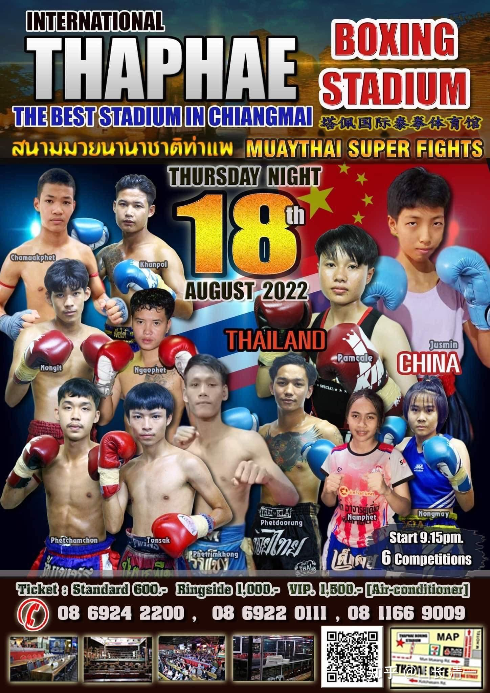
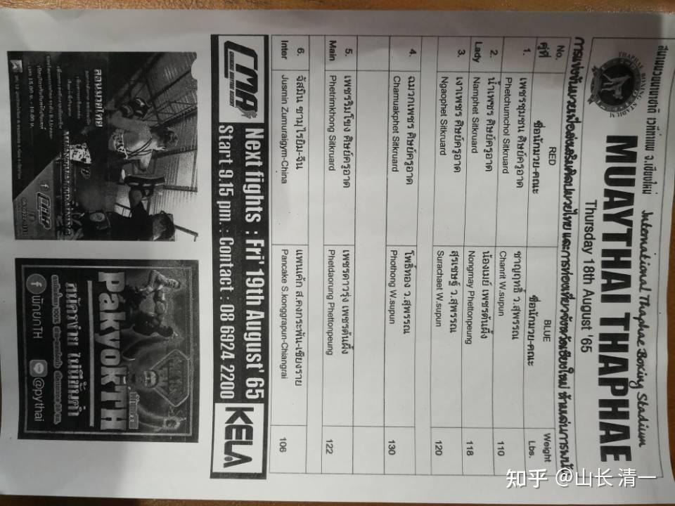
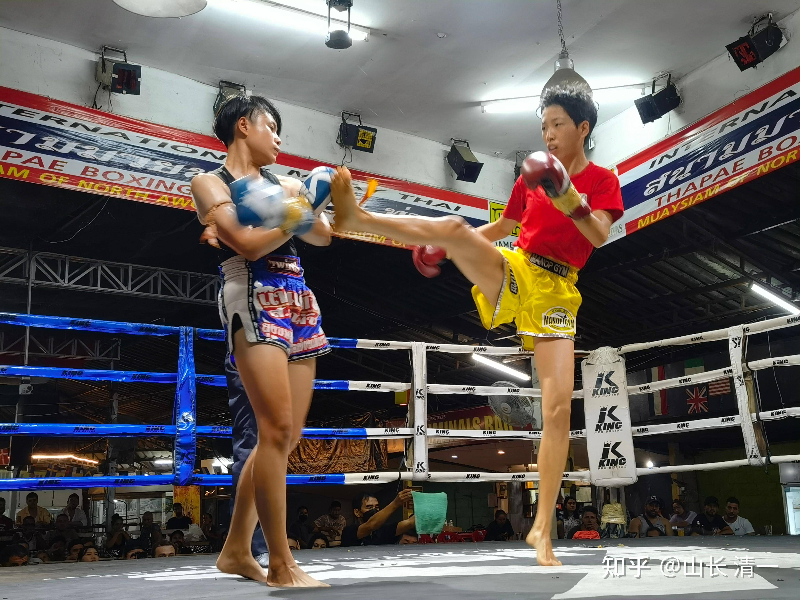
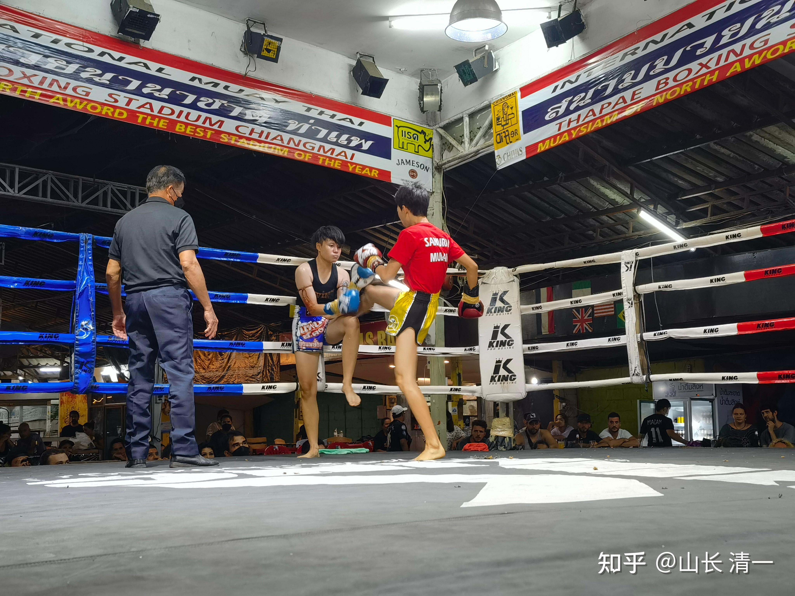
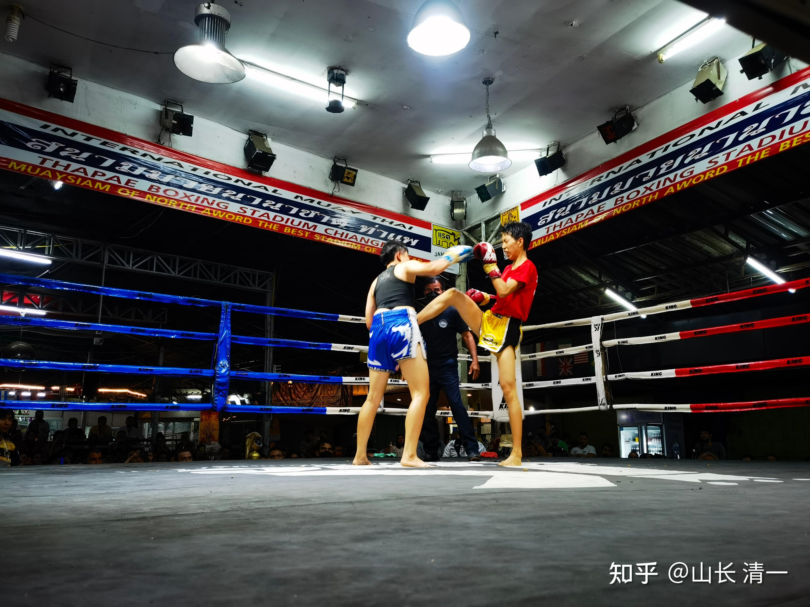
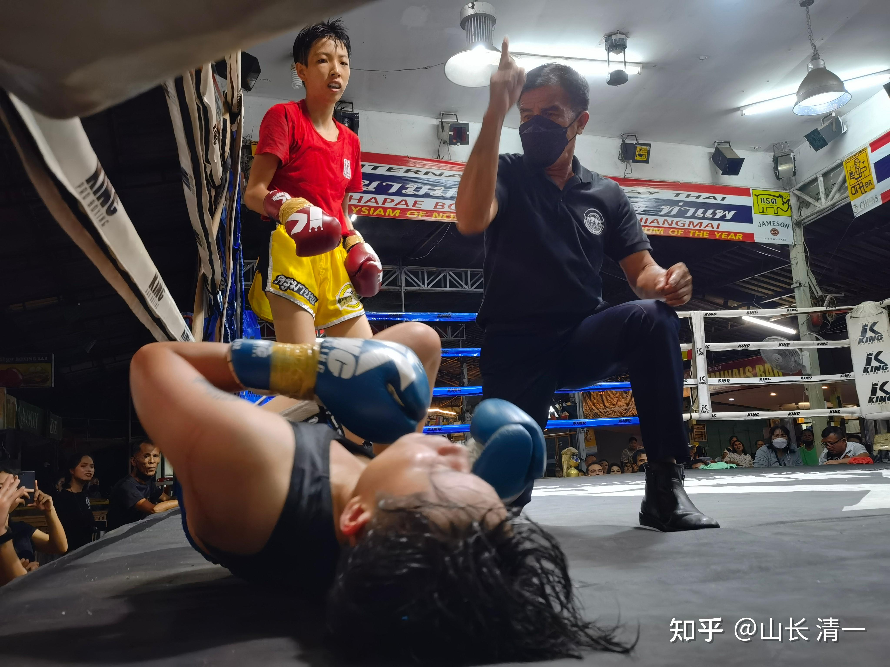
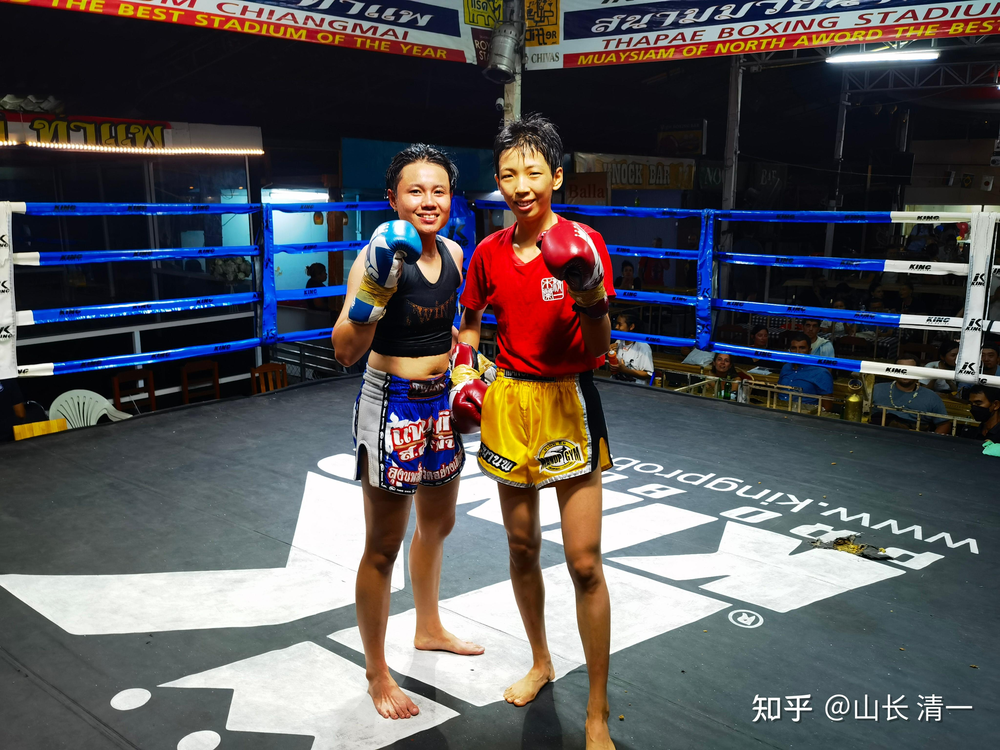
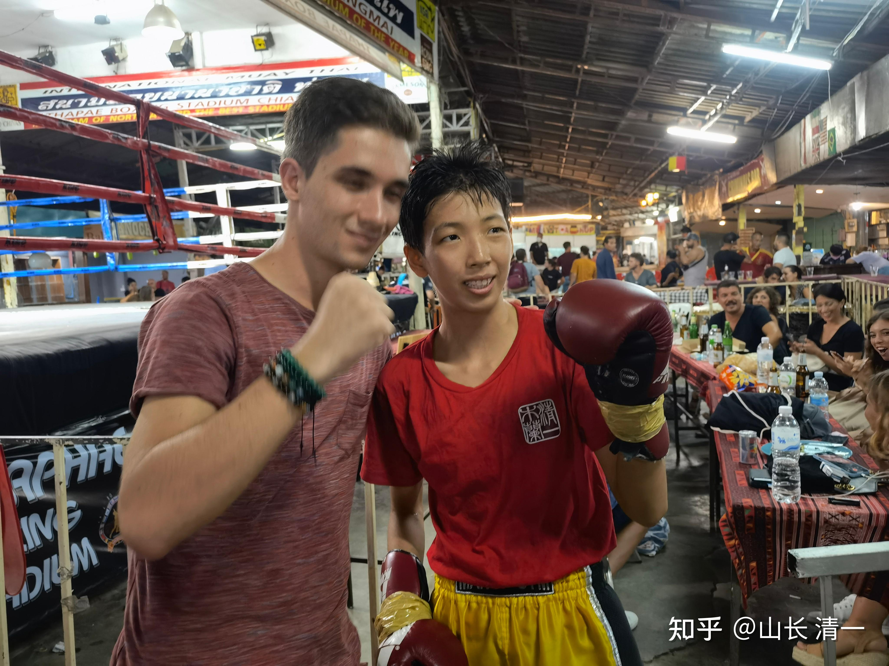
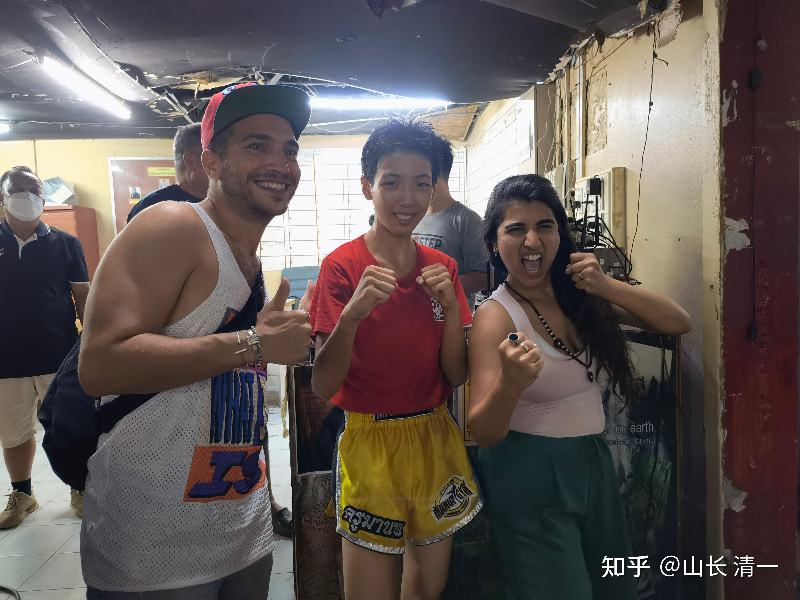

这场比赛，是在清迈的塔佩国际泰拳馆举办的。THAPAE STADIUM

这是木兰们第一场公开代表中国，用“中国功夫对战泰拳”的名义参战的比赛。原来木兰们都是代表一家泰国拳馆来参赛的，所以本次参赛的意义特别大。新的泰拳赛事的经纪人70岁了，在泰国很有影响力，他表示：我们可以用中国功夫的名义参加比赛，的确我们打的也不像泰拳。他先给我们安排清迈地区的比赛，可能还要去南部打几场比赛（可能是芭提雅），给顶级赛事的管理人看她们的实战水平。每人各自打上五六场比赛后，如果木兰们的确表现良好，能够把外围地区的最优秀泰拳手都打赢了，以后就给孩子们安排曼谷仑披尼的比赛。这是泰拳手的最高竞技场。只有每个地区最优秀的拳手，才有资格去参加仑披尼拳场的比赛。这个地方的比赛，相当于是泰国的【全国冠军比赛中心】。由于还有外国的泰拳手参加，基本上是泰拳世界顶级选手的比赛了。多数的泰拳手，一辈子都没有机会进入仑披尼比赛，甚至连进去看比赛的机会都不多。看样子，孩子们可以比原计划更快的实现仑披尼比赛的梦想（原来的拳馆说，拳手至少要在外围，打上50场地区比赛，才有资格去仑披尼比赛）。

*本次比赛的泰方海报*

两个木兰最近一个月都没有比赛，原来已经安排好的一些比赛也被取消了。原因是原来的拳馆，认为木兰们打得不好看，不像正宗泰拳。赢了也没有好处。要求她们必须每天都去拳馆认真训练泰拳技术，不然就不给安排比赛。但我认为：每天去拳馆，会得罪他们更厉害。因为技术实在太不相同了。一周去一次，他们会想到两个木兰的好处。如果天天去的话，每天就只能挑剔她们的技术不对了，而且对练中也种种不适应。会让他们越来越不开心的。所以：大家就只能摊牌了。我们就公开跟泰方表达了态度：我们承认技术还比较差，还有很大的提升空间。现在不打比赛也可以，木兰们就在家里自己练拳，强化技术。等以后技术提高了，拳馆认可我们的技术，同意我们用自己的风格来打比赛，否则我们就放弃用拳馆名义参赛，免得影响泰方在拳界的声誉。但为了避免泰方不高兴，而封杀木兰们，所以也表示了：以后等我们技术提高了，打漂亮了，如果拳馆能够接受我们的技术风格，我们也愿意代表拳馆去参赛。毕竟如果木兰们是代表他们拳馆参赛的，就是公开的帮拳馆做广告。来拳场的人都知道他拳馆的名字，也是一种宣传。但就看馆长的觉悟了。目前馆长正在巴西当外教，9月份才回国。副教练也不能主事。所以---我们就另外找了一个对我们很友好的泰国老裁判，已经70岁了。他表示愿意为我们安排比赛，我方也取得了原泰拳馆长的同意。不管怎么说，作为外国人，在泰国还是入乡随俗。不能跟泰国人随便翻脸，尽量友好处理双方分手的事情。

*比赛水单，给我们列了中国木兰拳馆的名字*

本次的对手是48公斤级的，明晓是41公斤。所以是跨级挑战。从照片上看，这个选手很强壮，手臂比明晓粗壮一倍。而且是少有的男孩发型。泰国女子很爱美的，很少有剪成男生头的。这个女孩显然是更加“男性化”一些，的确场上她打得很猛的。这个选手，明晓打完后的反馈，是参赛以来遇到的攻击力最强的一个，硬度也最强。比上次她打的金腰带拳手更强悍。我看视频上，她的攻击速度快，反击速度也很快，且猛。战斗意志也很强，不断的进攻，以及抓住任何机会来反击。场上一点也不消极。虽然也不断退后。但明显在找机会还击，还在退步中打出高扫，证明技术实力强过一般的泰拳手，没有啥明显的空隙。的确属于实力强悍的对手，不是太好对付的拳手。我们还没去查她的来头，应该也是北方地区的顶尖水平拳手了。而且放在最后一个也有意思。因为标注为核心主场的比赛，是倒数第二场。明晓的比赛，是最后一场，标注【国际比赛】。显然有比较重视的意思。赛后，明晓作为赢家，收获了一群外国粉丝跟她合影。纷纷赞叹中国功夫厉害！扬我国威。我们这一次上场的服装，也是金色拳裤和红色木兰上衣的“中国风格”。

本场比赛的最终结果，没有打满，第三回合就KO取胜了。所以目前木兰明晓保持了六场全胜，三次KO的战绩。虽然场上裁判明显的偏心，关键时刻会阻止明晓的攻击，让小明慧都看不过去了。她场上听到的是裁判对明晓的指责，态度很不友好。不过，在明晓的凌厉攻击下，泰方选手就算裁判帮忙，也根本就没有赢的机会。12:05秒的这次击倒，是泰方拳手高扫攻击明晓头部的同时，明晓用手防住她的扫腿进攻，同时用右腿正蹬，攻击她的腹部。这一击，相当于迎击，力量冲击很大。因此泰方拳手遭到重击，马上就变得身体僵硬，腰部明显的负痛弯曲，并失去了防守反应的能力。而明晓的左腿里合腿根本没有给时间缓冲，前腿一落地，后腿马上就转换攻击上来了，转换的速度也很快，正好攻击在对手的同一点上，泰拳手立即就倒下了。估计很多人只看到后面一下攻击，没觉得有多重。没注意到前面才是重点：泰拳手是腹部连续挨了两下，才倒下的。不过裁判对她的倒下输掉很不满意，毕竟她是代表泰国来打的国际比赛（赛前推广单上注明了国际比赛）。所以场上是激励她起来坚持打的（因为看起来，明晓就是轻轻的一点罢了。这种腿法，泰拳认为是打不出力量来的。裁判大概是不明白泰拳手为何如此脆弱，随便一点就躺下了。其实加了传武的内家抖劲的话，这种打击的冲击力量是很强的，跟泰国的正蹬，力量上根本就不是一回事情）。明晓这两次的太极腿法，不像上次比赛的正蹬，只是把对方击倒，看起来场面更好看一些。但对手的伤害并不大。比如明晓的第一次KO对手的比赛，正蹬击中对方腹部两次，对手连退几步倒下，但身体却没受伤。第九场的明晓比赛，正蹬击倒对方多次，对方是没有退步直接击倒地下的，依然没有受伤。却这一次，对方被击中，身体没有产生退步位移，但马上失去攻防能力，说明明晓这几次比赛中，攻击的力量更大，发劲更脆快了。看起来越来越轻巧，越来越不费力。但真实的力量越来越大，透劲开始出来了。这是明晓在上次比赛后被我严厉批评不会发力后，刻苦训练了一个月的成果，打击力量已经比上次提高了不少。未来木兰们的攻击力会越来越强大的。普通人一拳一脚，应该就能KO掉的水平。职业拳手难一些，但找到机会也可以KO掉，比如这一次的迎击，还有泰拳手在失去反应能力之后的打击，都可以对对手造成KO打击。只是职业拳手由于练过抗击打，平时练习挨打也很多。就算被相同的力道打上，身体会自动的泄劲，所以很难把职业拳手KO。只能抓冷不防的时候，才有可能。其实第二回合，泰拳手就被木兰的腿击中两次头部。又一次明显是比较猛烈的打击，头部看出被重击了。但因为泰拳手很有实战经验，全力的防范，就算是击中头部，也没有给对方造成明显的伤害。换了普通人，这一腿就直接倒下了。第二回中对手也有一次非常猛的高扫上头，明晓反应慢一点就可能被KO，8:42秒。不过明晓是接腿后把对方摔倒了。场面很好看，不过---泰拳是不计分的。因为没有给对手造成有效伤害。这种在被动场面中，依然能够发出快速有力的高扫，的确会让很多新生吃大亏的。似乎这个泰拳手很擅长这一招。只是下一回合中，她又用高扫来攻击明晓的时候，遭遇的就是以攻对攻。一个穿心腿迎击上去，导致她KO了。所以，擅长的技术，一旦被对手掌握，反而成了自己送上去挨打的机会。也明确提示各位：中国功夫为啥没有扫腿？更忌讳高扫？高腿？因为真实的实战中，高腿虽然好看，但对出腿人来说是很危险的。除非直接命中头部，否则很难对对手造成严重打击。反而由于“起腿半边空”，自己很容易在起高腿的时候被对手攻击。因此典型的北腿---戳脚翻子拳，主要是攻击对手的小腿部位。不太往身上头上踢打的。跆拳道倒是喜欢踢高腿。不过遇到我们木兰也一样要倒霉的。

泰拳手读秒后站起来，在裁判的示意下，勉强表示可以继续打。其实她身体已经失去正常的反应能力了，后续面对明晓的进攻，她连正常防守的动作都没有做，与她原来拼命防守反击的表现完全不一样，一直是被动挨打后，再次倒下。因为明晓知道:不KO对手很可能判她负。所以急于结束战斗。并没有给她时间来恢复体力，继续直接攻击，泰拳手抗不过这种密度而沉重的攻击，内围战中体力不支，直接再次倒地。裁判看她动作的确已经反应不过来了，只好宣布比赛结束。不过，泰拳手风度很好，输了也硬挺着。不是像往常的其他拳手一样，一走了之。还在场上与观众和明晓互动了一下。明晓自己对于KO对手有些不好意思，感觉下手太重，有些歉疚，赛后去给她行了一个匍匐礼。让她有些不知所措。

下面先发照片。明天有机会再发视频。可以在我的视频专栏里找到无剪裁的原始视频。这些视频，将记录我们太极征泰的一点一滴。我们用实力一步一步的打出来中国功夫的威风，而不是吹牛吹出来。

补：视频链接

[https://www.zhihu.com/zvideo/1543873773274935296](https://www.zhihu.com/zvideo/1543873773274935296)

*这是太极外摆莲攻击。泰拳手明显更强壮。*

*泰方被击倒读秒*

*拳手赛后合影*

*明晓收获的外国粉丝*

