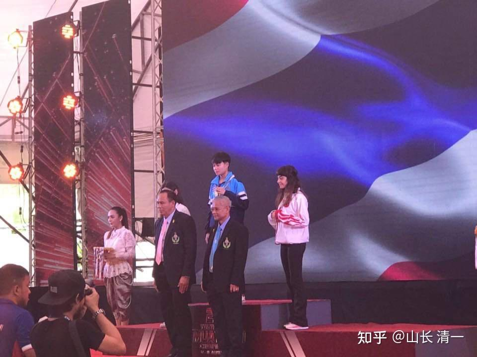
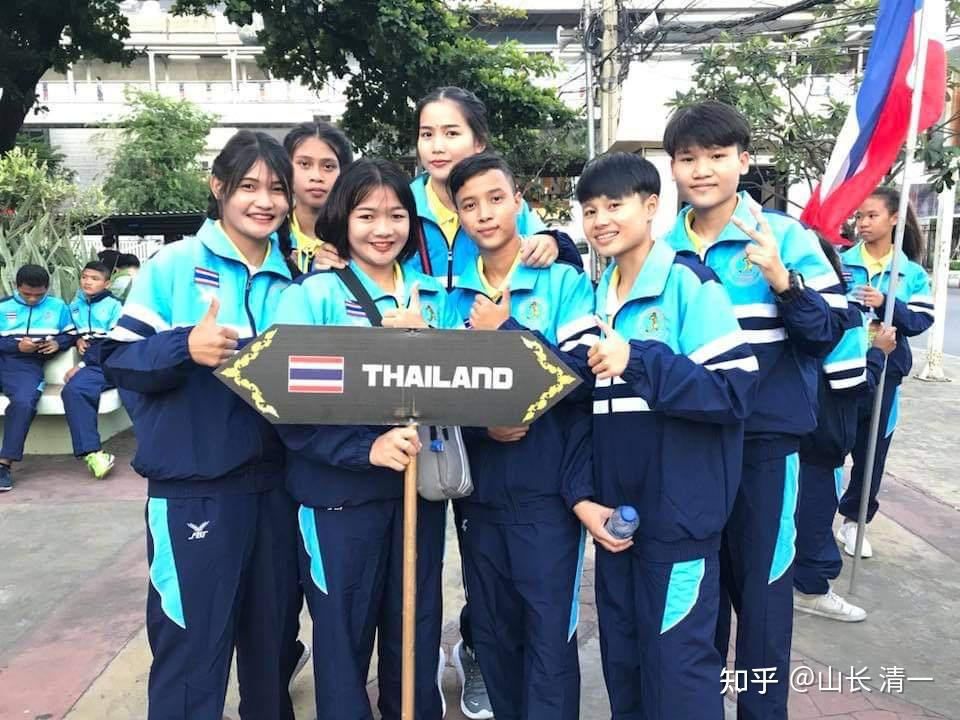
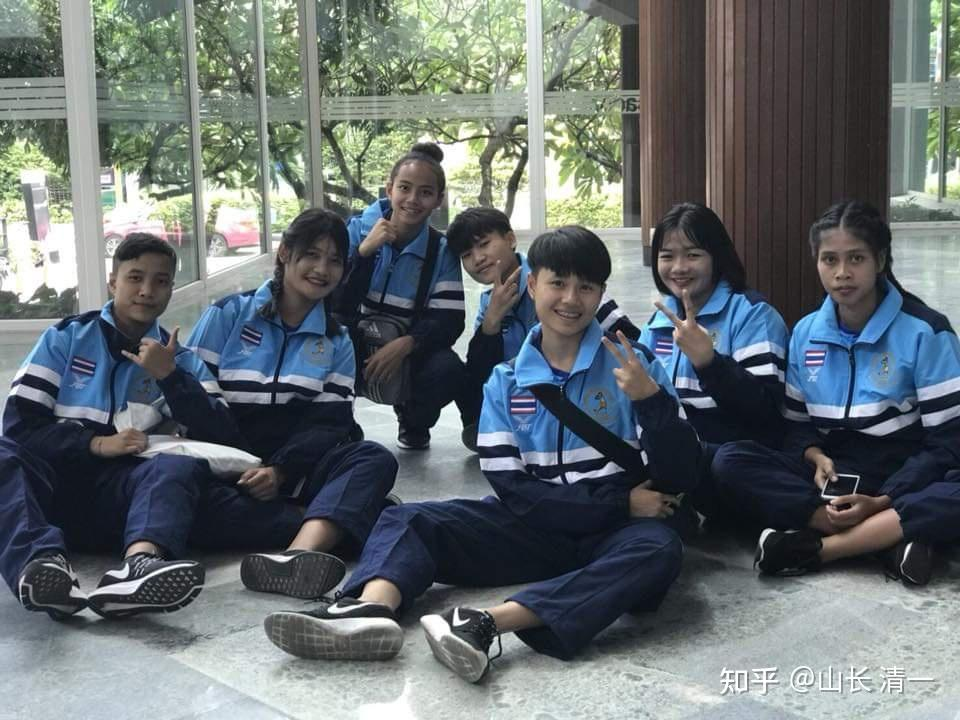
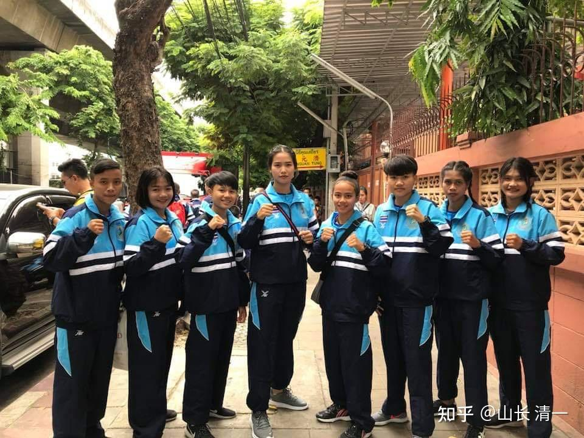
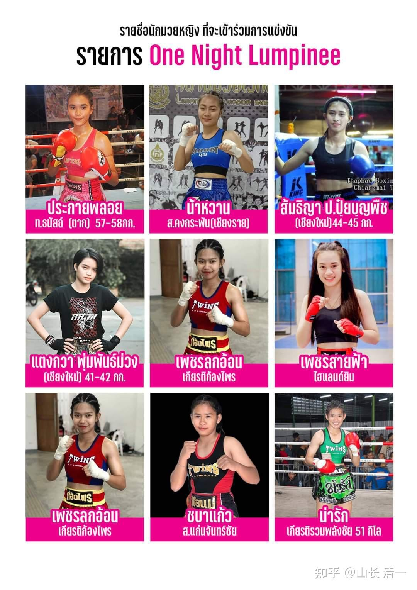

昨天晚上与木兰开打的泰国拳手，我们赛前，一直不知道底细。不知道对方安排的是什么级别的拳手来打。问询泰方人员，也不说实质内容，水平记录等。我说：反正地区金腰带都打过了，没指望泰国给我们菜鸡去好好吃大餐的。就还是当地区金腰带打就行了。没想到----这一回，泰国居然把世界冠军都搬出来“奇袭”木兰，还是重量级超了7公斤的“不平等比赛”。怪不得比赛前，组织者问了半天安排人。大概意思：就是干嘛让这新手外国人，去对我们的冠军？找死吗？

昨晚赛前，最后确认比赛细节的环节，赛事主办方，不断地询问我方的经纪人：为啥要安排明晓与这个对手打？安排明晓比赛的泰方人员说，她原来打赢过某某某（金腰带拳手---后来查出，这个金腰带跟帕卡打过，也输掉了比赛），意思就是她实力够强，差不多两人是同一级别的。但接下来赛事方又追着盘问一句：明晓才41公斤，为啥安排去打48公斤的对手？泰方安排者回答：她自己说的，50公斤级她都可以打的（意思就是当事人愿意，没故意欺负她不懂）。上一次明晓就是打的50公斤对手，结果拼内围体力，把明晓累死了。对方对于越级挑战的事情，总算没话说了。但抱极其怀疑的态度，肯定是觉得双方实力悬殊。既然明晓自己“找死”，就算了（我们当时也不知道她是全国冠军呀）。

不过，我让明晓以后打重量明显超过自己的人，就别去抱在一起硬拼体力战，很吃亏。拉开打，就不担心重量超重了。明晓担心按照她的原始级别，估计没有人跟她打。所以告诉泰方，她可以越级来打，因为她的重量级的确没啥对手。越级挑战，是强烈的自信。泰方赛事安排者，也毫无含糊的利用了这种“盲目自信”。你自己愿意，吃了亏自己担着，别说我们欺负你。

泰国人似乎习惯了低调，不喜欢自我吹嘘。泰国的冠军拳手也很低调，完全不拿架子（你们是否看出来了：为明晓认真进行场间按摩服务的泰国拳手，是现任的（今年）的泰拳国家队的成年组队员吗？她是给我们安排拳赛的老师，让她本场专门来帮忙明晓比赛的）。中国的拳手，拿过一个地区冠军，就生怕别人不知道，到处招摇。但泰国人非常善于“扮猪吃虎”，面对自以为是的外国人，特别会“装傻”。比如泰方会比较喜欢拿一些水平一般的不知名外国拳手，上场与泰国的顶尖拳手去比赛。因为外国人根本不知道对手的级别有多高，哪里想到一个小小的泰国拳场，观众也没多少，不过百人。但这种地方，居然会冒出一个泰拳世界冠军，出来跟你过招呢？结果外国人往往会被打到很惨。我猜这样做的目的，是让外国人认为：随便一个泰拳手都很厉害。从而对泰拳佩服至极，乖乖的去泰拳馆多交钱，学泰拳。我看过善猜打外国人的一些比赛视频。我一眼就看到：双方的实力相差悬殊巨大，根本就不是一个级别的人。就是专业拳手打业余的样子。善猜像是猫逗老鼠一样玩比赛，场上作弄这些外国人。各种动作自然就打得特别的漂亮，招数极其华丽，号称“花招拳王”。其实实力相当的话，这些花招根本就使不出来的。但泰国人就把这种视频剪辑出来，大力宣扬善猜的花招拳王，这些视频传到油管上，到处播放。外国人看了都只能叹息：泰拳太强大了！这也是一种宣传手段吧！很多外国人很迷信他，跑去跟他学。其他拳馆的馆长们不以为然，认为善猜误导泰拳。不过----别人非常赚钱呀！

泰国人自己，也很喜欢看这样的水平相差悬殊的比赛。看到外国人被泰国人打很惨就很开心。我看过外国人被扫踢踢到惨叫，场上到处逃避的样子，让泰国人笑坏了。昨晚的比赛，泰方显然也非常期待拿下来这场“国际赛事”。泰拳手稍稍有一点反攻的样子，有点“攻击成绩”，下面的泰国人就大声的欢呼。可惜她最后还是失败了。当时我见到裁判见泰拳手倒地是很意外，也很生气的，还吼了明晓一嗓子，让她离远点。可见泰国人的胜负之心还是很强的。我方的人员，基本上场外没啥气势。打好了，也没啥人欢呼。客场作战，别做太多指望了。

外国人来泰国打比赛的缺点，就是完全盲区，根本不熟悉对手，不知道对战的拳手，是啥级别的，高手还是新手。因为不懂泰语，外国人连查拳手资料，都不知道怎么查的。可我们的小木兰懂泰语，可以很快从一些信息，就摸出对方的底细，级别。比如佳惠的第三场比赛，轻松KO了对手之后，回去很快就查到：她原来是清迈的金腰带，还把她取得金腰带的这场比赛视频找出来了，后来发现她又拿了一条金腰带。但赛前，赛后，泰方，包括当事人，都没有告诉我们她的级别，档次。还以为是普通泰拳手。

昨天赛前除了盘问上面的话题，确认比赛之后，主办方还问明晓：你打了多少场比赛？说已经打了5场比赛。泰方显示出一副不可思议的表情。估计是：今天你死定了，面对冠军拳手，看你一个新手，怎么撑下去。小木兰们比赛前，一直在追问组织者：对方拳手打了多少场比赛？（没问什么头衔，是想不到这种地方会用最高头衔拳手来打），但泰方人员就是含含糊糊的，没说出答案。安排比赛登记时，参与实战的场次，是拳手的必填项目，怎么可能组织者不知道结果？就等不知情的外国人，上台去闹笑话罢了。

今天我们就查出来了：昨晚这个对手帕开，是北方清莱府人。17岁就入选国家队（青年组）的优秀选手。是2019年48公斤级的泰拳女子青年组世界冠军。之前，她就拿到了泰国该级别的全国冠军，不然她是没资格代表泰国去国外比赛的。这种经历的人，打过的比赛说是上百场都嫌少了。一般来说，20岁左右，就已经打过两三百场实战了。一般来说：这种全国级的高手，很少降级来打地区级别的比赛，奖金只有十分之一。除非特别原因，比如---为了教训一下击败了其他优秀泰拳手的中国人。但昨天泰方的“埋伏奇袭”并没有成功，被我们反KO了。但她的斗志，以及熟练的泰拳技术，明显远超普通的拳手，第一局就给了我们所有人很深的印象。也吓得明晓不敢用炫技的技术去打比赛。

*帕开站在领奖台上的冠军位置。与两边的二三名队服不一样，显然是其他国家的拳手。*

现在，我们把泰国的冠军都打了，还有啥担心的？不太会有更高水平的拳手等在前面了。不过：我相信泰国人不会服气的，会认为昨晚的对手是发挥不好，中国人运气爆棚。泰国选手意外脆弱。后来安排赛事的老拳师，也是资深裁判，他告诉木兰：正蹬技术，在泰国一般是不给分的。除非是像这次一样击倒对方了。因此泰国人也不常用这个技巧。用扫腿更容易得分。如果不是KO结果的比赛，用扫腿的一般会判赢。木兰奇怪为啥会有歧视性的裁判？我告诉木兰---因为泰拳是以对对手的打击造成的伤害程度，来判分的。泰式正蹬，基本上不太可能对对手造成伤害。就像摔跤一样，也无法造成伤害。泰拳就不给分。但泰国裁判不知道---被木兰们正蹬，比扫踢更倒霉。大概职业拳手，只能承受三次发力的正蹬就会倒下，普通人可能一次就玩完。所以当时裁判并不知道泰拳手受到的打击很重。以为是大意了。或者泰拳手身体不好，白白把赢拳机会给了中国人，所以有点生气。

应该泰方，肯定还要找更多的冠军拳手来打我们木兰的。而且估计还是在外围小拳场“悄悄的打”。不会提前告诉我们对手的实力。如果去仑披尼比赛，就是公开的面对全国直播，多家电视台和全世界的媒体转播，完全向世界公开了我们的存在和级别----连泰国的冠军也打不赢中国的木兰武士，算什么级别？不用说就知道了。不知道将来，泰国人会不会给我们这个机会。原来我以为：这些冠军拳手，只会在曼谷，仑披尼这种全国赛上打比赛。我们没资格去打。要取得机会，必须要额外出钱。我看消息---中国要越级约战一个洲际拳手，开价居然是40万。泰方虽然要价不高，但给几万也是少不了的。没想到---对方居然是把世界冠军白送上门了。很意外。

昨晚比赛完后，几个观战的外国人，就跑来跟明晓说了半天。表现非常的激动，因为难得看到外国人打赢泰国人的案例。说她的中国功夫打得很漂亮，动作很好看。他们很喜欢。 昨天明晓是唯一对战泰国拳手的外国人，而且打赢了。这些外国的游客观众，感情上都自动站在明晓一边，为她呐喊助威，场上大叫她的名字---木兰加油。赛后外国游客也很高兴，好几个人跑来与明晓合影。因为外国人都知道：泰拳手是很厉害的，超级难打。不过---他们肯定不知道，昨天居然是泰国的全国冠军，屈尊来打的小木兰。一个小小的商业比赛，就搬出国家队的大梁来打。幸亏我们的实力强，没有被击垮。我看，一般的外国拳手，真的很难有机会通过泰拳的这种悄无声息的大考，成功走上仑披尼争夺冠军腰带的。这样降级打，很早就把信心打没了。泰国人不会给外国人慢慢在打斗中训练和提高的机会。基本上以尽量压制你为目标。所以，没有跟冠军拼拳的水平，就别来泰国上场打实战比赛。一场小比赛，可能也拿大牌来死死压住你不让翻身。因为泰国的泰拳冠军实在太多了。

仑披尼拳手是什么级别？去打比赛难度有多高？对于绝大多数泰拳手来说，他们一生都轮不到一次去仑披尼打比赛的。这里的比赛的正常奖金，也比地区奖金高很多。大约是十倍清迈的拳场出价。如果用转身肘，飞膝技术击垮KO对手，奖金就是20倍。职业拳手纷纷以能够去仑披尼打比赛为荣誉。名利双收，这是泰拳手的圣地，只有各地区的冠军拳手，才有资格去仑披尼打。也正因为这样，泰国的冠军拳手，除非师父的特别安排，为了表演或者其他啥师门的目的。一般来说，是不会去小拳馆，打这种低级别比赛的，经济上不值得，名誉上更谈不上。电视转播都没有，哪里能比仑披尼？只有极少数顶尖高手，才有机会去打这种名利双收的比赛。孩子们原来所在的拳馆，有一个拳手，已经拿了多年的清迈冠军，实力很强。是“拳二代”，父亲就是职业拳手，一直严格训练他打比赛。三年前就获得清迈冠军了，且一直没有被打败。但一直没有机会去仑披尼。最近才有安排，去打了两次，可见难度很大。

所以，昨晚这个仑披尼的拳手，为啥愿意屈尊来跟我们的小木兰打拳，拿她可以得到的出场费的十分之一？我们刚换新拳馆去比赛，就拿顶尖的全国冠军拳手来打我们的新手了？还超重这么多，越级来战？是要给一个下马威吗？昨晚之前，不知道拳手的正式的姓名（名单上只有小名，而且彩页上拼错了两个字母，我怀疑是故意的。泰文是正确的），就查不到她的个人资料。昨晚打完比赛后，小公主们加了这个拳手的社交号，今天去看她的账号，才赫然知道：原来对方2019年就入选泰国国家队了（青年组拳手）。17岁就代表泰国去征战全世界泰拳比赛，且获得冠军。今年她20岁了，只会更厉害。原来与她一起在国家队征战的队友，帕亚洪，当年（2019年底）就去争夺了K1世界冠军，差一点成功，她认为是裁判黑了（没KO日本人，判平手。她情绪控制不行，加赛中表现中不良就输了，一直不服气）。但去年到今年，这一轮的新比赛，她拿到了日本踢拳赛的第一个泰国女子冠军。地位相当于女版的播求！帕亚洪是45公斤级的拳手，昨天这个帕卡，是48公斤级的拳手。理论上，她不会比帕亚洪水平更差，应该更难打才对。技术水平应该是差不多的，但她的体重更高，因此应该会更难打一些。

*这是泰国国家泰拳队的成员合影*

上面这张照片，是泰拳国家队的合影，应该是青年组的女选手。背景上的队员，应该是少年组的男女拳手。明晓昨晚的对手是前排的右二。拍摄者应该是世界冠军帕亚洪。因为缺少一点正好是她。下一张照片，她就出现了，但缺了另一人（前排正中的这人）。所以可以看出是队友们在参加入场式前，互相拍的照片。

*泰拳国家队拳手在海外比赛的宾馆合影*

女版播求，是上面这张照片中，蹲着在最后的这个人---帕亚洪。在照片最前方的，坐在地上中间的这个人，就是明晓昨晚的对手帕开。她的发型是男生头。因为在泰国，天气热，女孩头发长很麻烦。她不怕“形象”问题，剪个男生头，是为了训练方便。所以从发型可以看出：她是以比赛为主的。帕亚洪场外很“女性化”，留长发，还不如她纯粹。

第一张照片中，帕亚洪没有出现。但照片中只有七个人。这张照片中，帕亚洪在最高的拳手的左侧，帕卡在右侧。我猜第一张照片是帕亚洪拍的，所以她没有出现在照片上。这一张应该是街道上，请人来拍的合照。所以队员才齐全了，总共8人。说明泰国国家青年队女子拳手，是来参加8个不同级别的比赛的。这张照片里面的每个人，显然都是泰国不同重量级别的全国女子冠军拳手。正常情况下，她们都拿了各个级别的世界冠军。

*仑披尼一流女拳手合集*

最后这张照片，是小木兰的得到的仑披尼的宣传单。列出了仑披尼的一流拳手。木兰们发现：里面有两个拳手，已经跟她们交过手了。未来，估计这些高等级拳手都会跟我们打一遍的。因为我们不限制级别。所以----什么级别都可以打。

下周三，是木兰佳惠的比赛。我猜应该不会有“惊喜”了。最多就是全国冠军了。我们等着看结果吧。