预计将于8月24日开战太极征泰第11场。由木兰佳惠出战泰拳手。孩子们设法查清了对手的全名：是phetnamsaeng s.prongsakoron。泰语名字是：เพชรนำแสง ส.พงศกร 。

我给艾拉小公主派的任务，是让她去查背景资料，让佳惠专心备战。

据小艾拉反馈：这个人的级别应该没有帕卡高，没有参加过泰国的国家队，但从小也获得了很多奖牌。看她的比赛，扫腿很厉害，速度快，力量大。她三四年前，有一次争夺冠军金腰带的冠亚军决战比赛。但很遗憾：这一次她没有赢得比赛，错过了金腰带。但她的实力，应该与金腰带是差不多的。所以，也是一个不容小视的对手。

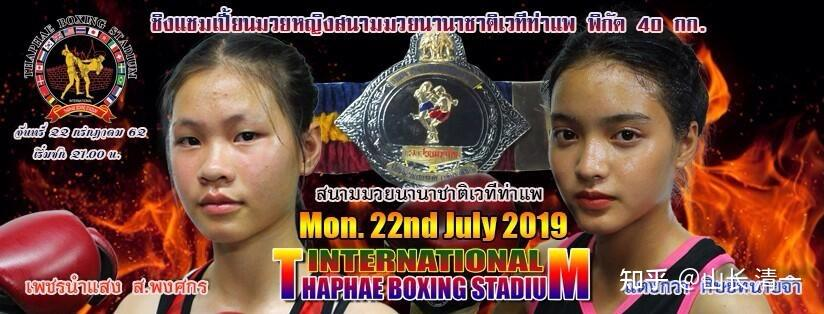

*当年金腰带争夺大赛的海报 她是左边的拳手*

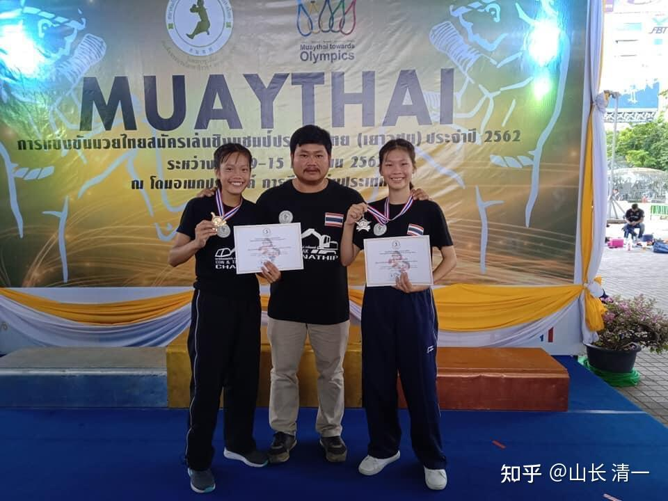

*获得金牌的照片（不知道什么级别）*

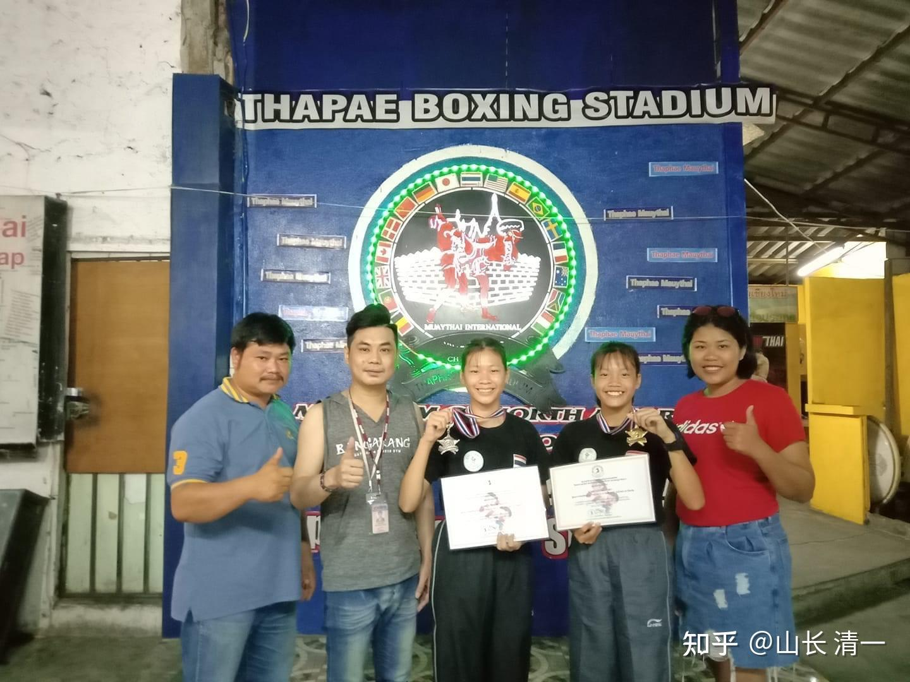

*再次获奖的照片 *

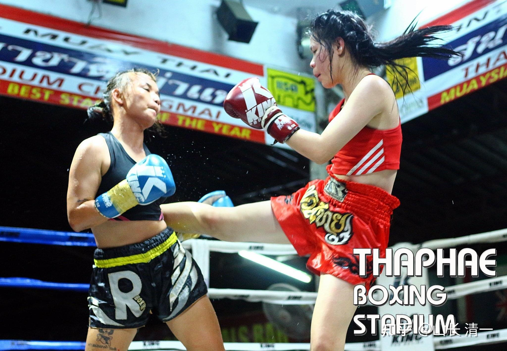

*红衣者：从头发飘动来看，这一腿力量速度都很强。*

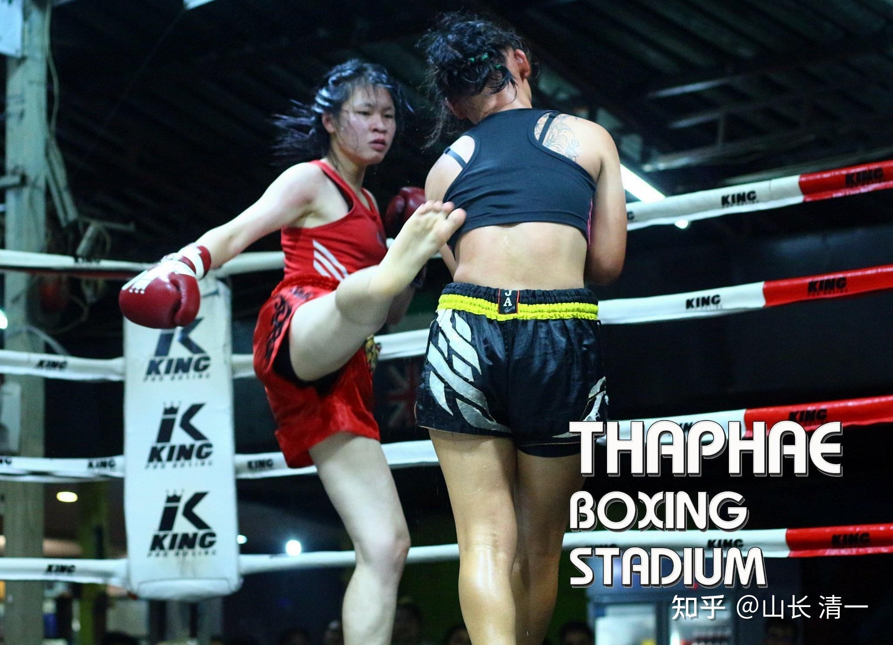

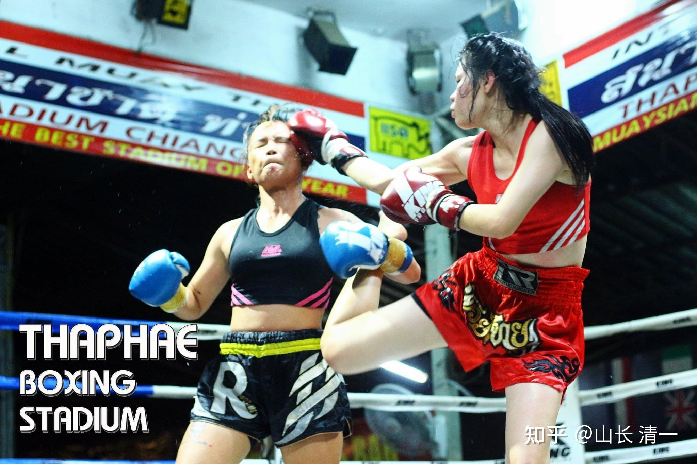

*照片上看，是出扫腿击肋，被对方抱住腿后，她用手击面部迫使对方放手。反应机敏！*

照片上看，是出扫腿击肋，被对方抱住腿后，她用右手拳，击打对手面部，迫使对方放手。同时用力曲腿收腿。这一招要求拳手反应机敏，而且身体的平衡性良好。普通拳手，很难用出来。

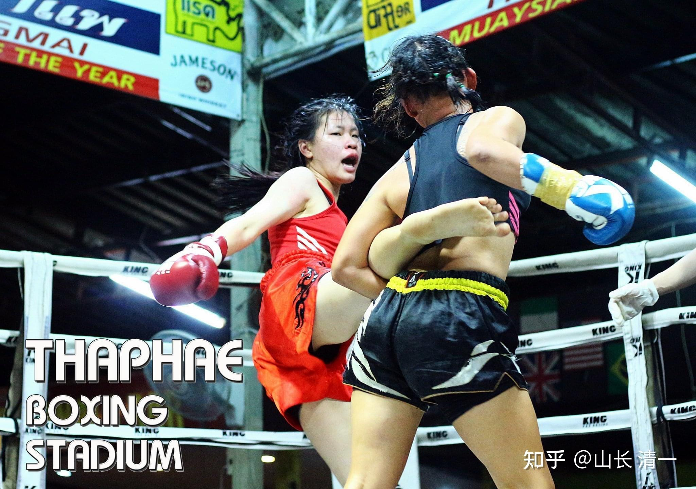

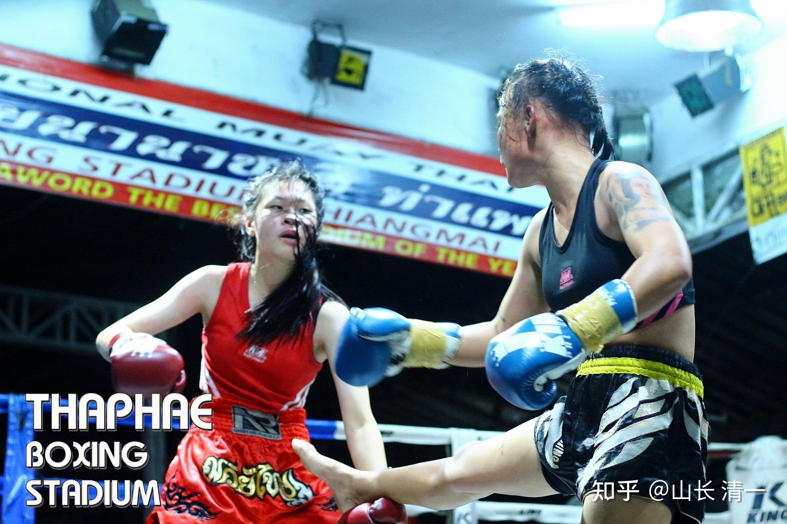

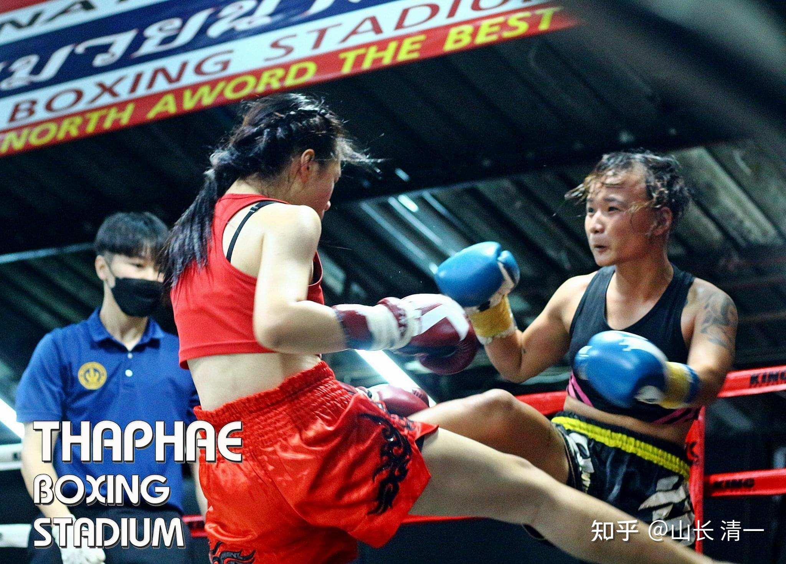

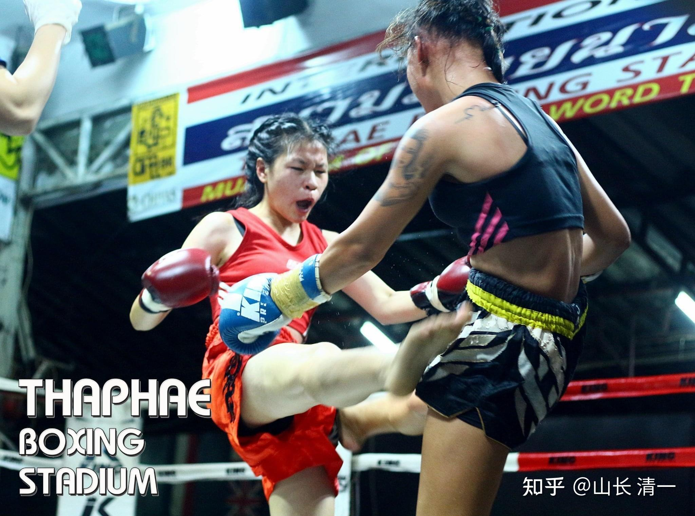

*双方后扫腿同时对攻*

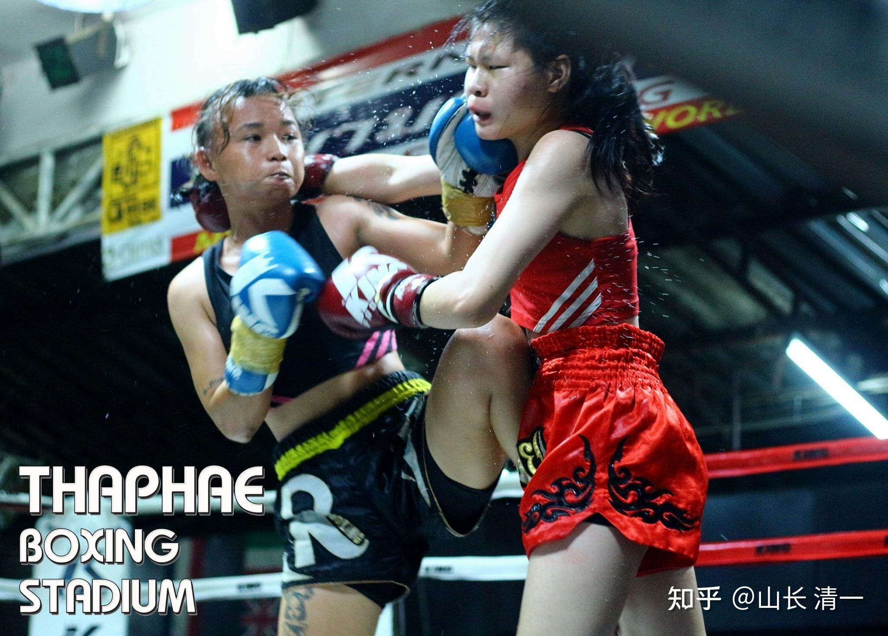

以上照片，是举办比赛的拳馆，为她拍的宣传照（红衣者）。看样子，她是这个拳馆的招牌拳手。这场比赛，她KO了对手。而且，泰拳比赛中，女拳手KO对手的案例不是太多。但这个泰国选手的KO案例却很多，属于实力很强劲的拳手，打法很凶悍。木兰们现在参加的比赛，就是这个拳馆举办的。我们来跟拳馆的“当家花旦”比武，裁判的偏心是难免的。拉偏架也肯定是难免的（我方优势时阻止继续比赛），最终没KO对手，肯定就判我们输。所以，如何应对，应该也是一场艰巨的挑战。

以下是孩子们找到的，她两场比赛的实战视频。今年的新视频，没有找到合适的记录。但最新的消息是：这个拳手和明晓打的泰拳世界青年冠军，打过两场比赛。一胜一负。所以：她的实战水平，显然和冠军拳手的差别不大。只是没有得到头衔?或者是我们没有找到她的头衔？但泰方安排此人来打我们，肯定不会是庸手。

现在看的这两个视频，都是两三年前的比赛，结果都是KO了对手。可见此人的作风很泼辣。我看了视频。发现此人不仅仅腿法很凌厉，膝法也厉害。两场比赛，都是用腿法开路，最终用极其凶猛的连膝KO对手的。特别想到：这个泰国拳手，在已经争夺金腰带的时候，当年的两个小木兰，还是武术上的小白。现在对手又多了两三年的实战和训练，应该更难对付了。到底这场中国功夫与善于连锡，连膝的泰拳高手对战，鹿死谁手呢？

周三晚上的比赛：木兰佳惠，能顶住对手的有力攻击，不被她KO吗？我让木兰佳惠用“不够擅长”的拳法来应对对手的连膝进攻，扫腿进攻，用手战来打脚站，已经违背了中国古拳经【手是两扇门，全凭脚打人】的教训，会不会上场去吃大亏？中国功夫，如果只用拳法，能否顶住和封杀泰拳手的各种大力扫踢，肘膝攻击？这些疑问的解决，只能用最终的实战比赛来回答。大家就等着周四，看结果吧！

[!\[image\](images/img_012.jpg)

第11场对手的比赛视频 https://www.zhihu.com/video/1544728600452214784](http://link.zhihu.com/?target=https%3A//www.zhihu.com/video/1544728600452214784)