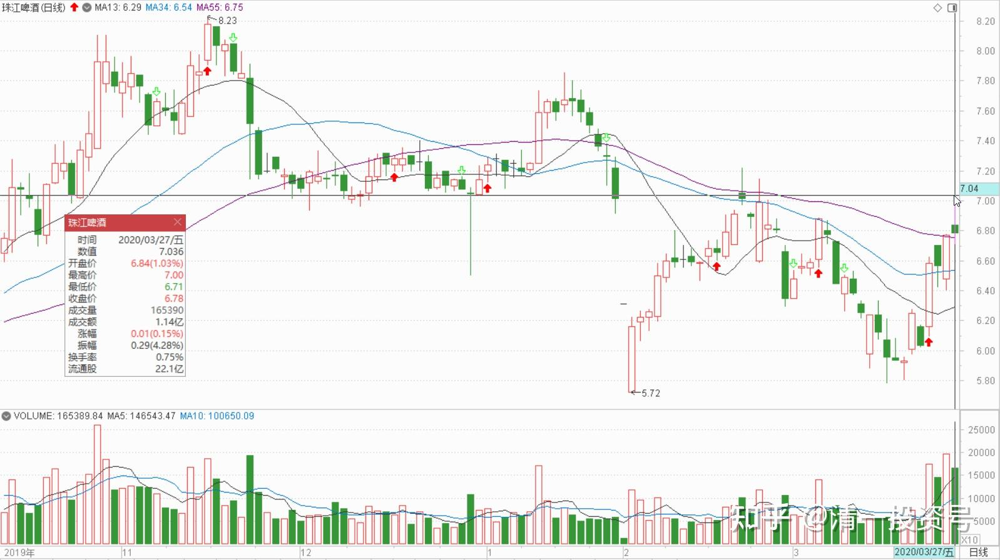
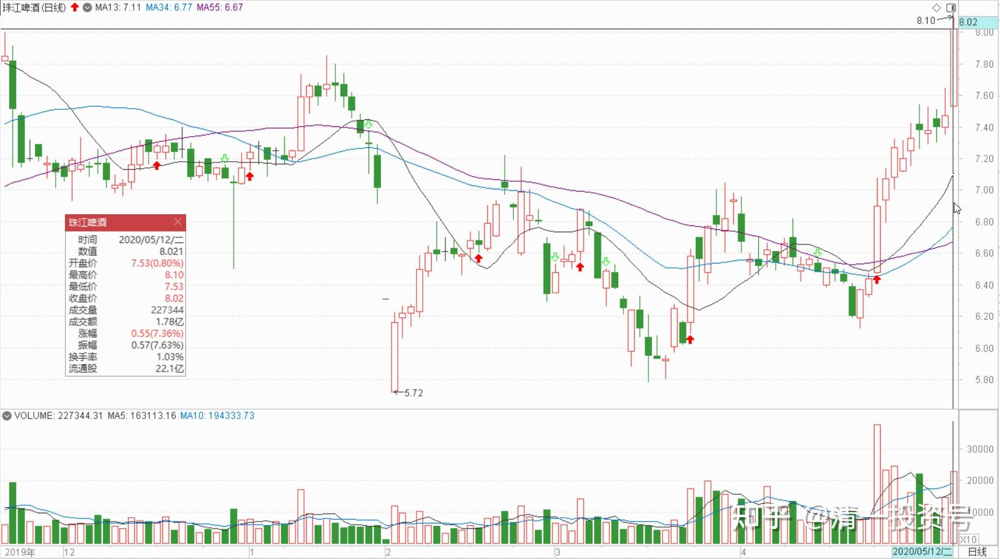
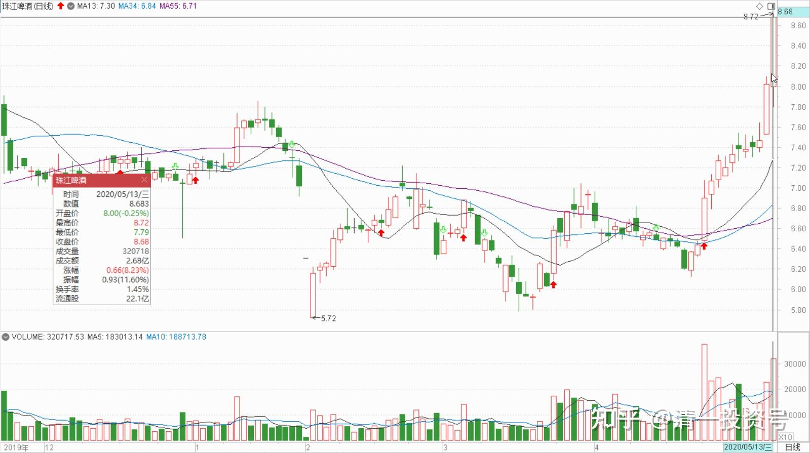

61篇.顺鑫农业记录七——机构坐庄三招：养、套、杀

清一山长 2020年3月-5月

题记：清一山长2022年6月7日“大家可以参考顺鑫农业原来的走势，这就是“长庄股”的走法。我甚至有点怀疑，现在的**就是原来的顺鑫主力。当年这个顺鑫的老庄，也是恶心人恶心得要死的。把很多老手都熬垮了。很多人刚涨一点点就走了。我是中途进场的顺鑫，都被这庄傻熬了两年。幸亏后来守住了，结果还算不错。主升浪的钱赚到了，吃了鱼头和鱼身子。虽然最后的晚宴中，似乎鱼尾巴最好吃，但我们就别指望吃全了。”

**一、超级有心计的主力**

清一山长：2020-03-28 10:03:16（主贴1）

$珠江啤酒(SZ002461)$刚才认真看了K线图，12月基金的大进货，**是冲8元后再跌到7元完成的吃货，所以，这批基金的持仓成本，应该是7.3-7.6元，**目前还是亏损的。看样子，基金是故意打压进货的，操盘水平不错。后来冲7.7元后再度跌下来，量能并未放大。应该基金还是在吸货。年后的大跌，瞬间探底5.72元，**是明显的震仓行为。**其实6元以下成交的很少。，中间强势上升超7元，做“反弹假象”，实质是洗盘成功。3月17日再度跌破6元，完成最后的震仓，10天来形成单边上涨强势行情**，**量能放大不少。甚至比原来冲8元时候的量更大。说明这一次主力利用金融危机导致的持股心态不稳，**拉升进货成功。**本次上涨，散户们会认为是被套主力的“拉升出货”行为，大多数散户会借机跑掉的**。**新一批货的进货成本，成功降到了6.4-6.7元左右。**预期一季报机构持股将更加集中，**就算我持股不动，也几乎铁定会跌出十大股东，其实我现有的持股数量，是高于12月底年报数字的。

今年最高的时候，珠江是超过5M持仓的。

7元以下，我持有一定要超过4M。

8元以下，应该不会低于3.5M。

9元以后，才考虑减到3mM以内。

其中1mM是底仓，没准备卖的存货，计划是长期持有，假装自己是巴菲特买的可口可乐！持有25年？

曾乐天:回复@清一山长:（评论主贴1）

山长操作认知与手法的无私分享，让人敬仰。

个人有个思考：如果基金（庄家）看到这些文字，会不会改变其操作手法？

清一山长2020-03-28 15:40:41回复@曾乐天:

我发言会有影响吗？当然会

第一：他们肯定会很讨厌我的，“察见渊鱼者不详”。目前我作为唯一的自然人十大股东，肯定很扎眼。他们巴不得我早点退场干净一点。**我把观察出来的信息告诉大家，是分享分析方法**。但被分析的人绝对不会高兴。但总算让他们高兴的是：很多人其实并不相信我的分析。，他们还是更喜欢跟着感觉走。

第二：他们肯定会改变一些办法。比如，发现我就是赖着不走，他们就不会好好的地拉升，会设法消耗掉我的意志。也许等我受不了跑了，就会大幅上涨了。其实我都很后悔几次上8元我没有全抛掉。否则我珠江上赚到的钱可多了。总是坐电梯。但我一想到重庆啤酒涨得多离谱，PB高珠江很多倍，就忍住了继续坐电梯。所以，只要我还在里面，也许您就赚:不到快钱。我走了就会大涨了。**（顺鑫农业似乎就是这样的，我走掉后涨到我都看不懂）。**谁让我讨别人不喜欢呢？

明达野老:回复@清一山长:（评论主贴1）

认同山长关于主力拿货的判断。同时，我在上周五6.95-6.98元出掉了一部分头寸（主仓几乎没动），因为我看到这样一个有意思的现象：居然在势头正好时，尾盘上零散的挂了上百万的货，其中一个价格档位是50万股，但是偏偏没人摘，而昨天，**经常会出现闪挂闪撤的零散的10-20万股为单位的卖单，当突然出现30万股+的货时，主力一口气就吃掉了，在买盘上，则是隔着价位分挂的10-20万股左右的单子。**这种挂盘手法，让我在思考：

1、是否是主力还没吃饱，通过压盘继续拿货？同时等待着4月份不好看的季报继续洗盘、收货（不想自己砸）？而不想自己砸的原因是否是开始担心有人抢他手里来之不易的货（跟风卖盘近两个交易日已经弱下来了，贸然挂大卖盘压是容易丢货的），所以挂卖盘时有些疑虑？（近期高毅、重阳等多家机构都在调研珠江）

2、主力是空中加油式洗盘准备推升（跟风卖盘已经弱下来了），但是选择在当下这个变数较大的大时机下是否费力？是不是要再等等呢？

存疑中，出掉的头寸买不回来就算了，如果有机会，我会再买回。

清一山长2020-03-31 20:01:53回复@明达野老:

解析很好[很赞]！本次逆势上涨，放量，可以有两个可能：**一是机构逃跑了，散户被忽悠进来接盘了。二是散户被吓跑了，机构拉高给一点机会，就都赶快跑路了。**否则无法解释这段时间的放量情况。我认为是主力手中货不够，拉高一点继续进货。比12月进货的价已经低了不少。打压显然是无法进货的，跌的时候无量。说明本股的散户没有跟风的热情。

**主力已经用了两年时间来折腾珠江，不断显示他们的存在。让珠江该涨不涨，该跌不跌的**。到底想把珠江做到多少呢？我很好奇。**前一个类似这样折磨我两年的，主力超级有心计的，是顺鑫农业。**最终给了很不错的回报。正因为顺鑫把我折磨多了，所以30元以下我根本不考虑卖的问题，否则盈利也大大减少了。**（19元涨到22-23元卖，两年大约有六次这样的“规律”，最终多年的老鸟被成功甩掉下车了。珠江这两年，每次到了8元左右就必跌，跌幅20%以上。**这样的规律，也有三次之多了。还要这样再冲高---——回落几次？我也不知道，我就只敢拿一百万来陪他玩电梯游戏，剩下的老老实实的地拿着算了）

珠江到底值多少？会涨到什么价？我不知道。**就是看见珠江有明显主力操控的迹象，才越买越多的。**但看懂了也烦，因为看到主力没出场也不敢走。如果没看懂，涨了就直接卖掉，跌了就直接买进，做了几次之后，成本现在也可以负成本持有大量股份了。**但也正因为守住筹码很不易，所以我也不会涨一点就跑掉的，死陪着他们耗吧!**

**二、机构坐庄三招：养、套、杀**

清一山长2020-05-12 10:20:14

$珠江啤酒(SZ002461)$昨天的走势，尾盘明显是派货图形。但这个价，派货也没有多少利润，而且上方其实没啥压力，已经控盘了。就想主力干嘛不直接拉呢？弄个回调，看起来像“上吊线”的样子。今天就知道结果了----，让昨天拿货的小散们赚钱，培养拥护者，、跟随者。“上吊线”变“盘中回踩行情启动线”了。

**机构坐庄，无非'杀预期，杀持股心态，获得筹码后，就要开始“养，套，杀”三招。顺鑫农业启动前两年，就是“杀预期，掠夺筹码”的模式，让坚持看好的长期持股者拿着恨恨的，后来有点小涨幅就逃跑掉。**不过主力老这样做也不行，这样做下去，这个股就没有人气了，走不远。**为了培养人气，就必须“养股”，不断上升的同时，还要故意打下来制造回调，还要让敢于追入的股民赚钱，自己要吃点小亏，做出赚钱示范效应。**比如昨天拉升，其实很轻松。不需要回调可以拉更高，但下午就是故意打出一个回调来，刺激买气。这些一回调就敢买入的小散，就要让他们今天就赚钱，来个高抛低吸。遇到回调再捡回，不小心就丢了筹码，不得不高价继续买入。这样人气就越来越好了。主力赚钱不能吃独食，要分给参与者的。人气越好，将来涨得越高。

所以，恭喜各位。**珠江大约已经筹码收集完毕，正在养股。不断的小幅涨跌，上移，让持股者都赚钱的时候来了。这是最幸福的时候。**

（中建还在杀的阶段，杀持股信心，这时候要跟主力比耐心），顺鑫农业，如果我没耐心，很早就会被丢下车了。珠江也考验了我快两年的持股耐心，是否快结束考验，进入下一阶段了？（这个【没】字是我加的，需要确认一下）

**三、秀身段，吸引跟风盘**

清一山长2020-05-13 14:57:01（主贴2）

$珠江啤酒(SZ002461)$下午挂了个8.67元的单子，休息去了。刚回来看已经成交了。本次上涨，已经出了10%的仓位。既然这么多人抢珠江，俺也大方一点，分点赚钱的机会给人[滴汗]。看有啥困难户需要救济的。看中国建筑今天挺困难的样子，就5.16元补了1M。也留点现金，准备明天有机会做T玩。

明达野老:回复@清一山长:（评论主贴2）

不带这么同步的[大笑]。我的出货价是8.68元，首笔出货价是8.58元[献花花]

祝贺山长在珠江上大赚！

只是，我出的比例比您多不少（看这两天这么去狂摘，我就送点货出去，做做贡献），出来的资金买了些中建还有其他啤酒股，剩下的资金继续补充我的备用金头寸，因我始终感到不对劲，不知是否有大事要发生。说回珠江，我其实很怀疑最近的拉升非真正的“大买家”所为，更像短炒的敢死队干的活（如果龙虎榜出来，我得看看去，直觉告诉我前期收货的资金和这次拉升的资金风格不相似，这次更像是搅局的快庄资金）。如果是主力，不必要如此去全盘上摘，**如果货拿足了，缓推到8元附近，做个缩量回踩假装冲不过去，再快速推上去吃掉8.3元附近的压盘点火即可，又轻松又能推得更高做得长远，顺鑫就是这么干的。**不过毕竟我不是主力，希望我是错的，这样持有没卖的同学短期可能能赚更多，我就少赚点，学贝莱德的大股东和巴菲特，在这个时候多做点防守，不死就行了。

清一山长2020-05-13 16:17:02回复@明达野老:

真有意思，双方再次同步 [握手]。的确心有灵犀你卖的比我好的确心有灵犀你卖得比我好，进出点掌握特别漂亮。

跟你一样，我觉得现在的势头很不正常，燕京不跟也很不正常。我想的版本跟你的不一样，你认为是游资炒作一把就走，所以避险情绪重。我认为有可能是强庄来抢筹。因为市场上没多少浮码了，只能拉升，强行介入。如果未来真走上重庆啤酒之路，现在多花一两元抢货没啥感觉不好的。

我的依据是：燕京和珠江的市值差不多（今天珠江市值还高了12亿），但珠江花个两千万，就可以进入十大股东，甚至是进入到第五大股东。但燕京至少要1.2多亿，才有可能进入十大。第五大股东，差不多三个亿。两者的市值差不多，说明珠江市场上的浮动筹码很少，大多数筹码已经被锁定了。主力不一定在十大里面。

还有：**两家公司的十大股东，燕京是一股独大，持有51%的股票。珠江是三家机构，占有82%左右的持股。这些持股，理论上是打死也不卖的。市场上能够买到的股票，总共只有17%左右。**这些流动的市值，算算才三十多个亿，加上一些长期的大户锁定了筹码。所以珠江的盘子其实很小。我认为拿3-5个亿来坐庄，就足够目前这样级别的拉升了。所以，我原来一直说：珠江的价格是多少？**取决于这笔资金来决定，爱给多少就多少。我猜想他们以后会涨涨跌跌的，实现控盘利益的最大化这几天，只是在秀身段，吸引跟风盘罢了，不会轻易罢手的。**

**所以，我只出了10%。手上还有不到4M的货，准备跟随主力坐过山车!**

(以上判断纯属猜想，不作为投资依据。本人未来处于不断减仓中，不会加仓，除非做T补仓）

（标题为编者所加）

参考链接：

[清一投资号：29篇.2021年评顺鑫](https://zhuanlan.zhihu.com/p/498221415)（整理文）

[清一投资号：44篇.顺鑫农业记录一：开始关注买入](https://zhuanlan.zhihu.com/p/539035593)（整理文）

[清一投资号：46篇.顺鑫农业记录二：最多输时间不输钱](https://zhuanlan.zhihu.com/p/539203562)（整理文）

[清一投资号：49篇.顺鑫农业记录三：买、卖、拿住股票的理由](https://zhuanlan.zhihu.com/p/543704521)（整理文）

[清一投资号：51篇.顺鑫农业记录四：主力还没有开始减仓](https://zhuanlan.zhihu.com/p/544147559)（整理文）

[清一投资号：53篇.顺鑫农业记录五：中国炒股最重要的技术是保本](https://zhuanlan.zhihu.com/p/544149372)（整理文）

[清一投资号：58篇.顺鑫农业记录六：最靠谱的投资方法就是不炒股](https://zhuanlan.zhihu.com/p/545612289)（整理文）

[清一投资号：65篇.顺鑫农业记录八：基本面的估值修复和主力技术面的空间](https://zhuanlan.zhihu.com/p/560419930)（整理文）

