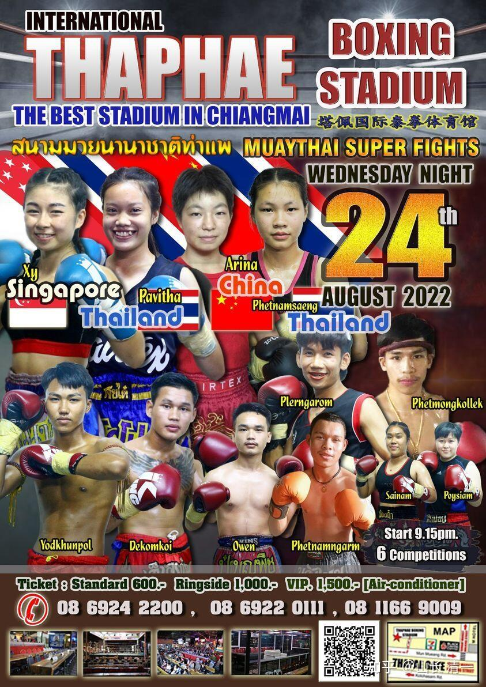

木兰佳惠这次的对手，是扫腿很厉害，内围很厉害的拳手，属于泰拳的传统型，实力型的选手，敢打敢冲。泰拳的青年世界冠军帕开，比赛都输给她。场上她的表现，非常的顽强。传统型拳手，虽然不重视拳技术。但傲气是有的，荣誉感很强。面对中国新手，肯定会死拼。这种拳手，不容小视。

*拳场海报*

据说这个拳手的拳法不咋的。传统的泰拳手，不重视拳法是有原因的。因为远战用腿，近战用肘膝内围。拳的发挥余地很小。这一场比赛，我让佳惠前两局只用拳法去打她。那么：用拳法，真能对付凶猛至极的扫腿吗？似乎很难！理论上是不可能的。因为：全世界用拳的拳手，最强的是拳击。但：用拳击技术就制服了泰拳手的案例，似乎还没有记录。

你们先别看佳惠的视频，先看看这个视频，琢磨如果是你，怎么才能用拳法，去对付泰拳的大力扫腿？

[https://www.zhihu.com/zvideo/1445540798884909056](https://www.zhihu.com/zvideo/1445540798884909056)

看着场面很吓人是吧？的确，如果你采用传统的格斗技术，面对泰拳的扫腿，真的很无助。你不得不去练抗击打，然后忍住疼痛，远距离及时的还他一腿，双方互拼伤害力。最后，谁受不了，谁就输掉比赛。就算赢家，你也很倒霉。有些泰拳运动员，会专门练腿的硬度。用扫腿小腿骨，能把钢管都踢弯，播求三脚就踢断一颗树。拳手经常有记录传出：一些人在场上也会把对手的肋骨踢断，以及小腿踢断的案例。这种硬派扫腿的功力很吓人。泰拳手省过，就是传统实力型泰拳手。就靠他的一双铁腿打天下。他根本就没啥特别的技术，就是死踢你，硬度力度都很强。他的对手，都受不了他的顽强。最终全都败给他了。

泰拳是心最狠的拳种，如果发现你被击中后，身体表现受不了。对手并不会慈悲放手，饶一马。会马上抓紧时间猛踢，连环踢。直到你垮下来为止。前面放出来的视频，帕开和新拳手对付对手的方式，都看到实战中，对手已经被她们打到不行了，已经没有还手之力了。她们不是走开，等着，而是乘机你没有还手机会的时候，猛烈加倍攻击，彻底击垮对手。等泰国人把你踢倒下了，你无助地躺在地上。他们这时候才会“良心发现”。会跑来跪拜你一下。但被痛击的痛苦，你就只能自己承受了，回去慢慢养伤了。上面的视频，就是这样的吗！

[“泰拳之神”善猜最精彩KO合辑！不愧超越播求的传奇拳王_哔哩哔哩_bilibili](http://link.zhihu.com/?target=https%3A//www.bilibili.com/video/BV1AS4y1c7Qi/)

看看这个泰拳王：你怎么对付他？中国人认为他很了不起，但泰国人看来，这人水平一般。就是逗外国人玩的。真实战力，在泰国算不上高手，只是中上。泰国人说他是外战拳手，专跟外国人打，商业性质的。实力是不如泰国本土的厉害拳手，专打内战的。善猜还不够资格当高手。是不是这样，我们不知道，但上个月举办的一场省级的比赛，善猜参加泰国国内的比赛，的确是输了。

木兰们对付的，就是泰国的本土战一众高手。全都是内战拳王呢！她们能对付如此高难度的泰拳吗？还用拳来打？找死吗？

想用拳击打对方？说起来容易，做起来难。因为泰拳的扫腿攻击长度，远远大于拳击的有效攻击长度。而且泰方扫腿，是身子后仰的模式。目的是加长腿击的长度。同时上身后仰，躲在距离你的攻击最远的地方。你要硬拼，打上对手是很难的。距离就不够。

各位想想：面对泰拳的大力扫腿，你还没击中对方的头部，你的腿上，身上，就先受到重击。你哭死也没用了。理论上，用传统的拳击技术对付泰扫，是没啥用的。所以---正宗的泰拳手，对于修习拳法，并不是太在意。远战是，拳就是摆设，主要用于护卫头部被高扫的防卫。如果双方拉进了距离，冲进了扫腿的范围内，泰拳手会用他们的绝招---内围战来KO你。拳击技术根本就没有发挥的空间，他们只是能勉强使用，能防守就够了。实际上，泰拳裁判也很少给漂亮的拳击给分。你打中对手十拳，但对手只是击中你一扫腿。如果让泰国的裁判来判决谁赢？肯定是用腿法击中对手的这位赢。除非你的拳法KO了对手，否则泰国人根本就无视你的拳法。拳场上，如果出现腿法互攻，全体泰国观众都很兴奋。肘膝互攻，也非常的激动，观众跟随大声呼喝。如果是双方拼拳互攻，再精彩，大家都淡淡的，看着没啥兴趣。而且拳法攻击的最大缺点，就是拳套的保护作用，让用拳KO的难度很低。上一局明晓没有带上护套的脚，已经踢到了帕开的头部，她的头部剧震移位，也没KO她。如果用拳，更不可能KO了。泰拳的教练和裁判，以及观众，对拳攻击技术的藐视，直接导致了泰拳手不重视拳技术。所以，普遍泰拳手的双拳技术，都比较粗燥。泰拳真正要打江山，都靠是一双铁腿。以及肘膝盖内围战等。只有在面对K1这种国外的赛事，不许打内围战。这时候近战非得用拳，泰拳手才逼得不得不去研究拳法，以对付短距离的攻防战。

木兰的对手，左右扫腿都很厉害，膝击和内围技术也很厉害。在泰拳规则下，就属于“远战不行，近战也很危险”的完美品种。所以对手属于这种传统型泰拳选手，不太修习拳法也不奇怪。因为几乎就没人能用泰拳规则下的拳法技术，去有效打击她的。我们该咋办呢？

其实有窍门对付的：对付泰拳，如果你站在它的扫腿有效攻击范围内攻击和防守，就像视频里面的对手一样，就是找死。你会被泰扫踢死的。你要么离远点，要么---最好的方式，就是逼近一点，进入到扫腿攻击无效的距离。泰拳手需要有足够的空间距离，才能打出很大力量的扫腿。所以：我教佳惠的应对技术，就是面对这种扫腿高手，不能站在正常的扫腿攻击距离上。必须进入她的扫腿距离内，让她无法起腿。但又不要冲太快，进入内围攻击范围。但她不会傻傻的等着你破坏她的扫腿距离，所以她一定会后移，试图拉开距离，出扫腿。你就必须---继续上步。一步一步的上步攻击，迫使她节节回退。

你这样做，就会逼得对手很难过，她可能就会采取不顾有效距离，就冒险强攻的模式，如果被迫用扫腿主动的攻击你。这就是佳惠的目的：逼对方出招，打防守反击惠就好。此时对手的中部防守，一定是空虚的，出腿半边空。佳惠此时，根本就不要去防她的扫腿，可以由她去任意去踢打。因此这个距离内的扫腿，只有外形，没有力量，无法造成有效伤害。她只管快速的冲上去，用野马分鬃打她中线头部胸部。她出扫腿无效，但自己的“总司令部”却被大力袭击，直接迎击，会很狼狈的。如果对手不及时撤退，就会被佳惠当场击退，击倒。泰拳手此时的应对措施，是近战就打内围战，也不可能。因为佳惠正在迎门冲击，前脚落地之后，佳惠还必须出连拳攻击，只要泰拳手还在自己的攻击范围内，就要不停的连环拳攻击。让她无法近身，近身就挨打。不跟她打内围。让她挨打之后，只能退步避让。

我认为：泰拳手在第一局，就会吃几次亏。甚至被击倒数次。吃了亏的泰拳手，会尽量的避免出招攻击，由于找不到有效的攻击方法，面对木兰的步步逼近，就会不断的退步，消极避战。就像是明晓第九战的拳手一样。当时拳手避战，使得明晓也无计可施，只好冲上去打内围，结果把自己累得半死。

所以，我要求此时，木兰们切忌心浮气躁，依然不主动攻击，不要急于KO对手，不要犯明晓的错误。依然只打防守反击，步步为营，缓步前进，只有对手发动攻击，才突然加速前进，同步攻击。而泰拳的裁判，面对自己的拳手步步后退，会认为对方消极避战，会催促对方拳手进攻。这给拳手的压力更大，更容易犯错误。被逼无奈进攻，又会被迎击打一顿。所以：局面会变成我方无趣地步步前进，对方步步后退。没啥精彩的双方惊险对战搏杀的动作。这样：连续两局，佳惠都可以这样玩。这就是我安排的前两局，要求木兰只用拳法来打泰拳，不用太极三脚去打泰拳手的计划。如果玩的好，对方死拼不退的话，可能就会被提前KO了。

前两局的作战，会严重打击泰拳手的自信心。她会发现自己的泰拳技术根本就没用。但也会忽略木兰们的腿击技术的厉害。所以，可以从第三局开始让她吃吃腿击的亏。我允许木兰们第三局开始火力全开，手脚并用。而还可以主动攻击，连续攻击了。前两局泰拳手，遇到的木兰步步为营，缓慢进逼，会让她恐怖，同时很纳闷。会觉得木兰们虽然厉害，但也没啥特别的本事，只会一招迎击。因此也不难对付，只要自己不主动出击，就没事了。第三回合开始，木兰突然风格大变，各种攻击技术，迎门三脚，太极连环拳法，肘法，膝法都全上。估计泰拳手会被打个冷不防。正常情况，不需要五局打满，就会被KO了。

好了，这是赛前的技术安排。各位看这一次，木兰佳惠，上场后执行了我的赛前安排没有？是怎样执行的？各位看实战视频吧。

[https://www.zhihu.com/zvideo/1546088011623776256](https://www.zhihu.com/zvideo/1546088011623776256)

以上是昨天在赛前，我写的规划和预判。但：实战结果，依然超过了我的预判。

木兰佳惠，倒是基本上执行了我的赛前策略。今天高高兴兴的告诉我：不用喝鱼汤了。但我没想到的是：泰拳对手比我想象的笨，或者比我想象的顽强，这完全超过了我的预期。我以为：她一开始，遭遇迎面的打击之后，会消极避战。我的总体策略，就是针对这种设想来安排的。之前的泰拳手，遇到还没有本次厉害的木兰，也是避战为主。但这个泰拳手，面对打击技术已经明显升级的木兰，居然选择了硬拼死打。结局自然很凄惨了：越拼，死得越快。因为我本次的策略，就是安排了木兰稳扎稳打，步步为营。像个坦克车一样，缓步冲击对手。你不冲锋，到处躲开，场面的确难看一点，但人就不太吃亏。因为我不许木兰乘胜追击，只许她打防守反击。意思就是：你不惹我就没事，惹我，就迎面死打。结果这泰拳手，选择是不计代价的冲锋。勇气可嘉，但谋略不足。结果全程都在挨打。连一次像样的反击都没有。今天早上我遇到佳惠，她很轻松，身上毫发无伤，很早就起来锻炼了。因为她昨天，没有给对手任何“惊险反击”的机会，连还手的机会都没有。比明晓前面几次的比赛，都打得更好。更安心。明晓今晚有比赛，她计划加油赶上，不再自作主张，全程服从师父的作战安排。赛场上执行出来就行了！计划于昨晚相同，所以你们明天看两个孩子，同样的战术规划下，有何实战风格不同之处。

赛前，佳惠一到赛场，来为她做赛场服务的三个泰拳姐姐非常的紧张，如临大敌。一见面就问：你知道你今天的对手是谁吗？她们几个人，都是老拳师的弟子，木兰们原来就在拳馆认识了。去找老拳师安排拳赛，也是几个姐姐牵线介绍的。其中两个姐姐，是现任的泰国国家队队员（你们可以在高清版视频的左边角落，看到她们几个在为木兰加油，木兰打好了，她们兴高彩烈的样子）。这样问佳惠，显然就是她们认为这次的对手非常厉害。担心佳惠不敌对手。上次明晓打帕开，她们都没有这么紧张过的。佳惠说了知道对手的名字，也看过她和帕开的比赛。冠军姐姐就放心一点了。提醒她：这个拳手非常厉害，很难打。扫腿技术很强，力量大，而且肘击技术很好，膝法也很厉害，内围技术一流。所以让佳惠特别小心。特别提醒佳惠在全身，特别是要在脸上，脖子上涂满凡士林，希望在肘击到脸上的时候可以划过去，说多涂一点不会受伤。泰拳手上场打擂之前。全身油光水滑的，原来就是拳王油和凡士林。

佳惠礼貌地表示感谢。心想只要按照师父的指点去打就行了，不需要担心对手打到身上脸上。后来就去拳场外面睡觉去了，我让她赛前离开赛场，避免受到影响，无谓消耗精力。只需要提前一场，进来准备就行了。结果----她上场前都忘了抹任何东西，凡士林和拳王油都忘了抹。说明她真的不在意。因为就不相信对手能够打上她。肘比拳腿更难打到人。这种自信的确有必要。拳手上场，没有豹子对羚羊的心态，而是把对手看成豹子。上场去打，大概率就只能当羚羊了。毛爷爷这话说的很好：战略上要藐视敌人，战术上重视敌人。很有指导意义。

佳惠的对手，战略上倒是做到了“藐视敌人”，看不起中国新手。但她在战术上过于自信，没有重视敌手的变化。不会随着战场变化调整战术，一昧猛攻，结果导致惨重失败，这就是轻敌了！我本来以为：泰拳手开场就受到打击步步后退，木兰不紧不慢，不求进取的进逼，最终场面，就是一个双方奇怪的比赛，互相磨叽，会很闷的。没想到，泰拳手近乎日本军“万岁冲锋”一样的敢于陷阵，让昨晚的比赛，成了一场【太极狂虐泰拳】的单方面表演赛。佳慧丝毫不理对方软弱无力的扫踢，积极地正面硬钢对手，让大家看到了一系列精彩的迎击。各位看到我教的“前进一步”的好处了？太极打死不后退的优胜之处了？

泰拳手虽然拼命扫出硬腿，却常常中途就被卡住，但却伸都伸展不直。就是技术动作未完成，根本不会有力量，自然没有效果。所以，看上去似乎是两人互相换拳，对手扫腿几次都打上了木兰的身子，但结果是木兰毫发无伤，但泰拳手每次都遭到迎面重击。这种交换实在太划不来了。但亏本的生意，泰拳手照样猛做不误。前两局就送给了多次佳惠去KO她的机会。但佳惠不想这么早就KO，场面控制良好，所以就有意压制了自己的发力冲动。至于第三局：佳惠说因为她冲得太猛，而且我允许她用腿了，所以面对对手多次的扫腿，她自然的起腿击出太极三脚。而且佳惠发现对手居然连续重击之下，没有退避，以为她的打击力量不够，结果就是一腿比一腿重。你拼腿我也拼力。结果跟拼拳不一样：拼拳的时候，泰拳手的腿还有机会上身，只是无力。但拼腿的时候，木兰的优势就太明显了。泰方连连中招，不支倒地。最后KO的一腿，就是传说中的“里合腿”，日本空手道称为“三日月蹴”。木兰是用的是太极合劲，发出的一重击腿法。我看位置上，并没有打到对手上次被击中的地方，而是左侧的肝区位置。由于是用大脚趾后面的骨头发力的，这一击的力量穿透力很强。远比“爆肝拳”厉害。对手一下子就憋住气了，手垂下来，腰部弯曲，身体强直，呼吸短暂停止。裁判员一直很关注选手，马上过来隔断比赛。因为正常情况下，泰拳手是乘胜追击，对手失去防守的时候就猛攻的。裁判怕这样把他们的当家拳手打坏了。所以第一时间冲过来护住。不过---木兰们没有这么心狠手辣的，而是“因敌而发”，敌人失去攻击力，就罢手了。当然会失去一些机会，不过：木兰们从来不缺乏机会。这是对自己的拳种和技术，超级自信的表现。不屑于利用别人的弱点，我们专攻你最强的时候。

细节讲解：拳舞--拜师舞。这是来自古代出征的【拜将仪式】的舞蹈。

很传统的实力派拳手，是很崇尚拳舞的。这个拳手的拳舞跳得很好。木兰的几个冠军姐姐开局前，很关心的问：你会跳拳舞吗？显然她们知道对手会跳拳舞。结果佳惠说：如果对手跳，她也跳。姐姐们以为她学过了，就等着看她跳的水平怎样。结果对手认真跳拳舞的时候，佳惠就自己乱跳太极舞。冠军姐姐们看到佳惠原来是这样跳的，大惊失色。看到佳惠看她们，就把眼睛捂起来。意思就是：这是啥玩意？根本就不是拳舞。接下来把手放下来大笑。可能是觉得佳惠太搞笑了，乱跳一气，也不怕丢脸。这是泰拳手认为很神圣的仪式。我们却瞎跳中国拳舞。

对我们来说：对方跳舞，我们傻看才搞笑呢。不如跟随泰拳手热身，活动手脚。什么仪式不仪式的，我们才不管。对方停止了，佳惠也马上停止。进入比赛环节。

一开局，佳惠按照计划，进步拉进距离，直接进到了她扫腿不舒服，但打拳很舒服的位置。但泰拳手很奇怪的没有后退来拉开距离，也没有攻击，而是站在原地晃悠。佳惠被我要求:“对方不攻击就不许还手”的规定限制住了，有点不知所措。正常情况下，对手居然不反应，就应该直接出手打击了。但泰拳手还茫然无知的样子，估计没遇到这种场面。她居然不攻击，但也不退后，这就是等挨打。佳慧只要一出拳，不移动步子就可以打上了她的脑袋。佳惠看看不对，这个距离不让出拳，自己很不舒服，就退了一步让出圈子来。这就是我原来文章中说的“退圈”。正常的拳手，应该对方一进入圈子就出手攻击，或者退开的，不退，不攻，实在奇怪。泰拳手自己，还根本不知道她在鬼门关上走了一圈，依然慢悠悠的晃悠。不知道木兰已经可以打她几轮了。6：03，泰拳手近距离踢了一个扫腿。虽然看起来是击中了佳惠的肋部，显然这个扫腿并没有距离和角度来展开。佳惠想：你敢打我？马上几拳回打上去。泰拳手头部都被打仰了，佳惠还补了一个膝击，才退开。这是我教佳惠的原则：不用防守，以打换打。她如果敢打你一下，你就打她3下5下的。看她还敢打不敢乱打。

按道理，泰拳手这一次挨打，居然毫无还手之力，应该吸取一点教训了。应该躲对手远一点。但她似乎没感觉，依然按自己的节奏来。佳惠也有点搞不清对手的节奏，不明白泰拳手明明会挨打，还漫步往前冲。但开局不想出重手KO，所以第一次内围，控制住对手，但没有攻击。第二次内围，膝盖快顶到对手的时候收力，后来也消极对待，不动作等裁判拉开。如果大家看后面第二第三局的内围，佳惠是毫不客气的打和摔，特别是第三局。所以：第一局的这些动作，明显是容让了。收着打的。不然泰拳手更惨。

8:56的这次扫腿应对，佳惠才真正做到了我的格斗要求：随动攻击。在泰拳手出腿的一刻，佳惠的后手拳就直击对方头部，对方头部先中招，然后扫腿才惯性的打上来。也没机会伸展开来。因为是中部被击打的时候的出击，这是最没有力量的扫腿。空有其形。接下来佳惠的右腿就打上去了，但由于记住了不用腿的原则，所以半途就收了劲，对方赶快趁收劲的时候抱住腿，想趁机摔倒佳惠。但被佳惠一抡，就摔飞了她。典型的太极手法。对手起身的时候，我看满脸的困惑。估计她根本不知道自己是怎样被摔飞的。

接下来，泰拳手来了一拳后手直拳，马上一后扫腿，这是经典的泰拳招式，对一般人很有效。一般拳手，面对右手直拳的袭击，要不就躲闪，要不就招架拳，露出右边的空挡来，这样都给了后腿重扫上头或者胸课肋部的良好机会。但木兰战法，是闪身上步，错开右直拳的攻击，身子贴了上去。泰拳的后扫腿直接发不出来被憋回去了。接下来是几拳反击，击中对手的头部。

7:19，是一次面对对手正蹬的防守方式----直接前进攻击就行了。对手的正蹬还没有伸直，就被往前进步的佳惠顶回去了，退到围栏上。不过，佳惠这一次反击，没有达到练习中的要求，身步没有合一，攻击的速度也不快，否则对手会很狼狈的，可能会直接摔倒。

接下来的对手内围顶抗，佳惠使用让劲，直接让对方跪倒地上。对方的拳友大声叫唤。表示惊讶和不满吧。明慧告诉我，对方的场外指导，一直在大声嚷嚷：用扫腿，用膝干掉她。

佳惠第二局的状况更好一些，反应也更及时一点了。估计是之前睡多了，身体没有活跃起来，比她平时训练的反应和速度要差一些。打了一局之后，反应变得正常了。开场的扫腿接招，更接近我要求的场面。迎击和追打，给对方造成最大压力。对方显然大急了乱打，被佳惠连续变劲，快速变招，打的没脾气。9:32的这一跤，让试图打内围肘膝的对手摔倒怀疑人生？怎么一转眼就倒地上了？佳惠这是用了让劲功夫，借力打力。让对手试图用力控住她打内围的力量，把自己摔倒了地上。很巧的化劲。

对手站起来，不多想就冲上去一扫腿，然后又强行进入内围。如果大家看过她与帕开的比赛，就知道她经常用这一招打帕开，让帕开被这一招缠的没脾气，吃亏很大，最后不得不认输。但她对佳惠使这一招的结果，就是让自己再次莫名奇妙的摔倒。站起来后已经没有了信心。勉强无目的的打了一记扫腿，非常的软弱无力。

接下来就很有意思了：佳惠对她还敢进攻，这一回给了一系列的连续拳打击。接下来的内围，对手明显处于下风。9.56这个体位，佳惠想过用膝来终结她。但第二局还没打完，就犹豫了一下，想要放倒她就够了。结果裁判赶快上来帮忙，竭力扶着泰拳手，全身支撑着，不让她倒地。规则是只要双方还有技术动作，裁判是不能拉开的。各位看帕开的比赛-----帕开坚持很久，裁判就是一动不动，看她累死。但裁判发现木兰的内围优势很大，所以介入进来，帮忙泰拳手解困了。不然刚开场就连续被摔三跤，太丢人了。

10:01，是双方的一次硬碰硬的对攻，佳惠后发先至。显然泰方输了，连退几步。这是佳惠迎击泰扫。一拳打到对方腹部，而泰扫还没有展开发力。因此被轻易击退。10:04，对方错位躲开佳惠后续的野马分鬃上步攻击后，又来了一个弱弱的扫腿。距离太远，没有打上。10:06 ，泰方再来一个扫腿，佳惠硬上野马分鬃，泰方被打退。6秒钟，泰拳手打出了三个泰扫，相当的密集了。

后续的一次换拳，佳惠后发先至，以攻对攻，可以看出佳惠出拳的反应和力量，都远超泰拳手。后续都是挨打模式了。泰拳手每次一出腿，就挨一拳或几拳，几秒钟之内，头部就连续挨了三拳，还是头部明显位移的这种。实在是耐打。第二局快结尾的几次攻击来看，泰拳手已经软弱无力，估计是体力耗尽了。这种高强度，快节奏的消耗，泰拳手是很难遇上的。完全无法适应。

**小木兰的拳有多重？比如兵哥哥体重大，力量强，木兰跟他们拼拳，会吃亏不？**

我告诉你们：木兰们的重拳，比兵哥哥重。内家拳可以在一个看起来很轻巧的动作下，发出你难以置信的力量。比如10:59分这一拳。小木兰轻飘飘的随手一拳，打在对手的脸上，没看出她有任何发力的动作和意图。但对手的整个身体居然一击之下，快速的飞了出去，撞在围栏上，身子再大力的弹回来。你就知道这拳有多重了。但正因为木兰没打算发重拳，当时真的只是随手一挥而已，都有这么大的力量。如果她让这一拳加速，快速抖发出来，这个拳手就是全身一震，不会被打到围栏上，然后直接摔倒KO。泰国兵哥，体重大一倍，但肯定是发不出这种力量的。只有训练很好的拳击手才能打出这种力量。

第三局开始，佳惠可以使用腿法了。结果泰拳手发现：连靠近佳惠的机会都没了。几次出击，都没很干脆的打回去了。泰拳手一出腿，就被迎面击中腹部。10:34，佳惠的一次膝击很漂亮。比擅长膝击的泰拳手还熟练。13:55的这次追击，边追边打，极为流畅。你们就知道木兰被我允许“放开手脚自由打”，会有多可怕了。这就是太极拳“移动发力进攻”的威力。目前的现代格斗，是没有这种技术的。因为双重拳，不可能这样打。只有真正的内家拳，单重拳，才能有这种打法。假如第一局木兰就这样放开打，发力打，泰拳手直接第一局就被KO了。不过---这么高级的技术，正常比赛中根本不可能出现的场面，估计泰方也没有多想技术含量的问题。当然，佳惠只是初级功夫，远远没有到太极高手的水准。只是初级水平，但已经足够克制泰拳高手了。得其一二足胜少林---你们以为是老祖宗吹牛骗人的吗？对于“留诸后市”的东西，老祖宗比我们现代人负责任得多，因为不想死后挨骂名。骗人不可能永远骗下去的。死后留下的东西，都是古人最真诚的心意。

14:00佳惠击倒对手的时候，两个观看的冠军姐姐满脸的笑容，高兴得大叫。可以看出她们跟木兰的关系非常的友好，已经变成了木兰粉。她们也不介意泰国人认为她们是“泰奸”，身为泰国人，怎么为中国人叫好。泰国人，虽然有民族情绪，但没有中国人这么强烈。对同胞的选择是很尊重的。她们认为佳慧是自己拳馆的人，有伙伴意识。跨越了国籍。

以后的赛程，就是泰国拳手不断的出击，不断被打，然后被KO。没啥好说的了。【最后补充：佳惠赛后说，她正在例假期间，但不想影响比赛。所以赛前不说出来，怕我不让她打了，她认为例假不影响比赛和训练。结果还算好】。

看明天明晓的比赛结果怎样。如果没有啥特点，我就不讲解了。你们自己看，自己体会去。看得懂门道，才能掌握这门技艺。我能看懂，当然能教木兰们对付了。

现在的麻烦就是:清粉们都想看两个打得泰国人满地爬的木兰，也跟我打一场实战比赛。我这辈子，都还没有上过擂台，连练习赛都没有打过，而且都快60岁的人了，你们不觉得拳怕少壮？年轻人不讲武德，欺负我老年人吗？一点都不给我面子。

不过：清粉圈的原则，就是每个人都要挑战自己的极限。过几天，就是我的生日了。清粉圈家长经常跑半马，全马来庆祝生日。我老了，体力差，跑不过这些家长，我就举办一次家长们无法举办，也不敢举办的【生日拳赛】。我还大胆妄为：一次性就连续作战，挑战两个凶狠霸道的冠军木兰。我就吃点亏，虽然人老年率，但允许她们占便宜，轮流上场来消耗我的体力。采用泰拳规则，五局制胜。还让木兰们拳腿齐上。由于她们的腿已经练到极刚，跟她们拼腿，我很吃亏的，上次对过一次腿，让我大腿上一周淤血。这一次，可能我半个月起不了床。所以，一旦她们出腿，扛不住我就跑，比赛跑步去，跑不过就主动坐地上认输。总比被打断腿要好。由于已经答应了要参加比赛，我就勉为其难吧。出来公开丢丑一次，给大家看热闹。

不过----古人的传说----虽然说拳怕少壮，更别说拳怕冠军了。各位看泰国的兵哥哥，真打起来，木兰们拳腿齐上的话，兵哥的下场绝对不比佳惠的对手更好。但是，凡是都有例外----太极是老人拳，意思就是老人擅长的拳，越老越有本事。也许：我还是有胜利的机会。木兰们太年轻，有可能我有赢的机会？但她们跟我打泰拳咋办？老年拳手的坟场？要不求她们像是跟大兵们大一样？轻接触？点到为止？别把我这老骨头大散架了？

唉---世道不公，人心不古。这两个专业的拳手，把世界冠军都打KO了的武道高手，居然要来打我这业余的武术爱好者，这种比赛前提，就太不公平了。泰拳协会，都不敢组织这种不公正的比赛的。而且：正是风华正茂的木兰，居然还出来欺负老人。现在的年轻人，真不讲武德！关键是你们这一大票人，都喜欢看热闹，都在等着看我挨打，想看我的笑话。也不知道尊老爱幼。难道我像保国一样鼻青脸肿的，你们的感觉就好了？

我们这种文化人，号称经营者，也只能满足消费者的要求，勉强出来打两场好了。我这一世英名，这一次就要断送给木兰。一次性打10回合的比赛，累也累死我了。别说啥技术了。体能都顶不过去。但总比算断送给徐冬瓜好。算账算半天，决定就把我的一世英名，作为我生日的礼物，送给我们的木兰和清粉吧！不藏着掖着了。

不过，我认为：两木兰会看在我一直在供养她们的份上，会脚下留情的。只要场上把我打倒了，或者我打不过两人，自动的跌倒在地了，就该放手了，放水也行。木兰们一定要停住手脚，千万别KO我。不然，以后刘老师就不管饭吃了。