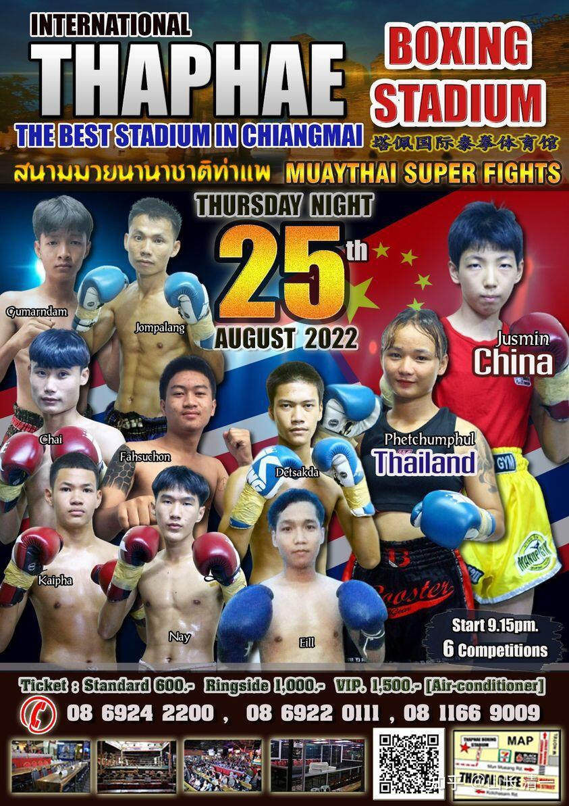
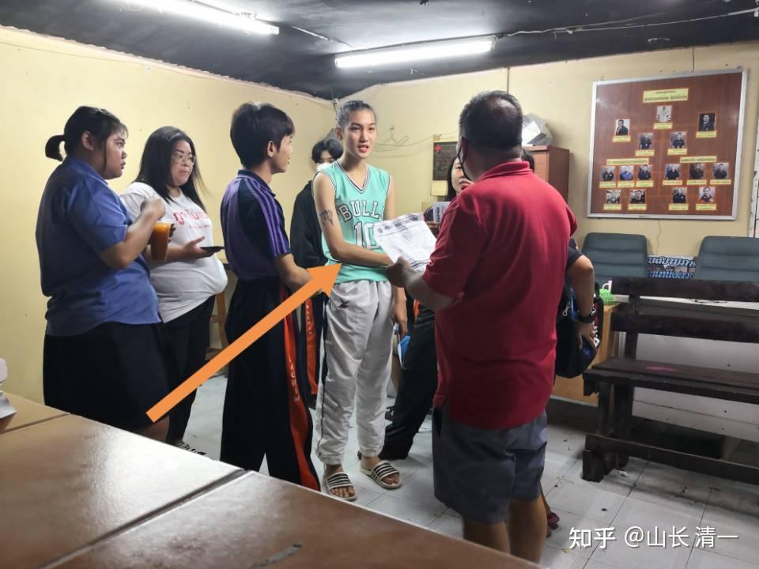
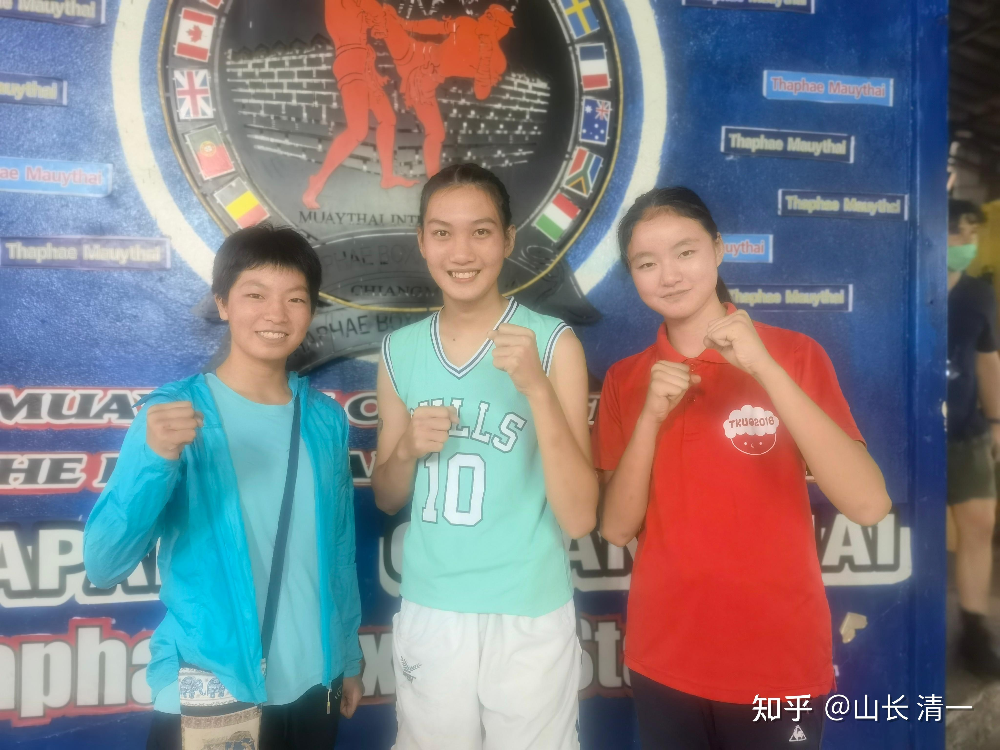
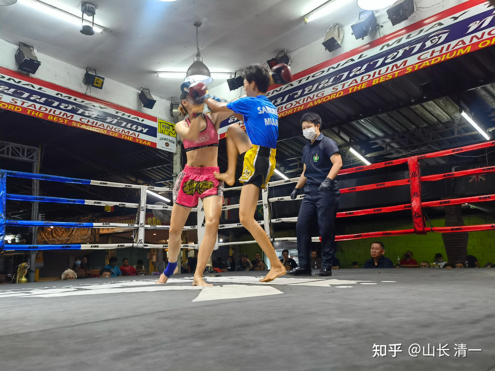
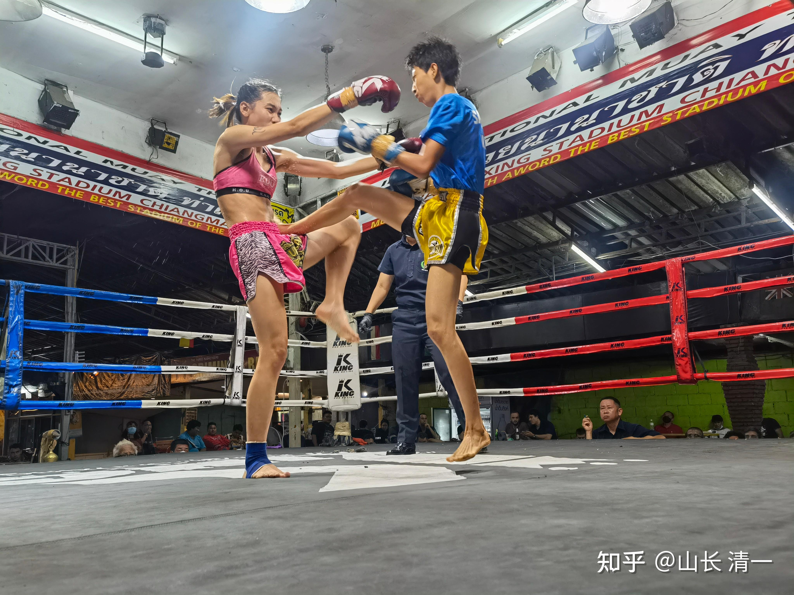
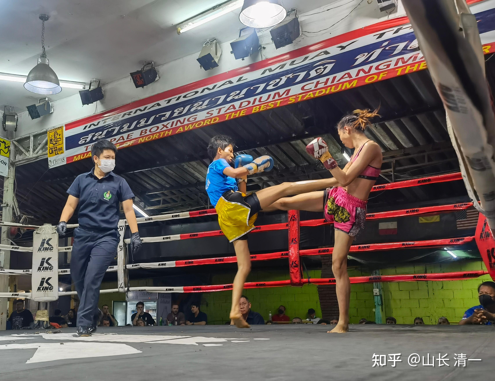
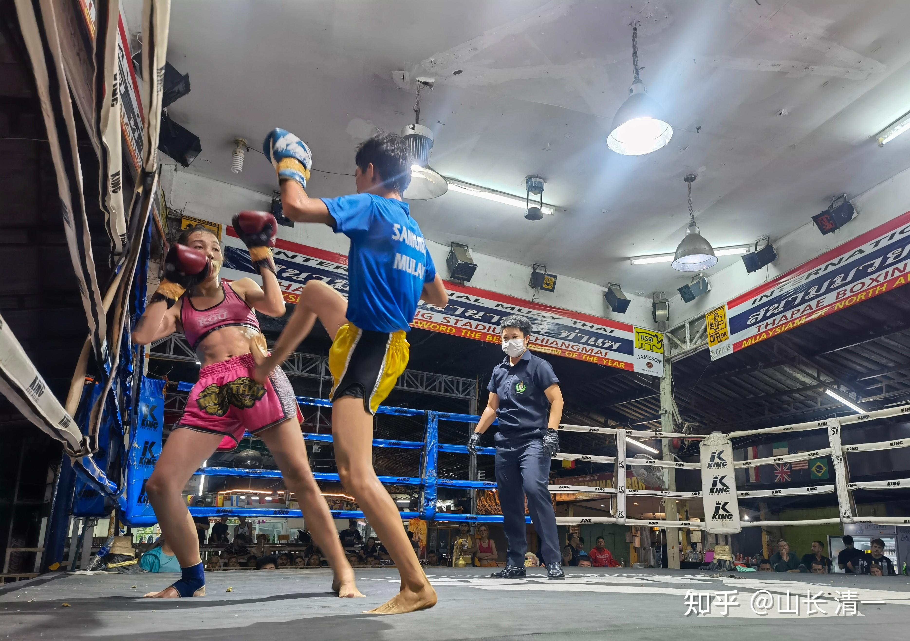
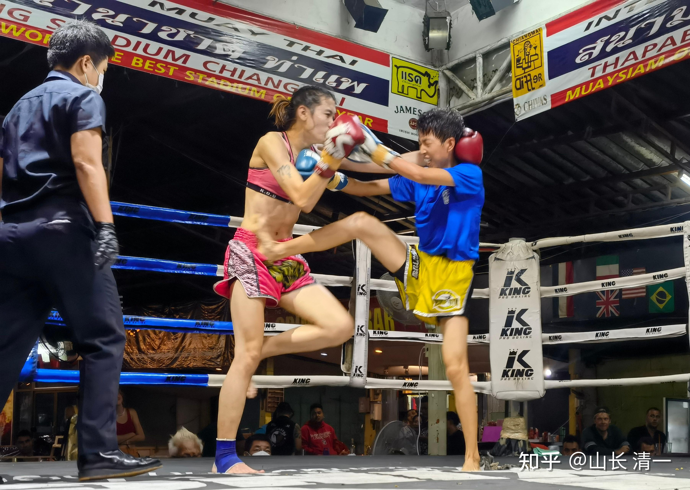

刚意外得到今晚的最新拳赛安排：明晓将首次与职业男拳手对战。即使在泰国，这种事情也是极其稀有的。在泰国，有一种特别的男生，是【美丽拳王】。身体是男生，但内心认为自己是女生的人，正常训练泰拳，打男子职业拳赛。但举止打扮却很女性化，认为自己“内在”是女子。虽然这样，但“她”参加的比赛，都是男职业拳赛。还没有听说安排女拳手来打这种男生的。因为从医学上来说，他们依然是男生。也没有做变性手续。一旦吃了激素，做了变性手续之后，身体机能会大大改变，体力会严重下降，一般就不能继续打拳了。做了变性手续的人，一般称为“人妖”。现在这种人，只能叫“伪娘”，“娘炮”。在生理上，机能上，依然是男生。只是在心理上，打扮上是女生！比如同性恋的女性身份扮演者，就是这种人。往往心思比一般的男生，更加细腻缜密。同时拥有男性的体力优势。曾有过娘炮拳手打败全国的男职业拳手，拿到伦坡尼全国冠军的案例，说明这种人，也有实力雄厚的。

但这一次意外发生了，泰方居然主动安排了男生来跟明晓打：因为明晓今晚安排的对手弃权，临阵脱逃。其实昨天她就弃权了，表示不想跟明晓打。她在现场看过三次木兰们的比赛，可能她认为没有办法对付明晓的技术吧。主办方昨天就答应：今晚会为明晓另外安排人，让明晓今晚继续去参赛。但估计是主办方到现在一直找不到愿意打的人。主办方说明晓太厉害了，找了几个泰国北部很厉害的女拳手，都表示不愿意跟她打。最后，主办方居然来电话问：明晓愿不愿意同男生打？明晓想都没想，就同意了。所以：今晚是首次【男女大战】。

这次的对手，是个【美丽拳王】。同性恋的男拳手。也许好打，也许很难打，天知道。这个拳手，原来就是这个拳馆比赛的常客。原来的比赛，一直是跟男生打的。 这一次，是主办方安排的，首次与真正的女生打比赛。会不会为了伪娘的荣誉，这个拳手会不会加倍的努力进击呢？会不会比佳惠面对的女生更难缠？所以我晚一点确认具体战术。孩子们正在找这人的视频看实力如何。

由于泰国很奇葩，很多怪事都会有，比如曾经就有一个这样的伪娘拳王，击败了一众的男拳手，最终登顶仑披尼冠军。他虽然打扮是女生，但体力是男生的体力，速度力量都是男生的反应。而且此人凶悍程度比一般的男生更狠。经常KO对手。对手倒地之后，还去亲一下对手。男拳手们，深以与此人比赛输掉为耻，所以跟她的比赛，都是拼尽全力，一定要击败她。所以她出现的赛场，反而拼斗更加的激烈。但大多数想要KO“她”的男拳手，最终反而被她KO了。

不过，经历了重重险阻，他一路打下来，最终打到冠军地位，拿到钱之后，就去做了变性手续，去当“人妖”了。但从此也就退役不打了。泰国还拍了一部她的故事的电影【美丽拳王】。

这次就写到这里，明天打完实战后，再来更新。

更新一：明晓爸爸刚才已经找到了这个拳手的比赛视频和记录：他在两年前，就在这个拳场，KO了对手。还有其他KO记录，是一个很有实力的拳手，不是简单的伪娘。

更新二：看了FACEBOOK上的比赛视频。这个人根本就不像女生。就是上身不肯脱衣服的男生。行为场下可能娘一点，穿女生的衣服。但在赛场上，就是典型的男生打法。发力还特别凶悍。个头比对手还高一些。整场追着男生打，扫腿很厉害。力量很大。裁判都警告跟他对战的男生不许消极避战。最终把男生打KO了。打完后，很意外发现有客人打赏他，给他小费。三波打赏的。有趣。

更新三：清迈时间晚上8:00。木兰们已经出发去赛场了。

6:00开始，在给明晓和木兰们开“战术研究会议”。第一是帮佳惠重新反省昨晚的比赛，复盘昨晚比赛的细节，指出佳惠昨晚做得不好的地方。虽然昨天晚上比赛大胜对手，但很多细节，还是有问题的，没有太到位，否则可以打得更好看的。也强调佳惠下一步的练功要点：现在她的“拳型”已经基本出来了，但“拳意”还差很远。甚至比很多泰拳手都差。帕开这样的选手的拳意很强，赛场上的判断能力，抓机会的能力也比她强。所以，要认真修炼格斗意识，提高拳意水平。才能打更高端的对手。

会议第二个重要项目：根据男拳手的实战视频，我给明晓安排了今晚的作战方案。是完全不同于佳惠的对战模式技术。重点是：必须重视敌人，明确知道女生的天然局限，力量速度低于男生。不要把今晚的资深职员男拳手（有很多此人2019年之前打比赛的记录），去和兵哥哥这种人比。兵哥完全是业余的拳击爱好者，意识差。就算有力量也用不出来。但这种人，是经常打职业比赛的职员拳手。虽然打着伪娘的幌子，给人内心嘲笑，实力不足。相比顶尖拳手，可能有距离。但他KO其他男拳手，说明他不是靠外表，而是靠实力取胜的。所以必须当做大敌来看。所以，我们要在战术上重视敌人。开战后，不许盲目乐观，不许主动进攻，切忌进入内围中跟男拳手作战。因为力量不如男拳手，进入内围等于找死。所以，只能采取灵活的游斗战术，跟他打游击战。因为泰拳手不善于游斗，我们在游斗中找机会，避免硬拼。但为了防止裁判判消极比赛，所以：可以采取骚扰战术。打完就第一时间溜走。第二局以后，已经探明了对手的优劣，再根据情况攻打对手的要害。在保全自己的情况下，力争KO对手，创造一个格斗历史上的新纪录。

我的任务做完了。我依然没有去拳场观战，今晚现场的辅导很重要。但是今晚如果大胜的话，木兰和我，都必然成为泰国人注意的焦点。今天是非常关键的一天。所以：我还是低调一点，回避这种场合。已经交代了佳惠和公主们，注意提醒明晓在场上的偏差，尽量执行出我事前交代的重点。

现在只能等待结果了。明晓是今晚的压轴戏，安排在最后一场比赛。打完已经是国内时间晚上12点过了。今晚，估计明晓父母是最操心的。今夜无眠。

更新四：今晚明晓对手的比赛视频，个子看样子还比较高。速度就是泰拳的标准---慢。但是，力量比女生强多了，不能像佳惠一样无视硬接的。

[https://www.zhihu.com/zvideo/1546244366091714560](https://www.zhihu.com/zvideo/1546244366091714560)

公主们发给我的，男拳手的比赛资料。你们看看，速度看样子比不过明晓，但力量很大。明晓只能跟他比灵活，躲闪。希望明晓今晚能够应付得过来。打赢了，创造新纪录。打输了---可能会受伤的。

更新五：泰方的坑满大的。居然安排53公斤的男生来打41公斤的女生？

拳手已经到场了：箭头指向的蓝色衣服的小伙就是今晚明晓的对手。身高体重都占优势。居然是53公斤，明晓的41公斤怎么打？后悔已经来不及了

更新五：清迈时间9:35更新。

对手的身高检查。我让艾拉和佳惠去跟对手合影（明晓在车上养神休息，现在刚开始第一场）。让我通过照片，观察对手的情况细节。

艾拉的身高，跟我接近了，超过1米7（我1.75）。这人居然比艾拉还高。壮实程度也不错，不是干瘦型的。练家子的体型。看样子，今晚有点难办。这人身高体重年龄，优势全占了。打输了他绝对不干的，一定会死拼到底。所以，明晓要赢下来有点难。我已经告诉艾拉和佳惠，如果发现打不过，不能让明晓硬拼（明晓的脾气是会死拼到底的）。我们要学会认输。放弃成功，并不是失败。盲目蛮干，超越自己的能力范围，招引危险上身，才是很不明智的。

当然：明晓也不是没有机会---毕竟技术上，是明显优胜对手的。

更新6：清迈时间晚上11点34分，比赛结束，结果出来了。

根据佳惠的现场报告：比赛结果。好消息是

1:明晓打满五局。没有被对方KO，但也没有KO对方。对手还是很强悍的。而且我赛前让明晓目标是打满五局，不以KO对手为目的。我怕明晓为了KO对手冒进，反而吃亏。让她稳扎稳打，在安全的前提下，打防守反击。所以降低了KO几率，但增大了保险系数。

2：明晓没有游斗，而是稳扎稳打，主动进攻。全场5局，都是步步紧逼对手，并多次正蹬击中对手，导致对手多次被击中，连连后退。（看样子，明晓太强悍，防守反击很凌厉。导致对手不要面子，就是不肯主动进攻，无法打防守反击。明晓不得不“主动进攻”）

3：对手的扫腿，拼不过明晓的防守。硬拼的结果，对手小腿胫骨受伤了。对手吃亏后，采用内围技术抱缠攻击。但明晓没有被体重远超自己的对手压垮，还成功肘击对方。打完后明晓体能保持正常，除了脚指头因为踢打有点扭伤外，身体其他部位都没有受伤。说明对手的确没有给明晓造成有效打击。打完后也没有太累，比明晓的上一次打满5场的比赛，打得更顺利。

4：打满五场，没有KO对手。佳惠认为明晓赢了。点数明显优势。对方虽然有不少攻击，但都被明晓防住了，有效击中是明晓更多。

5：坏消息是：裁判认为对手赢了。当然，佳惠没有权威，而且立场不正，肯定会偏心一些。所以---结果以裁判为准。汇报完毕，谢谢大家。

我们下面来看泰国拳手是怎样赢得比赛的吧，下面是从前方发回来的现场实战照片：泰方赢的姿势很美丽，我们好好欣赏一下。

*拒止对方抢攻内围，注意手上防住对手的攻击，脚上穿心腿。上下联动。*

*腿法对攻中，抢先击中对手腹部，导致对方失去平衡，身子后仰*

*双方对攻。泰扫腿VS穿心腿。注意两人脚跟的位置*

*对手被攻击，后仰，失去平衡*

*泰方扑上来想打内围。明晓拒止打击。*

泰国拳手多次被明晓踢的后退几步。明晓为何放弃不游斗，而是改为进逼，5局全都是步步紧逼，泰国拳手都是步步后退？按道理，对手应该会因为身体和性别的优势，而积极进攻，这样明晓就只能游斗了。但估计开局两人拼拳后（我让明晓跟他拼扫腿对攻，他应该硬度比不过明晓，害怕明晓的功力，才不断退让，事实上，赛后他说小腿胫骨受伤了，就是打明晓硬拼吃的亏，而明晓根本就没事）。证明这个泰国人，尽管身体体重优势明显，但人很聪明，比佳惠的对手聪明得多。而且他的职业化很高。要保存自己，不要啥脸的，发现打不赢，就赶快退走。所以避免了与佳惠对手一样的命运，如果他敢于积极进攻，肯定会被KO的。明晓主动进攻，他不断防守和躲闪的话，就算被击中了，也会把明晓进攻的力量消掉很多。所以这种情况下，要KO很难，特别是老油条的职业男拳手。这个人虽然娘炮，但身体训练没放松，一身的肌肉，抗击打力也很强，真的很专业，很敬业的，没有拿比赛当玩的。的确有职业拳手的风范。真的不好打。你们看最近几次KO女拳手的比赛，几次关键打击，都是打的迎击。明晓和佳惠的上一场比赛，都是迎击KO。佳惠的上场比赛，对手太强硬的。第三局启动腿击后。她腹部连中八腿，还有多次迎击。才最终垮掉了。如果她聪明一点，一直使劲后躲的话，佳惠要KO她，还蛮难的。但你们发现了，也完全除我意外的，是一个不怕打使劲进攻的傻女，结果被KO很正常。两个木兰的实力，现在KO业余拳手不难，因为打得少，不会泄力。但老油条职业拳手，特别是跟木兰对战的拳手，都是身经百战的，身体自动会泄力，要打KO蛮难的。而且对于比自己重这么多的对手，本来很难打动。明晓如果对付体重相当的职业拳手也更有把握KO一些。这一场，虽然场上明显优势，点数（有效击中）明明是我们多。但泰方就是耍赖，硬判我们输掉。别人的主场，我们也没脾气。但我相信：泰国拳界，本场比赛的裁判和组织者，心中会有数的。

这次打成这样很好。不要求结果，不期待泰方对我们公平对待（这么大的体重差距，这么明显的裁判偏心），但我们做好自己。安全打完比赛，没有受伤，就是最好的结果。

下次明晓可以要求主办方：男拳手，只能安排不超过她体重5公斤的人来打。打女生可以不限体重。等一两年功力提高了，再打大体重的男拳手。我们就面对泰方的不公正裁判，尽力练出更强的功力，尽量用一场一场的KO,来证明中华武术的荣耀吧。

更新7 26日早上8:45

视频出来了。【这个对手虽然有身高体重的优势，但意外的非常谨慎小心。我觉得：他是采取了最安全的策略，防止自己被KO。不求有功但求无过。拖完比赛他就赢，虽然这样没面子，但他的确赢了】。

这拳手一上场，就采取了极度的自保策略，不断退让，躲闪。而且技术上，比原来看过他实战的视频相比，速度和反应均有提高，更成熟了。而且还善于找空子，冷不防打几下突袭，连击也相当不错。对于一般人来说，很容易吃亏。而且他还非常善于使用自己的身高体重优势，想要在内围战中击垮明晓。非常聪明的拳手。因此明晓这一场的确比较难打。

对方正常比赛，根本就没有打出啥有效的攻击战果来。内围战的优势也不明显。动作夸张，但没有实际效果。相反明晓多次有效击中对方身体，多次造成对手不稳而后退。娘炮对手发动的各种攻击，均被明晓轻易防住，或者强势同步回击。没有犯明显的错误。最终结果，泰方却硬判明晓输掉比赛，这个脸还是比较大的。

照片中此人全身没有赘肉，算是训练有素，而且控制良好的职业拳手

[https://www.zhihu.com/zvideo/1546429790864752640](https://www.zhihu.com/zvideo/1546429790864752640)