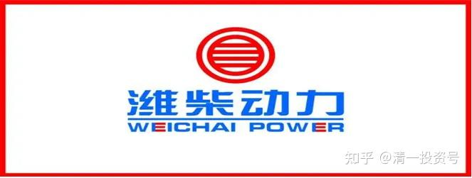
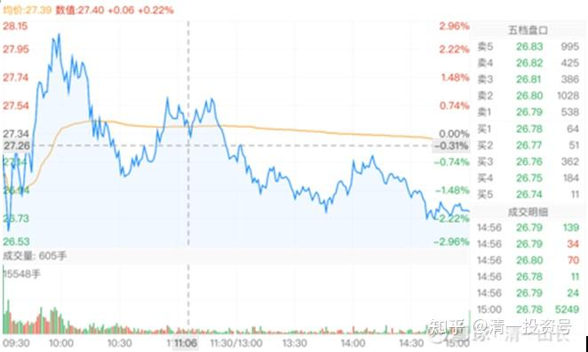
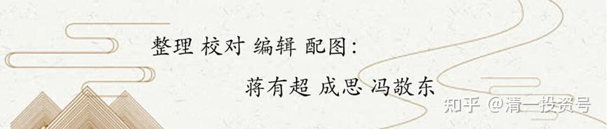

**

**

63篇.试验仓位，买入潍柴动力

清一山长2021年4月27日～5月7日

[清一山长](http://link.zhihu.com/?target=https%3A//xueqiu.com/9310099567)[2021-04-27 15:51](http://link.zhihu.com/?target=https%3A//xueqiu.com/9310099567/178346721)

[$潍柴动力(SZ000338)$](http://link.zhihu.com/?target=http%3A//xueqiu.com/S/SZ000338)今天18.20元位置买了一点潍柴动力，试验仓位。如果未来跌破18，就会继续买的。

[清一山长](http://link.zhihu.com/?target=https%3A//xueqiu.com/9310099567)[2021-04-28 13:58](http://link.zhihu.com/?target=https%3A//xueqiu.com/9310099567/178470912)

[$潍柴动力(SZ000338)$](http://link.zhihu.com/?target=http%3A//xueqiu.com/S/SZ000338)今天17.99元，再度买进。接受套牢的命运。

[清一山长](http://link.zhihu.com/?target=https%3A//xueqiu.com/9310099567)[2021-04-30 11:08](http://link.zhihu.com/?target=https%3A//xueqiu.com/9310099567/178743820)

[$潍柴动力(SZ000338)$](http://link.zhihu.com/?target=http%3A//xueqiu.com/S/SZ000338)其实，我不太明白：贵阳一季报营业收入少了14.7%，股票大跌。**潍柴动力一季报增长67%。利润增长61%。居然也跌？**啥原因？连中国建筑，一季报超预期，依然跌！

想半天，不知道啥原因，这市场怎么了？**最终的结论是：只要是我拿的股，都要跌。业绩是否好和坏，都不重要。关键必须是“别人的股”，才会涨[捂脸]。**

**不管他，跌破18元，我继续买。死不了，就继续做。当风险投资投资了。亏光了也不怕，就靠中国建筑回本了。**

[慧博投研咨询](http://link.zhihu.com/?target=http%3A//webview.hibor.com.cn/)[发布于2021-04-29 09:57:36](http://link.zhihu.com/?target=http%3A//webview.hibor.com.cn/docdetail_3211295.html)

重庆啤酒研究报告：国盛证券-重庆啤酒-600132-高端化加速，2021“极速共赢”

[webview.hibor.com.cn/docdetail3211295.htm](http://link.zhihu.com/?target=http%3A//webview.hibor.com.cn/docdetail_3211295.html)

[清一山长](http://link.zhihu.com/?target=https%3A//xueqiu.com/9310099567)[2021-04-30 12:10评论上帖](http://link.zhihu.com/?target=https%3A//xueqiu.com/9310099567/178752521)

公司2020年实现销量242.4万吨，同比+3.3%；备考口径实现收入109.4亿元，同比+7.1%。

这个东西，就叫做：极速发展了？中国建筑不就是光速了？潍柴动力不就是超光速了？

还共赢呢！**券商“推荐买入”**。我看155元，85倍的PB，你拿什么时间和空间去消化。未来不是不会涨，而是我认为万一跌的话，底在何处？除非你要打死我，否则不买（你拿枪指着我，不买就开枪，我才买）[大笑]。

[清一山长](http://link.zhihu.com/?target=https%3A//xueqiu.com/9310099567)[2021-04-30 12:36](http://link.zhihu.com/?target=https%3A//xueqiu.com/9310099567/178754808)

[$重庆啤酒(SH600132)$](http://link.zhihu.com/?target=http%3A//xueqiu.com/S/SH600132)公司2020年实现销量242.4万吨，同比+3.3%；备考口径实现收入109.4亿元，同比+7.1%。

这个东西，就叫做：极速发展了？中国建筑不就是光速了？潍柴动力不就是超光速了？

还共赢呢！**券商“推荐买入”**。真的推荐？还是拿钱推荐？我看现价155元，85倍的PB，买入后，分红根本谈不上。拿什么时间和空间去消化这笔投入？

**未来不是不会涨，反正你已经控盘了，拉到跟茅台一个价，也没问题的。而是我认为：万一你拉不住了，开始下跌的话，底在何处？我是否受得了？**所以，我不说打死我也不买这样的假话。你要打死我，我还是买的。除非有人拿枪指着我，不买重庆啤酒就开枪，我才买。还要问：是不是去超市里买一瓶就够了？要不就买一箱？能过关不？[大笑]

**涨得好，跟企业好，不一定是一回事，有时候是两回事！**

[清一山长](http://link.zhihu.com/?target=https%3A//xueqiu.com/9310099567)[2021-04-30 15:09](http://link.zhihu.com/?target=https%3A//xueqiu.com/9310099567/178776491)

[$伊力特(SH600197)$](http://link.zhihu.com/?target=http%3A//xueqiu.com/S/SH600197)剧透一下：这是出货的图形[捂脸]。

（伊力特2021-04-30日K线）

[@WC动力](http://link.zhihu.com/?target=http%3A//xueqiu.com/n/WC%25E5%258A%25A8%25E5%258A%259B)回复[清一山长](http://link.zhihu.com/?target=http%3A//xueqiu.com/n/%25E6%25B8%2585%25E4%25B8%2580%25E5%25B1%25B1%25E9%2595%25BF):

老师，潍柴动力是不是也在出货？

**[清一山长](http://link.zhihu.com/?target=https%3A//xueqiu.com/9310099567)2021-ef="[https://xueqiu.com/9310099567/179192708](http://link.zhihu.com/?target=https%3A//xueqiu.com/9310099567/179192708)">05-07 15:31回复[@WC动力](http://link.zhihu.com/?target=http%3A//xueqiu.com/n/WC%25E5%258A%25A8%25E5%258A%259B):**

潍柴动力，我在17元多的价格买，您说呢？

出不出货，看你怎样看了。跌到你认为有价值的价格，你就买。超过了，就卖。心中无数，就离开股市。

说明一句：**我的A股，账上唯一亏损的股是新买的潍柴动力，亏损值6%。有没有想抄我的底的人？[俏皮]不排除会跌到15元区域。我能确定的是：我不会卖。**

[清一山长](http://link.zhihu.com/?target=https%3A//xueqiu.com/9310099567)[2021-06-24 19:57](http://link.zhihu.com/?target=https%3A//xueqiu.com/9310099567/187106311)

我刚打赏了这篇帖子¥66.00，也推荐给你。作者研究挺专业的，感谢！

[伊飞2020](http://link.zhihu.com/?target=https%3A//xueqiu.com/4798085761)[发布于2021-06-09 23:36](http://link.zhihu.com/?target=https%3A//xueqiu.com/4798085761/182316787)

[一张图看懂潍柴动力未来核心竞争力](http://link.zhihu.com/?target=https%3A//xueqiu.com/4798085761/182316787)

