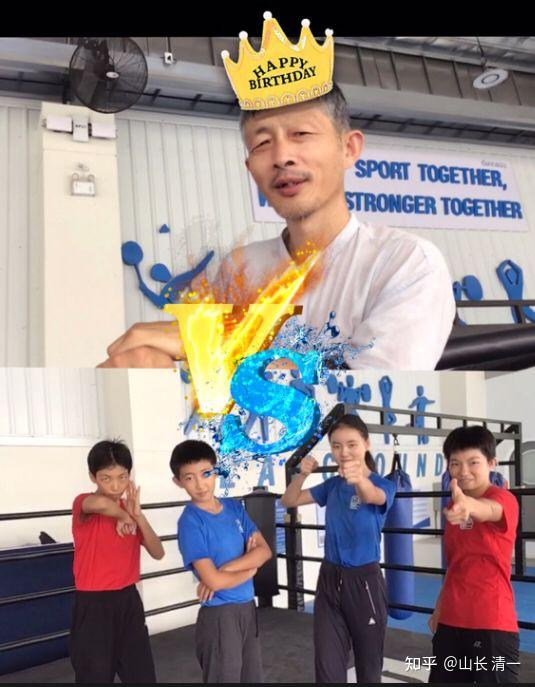

四个小公主，说为了庆祝我的生日，她们就放下职业拳手的架子，不要出场费，陪我这个业余爱好者，打一次【生日格斗比赛】。作为礼物送给我。这就让老夫有机会第一次走上擂台打实战。而且---对手还是刚刚击败了世界冠军，以及职业男拳手的木兰们联合组队。她们是要公开的夺走我“隐形世界冠军的老师”这个“无冕之王”的荣誉吗？不过，我输了依然是她们的老师，只要她们还继续打赢泰国人，我就是背后的【无冕之王】。她们不担心这样挑战，会把自己辛辛苦苦打泰国人，打出来的威风和荣誉都被我抢走吗？

*孩子们模仿拳馆，为比赛自己制作了海报，威风十足*

这场比赛，本质上是一场【年轻打年老，专业打业余，人多打人少，连续车轮战】，专门欺负老人的不公平擂台格斗。传武一直说：都说“拳怕少壮”。这群已经大杀四方，威震泰国，打到让泰国的百战职业拳手都避战的少壮派拳手，还直接KO了世界冠军，以及极为勇猛的泰国优秀拳手当场被打哭，她们甚至越级挑战男职业拳手，还打得对手节节败退，最终只能靠裁判来维持面子。她们现在打顺了手，难道也想把我这个60岁的老头一起收拾了吗？野心不小！我一直都是“武术业余爱好者”，一直玩嘴巴拳法，从来没有打过擂台。甚至连擂台都没有上过。这次居然要和两个职业拳手，以及两个准职业拳手打车轮战，还要连续打五场。对一个60岁的老人公平吗？我这种业余练练拳，摸摸鱼，从来不去跟武林人争风头的人，也要被职业拳手指名挑战上擂台实战，实在是太过分了吧？

年龄歧视，人数歧视就算了。四个小公主，木兰还使坏，还要在比赛规则上，再狠狠的坑我一把。她们买通了我的女儿，提供内幕情报，还精心策划，利用她们非常了解我功夫的信息优势，加上“内部人员”的关系，专门制定了“避实就虚”的作战方案。针对我日常训练不足，体能不够，格斗专业性差，年龄大等等劣势来下手。整个赛程，指定了对她们非常有利的赛制和规则。

首先是——要我打满五场比赛，每场五回合。总共就是25回合。我能站着撑下来比赛，恐怕都成为问题，累都累死我。何况还要车轮战挨打，四人轮流拳脚交加的揍我，一点都不客气。光是用拳的话，肯定对我有利。打推手，我更不怕了。但她们要求是要用综合格斗模式，或者泰拳模式，就是不打对我更有利的太极推手和巴西柔术模式。

最坑人的，就是增加比赛时间。每场比赛，还要比泰拳的实战规矩多一分钟，如果每场都打满五局，就是25分钟。要打满她们安排的全部25回合，就是两个多小时了。还不算休息时间。这个安排节奏，存心是要累死我。我要求按照太极无限制规则来比赛，不带拳套，这样就可以抓住她们，控住后，逼她们投降认输。但她们却要求：最多只能有两局是太极规则，还要求太极格斗，就要无场地限制，可以满世界到处跑，玩街斗模式。只要让我这两局抓不住她们，就继续用泰拳KO我。

最坑的是艾拉。要求她能不能打两场不同的比赛，一场她不用腿法的泰拳比赛， 一场纯泰规则比赛。我想这没啥的，她练拳水平很一般，只是准职业拳手级别，好搞定。多一场也不算啥。但艾拉打了一场，被我TKO制服后，马上就把下一场的比赛机会，让给佳惠来对付我。把泰国优秀拳手都打哭了的木兰佳惠，就获得了复活打我两场比赛的机会。实力增强了不少。

第一场跟佳惠的太极比赛，她们要求实行【无限赛场空间规则】。理由太极就没有拳台限制。佳惠一等裁判宣布比赛开始，就第一时间逃到拳台外，不跟我正面决战，不让我有机会抓住她。让我只能满世界追她，跟我比跑步和体能。

木兰们各种花招，就是要打车轮战，耗尽我的体力。一群年轻人，不讲武德：居然年轻打年老，职业打业余，多人打一人，还玩狼群轮战，车轮战，专门折腾老夫。

最终结果就是：我被木兰和公主们好好收拾了一顿。她们每个人，上场全都不遗余力的打我，你看她们预告片出招片段，就知道一点都不是徒弟给师父“喂招”的乖样子。连功夫最水的艾拉，让我答应跟我打一场只用拳不用腿的比赛。再加一场拳腿并用的泰拳比赛。让我轻敌了。因为觉得她用不用腿，都好对付。打两场和一场也差不多。但后来才知道她的盘算很深。她私下想，她就算功夫再差，但比赛打拳，比腿法要更容易击中我。至少有机会能打我一拳的。她只要使劲的打我一拳。这样，就算她最后还是输了，但等她将来她当奶奶的时候，就可以留下跟小孙女吹牛的资本了：说当年她是如何的英勇，敢打敢冲敢斗的，敢在擂台上打祖师爷山长，华山论剑的决斗，还成功地用她的小粉拳袭击了山长，还要留下成功击中我的视频，专门剪接起来保存，给将来的小孙女看历史记录。至于其他我打她的部分，就可以忽略了。不能列为传家宝留下来。

几乎所有的小公主木兰们，都有类似的想法。要好不容易抓住山长送大礼物的机会，不需要让手的机会，要创造她们自己的光辉历史记录。要合规地打我一次。甚至连腿法拳法都还不行的小明慧，都发誓要用她身步最灵活，而且最充分地利用了泰拳的规则来累死我。所以她坚持不打太极规则， 说这样对她不公平。她只肯打泰拳规则的比赛。后来才知道：她要利用比赛规则的漏洞来对付我。她还特别安排，在佳惠打完第一场比赛之后，了解我的打法了，就第二场上去，专门负责用泰拳来消耗我的体力。为后期的公主们打我创造良好的前提条件。结果就是，我跟小明慧打的这一场，真的是最累的。小明慧攻击我特别的卖力，根本就不放水，攻击更加的猛烈，一点也不给我休息的时间，我一停手她就上来猛踢我。我一反击，她就赶快逃跑。我一追击到她，看跑不掉，就第一时间假摔在地，让裁判保护起来，不许我下手KO她（泰拳规则，倒地不扣分，而且对手不能攻击倒地对手）。最后，她们花招百出的车轮战，真的把我都累坏了。我打完明慧后，只好拖时间，也学她们利用泰拳规则来休息一下。就说泰拳每一场换人打的时候，裁判都必须给拳手”跳拳舞“的时间，拳手自己决定跳多长时间。然后我就坐在拳台上，慢慢挥动手，假装在跳拳舞，这样来恢复体力。公主们很不满，也拿我没办法。

最后，我总算支撑下来了全部五场【不公平的比赛】，完成了比跑全马还艰难的全部赛程。由于小公主们没有完成她们的计划，剩余体能保持完好。所以她们打完全部比赛后，觉得体能还有富余的，还不过瘾。所以，四个小公主打完比赛后，就绕着迪卡侬商场的外围，玩蜥蜴爬，爬了整整一大圈回到原点。我认为这是示威给我看：表示她们的体能储备有多强，她们体能上完胜山长。还能跟我再打一轮。但我决定不上当，忽略了她们的示威。只给点赞。

我只能叹息：拳怕少壮！我已经是下午的太阳，比不过她们这些早上的太阳了！该她们升起了。

[清一山长VS清一木兰 预告片_哔哩哔哩_bilibili](http://link.zhihu.com/?target=https%3A//www.bilibili.com/video/BV1dd4y1d7qM%3Fis_story_h5%3Dfalse%26p%3D1%26share_from%3Dugc%26share_medium%3Diphone%26share_plat%3Dios%26share_session_id%3D4B52AF62-B0F8-4BA7-91FB-3A8DF8A28717%26share_source%3DWEIXIN_MONMENT%26share_tag%3Ds_i%26timestamp%3D1661595120%26unique_k%3DzUyXr9d%26share_times%3D1)