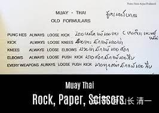
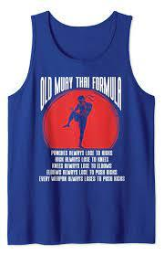

古泰拳定律：什么人体武器最厉害？

*古泰秘诀*

1：拳击永远输给腿击（扫腿）！

2：腿击永远输给膝击！

3：膝击永远输给肘击！

4：肘击永远输给正蹬！

5：所有的攻击技术，全都输给正蹬腿！（穿心脚）

Old Muay Thai formula: Push kicks > Elbows > Knees > Kicks > Punches Kru FSitjaopho Muay Thaidemonstrates the proper way to generate

我原来一直纳闷: 根据我研究武道实战格斗的结果，发现正蹬腿，是最好的攻防合一武器。远远比泰拳的扫腿厉害。仅用这一个技术，就足够让泰国的“拳腿肘膝八体技术”完全无效。所以让木兰们一开始就专攻穿心腿。等穿心腿入门之后，再去研究发展其他格斗技术。

我相信打了这么多场实战比赛，各位已经习惯了不同级别的泰拳对手，在木兰们具有强大威胁力的穿心腿面前，都像是不会打拳了一样，无法应付，只能节节败退。而且：木兰们的穿心腿，已经多次把对手KO，证明了上面的【古泰拳规则】说的----【所有的攻击技术，都会输给正蹬腿！】。此言不虚。

实际上，我们太极征泰的第二波20人，第三波60人，她们想来打泰国人。我现在就只让她们练一个技术：太极迎门三脚。这个技术，就是以正蹬腿为中心的打击技术。我认为，只要我们的清一武士们学会了正宗的太极正蹬，就可以无敌于泰拳，也相当于【站立格斗界的无敌拳手】了。其他技术，只是辅助而已。比如征泰第11场比赛，虽然佳慧前两局不用腿法，仅仅使用了无懈可击的拳法，就打得泰拳手完全无法招架。但拳法的密集打击，对手多次中招，也并未造成泰拳手失去战斗力。直到第三局，开启穿心脚之后，才是真正的大杀器。一启用，就很快把对手KO了。更加证明了正蹬腿在实战格斗中的霸主地位！

这么好的技术，我认为泰国人太笨了，居然不知道去使用。几乎很少有人会练正蹬腿。直到我看见这张【古泰规则】。才发现我错了----泰国人很聪明，他们很早就知道正蹬腿的价值，是超越一切格斗技术之上的。但为啥泰拳训练中，却放弃了正蹬技术？而只是去大力训练和发展扫腿技术呢？这不是只实现了第一个规则：拳输给腿吗？

古泰规则解说：

**1：拳击永远输给腿击。**中国古武也说，手是两扇门，全凭脚打人。由于腿的力量大于拳击，攻击距离远过拳击。所以，只会用拳的人，与用腿的人进行格斗，基本上没有胜算。还没有接近敌人，就被腿打得东歪西倒的。基本上就没法打了。（当然，这是指相同训练程度下。你把一个练了几个月泰拳的人，去跟练了数年拳击的职业拳手去打，这种腿击，是不可能赢过拳击的）

2：腿击永远输给膝击！这也是对的。如果防住对方的腿击，或者忍住被打上一腿，进入到内围近战，打膝击技术格斗，就会比只会腿法的人占据更大优势。身体挨上一膝盖，肯定比挨上一腿更具有摧毁性。所以，泰拳手其实很多人比较怕善于内围战的拳手。泰国的国家队帕开，扫腿技术一流，高扫很漂亮也很厉害，差点KO了明晓。但就是内围战差一点，所以输给了扫腿技术更差一点的，第11场佳慧的对手，她是被对手膝击TKO的。而这个善于内围战的拳手，被佳慧用太极摔法甩开，无法使用膝击技术后，最终是被正蹬腿KO终结的比赛。（昨天直到，这个对手是敢打敢拼的强悍对手，她下周要跟明晓打一场比赛。看样子是她很不服气上次被佳慧击倒，想要在明晓这里找回荣誉。估计她认为：与体重轻过她6公斤的明晓打内围战，她会有优势。不过结果我认为她会再次被KO。因为古泰规则说明了：采用膝击，肘击，都是打不过正蹬的）。

**3：膝击永远输给肘击！**这也是对的。肘击技术在泰拳界，拥有非常崇高的声誉。在伦披尼拳场，如果拳手用肘KO了对手，会多赢得一万的奖金。这也是内围战的内容。

**4：肘击打不过正蹬。**

**5：所有的四肢攻击技术，全都永远输给正蹬！**

我承认是这样。同等训练程度下，正蹬腿可以击败所有的格斗技术---除了摔跤和柔术以外。如果用我的方法来训练，不需要三年，大约只需要一年多时间，拳手就可以上场，与多年的泰拳职业拳手对抗并获胜了。当然，要跟顶尖的泰拳手对抗，还需要3年的刻苦训练。也就是说：这是一种可以速成的技术，并不是啥需要十年不出门的高难技术。

所以：我奇了怪了，为啥在清一武道馆之前，全世界的格斗界，都很少有人，专门去研究和发展正蹬技术？

泰拳最重视扫踢，以及每天都要训练内围战的肘膝攻击。拳击虽然不重视，也有练习。所以格斗体系已经相当的完善。但为何单单放弃了威力最强大的正蹬？而且，最难以理解的是：在泰国，泰拳裁判们还不给正蹬腿技术高分，甚至不给分？假如你用正蹬击中对手10腿，而对手只用扫踢击中你三腿。如果都没有KO对方，很可能最终判决是使用扫腿的泰拳手赢得比赛。因此导致泰拳手就不重视正蹬腿技术，专注于练习扫腿技术。而且---原来木兰们去训练的泰拳馆教练，直到泰拳的伙伴们，对于木兰们在比赛中，主要使用正蹬腿技术，都感觉十分的不满意，认为没有体现泰拳技术，一直要求她们去练习和使用扫腿。

难道这个技术在泰国被雪藏起来，只有极少数人知道吗？我认为这是不可能的。因为：泰拳手们，无不以击败对手为能事。非常在意钻研能够让自己获得胜利，KO对手的技术。如果真有这种技术，肯定在赛场上会大放光彩的。目前我看赛场上，使用正蹬技术比较好的人，就是播求。他在首次夺取K1总冠军的时候，击败魔裟斗的关键武器就是正蹬。因为拳法技术明显不如日本对手，所以他为了防止近战。不断用正蹬来拒止对方的接近，这一招让魔裟斗无可奈何，最终体力耗尽，比不过年轻且实力正在巅峰的播求。但播求的正蹬，威力并不大，速度也比不过他的扫腿。后来魔裟斗适应了他的打发，后来举办的二番战就赢了他。总体来说，播求依然是更依赖扫腿技术的。而且：有意思的是播求打纯泰比赛，使用扫腿更多。而不是正蹬。估计是他在K1中无法在近距离的时候使用内围技术，特别是不能使用肘法，限制了他短距离攻击手段的使用。所以才不得不用正蹬来防止对手攻击的。

其他拳派：空手道，踢拳，散打等。虽然也有正蹬腿的训练，比泰拳手的技术配置上，显得相对更重视一点。但其实也放到一个并不重要的位置，远远不如鞭腿，甚至不如拳术的地位高，更受重视。难道这些职业拳手，都跟正蹬腿有仇吗？不想赢得比赛吗？居然不去发展这么有效的攻击技术去打击对手？居然让我们的小木兰，轻而易举地在泰国用一个穿心腿法就轻松横扫泰拳？而且，从实战中木兰们的正蹬腿技术，很少被泰国拳手有效拦截看来，对手是很不适应这种攻击技术的。只能说她们平时的训练中，没有重视到这种技术。（木兰们互相进行拳腿对攻练习的时候，都很难用正蹬技术击中对手。因为双方都会防备正蹬。但更不能用扫腿去攻击对手。因为一用扫腿，就会被防守方快速贴近身体用拳击打。如果使用连续正蹬的话，还可以保持安全距离。虽然木兰们不用担心泰拳对手们的正蹬攻击，但如果她们练习中能防住更快更猛的正蹬，擂台上要防泰拳的扫腿攻击就更容易了。因此木兰们每天的对练，拳腿实战攻防技术都是必练的项目）

你们知道外家拳手不去练这种超级格斗技术的原因吗？欢迎在评论中，说出你们的思考结果！