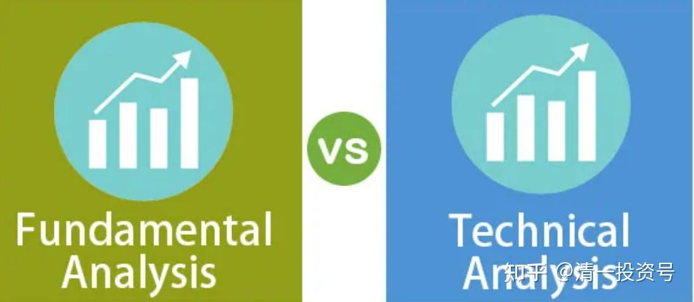
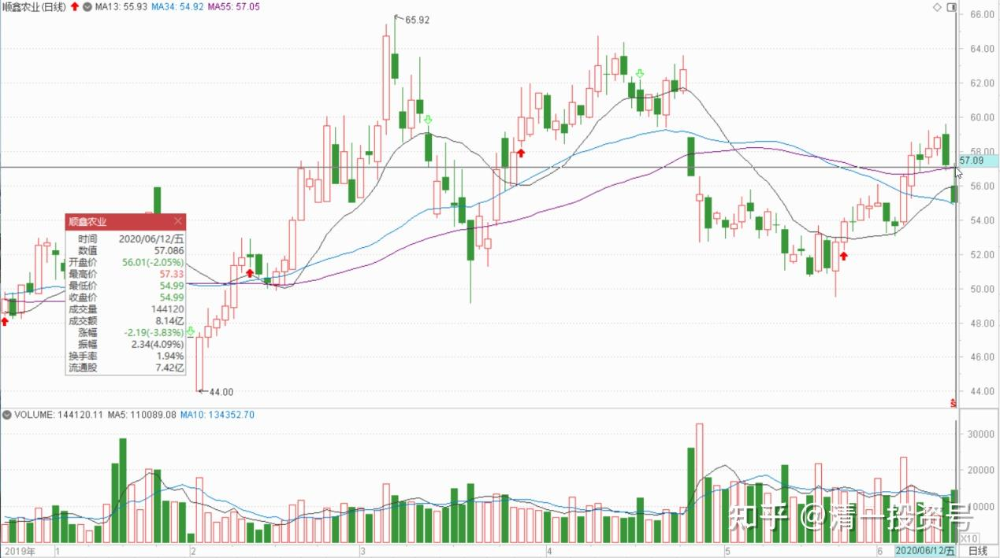
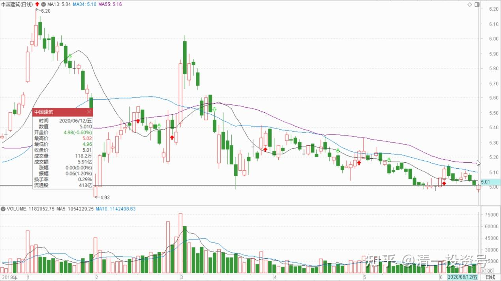
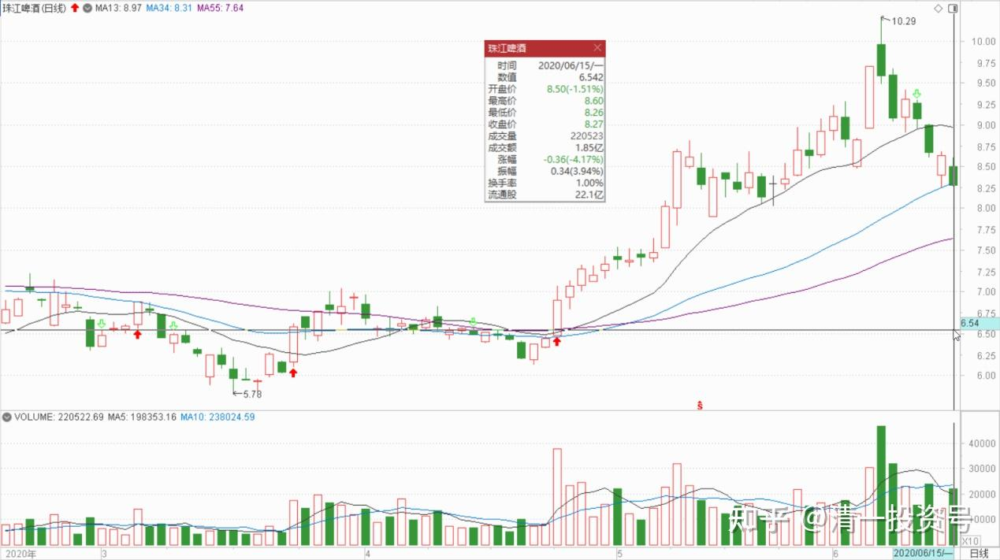
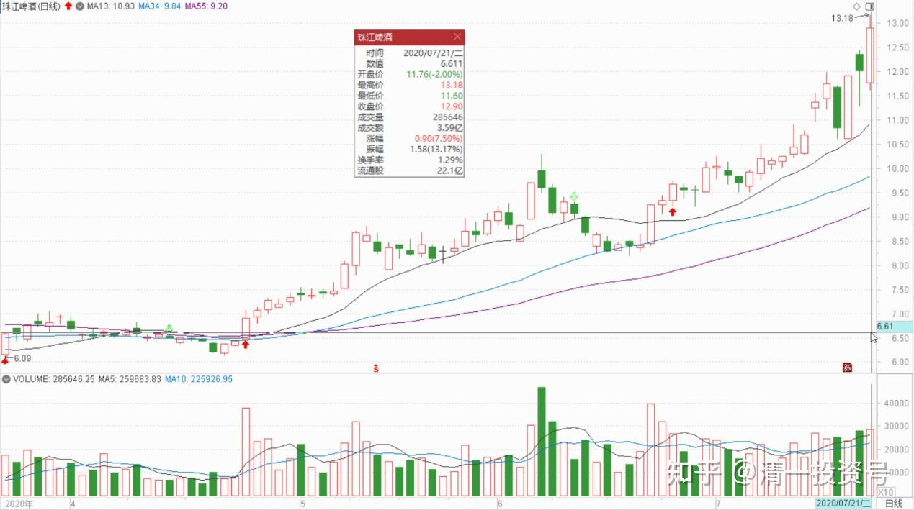
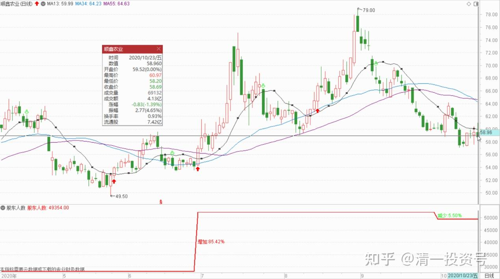
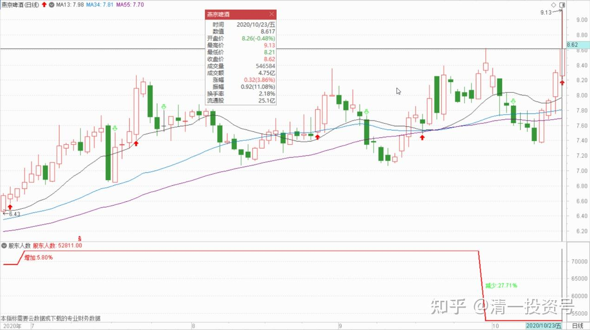
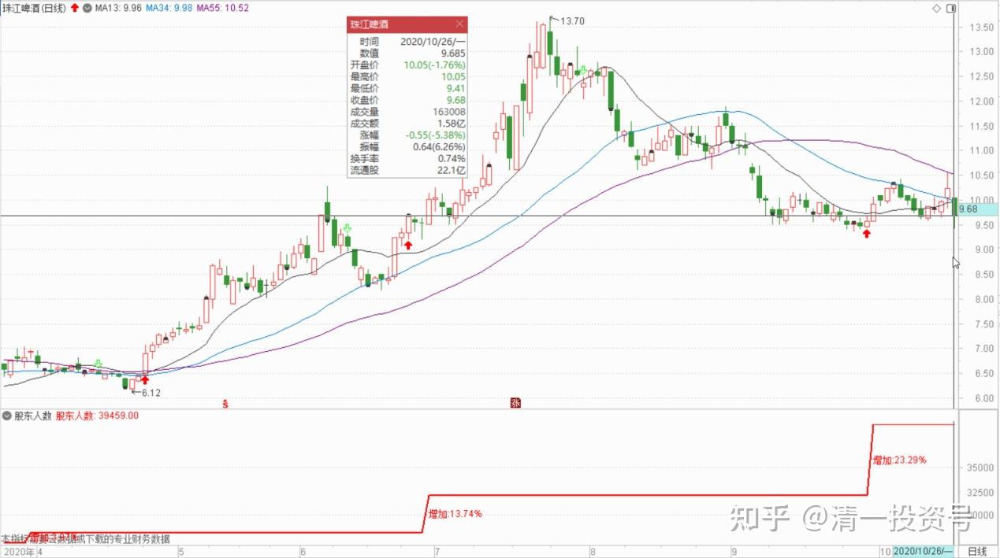
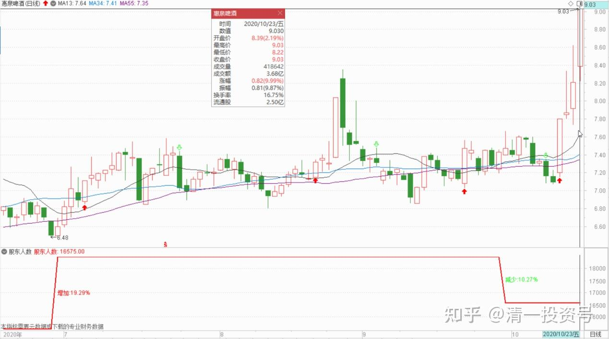

65篇.顺鑫农业记录八：基本面的估值修复和主力技术面的空间

清一山长2020年3月-5月

题记：清一山长2022年6月7日“大家可以参考顺鑫农业原来的走势，这就是“长庄股”的走法。我甚至有点怀疑，现在的**就是原来的顺鑫主力。当年这个顺鑫的老庄，也是恶心人恶心得要死的。把很多老手都熬垮了。很多人刚涨一点点就走了。我是中途进场的顺鑫，都被这庄傻熬了两年。幸亏后来守住了，结果还算不错。主升浪的钱赚到了，吃了鱼头和鱼身子。虽然最后的晚宴中，似乎鱼尾巴最好吃，但我们就别指望吃全了。”

**一、价格翻倍的可能性**

亦锌爸爸2020-05-23 22:51

《后视镜系列14：价值毁灭——中国建筑，十年前买入100股中国建筑》[https://xueqiu.com/1890202977/149998807](http://link.zhihu.com/?target=https%3A//xueqiu.com/1890202977/149998807)

清一山长2020-06-02 13:20:08评论上贴

我持有中建，现在已经是重仓了。但我喜欢看看相反的观点。此文观点，以结果倒推原因，看起来振振有词，其实漏洞不少。比如：作者算账，居然连复权都不管，直接拿K线图算，实在是对自己的结论太不负责，更谈不上为读者负责。中国建筑2010年的收盘价是3.45元，2010年的开盘价（后复权）是10.44元。虽然不如招行和茅台，但9年三倍的收益，真的很差吗？除了茅台等明星股，有多少白酒股做到了9年三倍？**就算是顺鑫农业这样的牛股，2010年年底买入后，坚持持有到2018年一季度，还是亏本的。**同期如果你买中国建筑，已经涨了三倍。这时候再换入顺鑫农业，你就可以9年赚9倍。通过后视镜来炒股，谁都可以当股神，事后论事，人人都是诸葛不亮[俏皮]。

作者写文时的价格是9.10元（后复权），这个价格，基本上就是中建历史最低估值附近。也是五年来的最低估值。这种低位来谈空中建，把它与估值已经高高在上的茅台作对比，当然显得很丑小鸭。可是，会不会误导一些脑子不好的小股民？

要不大家打个赌？您说茅台好，今天的茅台价格1413元。十年后我们比一比谁更高？十年后，中国建筑如果涨到25元一股了，茅台会涨到7000多元一股吗？也许吧！但我宁肯相信中建25元一股更靠谱。（这个价格，不是我瞎歪歪，拍脑袋乱想的价格，而是中建总公司规划的蓝图——目标是2030年万亿市值，现在2000万市值，当然，也许他们就是意淫的，别当真了）。

清一山长2020-06-12 11:37:51

$顺鑫农业(SZ000860)$今天打开老人的养老账户，居然还有几万股顺鑫农业。还有泸州老窖，买了好几年，我都忘了。什么叫躺赚？这就是！

这个养老账户，一年也难得打开一次，我基本上给这个账户买的都是不需要操心的稳定的股，收息股。投机股/风险股统统不买，也不玩高抛低吸，不做T，所以收益不如我的主账户。我只在我自己的账户上玩玩游戏。养老账户除了分红后想买股票，才会打开操作一下，或者偶然想起来看看，基本上不用操心。今天我把账上的顺鑫全卖了，57元的高价，很满足了。现价买入中国建筑**，5.00元已经全部成交。我认为未来中建过10元的机会，大于顺鑫过115元的机会。**拿分红的话，中建更靠谱一些，中建是养老股，买入后不用看账户，分红后再买入就行了。省心，省力。这个账户几年前入金100多万，让我来管理后，现在已经有一千多万了，在酒上赚了300多万，药上赚了200多万，其他都是银行上赚的（招商、浦发、民生、兴业四大行）。现在每年分红都有几十万，十年后，本账户说不定每年分红就过百万了。用来养老，一点都不差。比养儿子划算多了，现在有谁一年孝敬几十万给老人家的？我对我妈都没这么好[滴汗]

（当然我家老人是文革前的老大学生，有退休工资，不要我养）。任何老人，把养儿子的钱，用来开个账号，买养老股，绝对比养儿子投资回报率高得多，忠实和贴心。不淘气，不闯祸！

建议一些追涨杀跌还赚不到钱的小散，也学我这样做，开自己的养老账户，现在可以买入中建，放起来不管。过几年再来看。把看盘的时间用来学习、提高、干活、做好事，别成天盯盘，浪费生命。还弄得小心脏跳动超速。我这种账户，是券商最不喜欢的，一年也不动一次，他们从中赚钱太少！

清一山长2018-06-15 11:08:55

$珠江啤酒(SZ002461)$40.55元卖出一部分顺鑫农业，现在持股成本已经降到0.22元一股了[大笑]。今天大量买入珠江啤酒，理由就是：**顺鑫很可能涨到80元。但顺鑫涨到80元的难度，估计比珠江涨到12元的难度高，**所以用顺鑫换珠江，只留下顺鑫的利润继续奔跑。其中一单是以5.79元挂进去十万股买入珠江，查看已经成交。现在在继续买入中。不知道下午会不会破位下跌。今天豁出去了[加油]。珠江本来都快到一千万的利润了，现在跌到只剩200多万，惭愧。应该7.71出光的，锁定利润[大笑]。不过，我本来就是买入就套牢，卖掉就上涨的命。还是认命吧！我不入地狱谁入呢？我就在珠江的“地狱”里慢慢做吧！没钱了就去清迈山里面玩去，有钱就看看盘。

清一山长2020-07-21 10:14:27评论上贴

两年前，珠江5元多，是“恐慌”的对象，我却抛出正在上涨的顺鑫农业，当年这个时点，顺鑫只剩一半的仓位了，后来上涨中也在逐步卖出。资金在大量地买入珠江，半个月后，就成为珠江唯一的自然人十大[大笑]。除了你们看到的十大账户，我还有其他账户买入的珠江，所以持仓比十大显示的还高。今天的珠江，12元多，已经实现了我的预期，成为了我赚到最多利润的酒类股，也是除了中建以外，赚钱最多的股。当年我说要大买珠江的时候，心中看到的是12元的价格，是不是像是一个远不可及的梦幻？我这次买入后，后来还掉了20%以上，跌倒了4元多。让我的珠江账面都出现了亏损。所以，抄我的底，可以赚到比我更多。也更安全。不过珠江最安全的时候，却是散户们最恐慌的时候。今天的12元，却是大家认为最安全的，最惹眼的时候。珠江已经是市场“贪婪”的对象。大量的机构调研，资金介入，每天的成交都很热络。今年的顺鑫农业65元，涨得也不错，真的没有到80元。我这次用大量资金来“算命”的结果，两年后来看，算是算得很准的了[俏皮]。

**二、基本面的估值修复和主力技术面的空间**

清一山长2020-10-24 22:56:51

$顺鑫农业(SZ000860)$提醒一下**,顺鑫农业2季度股东人数大幅增加。增加值为今年来新高，增长了85%。说明2季度开始，筹码已经开始转移到散户手中。散户手中有股，就是要低价卖掉的。所以顺鑫涨起来，有点难了。**已经从十几元冲到79元了，很够意思了，还想破百元。恐怕也太贪心了。从图形上看，过去一年多价涨，但量一直没有放大。股东数也没有涨起来，甚至还缩减了一些。所以主力基本上是锁定了筹码，只是做做T赚点小钱。三季度的放量拉升，9月份大幅地跌下来，大大的一个阴包阳月线，不吉利。后市恐怕不看好。起码主力不看好顺鑫才会走的，或者赚够了才走了。当然，不排除以后跌了又继续买进来，继续拉升，创新高。

燕京最近六个月，价格上不断稳步上涨，但成交量反而缩减。股东数三季度更是大幅缩减。说明很多小散户把筹码交给主力了。**人数从2季度的7万多降到了5万，可以说洗筹是很成功的。**后市看高一线，我认为未来冲破10元是最起码的。现价还算是安全的——因为与9月底的价格并未拉开，没有发现主力派筹码的迹象。

**与之相反的是珠江，三季度股东人数增加了23%。股价78元两月先涨，9月份大幅下跌，跌幅30%以上。这个应该是主力派发筹码出来了。**散户筹码一多，股价就涨不起来了。所以珠江最近两个月股价低迷。现在略有起色。但显然不如燕京靠谱。燕京价、量配合得更良好，明显的上攻走势。

惠泉6月份的筹码是派发出来了的。这个月也是冲高回落。但后面三个月都是价增，股东数量减少。所以10月份大涨一波，是否派发？现在还没有。看下周了。主力如果不派发，会继续涨到更高的位置。直到散户冲进来接盘为止。反正我已经走了，不操心主力动向。就只是挂眼科，学习和膜拜主力的操盘技术好了。

我是价值投机派，现在谈的，都是投机的玩意。不是正宗本事。希望各位不要被误导。就是当说了玩的，看以后走势应验否[俏皮]。

[51nxp](http://link.zhihu.com/?target=https%3A//xueqiu.com/9203843585) [2020-12-20 11:10](http://link.zhihu.com/?target=https%3A//xueqiu.com/9203843585/166202355)[@清一山长](http://link.zhihu.com/?target=http%3A//xueqiu.com/n/%25E6%25B8%2585%25E4%25B8%2580%25E5%25B1%25B1%25E9%2595%25BF)

[$天士力(SH600535)$](http://link.zhihu.com/?target=http%3A//xueqiu.com/S/SH600535)这几天一直在思考。拿天士力差不多1年，为什么那么笃定的一笔投资让我现在这么纠结？……

完整原贴链接[https://xueqiu.com/9203843585/166202355](http://link.zhihu.com/?target=https%3A//xueqiu.com/9203843585/166202355)

清一山长[2020-12-26 13:01](http://link.zhihu.com/?target=https%3A//xueqiu.com/9310099567/166789519)（评论上贴）

抱歉，一直没看到这个帖子。没有及时回复！

医疗公司的基本面，我基本上不懂，没法评价。**与顺鑫不一样：顺鑫是销量第一的白酒公司，当时的价格，是停留在几年前，其他白酒公司都涨了。它没涨，是不合逻辑的，所以19元买入顺鑫，安全系数很高。而且这酒的销量保证了将来会有希望。**它当时最大的问题，就是养猪业务不赚钱，以及地产公司赔钱。但白酒一直是一家独秀的。一旦剥离两项不良资产，它就会是一个非常优秀的白酒公司，**就像是现在的燕京，公司总体的盈利，还不如自己的一家分公司（广西漓泉），一旦主品牌走好，就会有爆发的可能**。所以这些基本面，使得我敢于大量买入。

但京新（002020），我就没发现一些基本面上明显可以见到的“亮点”，加上去年我看到下跌放量，技术上就不正常。今年年初从17元下跌到13元多也放量，这都是短期内股价起来不来的重要原因。有什么人愿意在这么低的价格跑路？当然，有这么多接盘。也说明有人看好。最近7月份的上涨，空间力度都不够。再次跌回来也不奇怪。不过，现在处在相对低位，风险已经不大了。也许坚持到风口，就可以有收获了。

由于我不懂医疗企业的基本面，就说一点这些技术上的看盘心得，也许对您没啥意义[笑]。我个人，习惯根据基本面和技术两者结合，如果能够融合在一起投资，胜率会更大一些**。顺鑫当年是符合这个要求的，安全性，值博率都比较高。从技术面看，当时看到顺鑫有主力压盘的迹象，不让涨。**我对这种就很有兴趣了。**而且压盘时间很长，已经压了两三年。由于我能够看到主力的这些压盘动作，知道万一涨起来，50%以内是不可能出局的，所以顺鑫30元以内，我根本就不考虑卖出。**后来才抓住了顺鑫这头大涨的牛。您由于下车过早，也许就是没有**关注主力的技术面，主力进驻两三年，可能带来的空间**。您就只看到了基本面带来的估值修复，就走掉了。有点可惜。所以，了解一下技术走势，博弈学，也许也是有价值的。

京新（002020）仅仅看技术面走势的话，基本上已经接近底部位置了。天士力还需要观察。

这些个人意见，仅供参考。

（标题为编者所加）

参考链接：

[清一投资号：29篇.2021年评顺鑫](https://zhuanlan.zhihu.com/p/498221415)（整理文）

[清一投资号：44篇.顺鑫农业记录一：开始关注买入](https://zhuanlan.zhihu.com/p/539035593)（整理文）

[清一投资号：46篇.顺鑫农业记录二：最多输时间不输钱](https://zhuanlan.zhihu.com/p/539203562)（整理文）

[清一投资号：49篇.顺鑫农业记录三：买、卖、拿住股票的理由](https://zhuanlan.zhihu.com/p/543704521)（整理文）

[清一投资号：51篇.顺鑫农业记录四：主力还没有开始减仓](https://zhuanlan.zhihu.com/p/544147559)（整理文）

[清一投资号：53篇.顺鑫农业记录五：中国炒股最重要的技术是保本](https://zhuanlan.zhihu.com/p/544149372)（整理文）

[清一投资号：58篇.顺鑫农业记录六：最靠谱的投资方法就是不炒股](https://zhuanlan.zhihu.com/p/545612289)（整理文）

[清一投资号：61篇.顺鑫农业记录七——机构坐庄三招：养、套、杀](https://zhuanlan.zhihu.com/p/556331421)（整理文）

