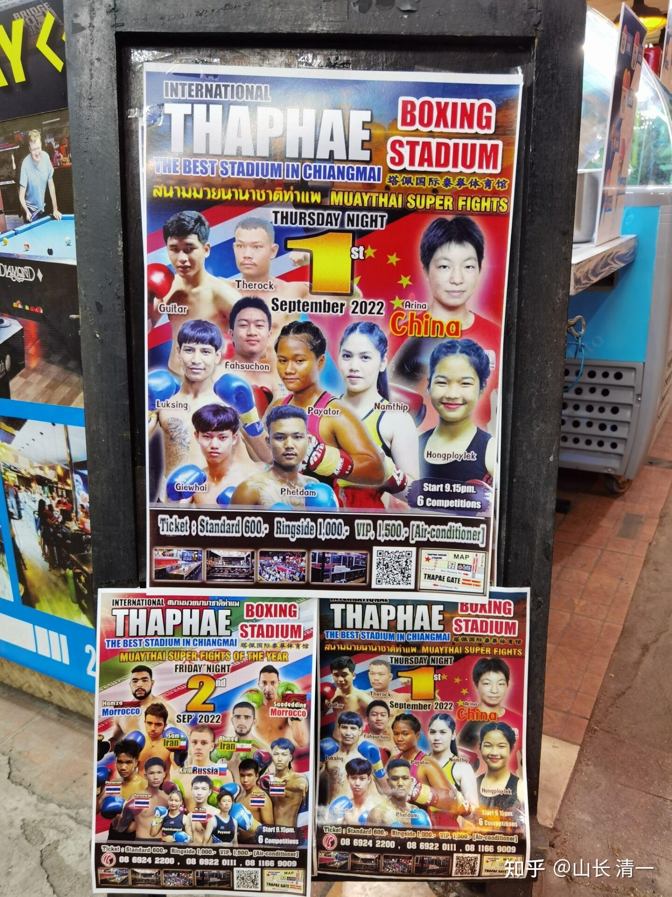
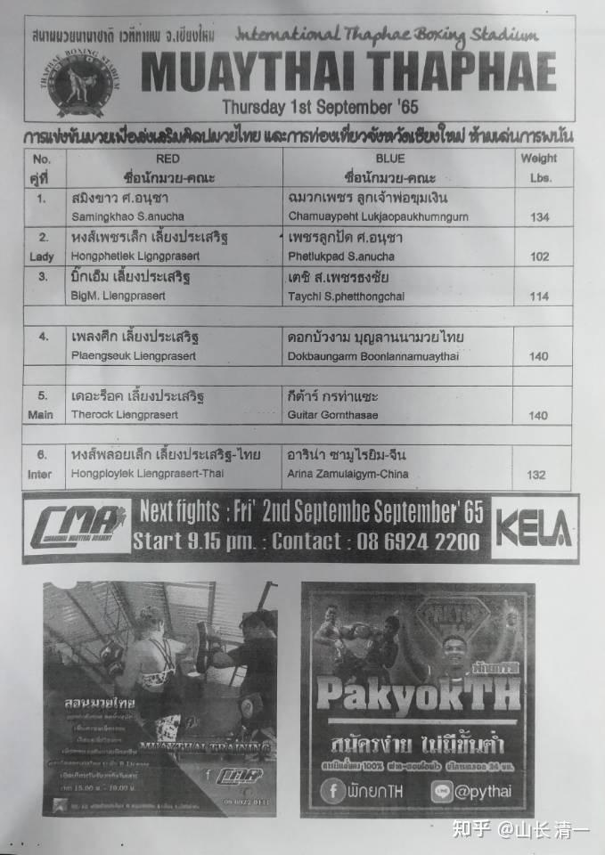
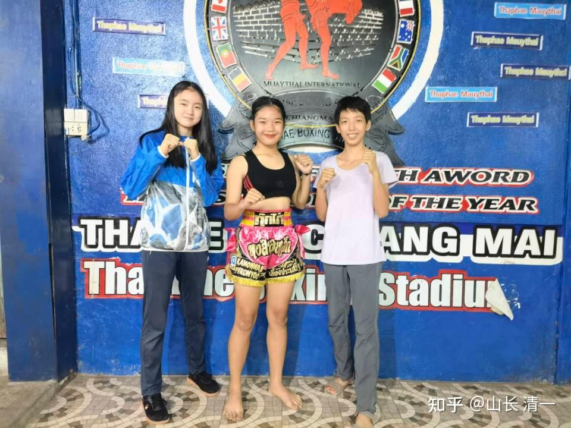
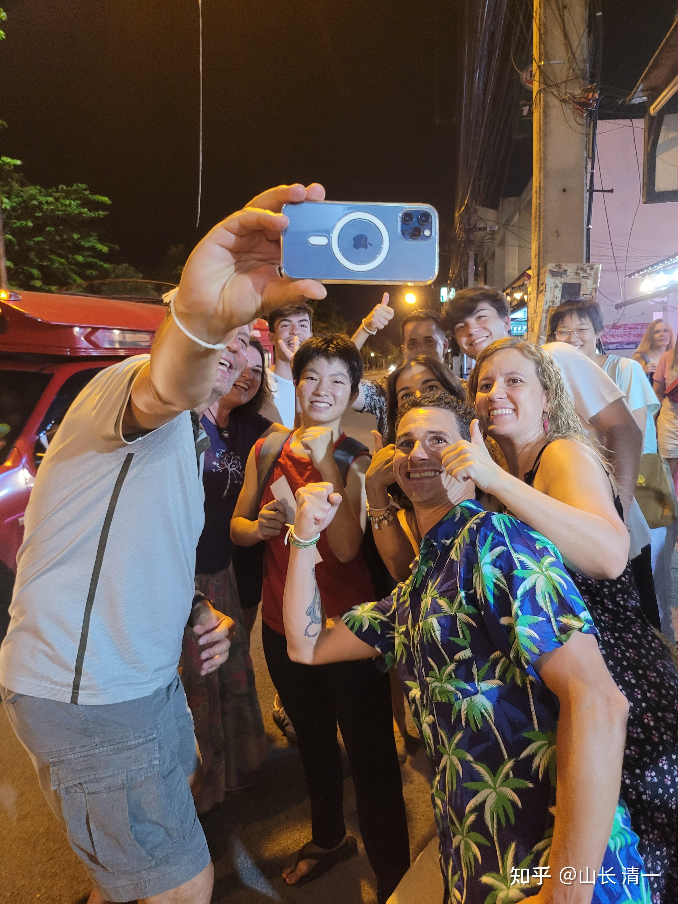
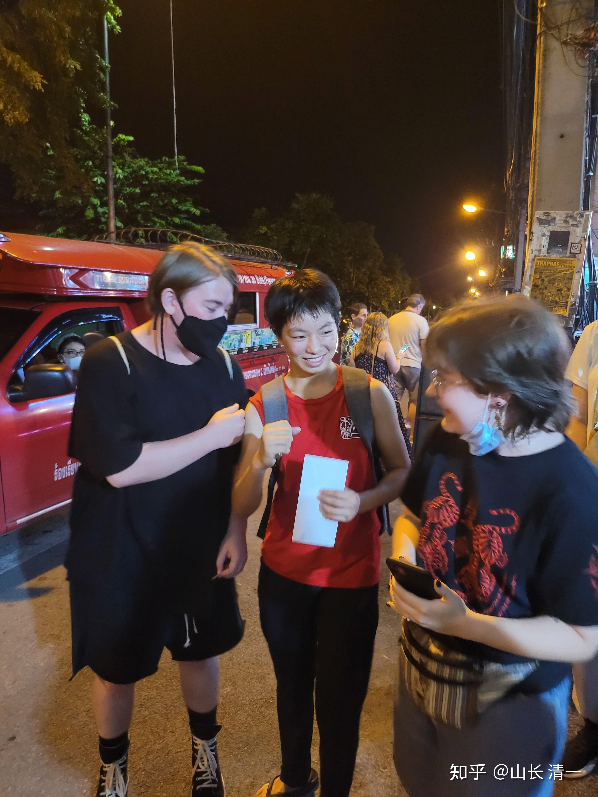
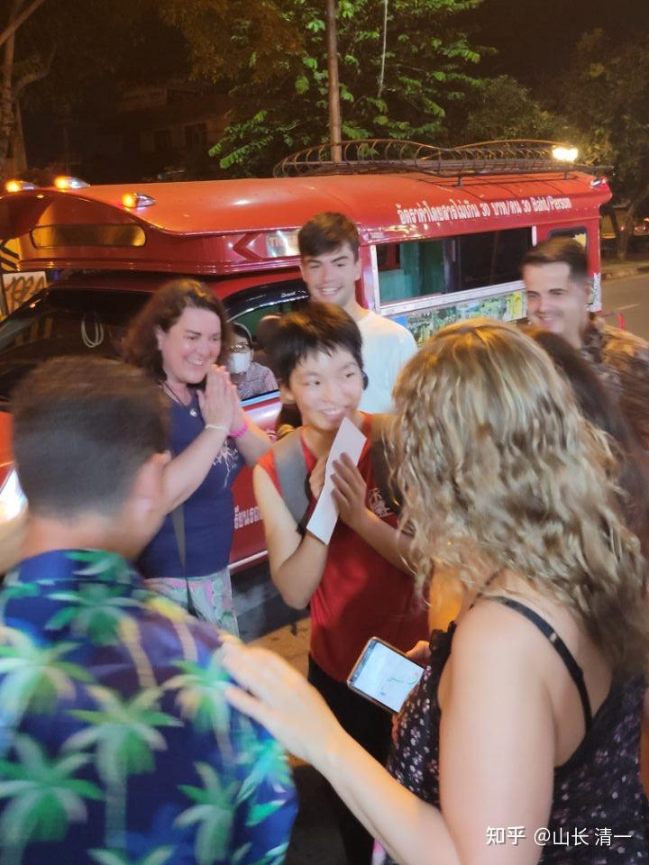

本次比赛的海报：

赛前，主办方给了我们与佳慧对战的拳手的名字。我们查到的对手，是一个55公斤级的高级拳手，水平较高。大致上算是北方地区的一流水平吧。当然，我们也没太当回事情，因为无论啥来头，都不可能是我们的对手。

昨天去赛场，拿到海报，看到水单，我方有点傻眼：安排的对手，不是我们预先知道的这位，而是一个新拳手。比赛水单上，注明的体重级别是132磅。木兰们赶快查对手的资料，可是网上怎么也找不到。好像是泰方藏起来的杀手？或者名字故意乱取的，让我们找不到资料？

*我们是压场的比赛*

我一看：认为这肯定是个坑。不知道泰方要干什么。只是意外发现对手体重是60公斤级，差不多跟我一样重了。这样的女泰拳手，其实相当于“女生最重量级”了。木兰们对付我这个体重的选手打内围，是很吃亏的。内围战体能根本就抗不住，就算技术差一点，死拼体能，都会被消耗光的。何况一直以来，泰方都在内围战中坑我们。赢了也判输。所以：我赶快交代前方将士：改变原来的作战计划，不当玩了。佳慧面对不知情的泰国拳手，必须采取最保守的战术，步步为营。不给对手创造机会、特别不能打内围战。艾拉明晓，也去直接找对手，观察情况。

结果让我们大跌眼镜：对手原来是这个人（比赛前艾拉明晓找对方拳手的合影）

*征泰第13场，佳慧对手的赛前合影*

艾拉的身高是1.70，一比较就知道，这拳手身高大约在1.65左右。不算高。另外---虽然肯定比佳慧重，但怎么也不像60公斤的样子。特别是问她的年龄----才15岁？打的实战比赛也不是太多。不是泰国我们见惯了的百战拳手。我彻底蒙了：这是啥意思？泰国的格斗天才出世了？而且----更奇怪的是，这个拳手，赛前根本就不知道木兰们是啥级别。只知道是中国来的女拳手，没打过几场比赛。她也根本就没有看过木兰的比赛视频，也没听过木兰们的战况。我估计：她心里还认为---主办方给她这个打外国菜鸟的机会，是帮她刷成绩的吧？不知道原来清迈的高级别拳手，现在根本就不愿意跟木兰打比赛了。泰方拳赛组织者，安排她来与佳慧对战，是当冤大头的，知道她就是菜鸡，专门来被佳慧狂揍一顿。（我们也是赛后才知道这些的）。

不过赛前，我们看到这张照片，有点看不出对手的厉害之处，也不敢掉以轻心。我依然在想：会不会这人是新出的格斗天才？就让佳慧小心对付。上场前，看到有几个外国人，去跟这个泰拳手互动。还教这个拳手如何打。拿手当靶子让泰国拳手来打，感受力度。应该是几个洋白人，去试验一下泰拳手的实力。看这个泰国拳手是真是假，跟中国人打是否有底气。按照泰国的标准，这女孩的力量速度还是有的，但---论实战经验，临场变化，是远远赶不上木兰们的。拳脚有力气，也打不出来的。

昨天的六场比赛赛况激烈，排在我们之前的五场比赛，基本上都是KO结束的。所以很快就轮到我们比赛了。一上场，佳慧就发现两件奇怪的事：

首先是裁判的态度变了。原来她已经习惯了对她很不友好的裁判。这一次，居然她一上场，裁判就对她非常友好的笑。她觉得有点怪异----今天裁判不太正常。她就更加小心了，觉得真打起来，不知道会有啥结果。

另外还发现：---对方不像想象中的强大，似乎水平很一般。前两局，佳慧很保守，有点试探实力的味道，不敢放开打。还发现：双方内围纠缠在一起，对方处于下风的时候，原来裁判，都会第一时间冲上来拉开她，保护泰拳手。这一次却很奇怪：任意看她内围狂收拾对手却不来拉开。内围战的结果，明显对佳慧有利。佳慧觉得---今天的裁判似乎蛮公平的，难道不拉偏架了？

到了第三局，佳慧开始正式的发动防守反击。泰拳手一出招攻击，就被她十倍打回去。结果发现对方跟上次的对手不一样，一点都不耐打。在她连续输出了两轮拳腿攻击之后，裁判也不去保护拳手了。但对方的教练已经看出：两人完全不在一个水平上，赶快叫停比赛。裁判宣布本场比赛佳慧TKO获胜。不过-----怪异的事情，是裁判，解说员，看门守场子的人，面对这个结果，不像上次佳慧赢了一样，表现是很不开心的样子。这一次，这群泰国人反而都特别的开心。对佳慧和木兰公主们都特别友好。

最终：一个我方的泰国伙伴，昨天去找泰方赌拳，失败了，才解密了昨天的比赛。昨天安排的比赛的确是个坑，但这个坑，是为对手设的坑。是为现场的外国人设的坑。由于木兰们的比赛， 我每次都给钱，让这泰国朋友帮我押几千块钱在木兰赢上面，如果赌赢了，我就让他拿赢的钱，去请我们的工人们吃鸡买肉买酒啥的。就算是取之与泰，用之于泰。反正我也没掏自个的腰包。如果万一赌输了，就算我拿钱出来支持木兰了。结果你们知道：上一场明晓的比赛，裁判就判我们输了。我昨天给了他加倍的钱，让他去压木兰们赢。我说我不赌钱，我这是算数学的概率，如果每次输了，我下次就加倍去赌。赢了一次，以前的全部本钱就都回来了。如果是简单的赌大小，你们去赌场不断这样加码玩，其实赌场是受不了的，最终他一定输。这就是用数学逻辑，战胜赌局的职业赌徒的方法（职业赌徒不是赌徒，是精算师）

原来拳场的赌局召集人，都是尽量鼓励他多加钱去押拳赛的。但昨天，他要拿钱去赌木兰赢，对方根本就不接受。说：他真要赌拳，就只能压木兰的对手赢，不能押注木兰赢。因为泰国人没有人赌木兰的对手赢。除非他自己去找对赌的人才行----他一个人都找不到。所以，他很沮丧，明明能赢的比赛，但却没有机会赢钱，他昨天根本就没有参与的机会，他还是第一次遇到这种局面。但他发现：这群不跟他赌的泰国人，昨天赢嘛了！

开始他想：每场必赌的泰国人，居然转性了？居然不赌拳了？当然不是：后来他才知道，昨天拳场的人，包括裁判和讲解员在内，全都是提前就押注木兰赢的，他们绝对不跟你赌木兰会输掉。但蒙在鼓里的，就是木兰的对手，以及现场被泰国人的“勇武精神”忽悠上当的一群外国白人。“叠码仔”（负责赌局拉人的人）一开始，以及跟拳场沟通了的导游们，就在不断的忽悠现场看拳的外国人参赌，说泰拳是五百年不败，中国人的实力不行，根本不是泰国人的对手。所以，如果要赌钱，想赢就一定要压泰国拳手才行。结果一堆洋人真的相信他们的话，去赌泰国人赢了。当然，结果就是昨天泰国人开开心心的数钱去了，成功第收割了这群傻白人。

上一次佳慧的比赛（第11场），现场这批人，都是赌佳慧会输的。因为他们找来的对手很强，你们看现场这个拳手也很拼。据说这场拳赛的一个神秘老头，赛前还跟她合影，装出很爱国的样子，鼓励她一定好好打，给中国人一点颜色看，为泰国争光。承诺赢了，会额外给她高额奖金。所以，赛场上她拼的很厉害，输了也很伤心。但我们的泰国朋友告诉大家：上一场，泰国人对自己的拳手很有信心，是让外国人去买佳慧赢的。目的是想要坑他们的钱。只要五局打下来，佳慧都没有KO对手，裁判都是他们一伙的，一定判佳慧输。这样就把外国人的钱都洗了。但：佳慧却“意外”KO了对手，让上一波的外国人，把这群泰国人的钱都赚走了。泰国人为了捞回本钱，就特别第安排了这次比赛，故意从外地找了一个很普通的拳手来打佳慧。所以----就算是佳慧这一次，只要五局，只要没被KO，肯定会判佳慧赢。现在佳慧是“潜规则”的一方，跟泰方利益一致了。因为泰国人买她赢，肯定就不能让她输掉比赛。除非她太不成器，当场被对手KO。泰国人留了非常大的余地，来安排这场比赛。选的拳手“很保险”就是很菜。其实他们选金腰带来也一样被KO的。所以，双重保险之下，昨天泰国人赚麻了。赛后都高兴的要命，裁判和解说员，都使劲的笑！

现在总算明白了：泰国人昨日比赛，的确是一个刻意安排的大坑，但这是为外国人挖的大坑。我也比较高兴：泰国人终于认识到了佳慧的实力。与其找对手来收拾我们，不如支持佳慧，让佳慧好好打比赛，帮他们泰国人赚钱。这样其实对我们也很有利，估计以后会成为常态，泰国人将来，应该不再会排斥，潜规则我们了。这几个中国木兰，会成为泰拳场这群主办人很稳定的摇钱树的。他们会去不断忽悠一些瞧不起中国人格斗水平的欧美“懂行的洋人们”，来为自己的错误认知买单的。

不过，我还是警告木兰们：就算是现在泰国人对她们很友好，也不能跟这群人关系混深了。自己专心打拳就好。不然什么时候，成了趋势，这群人会要求她们打假拳的。比如，找一个无名气的拳手来打木兰，然后安排木兰，赛场上温和一点，不许KO对手。最终打下来，裁判会判木兰负的。这样，就把一直看好木兰不断赢的人全洗了。泰国人经常玩这一套的（播求当年就是中国方的人，不许播求KO一龙，打了一场假拳）。

还有更恶劣的：曼谷的赌钱更厉害，一些拳馆的馆长，都会拿自己的拳手来赌钱。有一个教练，自己的拳手一直赢，有一次，他就让这个拳手打假拳，不许KO对手，最好失败掉。而且还特别请自己的拳手吃鱼，结果在鱼里面放了拉肚子的药物，害自己的拳手。这是这个拳手自己说出来的。

还有一些拳手，因为比赛的结果不如赌拳者的意思。打完比赛后，就被人在伦披尼拳场外用枪打死了。我估计就是让拳手放水，他们会为此赌上百万。但失败的一方，迁怒与拳手不听话，就会拿枪去杀掉拳手。泰国是可以合法持枪的。所以：我让木兰们，作为拳手，就老老实实地打拳，不要去卷进泰国人的江湖世界里面去，不要去赚这种赌博的钱，我们要学会自保。幸运的是：我们作为外国人，一般来说泰国人不会找我们做内幕交易，只会利用我们来坑外国人。

至于：这些泰国人，利用木兰比赛来骗外国人下注输钱，跟我们无关。我们自己不骗外国人就行了。外国人，特别是白人，一直就瞧不起中国人的格斗水平，更不相信中国人会赢泰国人。我们木兰就让这群白人多输点钱，买个教训也好。昨天现场就有压木兰输的白人，气的在场上使劲乱拍桌子，怎么也没想到他押宝的泰拳手，居然被佳慧打成无法还手的样子。这场面，绝对不是假的。太真了，真到他们想自己抽自己的耳光。

泰国拳场的人，来做这种事情，对我们也有利。我们愿意配合泰方来玩这种游戏----全力击败泰国人，让欧美人出钱来供养！中泰双方各取所需：我方击败泰拳得名，泰方输掉比赛得利。至于欧洲美国人，自己来当消费者，当冤大头，为我们双方的事业付钱买单！（木兰的出场费，比泰国拳手高一倍左右）

*赛后，佳慧收获了一批洋人粉丝！*

*佳慧外语良好，赛后与洋人无障碍沟通交流*

关于视频：艾拉公主正在翻译和制作昨天的比赛视频。会把现场的播报，对方教练的呼唤，等，都翻译成汉语。这场比赛，没啥技术可以看。一场【单方面的杀戮】，但看看这些背后的江湖潜规则，倒是非常的有价值。太长见识了。木兰们在这种险恶的江湖环境中成长，将来一定是拥有非常高超的生活智慧的。两个木兰将来想做我的“泰国助手和保镖”，就必须熟悉各种泰国的江湖潜规则。犯傻的话，就像这群白人，被坑了还会去安慰假装哭泣的“爱国泰国人中介”。没事，输了钱也不怪泰国拳手无能，是中国人太厉害！

视频请改天看我的视频集的上传吧，今天就免了，木兰需要时间去制作！

更新：有泰国的热血拳手主动来挑战我们的木兰了：

宋晓莉 16:50:54

@山长 清一 山长好，麦当Du叔叔说，他认识一个女泰拳手想要挑战佳惠。刚刚问我要佳惠的体重和照片。请问山长，如果可以配对，我们接受挑战吗？还是让他先把对方资料告诉我们后再决定？

山长 清一 17:07:37

好呀 任何选手都答应。不用多考虑级别问题，身高，体重比我们木兰重，我们都可以应战。

还可以告诉对：打赢了，我还给这位勇敢的女孩奖金。比塔佩拳场的拳手出场费至少高两倍的奖金。如果能她够擂在台上KO木兰，就奖四倍的奖金。因为我喜欢勇敢的女孩！[表情]

好的山长，今晚派阿伦去找Du叔叔了解一下具体情况。有新的信息，再汇报给老师伙伴们[表情]

全红 20:19:07

@清迈 刘明慧 老师，白房子女工作人员说明天来工作。[表情]

你撤回了一条消息

山长 清一 20:24:09

@宋晓莉 还可以说：打赢了，我还给这位勇敢的女孩奖金。比他塔佩拳场的拳手出场费至少高两倍的奖金。如果能够擂台上KO木兰，就奖四倍的奖金。因为我喜欢勇敢的女孩！[表情]