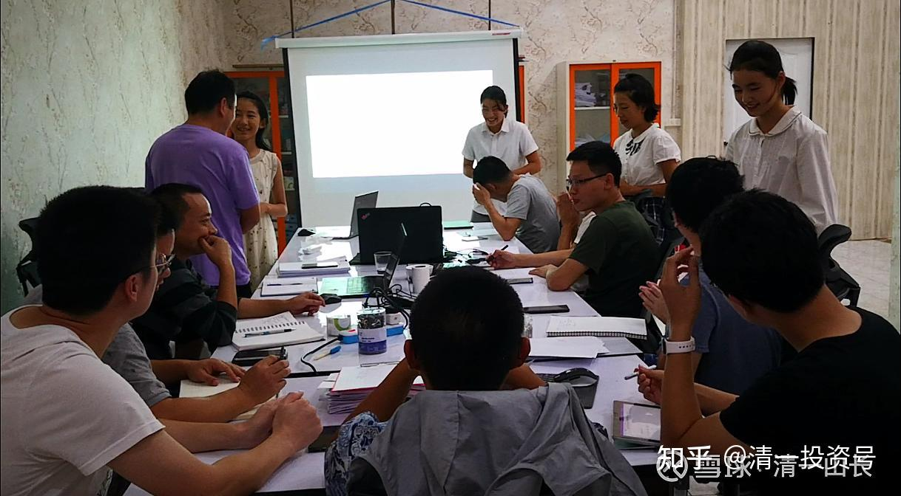

原雪球专栏[115篇.真大学，就是“神仙，老虎，狗”的大学！](http://link.zhihu.com/?target=https%3A//xueqiu.com/9310099567/172849293)

清一山长2021年2月26日

@学徒杉林，你是我20年前的老学生？证明我不是冒充武大教师的假货[俏皮]。

关于“讲我们关心的内容，教我们思考的课居然被审查。那些无聊至极的课，却从不被领导关注”。

其实我是被我所在的人文学院的院长、书记叫去办公室当面教训过的：“我们聘请你教课，是让你按教学大纲教的，不是让你想教什么就教什么的！”很正式，严肃地对我说。

我说：“我们武大的学生都很优秀，课本教材，都能看懂的，考试也很容易通过。讲课本，学生都不听课了。”

书记说：“学生听不听，是学生的事情。你当教师的，就是要按照教育大纲，严格执行课程标准。否则我们就没必要聘用你！”

行政人员训大学教师，是不是像训孙子一样？学生喜欢的老师，反而要挨骂！教师为了一个饭碗，只能给行政人员摇尾巴，臣服，哪有讲理的份？

这样子还像个大学的样子吗？老清华的故事，传说清华有三种人，“神仙、老虎、狗”。教授是“神仙”，想教啥，就教啥；学生是“老虎”，谁都惹不起。学生看不上的教授，就失业。学生都不怕校长，学生不满意，想让谁下课，谁就丢饭碗。所以，大学里面，谁都惹不起学生，连校长都不敢惹学生。而大学里面，地位最低的人，就是行政人员，像狗。因为学生不正眼瞧，教师也不正眼瞧，对谁都要摇尾巴。这就是真正的大学该有的样子，学生才是大学的主人。

当时的清华，是庚子赔款来建设的，学的是外国的真正的大学，真正的教育精神。跟“京师大学堂”这种官府办的学堂，还是很不一样的风格。引领了民国的教育精神，也是民国大师辈出的核心原因。

现在的大学，教师和学生，都是行政人员的“狗”，都得跟他们摇尾巴，谁不服从就收拾谁！最可怜的是学生，所谓教育的主人，却成了被忽视，甚至被忽悠、被虐待的对象。我听说有一些流言，来源还比较靠谱的，是说：一些很有名望的大学名校，有点姿色的女研究生、博士生，要被导师潜规则之后，才能通过答辩，拿到学位[捂脸]。不服——就找各种理由来磨死你。能像想象民国时期的清华、北大，会出这种事情吗？那时候，谁敢去欺负学生呀？就像今日学堂的老师，有谁敢去欺负学生，把学生拿来潜规则的？不是找死吗？当年，我留校当教授的朋友，差不多这德行。当年的几个小辩手，武汉大学一战成名，很多人对她们都很好奇。我也带她们去与我的老朋友们见面，是在一个校外的饭庄招待朋友的。结果让我很尴尬：几位武大的名嘴，全带了自己的“小蜜”来参加这个聚会，都是他们的研究生。我都不知道该给小辩手们如何解释教授们为何带小蜜来见我。可能是跟我比肩，表示：虽然传说我情人无数，但他们也不差？小辩手们说不定都是我的小蜜？

餐桌上，这几位名嘴，说是不相信小辩手有能力击败武汉大学的校队。研究生小蜜就现场提议，要名嘴教授跟我们的小辩手们现场辩论一轮。主题记不得了，大约是女孩子该不该早点嫁人之类的。是静慧跟他们辩的，没几轮，名嘴就说不上话了，若有所思的样子。他的研究生小蜜，就高高兴兴地说：“看你输了吧？连个小女生都说不赢，还吹啥名嘴！”打情骂俏的（我看这潜规则，也没啥不好的，看样子都是你情我愿，没谁吃亏吧？[大笑]）

另外一个长期当武大辩论队指导的教师（当时旁边也是他的女研究生），对我的小辩手说：当年做学生的时候，你们老师（指我）辩论都不是我对手，现在更不是他的对手。因为他是正宗的辩论队指导（我从来没有过这种参加辩论的历史）。他就不以大欺小，不跟孩子们辩论了，肯定不可能是他的对手，虽然他的学生输了，是因为没有他赛前给学生们提出的建议方案（孩子们问我是否如此，我说：“此人是当年的武汉大学界的十大杰出青年，比我牛多了”），没多说，何必去争啥长短呢？

这位老朋友，对他的学生辩论赛落败，还是心有不甘！对我说：今日的学生，都是我精选出来的人。所以比一般的武大学生强也不奇怪。但武汉大学的几万学生，他真要找几个各方面都很优秀的学生，是能够击败我们学生的。我也不客气，就说：让他来组队，再比一次。赢了，我拿一百万来奖励他。就不必辩论了，比的标准，就是我们的“五项技能”。他毫不犹疑的答应了，觉得这100万可以轻松到手。（当年武大的辩论赛，我给了这位指导老师一万元经费，让他组织辩手们来对战的，让辩手们不至于白干，怎么分，我就管不着了）。所以，想到下一次可以为武汉大学拿到100万奖金，他认为是毫无问题的。说我培养学生，也就只能从几十号人里面选出来苗子。他从几万人里面选学生来培养，专项训练，就不信超不过我的学生。

但是——半年后。他说：他真的无法找到能够跟我的学生能力匹配的队伍。单项比，还可以挑出来一些学生。要五项全面来比赛，基本上连一个学生都找不出来了，所以，只好放弃了这个名牌大学PK今日学堂的大计划。

对此，我感到很遗憾！大学，就是大。大学生，就应是综合能力强的人。连偌大的武大，都找不到一个五人队伍，在新教育的五项技能上（**上台能讲，下台能打，提笔能写，去学校能带班，去企业能带队**）。能够和我的学生一较高低的。实在是大学的悲哀！这是七年前的故事了。今天，我拿一千万元来做奖金，你们谁有信心组织五个体制大学的学生、研究生，来跟我们清一大学17～18岁的学生，PK这五项技能呢？有，就来报名吧[俏皮]。

其实，我刚研究生毕业留校的前10年，大学，还是有点像大学的样子，还有老大学的精神。不少当年的老教师，还是很有知识分子的样子的，起码不像后来这么俗气。我当年，也可以像一个真正的大学教师一样教书。大学里面的行政人员，原来是没啥地位的，只是服务教师和学生的人。行政人员，根本就不干预教师讲什么，教师想讲什么内容都可以，只要学生爱听就行。甚至学生，也可以要求教师讲一些他们想听的课。

记得当年，南联盟大使馆被炸，学生们都很气愤，斗志昂扬的要反美。我到教室一上讲台，学生就要求我不讲正常准备好的课，今天就专门给他们讲：到底，美国人是不是误炸的大使馆？我就讲了两个版本，让他们自己判断。一个是误炸的版本，用当时知道的各种事实，以及推理，来充分地证明，应该就是误炸的。他们听了，点头称是！心里没这么气愤了。

我就接着再讲另外一个版本：就是肯定是美国人故意干的，不是误炸。一样用当时知道的事实，用符合逻辑的推理来说明这一点。这一个版本听完，学生们全蒙了。因为觉得这个版本也很有道理，就非抓住我问：“到底哪一种才是真的？”我说，你们自己判断去呀？你认为是哪一种，就是哪一种。也许真相、内情，我们这些人永远也不知道，我们不可能掌握所有的信息，只能自己根据所掌握的一些信息去选择和判断了。你们**当大学生的人，就要有自己的判断力，不能光听老师的标准答案，就搬过去照用就算了**。我**当老师的人，也只是负责教你们学会思考、判断。不是替你们思考，教你们站队，给你们答案的**。这才是真正的大学，真正的教师，学生该有的正常状态。

这就是那时候的教师和学生，上课可以自由到这种程度的，临时改变课堂内容都行。学校行政也不管，只要老师别缺课就行，别被学生投诉就行，这就是教学事故了。当时的期末考试，也让教师做主，随意出题。不像现在全校公共课都是统一出题，统一考试了。教师有很大的上课自主权。所以，当年各大学的公共课教学，其实课堂的思想还是很活跃的。很多优秀的教师，都是教这门课出身的，也想尽量的把这门课教好。（现在的公共课，好像是专门的睡觉课了吧？老师不敢越雷池一步，照本宣科，学生自然睡觉、逃课、打游戏）。

但1998年以后，大学就越来越不像大学了，教师的地位，学生的地位也越来越低了，越来越像个机器。姚国华有一句很著名的话：“武汉大学曾经是一所大学，华中科技大学从来就不是一所大学”，他的意思，华科就一技术学校，培养工程师的，跟大学精神就没关系。但说这话，领导不爱听，所以一直没提职称吧？

为啥他认为“武汉大学曾经是一所大学”呢？民国时期，可能武大还是一所大学的。在刘道玉当校长的时期，武大还是很有点像大学的。

现在呢？我看全中国，就没有一所真正的大学。清一大学，要超过中国所有的大学都很容易。只要像大学，就超过它们了。其实没啥真正的对手！想办学成功很容易：找到大学精神，就能成功。

像大学，难不难呢？其实很容易。就是像老清华一样的办学原则就行了，办成一所“教师是‘神仙’，学生是‘老虎’”的大学，铁定就是一所真正的大学。如果这个大学，还能够招到第一流的学生，来这样的大学上学，你就铁定是第一流的大学。因为第一流的学生，会自动选出第一流的教师的。

清一大学，今日学堂，我在管理上，都特别强调：行政人员、后勤工作人员，都不能去直接管教师，要求教师。只能为学生和教师做好服务。学校里面，是实行“教师治校”原则，教师们集体来讨论决策教学和活动，也不受外来的行政干预。清一教育基金会，只管出钱来支持教育，不能去管教师该怎样教学，甚至不管收什么样的学生，退学什么样的学生。都是教师说了算，教师只要拿出教学成果，家长认同就行。这样办学，根子上，就是真正的教育，真正的大学。**把学生和教师管得像孙子一样，这是工厂，不是学校。**

图片，是清迈的几个15岁小女生，在教中国电建的项目经理们学泰语。她们其实就在我的身边“上大学”，是自由地学习和提高自己，跟我上研究生时候一样的模式。这是比原来的明一班更自由的学习方式，未来中国的大学生更不是对手。（她们15岁就去教985大学毕业生、研究生，还很受大人们欢迎。您认为她们将来会差吗？什么事情不能做？只要自己想做就做。现在学什么课程、专业，真的重要吗？）

转载：@学徒杉林：我对山长的印象一直是亲切、幽默、真实、智慧。从大学马哲课到现在20年了，没有变过。要说变，那只会是更亲切，更慈悲，更伟大。可能因为我只是一个默默在学习山长，离得比较远的学生，没有体会过严苛。

忘记是2001年底和2002年初了，但对对山长的印象却还是比较清晰的。那时刚上大学，突然心理遇到问题，找不到人生方向，找不到自己的价值，也不会思考。对大学主修课都没啥兴趣了。更不用说马哲了。

当天好像是一个晚上的大教室，山长穿着一件黑马夹，身形很好，面带微笑，提前拎着一台手提电脑进来的。给我的感觉，就是这个老师不一样，也不知就是哪里不一样。上课后，老师说他能回答所有的问题，让我们随便提问。我也提了。我的问题是，“我为什么提不出问题”。这也是我唯一的一次直接面对面给老师提问题。老师的回答其实我已不太记得了。可这一问让我永远记得。就像开了一扇窗。

后来的马哲课是我必上的课，以及大学四年老师所有的讲座，包括老师的电影课、武术讲座。课上，老师讲过音乐，当时谁的问题思考得好，能参加校长的小课，还可以感受用音乐发烧友的设备欣赏音乐。我是那群没有选上的普通学生之一。

还有一次马哲课，我旁边来了个院领导（后来知道的），这个领导坐我后面，也不发声。老师那天讲课的内容一下子很课本，很三个代表了。不过老师讲三个代表都讲得很好。后来听说那个人是专门来审查校长讲课内容的，当时觉得挺搞笑。讲我们关心的内容，教我们思考的课居然被审查。那些无聊至极的课，却从不被领导关注。

毕业后，一直在关注，一直在学习，看校长的博客像追剧一样，急切渴望校长的更新。网上不停搜索老师的视频。每一篇文章，每一个视频都如获至宝。

我的雪球名叫学徒，其实这个心中的老师就是山长。这只是我自己心中的认定，知道自己做得还不够好，还配不上山长学生的称号。但您永远是我的老师。

（以下内容为编者附录）

**评论回复：**

**火侯2021-02-26 12:51回复清一山长：**

山长你最近这明显是炒作自我了，反对一切的个人崇拜，思想控制。你家老大和老二到底谁更优秀，拭目以待。

**清一山长2021-02-26 13:29回复火侯：**

我刚打赏了这条评论¥1.00，也推荐给你。我家孩子老大、老二谁更优秀，关你的脸事吗？

倒是跟我的脸事有关。我家孩子，如果敢丢我的脸，没有荣誉，不懂羞耻，就会被我直接赶出家门的。目前为止，他们都很优秀，各有各的优秀，我分不出谁更优秀。

拿了钱，就走吧！估计你发帖，就没拿过打赏的。给您一点创纪录的礼物，拿了就尽量走远点。这里真不缺您这种人！

**武洛奇2021-02-26 13:15回复火侯：**

你这人好奇怪，别人的家门口，你管人家放什么？看不惯可以自己离开或者拉黑山长都行，在这里留言算什么意思？不出意外，没人会拉着你不让你这样干的。只是最后损失的是谁就不知道?

就好像你不抽烟，就要身边所有人都不抽烟一样。这样似乎也忒那个啥了吧？？

正月十五呢，不想说什么，但看到您的留言，还是忍不住来叨唠两句，一瞬间就想到三、四、五个字：“全能神”，管的真宽，操的心不少。

**ellhll李华丽2021-02-26 14:54回复清一山长：**

虽然山长所说的“老师是神仙、学生是老虎、行政是狗”的真正大学课堂我没有接受过，但是从常识推理，也知道这是最佳的老师、学生、学校的摆位。学生是教育的主体，当然由他们来决定确认老师讲的东西自己是否喜欢。

就像商品的创造和购买，老师是商品的创造者，学生是消费者，而行政管理就是服务于制造者和消费者的后勤人员。

制造者根据消费者的需求创造更好的产品，消费者根据体验决定自己喜欢什么，后勤人员只是提供条件让生产和消费更方便进行。

乔布斯如果受制于后勤人员，后勤人员拿着指挥棒，指挥乔布斯的创造团队该怎么样制造手机，那这个世界就没有苹果手机的存在了。即使苹果公司现在是世界第一的手机引领者，一旦这种后勤凌驾于制作团队和消费者的情况出现，苹果公司一定会被市场抛下。

大学如果一直是这样角色颠倒的现象，被时代抛下也只是时间问题。

雪球虽然不是大学，但其实更像一个真正的大学。有独立见解的人在这里分享自己的投资经验、人生经验，球友在其中选择自己最欣赏、最敬佩的人跟随学习，雪球的运行团队就是服务于分享者和学习者的后勤人员。自由加入，自由离开，自由分享，自由选择，自由提升。在这里，很多人找到了导师，找到了同伴，找到了知己，获得了成长。良性发展下去，或许，雪球真可能成为未来世界的大学。谢谢方丈的雪球，让我们有机会在这里找到老师、遇见同伴，学习提升。@不明真相的群众

刚看到了这位@火侯的评论，粉丝数为0，雪球发帖的最早记录是2021.02.08，在雪球里算是新手吧！哪里来的狂妄底气？只能说，世上一直都有这样的人：不看事实，没有依据，用自己狭隘的价值观，用一些大众不喜欢的帽子胡乱扣在别人的头上，他以为，用上了这些帽子，他就会有支持者，不曾想大部人都眼睛亮堂。

山长在雪球上反复说，他接受不同的意见，只要你有理有据，可以说出来大家对论，他尊重有理性独立思考的人，不会因为别人不同意见而拉黑，但是，没有理性还喜欢攻击人，那还是请走开，还这里一方清静。

**清一山长2021-02-26 18:52回复ellhll李华丽：**

你的**“雪球大学”**概念很好，的确很新颖。

新教育的“神仙、老虎、狗”是谁呢？

传统大学的教授，当然是“神仙”。他们负责提供知识产品。但新教育，其实没有这样的一个角色。这个角色，拿给互联网了。网上有各种“神仙”，高级、低级的都有，你喜欢谁，就拜谁。就入谁的门，做谁的徒儿。您喜欢什么内容，就去学什么内容。所以，只要有网络，你就能上全世界的大学，就能读全世界的所有专业。关键是：你要啥的问题了，不是能不能的问题。一切均可自选！学会选择的能力就好。

**新教育学堂的“神仙”**是谁呢？其实**是学生**！想学就学，不想学就拉到。想学什么内容，就给老师提要求；不想学，老师们马上放弃教学换新的科目。学校里面，没谁会强迫学生学习的，学生自由度很高，当然是神仙。

**体制教育的学生是**什么角色呢？不是狗，**是牛马**。因为好的体制学校，一定要出成绩。教师的工资、奖金，以及职称，都跟学生的升学率啥的挂钩了。所以，**教师们像工头一样，拼命的逼孩子们学习；校长们为了名利，也拼命地压教师们出成绩；家长们也压孩子们考高分，一分压千人。所有的压力，都让孩子承当了。**所以中学阶段，孩子们都是做牛做马的。要给爹爹妈妈、班主任、带班老师挣工分，等终于考上了大学，孩子们放飞自己，也当“神仙”去了！就不再学了[笑]。

**新教育学堂的“老虎”**是谁呢？**是家长**。没看见：今日的老师，和我，都最怕家长吗？不敢跟家长走得太近。伴家长如伴虎呀！我原来一直说，今日学堂是弱势群体，你们都不相信。因为你们认为：今日是名校，想申请入学很不容易，所以我们一定像老虎一样很威风的。家长都要求今日，才能来上学。其实，是你们求错了对象，你的孩子如果拼命想上今日学堂，他一定能考上，标准面前人人平等。如果你孩子不合要求，你求今日的老师也没用的，谁都不敢放你进来。所以，今日不能拿入学标准来卡家长的。但家长对今日可以想粉就粉，想黑就黑。我们拿家长一点办法也没有。你粉今日，学生不符合要求，我们也没法收您的孩子。你黑今日，就要把孩子带走，我们再喜欢教你，也毫无办法。所以，家长是不是“老虎”？

**聪明的“老虎”家长，是不咬学堂，不咬老师的。咬谁？咬孩子。**如果孩子在家，天天看着一个凶猛的“老虎”，惹不起的“老虎”，伴君如伴虎的家长，您认为：他不哭着喊着都要考今日才怪呢！家长在家里不当“老虎”，当奴才。送来学堂，指望老师当“老虎”管教孩子，可新教育的老师都是“神仙”，不是“老虎”，您的孩子就废了。

“清黑”倒是蛮狠的，比老虎还狠毒，咬人很凶猛，咬上了，还怎么都不松口，有点像鳄鱼一样。如果用这毒辣的本事来咬孩子，孩子一定只敢好好读书，不敢懈怠玩游戏了，一定会成为优等生的。

所有优秀孩子的家长，可能像老虎；游戏孩子的家长，一定像神仙！啥都不操心。这就完了！

没见过哈佛的书（《我在美国做：耶鲁学院教授的育儿经（〈虎战歌〉中文版）》），就是“虎妈”吗？这蔡教授，虎气十足，把两个女儿都送进了哈佛。这就是学会了我教你们的这种心法——家长当“老虎”！

**新教育的教师，当不了“老虎”，也不敢当“老虎”。**我们几乎就是兔子一样，真的是弱势群体。**新教育教师，并不是知识的提供者，而是学生的辅导者，是您孩子的伙伴。**所以，我们一旦失去服务的能力和愿望，就会被家长们、孩子们果断抛弃。一个提供不了专业知识，还无法去帮助和指导学生的新教育教师，谁要？

您想想，这道理对不对？

**ellhll李华丽2021-02-26 17:04回复清一山长：**

谢谢山长，您说的很有道理。

但是很抱歉，我有不同的看法。如有不对，请山长棍子打下来。

我认为在真正的新教育里面，老师、学生、家长都是一样的双重身份：“神仙”和“老虎”同存于一身。新教育没有狗，没有羊。

1.老师

虽然有网络资源任老师和学生选择，但这些资源就像是神仙眼中的素材，没有好坏，只看怎样使用。老师是“神仙”，可以有足够自由的空间，选择如何使用素材，如何化枯朽为神奇，可以把反面的教材变成促使学生思考的东西。老师是“神仙”，因为老师的心是自由的，他们可以自由选择学生和家长，对不合适的说不，对不属于这个教育的人说不，甚至对您说不。

相反的，如果老师觉得这个方法对学生好，只是一时没有通，那老师会化身“老虎”，会有一定的方式，促使学生奋力前行，当然前提是，学生和家长真新教育人。比如跑步学堂。

2.学生

学生是新教育的“神仙”，他们决定老师，有权力去投票评价老师是否胜任，决定选择谁来做他们的老师。他们决定学习的内容，除了老师提供的海量资料他们可以选择之后，他们甚至可以选择更大的方向，比如您说的如果他们想，或许他们有一天会选择玩转理工科。

学生是“老虎”，对于不能真给自己帮助和智慧的老师，他们就是“老虎”，让你下课就下课，那可不是“老虎”吗？老师岂能不实实在在提高自己别被学生给挑剔了。

3.家长

家长是“神仙”啊，看到孩子学得这样开心、这样好，活得这样自在，真是快乐似神仙。他啥都不用管。

但如果他知道孩子短期内出问题了，他知道变成“老虎”能让孩子冲破这样的短期问题，他真的会是最凶的“老虎”。就像您对自己的三个孩子一样，就像鸟爸爸鸟妈妈逼迫小鸟学飞一样。

新教育的真老师、真学生、真家长，是“神仙”，解脱食欲、物欲、世俗的束缚，活得健康自在；不受名利的牵绊，自在地做真教育，学习传播真智慧。

新教育的真老师、真学生、真家长，是“老虎”，对迫害和攻击新教育的行为，他们勇而有谋，不会死磕，打得过的打，打不过的会有智慧地避开继续前行，因为，他们的目标不是成为最能打的“老虎”，而是活得足够长去实现理想。

**清一山长2021-02-26 18:43回复ellhll李华丽**

呵呵。您作为“准家长”，很给我们面子。我知道您正在准备儿子的清一大学入学申请，SAT官考分数线已经过了，年龄也符合要求。可以说，您是我们未来的家长。所以，您很给我们老师和学堂面子，给我们都授予了“神仙”和“老虎”的荣誉学位。这是您尊师，不是我们有多神气。

我真的不觉得我们的老师可以当“神仙”，更不是“老虎”。别说老师们了，就说我自己：被教育局赶，被别有用心的人栽赃，被清黑们污蔑，谁把我当神仙了？我能逍遥像神仙吗？我能发威像老虎吗？我倒是蛮像个兔子的，见不对劲，就溜了。还挖了不止三个窟，躲起来不出头。哪有一点点的虎威呀？更别说我的教师们，还有啥虎威了。我有时会想：我的前世，会这样窝囊吗？这辈子怎么这么没出息，一点也不像个叱咤风云的人物[捂脸]。

就算是在拥护我的家长面前，我也不是“神仙”，肯定也不是“老虎”。我知道家长抬举我，所谓的拥护我，只是让我好好地教好他们的孩子，做好家长的服务生罢了。所以，粉我也好，黑我也好，我都不像神仙的，更不像老虎。相反：就算对清黑，我也只能忍气吞声的，气死我了，都不敢放开来骂（2016年，清黑们把小明慧都扯进来，唧唧歪歪的乱说话，我真的很生气，太过分了）。我要生气了，说了几句过头的话，更多人会反过来开始骂我了：看你一个做教育的人，怎么连点修养都没有！[捂脸]

所以，您看我们哪里有老虎的相？除非是清黑敢跑我家里来闹事，为了家人，我只好发一点虎威。所以，估计我在家里面，勉强算是一只虎吧？要不，还是老兔子一只？因为兔子急了，也咬人？[大笑]

我对我们的教师团队，对老师们的教育培训，不断地强调我们的身份定位：我们不是“老虎”，不是“兔子”，不是“神仙”，也不是狗。是什么呢？我的原话是：“**我们从事的是教育服务行业，我们必须要让家长们满意，服务于家长的需求。我们与别的教育机构不同之处，无非是我们是卖精品，卖高端品牌的。但我们的服务本质并没有变。所以，家长需要什么，学生喜欢什么，我们就给什么。学生不想学的话，老师们也别强迫学生去学。就及时的通知家长：他们家孩子不需要我们的教育服务，为了保障家长们的教育投资不至于浪费，请及时接回家。**”

您看，我们就是服务业的，不说是狗，是客气话。这样说我们有点太没面子了。再怎么服务，起码是服务教育的。——读书人，偷书不算偷——教育人，服务也不是狗——瞧，这多不好意思……[捂脸]。

不过，说真话：**新教育的教师，其实很像是“导游”，我们不负责景点（专业学科）的建设，所以建设的成本很低，算是轻资产。不需要啥博士、硕士的重资产。十几岁的小孩子就能胜任新教育教师了。而顾客（学生和家长）想要游任何景点，我们都可以带着一起玩，介绍景点特色啥的，老师们边学边练。**

在互联网提供教育之源的知识海洋中，我们可以自在的游玩，可以学习任何学科，打破了专业壁垒。这就是我们与体制教育最大的不同。也许我们今日学堂，是教育游轮中最高端的船只，这是我们的追求，但本质上还是服务业。服务于家长的需求，目标是家长想去的地方。我们只是精通教育行业玩家攻略罢了。

老子、庄子、鬼谷子，都是“神仙”的景点。家长想去看，我们可以带路一起去。如果路上遇上了小鬼、妖怪，家长得变脸，当“老虎”，做护法。别让它们来咬我们，我们是同路人，去咬拦路的小鬼妖怪才对。我们当导游的，才可以顺利带你们家长到达目的地。家长如果要取经，就要当悟空，当护法，来保佑我们这些无能的唐僧们过关。不然我们被妖怪吃掉了，经也取不回来了，就这个理儿！

“清黑”家长不明白这个理儿，老以为我们是摇钱罐，想要砸开了就有好处拿。所以，吓得我们的老师，全当兔子了。躲的躲，逃的逃，都跑开了。我跑得最远，都跑出国了[大笑]。真羡慕“老虎”呀！可惜真不是！你们才是。

比如您作为家长，9月份申请入学，如果年龄符合要求，考分符合要求，合群符合要求，体能符合要求，没谁敢拦你不许入学的。你虎威一发，网上自媒体公示出来，证明清一大学违反了公开的招生承诺，有人对你搞潜规则阻止你申请入学。我们不就成为过街老鼠了吗？发现了这点没？**互联网时代，信誉很重要，真诚很重要，承诺也很重要。对人玩潜规则，实行不通的**。我喜欢互联网时代。要在明朝，我这种人，不倒大霉才怪。你看王阳明尊为圣人，也是九死一生，郁闷而死！我想：他活在今天，要开心得多！起码可以出国了。

祝福您和儿子！[献花花]

PS：您提到了跑步学堂：没错，这是一个“老虎”专门来对付问题儿童的地方。但，这个学堂可不是今日学堂的正式机构，不归今日学堂管。他是家长来亲自管理的非正式机构，还不对外招生。您的朋友马女士，在负责这个学堂，以家长的身份来当“老虎”。我们的老师，都不敢当的。我只是她的老师，指导她如何从原来的女仆，以及女奴角色，慢慢变成了孩子现在眼中的母老虎。一年多之前，她的孩子手上拿东西，还敢直接砸她，她当场就哭了。说这孩子以后长大，拿刀杀她都可能的。我教她：在13岁之前赶快扳回来，以后别再当女奴了就没事。结果，一年多，她现在已经翻身做主人了，像个老虎了。所以，跑步学堂，是家长的跑步学堂，不是我们的！**我们知道该怎样做“老虎”，但不敢做“老虎”。你们家长才可以当“老虎”。**

**ellhll李华丽2021-02-26 19:08回复清一山长：**

山长总是那么谦虚，明明是狮子，却把自己比成兔子。开溜，挖窟，是您的智慧，因为目标明确，不是为了做能打的老虎，而是要做更大的理想——世界第一的华人大学。

“神仙”是一种心态一种境界，就像新教育一直倡导的：自由自尊地行走在这个星球上。能自在活，自在死，难道不是神仙的心态吗？

“老虎”是一种气势一种态度，不屈于强权，该怒时怒，该有王者的尊严时即为王者。“清黑”能让新教育的老师屈服吗？权威能让新教育老师放弃吗？没有。这就是王者之气。

山长说得越谦虚，我们看得越心酸，是我们这个环境，没给智者一个公平合理的空间。这也不独于这个时代，您看老子，在世时只能骑着青牛离去，只有一个尹喜知他；庄子、孔子的智慧在世时也不见得得到世人的认识。只能说世人颠倒，总是重死轻生，重难轻易。山长慈悲，请相信，我们有看到您的良苦用心、您的家国胸怀。

另外：我是澳大利亚墨尔本的李华丽，我的女儿9岁，儿子6岁，我和他们在努力成为新教育的准家长、准学生。您说的儿子要申报清一大学的女士在悉尼，她和两个孩子也在认真跟学您的东西。您看，澳洲和中国泰国相隔万里，都有新教育的受益者。新教育是真教育真智慧，一定会被看见，走进越来越多的国家，惠及越来越多的人。

**清一山长2021-02-26 19:25回复ellhll李华丽：**

我把你们两搞混了[滴汗]。真不好意思，都姓李，以为是一家。谢谢您的理解和支持。孩子还这么小，您对新教育的理解和思维就很清晰，对我们了解比不少国内的家长更深入。你的孩子很有福气。你要办新教育学堂，做新教育教师，都会是很好的选择。因为你很用心。祝福您和家人，元宵吉祥如意！

**ellhll李华丽2021-02-26 19:46回复清一山长：**

非常非常感谢山长，这是您第二次说我可以当新教育教师，这是元宵最好的祝福。感谢您！向您、向老师们家长们学习，做新教育的经营者，只有提升自己才能担当得起新教育家人的身份。今晚8:00，刘老师又给我们送大礼了，每年正月十五的祈福冥想。我去准备好听刘老师的引领。祝福您和家人吉祥安康。[献花花]

**宋建广2021-02-26 13:12回复清一山长：**

快五年了一直以来很多人以为我是个“脑残粉”，也想过自己悄悄受益就好，众人皆醉而且也很享受，不是也挺好吗？可还是忍不住也又舍不得独享。即使我是被先唤醒了那么一点的受益人，我也希望有缘的朋友可以更了解真相，愿更多的家庭受益，而不是把大众的惯性当作真理。

“千金易求，明师难得”。睿智聪明的人也许有很多，但能大爱无私，不带任何商业目的地和大众持续分享，手把手教的高人，又有几个？

**武洛奇2021-02-26 13:41回复宋建广**

基本上与你一样！走上这条路快4年了，身边的同龄人根本不能理解。但很想要我现在这个结果。

他们最不能理解的是：一个没结婚的人竟然对教育如此这般？每天呆在“村里”，也没啥娱乐活动。说是在大城市工作，但最大活动范围也就20公里（周末外出徒步远一点，平时可能也就5公里。）春节回家也不喝酒，不抽烟，不玩游戏。最大的乐趣就是运动、阅读，陪爸妈聊天，修修补补家里的小东小西，大多数同龄人连二胎都有了，自己对于结婚似乎一点也不着急的。整个就是个傻瓜[亏大了]好在父母还满支持我做这个工作的，只要自己喜欢就好，不违法乱纪就行。你自己干啥都可以。我还是老实当个“笨蛋”吧！再过5年看看到底还蠢不蠢[大笑][斜眼]。

**宋建广2021-02-26 14:08回复武洛奇**

他人笑我太疯癫，我笑别人看不穿[大笑][赞成]原来我基本每天都有酒局、饭局，觉得不得不迎合这种所谓正常的应酬，但现在有这么多志同道合的人，以及那么多不知道的知识，哪有时间浪费时间和生命啊！慢慢自动就断了舍离。反而现在得到了很多朋友的理解。有人想约我还要考虑会不会打扰我学习[大笑]！内心富足了，也不觉得有啥亏的，更不需要通过吃喝玩乐找存在感和幸福感。[赞成]一起加油！

**武洛奇2021-02-26 13:59回复清一山长：**

精辟！反复读了几遍，真的是太有意思了。

“我当老师的人，也只是负责教你们学会思考，判断。不是替你们思考，教你们站队，给你们答案的。这才是真正的大学，真正的教师，学生该有的正常状态”

摘录下来，反复读，对照自己思考，改自己的毛病。看到这些也让我想到了我的一个大学老师，人称魏老头，虽然名字似乎不太好听，但真的很让人敬佩。

老先生是文革前后的大学生，河南大学的研究生。在学校工作中兢兢业业，同事相处良好，就是和之前的领导关系不好[笑哭]老先生不追求名利，不看领导面子，只做自己认为正确的事情，对学生不卑不亢。当初教过我们好几个专业课程，据说是因为这课程太难，没有老师愿意上。（其他老师害怕学生给自己打低分，影响职称）。老先生上课基本不带课本，张口就来，通俗易懂的大白话，讲的都是干货。

他也说：“课本太简单，字也都认识，自己学习吧！只要你看书了，期末考试你肯定能过关，不难为你。那样没意思。我平时上课，你有事就自己离开，不感兴趣也可以从后门走。期末考试记得来就行，要不然老师没办法给你成绩，不能弄虚作假。[笑哭][捂脸]”

上课做到讲十五分钟，剩下时间都是聊天，讲故事，讲专业课之外的一些内容，甚至是个人未来发展、就业规划等等。大部分学生还是很喜欢听的。有时候也推荐一些书给我们看，分享自己的思考。经常也会留给我们一些思考题，感兴趣的伙伴可以去找老师交流。

老师有一句话我记得特清楚：“大学有些老师的课程真的的闹着玩，我都觉得没意思。但我不说是谁？你不管他讲的咋样，你就记住一句话，从他身上学一点就行，集百家之长为己所用，能够融会贯通，灵活运用你就厉害了！当老师，一些体育类的动作你可以不会，可以因为身体技能退化，老旧伤等等各种原因做不到位，但你必须知道怎么教！这是做老师的本分！以后无论走到哪里，记住你做老师的初心和本分，人要对得起自己的良心！”

时隔多年，这些话依然时常想起，回荡在耳畔。虽然好久不见，但老师的教诲不敢遗忘。看到山长发的这个，想的有点多了......祝福您，我的老师，山长。

**珺予2021-02-28** **06:08回复清一山长：**

我大学时也有一个这种超然脱俗的老师，真心教学生真本领，而非照着课本念。可是班上的同学竟然有的很不满，说他不务正业，整天讲课本以外的东西。我是非常欣赏那位老师的，他影响了我今天来到山长这里。无限感恩。

**吕珊Sophia2021-02-28** **18:27回复清一山长：**

本人武大2005级金融工程学士。需要的朋友我可以提供武大毕业证。我实名证明山长不是武大的“假”老师，山长是武大难得的好老师。

第一次遇到山长还是在我大二的时候，某次不经意去听了山长的一个关于“道家思维”的讲座（在当时武大教5的一楼大厅），当即觉得这个老师讲的东西真有意思，是我以前从来没有接触过的东西。于是那个时候开始关注这个老师。

后来又上了山长的“情商管理”公开课。是在教3阶梯教室上的。这门课程也就是后来的“人生十二讲”，这门课程改变了包括我的很多的学生。但是很可惜，在我印象里，这门课程只开了2次就没有再开设了。

山长当年还在周末的时候。免费对学生讲授《道德经》、《菜根谭》《三国演义》等等，几乎是每个周末不间断地为我们授课，寒暑假也会给一些有需要的学生安排活动。在大学能碰上这样一心为学生的老师，大家扪心自问真的多见吗？有几个老师能把自己课后的时间全部放在学生身上？

那么，我们到底学了什么呢？是不是有些人以为的“被洗脑”呢？

我个人而言，**山长是帮我建立了一套认知世界的方法，这一套认知方法让我避免了很多人生的陷阱。**

这个听起来很空的，就举两个例子吧！

第一个是关于婚姻的。山长当时的课程中有几课是专门关于婚姻和爱情的。他教我们如何识别各种类型的男生（女生），如何避免找到不靠谱的人。记得当时山长说：“有些男生，看上去傻傻的，呆呆的，甚至在大学不受女生欢迎，也不会去哄女生。只会自己埋头做事，但是这种男生，比起那些很有女生缘的男生，大概率会更成功。因为他们在人生最宝贵但也是最有诱惑力的时候专注提升自己，未来一般不会差。”

山长还强调，一个人最重要的品质是“正直善良”，“正直”是说这个人有原则而且坚持自己的原则，原则就是一个人的“根”，有根的人就不会是浮萍，随波逐流。在任何环境下都靠得住“善良”说的是一个人能理解他人，体谅他们。能体谅他人就不会执拗，生活中好相处。

所以女生找另一半就是要找仔细观察男生的心性，一个心性好的人，日子怎么过都不会差的。

后来，我找丈夫可以说就是按山长给我的认知来找的，十年了，生活非常幸福。丈夫的事业也很成功，未来可期！

第二个是关于投资的。山长当时告诉了我们很多现代社会的消费陷阱，告诉我们如果想要财富自由应该如何投资。如何保护自己的财富。而这个信念从我也开始传递给我的孩子，我想我们这个家庭的财富在现在已经优于大多数人。

以上两点只是两个小例子，除此之外还有很多很多宝贵的“认知财富”。我觉得武大给我的最大的收获就是山长。感恩相遇！

附录：

[刘道玉：我被免去武汉大学校长的真实原因](http://link.zhihu.com/?target=https%3A//new.qq.com/rain/a/20211020A06QUD00)

本文选自刘道玉自传《一个大学校长的自白》后修订改名为《拓荒与呐喊:一个大学校长的教改历程》

[省长火车霸座，武汉大学校长被免职！不胜唏嘘](http://link.zhihu.com/?target=https%3A//www.163.com/dy/article/F2LCRPHD05318Y5M.html)（[刘道玉先生](http://link.zhihu.com/?target=http%3A//ms390523.blogchina.com/838829698.html)）

[……怀念这位被革职32年的大学校长](http://link.zhihu.com/?target=https%3A//xw.qq.com/cmsid/20191225a06k1900)

**参考链接：**

[清一投资号：26篇.国际今日——做最好的中国人](https://zhuanlan.zhihu.com/p/537994917)

[清一投资号：46篇.新教育送给中国人的礼物——中国公主](https://zhuanlan.zhihu.com/p/553173076)

[清一投资号：56篇.创造历史的清一大学：首届学生集体合影](https://zhuanlan.zhihu.com/p/551968023)

[清一投资号：58篇.明天,清一大学将演出莎士比亚戏剧,迎接新年！](https://zhuanlan.zhihu.com/p/551974574)

[清一投资号：66篇.如何鉴别优质教育](https://zhuanlan.zhihu.com/p/560659119)

[【清一大学少年班】走进我们的日常生活](http://link.zhihu.com/?target=https%3A//www.bilibili.com/video/BV1Fi4y1F7uK/)

[敬请查阅：比欧三语首届毕业生成绩单](http://link.zhihu.com/?target=https%3A//mp.weixin.qq.com/s/RoyjFZVfB4ybK6NL2-PYjQ)

[这就是今日学堂](http://link.zhihu.com/?target=https%3A//space.bilibili.com/487498588/channel/series)

[2012年今日学堂](http://link.zhihu.com/?target=https%3A//www.bilibili.com/video/BV193411178W)