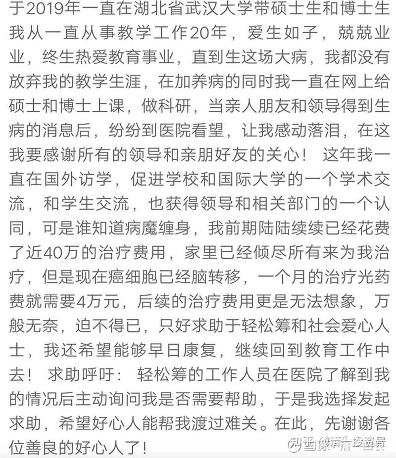
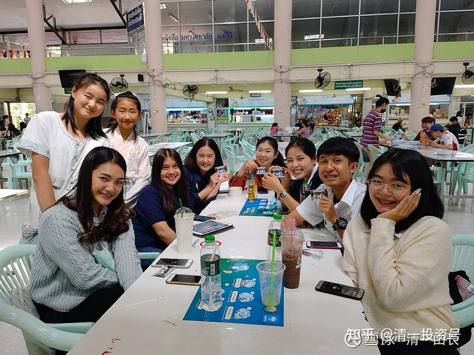

原雪球专栏[118篇.武汉大学博导筹款治病，您怎样看？](http://link.zhihu.com/?target=https%3A//xueqiu.com/9310099567/173622149)

[清一山长](http://link.zhihu.com/?target=https%3A//xueqiu.com/9310099567/column)2021年3月5日

　　看到上面这个网上转发的消息，觉得有点意思，就贴出来让大家看看。也许对您有点启发。

　　我不知道这人是谁，网上也没有看到名字。不过，从年龄上看，可能比我小十岁吧？我是1991年留校在大学当老师的，今年正好30年。此人说教书育人20年，正好比我少10年。不过，此君比我有出息得多，才40多岁，就早早的当上博导了，可见还是很努力，很上进的。我至今的官方职称，还是讲师一个。我快60岁了，还在老夫聊发少年狂，还跟年轻人们打架，练武玩。看来我还是当武人比较好。职称虽然评不上，至今依然是一个小讲师，但落了一个好身体。我觉得，身体好，比啥博导、教授的职称都更有价值。

　　物伤其类。这个故事显然不是一个好玩的故事，而是一个悲伤的故事。**我的思维习惯，就是：这种事情，如果换了我，该怎么办？**因为一直有这样的思维方式，所以，我的今天，才与当年这些跟随程序走的“同事”们，大有不同。

　　首先，如果我没钱了，我能筹到钱治病吗？上面说了，一个月要花4万元，负担太重。对此，我是有信心的。多年来培养的学生、弟子们，平时总想要送点钱给我，我一向都是拒绝的。如果知道老师这一回需要钱救命，我相信我不会缺这笔钱的。

　　当然，我为了自尊，也不想白拿别人的钱，就可以用服务换钱：请老板们给钱，我提供咨询服务，我相信也不缺这钱。

　　下面转发一个花了两万元，找我咨询了两个小时的私人咨询案例的反馈，这是上周的案例。明天，我还要为另外一个老板提供咨询服务。这笔钱，我也用不着，直接让老板们打给武道馆了，供养孩子们去当世界冠军用吧！虽然是私人服务，不过我们还是很正规的。首先是售前服务，要求咨询者提前把想要解决的问题，书面申请提供给我，我认为可以解决，才接单；如果解决不了，就拒绝，表示没本事。如果接单了，我就先服务，后付钱。如果客户对于我的咨询结果不满意，可以拒绝付款。随后，我们还要了解客户对于售后服务的反馈。我不希望别人花了钱，但没有得到相关的服务，不满意。你只看到我收到了钱，一笔不菲的咨询费；你没看到我的要求，是**要为客户提供物超所值的服务，至少物超所值10倍以上。达不到效果，我就不收钱。**

　　以下就是上周的服务和问卷回复。

清一山长私人客户咨询满意度调查问卷

时间：2021年3月1日上午
交流方式：网络视频

**一、请问您对本次私人咨询的评价？是否解决了您想要解决的问题？提供的解决方案，是否具有实操性？可详细描述。**

这是一次非常有意义、非常超值的咨询服务。非常感恩山长帮助我们解决了心中困惑多时的难题。这种通过咨询来解决问题的方式非常的直接、高效，这是在其他课程所不能解决的。

山长提供的解决方案具有很强的针对性和可操作性。比如：针对孩子的教育问题，我们学会了要完全、真心的放下对孩子的妄念，看透孩子的本性，以“孩子心为心”，把孩子的责任完全交还给孩子。

比如：针对家族传承的方案，我们懂得了以一已之力是不可能实现家族传承的，必须把自己融入到一个更大的平台中来。人是家族传承的核心，只有培养出更多的、不仅仅依靠血缘关系的优秀法脉传承人，才能实现家族传承。学会怎样花钱，才是最好的积累福报的方法等等。比如：学会用“如是观”来看待身边的人和事，放下情执、放下情感判断。

**二、您结束私人咨询后，当下的心境是怎样的？是否能够轻松面对您原来认为很困难，几乎无力解决的困难了？**

　　咨询结束后，我们的心情非常的喜悦自在，充满能量，面对未来，更有信心，充满希望。原来认为的问题，通过山长的咨询后，有了清晰的思路和解决方案。

1. **山长对您所说的语言和表达方式、使用词汇等，您是否能够理解？是否超过了您的理解力，还是使用了您完全能够理解的词语和方式来解释的？**

　　山长的表达通俗易懂。

**四：您对本次咨询服务，是否有不满意的地方？您希望我们后续提供什么样的改进意见？**
　　本次咨询服务我们感觉非常的满意，暂时没有发现需要改进的地方。

**五：经过本次咨询，您对老师的整体印象是怎么样的？有何感觉？您是否希望下次有问题的时候，继续找老师进行咨询？**

经过本次咨询，感觉老师非常有智慧，非常理性。下次有问题，一定还会继续找老师咨询。

再次感谢山长！2021年3月2日

　　各位：我一个月只要做两次这种咨询服务，就可以筹到钱治病了。所以，我会拒绝所有学生、弟子的好意和捐款，我自己挣钱自己用，不给武道馆用就可以了。

　　所以，我认为，这个教授、博导，号称导师，可能真不知道啥是博士，啥是导师。博士，是汉朝给学问高深、广博之人的“职称”，就是说：这种人学问特别广博，你问啥都知道，这才叫博。光有知识还不够，还能给人提方案，做规划，指导方向。啥都能导，不限制于个别的专业、行业。这才叫导。加在一起，叫博导。

　　他这人，你看结果：他博个啥？导个啥？连自己的问题都处理不了，还当别人的导师？自己的人生路都看不见，去引导他人？这是以盲导盲，不是笑话吗？

　　第二：您说：到底姜是老的辣。我再怎么也比这博导多活十几年，比他博也不稀奇。所以，拿我来比，恐怕不公平。不过，你们也知道了，我的两个弟子：明颖、明仪，把自己的一年工作时间卖了，就卖出了一千万。她们才21岁呢！这又咋说？你说是炒作的，你炒给我看看，你咋就卖不出一千万呢？

　　我这老头拿来卖的话，一年肯定不止卖一千万（我每年股市上拿的红利，就超过一千万了）。但我可以把我的学生培养成这个身价，这才是真的导师。**所谓的教育，所谓的大学，就是让你出门的时候，比你进门的时候更有价值。**这两个女孩，如果没有进我的门，没学我的本事，而是去上了武大，就像她们当年的同学一样，我看现在想卖自己，就难了。能不能拼过民工都不好说。比如这个博导，能把自己的市场价卖多少钱？我看恐怕是没人要吧？这世上有他不多，没他不少。什么博导，缺了也没人遗憾。所以——他才筹不到钱（当然，我还有一个疑惑：据说武大是公费医疗的，现在改革了吗？）

**　　第三：得了癌症，又没钱治疗，换了我，会怎么做？**

　　1、如果我教了20年的书，号称爱生如子（我可不敢说这样的话）。我的学生、弟子，都不想筹钱来救活我，证明我就没啥活着的价值。不如早点死了算了。我相信明颖、明仪，真有个啥事，她们带的学生，以及家长，都会想来帮忙的。一个月几万元，更不是啥事。一个985大学的博导，却没学生和弟子出来帮忙，可以说，真太没分量和地位了。这老师，当的真没意思。

　　2、就算我的学生、弟子筹款想救我，我也不要这钱。因为我知道去西医送钱求救命，就是花钱送死的。我才不会去找死呢！花钱找死，光荣吗？还是愚蠢？我可以用别的方法来自救。救好了，我创造了一个癌症自愈的奇迹和案例；没治好，反正人都是要死的，就老老实实的去地府报到就行了。有啥凄凄惨惨的，出来卖惨、哀苦叫唤救命的？

　　前几天，小女儿跟我谈到：她很喜欢读海明威的《老人与海》。我说：这个作家特别硬气，老年的他名气很大，也很有钱，但疾病缠身，他不想窝窝囊囊的活着，不想让别人服侍他，自己像个废物一样，就自己开枪自杀了。小女儿很崇敬，说：“这个作家就像他写的小说中的老人一样顽强，不怕死，对吧？”

　　我说：“是的。其实爸爸从小就想：如果我老了，动不了啦！就给我一把枪，让我痛痛快快地死了就好，我可不想拖累任何人。”小女眼泪就流出来了，打了我一巴掌。然后，很认真地说：“爸爸，就算你身体不能动了，但只要你的脑子还能动，你就不是废物，你就还可以教我们，我们都很需要你。所以，你不能动了，也不能死！”

　　我大笑说：“也许到时候我就老糊涂了，你们还要来陪我玩‘乖乖听讲’的游戏，太浪费时间了，还是给我一把枪更好!大家都轻松。”

　　小女更生气了：“你现在就在说糊涂话！不许说了。”

不过，这就是我的价值观：如果我对世界没有用了，就早点走，别碍事。**我来到这个世界，不是为了得到什么，而是为了创造什么。一旦我失去创造的能力，失去服务的能力，早点离开世界，就是我对自己最大的尊重！**

小女和伙伴正在给泰国人送礼物。这是我从小教她的原则：来这个世界，就是把自己作为一个礼物，送给他人。从3岁多她上幼儿园起，就一直在教她这样做——送礼物。今年春节让她和伙伴们一起去请300个大学生吃饭。

