本周一晚上，在清迈打了太极征泰的第14场比赛。明晓出战的泰国对手，就是上次征泰11战的佳慧对手。但这个对手显然提高了警惕，不再一昧的猛攻，而是非常的注意防守。所以，最终明晓没有能够KO对手，打满五局。虽然对手依然没有有效击中明晓，而明晓多次击中对手，并摔倒对方多次。但最终裁判判明晓点数输掉本次比赛。我们已经习惯了不KO就输的泰国主场优势，接受泰方的判决！

从这一场比赛开始，艾拉公主作为小记者，负责采访和播报前方战事。大家注意关注她上传的视频。由于周三还有一场比赛，所以艾拉小公主必须现场参与采访。所以忙不过来，周一明晓的视频和点评，将在周四以后才能制作出来了。

[https://www.zhihu.com/zvideo/1551249343016828928](https://www.zhihu.com/zvideo/1551249343016828928)

以下是小公主艾拉的点评版：

[清一木兰对战泰拳第14场讲解视频 （明晓第8战）20220905_哔哩哔哩_bilibili](http://link.zhihu.com/?target=https%3A//www.bilibili.com/video/BV12G4y1B7d4)

**今晚（9日7日） 举行的是太极征泰的第15场比赛：木兰佳慧出战下面这位比较壮实的女孩。**

木兰们查过她的资料：她与击败明晓的对手交手过，互有胜负。她还打过专业的拳击赛事。善于使用有力的后摆拳。上周她击败了泰国国家队的成年组队员，一位22岁的小姐姐，一直在帮木兰们做场务的泰拳手。是一个很有实力的拳手。在泰国泰拳协会公布的各级别前十名高手排名表里面，我们发现她和日本K1的世界冠军帕亚虹是一个级别的。帕亚虹排名第一名，她排名第4名。所以应该实力不俗。

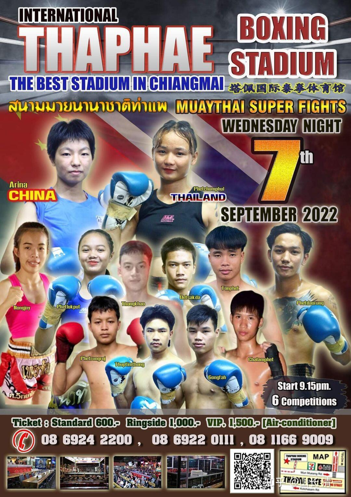

*太极征泰第15场海报 佳慧*

不过，佳慧并未把对手放在心上，认为自己可以轻易战胜她。为了给自己提高一点难度，她决定今天跟对手公开提前说明，前三回合中，她保证不用腿法来攻击，只用腿法来防守。即使被对方KO，也绝对不使用腿法攻击。但以后的第四，第五回合，她不再保证不使用腿法。但她会尽量使用拳法来打垮对手。

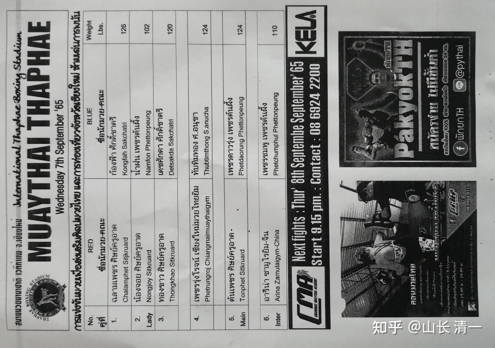

*比赛出场单。佳慧是最后一场*

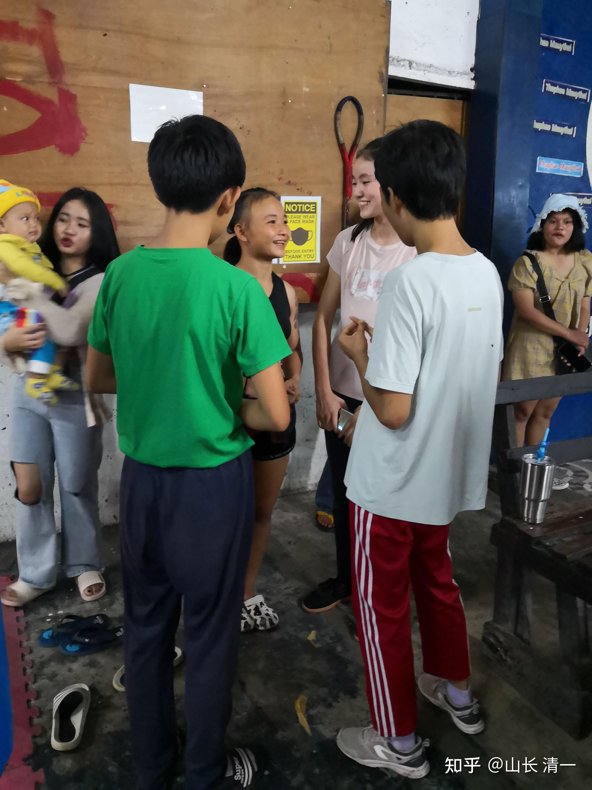

*小记者艾拉赛前采访对手。*

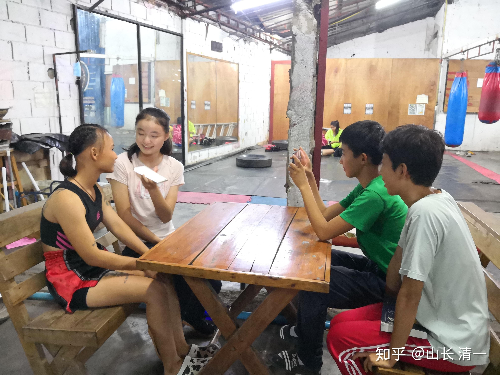

*采访现场！宋老师“偷拍”的采访照片，录像录音同时进行。*

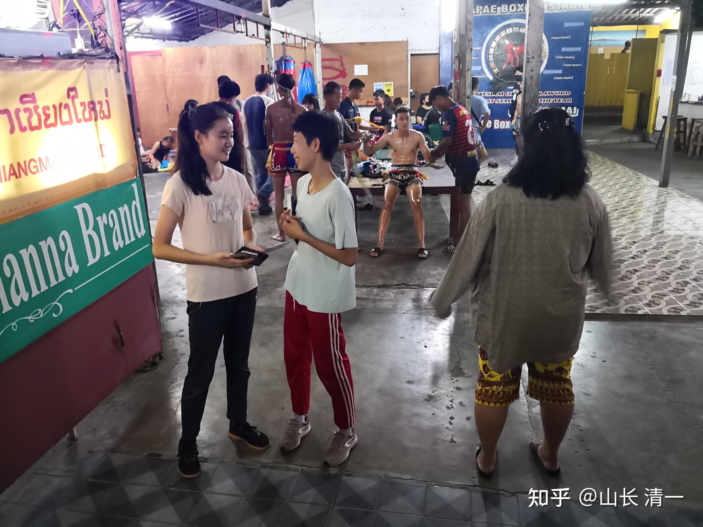

*泰拳手们正在后场里面准备上场比赛。身上涂满了拳王油。*

艾拉转达了佳慧对对手的问候，也转达了前三局不会用腿攻击的承诺。对方表示是不是她前三局不攻击？艾拉的回复是：我们作为拳手，尽力去比赛才是拳手的天职。请她可以一开始就全力攻击，最好前三局就KO佳慧。因为她应该尽全力攻击，才是对佳慧的尊重。至于佳慧只用拳，是因为她想要知道自己的极限，能否防住她拳腿的全力攻击，才是她的荣耀。但由于她们必须尽全力去打，才是对花钱买票来看比赛人的尊重。不能双方打一场乏味的假拳。对手表示了解了。

具体是怎么谈的，大家改天看艾拉公主的采访。

文章还没有写完，刚才我就收到前方的战报了：佳慧在第二回合，就KO了对手。创造了她自己的新纪录---没有用穿心脚就彻底击败了对手。小女赛后反馈，其实佳慧根本没有准备这么早结束比赛的。但她在内围战中，一个单膝攻击就终结了对手。因为她很自然地发出了身体的抖劲，这种力量穿透性极强，所以导致轻易就KO了对手。如果将来木兰们抖熟练掌握和善于使用身体的抖劲之后，泰拳手们跟我们打内围战，我们的膝肘的攻击力就全出来了。泰国人就是找死了。

目前佳慧参与的七场赛事，除了有两次是打满五局外，其他五场，全是KO胜，明显是属于“攻击性”的拳手。

本次赛前备战中，我交代她练一种很特别的野马分鬃拳法。攻防合一，可以让对方的所有腿法进攻都无效。她要同时打两个沙袋，腿在空中抬腿在最高处，打一拳，落地后同手再打一拳。方向不同的拳，是十字劲。我认为泰拳手是不可能应对这种攻击的。无论对方出拳，还是出腿，无论是什么攻击手段，她都可以不管不顾的用处这一招野马分鬃。这是太极劲的微奥变化之处，远比迎门三脚更难练出来。这种技法，用于现代格斗，应该是第一次。如果原来的太极传人，会使用这种拳法的话，早就江湖无敌了。今天提前KO， 估计就是这种拳法发挥作用了。我要等明天看了视频，才知道到底怎样击垮对手的。

由于交代佳慧，今天的拳法，上场后都尽量用这一招拳，一招就够用了。之所以只保证前三回合不用腿，是我担心到了擂台上佳慧用不出来，用拳法仅可自保。所以就留有充分的余地，让佳慧第四第五局自由发挥拳腿联合攻击。估计佳慧自己，都没有想到这么快就击垮了对手，而且是专门练过拳击的泰拳对手。我相信她以后会越来越熟练的使用这一招的。这一招，也可以让泰拳的内围战失败，根本就帖不了身！我认为泰拳的内围战，我们是打不过泰国的裁判的，所以将来都会尽量的避免跟泰国拳手打内围战。

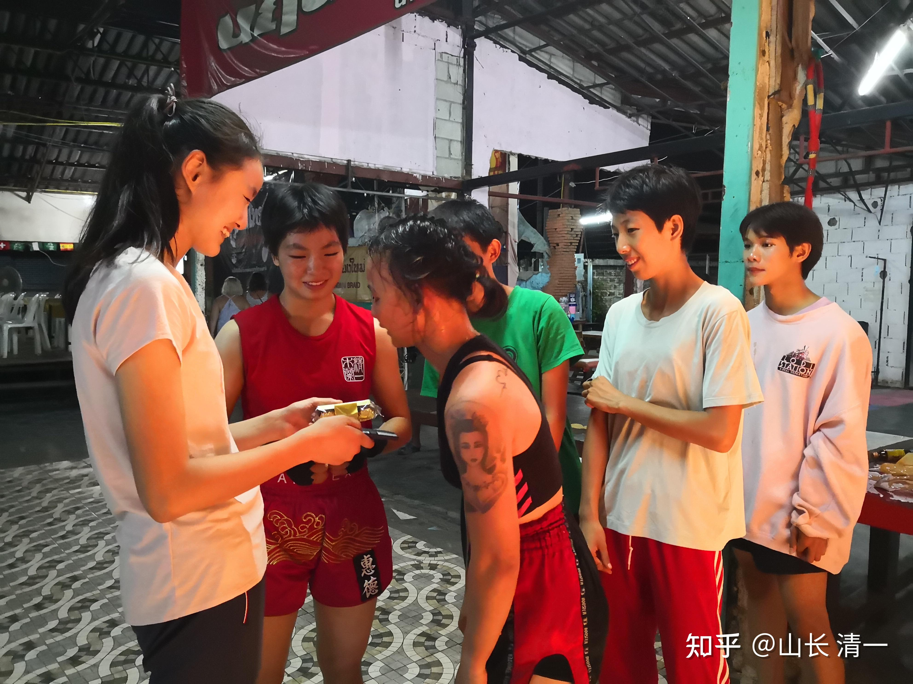

*赛后与对手交流，送礼物。送一盒精致的巧克力给对手*

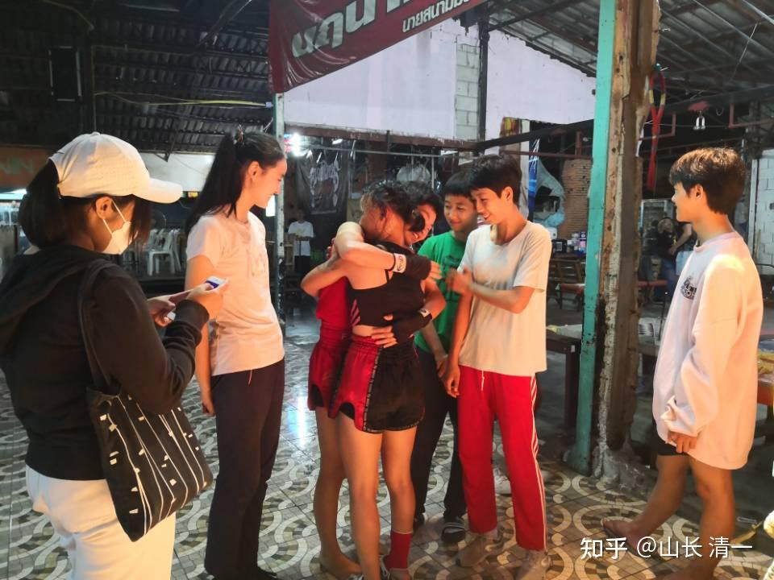

*赛后，佳慧与对手拥抱，分手。*

场上，是针锋相对的对手，场下，拳手之间，都是朋友。都是表演给观众看的演员。但必须尽力演好自己的角色：因为每场比赛，都必须分出依然站立的攻击者，以及被KO的弱者。观众必须看到胜负，我们就必须打出胜负。但场下：我们没有必要分胜负，分高下！

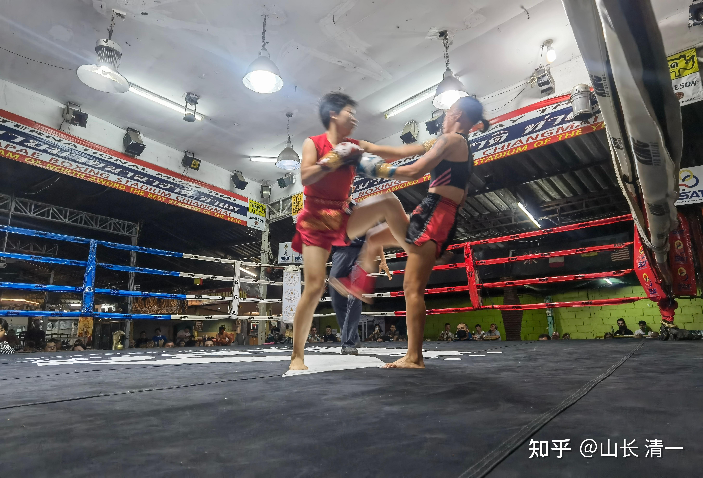

*典型的野马分鬃攻击：手在腿防守对手腿攻击的同时击中对方*

上图是典型的野马分鬃攻击效果，堪称泰扫克星！左腿提膝，防止对手的扫腿攻击。同时向前进步，出拳。落地的同时发力。从照片来看，这一拳力量是可以击倒对手。如果只是击退几步，就是对手的平衡能力超强！反应很快，毕竟是职业拳手。一般人中招，肯定是仰面倒下。 这就是业余和职业的细微差别。

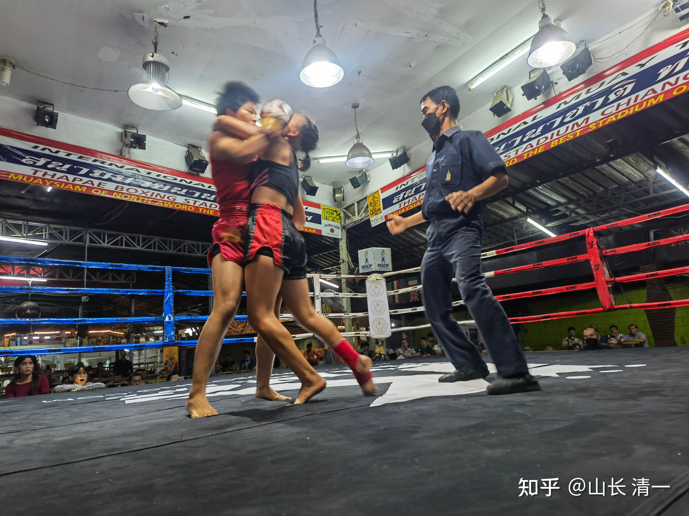

*用旋法破对方重心，对手失重的一刻*

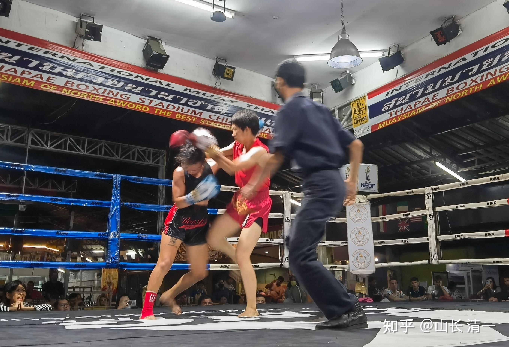

*对手低头躲过佳慧的野马一击，但身体已失衡，暴露在佳慧的连续火力网下！*

这两张照片，注意观察佳慧的身姿，就是传说中的太极“立身中正”的意思。这就是“太极桩功”的体现。此时的身体是最稳定的，可以发出后续的种种连续攻击。而对手身姿已经破坏，后续无法还手和反击，只能被动挨打。这就是外家拳不练桩的后果---一旦面对连绵不绝的进攻。泰拳这种“死桩”，面对移动中攻击的“活桩”，就成为毫无还手之力的待宰对象！所以，传武练拳首重练桩。太极拳法，以桩功为核心。

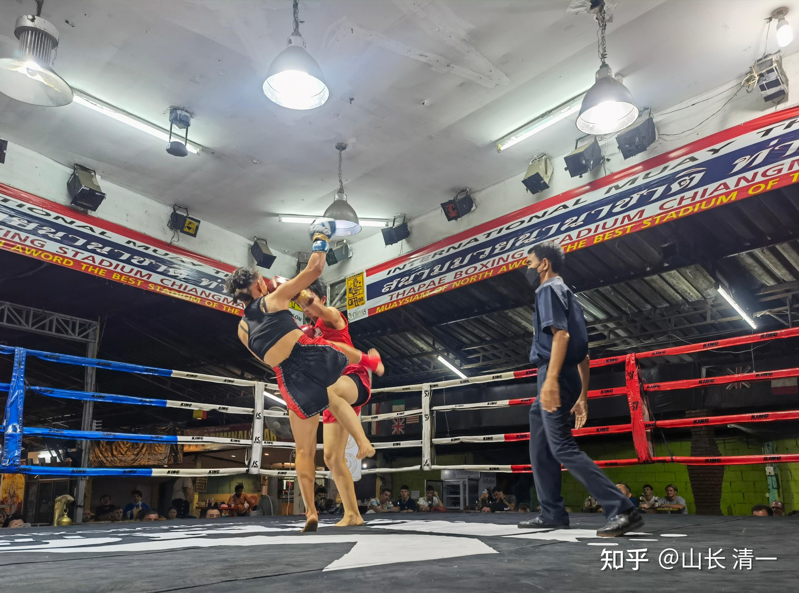

*野马分鬃破泰拳扫腿的瞬间 拳腿同出*

面对佳慧这样的拳势，泰拳手敢出扫腿攻击吗？真的是找死！这种动作，外家拳是不能发力的、但图片中显然佳慧正在发力。这就是太极的特点---单重发力。

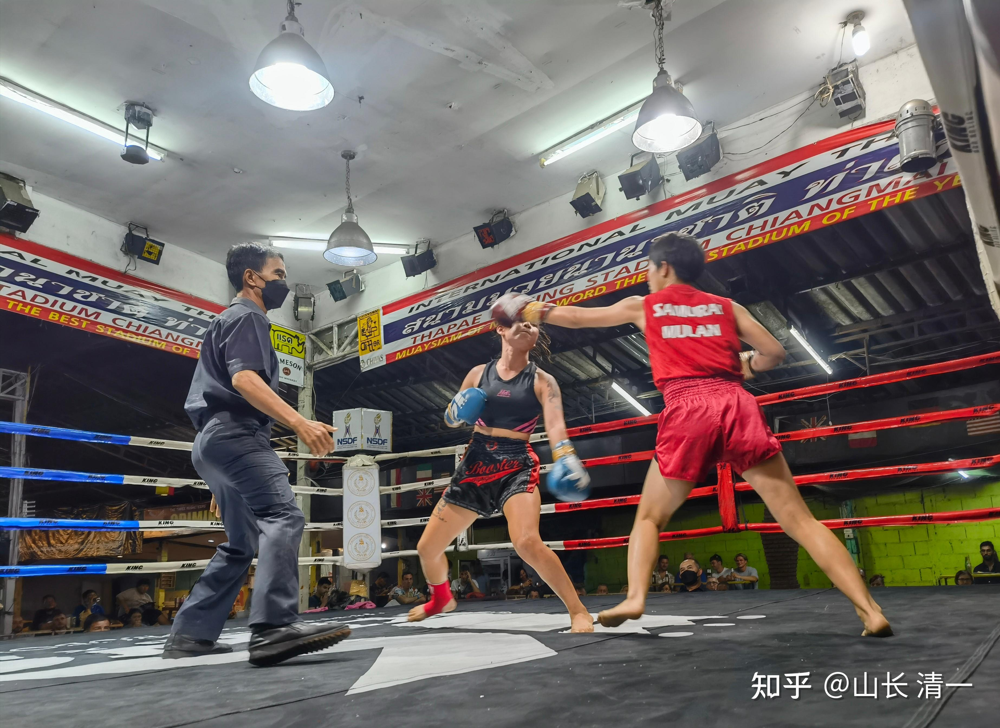

*对手被左手拳击中后的瞬间 注意左脸的变形*

这张照片，粗看是追打对手，其实是对手被攻击后拉开距离的照片。因为我知道双方的这个距离，是超过佳慧出拳正常距离的。正在想她是否过于激进，超远出拳追打对手。但观察到对手左脸的动静，是被击中后弹开的一刻，这就正常了。宋老师这一张的摄影水平很高，拍照的时机非常的精彩！

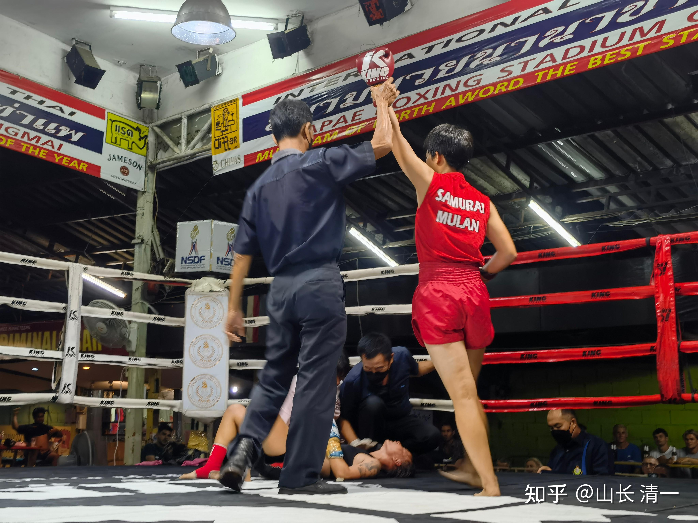

*对手KO倒地。裁判举起佳慧的手宣告胜利*

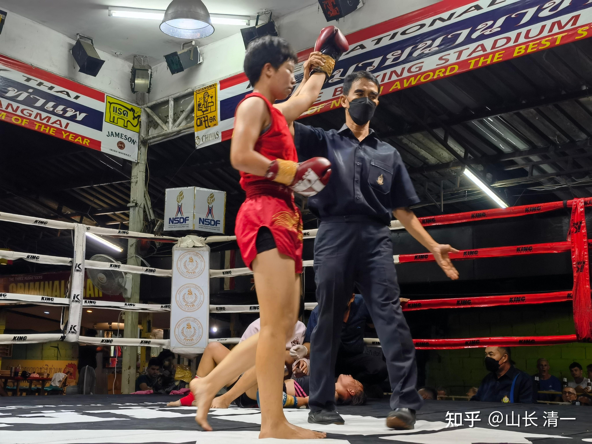

*佳慧表情看上去不太开心：这是她第一次真正的KO。而不是TKO*

感谢宋老师现场发回的照片。拍得很精彩，角度和时机都非常的棒！