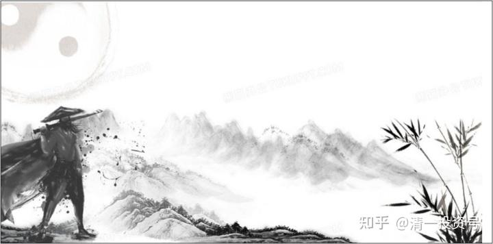

清一山长 2021年12月19日

清一山长雪球非专栏帖子整理文章，第11篇《武道论之一：武林遗事》

此文整理自山长专栏文章《创造历史的清一大学：首届学生合影》[https://xueqiu.com/9310099567/165561483](http://link.zhihu.com/?target=https%3A//xueqiu.com/9310099567/165561483)跟帖评论

**一、武功不可貌相**

球友甲回复[@清一山长](http://link.zhihu.com/?target=http%3A//xueqiu.com/n/%25E6%25B8%2585%25E4%25B8%2580%25E5%25B1%25B1%25E9%2595%25BF):

辛苦，上张你的练武照片或者视频

[清一山长](http://link.zhihu.com/?target=https%3A//xueqiu.com/9310099567)[2020-12-19 14:02](http://link.zhihu.com/?target=https%3A//xueqiu.com/9310099567/166171715)回复球友甲

第一：您给观摩费不？看马戏，也要买票呢？想白嫖呀？

第二：让你看了，您看得懂不？不懂武术，还是去看中国武术套路比赛，更好看。

不是鄙视您。真没几个人看得懂的。

我曾经给一个国内的知名武术家、老拳师、实战能力很强的武术实战高手现场示范，让弟子随意进攻我。他来主要是鉴定我的弟子，想培养我的弟子将来击败我。我也希望弟子多学习一些真功夫，支持弟子找他学。但为了让他知道“敌人”与他要教的学生的差距和水平，我就做了一点实战示范。问他有无信心按照他说的时间完成目标？结果他看后哈哈大笑，说：只要半年就够了。说我的动作像跳舞一样，挺好看，养身健身不错，真打不行（我还真的打不赢他，我们原来交过手）。是我的弟子的实力太差了，他教半年就够了。我无语，总不能把弟子当场干掉，才显示得出武功吧？也奇怪他是怎么看的。

后来把这段录像，给另外一个武术非遗掌门人老拳师看过，问他评价怎样。看了就骂我：心太狠，手太黑，太可怕了，吓死他了。我说：我啥都没干呀！没见到都是弟子在打我，我躲来躲去的吗？

这人说：弟子怎么打，都不可能打到你的。但你的手，每次总放在他的要害之处，摸一下就走，全都是杀招。吓死他了，怕我失手就把人干掉了（他很喜欢我这徒弟，也拜了他做老师学习）。

没错，我就是玩的“点到为止”。因为弟子的实力太差，我可以收住劲，像轻松跳舞一样玩。实力强，我就收不住了。这弟子，最终也没去跟前面这个说练半年就击败我的老武师学习。说：这老拳师还说她没有出全力，就像玩一样。但她手臂上都伤了多处，青紫了好几天才消。我当时真没觉得我出了劲，我还说谁让你拼命打，我接手只好略重了点。这弟子认为不可能几年就击败我，更不可能半年。这全是乱说一气，所以就不想去学了，失去了一个很好的提升机会。结果至今我的弟子，至今还没出现一个能打赢我的。

如果连老武师都看不懂我的拳，就更别指望你们了。就当我是健身的吧！公园里的“老头拳”。别以为自己蛮懂武术的，就像你们喜欢指指点点地“教解放军跟印度在拉达克应该怎么打”一样在行！

我实力差的几个弟子，现在正在我开的专业武道馆全职训练，备战现代格斗世界冠军比赛。您想看这几个不成器的弟子，就等疫情彻底结束，各种搏击比赛重开的时候再谈吧！别忘了买门票。实在买不到的话，事后看视频也可以的。

球友甲回复[@清一山长](http://link.zhihu.com/?target=http%3A//xueqiu.com/n/%25E6%25B8%2585%25E4%25B8%2580%25E5%25B1%25B1%25E9%2595%25BF):

亲，你的拳照只是你的水平，网上有薛颠、孙禄堂的拳照，有叶问的录像，这些大师的照片录像才是真香，花时间看他们的不香吗？白嫖你，你太瞧的起自己啦。

[清一山长](http://link.zhihu.com/?target=https%3A//xueqiu.com/9310099567)[2020-12-21 09:45](http://link.zhihu.com/?target=https%3A//xueqiu.com/9310099567/166246358)回复球友甲:

说的真好。打赏一元，拿走不谢！拜拜。

//[@修的是心](http://link.zhihu.com/?target=http%3A//xueqiu.com/n/%25E4%25BF%25AE%25E7%259A%2584%25E6%2598%25AF%25E5%25BF%2583):回复球友甲:

那你还问人家要干嘛？

**[清一山长](http://link.zhihu.com/?target=https%3A//xueqiu.com/9310099567)**[2020-12-21 11:53](http://link.zhihu.com/?target=https%3A//xueqiu.com/9310099567/166267145)回复[@修的是心](http://link.zhihu.com/?target=http%3A//xueqiu.com/n/%25E4%25BF%25AE%25E7%259A%2584%25E6%2598%25AF%25E5%25BF%2583):

这种人，就是电影里面的土豪恶少，没事到处晃悠。出外看到某家的民女好看，就上前调戏一把：来来来，给爷们唱一个，让爷看看你嗓子咋样？中不中听？要入了爷的眼，爷今晚就带你回去，赏你吃顿好的。这民女，要是有点骨气，不肯为这恶少开唱，恶少就恼羞成怒，开始骂人：老子愿意听你唱歌，都是给你长脸了。爷想听戏，去京城什么角儿没见过？以为我就稀奇你一个唱山歌的吗？你真有本事，怎么没见你当上京城的角儿？

诸位看官：这伙计今儿的表演的，是不是就像这样子？国人骨子里面，还是没变，不懂尊重。土豪恶少们，并没有随着时代而消逝，只是换了一副嘴脸出来。

我回复给他这些文字，其实是教人出来混，要懂点基本的事理：对他人，要学会起码的尊重！

也顺便告诉各位，**武功不可貌相。以为套路就是武功，是上了江湖人的大当！**

还告诉你们：**随随便便就要求真正的武林人士，出来表演给你看，是对他很大的侮辱。玩套路，是江湖卖艺人的把戏。有真功夫的人，一向很鄙视这些江湖把戏。**偏偏国人都认这些江湖表演的把戏。徐某人（晓东）出来揭穿这些江湖艺人，我也很快乐！

我师父是太极名家，告诉我一件事情。多年前，传武很热，中央台也来民间，寻访各地的武术高手。当地政府就让这些老武师出来，给电视台演练一番。轮到我师父了，他上场，先做了个无极桩的样子。镜头对准他，等了半天，看师父就是站着不动。

录像的人就说了：“老爷子，你干嘛不练呀？”

我师父说：“练呀！我刚都练了，现在已经练完了！你没拍吗？”

我也问师父：“中央台来录像，干嘛不演练给他们看？让别人看看真功夫有啥不好？”

师父说：“**太极拳，根本就不是啥外形，动作，是内在的一些微动。**这样子拍下来的动作，都是假的。让别人以为这就是真武功、真太极，就是误人子弟。而且，我就算演练了，大多数人也看不懂的。”

所以，他就站个无极桩，练练内动。

这也是真的，你看不懂是你的事情。他不能让人拍录像动作出来骗人。连我也不能拍他演练武功的动作，只要有第三个人在场，他都不练武功，不说武功。师父说这叫“法不传六耳”。古传的老传统（你们就知道你们熟知的江湖卖艺人，到处显摆的，跟真正的武林人有啥不同了）。我带人去师父家里，师父连给我都不说武功了，只说闲话。除非我单独跟师父在一起才说，我有时会在师父家里住上一两周，师母给做饭吃。至今，我都没有师父的练拳照片和视频，只能自己凭记忆回放。

我曾经提过，让师父拍一点练拳的录像，留给徒孙们看看。

师父说：拍出来后，就都是假的，还容易误导人。让我们认真体悟太极的心法。而不是太极的动作外形。

练拳，就是两个核心要素：速度和力量。

前几年，师父已经七十多岁了，偶尔会跟我比比手玩。比速度，我比不过师父，常常反应不过来，就被打中了空门。比力量，扳手腕。师父手就平放在桌子上，我用尽全力也压不住，慢悠悠的师父的手就起来了，然后慢悠悠的把我的手压到桌上动不了。让人看的话，以为就是我“放水”的。

说这些，是让大家明白：真武功是有的，但你们看到的，都是假的。现在真武功，都快绝灭了。

师父说我见到的这些太极门的东西，全国应该没有超过三个人知道。师父自己的儿孙都不知道，孩子们也都不练拳。现在师父老家（全国知名的某武术之乡），练拳的都是出来跑江湖卖艺骗钱的，都没练真的功夫，因为要练真功夫，不好看；也没啥实际用处，国家也不认，会弄得连生活都成问题。现在都没人练真功夫了。都是练练很简单的套路动作，打着老祖宗的名义，出去混混江湖换点钱，也就这样了。——这是我想让他介绍他认为还有真功夫的当地拳师让我认识的时候，他说的话和意思。

我的师父不对外教拳，也不公开带弟子，也不搞啥师门联谊活动，不聚会。我都不知道有谁跟他学过拳。他也很少说这些人，但从他的意思里面，他教的人也没人真学会他的拳。

有一次告诉我：这些人想要发人，还要转个大圈再发出去，还不如我练得好，可以直接就发！（这是指内家拳不回手就连续出拳发力。这是用内动代替了一般人需要回手蓄势，再发力打人的模式。难度很大，一般人很难练出来）。

当时我好奇地问：“我没有在师父面前发力，师父咋知道我会这样发力？”

他就瞪我一眼，也不解释！

说这些，算是武林遗事。如果我的门下，培养不出来能够击败现代格斗的年轻人，20年内，中国就不会有真传武了，现在懂的老人就全走了。因为**现在的中国，官方和民间，都没有人在练真传武，都在玩假的江湖套路把戏**。这就是**“逝去的武林”**。

**二、真传武在何处**

中华的真传武在何处？很可能在日本。因为日本有一批人，一直在坚持练这些从中国传去的古老的东西。我在泰国见过一个日本拳师，教的东西，就是中国的古老的东西，武学原理等都是一致的。我说这是中国的武学吧？人家说，中国哪有这些，他教的是他们日本自己的传统武术。气死你还没脾气。

这人的武功实战很强悍，我不是对手。虽然我们两人没过招，但看他演练了一下，他因为知道我是中国练武的人，就故意显摆了一下他的武力值，懂的人看得出来水平的。的确功力惊人，我没见过这么强横的。跟徐晓东等，完全不是一个档次。他要打雷雷，一拳就够了。哪里会像徐晓东一样，十几拳上去也没见打出个啥！

这日本人告诉我：他原来打过K1，一直赢。都是很快结束战斗，他不喜欢慢慢的打满时间。有一次拳台上，当场就把人打死了，心生愧疚，就退出K1了，来泰国找了个女朋友，教教拳，混混日子。

我的清一武道馆，会做一点事情，给一些想要中华武功留在中国的年轻人，可以在没有经济压力，没有就业压力的情况下，去做一些需要潜心下来慢慢练的事情。成不成，就看这两三年了。两三年后，他们打出来了，就算是入了传武的门，算是得其一二了。（内家拳经云，得其一二，足以胜少林）。将来传武还有一点希望，可以让这些孩子们再花十年去深造真正的太极传武。如果这两三年他们就是打不出来，就只好认命了。看来中国人就不配有传武。以后想要学中华武术的，就自己去日本求教吧！

**三、为何无人为真传武正名**

//[@江心沙1号](http://link.zhihu.com/?target=http%3A//xueqiu.com/n/%25E6%25B1%259F%25E5%25BF%2583%25E6%25B2%25991%25E5%258F%25B7):回复[@清一山长](http://link.zhihu.com/?target=http%3A//xueqiu.com/n/%25E6%25B8%2585%25E4%25B8%2580%25E5%25B1%25B1%25E9%2595%25BF):

这种说法神鬼莫测，没有实证之前，说出来也只能被认为是诡辩。从来传武厉害都是传说，从未看到真人现世。如果传武真厉害，于名于利，现在都比中国有历史以来，都更容易获得回报。

1. 于名，经过这两年徐他们几个几轮蹂躏之后，传武脸都被打肿了，到现在竟然没有一个要脸的高手站出来比划一下，能出来干脆利落的灭掉他们，是不是给老祖宗长脸？不是名利双收？可惜没有。

2. 于利，传武如果真的这么厉害，各大拳台横扫，一人挣个一个亿美金完全没有问题吧！菲律宾帕奎奥，贫民窟出来，身价四亿美元，中国隐世高手，随便调教几个徒弟，是不是啥都有了？然而并没有。

[清一山长](http://link.zhihu.com/?target=https%3A//xueqiu.com/9310099567)[2020-12-21 13:26](http://link.zhihu.com/?target=https%3A//xueqiu.com/9310099567/166276999)回复[@江心沙1号](http://link.zhihu.com/?target=http%3A//xueqiu.com/n/%25E6%25B1%259F%25E5%25BF%2583%25E6%25B2%25991%25E5%258F%25B7):

第一：您有这种想法很正常。我也纳闷：这些传统武林人哪去了？江湖无人吗？这些江湖人，不就想赚钱吗？打赢了徐晓东，名利双收的事情，咋就没人干？可能真的传武就没啥人了吧？（据说徐某的事情是商业包装的结果。故意拿一些水货来打。真有实力的人找他，徐晓东没把握轻松对付的，就找各种理由拒绝。因为目的是要捧MMA市场起来，利用打击传武来聚集人气。是否这样子，我不知真假。因为我没去自己验证）。

第二：要跟现代格斗打，也不是你想的这么简单：一个懂武术的老拳师，带几个徒弟练练就出来了。我说了：我的老师，一辈子就没带出能去现代格斗实战的徒弟来。虽然他有真功夫。

第三：你说的事情，用实战来验证中国传武和现代格斗，说起来容易，但做起来，也不是这么容易的。因为两者的规则不一样，真要打，就必须针对现代格斗的各种项目（如拳击、搏击、泰拳、MMA等），进行专门针对性的训练，才有可能上场两者对抗。训练的方法，还必须是传武的核心原理，专门练能够克制现代传武的技术，还不能是现代格斗的方法。**这需要有很高的武道理解水平和实战能力，还要对传武和现代格斗都很了解，还要会教学生。同时，还要找得到愿意好好练的学生。**这种教练，必定是跨界人才——对传武和现代格斗的武道原理都很了解，这种要求，很多有功夫的老拳师也做不到的。很多老拳师，连本派的传人都教不出来，更别谈教跨界的人才出来了。

第四：现代格斗，只是看去上赚钱。其实就像你看到的明星大赚钱，就想当然让孩子去考艺校一样。真出来的人当然赚，范冰冰、李冰冰之类。但你真去这个行业看看，真的是贫民窟。很多学艺术的女孩，只能靠卖身来维持基本的生活。你是只看光鲜了。拳击格斗界，我知道有好几个**拿了洲际冠军的人，靠的是送外卖、看拳馆来维持生活**，你以为这么容易？所以，**练拳的人，很多都是底层人，没办法拼出来的**。外行看什么都容易，进来了才发现什么都难。

**第五：虽然这件事情很难，但总得有人做。**做出来绝对名利双收。但是，由于我看武林中人，居然一个人都没有出来做的，实在让我叹息。他们根本就不愿意试一下，都怕失败，都怕投资。可能也找不到方向。（我有很多武林朋友，官方的权威，民间的都有，信息算是通的），我看传统武术，这样下去，就要灭门了。所以才勉强出来办了清一武道馆，其实我不想办，没这么多的精力，实在是不甘心。现在供养着20来个学生在练拳，还要解决他们未来的职业问题。不然将来只能去送外卖，家长孩子都不会送来练的。这个负担，我相信一般的武师是做不到的。所以没有人敢来做这件事情，只有我傻些，才来做。不能保证一定成功，但如果我不成功，我相信中国其他传武人，就更不可能成功了。只有等日本人来传承中华武道了。

第六：我们培养人出来，要跟徐某人比高下吗？这样玩，就真没意思了。他只是搏击界的票友，玩票的，开武馆赚钱的，不是专业运动员。他就是用这种方式混武林饭吃的一个人罢了，不代表啥专业水平，背后有啥猫腻，我们也不知道。他打的那些对手，雷雷、马保国之类，我的徒弟都可以轻松办了。但这并不能说明水平。就像是一龙，假装他代表中华武术，代表专业格斗手，这就是笑话。

第七：我培养的人，目标是现代格斗的世界冠军。第一批人选的项目对手，是现代拳击职业赛。等打完了拳击，再去针对练习散打和泰拳的职业赛。我们不玩徐晓东一样的“花式表演”。在中国，只要拿钱出来，包装一下，一龙都可以击败播求。但这不能说明中国武术厉害，只能说明中国人的钱，比播求的拳厉害。**我们只参加干净的世界格斗比赛，用实力来说话，不是用钱来说话。**

**第八：练内家拳，难度很高**。不是苦练，傻练就能出来的。**得文武双全的人才能练**。这也是目前武术界出不来人才的原因。因为现在去练武的人，都是学文学不走才去练的。这些人脑子不够，根本就理解不了复杂的内家拳原理和练法。

第九：我只是说嘴的武林人吗？你们说对了，我就是练嘴的。只是我的弟子练手，他们正在准备实战。我已经安排好了，只要疫情过后，格斗比赛重开，我的弟子就要去开打专业赛事了。明年我回国后，会带他们去武汉体育学院，让我带出多名格斗全国冠军的老朋友，来检验一下我的弟子，指导一下优缺点，已经说好了。目前我们的训练一切进展顺利，预期两三年内，就可以出成果了。我说了：如果这批人都培养失败，我就解散武馆，放弃为中国武术留种子的想法了，我会止损的。

借此地，把这些武林看起来简单又复杂的事情说清楚，让各位知道。以免只会乱说一些外行话。

**四、学会真传武要多久**

//[@知而行dyp](http://link.zhihu.com/?target=http%3A//xueqiu.com/n/%25E7%259F%25A5%25E8%2580%258C%25E8%25A1%258Cdyp):回复[@清一山长](http://link.zhihu.com/?target=http%3A//xueqiu.com/n/%25E6%25B8%2585%25E4%25B8%2580%25E5%25B1%25B1%25E9%2595%25BF):

一句“比比手”，就知道山长是真传武！现代流行推手，一个“推”字，就违背了太极拳道！

[清一山长](http://link.zhihu.com/?target=https%3A//xueqiu.com/9310099567)[2020-12-21 13:55](http://link.zhihu.com/?target=https%3A//xueqiu.com/9310099567/166281029)[@知而行dyp：](http://link.zhihu.com/?target=https%3A//xueqiu.com/1367282749)

懂得【“推”就不是武功】的人很少。

老武师，看很多人出拳打人，就说冷笑话：你这哪里是打人，都是推人。（徐某人的拳，我看也就是古人说的“推”的级别。我看到的日本拳师，才是古人说的“打人”。实话说，我当时看到，觉得很恐怖！被击中的话，当场就完了。

当然，也有人觉得我的拳“很恐怖”的，一个弟子跟我对打，出手一进攻，我接化后就打出去了，在这人面前一寸处收住手。这人当时一愣，呆住了，接下来就控制不住的大声哭起来。周围人都以为我打上去了，受伤了哭的。

我说：“没打到你，哭啥？”

继续哭了一阵，回答是：“吓死了，觉得自己马上就要被打死了，躲都没法躲。”

实话说，当时这招真发出去，的确非死即伤。我也不过是“由于对手武功差距大”我还是控制得住的。被打的人会被打哭了，看上去没出息，也是因为是练过武的人，对巨大的危险来临时，会有本能的绝望、恐惧的感觉。一般人就傻乎乎的，打上去都不知道，当然更不会哭了。

我在泰国看到的这个日本拳手的出击，我根本就抵抗不住。真没信心跟他过招。觉得日本人都这样的话，怎么打？幸亏他告诉我：这种日本古传的传统练法，跟现代格斗不一样，由于很难练，多数日本人也不学的，只有少数人抱着传承的态度在练。

//[@本卸拆变](http://link.zhihu.com/?target=http%3A//xueqiu.com/n/%25E6%259C%25AC%25E5%258D%25B8%25E6%258B%2586%25E5%258F%2598):回复[@清一山长](http://link.zhihu.com/?target=http%3A//xueqiu.com/n/%25E6%25B8%2585%25E4%25B8%2580%25E5%25B1%25B1%25E9%2595%25BF):

山长老师说的目前传统武术境况，确实是社会实情，真正的老拳师，尤其是祖辈拳师，惜字如金，众人面前从不说手，师徒传承也是口传心授，口点诀手点窍，师父教了，徒弟也得下功夫去练，一日练一日功，一日不练十日空，想练真功夫那得有数十年如一日的去坚持，现在有几人能去坚持，寥寥无几。

[清一山长](http://link.zhihu.com/?target=https%3A//xueqiu.com/9310099567)[2020-12-21 14:23](http://link.zhihu.com/?target=https%3A//xueqiu.com/9310099567/166285032)回复[@本卸拆变](http://link.zhihu.com/?target=http%3A//xueqiu.com/n/%25E6%259C%25AC%25E5%258D%25B8%25E6%258B%2586%25E5%258F%2598):

没你说的这么难，你这都是听这些江湖武师蒙你的话。

练几十年才看到真功夫，这是江湖武师为自己培养不出人来找的理由和借口。如果得到真正想练出来的学生，资质还不错的，有真正的老师带，在用上正确的训练方式，认真的练上三五年，就可以击败现代格斗高手了。这就是传武的“入门级别”。大约有了两成的真功夫了。以后再继续慢慢的体会，不断进步提高对武道的认识，大约20年后，就是真正的“传武高手”了。关键是前面这三五年，就必须有“秒杀”普通的现代格斗选手的能力，才叫“入门”。后面的，就是武道的顶尖高手的上升之路了。所以，我才说：三五年练不出来，就算了，闭馆了！多练、磨时间，也是假的。

（标题一二三四为编者所加）

附录：附录：

[清一武道馆：传武杀人技？太极不出门？](https://zhuanlan.zhihu.com/p/354643954)（专栏文）

[清一武道馆：真被“武术界，国术界”给恶心到了！](https://zhuanlan.zhihu.com/p/357918131)（专栏文）

[清一武道馆：实战太极与传武高级黑！是实话，可真相是这样吗？](https://zhuanlan.zhihu.com/p/355026610)（专栏文）

[喜马拉雅：93篇.创造历史的清一大学：首届学生集体合影](http://link.zhihu.com/?target=https%3A//www.ximalaya.com/shangye/52603303/471848811)（音频）

[哔哩哔哩：创造历史的清一大学：首届学生集体合影](http://link.zhihu.com/?target=https%3A//www.bilibili.com/audio/au2667908)（音频）

[20220425清一木兰明晓VS金腰带选手 （明晓：Jasmine Sumurai Mulan VS Raveeman Panya）哔哩哔哩](http://link.zhihu.com/?target=https%3A//www.bilibili.com/video/BV1QT4y1r7pt)

[清一木兰VS金腰带选手（佳惠: Alina Sumurai Mulan VS เพชรดารา อ.ยุทธชัย）哔哩哔哩](http://link.zhihu.com/?target=https%3A//www.bilibili.com/video/BV1DL4y1F7Ly/)