这几天，我和刘老师带着两个小公主，和家委会主席熊杰夫妻一行人，正在泰国的廊开府考察，为未来的新教育城谋划未来。今天当地根本就没有“节日气氛”，就是一个正常的周末，我们一行人去湄公河的江边玩了一会，每人买了一份30B的快餐，再加一瓶20B的鲜榨甘蔗汁，对着江边的美景和泰国人的善良，满意的吃了一顿晚餐。这就是我们的“节日晚餐”！估计开销就是中国人一个普通的月饼价格吧？

今天是中秋节，按照我们清一教育圈的习惯，不是我们一群人乘机借节日，找个合理的理由去放飞自己，到处去找好吃的，好玩的，为自己找开心。而是设法在节日，做一些对大众有价值的事情，让别人更开心。

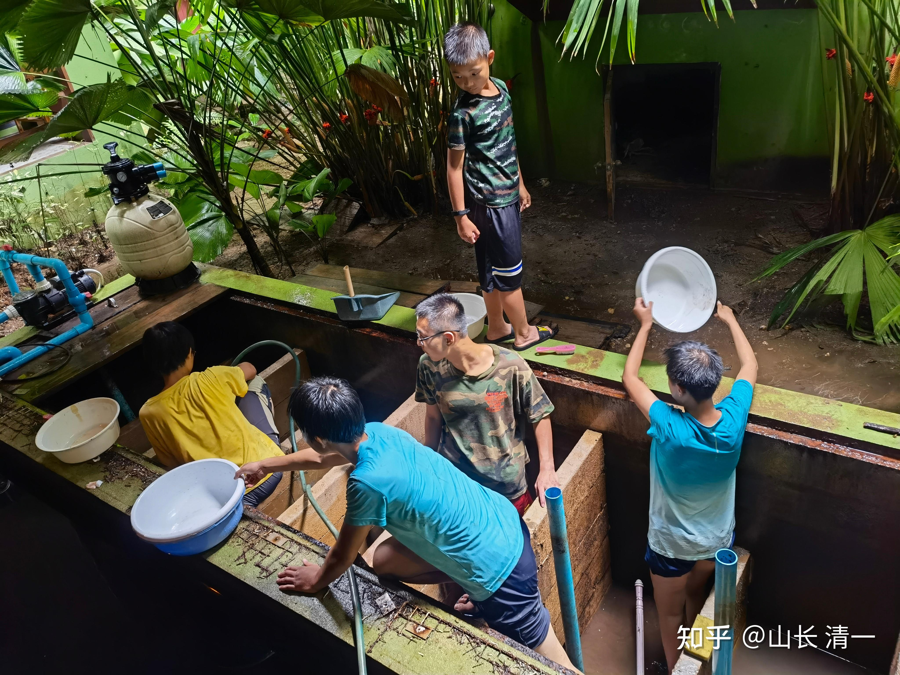

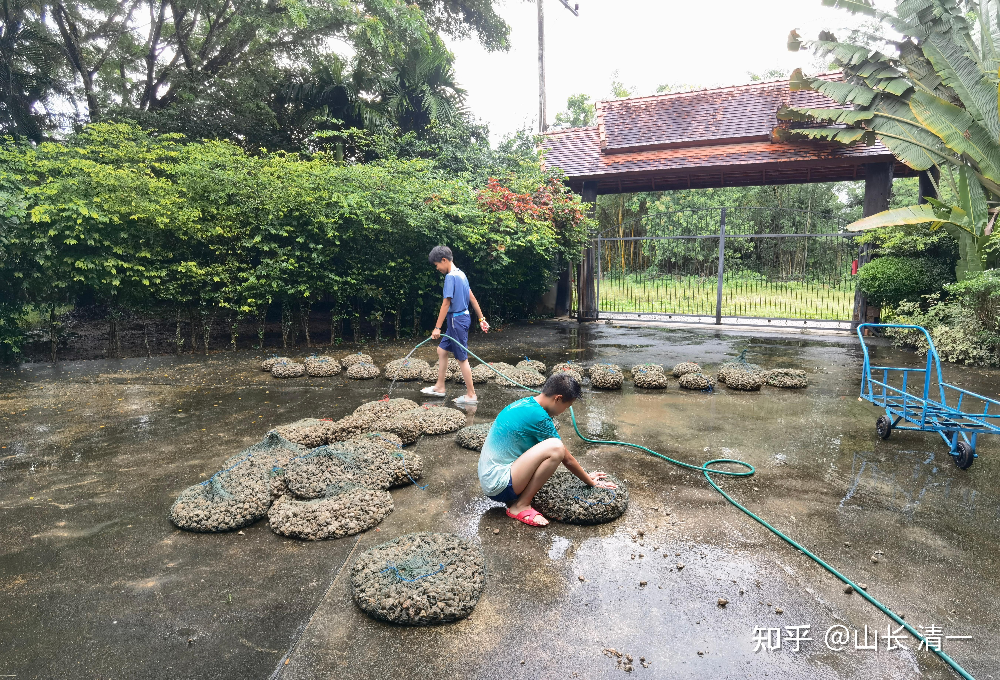

宋老师的中秋现场播报：今天早上佳惠带着一帮孩子清理了锦鲤鱼池。我带阿伦原计划8:30到达，和孩子们一起清理，但因昨晚下大雨，麦当有一处高压线掉落，工人们需要先排除危险，导致迟到一小时。等9:30到梅州白房子，发现他们工作都快做完了。

佳惠像个小领导(孩子王的那种领导)，把小弟小妹们的工作安排得井井有条，几个孩子包括亦蓉和舒同学，干活也都非常认真给力，过滤池被清理得又快又干净。

由于孩子们的工作效率很高，根本没用上阿伦，所以请全红协助安排了其他工作给他(清理公厕下水道和修理变形的木门)

从今天的工作安排和后续注水情况关注，发现佳惠的做事能力和责任意识都有显著提升，为佳惠和孩子们点赞[表情]

**节日做事记录2：**正好今晚有明晓的比赛。我想：她也许希望在中秋夜，打出一个漂亮的拳赛来献给国人。一扫她“两连败"的晦气。虽然有泰国裁判潜规则的因素。但起码明晓自己在赛场上，也没有尽全力去赢得比赛，而是非常“佛系”地面对比赛，导致最终的尴尬结果。今天晚上，她会不会打一场“睡醒了”的拳赛，让泰国的裁判和观众，都没办法“继续装睡”呢？各位就等明天看结果好了。

** 另外一份节日礼物，是**佳慧居然收到了她第二战中的金腰带拳手，与她的二番战的会战邀约。这把她兴奋得都要翻天了，我还在路上开车旅行，她都要抓住马老师，要第一时间给我“汇报紧急消息”，我一了解：啥紧急，不就是金腰带约她二番战了。估计佳慧生怕错过比赛机会。因为这次安排的比赛，是在530公里以外的泰国城市举办的，小丫头估计非常担心我不让她去这么远的地方参加比赛。我知道她是很想“复仇”的。上一次打满五场，对方反击非常的无力。所有人，包括她自己，都认为自己稳赢了，结果裁判举起的却是别人的手，把她气得哭了两天。我当时表示：哭啥呢？找机会再打一场就行了，我愿意加倍出钱邀约对手再打一场。不过对手很聪明，一直在找借口逃避与佳慧的约战。没想到：这一次居然想通了，还不要我出钱，就突然让赛事方安排了比赛。她真有凭本事赢木兰佳慧的信心吗？还是想借机，还给佳慧应有的结果？我就不清楚了。

如果我是对手，绝对不会打这个二番战，更不会主动来开战。佳慧一个新手，才打了人生第二战，就把她一个金腰带打成毫无还手之力的样子，只能靠裁判来帮忙。现在的佳慧，已经快速提高了很多。再来打一场比赛，结果是注定的，只会更难看的。不是正好证明了上次的比赛，的确是裁判帮忙才赢的吗？也正因为上次的裁判帮忙，这一次二番战，佳慧肯定会全力出击，对手绝大可能是被KO。而且佳慧目前七战中，除了被黑掉的两场点数负之外，其余五场比赛，全是KO对手。这么高的KO率，金腰带也不怕吗？所以，我很难理解金腰带自找没趣的原因。就当一份送给我们的节日礼物吧。当然，还是希望佳慧把握好。

刚刚查了一下资料，佳惠比赛的府叫“Petchaboon”，中文译为“碧差汶”府，这个地方位于泰国的中心，被称为泰国小瑞士。这里每年会举行一个重大活动——持潜水佛节，且只在这个地方举行。从9月23日到9月28日，五天时间。第一天会举行重大仪式，还有龙舟赛，晚上是拳赛，以庆祝节日。

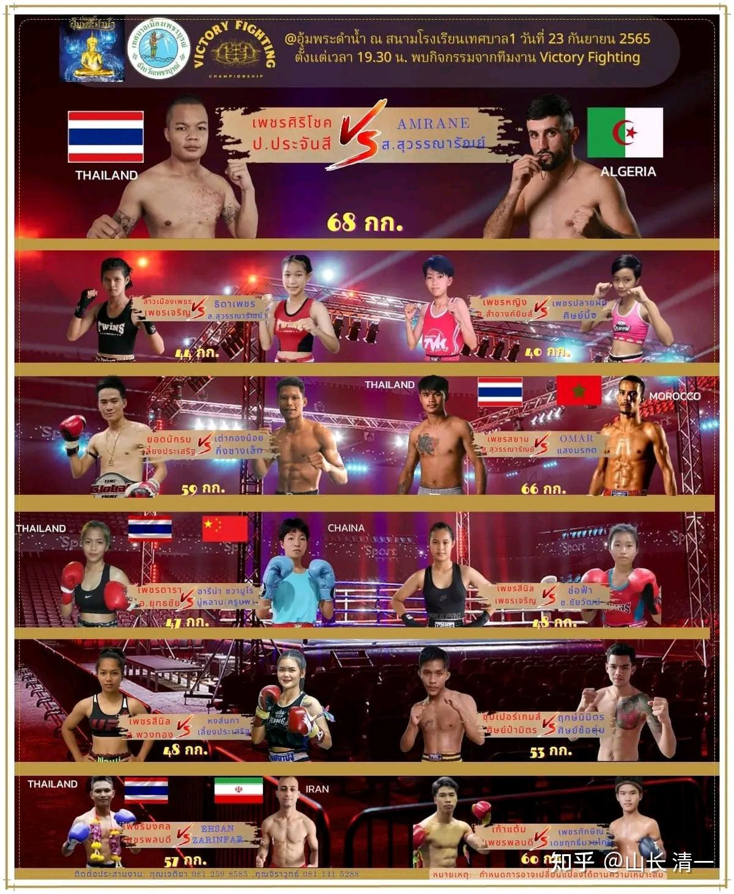

*9月23日拳战 海报 *

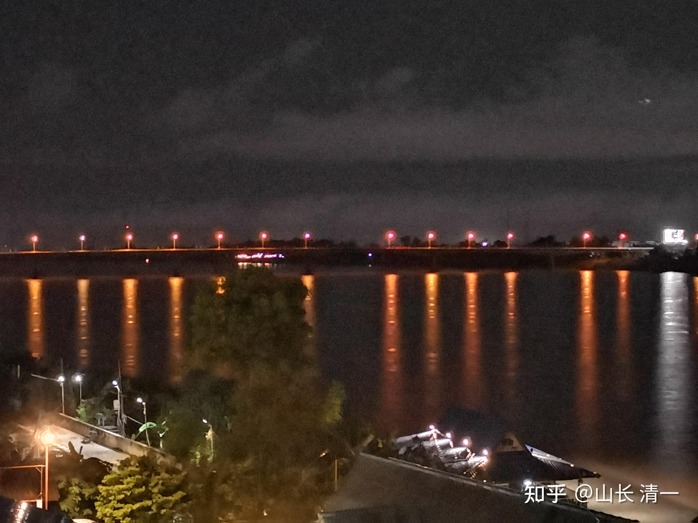

*湄公河中秋日夜景：灯光是泰老友谊大桥的路灯*

两个跟我出来的小公主，没啥贡献可以拿出来。就跑去拍一些漂亮照片，来给大家添光彩了。还有点艺术性呢！

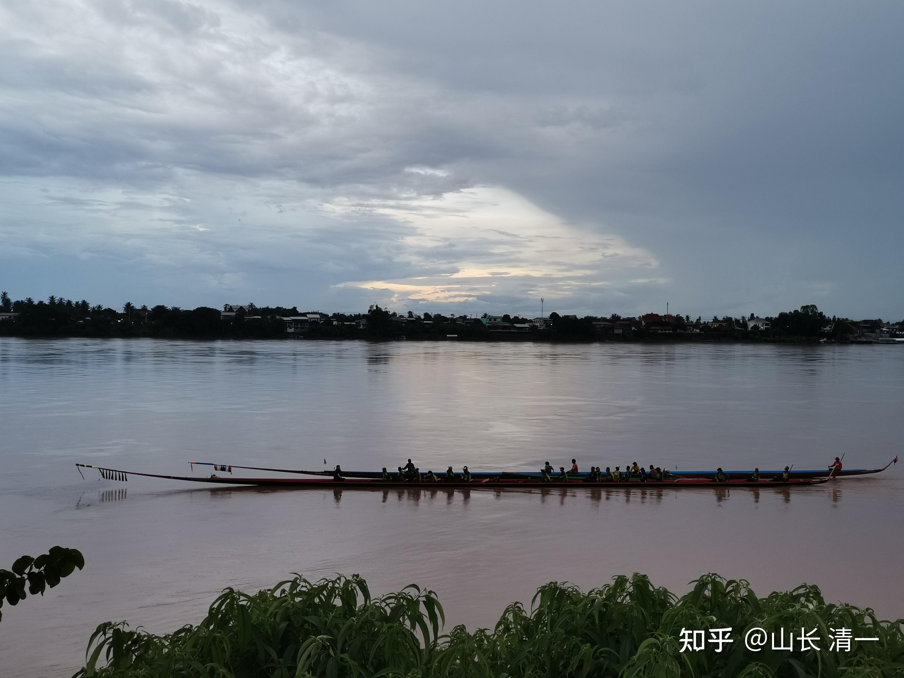

*江景 节日比赛要用的两只龙舟正在运送*

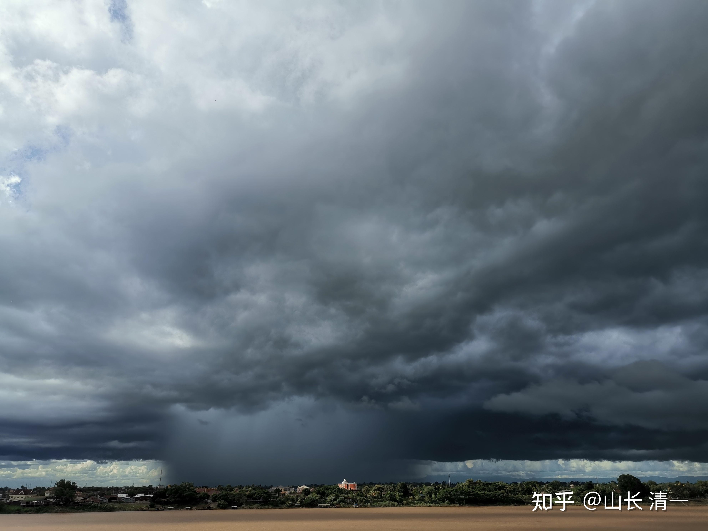

*下雨，就是这样的云。对岸雨云*

两个小公主说：为啥这里的云好低？似乎比我们人还低？我们在酒店的四楼。我说：这是透视问题，看去上河对面的云很低，其实与我们头上的云一样高。因为是雨季，云低一点。随时都会下雨！

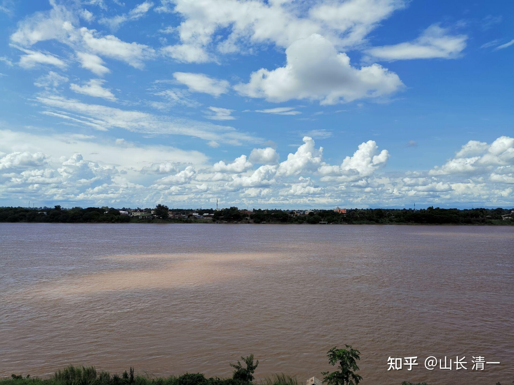

*灿烂阳光和雨水相距只是半个多小时*

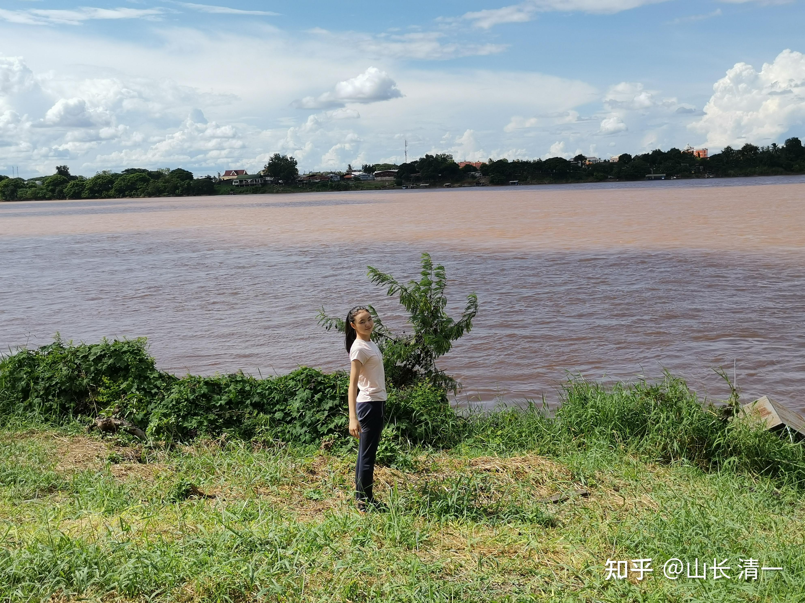

*半小时前的阳光景色，后面就变成急雨了*

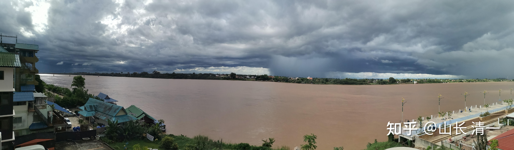

*远景 以及江边的观景台*

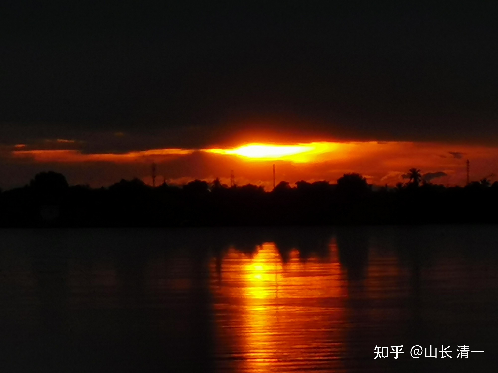

*江上落日*

在上几张公主人物照

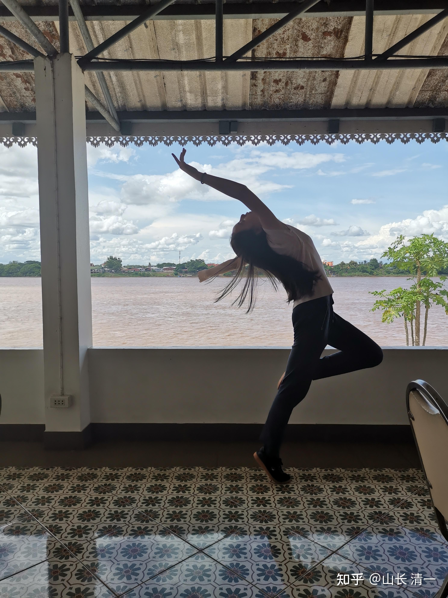

*艾拉小公主在江景台上跳舞*

艾拉小公主在江景台上跳舞

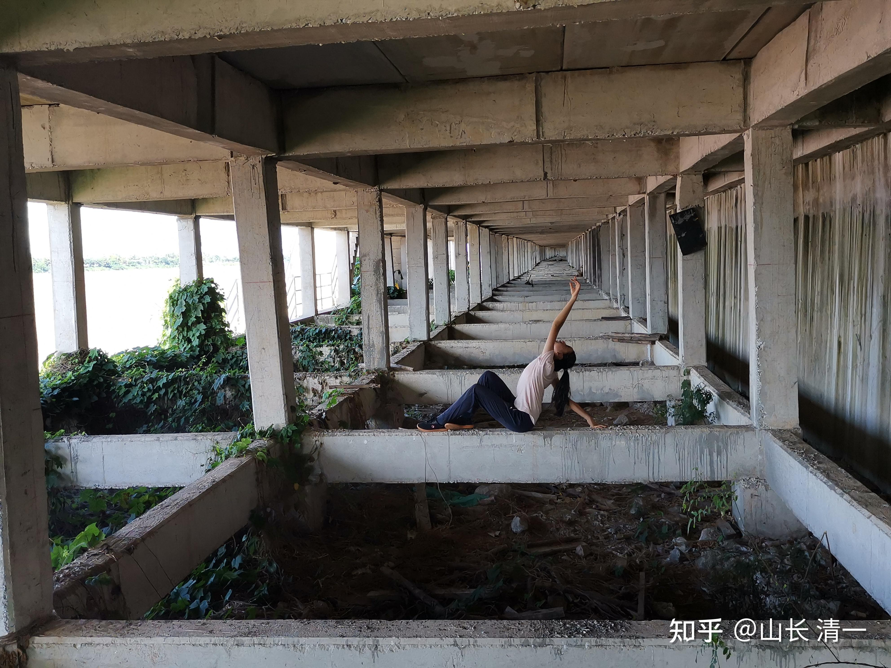

*艾拉小公主在观景台下练瑜伽玩儿*

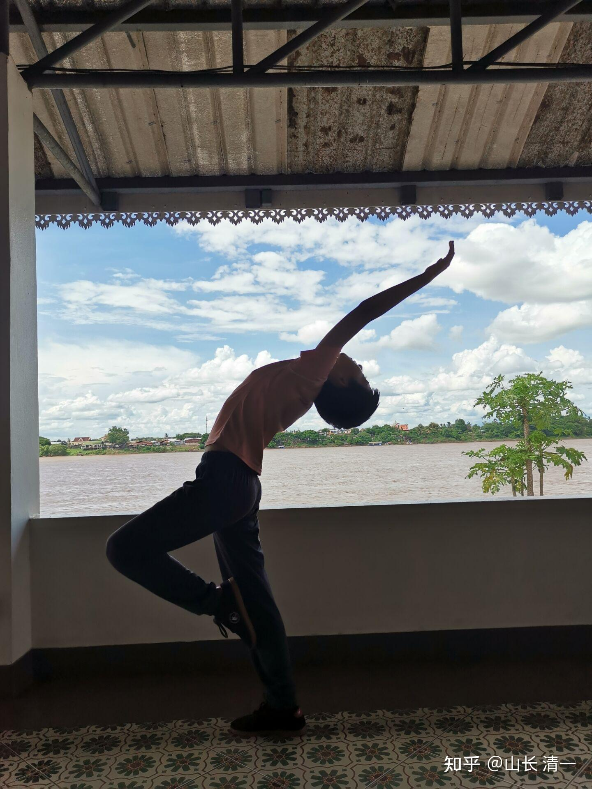

*明慧的游戏*

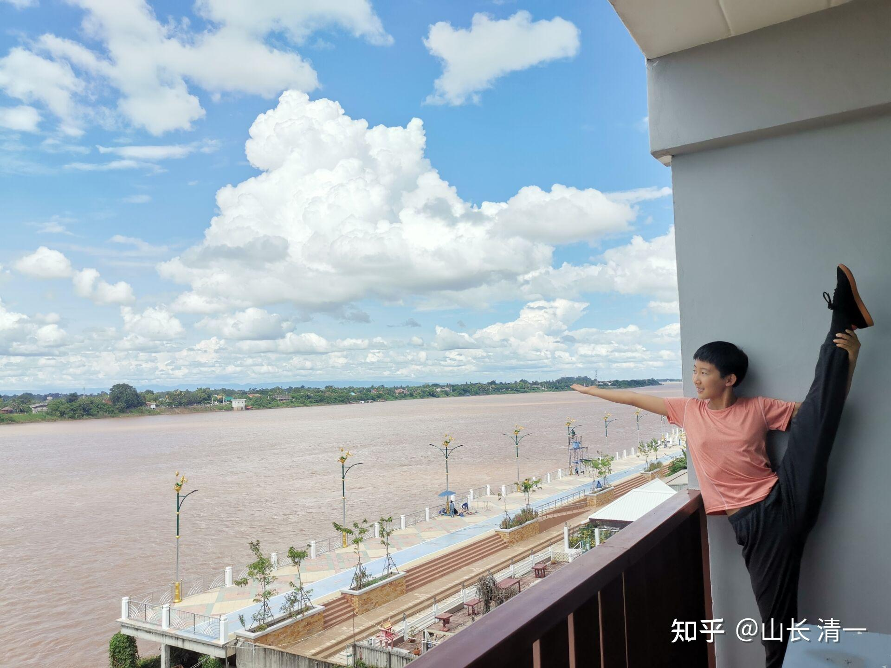

*明慧在客房阳台上玩小花样*

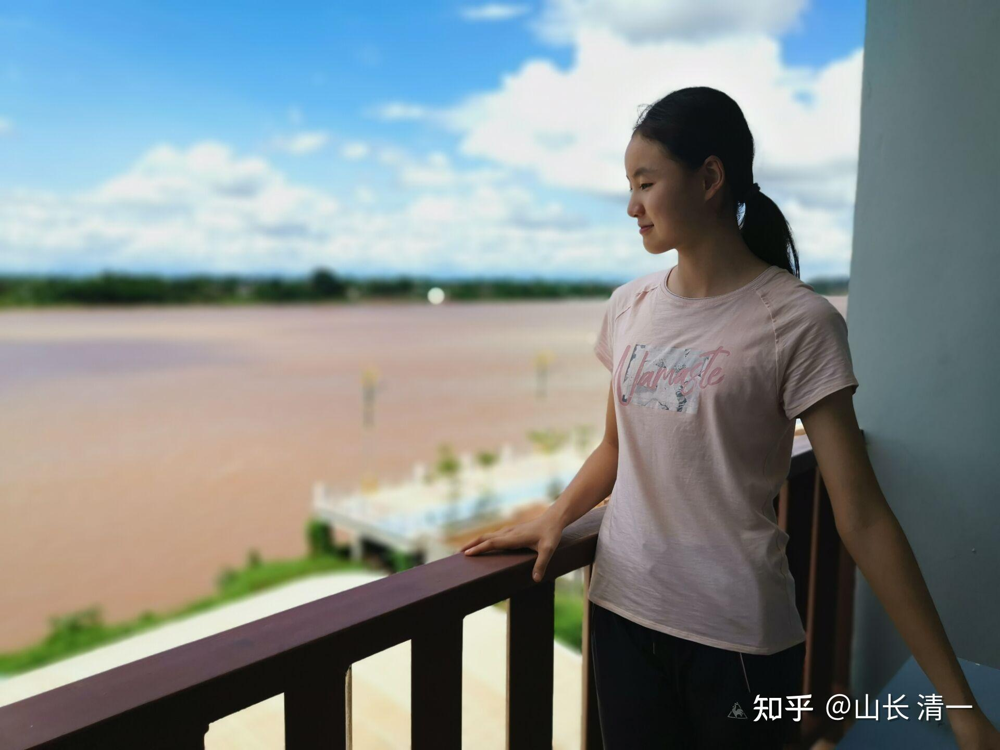