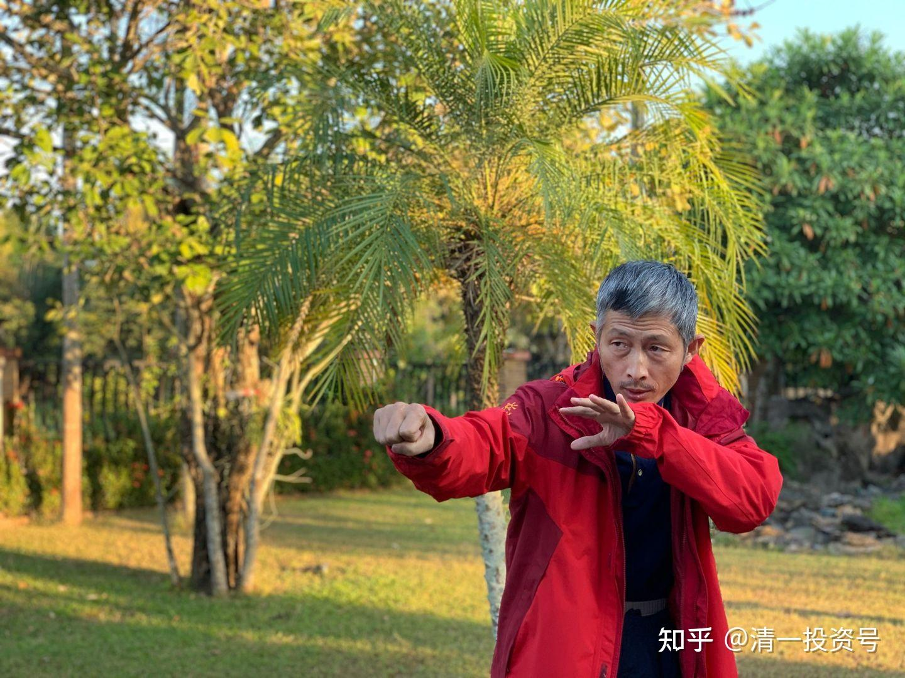
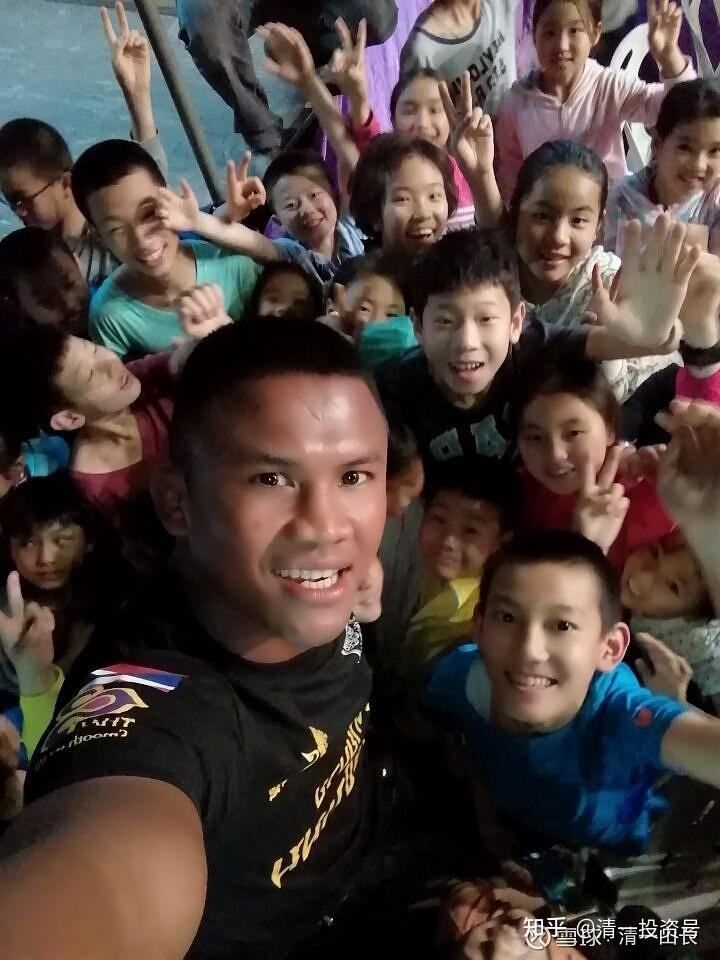
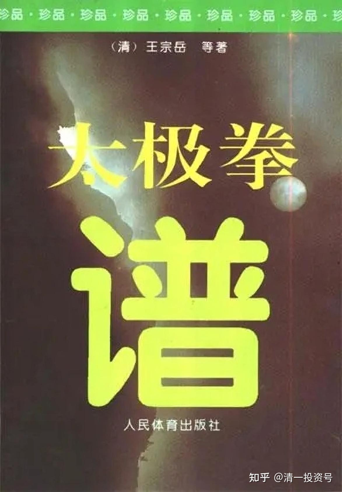

[原雪球专栏](https://zhuanlan.zhihu.com/p/562299554/edit)[119篇.实战太极与传武高级黑！是实话，可真相是这样吗？](http://link.zhihu.com/?target=https%3A//xueqiu.com/9310099567/173627375)

[清一山长](http://link.zhihu.com/?target=https%3A//xueqiu.com/9310099567) 2021年3月5日

转：“**[我在清一武道馆的一天：明仪视频](https://www.zhihu.com/zvideo/1351168878450524160)**”[网页链接](https://www.zhihu.com/zvideo/1351168878450524160)

原文转载，来自于知乎“玩格斗”的文字：

【上午在群里跟“津门决”的张猛老师聊天，他说圈里一位朋友跟他提到过一些老一辈武术家的感悟：

很多六七十岁的老先生，一些还都是武术界的大家，跟他交流的时候竟然会急得自己哭起来，说这辈子练的都是错的，没什么用，自己还认为自己挺牛逼，可是现在已经知道了，却没法儿改，自己的徒弟都已经四五十岁了，自己现在想改也没办法改，处于一种骑虎难下的境况。

张猛老师说，朋友说的这个话特别能代表那些六七十岁老传武人的想法，因为他们虽然现在是六七十岁的人，但他们也年轻过，三四十年前也是年轻人，他们也有过青春，也有过一膀子力气，也有过天不怕地不怕的那个劲儿，练个跑步啊，练爬杆儿啊，练个攀登啊，练个摔跤啊，掰个腕子啊，或者是说当兵也好，或者是干农活儿也好，都是一个个壮劳力，也都是一把好手儿，你在当时的体系里是优秀的，但那只是在它的各种规则里，给你划分固定好的另一种模式里。

那时的传武跟普通人打架相比是有技术含量的，就像现在现代搏击比传统武术更为先进一样。

玩君和张猛老师有一个观点是一致的，那就是传武一直深陷于一个泥潭无法自拔——非要和现代搏击去比较，何必呢？

传武更应该作为一种中国传统文化被传承，就像手编花篮，它与塑料袋相比，又笨又重，实用性、经济性都无法与塑料袋相比较，但编花篮并没有失传，它已经演化成为了一种代表传统文化的艺术品。

张猛老师也举了个毛笔的例子，它和水笔相比，又笨又麻烦，但它也没有消失，用它写出来的字能成为艺术品，登上大雅之堂，也是因为它代表着传统文化。

传武也应如此，我们不必执着于传武非要能打过现代搏击，大大方方地承认传武打不过现代搏击不就完了？何必为了一个本不属于自己的定位而继续尴尬呢？

该给传武正名了，传武是且只是一种中国传统文化体育项目，其内涵有三：一是文化，二是健身，三是防身。文化是核心，健身其次，防身是赠品。无他！

马大师悟到了，也大胆的说出来了，我敬他是条汉子，其他传武人敢说这话吗？】

**太极是至刚至快之拳**

以下文字，是清一武道馆的创办人：清一山长说的传武，说的太极拳格斗实战的要领。谁是真的？你们自己判断吧！肯定有人说了假话，有可能是无知，有可能明明知道，就是出来骗人的。是谁呢？

**武术实战三大要素：**

**第一是速度：**天下武功，唯快不破。攻防没有速度，说啥都是没用的。再大的力量，也用不出来。这就是有人苦练绝招，劈砖打石，上场却无用的原因。

**第二是力量：**天下武功，无坚不破。进攻没有力量，自己不强，再快有啥用?风吹再快，可以把人吹跑，但打不死人。

**第三是准确度：**打拳，出击目标不准，乱抡一通拳，再大的力量，打不中人也没用。

这三项，简称：**快、狠、准**！这才是实战的拳，这才是实战的太极！

真太极，真内家拳，这三大要素，都是外家拳无法匹敌的。

第一：真太极的速度超群，我遇到的顶尖高手，一次攻击就变化六、七次。我完全不敌。因为我一次攻击，只能变化三、四次。但对付不懂变化，只会拼力气、速度相对很慢的外家拳来说，已经足够用了。连我太太都看出来了。让她看张伟丽的冠军实战比赛，她说：“怎么速度不快呀？看上去慢悠悠的。”因为她看到武道馆练拳，看到了更快的出手。以为世界冠军赛，会快到看不清，结果令她有点纳闷，说想不到——因为练外家拳的，用的是肌肉收缩来发力，这种方式，极限速度就这样了，快不起来的。而且攻防过程中体能消耗特别大。**真太极，用的是全身弹抖来发力**，自然更快，而且**更省体力，打人不累**。

第二：真太极的力量，超过外家拳。因为是使用全身来发力的。外家拳，无非是用转腰，摆肩，手上的肌肉紧张收紧而发力。远远赶不上真太极的力量大。所以，真太极一出手，没人能站住不动的。一旦力量落到要害，如头部位置，就是KO。

第三：真太极不像外家拳，喜欢打上12回合分胜负。双方拼体力，乱摆拳。真太极讲究瞄准锁定后再出击，强调：**打不中不打，打不重不打！打不垮不打**（古人的话吓人，叫“打不死不打”），就像狙击手一样。外家拳，厉害是厉害，像是机关枪。但遇到狙击手，一样的认输。古人记载“犯者立扑”，双方一交手，就有人要倒下。

当然，培养一个狙击手，要比培养一个机枪手难多了。机枪手，体力强就可以干。狙击手，体能、智能、耐心、耐力，一样都不可少！

所以——现在还没有“太极狙击手”出山，但不是老祖宗没有，是现代人太不成器，急功近利。当然培养不出来。

未来，看清一武道馆，批量培养传武格斗人才，文武双全的真国学人才。

*我的学生们与播求在一起*

（以下内容为编者收录）

**评论回复：**

**[适度分散拥抱成长](http://link.zhihu.com/?target=http%3A//xueqiu.com/n/%25E9%2580%2582%25E5%25BA%25A6%25E5%2588%2586%25E6%2595%25A3%25E6%258B%25A5%25E6%258A%25B1%25E6%2588%2590%25E9%2595%25BF)回复[清一山长](http://link.zhihu.com/?target=http%3A//xueqiu.com/n/%25E6%25B8%2585%25E4%25B8%2580%25E5%25B1%25B1%25E9%2595%25BF)：**

你的啤酒也贵得要命，70PE，不觉得贵吗？抽空扯扯传统武术的厉害之处吧！让球友开开眼界，兼听则明嘛！我觉得武术就是以快打慢，以强击弱，所以其实不用分那么多门派，只要足够块，能躲过敌人打击，同时打到敌人即可，打到薄弱部位更佳。既然如此简单，为何人类整出那么多种类呢？什么拳，什么道……不一而足。

**[清一山长](http://link.zhihu.com/?target=https%3A//xueqiu.com/9310099567)[2021-03-05 16:12](http://link.zhihu.com/?target=https%3A//xueqiu.com/9310099567/173601893)回复[适度分散拥抱成长](http://link.zhihu.com/?target=http%3A//xueqiu.com/n/%25E9%2580%2582%25E5%25BA%25A6%25E5%2588%2586%25E6%2595%25A3%25E6%258B%25A5%25E6%258A%25B1%25E6%2588%2590%25E9%2595%25BF)：**

看您懂一点点武术。不过，懂得不多。

武术三大要素：
第一是速度：天下武功，唯快不破。没有速度，说啥都是没用的。再大的力量，也用不出来。

第二是力量：天下武功，无坚不破。没有力量，再快有啥用？风吹再快，可以把人吹跑，但打不死人。

第三是准确度：打拳，打不准，乱伦一轮拳，再大的力量，打不中人也没用。
真太极，真内家拳，这三大要素，都是外家拳无法匹敌的。

第一：真太极的速度超群，我遇到的顶尖高手，一次攻击就变化六七次，我完全不敌。因为我一次攻击，只能变化3～4次。但对付不懂变化，只会拼力气，速度相对很慢的外家拳来说，已经足够用了。连我太太都看出来了。让她看张伟丽的冠军实战比赛，她说：“怎么速度不快呀？看上去慢悠悠的。”因为她看到武道馆练拳，看到了更快的出手。以为世界冠军赛，会快到看不清，结果令她有点纳闷，说想不到——因为练外家拳的，用的是肌肉收缩来发力，这种方式，极限速度就这样了，快不起来的。而且攻防过程中体能消耗特别大。**真太极，用的是全身弹抖来发力**，自然更快。

第二：真太极的力量，超过外家拳。因为是使用全身来发力的。外家拳，无非是用转腰，摆肩，手上的肌肉紧张收紧而发力。远远赶不上真太极的力量大。所以，真太极一出手，没人能站住不动的。一旦力量落到要害，如头部位置，就是KO。
第三：真太极不像外家拳，喜欢打上12回合分胜负。双方拼体力，乱摆拳。真太极讲究标准好再出击，强调：**“打不中不打，打不重不打！打不垮不打。”**就像狙击手一样。外家拳，厉害是厉害，像是机关枪。但遇到狙击手，一样的认输。
当然，培养一个狙击手，要比培养一个机枪手难多了。机枪手，体力强就可以干。狙击手，体能、智能、耐心、耐力，一样都不可少！

所以——现在还没有太极狙击手出山，但不是老祖宗没有，是现代人太不成器。急功近利。当然培养不出来。

**[适度分散拥抱成长](http://link.zhihu.com/?target=http%3A//xueqiu.com/n/%25E9%2580%2582%25E5%25BA%25A6%25E5%2588%2586%25E6%2595%25A3%25E6%258B%25A5%25E6%258A%25B1%25E6%2588%2590%25E9%2595%25BF)回复[清一山长](http://link.zhihu.com/?target=http%3A//xueqiu.com/n/%25E6%25B8%2585%25E4%25B8%2580%25E5%25B1%25B1%25E9%2595%25BF)：**

祖宗的东西确实厉害，有个疑问为何不上世界舞台秒杀各大赛呢？貌似西方人霸占着很多大赛。中医也确实厉害，为何不能“当惊世界殊”，秒杀西医呢？后背上推上两掌输入内功，或者调几副中药，那不比吃药打针、做CT、开刀方便多了。

**[清一山长](http://link.zhihu.com/?target=https%3A//xueqiu.com/9310099567)[2021-03-05 16:35](http://link.zhihu.com/?target=https%3A//xueqiu.com/9310099567/173604279)回复[适度分散拥抱成长](http://link.zhihu.com/?target=http%3A//xueqiu.com/n/%25E9%2580%2582%25E5%25BA%25A6%25E5%2588%2586%25E6%2595%25A3%25E6%258B%25A5%25E6%258A%25B1%25E6%2588%2590%25E9%2595%25BF)：**

清一大学，现在不就已经是“世界无敌”了吗？[笑]。这就是用古人的教学法，用“道”来做的教育。您不信，就找人来“敌”一下。从3700万人中选出10个人出来，与我们比赛学科成绩。比赢了，您可以拿一千万元奖金好了。现在吹牛，要花钱的！您要不吹牛，玩真的，可以挣钱！

清一武道馆，已经成立两年，你等着看结果就知道了。
清一医学院，今年9月份招生。西医培养一个学生，周期至少要8年吧？您不用等8年的，就可以看到结果了。我相信全世界的西医，根本没有一家是对手——只比疗效，不比证书。

至于您说：原来这些人干嘛去了？干嘛现在才出来？
你去问他们去呀！几百年了，都死哪里去了？为甚把祖宗的好东西不用，乱学外国的低档货。我咋知道这些人这么没出息呢！

**[-lily-](http://link.zhihu.com/?target=http%3A//xueqiu.com/n/-lily-)回复[清一山长](http://link.zhihu.com/?target=http%3A//xueqiu.com/n/%25E6%25B8%2585%25E4%25B8%2580%25E5%25B1%25B1%25E9%2595%25BF)：**

山长，以后弟子练出来了会开武馆吗？我们这些旁人也能学一学见识见识吗[献花花]

**[清一山长](http://link.zhihu.com/?target=https%3A//xueqiu.com/9310099567)[2021-03-05 20:16](http://link.zhihu.com/?target=https%3A//xueqiu.com/9310099567/173622730)回复[-lily-](http://link.zhihu.com/?target=http%3A//xueqiu.com/n/-lily-)：**

**真太极门规：不许看家护院，不许演武卖艺！**

我花钱费力的培养半天弟子，就为了给你们培养一个开武馆的教练员？演武卖艺？就因为你们这些人，中国武术才这不伦不类的样子。您还是找马保国的武馆去吧！

**[-lily-](http://link.zhihu.com/?target=http%3A//xueqiu.com/n/-lily-):回复[清一山长](http://link.zhihu.com/?target=http%3A//xueqiu.com/n/%25E6%25B8%2585%25E4%25B8%2580%25E5%25B1%25B1%25E9%2595%25BF)：**

感谢山长回复[献花花]看来传承是私人的了[合十]祝一切顺利！

**[清一山长](http://link.zhihu.com/?target=https%3A//xueqiu.com/9310099567)[20221-03-06 11:58](http://link.zhihu.com/?target=https%3A//xueqiu.com/9310099567/173656111)回复[-lily-](http://link.zhihu.com/?target=http%3A//xueqiu.com/n/-lily-)：**

这不是私人的，是民族的。**只有为了荣誉中华民族的人，才需要来学中华武道，以武入道。只是看热闹的，就去看武术表演，各取所需**。[献花花]

**[安的人生](http://link.zhihu.com/?target=http%3A//xueqiu.com/n/%25E5%25AE%2589%25E7%259A%2584%25E4%25BA%25BA%25E7%2594%259F)回复[清一山长](http://link.zhihu.com/?target=http%3A//xueqiu.com/n/%25E6%25B8%2585%25E4%25B8%2580%25E5%25B1%25B1%25E9%2595%25BF)：**

山长可否推荐下您觉得经典的古拳书清单，让我辈爱好者学习下，尽可能少走弯路，谢谢山长[献花花]

**[清一山长](http://link.zhihu.com/?target=https%3A//xueqiu.com/9310099567)[2021-03-08 18:15](http://link.zhihu.com/?target=https%3A//xueqiu.com/9310099567/173822229)回复[安的人生](http://link.zhihu.com/?target=http%3A//xueqiu.com/n/%25E5%25AE%2589%25E7%259A%2584%25E4%25BA%25BA%25E7%2594%259F)：**

**人民体育出版社出版的《太极拳谱》**，收录了各家各派的太极古谱。**很多就是前辈高人的真实练功指导和记录**。价格很便宜，十几元一本，比别的当代大师几百元的书更好。**相信它，练出来，就行了**。我就是这样干的。您去买来，看懂，就OK 了[大笑]。别以为我看了啥秘密的拳谱。

参考链接：

[山长 清一：当代传武人画像！传武毁于"传武人“！](https://zhuanlan.zhihu.com/p/561047657)

[山长 清一：中国百年来“传武人”的丑陋暴露无遗](https://zhuanlan.zhihu.com/p/467233067)

[山长 清一：中华武林和泰拳交战的历史记录](https://zhuanlan.zhihu.com/p/495443356)

[山长 清一：泰拳500年不败神话，正被清一太极终结](https://zhuanlan.zhihu.com/p/488027181)（第一、二场）

[山长 清一：昨天决战结果：拿了一条金腰带；另一条泰国人死活不给](https://zhuanlan.zhihu.com/p/505089200)（第三、四场）

[山长 清一：太极征泰第五战视频及点评：太极和泰拳的不同](https://zhuanlan.zhihu.com/p/533876532)

[山长 清一：太极征泰第6，7，8场战报：明晓一对二获胜](https://zhuanlan.zhihu.com/p/537753601)

[山长 清一：清一木兰第九战：明晓越级挑战50公斤级对手](https://zhuanlan.zhihu.com/p/544183017)

[山长 清一：太极征泰第10场比赛：木兰明晓 VS 帕卡（pancake）](https://zhuanlan.zhihu.com/p/555150182)

[山长 清一：太极征泰第11战：木兰佳惠第5战 KO胜](https://zhuanlan.zhihu.com/p/557345876)

[山长 清一：太极征泰第12战：明晓第七战VS男职业拳手](https://zhuanlan.zhihu.com/p/557820557)

[山长 清一：太极征泰第13场：佳慧第6战 KO胜（最怪异的比赛）](https://zhuanlan.zhihu.com/p/560524655)

[山长 清一：太极征泰第14，第15场比赛！](https://zhuanlan.zhihu.com/p/562359802)

[山长 清一：太极征泰16战：明晓第9战，点数胜。原版无点评](https://www.zhihu.com/zvideo/1552263008361082880)

[山长清一：太极征泰第17战 木兰佳惠二番战KO胜](https://www.zhihu.com/zvideo/1553014525674364928)