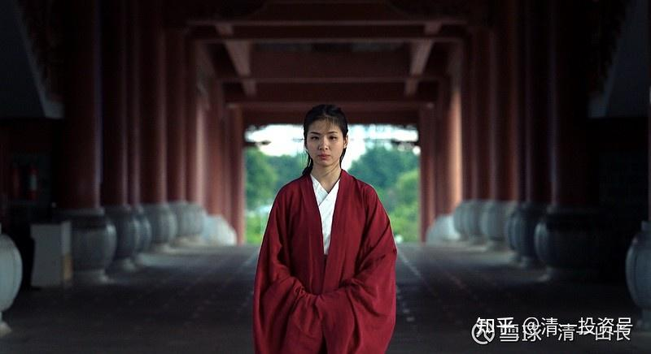

原雪球专栏[124篇.未来世界需要跨国、跨文化、跨专业的综合人才](http://link.zhihu.com/?target=https%3A//xueqiu.com/9310099567/174170445)

清一山长2021年3月11日

只要击败下面照片中这个小女生摆的教育擂台，您就可以拿到她筹资送给您的1000万现金。我愿意签约做担保，确信让您能拿到这笔钱[俏皮]。下面链接的这些人，就是她带的学生，您的未来对手，哔哩哔哩网页链接：

[【清一大学少年班】走进我们的日常生活](http://link.zhihu.com/?target=https%3A//www.bilibili.com/video/BV1Hr4y1K769/)

[https://www.bilibili.com/video/BV1Hr4y1K769/](http://link.zhihu.com/?target=https%3A//www.bilibili.com/video/BV1Hr4y1K769/)

“大学”的原始含义，就是“博大精深之学”。致力于实现最广博，或者最精深的知识系统的学习和掌握。但是，传统的教育系统，采用模块化、专业化、拼装式的教育模式。一方面，不可能培养出顶尖的“精深级别”的创新知识人才，**这些人**才**，都是自己长出来的**。另一方面，由于设置了层层的学科壁垒，把人类的知识体系分割得很细致、很分裂，因此也无法培养出跨专业的广博之才。体制教育低效率的教学方式，也让传统的教育不可能提速，规定的时间内，学习吸收的东西很少，跨学科学习，变得实际上不可能。特别是跨文理专业的跨界人才，更是传统教育的空白区域。这却是未来世界最需要的人才。清一新教育，非常强调培养跨越中西、古今合一、文理合一、文武合一的，全球性综合性人才。这种人才的优势是传统教育、传统大学根本无法媲美的。因此，自然清一新教育，就拥有了未来世界极其重要的“知识权力”。必将成为文化上层。

清一大学现在开打的**“千万教育擂台”**，就是考验现在的教育界，是否具有培养未来社会最需要的跨界人才的能力，这是一次教育的大检验，看谁能真正的培养出这种新人类出来。中国的体制教育系统，从学前教育到高中阶段，共有在校学生总数2.3亿人，专任教师2018年达到1673.83万人，有学校50万所，在校大学生3700万人。如果这么庞大的样本，居然选不出10个拥有跨学科能力的学生来参与擂台赛，并赢得比赛，这只能充分地说明：传统的学校和传统教育模式，真的不是一般的落后于时代的需要。我们静候擂台赛的消息吧！

照片是我的教育学专业的研究生明仪，今年20岁，这次教育擂台赛的两位擂主之一！她也是首届清一大学少年班的带班教师。面对数千万人的庞大对手盘，敢有信心“卖掉”自己筹资来设**“千万教育擂台”**，正是中国古人“虽千万人吾往矣”的大气和勇气，无论最终结果的成败如何，她已经是新教育的成功！

视频，[我在武道馆的一天](https://www.zhihu.com/zvideo/1351168878450524160)知乎网页链接：

[https://www.zhihu.com/zvideo/1351168878450524160](https://www.zhihu.com/zvideo/1351168878450524160)

一点小八卦，五年前，明仪的理想是要跟刘老师学医，去大道医学院做学生。“清黑”事件后，她不再想学医了。她认为：这群“清黑”，身体好好的，脑子和良心全都坏了，证明身体健康也没有任何意义。不想去治疗人的身体了，不如去治疗人的脑子和心理，所以弃医从教。当年的一批学生，都跟她一样，都放弃了学医，去做教师了。所以刘老师的道医学院，就一直没开始招学生，今年才重新启动。

执掌“未来教育权力”的人，到底会是谁呢？是她和她的伙伴们？还是她的对手盘？传统大学的师生？您愿意赌谁赢？

对我来说，谁赢了，都是赢了，都可以取得“对外教育战”的优势。我更希望体制学校能赢下比赛——这样说明中国的体制学校，是有信心、有能力进行新时代需要的教育改革的。我不怕打脸，跟中国数千万人作对，输了我有啥丢脸的？就怕赢了，才是“我大中华真的无人了”的悲哀[捂脸]。

当然，我也很喜欢清一大学赢。因为，如果体制3700万人都拼不赢区区上百人的小团队、试验田。我认为传统学校的师生们，今后就应该谦虚一点，向民间学习真教育，**让真教育成为中国人的竞争力所在。**

暴力时代的全球霸主，是罗马帝国，是蒙古帝国，是军事力量最强的国家和民族。

金钱力量时代，全球领袖是日不落的英帝国，以及现在的美国。

**知识力量的时代，会属于中国吗？**就看中国的教育改革，能否走在世界各国的前面了。只要中国率先改革了教育系统，领导了世界的知识力量，中国就是未来的世界强国、世界领袖！就像当年的德国，率先改革了农业时代的传统教育模式。设计出了工业化时代的“全新”教育系统，普及了国民教育，就是大家现在熟悉的K12教育系统。这种教育，就把德国从一个被欧洲轻视的小国，改造成了世界级的大国，还差点成为世界霸主。英美动用了其他所有大国的力量，全都一起联合起来，才勉强制服了一个小小的德国。可见创新教育力量的强大和生命力！

如果中国失去了这个利用教育**“弯道超车”**的机会，就继续给全世界打工吧！毕竟，过去40多年，**中国是靠给全世界打工，才获得现在的发展机会。未来，外国人还会继续给中国人更多的机会吗？**

**中国人，能找到自己的发展方向和地位吗？**

答案在你们身上！你们想要什么？**是继续做一个苦苦的打工者，还是主动去创造新的世界机会的主人？**

**跨界人才，是用汗水浇灌的，不是傻读书读出来的**：示范班的活动视频

哔哩哔哩网页链接：

**[【示范班第二学期 vlog】运动系列#1 大汉训练精简版Insanity](http://link.zhihu.com/?target=https%3A//www.bilibili.com/video/BV1Qy4y1a7S3)**

[https://www.bilibili.com/video/BV1Qy4y1a7S3](http://link.zhihu.com/?target=https%3A//www.bilibili.com/video/BV1Qy4y1a7S3%25E3%2580%2591)

**ref="[https://mp.weixin.qq.com/s/qSJoTZXxcB5_gfJiMX3OMg](http://link.zhihu.com/?target=https%3A//mp.weixin.qq.com/s/qSJoTZXxcB5_gfJiMX3OMg)">千万大奖 教育擂台赛 比赛项目和内容细节介绍**

[https://mp.weixin.qq.com/s/qSJoTZXxcB5_gfJiMX3OMg](http://link.zhihu.com/?target=https%3A//mp.weixin.qq.com/s/qSJoTZXxcB5_gfJiMX3OMg)

（以下内容为编者附录）

**评论回复：**

**ellhll李华丽2021-03-11 18:00回复清一山长：**

我要做主动去创造新的世界机会的主人！

1、封建帝国时代，暴力时代，是初级，拥有军队权利地位者为王。

2、资本主义时代，金融时代，是中级，拥有资源机会者为王。

3、新的信息时代，知识时代，是高级，拥有真正精深知识者为王。这样的王者必须有热爱学习的心态、自我学习的能力，有最尖端的创新性知识、有对知识和专业跨界的整合和掌握的能力。

暴力时代，罗马帝国蒙古帝国为霸主。

金钱时代，英帝国和美国为霸主。

知识时代，棋局未定，数风流人物还看今朝。

愿中国成为新的霸主，对这个愿望，我不妄想，不等待，而是马上行动，时刻在做。

我要做主动去创造新的世界机会的主人！

我要成为掌握真正知识的少数精英，即使我这一生成为不了这样的人，至少促成我的子女、孙辈有这样的机会，为后代铺就成为精英之路。

山长在昨天，3月10日，从早上9:15，到晚上23:52分，跨度近15个小时，在雪球上分享，一共发了28个帖子，其中1篇是专栏，1篇虽不是专栏但胜似专栏，3篇分析股票，23篇解读球友们的疑问，互动共14790个字，这样的强度和数据，哪个大学的老师一天的课程能做到？更不用说其中价值无限的内容。

这样的数据事实明确地告诉我们：【**清一雪球大学**】给了我们这些没有机会入读新教育的成人，一个无限价值的机会。这里没有围墙，没有国界，甚至脱离时间的限制，不同于与传统课堂提问者要有先后顺序的排队，6万多个球友可以同时提交自己的评论看法，雪球课堂，在这个意义上构建了一个平行宇宙。

我们一生追寻智慧，智慧不在过去，不在未来，不在云南，不在泰国，智慧在此时此地，在这篇文章里，在你看到这篇文章的这一刻。

行动起来，每一课【山长雪球课堂】，用心学习，认真思考，表达理解，提出困惑，看到我们诚心求学，山长会无私与我们分享智慧。

我们就走在【做主动去创造新的世界机会的主人】的路上。

我要做主动去创造新的世界机会的主人！！！

附录山长3月10日雪球28篇发帖，百度云盘链接：

链接：网页链接

提取码：hjci

**一弯银河一湾水回复清一山长：**

多年前，明仪到峨眉参加太极拳比赛，我跟她有过一面之缘。当时的明仪静气、让人不敢小看，又如邻家女孩般温婉。如今，明仪不仅是优秀的带班老师、深得学生们喜爱和敬佩，还很钟爱武道。她在武道馆笑的次数可比示范课多多了。一文一武，文武合一[献花花]

**清一山长2021-03-12** **10:25回复一弯银河一湾水:**

她取得了这次体育总局举办的全国比赛的单项太极冠军，第一名，并拿到了金牌。回家后却把金牌随意丢在家里。妈妈想拿来好好地展示一下给别人看，被明仪说：这种比赛，没有啥价值的，拿了第一名也不能说明啥水平。别当回事情，更别拿给别人看[大笑]。

**月亮的未来回复清一山长：**

这照片，我以为是电影里的明星[牛]，但显然，电影明星除了好看的皮囊，肯定没有明仪高贵的灵魂。