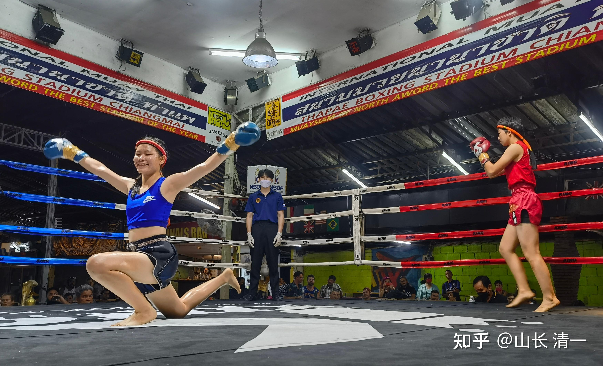
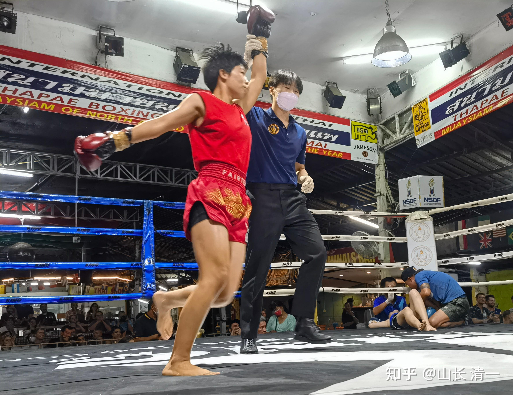
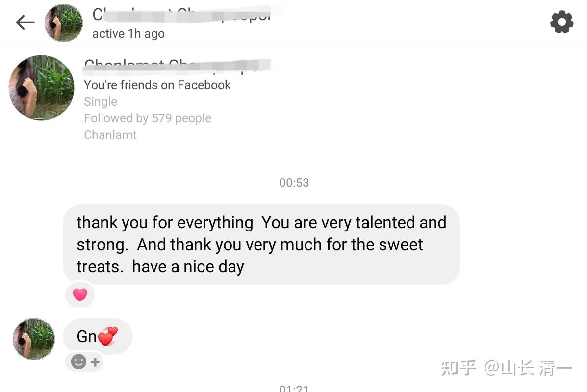
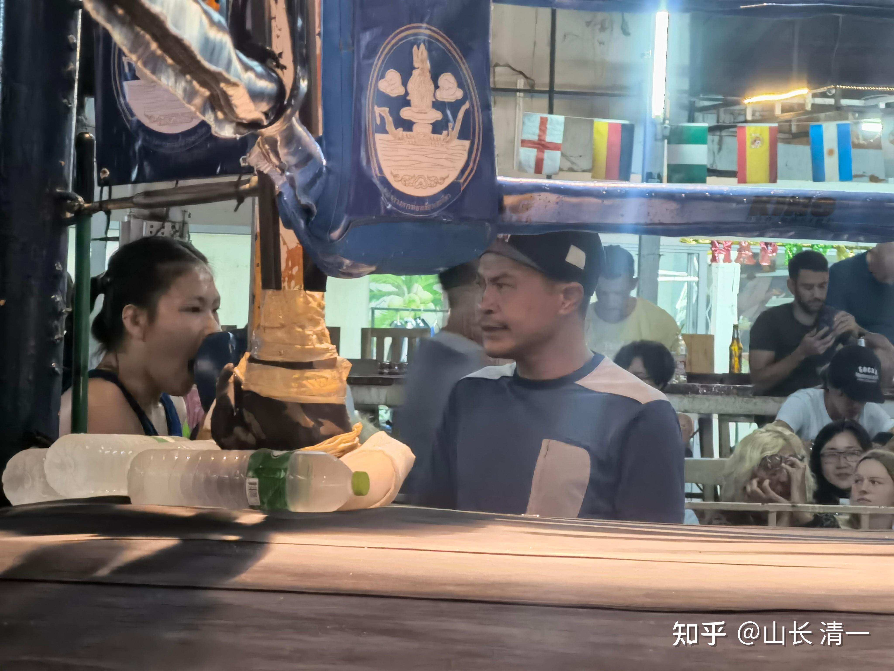
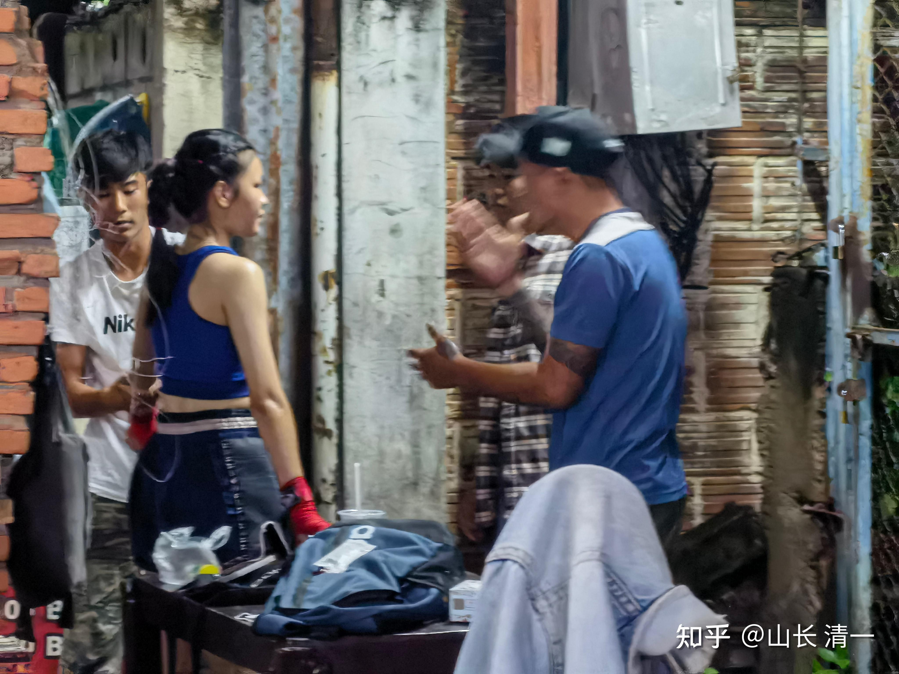
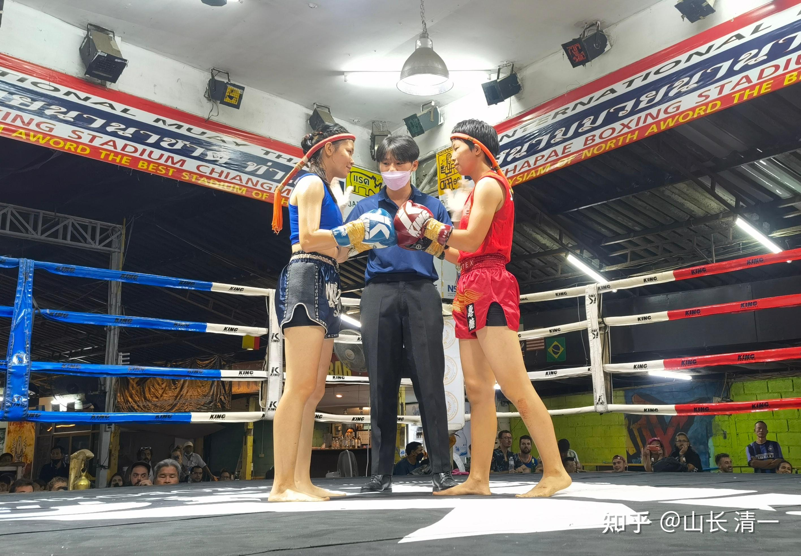
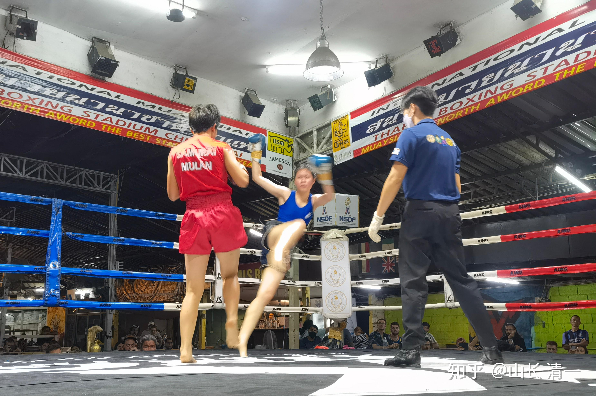
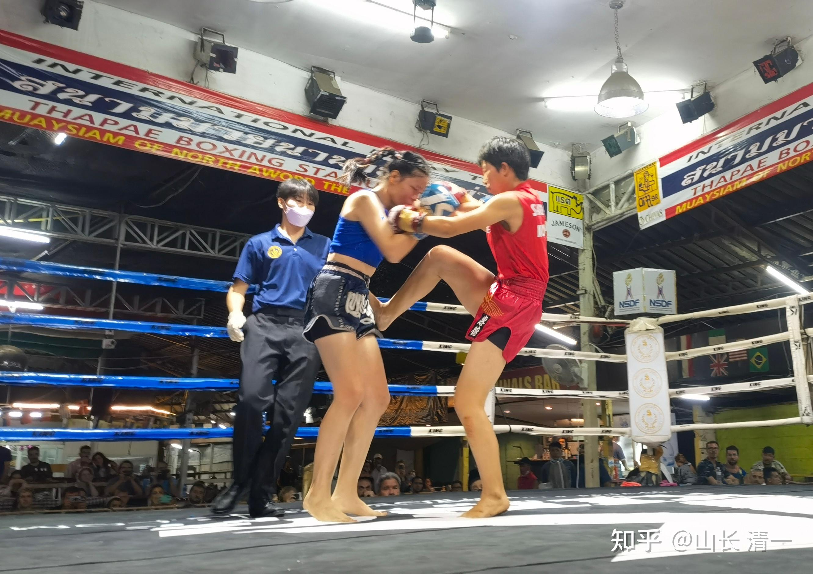
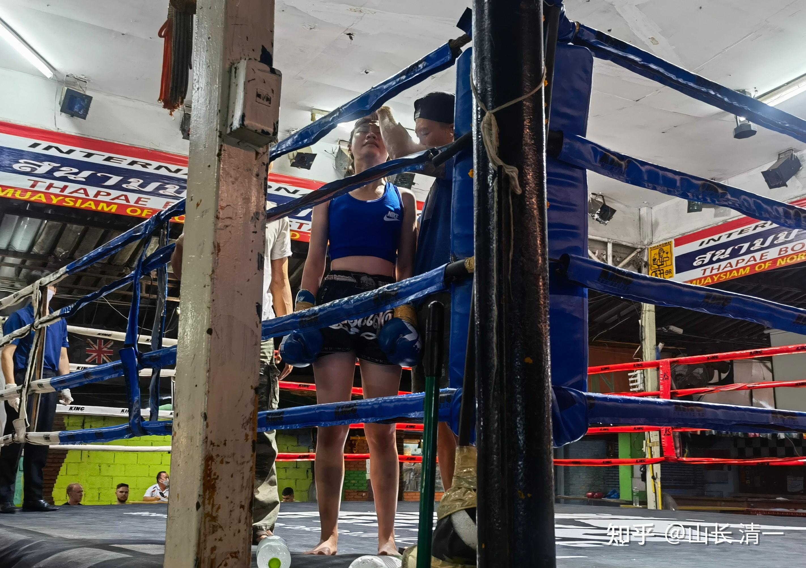
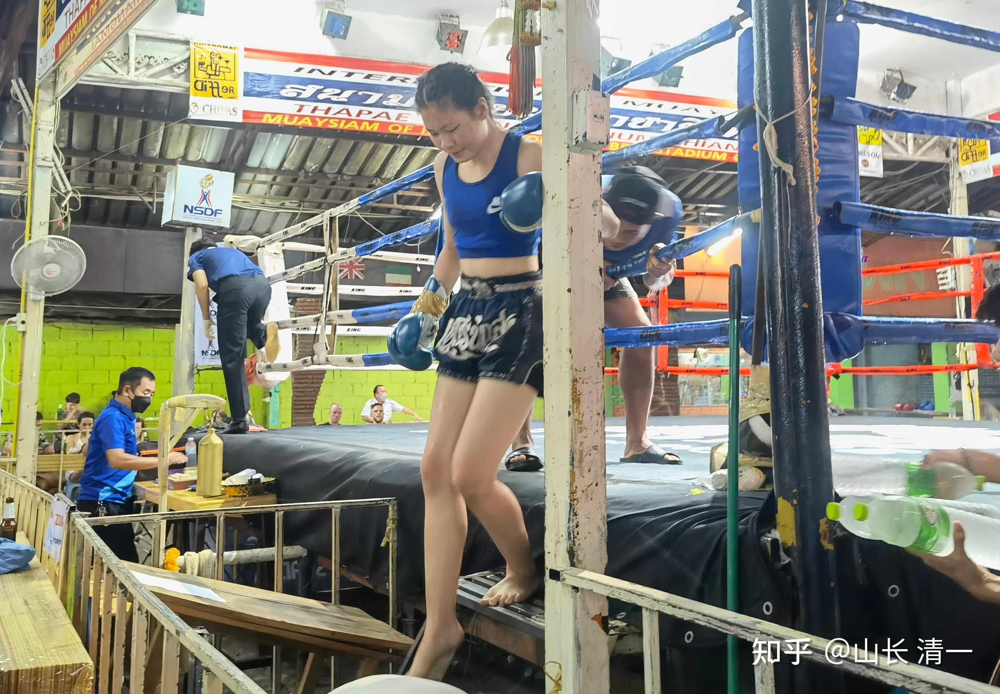

昨天上午，我们一家人第一次登录老挝，从廊开府出境，到老挝国立大学看了一下，这是老挝的北大。我说这是未来小女会来读一年的四所大学之一。吃完中饭后，我们就离开了万象，晚上住在琅勃拉邦，这是老挝的古都。

这一天，也是太极征泰第17战的时间。昨天晚上，在塔佩拳馆举办的比赛，异常的残酷，六场比赛，全部以KO结束，其中五场都在首局和第二局KO对手。所以一般拳赛，会战到近午夜12点的比赛，昨天10点过，就早早结束了。这一天， 木兰佳慧也创造了自己的两项新记录----首局就KO对手的记录，以及用拳终结对手的记录。让自己的 征泰战，总共8战中，取得了6场KO对手的新记录。由于佳慧的KO比如此的惊人，已经导致很多泰国的女拳手，不愿意与她交战了，安排好了比赛也不断弃战。佳慧也毫不在意，说如果将来泰国的女拳手都不愿意跟她打了，她就要求主办方安排男拳手来跟她打。这样更好！

昨天的比赛，是原来已经安排好的对手，在弃战之后，主办方重新临时安排的比赛。佳慧到了现场，才临时知道，这一战的对手，居然是在第11战中的老对手，昨天算是两人的【二番战】。这个拳手是佳慧遇到的各方面技术最全面，战斗意识最强烈的职业拳手，用膝终结KO过很多优秀的拳手，包括前国家队队员帕开。上一轮比赛，她非常顽强地死拼三局，最终被佳慧用腿击中腹部而KO。当时她在场上就哭了。我说她应该是不服气的哭。上一轮征泰第14战，她再度卷土重来，跟明晓打了一场，在苦战5局之后以点数胜了明晓（两场比赛均可在我的视频中找到）。这一次胜利，让她拥有了再度挑战佳慧的信心，她的教练，也非常希望她能够打一场翻身仗。一再鼓励她参与比赛。只是教练的关心点，一直在训练她如何对付木兰的正蹬，这是她上次被KO的痛点。拳馆的针对性训练，也的确起了一些作用。上一场比赛中，明晓的正蹬，就没有对她造成什么伤害。但估计教练和本人都万万没有想到:她这一次，她成功地防住了正蹬，却被佳慧的拳KO。泰拳的女子对战中，被拳KO的情况其实非常的少。因为泰国的女子，就算是冠军拳手，都很少能够打出有KO力量和速度的拳。各位看帕亚虹的K1比赛，拳看上去很猛，双方都有很多的击中，其实双方的力量都很有限。就算强悍如张伟丽，她用力的击中对手头部多次，甚至把对手都打成了寿星头，但依然没有KO对手。所以，用拳直接KO对手，是女子拳赛中，是很难见到的场面。

这一场比赛，开赛后才46秒，泰拳手就被佳慧用拳KO了。泰国女拳手这一次，依然是痛哭着下场。她的教练和父母，都对这一场二番战的“复仇”，充满了期待，父母还双双出场来观战，为女儿打气助阵。但这一次她哭着下场，估计不再是不服气了，而是“真的伤心”了---她恐怕已经知道：她和其他拳手一样，都患上了“恐中症”，木兰佳慧已经成了她职场上无法超越的大山，她登顶无望了。这个拳手，是这家拳馆的重点培养对象。教练非常的重视她。她自己也知道其他的女泰拳手，都惧怕与她的比赛。但现在她发现，佳慧却根本不在意她的拼劲，似乎就是毫不费力就轻松粉碎了她一切的努力和训练的技术。她的教练也没法帮她找出有效的应对手法。对于一个胸怀大志想要登顶的泰国职业拳手来说，发现这样一个新冒出的对手，居然是一座自己无法逾越的大山，肯定是很绝望的。“既生亮，何生瑜”，与佳慧共处同一个时代，是有理想和志气的泰国女职业拳手最大的不幸。

*开战是这个场景，期待美好的未来 身体看上去很强壮*

*开赛46秒后，泰拳对手被佳慧一拳KO倒地*

昨天晚上，我一直在关注战事发展情况。前方也快速传回了实战视频。我昨晚看了视频后发现：佳慧这一拳打得很漂亮。是这两个星期教的【野马分鬃的改进版】。佳慧这一拳，的确做到了“身步合一”。她左腿的正蹬，显然是个虚招，故意打得又高又飘的，像是要击中对方的样子，其实距离上，明明是无法击中的。最大距离，离对方超过20厘米。对手以为自己成功的躲过了一次凶猛的正蹬攻击（对方教练一直再不断地教他：退后来躲开对手的正蹬后，设法抱住腿，用后拳来攻击头部KO佳慧取胜）。但没想到木兰们的这一蹬，其实真实目的，是在为身子前移进攻做准备的“诱饵攻击”。由于泰拳的正蹬训练，是发出攻击之后，快速回腿，恢复原样支撑，防止对手还击的。但木兰佳慧们的太极实战，格斗训练方式完全的相反。我们攻击之后是不回收的，反而会借机落地，同时身体前移，会连续发动新一轮的进攻。就算你抱住腿也没用，拳马上就上来了。我要求木兰用左腿来发出正蹬，核心考虑是右架的木兰，左腿是后腿。攻击启动的动作预兆非常的明显，很容易被对方防范。所以用左腿“认真的攻击”，对方只要是资深职业拳手，很容易躲开的。但如果这波攻击，只是下一轮真正攻击的前奏和过度，我方借正蹬攻击，快速接近对方后，就发动第二波真正的攻击，对方是很难发现和躲过的。此时，由于左腿攻击后，已经成为后手拳的右拳，会身步合一，在左腿落地的同时，直击对方的中心线。这样的打击，换谁都会被KO的。就算是男生的体重，更多上20公斤，也抗不住这一重击的。比普通的拳击的后手直拳要重多了。

看画面上，对手的注意力，一直在关注佳慧的腿法，因为木兰们一贯以正蹬腿法结束战斗。躲过正蹬估计心中也放松了。但完全没有想到提防来自上方的这一拳袭击。对手是毫无反应，就被直接击倒的。如果她看到了这一拳正在袭来，按照职业拳手的本能反应，都可以让她身姿出现躲闪动作，会大大消减这一拳的打击力度。就算被击中，甚至击倒在地上，也不至于被KO。但她由于是完全没有预防的被击倒，所以当场就昏晕过去了。后来虽然很快苏醒过来，佳慧到场下去看她，也发现对手明显有“后遗症”，精神不在状况，有难受的情况。这拳手估计真要打出心理阴影来了。

其实，从实力来说，木兰们全力出击的话，是有能力在一局内终结比赛的。只是我认为太残酷，太吓人，要求她们含蓄一点出手。上一次的第11战，佳慧前两局，都是尽量放水的，虽然出拳较多，但没有真正的全力攻击。第三局才开始发力攻击，很快就K0对手了。她当时还遗憾，没有多用拳。因为面对对手的身体暴露的目标，用腿攻击实在太有诱惑力了。这一次佳慧依然计划是多练拳，甚至做好了打满五局的准备。但没有限制自己出拳力量，只是尽量把训练中的拳法用出来，今天这一下子，佳慧就知道自己的拳到底有多重了。这一招是“绝杀”，对绝大多数人泰拳手都是不可能防住的，因为完全违背他们的训练和常识。正常的外家拳手，在移动中，是不可能打出这种连贯有力的拳来的。所以：我让佳慧继续强化昨晚这种拳法，复合攻击，身步合一的用拳，用熟练了，更难防守。因为这一连续攻击是可以继续无线循环使用的。她可以继续创造自己的KO记录。

赛后，佳慧的总结也是蒙的：没想到这么轻松一拳，就把对手KO了。她甚至不知道自己的本能，把师父教的要领用出来了。赛场上，并不是她刻意用左腿攻击作为虚招而使用的。所以，是日常的训练多了自动发挥的作用。达到了拳无拳，意无意的地步。的确，拳场上想太多了，就会身形停滞。日常多练，多想，场上就自动呈现出来了。

以下是佳慧对本次比赛的赛后总结回顾：

对于这次比赛，刚开始我看到水单发现是这个对手的时候，我就做好了打满五回合的准备，因为我想她应该会比较聪明和消极地躲避我的进攻。最后结果是这么快的KO，我自己都好惊讶，真心赞叹相信师父和太极的厉害，感谢山长对我们的指导。[表情]

另外有一些赛后信息也反馈给大家：

1.当晚对手的父母也来了，看到我就开始热情地攀谈，非常的友好。赛后我去送礼物的时候，我告诉她，我觉得她是我见过的最勇敢的选手，她很棒。我能看出她不太舒服的样子，都说不出话来了，但她依然不停地对我微笑。后来她马上就消失了，估计是回去休息了。但教练还在，就跟他简单地聊了一下，赞扬他培养出来的选手都有不服输的精神，很厉害。他也非常谦虚和友好的样子。我觉得这个拳馆的人和馆长真的不一般，素质很高，又很有斗志，台上不会乱喊乱叫，台下还很谦虚和友善。下次有机会也许可以加一下馆长的联系方式，多了解一下他们？

2.回家后对手给我发来消息，说thanks for everything.赞扬我是很有天赋和厉害的选手，以及感谢我的点心。我的回复大概是也赞赏了她是很厉害和勇敢的选手，相信她带着这样的精神以后会打的很好的，也表示希望跟她做朋友。同时我也向她说明了我之前学过中国功夫的经历，告诉她我的打法比较奇怪和特别，跟一般的泰拳手不一样。你输只是因为你不熟悉我的打法而已（山长之前教我们的说辞）。

3.这一次老拳师依然当了裁判，赛后他了解到我有23号比赛的事情，问我们是哪里的比赛，具体信息是什么。我们说回去把海报和地址发给他，也说明了这场比赛是在来塔佩门之前m安排的比赛。

4. 主办方还没有安排我接下来的比赛，于是我跟主办方说了先暂定安排比赛一会儿，等23号打完再说，他们同意了。

5.在赛前台下的三个评委都对我很友好（其中一个是老拳师，还有一个是上次给明晓支招的裁判，另外一个不认识），之前的评委都不理人。这一次我路过的时候，他们三个人都微笑地看着我，向我点头示意。在我上场前绿色上衣的人对我说加油。神秘老头过来要拍合影，我婉拒了，因为没时间马上要上场了，他还拉着我“啊呀，等会儿就没机会拍啦”。感觉这段时间泰方的态度和之前很不一样[表情]

以下是宋老师的现场报道和图片

第四场开始时，佳惠的对手才姗姗来迟，长发飘飘的飘了进来，还挺自信的。目前她的教练正在帮她热身，以及声情并茂的交待各种应对招式。明晓听到教练说，如果对方用正蹬，你就抱住她的脚，这样，这样，……

*对方教练赛前在指导泰拳手如何对付佳慧*

*开始比赛。裁判宣布规则*

*对手扫腿攻击佳慧，佳慧右腿用里合腿防守钩带后，对手失衡的一瞬*

这张图可以说明太极的厉害。佳慧看起来只是提膝防守一样，拒止了对方的大力扫腿。但由于佳慧使用的是天天练习的里合腿技术，带有钩挂的劲和意。所以对手居然被带动到市区平衡。各位看到佳慧的右腿已经落下，此时重心移动到右腿上，左手摆拳大力攻击，左腿用鸡步跟随，旋转身形打上去，对方平衡无法建立，一拳就打翻了。只是木兰们技术和反应都还不够熟练，这种难得的机会，往往都放过去了。太极的老拳师们，可不会给你机会去恢复平衡的，立马就打上去了。所以，就是古书记载的“犯者立扑”。

*佳慧不让对方近身打内围的防守姿势*

*对手下场时痛哭的照片（很顽强）*

*可以正常下场，看样子伤势不严重。短时冲击脑震荡。*

根据拳击的规则，这个拳手被击倒KO后，很长时间是不能比赛的。其实人体的修复能力很强，只要不是持续性的伤害，都是可以恢复的。所以：一些拳手被击倒后，也继续坚持比赛，最终导致严重的痴呆和死亡。原因并不是某一次的KO，而是大脑无法应对不断积累的伤害。所以，我对拳手的要求，是不要勉强，输了下次再来。没必要再状态不好的时候“坚持战斗”，毕竟这不是战争，只是一次比赛。犯不着拿命去拼。不过，木兰们到目前为止，都没有遇到真正的艰难时刻，没有机会去实践我教的道理。但我特别的交代了一起去的伙伴：如果发现木兰们场上状态有问题，不许她们“坚持比赛到底”，要替拳手主动认负。拉她们下场。

我对佳慧的回复：

你23日的对手不会比现在的对手更强。佳慧很认真地对待这次比赛，主动放弃一些比赛，面对重要比赛的态度是很好的。只是方法上，不要太在意。现在就算主办方安排比赛，你也可以一样的参加。就像其他的泰国拳手一样，周五才打过比赛，周一又接著打比赛。这样在比赛中训练和提高自己。不要认为“严肃对待”比赛，就会自动打好比赛。相反——如果面对比赛的心理负担重了，反而打不出应该有的水平来。所以：不如放松去打比赛，每一次，都要求自己打出正常的训练水平来，做”真实的自己“，这就是武道的”求真“。不要妄图想在擂台上“发挥最好水平”，拼命去打就能赢。都是专业拳手，你心态不冷静。瞎拼消耗，只会被对手利用。另外，也不要太计较结果，跟这个人比，跟哪个比。就是不跟自己比，不沉下心要求自己，认真对待比赛过程，平淡对待比赛结果。这样就违反了秘密法则，就不能实现自己的目标了。佳慧这一次，准备好了与对手打满五局，就是不妄图“超越自己”，不去秀自己的能耐，而是做好最坏的打算，做最好的自己。反而实现了自己想象不到的目标，创造了自己的最佳职业赛场记录。专心于目标，锁定过程，就是这样子（不过，已经说好了暂时不安排比赛，你修整一下也很好，就不多变化了。只是以后注意——把比赛当成训练，而每一次都认真地对待训练，不管结果，这样就行了】

以下是明晓的赛后汇报和总结：

山长，关于昨天比赛的情况还有一点补充：

1、昨天总共6场比赛，前面四场都是以磕腿的方式ko，第五局是扫腿扫到肋骨和肚子多次最终被ko。

第一局是两个体重较轻的男生，在第一局就踢到对方大腿小腿导致对方被ko，赛后去问那个赢了的男生是什么感受，他说第一反应是有点惊讶，我问他用了几成的力，他说还是用了蛮大力的，我问他你疼不疼，他说他也很疼，基本上每一下都是扫在对方的胫骨上，所以自己的胫骨也很疼。这是他的第二场比赛，他和第二场赢了的人来自同一个拳馆，是另一个府的拳馆，那个人打了10场，我说你们的拳馆真厉害，他也非常开心。

第三场的红方选手一上来踢扫腿就踢的很轻，像是练模拟实战的力度，我当时觉得很奇怪，难道这个是个新手不会发力吗？反观他的对手扫腿特别有力量，踢一下可以让对方整个人都位移，而且两个人身上的水都会满场溅。到第二局时红方选手扫了一下对手，结果自己疼的倒在地上起不来，而且等了好久都站不起来，最后一大堆裁判都上去帮忙，几乎是抬下来的。赛后他就一直坐在一个地方拿冰敷，我就过去问他是不是你有旧伤，他说是的，上次打比赛这个地方就已经踢疼了，结果这次又踢到同一个位置。我可以看到他胫骨有个很明显的坑，像是中间有一条断裂的缝一样。

2、关于佳惠的对手，昨天佳惠的对手来了之后，他的教练就不停地给她支招，手舞足蹈的说了很久，大概就是说你要在她踢正蹬的时候往后一点，用手抄起她的腿然后给她很多后手拳。当她打输了下场之后，教练还在兴致勃勃的跟她讲战术，说你应该这样用肘，而不是傻傻的站在原地发呆，还不断地学这个女孩子很软弱的样子，逗的那个女孩都在笑。赛后佳惠表扬说这个女孩非常的勇敢，她的教练就说打拳的人就应该有很坚强的心。觉得这个女孩和她的教练都很友好，昨天这个女孩见到我之后也很友好的打招呼。

赛后du叔叔问佳惠的出场费是多少，有没有比之前更多，因为你赢得越多出场费就会越高，你输的越多你的出场费就会变得越低。我们也趁机问了一下佳惠对手的出场费是多少，du叔叔说是1500，因为她也算是一个比较厉害的拳手。

3、昨天我看比赛时就跟那个神秘老头坐在一起聊天，老人说他第一次见到我时觉得我很瘦小绝对死定了，没想到我非常的强壮。还说今天佳惠打肯定可以赢，因为佳惠练中国功夫非常的强壮。这个老人的家就在附近，并且每天都会来看拳赛。他还问我什么时候会回国，我说喜欢泰国想要呆在，但打算明年去上泰国的大学。

4、主办方昨天来问我听说我们要在外府打比赛，还在不在这里打，我说还会打的，15号那场我可以打，21号之前可以再安排一场，23号我要跟朋友到外府去打比赛，但28号之后还可以接着在这里打。

我的回复： 小木兰在拳场的处理应对很得当。汇报问题也很清晰。就应该这样，才是古人教的‘洒扫应对“。会做事，还会做人。

宋老师的回复：确实如山长所言，几位小公主在山长的培养下，不仅武功进步神速，而且也越来越会做人做事了。最近佳惠明晓在山长的建议下，把自己的出场费拿出来买成礼物分享给拳师、队友和对手，在这方面她们一改往日的小抠门，变得非常阔绰大气。问她们为什么变得这么大方，她们说是山长教她们的，把钱留着什么作用也发挥不了，但如果能把钱作为工具好好利用，就能为我们买来关系，买来机会，看起来是在“舍”，其实“得”到了更多。

所以每次来拳场比赛前，两位木兰公主都会规划要买什么礼物，要送给谁，送多少合适；同时还要考虑，见到教练拳师后要说什么，怎么说更好；见到对手时，应该如何表达友好，如何给予鼓励；对于比赛和对手的安排上，需要主动了解情况，需要及时沟通；并在现场结识新的朋友，跟他们互留联系方式......总之，突然感觉孩子们长大了，学会操心了。有一次佳惠还说，每次明晓打比赛她做辅助时，都感觉自己的脑子都要用不过来了，因为有太多的事情需要去关注，需要去落实，需要去沟通。正是因为有这样的磨练机会，而孩子们也非常“敬师信师”，对老师的指导都会遵照执行，所以才有如此突飞猛进的进步。

看到这些曾经“爱哭、纠结”的小孩，在山长身边短短两、三年，就变成了优雅大气、淡定自若的公主，真为她们感到开心。这就是老师的力量，即有行为世范，让学生有样学样，又有耐心细致的智慧指导，让学生明白该怎么做以及为什么要这么做。

最后说明：周四明晓还有一场比赛，是与帕开的二番战。

佳慧暂停了清迈的比赛，专心备战与2战对手的二番战。上一次裁判的羞辱令她决心用拳打回来属于自己的比赛。提升自己应对对手在各种耍滑技巧下的无限KO能力，肯定是她备战提升的重点。相信此战后，佳慧的实战能力将提升到更高的程度。