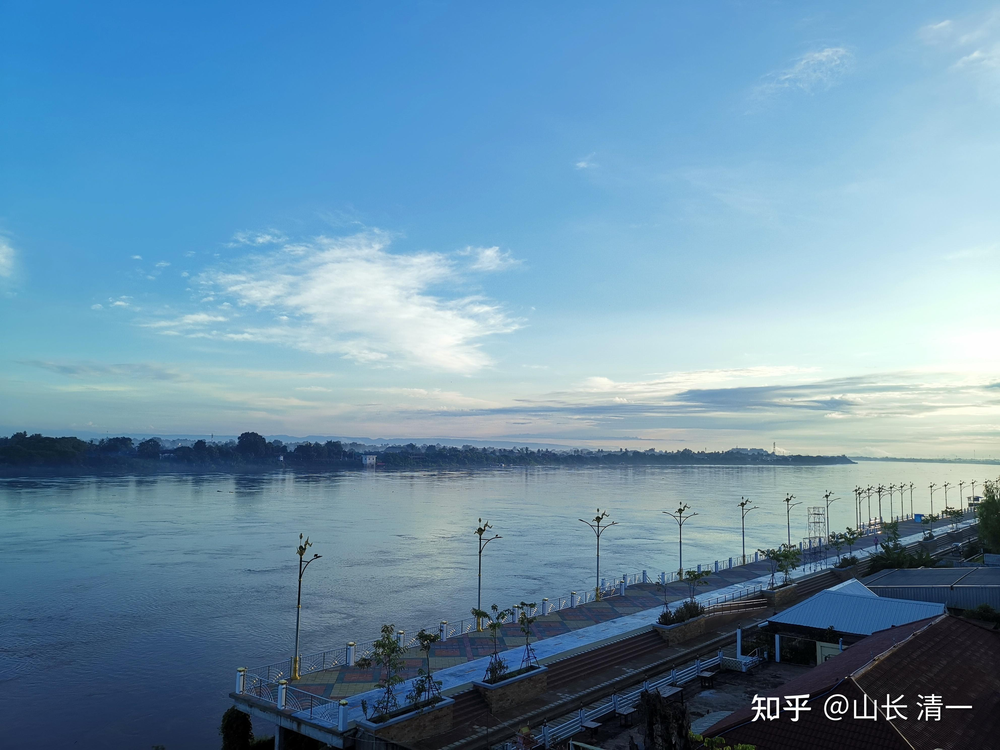
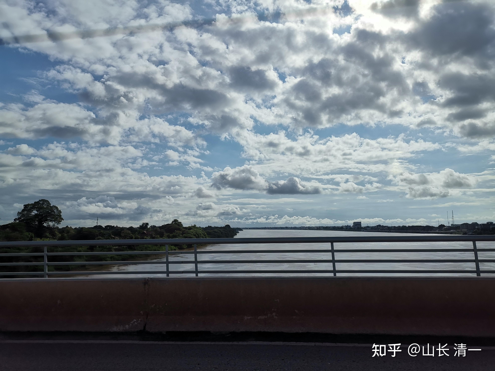
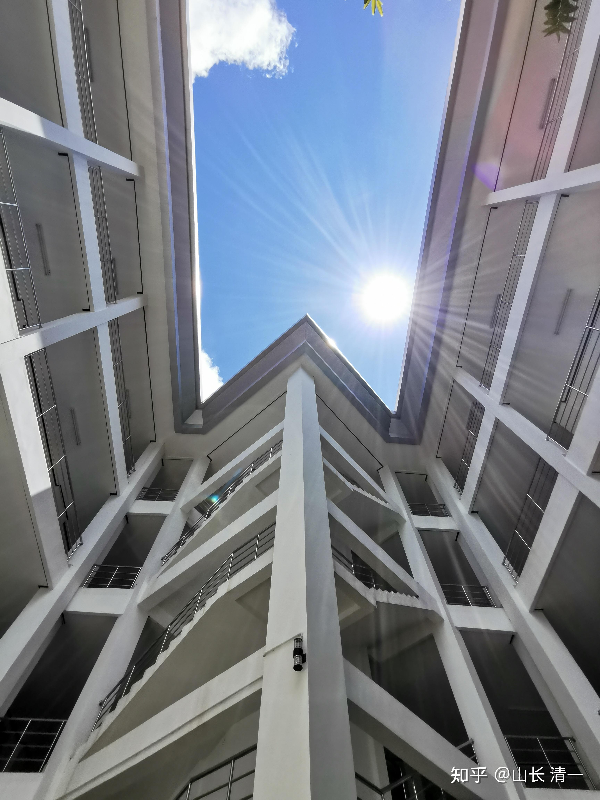
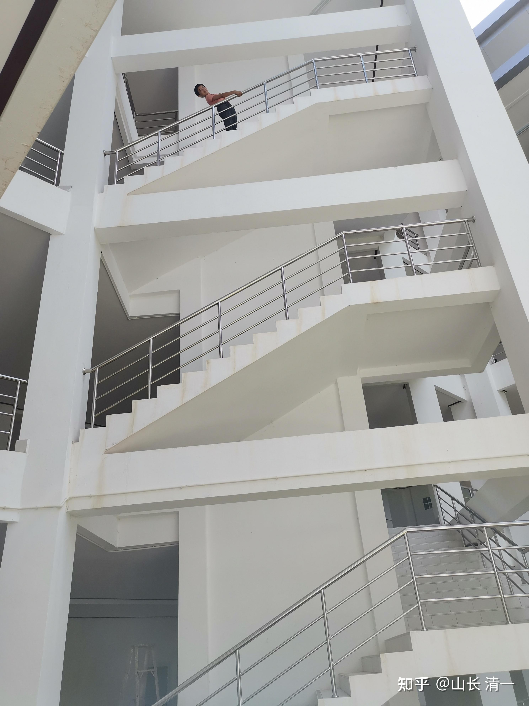
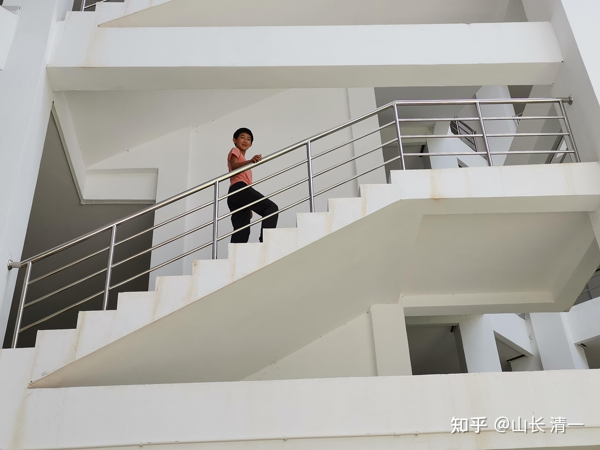
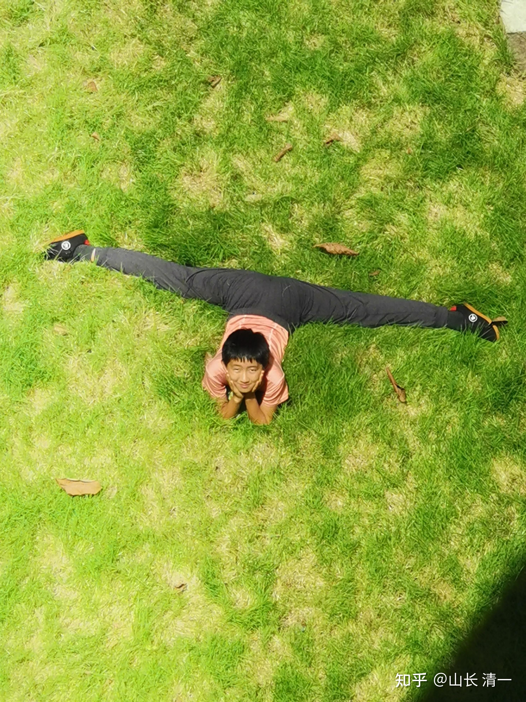
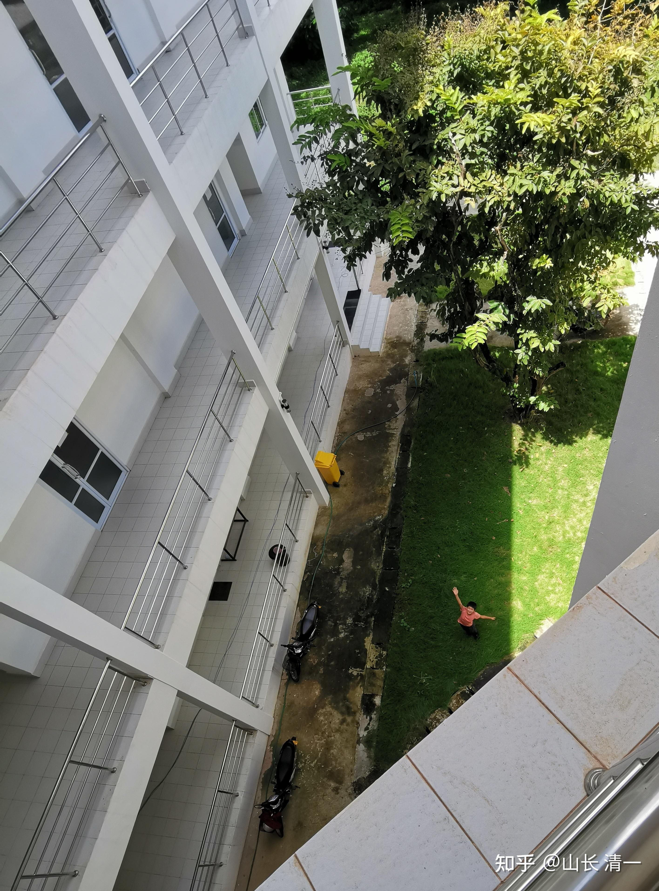
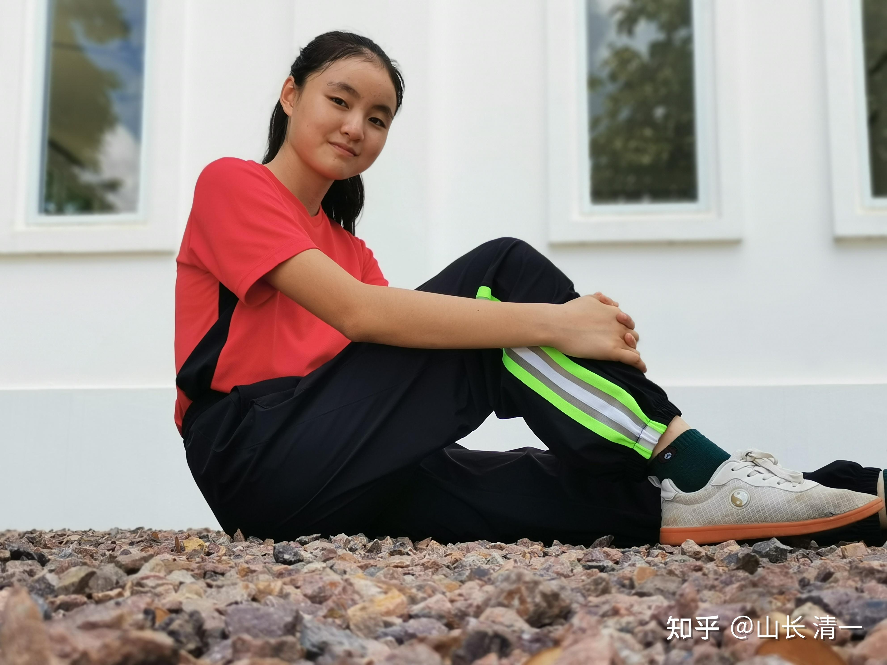
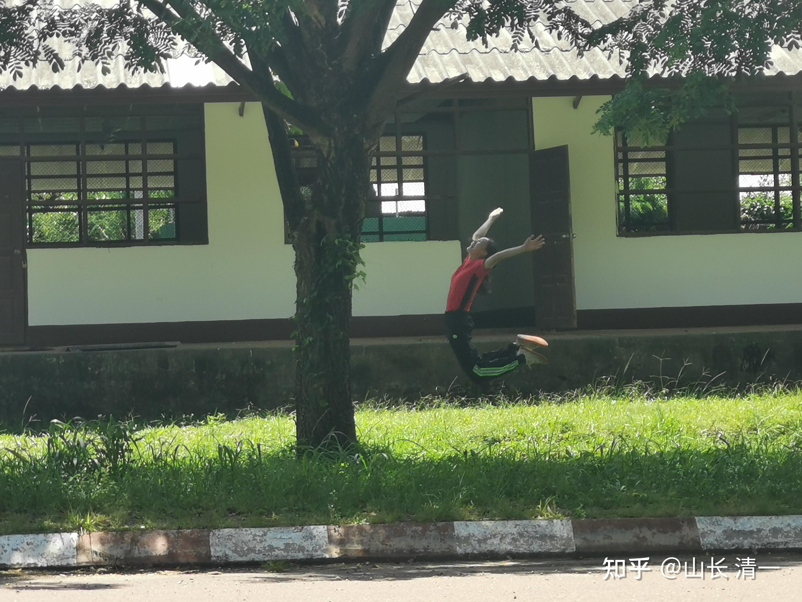
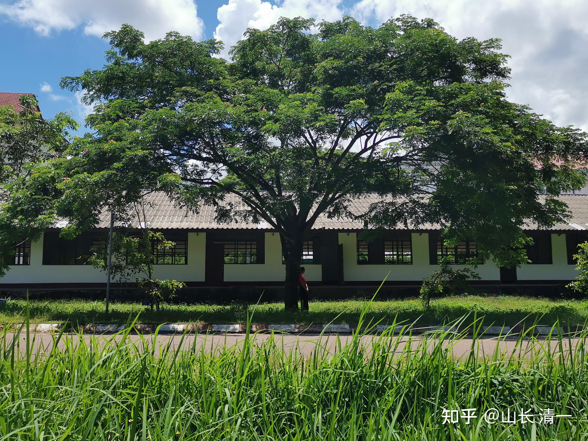

中国，每年大约有上亿人，正在为“考大学”的目标而努力。K12体系的每一届学生，都超过1000万，目标都是考大学。再加上这些学生的家庭，操心的父母等等，人数说一个亿都太少了。有人说，教育相关人员，大致上是三亿左右。

但这么多人要考大学，你们问过自己：为什么要上大学吗？如果你没问过，没有你自己的答案，你就是一个无脑的跟随者。你根本就不会为了自己的人生谋划未来。你的人生注定就只是一场拼运气的游戏而已。

我身边三个孩子，两个是不读体制大学的。他们就只上【清一大学】。因为他们没有发现去读体制内中外大学，对他们有啥实在的意义。甚至连花一点点功夫，去混个合法的大学文凭，她们都不愿意，认为完全是浪费时间。所以，小明慧的哥哥姐姐，是没有大学文凭的：但她们是三语高中这一批批想要上名校学生们的带班教师。

但小明慧的任务不一样。她不能逃避去上大学的家庭义务，她必须去补上哥哥姐姐没有上的大学任务。因为她将来，要承担比带班教师更多的家庭和社会责任。

你以为上大学是学知识的。=，这种就是太没有见识了。在很多情况下，上大学并不能给你带来多少有用的知识储备。我就没觉得，我上的大学课程，到底给了我什么有价值的东西。但上大学的过程，的确给了我很有价值的东西：让我见识到一群来自全国的优秀朋友，他们在想什么？作什么？也让自己习惯与别的考不上大学的人不一样。同时，因为我拥有的985大学毕业身份，社会给了我更多的机会，我也因此有更大的自信。

**事实上，在世界范围内：为什么要上大学，是一个非常简单的道理：**

我们这个社会，是分阶层的。我们用各种东西，来进行阶级划分。**而你所上的大学，就是你在18岁的时候。社会对你的一次非常重要的“阶级划分”，并打上一个“终身有效”的标记。**如果你上的是这个国家第一流的大学，大致上，社会将认为你就是第一流的人才，应该拥有第一流的机会去发展。将来你的社会地位，会跟这个身份基本匹配。你获得的机会，也与你的身份地位基本匹配。虽然未必一一对应，但大致不差的。综合起来看，985大学的校友们，社会地位，经济水平等，肯定平均值是高于211校友的。更别说蓝翔技校了。

如果你上的是不入流的大学，大致上，别人对你的划分，也与此差不多。比如：如果你是一家很牛的企业，一个清北的学生和一个曲靖师专毕业的学生来应聘，你们都学同样的专业，也许你们学的水平都一样，比如你们都是西语专业的毕业生，你们都拿到了B2水平资格证书。但：恐怕师专生，连让好公司的HR看完你的简历兴趣都没有。你的求职信，会直接丢进纸篓里面。你的努力根本就被人无视。你认为这样是不公平的吗？是的，社会就是这样的简单粗暴。你就别指望别人会认真的研究你的优点，并把你的全部优点都打分。还把清北生的缺点都找出来跟你对比。除了你父母，世界上都不会这样评价你的。他们会非常简单粗暴的看你的过往优秀度，而不是现实努力程度，但社会总会非常有效地把你的身份等级给挑选出来，给你不同的待遇和不同的机会。

**所以：为什么要上大学？因为这是一道门槛----你如何向社会来证明你的人生的档次和级别。**

当然----社会还有别的档次区别的手段，比如金钱。如果你是拥有亿万资产，你不上大学，也可以一样的牛气！

**只是对于年轻人来说，大学，依然是绕不过的门槛。在你还没有赚到大钱之前，向你求婚示爱的对象，亮出你毕业的大学，是一个绝对不可忽视的要素。就算你是富二代，你证明自己的机会，依然是一张名校资历和优质校友。不然你只剩下爹妈给你的金钱，自身就“一无所有”，注定被社会和大众鄙视。其实富二代们对于名校的追求比一般人更强。身份感更重要。**

所以，我对小女说：你要么不上大学，不去让社会审查你，你发展你自己的能力，用真本事去适应社会，因此你要认真地去学习一些真正有用的知识，而不是学大纲和弱智的教材。你要去掌握一些所有的大学都不会教你的重要人生技能和思考。最终，像你的哥哥姐姐一样，拥有在社会上生存的智慧，你就不需要去上浪费时间的大学。

如果你不想这么费劲学真本事，你就要去上公认是最牛的大学。因为你要证明自己是同龄人中最牛的人，你就不能去上一个烂大学，不能让一个“学渣，没水平”的标签，来贴你一辈子。当然，最好的方式，是去大学也不浪费时间，真本事和真文凭一起都拿到手。这就要你在上大学之前， 知道自己到底要什么！而且必须是一个精进的人。

啥是最牛的大学？咋成为最牛的人？

这个根据你的职业选择和爱好来进行评分，并没有固定的标准。中国的”最牛大学标准“，对于去国外发展，就不太好使了。假如小女想要生活，工作在泰国，在泰国事业有所发展，想要融入泰国的上流社会和文化，显然：她拿一个985大学的文凭，你就算是真学霸，学业优秀，恐怕也不如她上过泰国排名前三的大学管用。尽管这些泰国大学，世界大学排名还远远不如中国的985。但泰国的社会，对这几所大学的认同程度，是远远高于中国的大学。你的实力啥的，别人就是不会多考虑的。他有自己的思维范式。

因此，小女的教育规划里面，为了在东南亚，在泰国获得良好的发展机会，有一所大学是“非上不可”的。这就是泰国排名第一的老牌大学：朱拉隆功大学。这所大学，相当于泰国的清华北大。对于泰国人来说，上过这所大学的人，比清华北大毕业的学生，更值得“仰望”。一旦你报出你考入了这所大学，同龄人，都会悄悄地为你打一个高分，会很不自在地悄悄承认：你18岁超越了他们的档次。而小女如果18岁进入朱拉，将来在泰国，就会拥有一大批从朱拉隆功毕业的优质校友，即使你上大学的时候不认识这些人，但你们都被同一所大学绑在一起，成为“校友”。而泰国的社会上，注定这所大学的人，都将更多地掌控泰国最有价值的社会资源。而且：你身边考不上朱拉的泰国人，都会对你毕业的大学表示敬意----承认你比他们更高一级（当然，其他条件相同情况下）。这就为她将来在东南亚的生活和事业，打开了一个很好的机会之窗。因此，小女至少要读这一所大学。甚至对我们家族来说，是最重要的大学。

这就是你上的大学，能够给你的东西，而且终身有效。如果你正好是这所大学当年的风云人物，名誉学生，你将来的地位就更高了，发展机会就更多了。因此：首届的公主班学生们，均选择了朱拉隆功作为自己人生发展“最重要的大学”，是她们开发未来职业发展的需要。拥有与母语水平差不多的泰语外语能力，也是这群小丫头们最重要的职业发展技能。就像现在我很依赖小女的翻译一样。她的英语法语拉丁语学得再好，都不如“不入流”的泰语，对我们现实生活更有价值。何必为了装样子，用西方灌输的价值观，去所谓的欧美高端大学，学一大堆根本就对自己的职场和社会生存都无用的东西呢？真是跟自己过不去。

**小女要上的第二所大学，是【老挝国立大学】**。这是老挝的北大。去上学的理由完全一样：如果东南亚各国，老挝，泰国，都是小女和我们家族将来要发展的国家，当然她将来，就必须要去上这些国家的顶尖大学了。甚至你要在东南亚地区发展 ，要在我国一带一路的海外企业找到一份优越的工作，我相信你在这些东南亚大学毕业的文凭，也比国内的985文凭要有用得多，虽然当初考985比你考泰国大学更难。不信，你去应聘的时候，就知道我说的结果了！你只有985文凭，你将来面对的竞争对手太多，多到你数不清。

不过：我认为---无论朱拉，还是老挝国立大学，去上学的目的，除了“交朋友，亮身份”的价值外，实在没有啥专业知识和内容值得认真学习（据说两校的医学专业都很权威，但对我实在无用，小女不需要去当两国的西医谋生）。这些大学的理工科，据说也会教一些有用的知识，可以更容易去所谓的科技公司工作。但小女没有兴趣去拿一张科技公司的打工证。她去这两所大学当学生，本质上，都只是混圈子，获取人脉，并不是去读书学习啥名牌大学才能学的知识的。但混圈子也要有水平----小女也必须认认真真的，以“超级学霸”的身份来混日子，才能达到混圈子的目的。我要小女将来上四个大学，每个大学都只用一年的时间，就去学完这所大学四年的专业课程，并要求达到“最优秀学生”的水平，创造一个新教育奇迹记录来。所以，她才不会选择大学里面最有挑战性的专业，如医学，法律，或者建筑工程等，去读死书的。她会选择去朱拉读一个所谓的通识教育，文化课程和专业，比如“泰语，泰国文化专业”。由于她现在的泰语水平，就已经超过了顶尖的大学泰语专业的所有外国学生，不信你拿中国任何外国语大学的学生，来跟小女拼泰语水平？不输才怪！

依据同样的逻辑，她会去老挝国立大学，读一个专门给外国人开设的“老挝语，老挝文化”专业，我相信：带班的老师，会对这个奇特的“多语种优秀学生”，学霸人才，留下极为深刻的印象。当然，她也会去交朋友，获得一大批的优质朋友和未来的伙伴。如果她在校期间，还能够代表学校，去参加一些国际比赛，比如：世界或者东盟大学生格斗比赛，小女为她们的大学，拿到金牌回来，我相信她更容易成为该大学的“明星学生”。“荣誉学生”，被校长专门接见的优等生。说不定小女还有可能去参加奥运会，拿个拳击项目的金牌回来，为国争光呢。也许，就像谷爱凌在她的母校一样有名而且受欢迎，刚进校就注定成为“杰出校友”。

小女上这两所大学，是事业发展需要。但也可以上一些装面子需要的“面子工程大学”。甚至必须大把花一些钱，明知无价值，还是要撒钱读的大学，比如美国的综合大学。

所以，小女还要上的另外两所大学，就是作为一种“身份地位的需要”去选购的。实用不实用，就不太管了，拿出来足够让人佩服，知道你的档次，就行了。备选项目。

因为小女是中国人。所以，为了获得中国人的正常认同，她需要上一个中国的985大学。比如去上这些985综合大学的教育学专业学习，以符合小女将来要当一个优秀教师的理想追求。虽然----大学里面的教育学专业显然是鬼扯淡。只会培养一群嘴巴上论兵的书呆子。

另外：小女还是“国际人”，由于中国大学在世界上的地位很差。为了在全世界都拥有“高等学历资格认证”，小女还要上一个**世界大学CS排名前10名的大学，最差也不能低于前20名**。毕竟---耶鲁大学都落到了19名的位置，小女能上耶鲁的话，也不能算丢人。因此，小女的英语水平，也必须是第一流的。格斗实战水平，也必须是第一流的，这显然会为她进入这些超一流大学，赢得非常重要的加分。

综合起来，小女的教育计划，是要她在18岁这一年， 开始“上大学，刷身份游戏”。然后在22岁这一年，上完以上的四所大学，读完四个国家不同的大学专业。请注意：她不需要拿到所有四所大学的毕业证。我说过了：上大学的目的，就是“刷身份”的。不需要傻乎乎的“读完四年的大学专业”，更不需要读到博士毕业，才能证明自己的校友身份，这实在是在太浪费生命了。去认真读一年就够对得起校友身份了。假如某人读了一年的清华，就自动退学了，谁能说他不是清北校友?比如高晓松？早早看清大学的实质就是身份认定。考上了，读了一两年，就该走了。不要继续在大学里面以学习为名瞎浪费生命，即使是清华，也没有啥学习的价值。考上清华，拥有校友身份，才是正经的事情。后来，高晓松成名之后，清华会否认他的校友身份吗？还巴不得送一个名誉学位给他呢。这就是我认为“大学游戏”的本质----你的社会档次资格证。你拿到了，认真的混了一年， 就可以丢掉了---退学去读另外一个国家的顶尖大学，再拿一个该国家的身份。

不过:我相信至少会有两所大学，会给她毕业证的。因为她在所学的专业，比所有的班级学生都优秀，没有理由不给。而且：她去上世界排名前20名的大学，没理由不让她“保留学籍”，只是“参加考试”，拿到注定优秀的成绩就行了。不是有【国际大学互认学分】系统吗？只是很少人使用这种系统。

当然，小女最重要的教育内容，真正的教育，会在一所【未来的世界名校】完成的。这才是她在未来职场和社交圈里面，最重要的“执业资本，知识基础资本，以及身份资本”。小女是今日体系内，目前唯一从3岁多，就开始上【清一系大学】的学生。她一路从清一幼儿部，清一小学部，中学部，大学部，研究生部，博士毕业，要学完清一系所有级别的超级学生。目前，只有一个学生，才勉强跟上了明慧的前期教育节奏。就是木兰明晓。她是小女三岁半时候就在一起读书的明珠班小同学。当年的明晓，年龄是6岁，现在是17岁。小女今年才刚满14岁。她们两人，已经做了11年的同学了。至于小公主艾拉，是“很晚”才来学堂的。她相当于明慧的“初中同学”，不过未来两人会一起做“大学同学，研究生同学”的。

昨天，我就带两个孩子，去提前看看她们将来要上的大学---老挝国立大学。今年年底，等木兰们去仑披尼打比赛的时候，我也会跟著一起去看看赛事的。顺便带两个小公主去看看泰国的朱拉隆功大学。现在要给她们“目标具象化”了，让她们知道自己正在走在什么样的道路上。将来玩一样的，去读四个国家的四所大学并成为学霸和优质校友。

*印象派风格的江景摄影*

昨天一早，小公主艾拉拍的江景。地点泰国廊开，酒店的阳台上拍的角度。对面是老挝万象。

*泰老友谊大桥过境时的照片*

*老挝国立大学的新大楼*

*像在大楼上趴着的小螳螂---小明慧*

*假装自己是个大学生去教室上课*

*小明慧在老挝国立大学的草地上装酷*

*小明慧在老挝国立大学的夹缝中顽强生存*

*小公主艾拉可能在想：我能做国大的校花不？*

*这难道就是传说中的“放飞自我”？*

*上大学后：爱，还是不爱，这真是一个令人很烦恼的问题！*