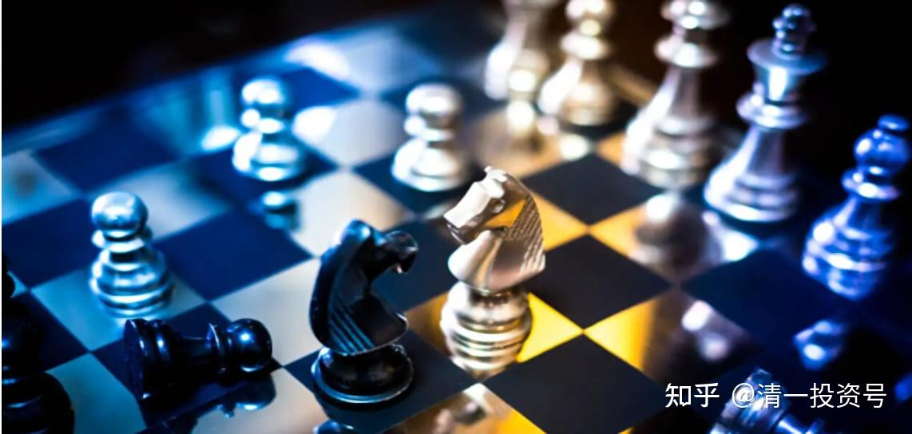

68篇.清一山长与明达野老，关于未来大战略的讨论

清一山长2018年1月25日～26日

明达野老[2018-01-26 10:48](http://link.zhihu.com/?target=https%3A//xueqiu.com/2029742712/100247784)

第二次“下海的财富机会”在哪里?

[https://xueqiu.com/2029742712/100247784](http://link.zhihu.com/?target=https%3A//xueqiu.com/2029742712/100247784)

[清一山长](http://link.zhihu.com/?target=http%3A//xueqiu.com/n/%25E6%25B8%2585%25E4%25B8%2580%25E5%25B1%25B1%25E9%2595%25BF)2018-01-25 22:51评论上帖：

很有些惊讶：您文章中正在思考的【未来大战略】，正好是这一次，我在清迈给学员讲的【未来金融和经济发展战略】的路线图。明达君画得很细致了。

**国家必将从【房地产资金池】转向到【金融资金池】。不仅仅有吸金回笼货币的意思，更重要的是：一旦成型，可以割全世界的韭菜，让全世界来养活老年化的中国。为了实现这一伟大目标，她现在要做的，就是让现在这些符合国家战略标的的投资者赚钱，而且赚大钱，让这些先期进入者成为“金融赚钱的示范”，就像是十几年前买房的人成为示范一样——什么时候买都是对的，什么时候卖都是错的。还会让国家标的的业绩节节高，来配合这个牛市。最终让全国人民蜂拥入市，认为股市就是一个提款机。就像现在的房市一样，形成全民投资热潮。现在全国中小学都要普及金融课程了，目的何在？培养未来的“投资者”。**所以，我才会【**国家担保标的**】的出现。

**唯一与明达君不同的想法，就是我认为国家不会“比我们更急于发动一场牛市”，我认为他很有耐心，更喜欢慢慢的布局，慢慢地涨，所以这一次银行大涨，20天涨了20%，太快了。其实让我很不安，这种走势不对的。但又不敢走掉，只好换换股，切入涨不多的算了。今天调整了，我反而放心了。真要走成快牛，违背国家意志，会出事的。**

[@明达野老](http://link.zhihu.com/?target=http%3A//xueqiu.com/n/%25E6%2598%258E%25E8%25BE%25BE%25E9%2587%258E%25E8%2580%2581)回复[清一山长](http://link.zhihu.com/?target=http%3A//xueqiu.com/n/%25E6%25B8%2585%25E4%25B8%2580%25E5%25B1%25B1%25E9%2595%25BF):

非常认同山长的观点。

**居然和山长想到一块去了，山长讲课时分析得比明达应更清晰、细致和全面。另外，金融居然都入了义务教育课程范畴了？这个我还未留意到。国家搞概念植入确实厉害，比美国人强！**

本文仓促成稿，可能部分有些词不达意，思考、行文布局都还差火候，抽时间我得再整理整理。山长见笑了[害羞]。

对于这场牛市，我的观点和山长很像，也认为国家也是慢牛，和房地产一样，只有这样才能够营造出一种根深蒂固的习惯(不会跌，买了就会赚)，就像这十年来的房产市场。而那句话更应当这样表达“国家应该比我更想快点发动一场牛市，我可以更慢的赚的”可能更达意些。因此，前一个月不到时间，我同山长有一样的担心，担心银行这样涨法，可别复制14年的走势，这样可是不符合国家大计的。得涨一涨、跌一跌、慢慢上。

**这场战略背后，我认为国家应该是在应对人口红利的问题，也就是让少数精英来养活全国多数人口，而这就仅有金融业能做到，就好像美国7成GDP来源于金融业一样，国家想走的应是这条路。所以，我记得，2015年的股灾恰好就发生在陆续有企业从国外回来上市，我估计美国人当时看到应该很着急。所以，这个战略背后除了管理好自家的资产和老百姓，还要面对一个外来强者，那就是美国，中美之间的第一次较量就是以中方失败告终，不过，幸好中国仍是青壮年，一次不行还有第二次，每次比前面准备更充足些，我相信最终还是有很大可能性获胜的。我的投资也已经让我给中国投了一票了。**

[清一山长](http://link.zhihu.com/?target=http%3A//xueqiu.com/n/%25E6%25B8%2585%25E4%25B8%2580%25E5%25B1%25B1%25E9%2595%25BF)2018-01-26 08:51回复[@明达野老](http://link.zhihu.com/?target=http%3A//xueqiu.com/n/%25E6%2598%258E%25E8%25BE%25BE%25E9%2587%258E%25E8%2580%2581):

我这次清迈讲课提到的国家战略中，就提到：**中国目前的这个战略，是要抢美国人的世界钱袋子。不抢过来，中国经济的原有模式不再能够继续，可能会造成不稳定局面。所以中国政府一定要去抢。但抢过来了，美国会衰落。所以美国人肯定不干。两国未来会发生很大的冲突，甚至有可能有局部战争威胁。所以中国现在拼命提升战力,打造各种先进武器（五代机、航母编队、导弹等），目的是防止美国用军事来摆平经济。**

未来，如果美国赢了，中国人对美国会很有敌意。如果美国输了，华人会成为美国人的出气对象。无论输赢，未来在美国的中国人，估计日子会很不好过。就算没有敌意，美国钱未来不值钱的概率很大。现在拼命移民美国的中国人，太没眼光了。

**中国要单挑美国，几乎是没可能赢的。所以中国正在联合全世界的其他国家，团结一起搞经济，来对付美国。这些国家原来都吃过美国人的亏，谁都无法抗衡美国金融霸权、美元霸权。欧洲弄出个欧元想要避免美元的掠夺，也被美国打残了。中国现在拉一大堆小兄弟，也打算给其他国家分享金融权利。比如给英国送秋波，说准备搞“沪伦通”等等，就是暗示“将来有钱大家一起挣”。如果美国的铁杆盟友被拉过来了，中国的胜算就更大了。**

**所以，我算来算去，觉得：中国赢的概率更大！美国很难赢。主要是得道多助。美国原来华尔街对外薅羊毛太狠了点。中国原来都是给世界打工，虽然土一点，但没抢人。以后要抢也联合大家一起抢。主要是从美国手中抢肉吃，各国没理由不支持中国的。**

俺对中国未来大国策的行动支持计划，就是要分别在国内和国外，都办一所【**小语种三语学校**】，培养一批中外的熟练三语人才出来（汉语、英语，加上一门小语种】，还要帮助其他国家的学生成为三语人才，互相配合沟通人才，成为中国的未来盟友。我们的语言教育水平完胜北外。所以，**这批人（中外结合人才），绝对是未来20年，国家最需要的人才。因为未来十年，我和我的朋友们，肯定会享用到国家发动的大牛市带来的良好的资本利益，所以一定要做点好事情，“回报社会”才心安[大笑]。**

