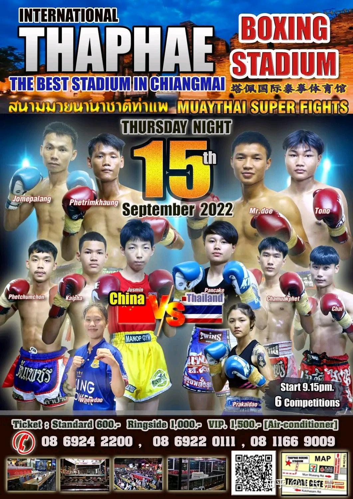
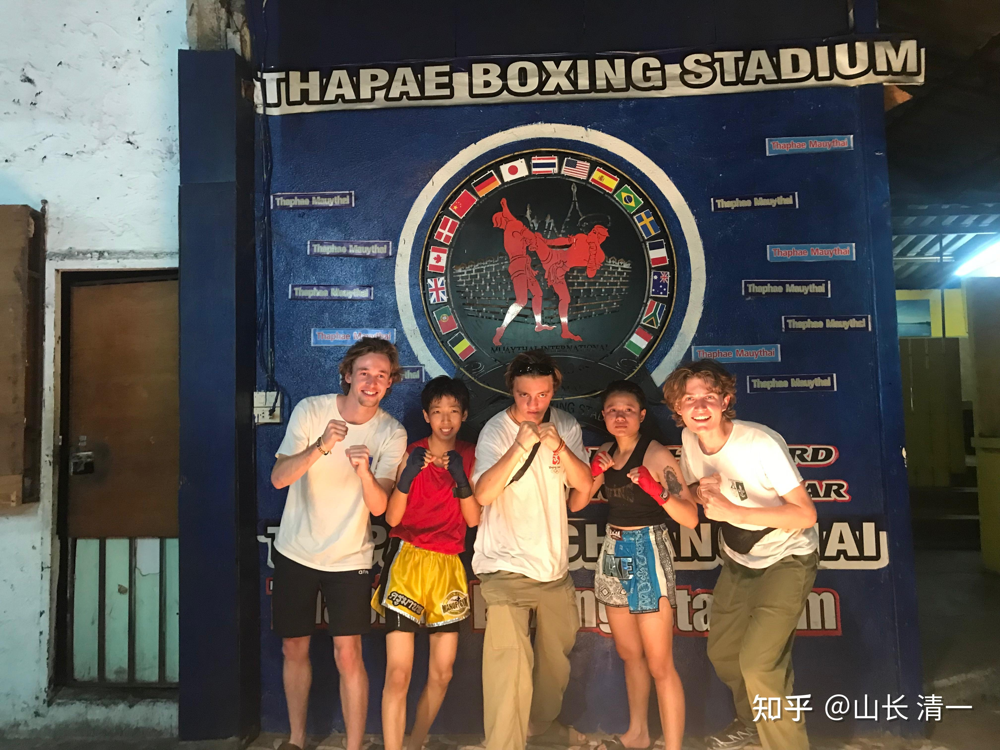
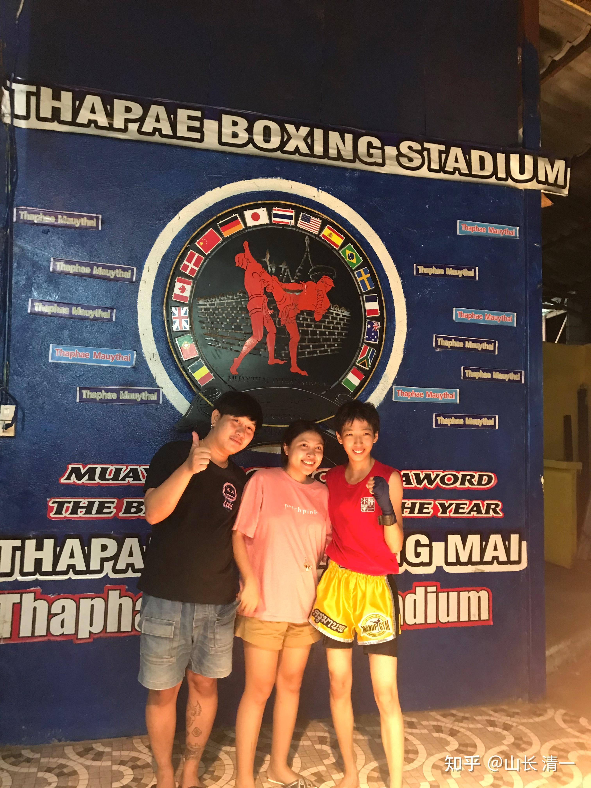
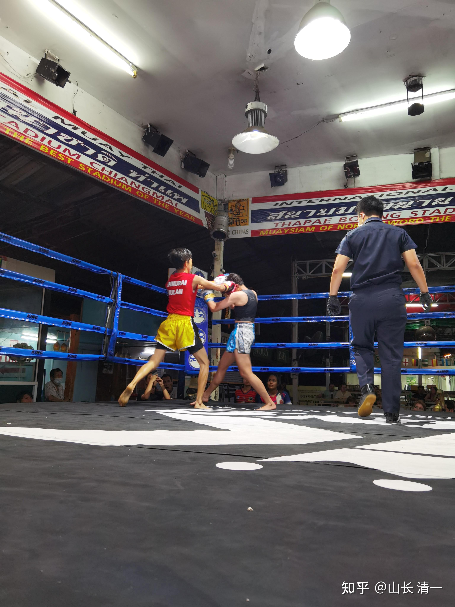

*太极征泰第19战海报*

昨晚的比赛，是明晓与泰国国家青年队冠军帕开的二番战。帕开明显做了准备，扫腿攻击比较频繁，可惜对于太极实战拳手来说，泰国的扫腿攻击，几乎不起作用。而帕开在内围战中的缺点，依然非常的明显。所以最终在内围战中被明晓肘击而KO。也算创造了太极征泰的新纪录。到现在为止，已经用腿击，拳击，膝击，肘击等手段KO了泰拳手，证明了太极实战。不是只有”迎门三脚“这一招，我们的武库系统是极其全面的。

本战视频已经传到了视频列表中。大家可以自己去看。

*木兰们开始赢得外国粉丝*

*泰国粉丝找木兰合影*

由于佳慧正在准备23日与金腰带的二番战，远在530公里以外的另外一个城市。已经跟主办方说了最近10天不安排比赛。不过：昨天主办方依然安排了她的比赛， 明天就要举行。还说了很多理由，希望她支持拳场的安排。我要孩子们不要太在意备战的事情。去赛场上比赛也是一种备战的方式。应对技术依然是一样的，不需要为二番战准备更多的技术，现有技术到时候用好就行了。

以下是对两个木兰的场下指导：

明天的比赛，估计裁判黑佳慧的可能性不大。佳慧到了场上。不以尽快打倒对手为目的，而是尽量打出我们的技术手段，秀技术和实力，这样来赢比赛，才更好看。学习播求，善猜的打法，看出新一代大师的大气，冷静，沉着。发挥精准，有效，清晰的打法，而不是打成一团乱麻的比赛，乱中取胜。你们参加的不是战争，只是一场体育竞赛，你们站上去的，只是一个娱乐场。你们要打出自己的精神风貌来，不仅仅是赢比赛，而要赢得精彩漂亮才好。让人有良好的观赏性。当然，这样的比赛要求就更高了，要求你们有更加良好的技术控制力。所谓的“打人容易控人难”。你们要练习挑战自己的极限，打出自己更大的光荣和精彩。如果只是疯狂的输出武力，就算赢了也不好看。外行看了热闹，内行看了摇头。很难赢得泰国武术界的尊重。因此他们往往只用“你们力气太大”来表达。不说疯狂乱打，已经很客气了。而佳慧被泰国主办方称为“技术性拳手“，已经开始接受她的技术含量了。当然昨天的打赢了总是好事。——总比原来明晓上场后装思想家思考要好。明晓需要找到自己的平衡点，多修心态。这样子打架，就是心浮气躁，遇到高手就不行了。其实这一次帕开的场上表现，比明晓的要沉着冷静，抓紧时间的回击也蛮有效的，至少裁判评分占了上风。我们必须要打出清晰有效的打击才能赢得观众（就像上次佳慧打出来的攻击，就是清晰有效）。明晓这次，属于“乱中取胜”。希望打出自己有控制的节奏来。

佳慧回复：谢谢山长的指导，明天我尽量控制好节奏，不以KO为目的，就看她能撑多久就打多久。依然以不被抱住为目标，不进入内围纠缠，争取在外围打出清晰有效的攻击来。