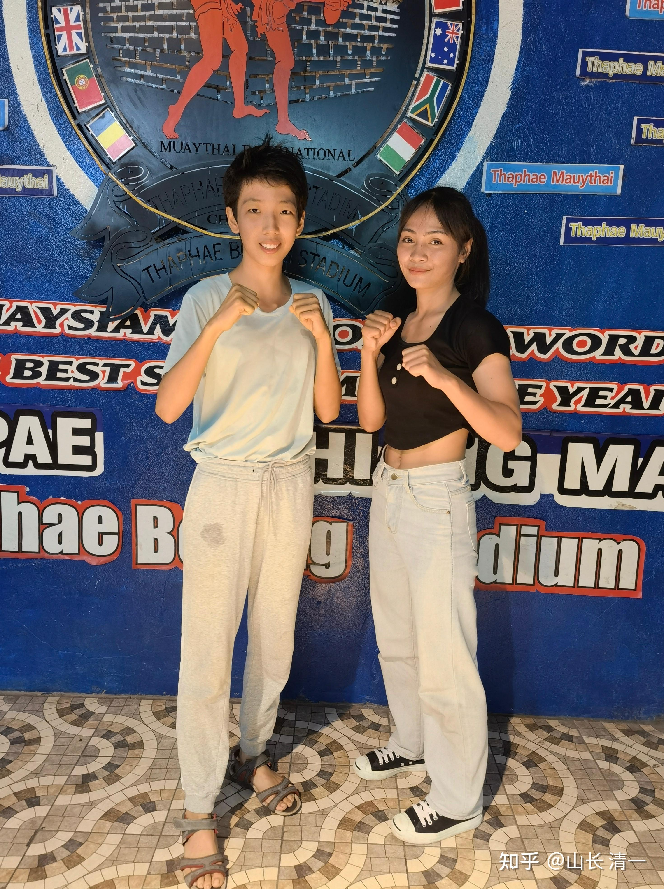
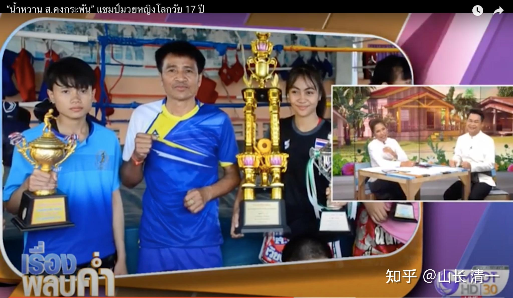
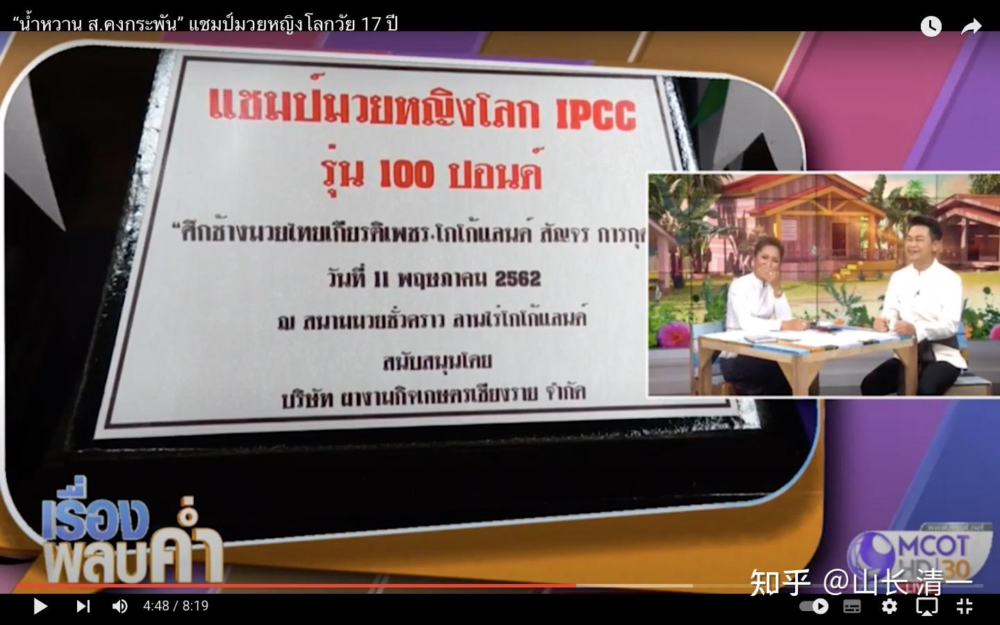

佳慧最近连续KO了一众的泰国拳手，我以为把泰国人都吓怕了。没想到：原来第二战中“击败”了佳慧的金腰带拳手，居然主动前来约战。并约定在本月的23日在距离530公里外的碧差汶府开战，还是一个当地特别的盛大节日庆典，与佳慧举行二番战。而且，佳慧的泰国老师担心有诈，还找到拳赛举办人，问主办方具体情况：告诉老拳师，她们发给佳慧的出场费，比在清迈打比赛还多三倍（由于佳慧从来不关心出场费有多少，只关心拳手的级别多高，一点都不职业，弄得老拳师只好多关心帮忙佳慧，让佳慧不吃亏）。佳慧一方面，很喜悦得到了难得的“复仇”机会，同时也疑心重重：泰国人有啥不对劲？上次拳手，明明是靠裁判赢了比赛。这次来主动开打二番战，不是摆明了要被佳慧KO的吗？泰国人难道真的以为：多练了几个月，就能在实力上击败她吗？还在节日庆典上公开地比赛？万一被木兰现场KO不是很没面子吗？真不拿自己的头衔名誉当回事呀？所以----我就小心翼翼的决定：让新到泰国的清一武道馆的男拳手，还有泰国的工人，加上木兰姐妹，五个人配置的一车亲友团、提前出发去碧差汶，进行备战。不考虑开销超过比赛出场费的问题。安全第一！

没想过，前两天，又有新的赛事消息来了----泰拳女子50公斤级世界冠军，也找上了佳慧，要跟她打一场比赛。

对手名字是NAMWAN(แนนซี่ เกียรติผู้ใหญ่อำ)，约战的时间是10月8日。地点在清莱府，也是一个节庆日的比赛。佳慧作为特邀的外国拳手参赛。我发现：泰拳界，真的是喜欢强者。你把他们派出的优秀拳手全给KO了，泰国人没有不高兴，反而提高了出场费，而且一个一个的顶尖拳手，还自动冒出来跟你决战。我原以为:这个级别的泰拳高手。轻易不出战的。我可能还需要给多一点奖金才肯出战。没想到泰拳赛事方反向给我们更高的出场费去跟泰国的顶尖拳手打。我真的意外---而且很开心！起码省心省事！

这个挑战拳手的中文名字意思是“甜水”。木兰们现在都直接就叫她甜水了。的确她的个性很好，特别有礼貌，甜甜的样子，长相也很端正。不过---我看了她的比赛。这人不简单。她不久前，19岁与一个多次代表泰国国家队出战世界各国，拿回了许多奖杯的国家队大姐，打很凶猛的“露指拳套”泰拳比赛，她居然把比自己更高，年龄更大的老将NANCY，打得无法招架，满脸是血。而且场上我看出：她比Nancy更沉着，更冷静，出手快速，果断，是一个真正的格斗高手，远比木兰们原来打过的拳手厉害。帕开跟她相比，就太温和了。

虽然NAMWAN在泰拳女拳界的地位很高，但她居然一点都不高傲。还非常重视研究佳慧。她知道昨天佳慧有比赛。居然专程和她所在拳馆的馆长一起，早上9点钟就从清莱出发，赶来清迈。其中一个主要的目的，就是看佳慧的现场比赛，现场了解对手的情况（其实要找木兰的比赛视频很容易的）。佳慧是昨晚的最后一场比赛。她们看完比赛之后，晚上12点都已经过了，居然一起直接开车回清莱去了，一天来回快500公里呢，真是不嫌累。我的拳手去清莱，起码要住一天的。

*明晓认出了来观战的世界冠军NANWAN，两人合影留念。*

只看上面的照片：你认为上面的泰国女孩子，会很厉害吗？很多拳手都会在赛场外做出一副飞扬跋扈的凶狠样子。但泰国我们发现：越是厉害的女拳手，看起来却像小猫一样温和。但一上场，却凶狠莫名。你们看她下面的实战视频，就知道她出手有多狠了！

下面是木兰们找到的网上对手资料。

*NANWAN获得的冠军杯字样*

上图右侧，馆长左手边的这位拳手，就是佳慧10月8日将要面对的对手“南湾”。笑的很可爱的这位。她手上的两个奖杯，一个是兰纳地区（泰北地区）的泰拳冠军奖杯，另外一个是IPCC的泰拳年度世界冠军奖杯。

左边的这位表情很老实的拳手，就是大家已经熟悉的帕卡，已经跟明晓打过两次，都被KO的前泰国国家队成员。她手上只有一座奖杯。这座奖杯是业余泰拳（就是身上带护具的泰拳比赛，本质一样）的世界冠军奖杯。

这两个拳手是同门师姐妹，她两人都是清莱人，在同一家拳馆受训，年龄一样大。这是一家泰国全国都很有名气的拳馆。所以，我猜会不会是由于帕卡小师妹，连续两场都被木兰KO，拳馆或者师父不服气。要让拳馆中功夫更高的师姐，世界冠军NAMWAN，仑披尼拳场的核心拳手，资深拳手，出来教训一下中国的小木兰。虽然泰国很资深的拳手，居然愿意出来跟佳慧这种刚出道才几个月的新拳手过招，有点太给面子了。按道理木兰佳慧，现在打拳的资历，还没资格来挑战她这个级别的泰国顶尖拳手。高手愿意出面来跟佳慧比武，当然佳慧就非常高兴的直接答应了。她很早就熟悉这个拳手的名字，她在油管上的比赛视频很多。原来以为要去仑披尼赛场，才能有机会跟她交手。现在就有机会，何乐而不为呢？

我让小公主艾拉，翻译了一个其中的一个比赛视频，就是她与大她好几岁的师姐在8号电台比赛的视频。大家可以看到她在场上的凶悍程度，远远超过帕卡。把对手打得满脸血流。其他还有不少KO对手的视频。毕竟----17就就拿世界冠军。现在19岁多，正是她最有实力和经验的年龄，而且我相信：由于木兰两次KO了帕卡，肯定她要志在复仇，绝对以KO佳慧为目标的。

我相信佳慧10月8日会有一场苦战了。她在9月23日举行的“二番战对手”，还只是泰拳的地区冠军。相比这位清莱的全国泰拳女子冠军，肯定还是要差一些的。我能看出比赛中，NAMWAN的水平，判断，格斗心理状态，都远远超过其他我知道的泰国女拳手。

[https://www.zhihu.com/zvideo/1554942457670049792](https://www.zhihu.com/zvideo/1554942457670049792)

为何NAMWAN不来清迈打，而是特别邀请佳慧去清莱打比赛？同样是居住在清莱的帕卡，已经来清迈跟木兰打了两次了。附近几个府的拳场，一直都是送拳手来清迈参加比赛的。泰国北方地区的泰拳比赛，都以清迈为中心。来清迈比赛一点都不奇怪。这一次特别要求佳慧去清莱比赛，我认为：很可能她们想借用主场的优势来对付木兰。由于前国家队成员，世界业余泰拳比赛冠军帕卡，两次远道从清莱赶到清迈来参加比赛，都输掉了，被KO。我相信可能这个泰国电视台上介绍全国有名的拳馆，有点没面子。为了维护自己的荣誉，会尽量把握赢的机会。比如会认为来清迈比赛不是好主意，风水不顺，更有利于木兰。所以她们特别找了泰国为木兰们安排比赛的泰国老拳师，要求安排木兰去清莱比赛。我们去她们的主场作战，相对更不利一些。我相信这位冠军会更加投入比赛的，绝对不会轻易言败，毕竟家乡人民都出来助战了。对我们来说，泰国是客场，清迈是客场，清莱不过是远离我们居住地的更远的客场。反正都是客场，我们也没啥好担心的。**赢了---我们白白抢走了世界冠军的风采。输了---输给泰拳世界冠军，木兰也不丢人。**所以：我们参赛，没有任何负担！相反，他们的主场负担也不小。

刘老师看了这位拳手的比赛。说：这拳手好凶呀！速度力量都很强，很担心木兰拼不过。艾拉翻译现场泰国人讲解的视频，我已经发到视频列表里面了。你们自己有兴趣自己去看。我想知道：你们认为10月8日，木兰佳慧远道去应战这位甜水，泰拳世界冠军，会输掉比赛吗？打满五回合，判我们点数赢的可能性不大。除非我们KO对手。别人的主场，不会轻易让人夺走泰国世界冠军的荣誉的，赖，也要赖赢的。所以：只能报KO对手，或者被对手KO的心态去比赛。你们认为：这一次佳慧的胜率有多少？