原雪球专栏[133篇.拥有私人小岛，真的就值得羡慕吗？](http://link.zhihu.com/?target=https%3A//xueqiu.com/9310099567/175721917)

清一山长2021年3月29日

雪球上，有人发文：[29万美金买一私人小岛](http://link.zhihu.com/?target=https%3A//xueqiu.com/6687544095/175647840)。住在房车里面。还有一栋20多平方的小房子。很多人很羡慕。如果去看看下面链接的私人小岛，更令人羡慕了。价值六千万的私人小岛豪宅：

[网页链接](http://link.zhihu.com/?target=https%3A//www.bilibili.com/video/av15916240/450%25E6%25B3%25B0%25E9%2593%25A2)哔哩哔哩网站《迪拜价值六千万美金的私人岛屿豪宅》

[https://www.bilibili.com/video/av15916240/](http://link.zhihu.com/?target=https%3A//www.bilibili.com/video/av15916240/)

可是，**干嘛非要买下来才算“自己”的？可以用，这一时，就是“自己”的。下一刻，给有缘的人就行了。我的房，我的车，甚至我们的人，都一样。都不是“我们”的，只是这一刻我们拥有彼此的缘分罢了。**

我现在住在泰国一个很漂亮的度假村里面。我是答应了要带女儿出来野营的，我认为野外不安全，就只让她在度假村里野营，一家人定了有空调的房间，却不去睡，就在草地上搭帐篷睡，挺浪漫的。

我们来到这个大河边上，小女爱上了去附近的大河里面玩，有广阔的沙滩，沙子很细。温暖、清澈和透亮的水，环境很干净，人也很少。我也很喜欢这地方，就连续几天都住在这里了。度假村环境也很好，到处是果树。芒果满满的，挂满了树上。看得出维护得很精心，我看他们家的树篱，管理得很好。每年至少需要十几万泰铢来打理。

晚上睡觉，我们都嫌屋里太闷了，一家人都搬到草地上睡帐篷，空气很好。早上在鸟叫声中醒来。这种生活，很惬意。我们付出的价格却很低廉：这里是一栋栋独栋的泰式小房子，大约总面积50平方不到，门口有大约20平方的门廊。不知道还能不能叫别墅？[大笑]。肯定比上文中这个人的房车要大一些。空调、电视、网络一应俱全。每一栋小屋，一晚上才450泰铢。由于泰国现在没有游客，整个度假村就我们一家人。相当于我们家拥有了“度假村”，还有服务人员为我们服务，每天打扫环境很干净。

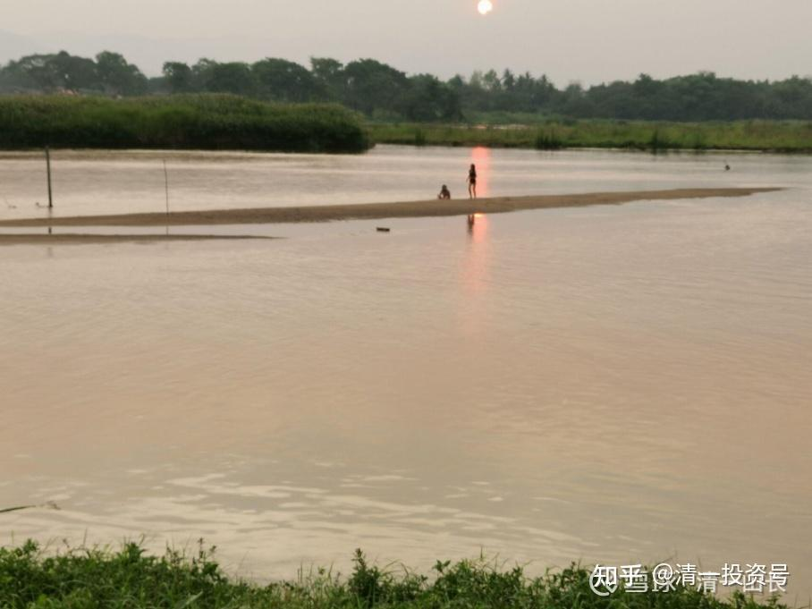

“生而不有，为而不恃”。天下我们什么都带不走，我们能带走的，只有我们的体验！

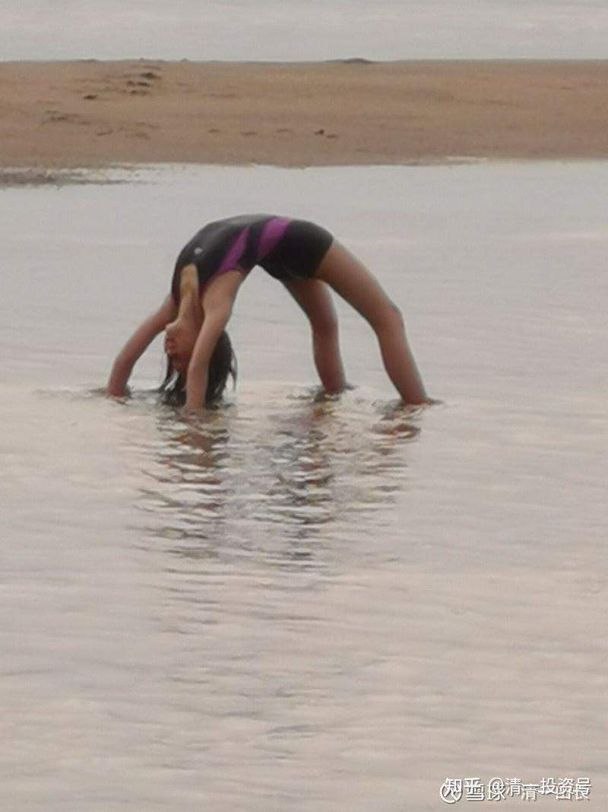

小女儿在玩“**下腰水上行走**”！

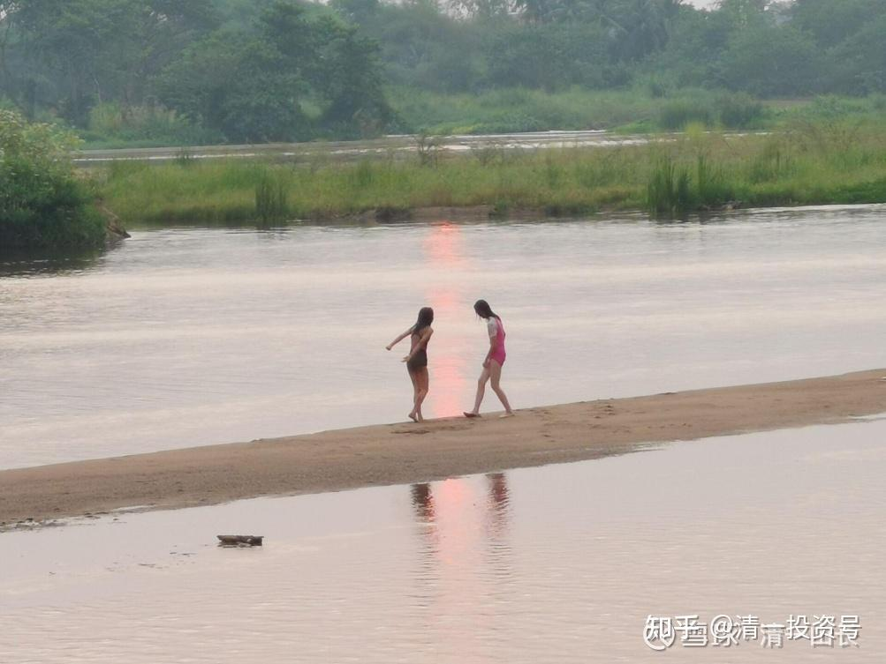

小女与她的小伙伴艾拉在一起玩。这是一条通往曼谷，最终入海的大河，泰国的母亲河PING湄平河(Mae Ping River)。由于阳光强烈，所以每天只是傍晚才带孩子们下水去玩。当地也有一些孩子会来玩，但人不多。如果中国有这种地方，肯定人满为患了。

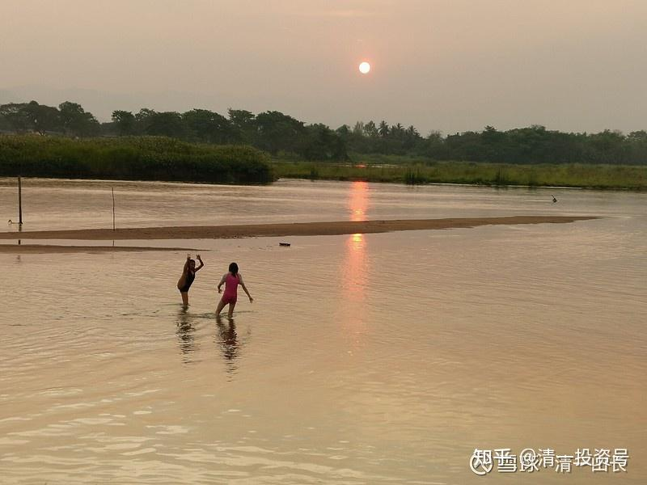

第二天，我买了四个游泳圈，让她们去体验玩漂流。她们更是玩疯了！几个小时都不愿意上岸。我在泰国的度假村里面，坐在宽大的，可以容纳几十个人的大餐厅里面，打开网络，接上电脑，看着国内我的股票，今天又涨了很多个的450泰铢出来。我什么都不用做，只需要等着就行了。其实算算：每天我的分红就过万元。我是怎么花，也花不完的钱，干嘛要去买啥小岛？钱多烧疯了脑子吗？我们无法拥有地球上的任何东西，甚至我无法拥有我的女儿。但我可以拥有与她一起的生活和体验。我相信：她长大后，会记得她小时候在河里疯玩，爸爸妈妈为了让她玩个够，就在河边度假村住了四天，让她开心的去玩。这种体验，不比我去操心买下一家度假村，或者去岛上建一个我自己的度假村，更有价值吗？昨晚，我们决定多住一晚上的时候，接待的主人高兴的样子说，现在她一天只有我们一家客人。我们这样玩，自己高兴，别人也高兴。真的买下来之后，恐怕大家都没这么高兴了。我相信服务员看到“老板来了”，紧张更多过高兴吧？我天天算：没客人，每天的开支都少不了，水费、电费、员工工资。我也烦死了！所以，其实我们需要的其实很少。但我们想要的太多。我现在过的这种，你们看起来很惬意的生活，我相信大多数中国人都能过上。但你们都不要。你们只是想要去买一个小岛[大笑]。

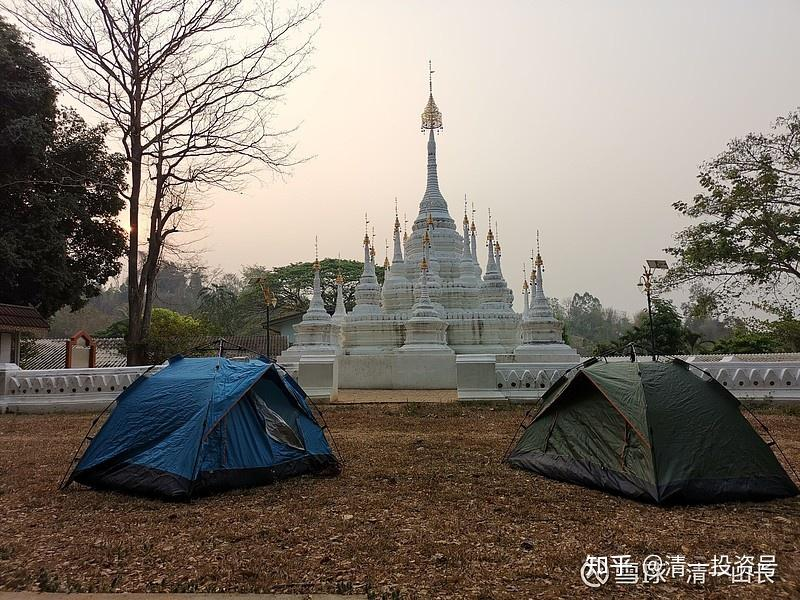

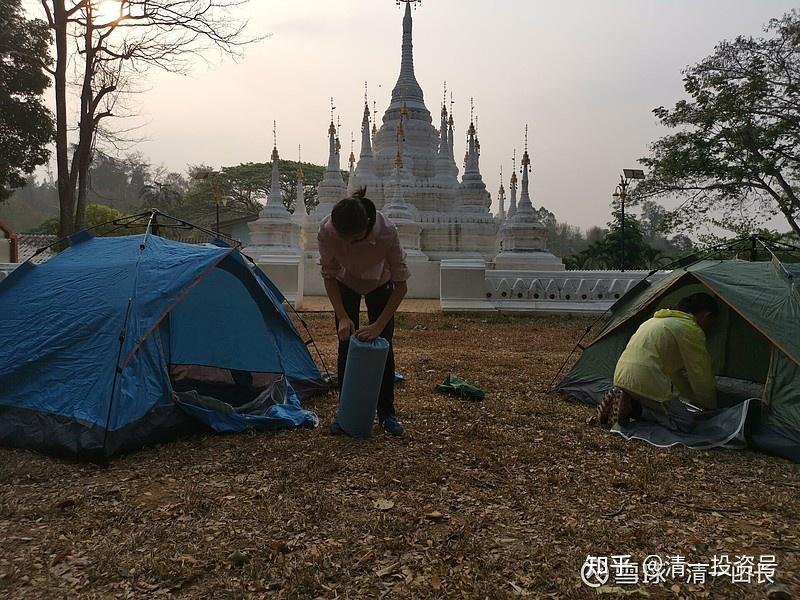

这里的生活标准：一份泰国鸡油饭、猪脚饭，35泰铢。小女素食，就只要白饭，加上一碗菜汤，共10泰铢就搞定了。西瓜4公斤左右一个，40泰铢；很好的芒果，30泰铢一公斤；泰国青柚，很甜的，水分充足，10～15泰铢一个。如果您像我们一样住帐篷，连450泰铢的房费也省掉，生活费就更低了。每天去大河里面洗洗，挺干净的。傣族人、泰国人，就是这样的，不需要洗澡间！所以，人真的不需要太多。或者说，我们已经得到了很多（泰国的公共设施很多，很方便，要找有水、有电、有卫生间的、安全的、搭帐篷的地方很容易。如果玩穷游，是个很不错的地方。）

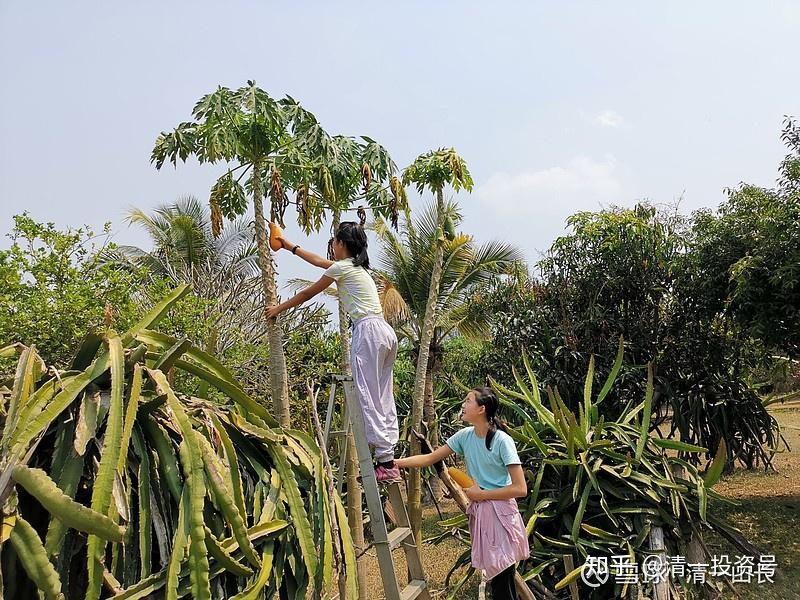

（以下内容为编者收录）

评论回复：

**清一山长2021-03-29 3:57回复：**

干嘛非要买下来才算“自己”的？可以用就是自己的。我现在住在泰国的一个度假村里面，带女儿出来玩的。她爱上了去附近的大河里面玩，广阔的沙滩，温暖、清澈、透亮的水，我也很喜欢。度假村环境也很好，到处是果树。看得出维护得很精心。晚上睡觉，嫌屋里闷，我们一家搬到草地上睡帐篷，空气很好。早上在鸟叫声中醒来。这种生活，很惬意。价格却很低廉：一栋独栋的泰式小房子，不知道能不能叫别墅？肯定比这个人的车大。空调、电视、网络一应俱全。才450泰铢一碗。由于泰国现在没有游客，整个度假村就我们一家人。相当于“我们家”的度假村。

“生而不有，为而不恃”。天下我们什么都带不走，我们能带走的，只有我们的体验！

**YOGA小马哥2021-03-29 14:12回复清一山长：**

千金的瑜伽动作真漂亮，很自然，有质感[很赞][很赞][很赞]

**成都老菜回复清一山长：**

看起来河水不清啊！是拍摄的问题么？

**清一山长2021-03-29 14:51回复成都老菜：**

水清到见底。您看到的水面的颜色，是脚下的沙滩——沙子的颜色，不是水的[笑]。直接投过去了，国内很难见到这样的河流，完全无污染。一路上我们没看到一家工厂。

**无心9fw回复清一山长：**

有些拥有不在于豪华，而在于不再流浪，在能力范围内有个家。

**清一山长2021-03-29 14:54回复@无心9fw:**

别想**“不再流浪”**的事情了，您做不到的。买了一套房子就可以不再流浪？梦想罢了。**基本上，我们都是地球流浪者，还不得不永远地流浪下去**[大笑]。

**股海厨子回复清一山长：**

楼主挺帅的，建议换个高清点的头像。

**清一山长2021-03-29** **14:55回复股海厨子：**

高清图一出来，就看出人不帅了。还是低清一点好[大笑]。

**上天入地9回复清一山长：**

粉一个，是泰国哪里的度假村方便说一下吗？也算给度假村老板打个广告！

**清一山长2021-03-29** **15:18回复@上天入地9：**

我没办法告诉你他们的名字，发音是SIRI。泰国到处都是这样的度假村，不用宣传的。我们住的还是“贵”的，450泰铢。一路上看到广告有300泰铢～350泰铢的度假村，不过都是写的泰语，一点英文都没有。你们是“外国人”，一般只会找“涉外酒店”，我们这次，先找了一家涉外的酒店，房价最低1500泰铢，还在路边。不过员工友好地告诉我们：后面的度假村只要400泰铢左右。一般泰国人都去这些地方，他们主要接待尊贵的曼谷贵族，以及外国人。我们找的这种度假村基本上是接待普通泰国人的，虽然很干净，也很舒服，但连英文的名字都没有，服务员也不懂英文。属于专门接待泰国人的。小女的泰语基本上达到了母语水准。所以我们可以找到这样的地方，也可以交流。你们就不知道了[大笑]。

附录：

**【**[花20万美元买下一座私人小岛，即便住在25平米小房子里面，这样的世外桃源生活也让我们羡慕不已](http://link.zhihu.com/?target=https%3A//xueqiu.com/6687544095/175647840)**】**

作者：王春龙

五年前，蒂姆·戴维森搬到了佛罗里达的一个地方度假，在面临被赶走的情况下，他花费了20万美元买下了一座私人小岛，并将岛上的环境进行了改造，建造了两座房子。追求极简设计的他，如今把自己的家建造得非常让人羡慕。

1、2017年，蒂姆·戴维森（Tim Davidson）有60天的时间搬出他的度假屋。在佛罗里达州萨拉索塔的度假屋，他已经住了一年左右时间了，并不想离开。于是，他选择了当时一栋名叫“Tiffany”270平方英尺（约合25平米）的房子，花费了7.1万美元（约合46.4万元人民币）左右。随后，他对房间进行了改造。后来，他觉得房子确实太小了，而且还面临经常搬家的问题。

2、为了不让自己经常搬家，戴维森准备买下一块永久的土地。他发现自己小房子上的这个小岛正在出售。戴维森说，1.5英亩（约合6070平方米）的Shellmate岛其实已经出售多年，但卖家要求的价格是“天文数字”。最后，经过一番谈判，他以大约20万美元（约合130.8万元人民币左右）的价格购买了它。另外又花费9万美元买下了岛上一座320平方英尺（约合29.7平米）的房子。

3、在这里，戴维森花费了几年时间，将它变成了自己的家园。他把一栋房子请了德尔泰克家居公司设计成八角形，主要为了抵御飓风的考虑。此外，他把岛上进行了开垦。如今，岛上到处都是热带水果，如芒果、鳄梨、桑葚、荔枝、菠萝和无花果。戴维森说：“这是一块美丽的土地。”尽管两个房子都很小，但戴维森没有怀疑过住在小房子里，他说这是他做出的最好的决定之一。戴维森说，在他的小房子里度过的第一个晚上感觉就像一生中的重大事件。“我很紧张，但也很兴奋，”他说，“在人生的某些时刻，你会想：好吧，这是一大步。我正在做一些极端的事情。”在这里，戴维森拥有自己的岛屿，并在上面盖上房子，种上各种水果，这种世外桃源的生活，绝对让大多数人羡慕了。

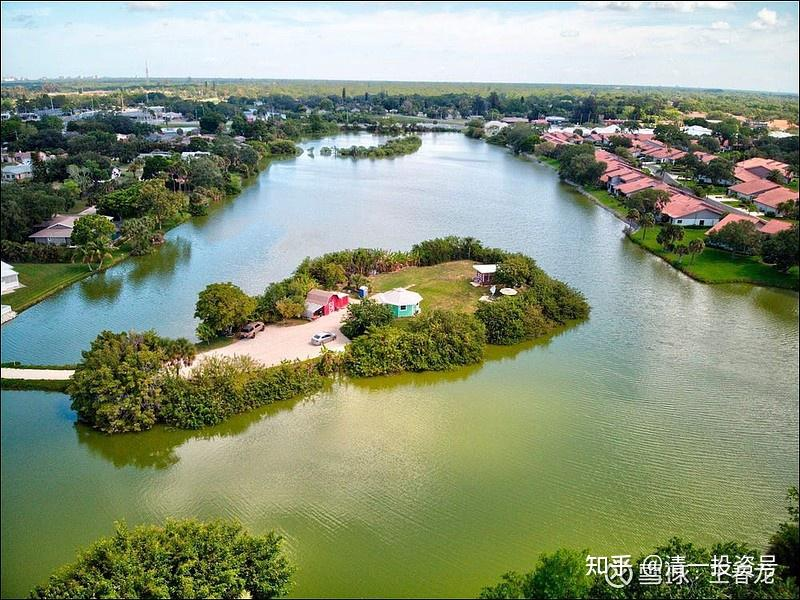

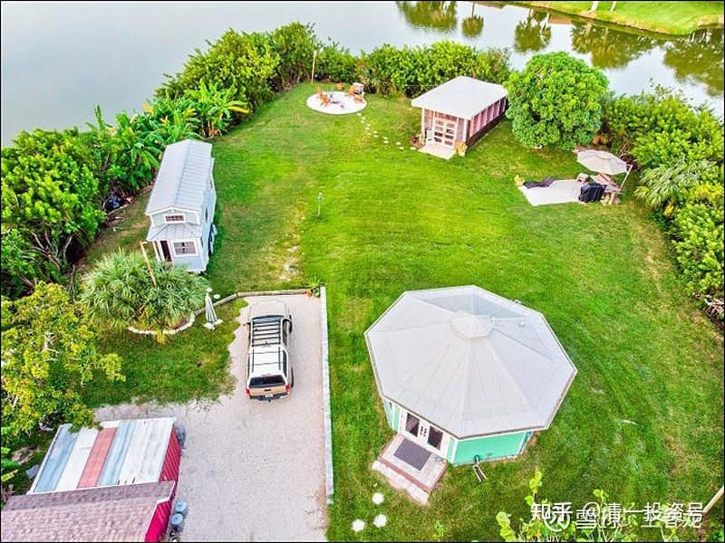

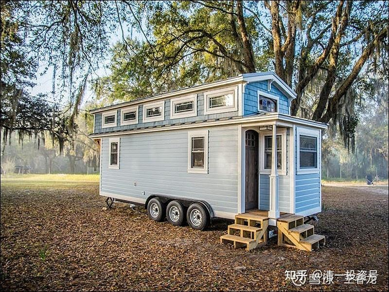

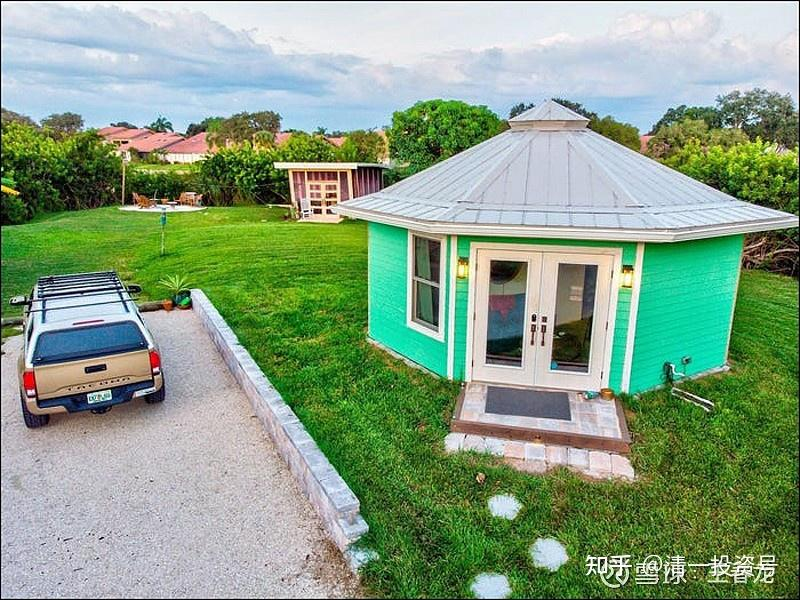

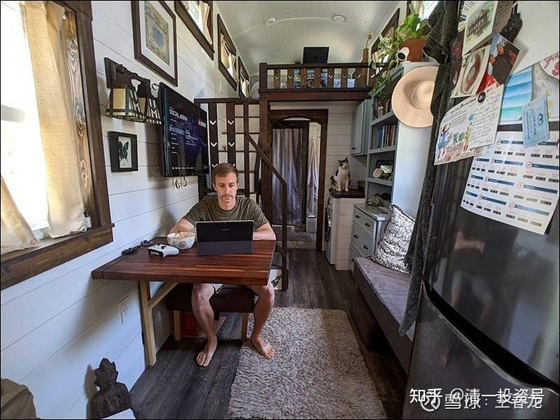

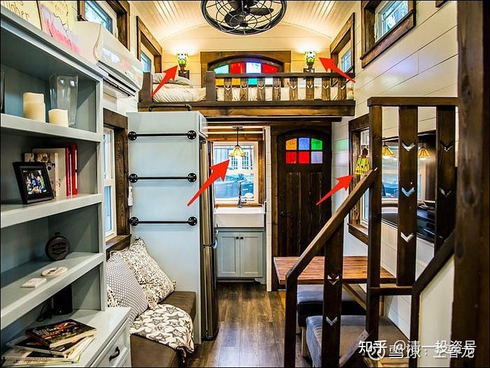

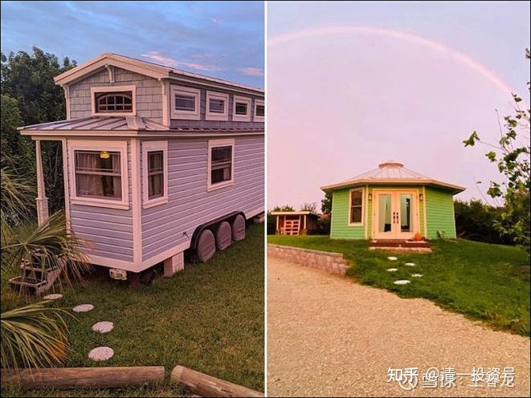

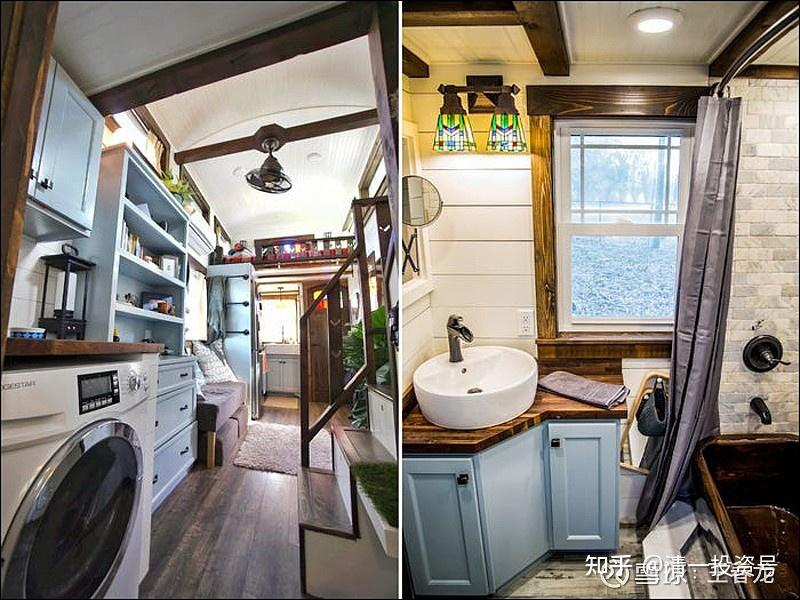

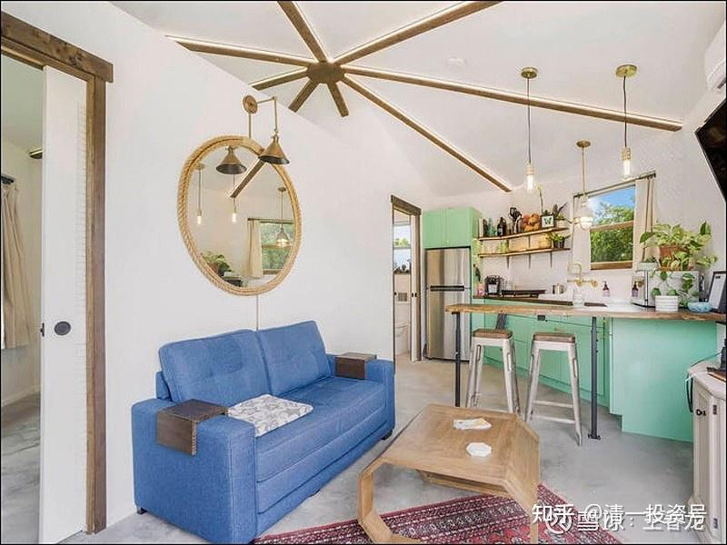