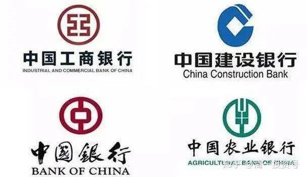

13篇.投资中资银行股，分享中国发展红利

2020年4月6日～2020年9月6日

一、时间会证明：资本将站到中国的银行一边

二、这就是国运——未来不再属于欧美国家

三、中资银行代表未来

**一、**时间会证明：资本将站到中国的银行一边

清一山长2020-04-06 17:11:04

$汇丰控股(00005)$汇丰近期大跌，5号仔风光不再，说明辉煌了百年的外资银行神话，正在破灭。虽然这一天肯定会到来，没想到是因为疫情而到达。2016年，汇丰大跌之时，很多国人抢汇丰。我就说：外资银行不行了，未来不属于他们。当时看，他们似乎赢了。

现在，汇丰不是跌回原地的问题，而是比2016年更恐怖的问题：这个原本把利润的大多数都用来发利息的企业，一旦停止发利息，就说明一件事情：它已经开始亏损了。当年5%的股息，与中资银行相当，但是中资仅仅分红利润的30%左右，汇丰却是80%以上，甚至有时派息超过年度利润的总额，国人却依然迷恋汇丰而放弃内资银行。**未来十年，中资银行超越外资银行，现在已经再明显不过的迹象了。**汇丰未来，不再是一家蓝筹，而将落入不断衰退和萎缩的命运。我认为她不再有机会重新回到银行业的神坛上了。

汇丰停止派息，也说明当前形势的危机很严重：它不是停止第四季的派息，而是2020年的派息也统统取消。我认为，作为最了解经济情况的银行，汇丰给出的答案很明确——能活下去就是它最大的胜利了。**未来，大家别指望欧美了。想买银行，还是买中资的更靠谱。别看他们土，但他们代表未来。**

多说一句：**喜欢买汇丰的人，和喜欢送孩子去欧美留学的人，是同一群人，都是崇洋、崇英美的人，小资情调很浓厚。**他们都是喜欢看过去的光荣来准备未来的。我觉得——这很脱离现实，也很愚蠢。过去40年，快速发展的机会在中国，而不是欧美。欧美勉强维持罢了。现在，中国大陆，将陷入“维持”的“中等收入陷阱”，将复制欧美如汇丰过去20年的境地。

未来的几十年，大的发展机会，不在欧美，也不在中国大陆，而在于“中国走向世界的企业”，而欧美，将陷入更加快速的衰退。但中国大陆本土的机会会大量萎缩，也将陷入长期的停滞期。在大陆找好一点的管理层级的工作，会很难的。**未来的机会，属于“中国走向世界”，属于小语种国家了。**企业如此，人的职业机会也如此。投资，要找未来具有国际竞争力的企业，找工作，留学，都要服务于这种趋势。未来，拥有三语实力的人才，才是未来中国最热门，最高端的国际人才。如果您忽略了这个发展的趋势，你的投资回报，你孩子的教育回报，恐怕都是负数。甚至可能归零！

@OceanMerchantltd回复清一山长:

离开衰弱应该还有很长路吧。汇丰还是交通银行的大股东还是恒生的大股东，难不成全一起挂了？

清一山长2020-04-06 17:52:03回复OceanMerchantltd:

衰退和挂了，是两个概念吧？跟人一样，老了，没闯劲大干快上了，每天就守着手中的一点资源，过过维持的生活，也可以混很多年呢！

挂了就是马上要清算破产了。我看汇丰还不至于风控这么差。德意志银行、法巴银行，这些老牌银行，不也是死不了，但也活不好的样子吗？做它的股东很倒霉的，你看做它的股东，股息也分不到，上涨也轮不到。但幸福的是：快速破产也不可能。底子厚，可以吃老本很多年的。那是给管理层混日子的底子，就没你股东分吃的份儿了。

新浪财经2020-04-06 16:40报道原标题：【大象零息】汇丰小股东权益大联盟：取消派息严重损害股东利益

网页链接：[http://finance.sina.com.cn/stock/relnews/hk/2020-04-06/doc-iimxyqwa5362318.shtml](http://link.zhihu.com/?target=http%3A//finance.sina.com.cn/stock/relnews/hk/2020-04-06/doc-iimxyqwa5362318.shtml)

清一山长2020-04-06 17:28:03评论上帖：

小股东真是闹笑话。打官司能解决问题吗？假如公司没赚钱，或者预期未来赚不到钱了，怎么分红给你？你以为存款取利息呀？再是英资银行，自己没钱了，也变不出钱来发给小股民的。

我的建议：趁大多数汇丰股民死忠们维权死磕公司高管的机会，你们聪明一点，就赶快走吧！把钱去换一只未来十年肯定会上升的股票，比去打官司更靠谱。你们喜欢银行，就换四大行吧！香港人，别死脑子死在香港股上了。**中国大陆的跨国企业，才是未来的希望。现在四大行也很便宜！关键是:未来的派息，一定比汇丰靠谱，股价也一样。**

二、**这就是国运——未来不再属于欧美国家**

清一山长2020-04-06 18:09:55

$德意志银行(DB)$ 2008年，从100多元的高位跌落后，就再也没有恢复了，最近美股十年的上涨，也没见它涨。现在居然跌到五元多了。**这就是国运----未来不再属于欧美国家。**汇丰控股，也会走上这条路吗？慢慢的用十几年时间，让股东慢慢的失去耐心，一点点地掉下来，让股价也走到5元？

清一山长2020-04-06 18:28:47评论上帖：

100元的时候，成交很少的。说明大家都当宝拿着，不松手，以为可以上200元。跌到很多年，到了2015～2016年，跌到20元左右，股东们才醒过来了——德银不行了，赶快走。这几年成交都在放大。新韭菜一看便宜了，出现了多年不见的超低价，开始接手买入，结果一路套下来，本金只剩25%。用了杠杆的，爆仓几次了。所以，投资不是买古董，不要在衰退的行业投入哪怕一分钱。**发现行业不行，趋势不对，多亏也得走。**

@小丑龙鱼回复清一山长:

为何我们的银行股也那么便宜？我买了中国银行被套了[哭泣]。

清一山长2020-04-06 18:53:24回复小丑龙鱼:

瞧你这没出息的样子，就别来跟汇丰股东比了。别人汇丰的小股东，每年拿红利就满心欢喜，不考虑价高价低的。这才是真股东。虽然我认为他们看错了企业，但精神可嘉。你拿钱就是抄底买进，就等比你傻的人出高价你再卖给他，这不是想来当股东的人，是博傻，是炒股。虽然都是买股票，但骨子里面，你们并不是一路人，就别混在一起，装“代表未来趋势的内银股东”的扮相[俏皮]。

清一山长2020-04-06 19:08:58

$渣打集团(02888)$银粉们这几年都叫苦连天的。但看看汇丰和渣打的年线图，大家就知道什么是真苦，苦到说不出来：您长期持有中国的银行，想必是多么的幸福。虽然没太涨，熬得很难过。但是起码还算是年年有余的，年年有分红的。持有十年的话，还是赚不少了。

可是，持有渣打十年，却从180元掉到38元；持有汇丰好一些，持有15年从70元跌到38元（都是复权价）。看看四大行如何？十年是节节上升的路。**虽然缓慢，但是上涨趋势还是很明显，很坚决的---这就是国运当头，老牌英资、美资，玩不动了。**十年后的渣打、汇丰，我看得跌到个位数了吧？十年后，四大行最少也应该上两位数了[赚大了]。全力支持中国的崛起。

**三、**中资银行代表未来

清一山长2020-05-23 09:07:29

$汇丰控股(00005)$早就说了：汇丰不能买。最近一次是不分红造成下跌。我的观点是：赶快撤离，别抱幻想了，别对汇丰有啥幻想。今天果然创下新低。英国银团资本，到了萎缩期了。当年稳步上涨的汇丰，已经成为历史。未来开启的道路，最好的道路是稳步下移，慢慢的成为一个平庸的公司，大而不倒。最差的就是遇到大的金融危机，快速地倒下。这是未来的必然趋势。

香港也一样。香港已失去了它的“发展机会窗口”，未来的香港，是体验一个过气的贵族破落之路，挣扎之路。光荣只能活在回忆中。因为这些年的香港人，缺乏进取精神，抱残守缺，不肯拥抱新世界，迎接新变化，现在已经丧失了重新起步的机会。香港原来世界贸易中心的位置，现在已经丢掉了。航运中心的位置，正在被身边的大堆港口蚕食。旅游中心，购物中心的位置，正在被香港人对外的不友好，以及高昂的运营成本而毁灭。国际金融中心的位置，预期将被新加坡替代。香港未来唯一剩下的，就是回忆。这种背景下，纯港资企业，还是躲着点好。香港被炒到高高在上的楼盘，更是要远离的有毒资产。

清一山长2020-06-21 00:55:09

$汇丰控股(00005)$【汇丰曾在今年2月表示，将大幅缩减欧美业务以及投行业务，将重心转移到亚洲。在具体计划上，则包括裁员3.5万人，缩减45亿美元成本以及1000亿美元风险加权资产。6月17日，才有汇丰董事会要求重启重组计划的消息传出，裁员3.5万人，并称董事会提出了更加激进的改革要求，其中包括加大裁员规模，甚至是卖掉美国业务。】

其实明白地说了三句话：一：欧美不行了。特别是美国，最好全部撤出；二：亚洲有希望，要坚持；三：未来两年的经济会很差，要小心。别太乐观了。不分红，是因为要留粮食过冬。

看懂了这些国际银行的做法，你自然知道：股市和银行的苦日子还在后头。汇丰就别指望了，未来欧美市场靠不住，香港市场我看也靠不住。**买银行股，要么中国内银股，要么亚太银行股。而且——最好等坏消息都出来了，满天传银行快倒闭的时候再买[加油]。**起码我在泰国是这样计划的。

清一山长2020-09-04 11:24:54

$汇丰控股(00005)$汇丰已经跌到了20年前的价格。1999年的收盘价41元（前复权）。意味着这20年买入汇丰长期持有，拿股息的股民，全都亏了钱和利息。香港人迷信了几十年的——有钱就买“五号仔”,持股分息的“资本信念”，现在已经彻底破灭了。大陆港迷们，跟随学香港人的屁股去买汇丰的，自然也跟着倒霉了。

以此相反：香港人最瞧不起的中国的四大行，比如工商银行，2006年，上市开盘价前复权1.81元，现在涨了接近三倍（2006年的汇丰前复权收盘价是71元，至今跌了一半）。

如果拿中国最好的银行来比，就更让香港人丢脸了：招商银行，2002年的收盘价才1.61元，今天是41元，坚持持有招商银行的，赚翻了。坚持持有汇丰的，赔惨了。

好不容易找到一只1999年上市的浦发银行，表现算是很差的了。当年上市的价格，香港人是绝对不会买的。价格前复权2.20元。到现在也是赚了五倍了。汇丰等英资银行，拿什么本事来比？

**洋奴们，该睁眼看看中国了，别总是以为洋大人好**。我第一次去香港开户，就是开的汇丰。因为我心中以为汇丰就是外资银行的代表。结果——但真心觉得汇丰效率低下，服务水平很差（不是态度，员工对我的态度很好）。跟中国的银行相比差多了。软件也比中国的银行差，我看就是十几年前的水平。但员工工资却比国内高得多。各种收费几乎都是天价，在汇丰买股票交易手续费是我国内的15倍，而且每月还要收账户管理费380元。后来干脆转盈透去了。**我认为这些外资银行，根本就不是中资银行的对手，的确——外资银行在中国开办分行的，没有一家有竞争力的。一旦未来中国银行往外走了，外资银行就要倒闭了。**银行，不是什么高技术，没有啥能够抵挡中国人侵入的。我们需要的是时间。

**时间会证明：资本将站到中国的银行一边。**

参考链接：

[清一投资号：1篇.银行股的投资逻辑](https://zhuanlan.zhihu.com/p/489850963)（整理文）

[清一投资号：2篇.江苏银行的投资逻辑](https://zhuanlan.zhihu.com/p/494495300)（整理文）

[清一投资号：3篇.2015年银行股投资回顾——“价值投机法”之示范（上）](https://zhuanlan.zhihu.com/p/502367347)（整理文）

[清一投资号：4篇.2015年银行股投资回顾——“价值投机法”之示范（下）](https://zhuanlan.zhihu.com/p/506271066)（整理文）

[清一投资号：5篇.价值投机派的投资思路与心态——兴业银行的实操分析](https://zhuanlan.zhihu.com/p/509443218)（整理文）

[清一投资号：6篇.买入农业银行（H股）、中国银行（H股）的投资逻辑](https://zhuanlan.zhihu.com/p/513108169)（整理文）

[清一投资号：8篇.徘徊于历史最低PB估值附近的兴业银行](https://zhuanlan.zhihu.com/p/523235722)（整理文）

[清一投资号：9篇.建仓、持有贵阳银行的投资逻辑](https://zhuanlan.zhihu.com/p/528438150)（整理文）

[清一投资号：11篇.2017年中国银行A、H股换仓套利](https://zhuanlan.zhihu.com/p/546999971)（整理文）

[清一投资号：12篇.买入并持有民生银行H股的投资逻辑](https://zhuanlan.zhihu.com/p/555017232)（整理文）

[清一投资号：13篇.中信银行H股的投资逻辑](https://zhuanlan.zhihu.com/p/562341975)（整理文）

