昨天，明燕带队的一行五人，已经赶赴远离清迈530公里的碧差汶府，准备今晚的比赛。赛事方替木兰们预定了两个房间。下面照片是专门为节日庆典临时搭建的拳场。也是木兰佳慧今晚的擂台，与上次被裁判抢走胜利战果的金腰带进行二番战。佳慧心心念念想“复仇”，我都担心，这个执念会导致她上场发挥失常导致失败。所以：我一直要求她，当做一场普通的比赛来打！不要想多了。心浮气躁。

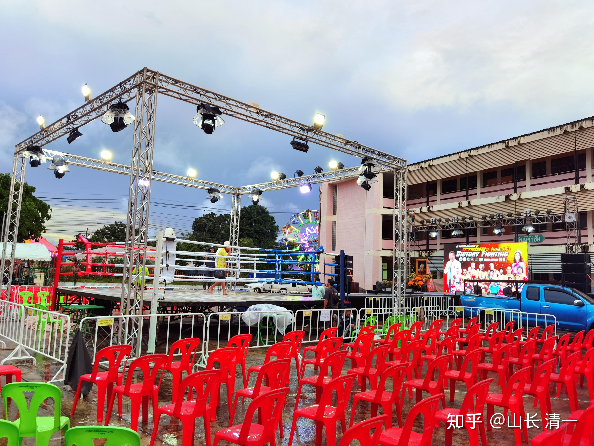

*碧差汶 潜佛节庆典拳赛*

下图是今天，刚刚到达清迈机场的太极征泰第二波队伍。看到木兰们在拳打脚踢泰国人，他们却只能在国内看视频，心里一直很着急，今天总算等来了国门开放，来泰国打比赛的机会。拳手们是以出国留学的名义出国的。清一武道馆这批学生，都申请了泰国清迈的一所大学。将以大学生的身份，在泰国打拳，这样起码可以打四年的泰国人！他们学习的专业是泰语---大家当玩一样就学好了！本来孩子们根本不愿意上大学的，我劝说他们：反正不可能每天练拳24小时，每天休息的时间，学学泰语就够了。要在泰国发展，总得懂泰语吧？我们的主业还是打泰。这批清一武士们，将在一个月后，就要与泰国人开战了。我们的征泰速度，将大大的加速。将来你们恐怕连比赛都看不过来了。

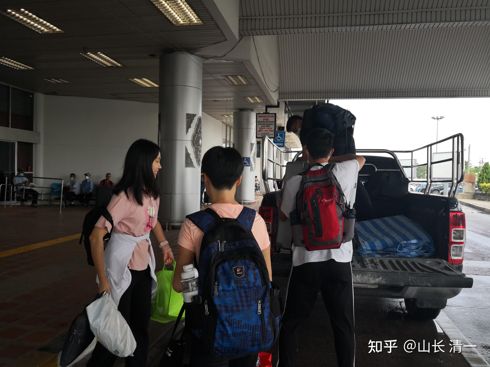

*征泰大部队 到达清迈机场 新木兰，新武士*

下图是碧差汶府的市长先生，拉着佳慧合影留念。泰国的官员都很会做亲民秀。总比国内的长官做“虎威秀”要好。市长还表示：他特别喜欢“木兰”这个名字。

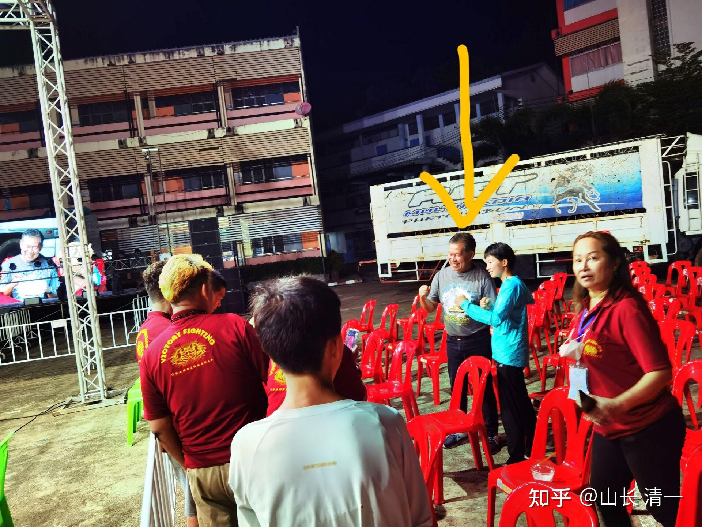

*箭头中男人是当地的市长。与佳慧合影留念，*

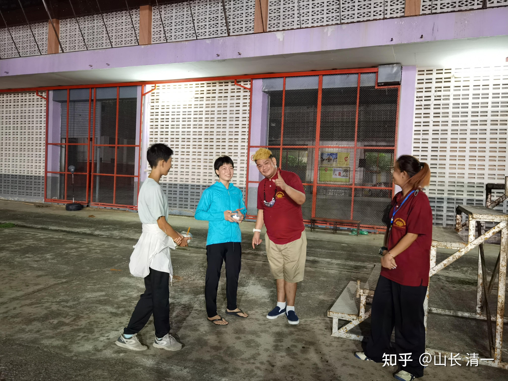

*比赛负责人，正在接待到达比赛现场的佳慧和明晓*

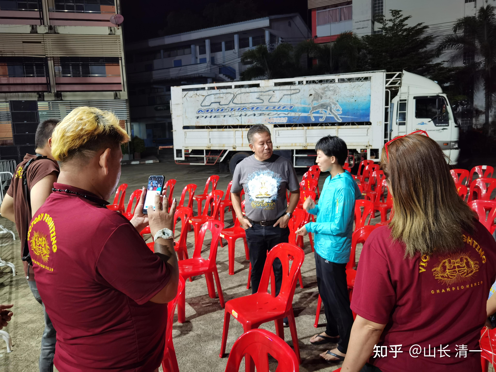

*邻家大叔一样的市长，与佳慧亲切友好的交流。*

市长对于来自外国的拳手，居然可以用非常熟练的泰语，来跟他交流互动，感到不可思议。虽然来泰国比赛的外国拳手很多，不过，绝大多数的外国拳手，是不懂泰语的。但他遇到了例外----中国的木兰拳手居然是三语学霸。完全可以与他无障碍沟通交流。

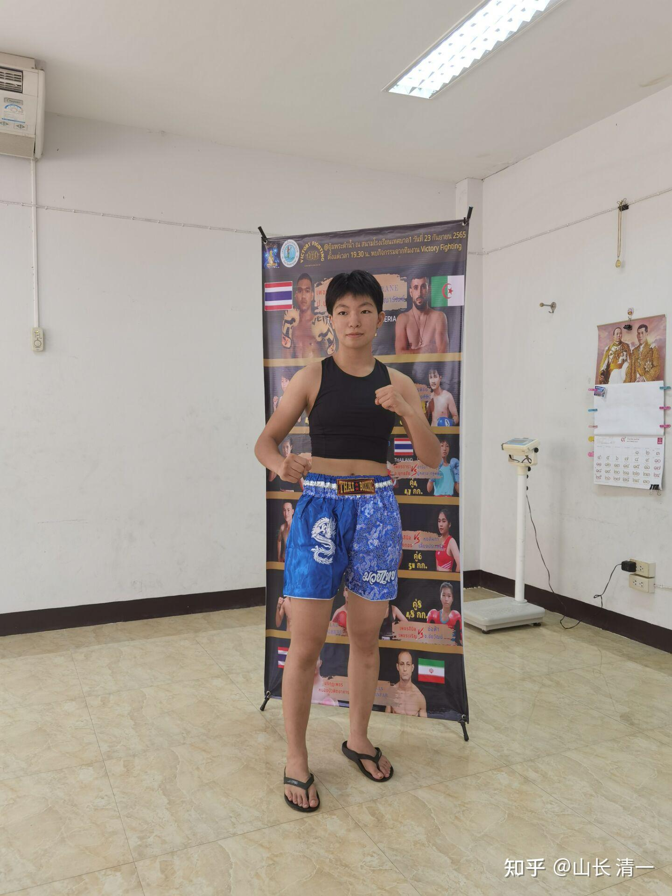

*佳慧的赛前照 在称重仪式上 *

下图是本场比赛的海报

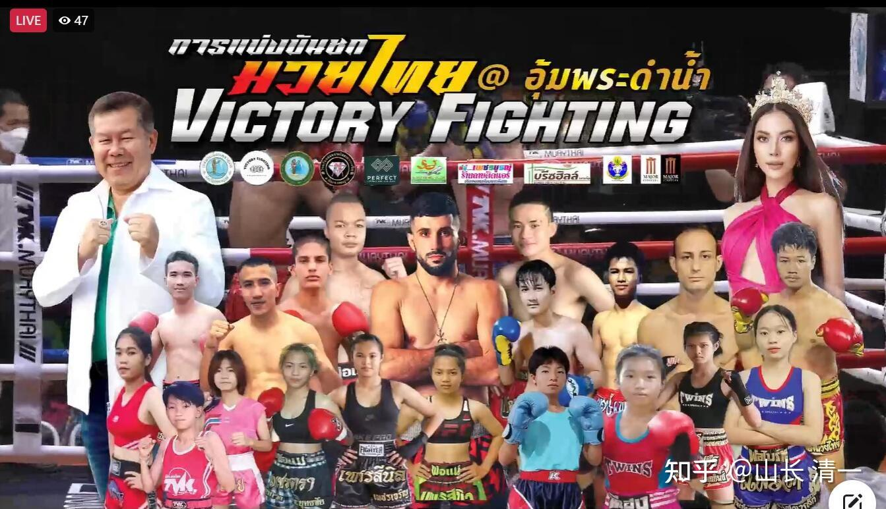

*太极征泰第20场比赛海报 碧差汶府*

泰国时间21:06，马上要上擂台了。正在后场等待出场的木兰佳慧：这次主办方昨天在接待佳慧报到的时候，就说看过她的比赛视频，说她的打法非常的凶猛。但希望这一次比赛，第一回合内尽量不要KO对手。要让观众有多一点兴奋和喊叫的时间。看样子，泰方是知道自己的拳手获胜的希望不大。但依然组织安排了这场比赛，应该是考虑了观众的观赏需求。毕竟泰拳手与中国拳手的交锋并不多，特别是女拳手更少。所以：泰国赛事方的安排。还是不偏心的。当然---我们不能KO对手的时候，就会偏心了！

我唯一想不到的就是：为啥金腰带要主动安排二番战。从这次比赛的结果来看，她根本就没做好足够的准备。也许泰国拳手，就不知道应该如何训练了来应对太极吧？

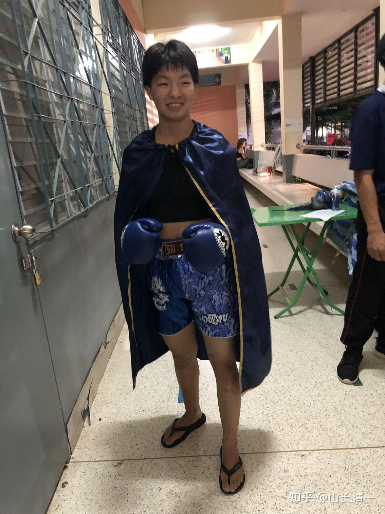

*正在候场的木兰佳慧*

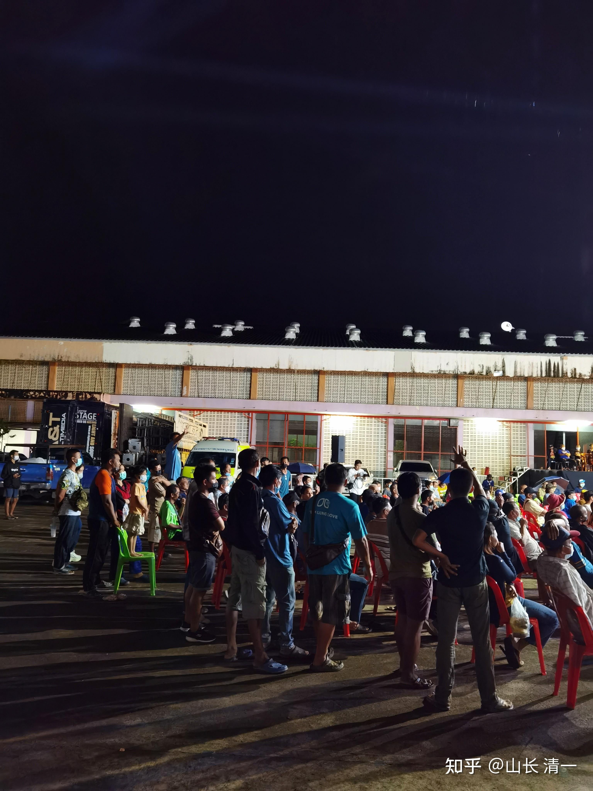

*现场观战的观众。*

这是城市为了娱乐市民组织，所以是露天公开举行的比赛，应该是让大家来免费观战的。不像清迈的拳场，是要卖票给外国人的。现场泰国人比划的手势，应该是正在赌拳！

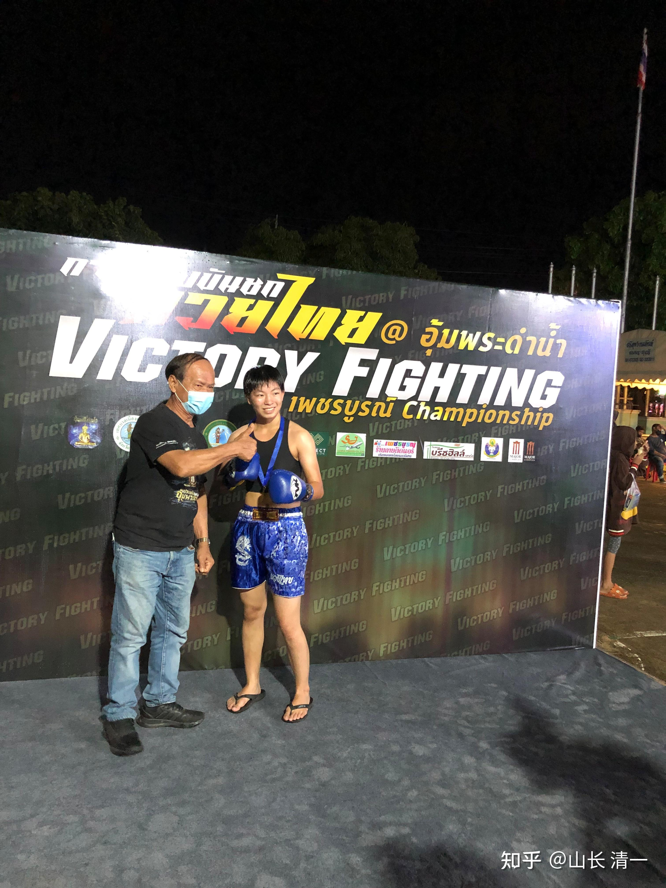

*第二回合KO胜 主办方发金奖牌给佳慧*

本次比赛。主办方在FB上直播。小公主有账号，连上去了，所以我也同步跟踪了这一次的比赛。

第一个回合开局，看佳慧打得不错。对手依然采取第一次的战法，尽量的用内围战死抱佳慧，避免被打击。但因为佳慧已经升级成功了，很轻松就破了她的内围战法。所以内围战用了太极技术，压制性的打击，多次摔翻对手。但我看到佳慧很克制，明显可以用肘击的地方却只是缓慢的下压旋转。应该是防止对方第一回合就KO。但泰拳方面的人，讲解员依然不懂佳慧的优势，说：这个中国拳手的力气实在太大了！非常的强悍。等等！估计是看到泰方拳手完全无法抗衡，第一局泰拳手就被击倒读秒了吧？其实我看是佳慧还真的没出手呢，只是打了玩玩的。没有真正的发力。所以我知道这一场，佳慧赢定了。

所以，第一局打完，我在前方的亲友团，内部群上发了以下信息！希望转告佳慧的，但没有成功，因为估计大家根本就没有时间看短信息。

山长 清一 22:25:24

佳慧开局不错。控制了场面，很冷静、应该会KO对手的。明显有几次可以肘击对方的，没有发力。这一局（第二回合），该发力攻击了。启动KO模式。

我刚发上去，第二局比赛就开始了。对手还是继续用内围缠抱技术。但这一回合，佳慧就不客气了，直接采用旋身压制加肘击，发力攻击。一开场就把对手打傻了，她这一个回合才发现：自己根本没有机会赢。因此满眼恐惧的不断退让。尽量避免主动攻击。但没多久，就被佳慧击倒对手几次。本回合，泰拳手就像不会打了一样，完全没有防守的能力。后来再一次像是棉花团一样被击倒后，裁判赶快终止了比赛。佳慧成功KO了对手。二番战复仇成功！虽然我认为这是必然的局面，佳慧第二战的时候，金腰带就已经不是对手了。现在佳慧第10战，早已升级后的佳慧更厉害。而泰拳手我认为没有升级的空间。

两个小公主说：现场的泰国播音员，说木兰的实力超强，完全是压倒性的优势。裁判员为了保护泰国拳手不受伤，及时终止了比赛。TKO结束了比赛。之前播音的时候，专门介绍了佳慧：她原来所有赢的场次，全部是KO胜，没有点数胜的记录，所以是一个凶猛的拳手。这一次继续KO胜了金腰带，木兰的实战记录，就更可怕了。

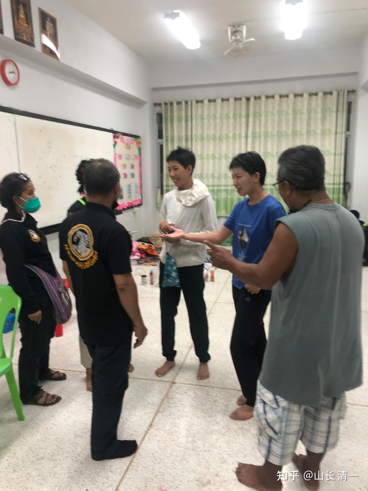

*赛后两个泰拳馆长和三条金腰带的得主邀请木兰去他们的拳馆训练*

佳慧收获了一堆泰国粉丝！赛后找她合影和交谈。

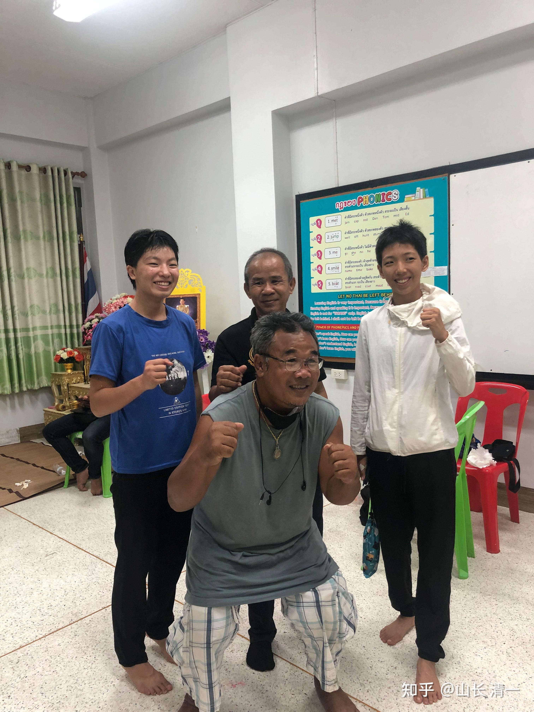

*这老人这么高兴，是不是赌佳慧赢钱了？ *

附注：今天的照片，是陪护木兰们去前方作战的明燕校长拍的。

24日早上的补充资料

补充：佳慧凌晨1.54，回到酒店后的留言：老师们好，现在我们已经回到酒店了，我们大家看完了剩下的比赛，尤其是男生泰外对战的场次，都凶猛无比。有一场双方都成了两个血人（肘击），下场就被救护车送到医院包扎，血甚至都溅到了场下的裁判身上。但外国人总共四场比赛，除了我是KO赢以外，其他都输了，压轴赛的外国人打的很好，还摔了对方很多跤，我们包括阿伦和旁边的泰国观众都觉得他赢了，但最后他还是被判输了。赛后我们找他合影，说你打的很好，我们都觉得你赢了，他一副无奈的表情表示认同。看来如果我这一场不KO的话，估计也会被黑掉吧[表情]

另外黄校长刚才发的照片，其中黑衣服的人，是chaosingkhorn boxing gym的馆长，他曾是WBA的世界冠军，很有名的拳手。戴眼镜的叔叔，是南伽隆三条金腰带的冠军（但他很平易近人，甚至有点搞笑大叔的气质，他的姐姐嘲讽他肚腩那么大，还亏是拿冠军的人呢！[表情]）。赛后我们跟这个馆长加了电话号码，和他拳馆的facebook，他也很热情地邀请我们的拳馆训练。眼镜叔叔还说他们的拳馆很好，过来训练不收我们的钱的。

还有一个好消息是：我对手的馆长（也就是他爸爸）在赛前称重时问我想不想去电视台打，我回答当然想，他说刚好他们那边缺外国拳手，出场费是一万起步，我说能有机会去打就已经很开心了。赛后送巧克力时，又再次确认了一下，他说会帮我安排的，只不过打的是小拳套，说伦披尼女生只有小拳套[表情]我说没有关系。他还问我对于我来说比较舒服的体重是多少，我说是49会比较合适。（不太确定是伦披尼还是电视台，他当时说的不太清楚，但都是曼谷那里的）同时明晓还通过Facebook了解到，两周后我今天的对手要和pawida在伦披尼打小拳套比赛，pawida和我第十一战的女拳手来自同一个拳馆，两人是好姐妹，当时塔佩门主办方想要安排我和pawida打一架，但是对方婉拒了，说再看看。

9月25日的补充信息：

我对木兰的战后指导：

刚才又看了一遍比赛视频——关于10月8日的战事——对手水平，虽然是所谓的“世界冠军”，但跟这次的金腰带拳手相比，水平实力基本上差不多的。采用泰拳技术，这个级别已经没啥实质差别了，佳慧一样去打就行了。一样可以KO对手的。只是多注意采用拳腿交加的攻击，以及连续的攻击，不要多缠抱。虽然内围上我们不吃亏。只是进入内围打，对我们很不划算，消耗时间，而且观众是看不清输赢的。对手就算受伤了，观众也不知道。只要不打倒，就是我们输。所以，打冠军我们依然是尽量避免打内围，继续强化现在的野马分鬃加连击的功防方式就行了。一旦被动进入内围就肘膝齐上。这一次比赛，佳慧反应很灵敏，跟对手的“随动”做得很好，应对很及时，切入的距离鸡节奏也很好，让对方攻击落空的同时就被攻击了。而且应该打击比较重，所以导致对方畏惧，进攻被压制了。缺点就是攻击没有连续起来。佳慧面对不断后退的对手，也更稳定了，不急于主动攻击，克制住了原来急躁冒进的毛病，而是不断的在“逼对方出手”，这一点做得很好，给对方造成了很大的压力。下次打，佳慧也一样做就行了。不急不躁的，让对手陷入狂乱的状态。这一次，步步紧逼，成功让对手心智完全失控。明显打怕了。对手后来的出拳，出腿都很脆弱。毫无力量和距离感。白白浪费体力。有时候勉强出手就是根本不指望打到人，可以说完全失去斗志。因为这个拳手很聪明。她几乎是挨打后马上反应过来---你的打法专门可知她。她只要一出手就会马上挨打。所以她比上次11战被佳慧狂殴，却一直固执往前冲的勇猛型泰拳手不一样。上次的11战拳手，她对自己所处的挨打地位反应太慢了，一直冲到枪口上被揍，导致直接KO。这一次20战的拳手，第一回合基本正常，还觉得有希望。因为你收力未发。包括她被读秒这一次，其实是裁判为了让她有机会调整好心态故意拖延一点时间的。当时佳慧并未重击。她也有积极求战的心态。但第二局一开始，她刚刚发动攻击佳慧就启动全力出击，而且力量显然很重。她第一时间就蒙了，怕了。而且裁判是很关心她的，特别注意保护，所以发现她没有机会挽回比赛，就马上终止了比赛，让她安全落地。另外，佳慧可以告诉塔佩拳馆，可以正常安排你们的比赛，错过10月8日就行了。不需要专门为了对付世界冠军而专门备战的。我们就不学国内的大牌明星了，打一个比赛，居然需要提前几个月甚至半年，专门出国备赛的。我们就是随意，随心，在比赛中练心就行了。清莱的比赛，明晓不用考虑一起陪着前往的问题。可以让拳馆一直正常的安排比赛，不考虑错开时间。明晓也需要多打比赛多练心，不然只是去旁观看佳慧越打越好，自己的心态就会更不安心了。武道馆其他学生，也好好学习战略战术，不要变成傻乎乎的只会打笨拳的鲁莽汉子。

佳慧的赛后总结和回复：

谢谢山长的指导[表情]，我自己也觉得进入内围太多了，还是没有打出连续拳让对方接近不了自己，回去继续练习，在十月八号与甜水的比赛中希望自己能够做的更好。这应该是我接下来的主要提升目标了，不然每次打都会被抱住[表情]。这次在心态上我感觉还是不够冷静，有点急了，能够再沉稳一点就好了。昨天我几乎没有怎么出腿，主要是因为场地有点滑，拳台材质还跟塔佩的不太一样，当时我打的时候正在下雨，拳台上都是水，所以怕滑倒就没有用很多腿。

林佳惠 09:17:07

不过这一次一见到我的对手，就感觉很不一样，上一次我觉得她比我重还比我高，这一次觉得她比较矮也比较瘦小。一上来打的时候，就突然觉得她好软，很好对付，一下子就倒了，跟我一番战时内围很费劲完全不一样，觉得太极真的好厉害，我们的技术更新换代比泰拳快多了[表情]

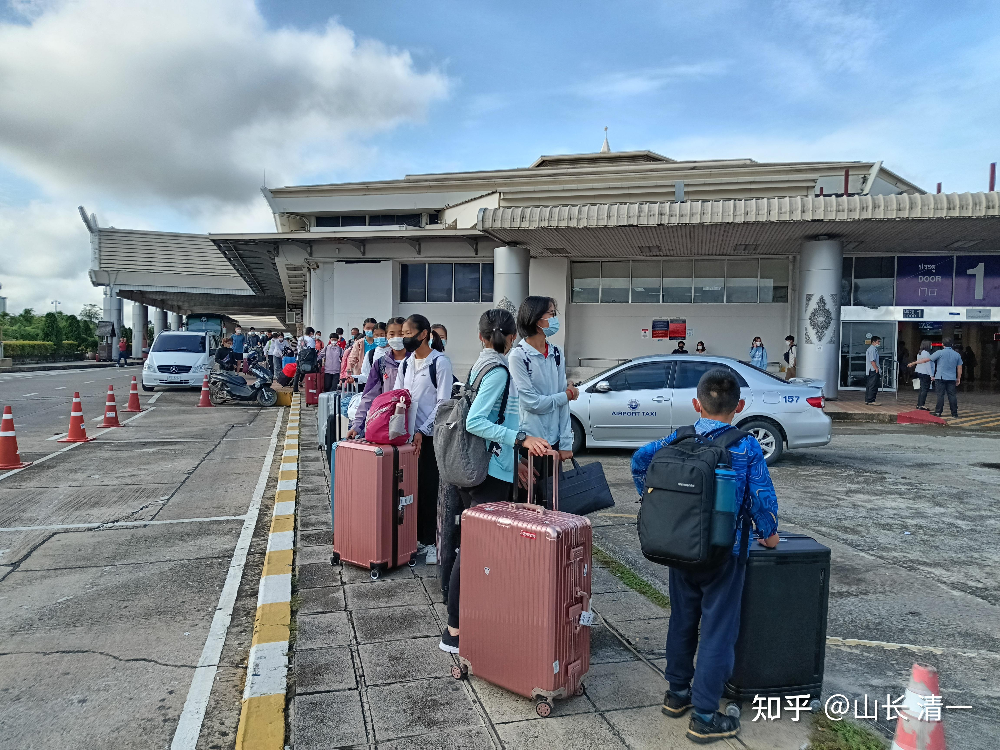

*征泰第三梯队30人（公主班学生）到达清迈*

二梯队，国内武道馆的人已经到达清迈了。昨天，第三梯队的30人，公主班学生也到达清迈。我们的征泰队伍越来越雄壮了。泰拳界注定刮起中国旋风（虽然我们依然有一些阴盛阳衰，女生远远多过男生）。不过，传统文化，是阴在前，阳在后。我们这样的格局，很符合老祖宗的文化传统。