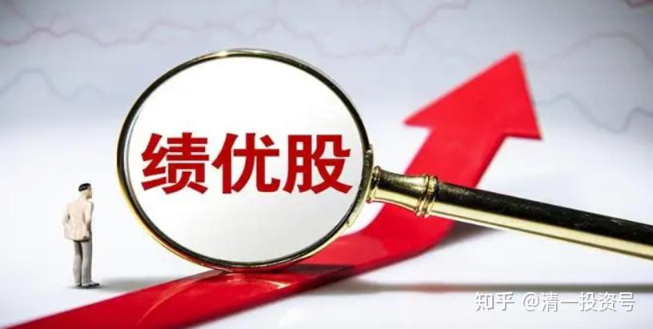

9篇.投资其实很简单，做到30%的年度复合增长没可能吗?

清一山长2014年2月18日

现在中国的市场上，居然给出了很多只要买入后年度分红就可以达到7%～9%的股票，而且这些公司大多数都是可以持续稳定地经营的大型实业公司。这实在是一个惊人的，难以想象的投资机会。如果乘机买入这些可以“永续经营”的公司，今后它们的股价大幅上涨基本是大概率事件。我认为，要获得未来十年十倍的收益不好说，但是十年五倍应该是没有问题的。不过面对如此大好的机会，中国人却去争抢利息不过达6%的“宝宝”们而弃之不顾。让我不禁叹息：中国人太缺乏财富思维了。

当然，您可以反驳我：这个，股市可是有风险的……跌了咋办？

真的，万一您的股票不涨，反而不断下跌，您是不是就“完了”？不一定。如果这真的是一家好公司，您买入后股票下跌，反而可以带来更好的收益。

比如：我前段时间发布的孩子们写的文章《[刘静慧：我的手机价值600万元](http://link.zhihu.com/?target=http%3A//www.360doc.com/content/15/1116/02/16370079_513586430.shtml)/[张钟瑞：人人都有机会成为亿万富翁](http://link.zhihu.com/?target=http%3A//www.360doc.com/content/14/0131/18/175820_349040601.shtml)。》

链接：[https://blog.sina.com.cn/s/blog_4f7cd6a10102e6ls.html](http://link.zhihu.com/?target=https%3A//blog.sina.com.cn/s/blog_4f7cd6a10102e6ls.html)

[http://www.360doc.com/content/14/0131/18/175820_349040601.shtml](http://link.zhihu.com/?target=http%3A//www.360doc.com/content/14/0131/18/175820_349040601.shtml)

计算了加入投资以20%或30%的年化利率增长会带来什么样的惊人结果。有些自以为懂投资的“高手”们纷纷表示，这是不可能的，这只是“理想状态”。好吧！我们看看中国到底有没有这种可能性：

我们目前就不算中国证券市场最高几乎接近10%的高分红率的股票了。我们拿到处都是的，很多5%分红率的股票来说事，怎么样？（以下数据来自网友）

出一道数学题：一个分红率相对恒定为5%的公司，如果买入其股票后，股价随即跌去50%。然后用每年分红的钱再买这只股票。

**第一问：**这样做要多少年才能回本？

答案是14.9年。看样子前途不太好。不算其间机会成本，仅通胀就肯定会让其实际价值下挫一大截，这种股票还能买吗？不过别急，还有。

**第二问：**如果运气不好也不坏，到了第15年，股价又回升到买入价，那平均年收益率是多少？答案是15.24%。年化收益率15%以上，您觉得难道这不是一个很好的投资机会吗？（简单地说，您现在买入一个目前分红率在7%～9%的股票，就算是它跌了40%以上，您也可以得到这笔很不错的收益）

再来**第三问：**如果股票买入后就跌掉80%，您依然用每年相对恒定的分红继续买入该股票，要多少年回本？

实际答案是9.2年。

**第四问：**如果运气还可以，到第10年时，股价又回升到买入价，平均年收益率是多少？

答案有点惊人，30.95%！

这个数据，就比股神还高了。巴菲特的年化收益率，大约是28%而已。

看了这个答案，您看到买入的绩优股跌了，您会担心还是高兴？如果是我，由于根本就没有想卖出手中的持股，因此既然我的股一点没少，而且我还能以越来越便宜的股价买进，我只会越来越高兴——只要公司的经营没有恶化，下跌反而带来了更多的盈利机会。因此，您面对下跌还会烦恼吗？

另外，我们再想想，应该还有更加乐观的可能性：

第一：您的股票在五年、十年之中，总有涨的机会。您总有机会高价把它卖掉的。

第二：我们当然不能保证您买入的公司股票几十年一直坚持分红5%给您，公司总有不景气的时候。但是，我肯定市场上总有5%分红的新公司在等您买入。如果您在股票景气到来，涨价后（分红按新价格算已经没有5%了），您就卖出原有的股票，重新去买股票，但是您依然坚持买入不低于5%分红的股票，您的投资，将轻松超过上面列出来的统计数字。

因为，您买入的绩优股，恐怕也不容易跌，涨起来的可能性很大。如果您选择的股票涨上去的价格，让您用市场价计算，得不到5%的分红，比如只有2.5%的分红率了（也就是说价格涨了一倍），您就卖掉它，重新去市场上买入其他有5%分红率的，被低估的股票。这时候您的资金效率就已经提高了一倍：按照您原始投资的价值来算，您现在拥有的分红率是10%了……您的财富增值速度将大大加快。这样周而复始的继续下去，您认为您能不能当“股神”？我觉得概率还是挺高的。

因为，现在是全球经济时代，您已经可以在全球范围内选股。这样，您在大多数时候，总能从全球数万家公司中，找到愿意给您分红5%公司的机会。因此……您几乎就是赢定了。

**对于真正的投资者来说，时间就是我们的朋友！您需要的仅仅是“耐心等待”。所谓的“财不入急门”。总想一口气吃成大胖子，就只有骗子才能够与您打交道了。**

当然，您还可以坚持：公司的经营不是这么简单的，怎么保证永远有现在的分红呢？其实，我至少可以在沪深股市上找出10家以上的公司，是傻瓜也可以经营的，不用担心倒闭，也没有竞争对手抢饭吃，而且一直有稳定的分红。这些企业唯一的缺点，就是业绩过于稳定，不会大幅增长，因此被市场“抛弃”。其中一家企业，还是素以稳健著称，且近十几年获利水平超过巴菲特的哈佛大学基金投资的对象（进入了十大股东）。难道您认为这些人都不如您聪明吗？我就真的没话说了。

**无知的人，并不因为假装聪明就能获得尊重。无知的人来投资，更不会因为拒绝承认自己无知就能盈利。只要不接受市场，不会分析和了解市场，亏损是常态。因此，国人需要学会投资和理财。我觉得对每一个人来说，这门功课都是很重要的——您可以轻松地享受这个奇妙的世界送给您的美好机会——完全合法的，而且还受尊重的“不劳而获”的机会。**

