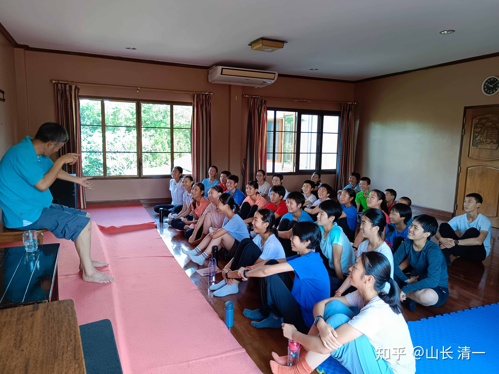
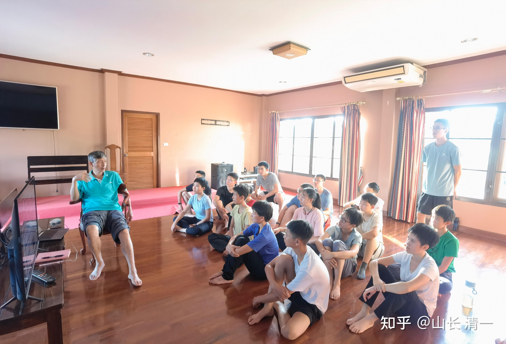

10月8日的世界冠军一战，对手的实力超强，泰国老拳师虽然替木兰安排了这场比赛，但认为佳慧的实力还不行，技术太差，很担心会被对手KO。不过也表示----只会用蛮力的强壮型佳慧（泰国人理解不了“技术明显很差”的木兰居然不断KO泰国优秀拳手，认为是体力超强的原因），与泰国技术最全面的拳手相斗，最终是啥结果？有技术的胜？还是有力量的胜？毕竟佳慧一直都在赢，还KO了一堆的泰国高手。也许比赛会有点悬念。所以老师父还表示：10月8日，他也要跟佳慧一起去清莱比赛现场，做场上指导，防止佳慧被对方黑。由于9月23日的比赛，对方赛前就一直在使阴招。但被我一眼看破，没让对手得逞。泰国拳太成熟了，各种用来对付外国拳手的小手段太多了，连从来没有输过的一个西方的世界格斗冠军，来泰国比赛都吃了大亏，被耍了手段，最终在擂台上被泰拳手轻松击败。所以----小心一点没坏处。

昨天的比赛，对手的心理素质很好，佳慧认为是值得自己学习的。对手被KO后表示不服，说昨天自己的身体状况不好，她以为自己还是有机会赢的。想以后还要和佳慧再打一次。佳慧也觉得昨天发挥并不好，心急了，乱打一气。也想再打一次，将来两人应该还有二番战的。由于昨天佳慧有主动进入内围战的环节，所以今天我奖励了佳慧两罐鱼罐头吃。考虑到她最后还是KO了对手，所以减免了一些数量。这些鱼肉罐头，虽然是人吃的品种，其实我是买来在偶尔需要的时候喂猫狗玩的，放了很久了。没想到被小木兰抢了两罐走。

针对昨天比赛佳慧的弱点---拳力不够，距离控制不好，发挥不太正常。从今天开始，佳慧进入“全力备战”模式。因为对手MAMWAN的拳攻击技术很好，会发出重拳，不仅仅是扫腿厉害而已。技术是非常全面的。心理素质也特别好。上一次的比赛，她把泰国的老冠军都打得满脸是血，场上一直保持优势。我可不希望木兰被打成这样。昨天佳慧急于进攻，就给了对手后手拳迎击的机会，只是对方的拳力也不强，否则吃亏就大了。所以我计划是让佳慧特别加强拳击的攻防练习，避免面对NAMWAN吃亏。正好国内的武道馆人员基本上都到泰国来了，在木兰们离开泰拳馆之后，她们现在终于有了技术能力优胜自己的男拳手来进行场下的每日对练，这对于提高女拳手的格斗技术，是非常有价值的训练。可惜男拳手自己，就很难找到“优于自己的对手”来训练了，只能互相做陪练。即使是泰拳冠军拿来，跟我们训练也难得有提高的机会，还不如我们自己的队友。连两个木兰都认为泰拳男拳手来对练都很难提高自己。

这一次，我找了一个我们武馆实力很强的太极格斗男拳手，来做佳慧的陪练：佳慧未来的七天，都跟该男拳手进行一对一的格斗训练。每天都必须用全力来攻击他，可以发全力，手脚齐出。不用顾忌对手会受伤（男拳手已经练了三年的太极格斗，实际上是很难被击中的）。但男拳手不能全力来反攻，只能发轻力来还击，设法刺点佳慧的弱点，让佳慧补足自己的防守短板。这两个一直留在清迈练拳的木兰，有一个比国内的拳手更弱的点，就是缺乏拳击的训练对抗技术。两人只是在腿法上表现更优一些。但在拳法上，我们的国内拳手更优。所以现在两人要趁机补上这一弱点。我相信训练7天后，NAMWAN将遇到一个很不一样的木兰佳慧。七天专项训练，已经足够她升级换代了。下次佳慧出拳，肯定就不会像昨天哪样无力而且缺乏准头了。天天跟男拳手打，不长点经验值是不可能的。木兰们一直没有全力对战真人对手的实践，只有全力打沙袋，打得再好，跟打真人还是不一样的。这一次，每天与比自己实力更强的男拳手来打，还要求每次使全力来打，没有顾忌的真打。我相信七天后，佳慧会很不一样的。

我告诉男拳手：一个月后，他们将与泰国的男拳手对战。泰国男拳手力量速度肯定优于木兰。现在被木兰使劲打一顿，将来就可以不被泰拳男生打上来了。相对还是更划算的。

另外。昨天我发了节日文，却被和谐掉了。不知道啥原因。就是介绍我们这一天在做什么，以及介绍了明晓的一战，没啥敏感内容的。居然被和谐?现在啥不能说，我都不知道了，打泰拳难道也犯忌讳吗？

咋天开始为期一个月的泰拳馆卧底行动-----清一武道馆，将发表【泰拳技术解析 探营卧底日记】。我们派出两个武道馆的优秀太极拳手，作为卧底“潜入”有多名冠军拳手的泰拳训练馆训练一个月。并把每天的训练心得分享给大家。

由于国内来的大部队，从未学过泰拳。但为实现“知己知彼”的目的，我们特别派了一男一女两拳手去“探营泰拳馆”、合法“卧底”----—其实就是花一些培训费，去优秀的泰拳馆培训和学习泰拳。这个就是木兰们原来去的拳馆，馆长和泰拳馆军拳手们都非常欢迎我们。未来的30天，他们将把自己的训练经历，认真写出完整的泰拳研究学习训练的体验日记，供以后打泰的中国传武人参考。毕竟都是学霸，写东西对他们来说毫不费力。如果其他门派有真传的传武人，可以借此有样学样。我相信未来泰拳，会被中国功夫彻底了解，并“彻底摧毁”的。

[清一武道馆：泰拳馆训练日记：第一天](https://zhuanlan.zhihu.com/p/569988987?utm_source=qq&utm_medium=social&utm_oi=1346961280293593088)

想了解真实的泰拳？不是专门接待外国人，而是只接待专业拳手的优秀泰拳馆，是怎样训练拳手的？你们就去看清一武道馆的探馆训练日记吧。我就推一次，供对格斗技术有兴趣的拳手去研究。其他人。想看就看，不想看就算了。

*第三批征泰队员：公主班的课堂实况*

*正在给第二批征泰队员：给武道馆复盘佳慧的比赛*