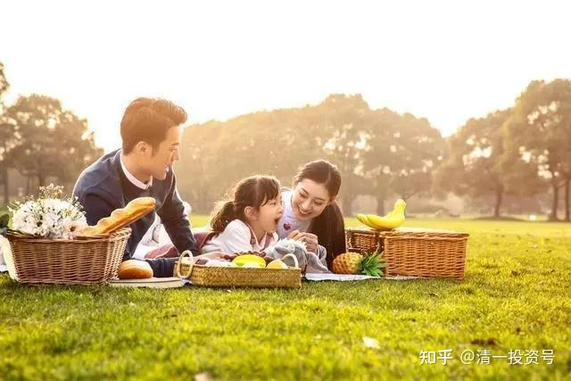

[原雪球专栏](https://zhuanlan.zhihu.com/p/569432171/edit)**[145篇.沟通训练：怎样做孩子的贴心朋友，以及做真正的导师？](http://link.zhihu.com/?target=https%3A//xueqiu.com/9310099567/177733228)**

**[清一山长](http://link.zhihu.com/?target=https%3A//xueqiu.com/9310099567)**2021年4月21日

**学堂教师内训示范课**

【[lucky-ji](http://link.zhihu.com/?target=http%3A//xueqiu.com/n/lucky-ji)：谢谢山长慈悲循循善诱的教导我们，但是青春期的孩子特别不喜欢家长给他们讲一些“不要在意别人的言行，做好你自己就可以了”、“你改变不了其他人，只能改变你自己的内心”……类似这样的话，她们说不喜欢鸡汤，不喜欢洗脑，怎么办？

青春期的孩子涉事太浅，遇到班级小团伙孤立，遇到春心萌动的事情，孩子自己真的是非常焦虑和痛苦，以至于引起身体不适的严重症状：严重失眠和吃饭吸收不好。

好像对青春期孩子没法用直接击中痛处的方式唤醒她们，在大人眼里这都是小事，可对青春期孩子来说就是不能承受之重，最近在反复体会山长的文章和刘老师的书籍，也发出了申请，希望有机缘得到山长或者刘老师的疗愈。
感恩山[长和](http://link.zhihu.com/?target=https%3A//xueqiu.com/S/00001%3Ffrom%3Dstatus_stock_match)刘老师！】

“不要在意别人的言行，做好你自己就可以了”、“你改变不了其他人，只能改变你自己的内心”

这些话，没人喜欢听，很空洞。除非，你能**用他们理解、并认同的方式，把这个原则换一种简单、通俗，她完全能够共振的方式来告诉她。**

孩子不是不知道这种原则，文字谁都知道。是不知道如何具体实施这个原则，也不知道她内心的感受。你该**告诉她具体怎样理解，怎样做，而且同情和理解她的感受**，这样她才会听你的。不然的话，自然跟你逆反。因为你没真正帮到她。
你们看我跟孩子沟通，可能会说：“我也是这个意思！”、“这样也不难嘛？”都是大白话。但为啥孩子不听你的，听我的？因为你们只会贴标签，我会落到实处，跟孩子的心相印。

第一次沟通训练：“不要在意别人的言行，做好你自己就可以了”、“你改变不了其他人，只能改变你自己的内心”，请把这两句话，写出两段情景对话来。尝试与这种青春期的学生进行模拟对话。不许用描述句子，创建一个对话模式，写出来。

作业评估要求：如果写的对话内容，是不符合场景，不可能出现的，臆想的对话。可以判断为该教师不懂沟通。未来也将进行真人对话，来讨论相关话题。

“不要在意别人的言行，做好你自己就可以了”细节解析示范：

孩子：我这一次的考试没考好，成绩靠后，我觉得老师和班上的同学都因此而看不起我、不理我，我很不理解：难道一次没考好，就应该被鄙视吗？我原来考得好的时候，也没有去鄙视其他成绩差的同学！

家长：喔！别担心，你就算这一次没考好，你也是我的乖女儿。我知道你已经努力了，我不会鄙视你的！（打岔，不去直接说问题，解决问题，而是同其情，也跟对方有认同感、接纳。让孩子不至于抵触，才能开展后续的说服工作。要是家长直接说：“你不要在意别人的言行，做好你自己就可以了。”孩子本来受到了打击，心灵就更脆弱，对这种套话很反感，就会直接翻脸：算了，我不跟你说了。两人造成了代沟。）

孩子：要是我们班上的同学，还有老师，都像你这样理解我就好了（放松）。

家长：老师难道也鄙视你吗？她做了什么？骂你了吗？（一样，关心、同情、鼓励她说出更多的不满。）

孩子：老师倒是没直接鄙视我。但她看我的眼光就是有点不开心，说：为啥你这一次考试比上次差多了？对我比较冷淡。她对其他考得好的同学笑得都更好看一些。

家长：我觉得老师这样说也很正常的。就像你没考好后告诉我，我虽然也一样会爱你。不过，如果你告诉我你考了第一名，我肯定会更开心的！（教孩子理解别人，理解老师）

孩子：我最讨厌这次考得好的同学，一脸得意洋洋的样子，好像他们就比我更高级一样。（表达愤怒）

家长：我也理解你，我买的股票一直没涨。其他家长买了赛道股的却涨得很好，赚了很多钱，他们也很得意。（同其情也，让孩子意识到：家长也有家长的烦恼。）

孩子：这些人真是的。股票赚了钱，也不是他们的本事，有啥好得意的？你的股票就算没赚钱，但你也是我的好妈妈！

家长：谢谢宝贝这么理解我，没有鄙视我不如别人会赚钱。我嘴上不说，其实心里也很难过：为啥别人的股票都赚钱，我的就是拿了五年的股票都没涨？我想努力，都不知道咋努力。不像你，不满意自己的成绩，还可以自己更用功一点。我也想早上五点钟就起床来看盘，如果这样可以让我的股票涨起来的话。可是市场总是9:30才开盘，我想提前加班都没用。（故意说笑话，转移孩子的注意力）。

孩子：股票涨不涨，是市场决定的，你个人努力有啥用？（让孩子也有机会装一次大人，安慰家长。）

家长：你说得对。市场怎么动，我其实一点办法也没有。别人赚不赚钱，跟我其实没关系，我只能做好我自己。比如，现在我只能耐心等待我的股票涨，如果我现在马上放弃了，自己去追涨了很多的赛道股，可能不但不赚钱，还会赔钱。

家长：其实妈妈好羡慕你们当学生的。我现在是想帮帮我买的股票的忙，帮它拉涨，都不知道咋帮。我的努力，几乎就是一点也没用。我去分享，想让别人也买这支股票，但都是被别人嘲笑一顿，说我拿一个万年不涨的股票去忽悠人，我还被骂用心不良，拉人上套。所以，我只能自己默默地等。但你如果对自己的成绩不满意，你还可以自己行动，来改变成绩的呀！比如：你可以去学习了解，为啥一样努力，别的同学就是比你的成绩好？也许你需要改变学习的方法？（其实是用闲话来暗示孩子，你是不是没有足够努力，才导致成绩下降的。但不明说。）

孩子：好学生都看不起我，不理我。她们才不想帮我呢！（陷在情绪中，去找别的点，绕开自己的责任问题。）

家长：你去试过吗？如果你谦虚地请教她们，她们态度也不好吗？另外，你还可以问老师，让老师帮你忙，老师肯定不会不管你的。

孩子：老师对我说话也不好听，总说我啥地方没做好，我不喜欢。

家长笑：你要老师表扬你吗？某某学生真棒，这一次考试，比上次又降了一级！

孩子：（无语，不好意思。）

家长：老师的任务，就是指出你存在的问题，要改进的方向。你只喜欢听好话，老师也帮不了你。难道老师说的话是错的吗？

孩子：当时觉得不好听，不客观。不过后来想想，老师说的其实是对的。

家长：你喜欢别人用你喜欢的方式来跟你说话吗？谁都喜欢，但其实你做不到。老师和同学，说什么、做什么，是他们自己决定的，不是你决定的。你喜欢不喜欢，结果都一样。你认为呢？

孩子：是的，我改变不了他们。

家长：是的，但你居然为别人的言行而不开心，我看就是有问题。是你自己折磨自己了。我看到猫不去厕所拉尿，我就生气，我是不是自己找抽？跟一只猫过不去？

孩子：可是我就是不高兴。

家长：**除非你可以改变别人，否则为别人而生气是很愚蠢的。**除了妈妈，别人也不在乎你高不高兴，只在乎你优秀不优秀。你有时间不高兴，还不如用这功夫来改变自己，提高自己。比如，如果你没法让别人不骂你，你就必须改变你自己对别人骂你的感觉。不要因为别人骂你而生气！不然你会气死的。因为世界上，每个人都一定会被别人骂的，越是名人，被骂越多。别人骂你是对的，你不服也得服。就像别人笑话我股票没赚钱，我不服气有啥用？如果别人骂得不对，是他错了，你干嘛要生气？别人骂你的成绩差，如果是事实，你生气也没用。不如认真的反思和努力，下次比他考得好，气死他！

孩子：对，就是这样！我就要气死看不起我的人。

家长：这才是有志气的人。还有，我刚刚听你说：你最讨厌成绩好的学生？

孩子：是的，成绩好的人，就是很讨厌！她们一脸的神气样，很了不起的样子，我看了就生气。

家长：就算是有人真的讨厌，你去生气和讨厌，是自己受罪。划不来。不过，如果你因为别人的成绩好，而去讨厌别人，你就麻烦大了！

孩子：为啥？

家长：因为根据吸引力法则，你讨厌什么，你就得不到什么。你喜欢什么，什么才会来到你身上。如果你讨厌成绩优秀的学生，以后你的成绩一定不会好。就像看别人股市赚钱就生气的人，一定是赔钱的。你应该去喜欢优秀的学生，跟她们做朋友，赞赏和学习他们，这样，你才能提高成绩。所以，你越讨厌比你优秀的人，他们以后会越优秀，而你就会越糟糕。所以，你千万不要有这种心理！

孩子：那，成绩优秀的人，鄙视我就是应该的吗？（小孩子，就是要不服气，什么都想找茬。）

家长：其实呢！根据吸引力法则，厌即是恋。如果他们鄙视了你，这种负能量，会让他们以后遭遇一样的被鄙视。因为由于他们“喜欢鄙视”，鄙视就会来到她们身上。所以，你就算有做得好的地方，也不要去鄙视别人。

孩子：原来是这样的吗？

家长：是啊！所以，如果你认为别人做错了，是别人的事情，你不用去操心，你要把心思用在自己不犯错误上。比如别花心思去生气，去看别人的脸色，去东想西想的。而是自己去好好学习，提高成绩。因为，有时候你认为别人鄙视了你，不一定是真的，也许只是你自己的感觉；可能优秀的学生，根本就没空去想你的事情，她们只是专心自己学习罢了；也有可能你的脸色不好看，一副不喜欢她们的样子，她们就远离你罢了。这样是你自己的损失！

孩子：好的，我知道了。我要把心思用在自己身上，不要去管别人怎么想，怎么说！

家长：没错，妈妈就是这个意思。你自己才是最重要的，最需要你来关心和帮助的人！先要帮好你自己，再去管别人，帮助别人！（完结，不再啰嗦——）

好了，我们聊聊别的事情。你还有啥想告诉我的？

**这文章值多少？至少一万元喔！**因为我的沟通费是每小时一万元。未来，这种本事很值钱的！你们好好学吧！这里免费提供。

我们的教师都在训练这种方式，排名靠后的，就直接淘汰。我们不要不会跟学生聊天，不会做知心姐姐、知心哥哥的教师。

如果善于沟通，喜欢沟通的人，可以找我们申请入职（请注意，**喜欢沟通，善于沟通，并不是喜欢说话的人，有人喜欢说话，一堆废话，还不如不说**）。体制内学校，不培养这种能力，要么培养书呆子，不会说话；要么培养祥林嫂，自说自话。我看雪球上，自说自话的人不少。比不说话更令人讨厌，我常常看见了就拉黑。避免智商受损！

会像上文中这样说话的人，在社会上，是“很值钱”的人。你们设想一下：假如我是房地产的推销员，拿业绩吃饭。我会跟客户用这种方式沟通、交流。你认为：我一年能挣多少提成？绝对远远高于一般的打工收入、工程师收入；去当咨询师，更是高收入；当教师，也是学生最喜欢的教师；去企业，很快就是当管理人员的料。

这就是**清一大学教“人学”的价值。兼容性特别强，只要是人做的，我们都可以做。**其实，这种人才，也**是社会上最稀缺的人才，比啥理工科人才缺多了。**很遗憾的就是：全社会就没有一所学校培养这些东西。学起来，也没有你们想象的这么好学，挺难的。因为**要改变自己的思维方式和心理范式才能做到。**

我们正在做这种教育，不过，虽然所有的学生都在学我们的“人学”。但**我核心的“人学教育”，集中的“沟通交流教育”，主要集中在未来准备做新教育的师资预备班**。其他普通班级，主要用于学美国12年课程，要考SAT。剩下的时间，能学多少，再学多少。很多学生和家庭，都要去考国外大学的，咱们不能耽误了家长的要求和目标。客户满意度才是最重要的，别拿我认为最重要的东西来教学生。而是**必须教家长认为最重要的东西**，比如SAT成绩。现在泰国我身边的几个学生，**我教的最多的，就是“说话、做人、做事”，教态度。不是教啥技术、知识。**别人看我“带兵”，不知道我教了啥。但这些学生，未来出来带班之后，学生最喜欢，秒杀体制内的大学生、研究生！根本不是她们的对手。她们根本就不拿SAT当回事，将来也不准备去考美国大学。她们将来最多去上上泰国的大学，去交朋友，不是学东西。**现代的大学，真没啥有价值的可以去学。只有有价值的朋友，可以认识一批。**

（以下内容为编者收录）

**评论回复：**

**[ellhll李华丽](http://link.zhihu.com/?target=http%3A//xueqiu.com/n/ellhll%25E6%259D%258E%25E5%258D%258E%25E4%25B8%25BD)回复[清一山长](http://link.zhihu.com/?target=http%3A//xueqiu.com/n/%25E6%25B8%2585%25E4%25B8%2580%25E5%25B1%25B1%25E9%2595%25BF):**

感谢山长的分享。

山长说：“用他们能理解，并认同的方式，把这个原则换一种简单、通俗，她完全能够共振的方式来告诉她”。秘诀是**“共振”**，而一般人却是用**“对立”**的方式把孩子推开。

一般人对孩子的情绪，是**“对立”**处理方式：

1.交换：用其他东西转移孩子的情绪（逃避）

2.惩罚：威胁或指责孩子的情绪（打击）

3.冷漠：让孩子自己去冷静或想办法（孤立）

4.说教：对着孩子说很多应该不应该的道理（抗拒）

山长示范的对话是**“共振”**处理方式：

1.接受：注意并接受孩子有这样的情绪。

2.分享：引导孩子分享情绪，再分享事情。（换位分享我的类似经历）

3.肯定：先肯定他可以肯定的部分。（换位让他来肯定我的做法）

4.指出：引导他看到自己的问题，找出需要改变的地方

5.策划：引导孩子对未来采取更合适的行为

1、2、3是为了让孩子觉得【我跟他】是共振的，我和他是一队的；所以到了4、5，孩子很自然地【他跟我】共振了。最后达到对话的目的：引导孩子看到问题，解决问题。

但是看到后面有个地方有点困惑。昨天和一个年轻人对话【宇宙吸引力】，就提到【厌即是恋】：你越讨厌的一个东西，越会被你吸引过来。山长示范的对话后面提到：

【你讨厌什么，你就得不到什么。如果你讨厌成绩优秀的学生，以后你的成绩一定不会好】——讨厌所以得不到

【厌即是恋，他们鄙视你，所以他们也会被鄙视】——讨厌所以得到

这不是矛盾了吗？恳请山长指导。

**[清一山长](http://link.zhihu.com/?target=https%3A//xueqiu.com/9310099567)[2021-04-21 16:24](http://link.zhihu.com/?target=https%3A//xueqiu.com/9310099567/177771637)回复[ellhll李华丽](http://link.zhihu.com/?target=http%3A//xueqiu.com/n/ellhll%25E6%259D%258E%25E5%258D%258E%25E4%25B8%25BD)：**

爱钱之人，就能得到钱吗？未必。如果这样，股市上的人，都是来赚钱的，都富了。

恨钱（仇富）之人，会富裕吗？肯定不会!

**只有“身心富裕”之人，“我是”之人，才能真赚钱。**你去好好悟一下，弄懂赚钱的道理，你就明白吸引力法则了。

**[ellhll李华丽](http://link.zhihu.com/?target=https%3A//xueqiu.com/3931532042)2021-04-21 17:24回复清一山长：**

爱钱的人，心理是：我要钱，因为我没有钱，我是没钱的人。

所以宇宙说：是的，你就是没钱的人。呈现的就是没钱的结果。

仇富的人，心理是：我憎恨富人，因为他们和我相反，我是穷人。

所以宇宙说：是的，你就是穷人。呈现的就是穷人的结果。

**“我是”**是最有力量的一句话，是最能实现的祈愿。

所以**“厌即是恋”**，得到的是厌的结果，还是失去厌的结果，主要看这个发出者的心，真正发出的是什么样的**“我是”**。

上述的示范，讨厌成绩好的人，就是**“仇富”**心理，就会得到和成绩好相反的结果。

鄙视同学的人，反射的是他的内心，他其实就有他所鄙视的东西，所以他就会得到鄙视的结果。

谢谢山长的启发，我想我理解了。