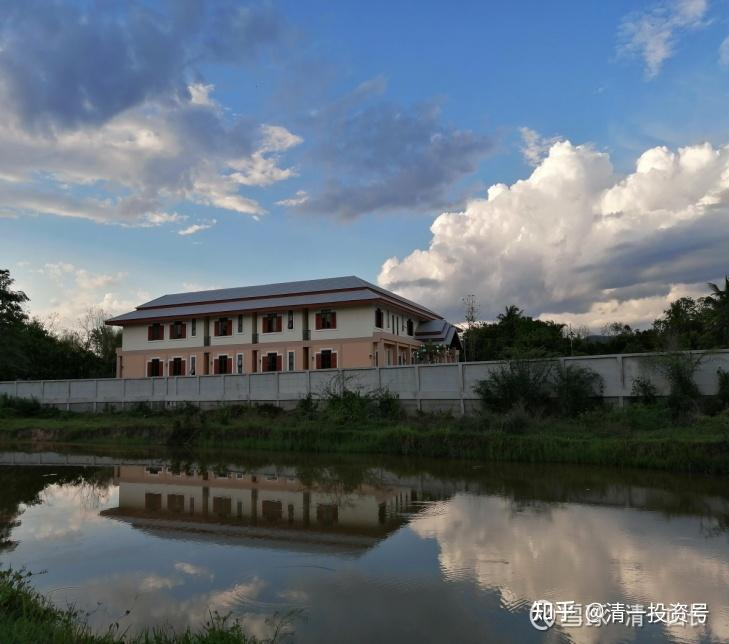
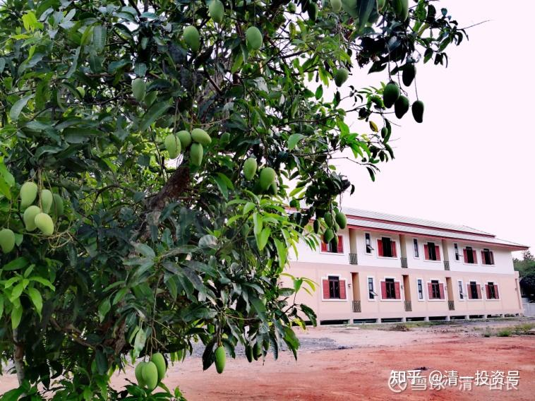
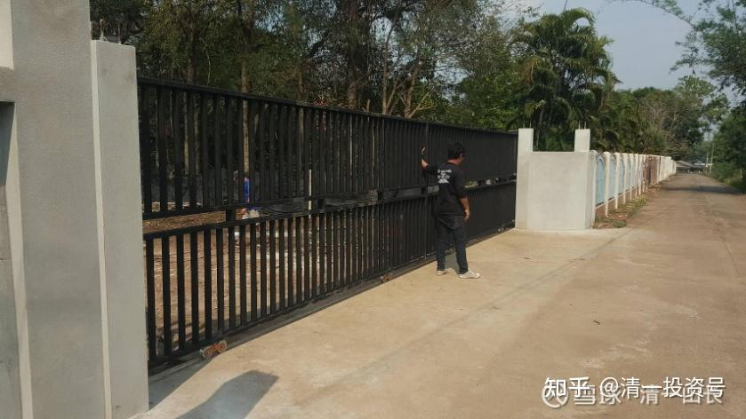

[原雪球专栏](https://zhuanlan.zhihu.com/p/570344024/edit)[147篇.不考选，不淘汰的今日学堂2022年开启招生！](http://link.zhihu.com/?target=https%3A//xueqiu.com/9310099567/178075103)

清一山长2021年4月24日

清粉圈的家长会抱怨：要考今日学堂，比考985大学还难。（15岁就要考到SAT 1400分，的确难）[俏皮]

现在，这所全国性的精英国际学校，学生零门槛入学的机会来了！[微笑]

**今日国际学校**，已经在去年年底就正式申请，并获得了所在海外某国的教育部门审批，成为一所正式注册的新型国际学校。在教育目标，教育理念，以及教学方式上，它是完全延续了原来建立已经18年的今日学堂的教学风格，并进一步深化，完善的结果。

2022年9月份，首批国际今日学校120名学生，将正式入学国际今日学堂。那么，这批学生，与原来的今日学堂学生，有啥联系和区别？教学原则有啥不同？

在教学目标，教学原则上，教学方式上，本质上，是没有不同的。实际上，**原来的今日学堂，以及清一学塾的学生，均依然归属于新的“今日国际学校”**。学生们都在同一个学校上学。只是在对待学生的细节上，有一些重大的区别。主要就是：新的今日国际学校，是一所**不筛选学生的学校**。我们将友好地打开我们的胸怀，拥抱每一个符合入学条件的学生（拥有今日国际学校学位的家庭）。您的孩子，可以在这所学校从小学一直读到高中毕业！中间不必要经过严苛的淘汰才能升学。当然，有实力的学生，也可以竞争以“**校内校**”形式继续存在的**“今日塾”**和**“清一塾”**。这两所学校，也在今日国际学校里面，依然会以原来奉行的精英教育模式为主，继续存在下去。并对全国进行招生和考选优秀学生。

没有考上今日学堂的学生，以及原来被分流出来的学生，如果想要回来上学，都非常的欢迎：加入今日国际学校！

**区别一：寄宿制与走读制的差别。**

原来的今日学堂，是实行寄宿制的。完全脱离原来的家庭，学生在学校里面寄宿，过集体生活。有些家长，舍不得孩子离开家庭，认为家长应该陪同孩子共同成长。所以不愿意送孩子离开家庭，去远方上寄宿学校。就算是去海外低龄留学，中国的家长都要不离不弃，放弃工作和生活，跟随孩子去陪读，毕竟母子情深。但原来的今日学堂，由于没有固定的校区，所以无法满足家长的这种走读需求。现在国际今日校区，已经在海外正式落地。学生宿舍、教师宿舍，以及家长公寓，都在抓紧建设中。将来我们按照国际惯例，可以给家长提供在学校附近就近居住、生活的便利条件，提供走读生的入学机会。方便孩子与家庭生活同步（当然，这些家庭，也可以选择与老今日一样的寄宿生活，我们的寄宿制依然会运行下去的。您只需要另外支付一笔寄宿费、生活费给学校就行了）。

**区别二：淘汰制与普惠教育的区别。**

今日学堂，奉行精英教育的原则，一贯实行淘汰制。这是让很多家庭感到抓狂的地方，也是“清黑”对今日最不满的地方，让我们招引了无数的骂名。我们知错就改，新建设的今日国际学校，就不淘汰筛选学生了。但由于今日学堂，依然要专注于提升和建设世界名校的目标，每年也只能严格选拔学生，只招收极少数的学生入学，所以无法满足所有家庭的需求，而今日国际学校的成立，可以满足家长免于淘汰的压力，学生可以从小学一直读完高中。中途除非调皮捣蛋，影响和破坏学堂的教学环境，否则不会因为成绩不好，而被学校淘汰退学。这一条，也跟现在的国际学校接轨。给学生更多的教育机会。这对于一些中国的高端家庭来说，担心孩子的学习压力大，淘汰制太残酷，这样就减轻了很多压力了。所以，自己比较进取的学生，优等生，可以继续去考选依然实行淘汰制的**“今日塾”**、** “清一塾”**班级。其他资质一般的学生，可以上其他今日国际学校的普通班！不实行淘汰制，一直跟班到考大学为止。

**区别三：入学要求不一样，毕业考核标准一样。**

原来的今日学堂，对入学的年龄和学生的学习力都有要求。满11岁才可以申请入学。由于申请人数众多，需要考选才能进入。因此家长不得不在家按照新教育的模式来教学，备考。现在的今日国际学校，放宽了入学要求。2022年的首批学生入学申请年龄范围，为7～10周岁。由于未来不淘汰学生，所以这批学生可以一直到18岁，都可以留在国际今日学校读书，除非家长自己想要退学。

至于毕业标准，还是一样的，我们用美国SAT考试来作为您孩子高中毕业的考选标准之一。这个成绩，也是世界大多数大学认可的大学入学学业考查成绩。

简单地总结一下：**今日学堂和今日国际学校，教学的方法和原则，教师都是一样的。不同的是学生**：今日学堂的学生，是经过层层考选，严格精选的，而且实行淘汰制。学生还要每年PK，升级、降级的。而今日国际学校的学生，就不用这么担惊受怕的了。是我们新推出的“温柔普惠教育版”，承诺不拉下任何一个学生。只要你想要学，就永远给机会！我们被黑太久了，也想改变一下形象，我们会温柔一点的。原来的今日学堂，是因为生存条件太恶劣，逼得不得不大量淘汰学生[微笑]。因为我们必须拿出靓丽的教学成绩，当然不能陪平庸的孩子，平庸的家庭慢慢地混日子。**如果我们拿不出优秀的教学成绩，连活下来的机会都没有，更别说啥普惠教育了。**所以，抱歉原来的今日学堂的淘汰做法，大家的压力都太大了（老师的压力其实也很大的）。

当然，我们猜测：改革之后，想要进入今日国际学校的人，恐怕比想进今日学堂的人更多。原来的今日，学生的成绩好得不像真的，也让很多家长不敢送孩子来参与这样的精英集团作战。觉得孩子表现实在太平庸了，又不甘心去是体制内学校废掉。所以家长们也很纠结。所以，原来的今日学堂，就像[贵州茅台](http://link.zhihu.com/?target=https%3A//xueqiu.com/S/SH600519%3Ffrom%3Dstatus_stock_match)一样，高高在上，一般人买不起。只是一批精英学生玩的教育游戏。现在我们推出了普通版，工艺、品质，制造流程都一样的“贵州茅台镇酒”，只是包装不一样，喝的场合不一样。不能用来送礼，但很实惠，入门门槛就低多了。当然，由于需求量大，供应有限，为了保障教学质量，不粗制滥造，所以我们只能实行学位制度，慢慢扩大。计划就是每年提供120个新的学位，慢慢稳定发展。12个年级，最终也许1200个学生就停止数量上的发展了。学生每年换届。

更简单一点说：**原来的今日学堂是“拼娃模式”**的。只要你的娃不错，我们一分钱学费不要，倒贴钱，也会录取您来上学的。如您看到的**“示范班”**。学费免了，食宿费免了，零费用入读。[今日学堂示范班视频直播链接](http://link.zhihu.com/?target=https%3A//space.bilibili.com/487498588)。以后，这个示范班，依然会存在的。

**今日国际学校，是“拼爹模式”**：你家娃，实力差点没问题，我们愿意陪他慢慢成长。只要爹妈有足够实力就可以了。如果爹妈拼不过，娃也拼不过，争取不到学位，就上不了今日。（其实也可以上的，在家自己跟学就行了。我们都已经把课程内容公开了。

网页链接：哔哩哔哩网站[这就是今日学堂](http://link.zhihu.com/?target=https%3A//space.bilibili.com/487498588)

[https://space.bilibili.com/487498588](http://link.zhihu.com/?target=https%3A//space.bilibili.com/487498588)）

**这是我们为中国富裕阶层，追求更高教学质量，更好教育机会提供的优质教育解决方案！**毕竟——我们不能老做公益对吧？**私立学校，必须有利润来源，不然咋维持？**总不能找组织去要吧？所以，**家长们自力更生，一起来创建中国的世界名校。**

您会喜欢这样的今日国际学校吗？如果喜欢，就开始争取，申请入学吧！

**“三年学完美国十二年”**，这是今日学堂的教育目标和口号。简单地说，就是要击败美国，**为中国争取未来教育的制高点。您可以出人来战胜美国，我们出钱来支持优秀的孩子。也可以出钱来帮助我们建设美好校园**，击败美国。我们都欢迎！

这是去年落成的**泰国清一书院**！我规划设计的中国新式四合院格局。泰国人觉得很有创意。就在我现在住宅的旁边。原计划冬天就接待学员来访的，结果疫情导致一直空置。围墙外面这个空地，是**“皇家用地”**，相当于公共绿地，有好几十亩。接下来是一条小河。河边就是主要的道路了。环境很优雅。这栋楼，有56个房间，总面积2000平方，可以容纳上百人。将来也就是我们的**养老院**（今日国际学校不在这里，正在建设中。有数百亩地，在另外一个地方）。

下图是正在建设中的泰国清粉社区，我们刚建好的大门。这里圈起来上百亩地，原来是英国人的花园，被我买下来了。就是围栏中的位置。这里面有一颗几十年的龙眼树，每年结果上千斤。还有其他的很多果树，多到吃不完都掉地上[大笑]。

清一山长2021-04-24 16:14

说明一下：刚才已经有球友私信问我如何买学区房。我需要在这里特别补充说明一下：我发此文，不是给雪球球友推销，做广告的，大家请别误会。基于自尊尊人，我不对球友推销任何东西。不荐股，也不推销啥东西，不找你收费啥的。我文中介绍的今日学堂学区房，由于数量很少，**只提供给内部的清粉和家长们订购，不对外**。每年一百套，我们自己内部都不够用的。所以，雪球看客们，其实是没有申请机会的，你看我根本就没有提供啥电话联系方式啥的。我只是说说而已，让各位知道：**中国有人在做不一样的教育。有家长在选择不一样的生活。不是全国一盘棋，只有体制教育。**你们知道有这回事，就够了。别以为我在这里推销啥学区房，以及做广告宣传学堂啥的，**我不推学位、不做广告、不招生，就是说了玩的。**谢谢大家！

（以下内容为编者收录）

**评论回复：**

**奇幻沙漠回复清一山长：**

大一点的孩子有机会吗？13岁了。

**清一山长2021-04-24 16:59回复奇幻沙漠：**

有考的机会[笑]。两年后，15岁，考过SAT 1400分，就可以免费录取今日高中[献花花]！

**清一山长2021-04-24 22:01**

清一大学首届西语专业本科少年班学生，平均年龄16岁，在北京塞万提斯学院的考试现场与院长的集体合照。（**成绩说明：西语班23人，学习13个月后正式参加考试，取得C2证书两名，C1证书8名，12人获得B2证书，一人达到B1水平**），这个班级成绩，绝对秒杀任何中国顶尖外国语言大学。示范班、清一大学少年班，均在等你！各位免费不来，难道等花钱来吗？免费示范班的考选，暑假举行。清一大学的考选，有点麻烦，疫情导致海外考试机构停摆，也许会影响考试。今年给了一个备用方案：今年开始学西语，明年9月前，拿欧洲语言C1证书来，不用SAT成绩，也免费入学！

**感恩指引回复清一山长：**

请问山长，假如买一套学位公寓，家里有三个孩子，是只有一个孩子有学位？还是三个孩子都有学位？谢谢！

**清一山长2021-04-25 14:58回复感恩指引：**

可以轮流使用学位呀？一户家庭。你们一家五口人，难道一定要装备五个卫生间吗？轮流用不就行了[大笑]

你们还可以考免学位要求，只有成绩要求的今日塾、清一塾。干嘛死守今日国际学校不放？

如果想消费，就做个好消费者。要三个名额，就买三套房子。目前每套公寓，学区房才50平方，不够一家五口用的。卫生间，阳台都只有一个[大笑]。也许你们要五个阳台才够一起休闲晒太阳[大笑]

**自律自助回复清一山长：**

有学区房的家庭，该家庭符合计划生育的小孩都可以就读所在学区，三个小孩，如果没有违反计划生育，就可以上。如果超生了，第三个不知道能不能上。今日学堂不知道是不是按这个规则[大笑]

**清一山长2021-04-25 19:41回复自律自助：**

据我所知：国内知名小学的学区房，是六年内只有一个学位的。不然，家长拿到房子后，孩子一入学，就卖掉房子。新业主又拿房子去申请新的学位，这学校可对付不来这种中国式聪明[大笑]。并不是你说的这样。当然，少量的例外，因根据情况特别考虑的。

今日国际学校的学位房，是定学位，送房子。不是因为房子而送学位，两者不一样的。

**胡丁壬Paloka妙声回复清一山长：**

我十年从教“华圈与蒙圈”育儿（俩幼子）想申请跟山长老师学习，愿从长而学，升华自己。

**清一山长2021-04-27 08:00回复胡丁壬Paloka妙声：**

我的身边，只带小孩子跟学，跟做事。这样容易出成绩。比如你看的明颖、明仪这样的孩子，3700万人就找不到对手[大笑]。你们**成年人，大人，就只能自助天助了，自己跟学。**不能来我身边。现在身边正在带超越明仪、明颖的人。除非你认为你能超越他们，否则没机会来我身边的。自己通过网络自己学吧！有这么多的资讯，你十年也学不完的。[献花花]

你**有孩子，好好跟示范班课程就够学了。**上面的**老师，全都是我教出来的，代表我们的水准。**当然，现在我正在培养的下一代老师，会更厉害的。