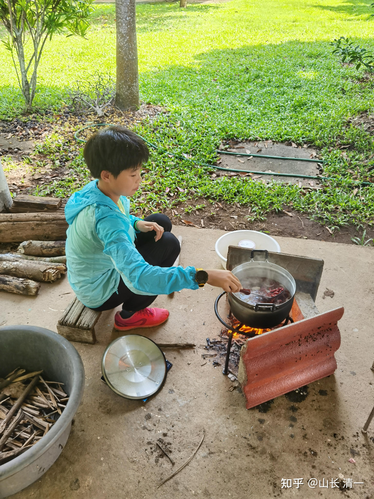
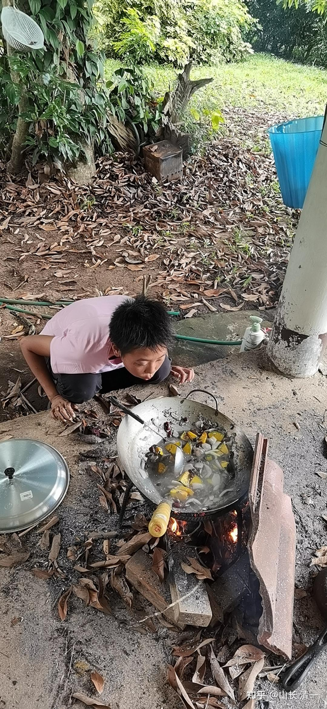
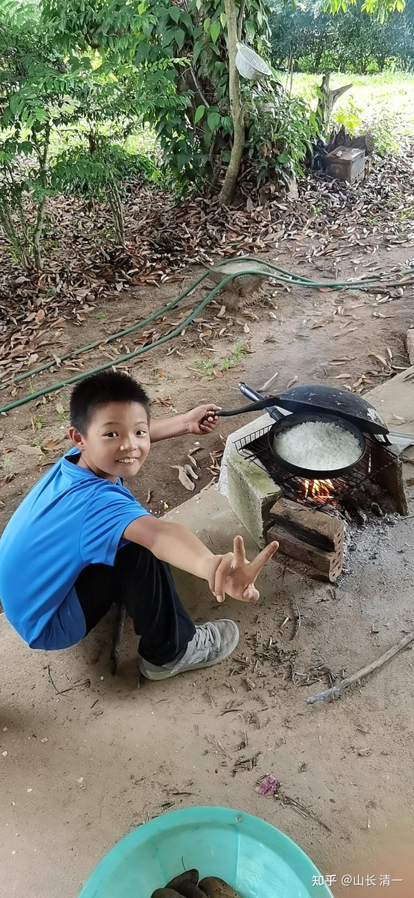
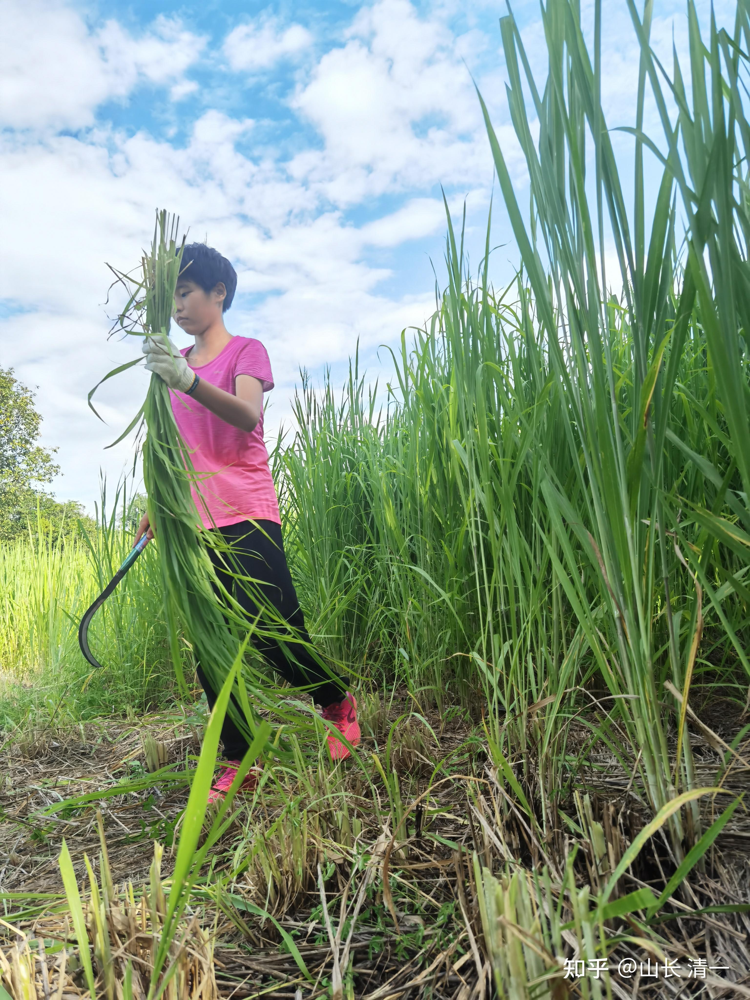
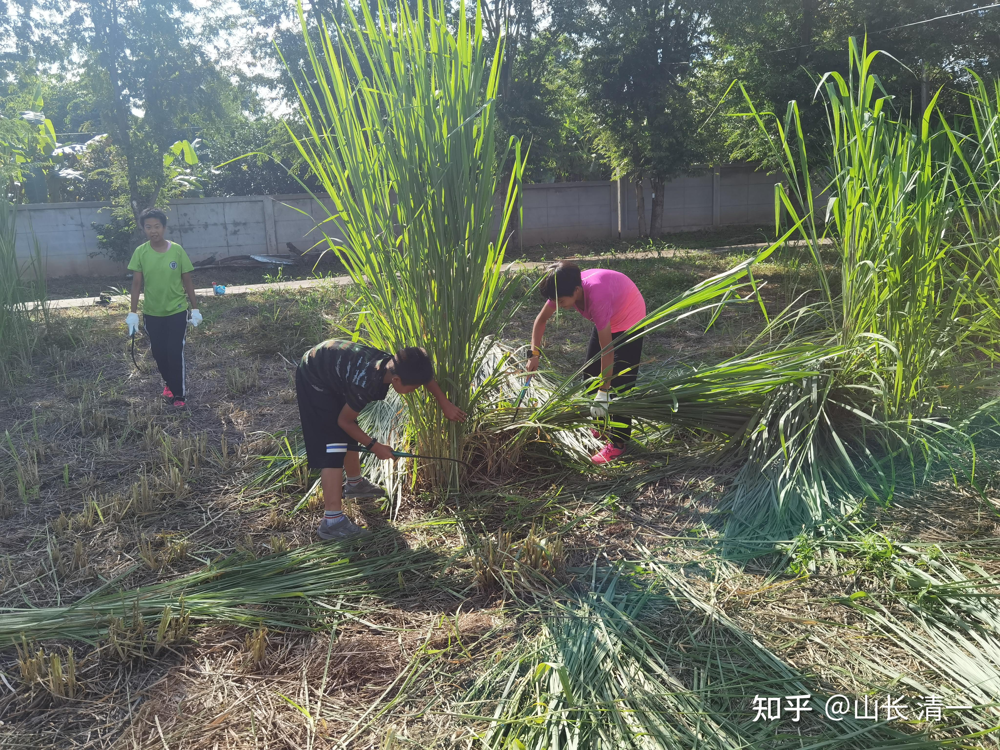
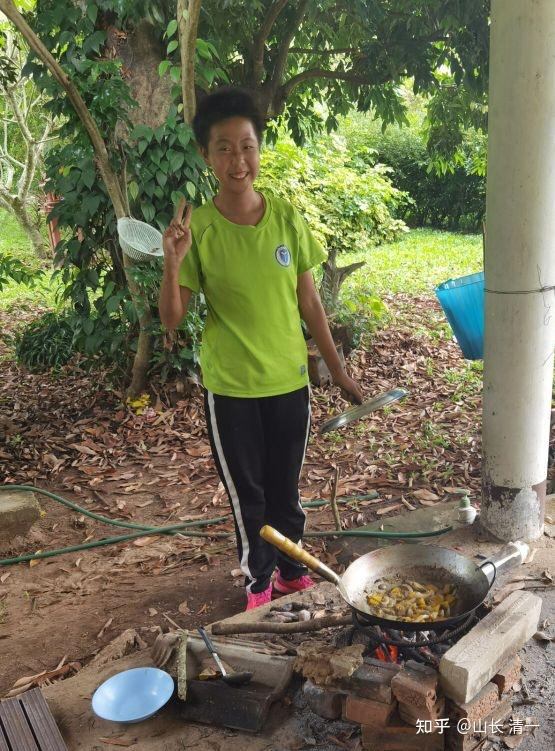

下面是几个包括从澳洲顶尖女子学校退学来新教育的富二代小孩们，正在泰国清迈的英式别墅庄园里面，关起来接受“生活教育”。她们住的蛮好，周边环境很好，安全条件一流。保护周到。至于日常的生活条件，差不多可以跟70年代的中国一比了。恋旧教育！

每天自己要去庄园里面找柴火来烧饭，自己烧饭自己吃，烧不出来就吃生的。【不许使用现代电器化设备】。为啥---这也是教育的一部分！

为了弄点吃的，咱也只能拼了！

挺得意的---我的饭煮熟了，马上开饭了

院子太大（大约70-80亩地），每天都有砍不完的草。这些草晒干了。可以用来烧饭！

围墙旁边是一条院内的散步道。大约一公里多长。每天跑步训练的好地方。

这几个孩子的家长，都是“成功人士”，已经看透了中外体制教育的目标，就是培养工业社会的工具人。但他们决定放弃做体制的工具，决定按照自己的目标培养孩子。走中国古代耕读传家的道路。还有文武合一。这几个孩子将来都要去打泰拳的。但练武的机会不白给。一旦没有好好练武，就只能强迫劳动。想耍赖------鞭子伺候！一点也不客气

这叫做富二代的“劳动教育”。小女14岁，已经走过这段路程了。现在正在走“武术教育”的道路。三个月后，要上场打泰拳了。

泰国，一群穷拳手里面，混了一些富裕的中国人二代，会不会有点奇怪？

新教育正在改写历史：穷学文，富练武！

附录：我的弟子明燕来泰国带训这些“富二代”，下面是她的部分汇报内容

师好，向您汇报一下近期我们在麦当的情况。

9月25日搬到麦当，现在一个星期了。

按照之前向您咨询的方案，在麦当带着孩子们一起练武，正好有亦蓉可以指导他们。所以练武这一块，基本保持我们在梅州的节奏，只是有时孩子们不认真练的时候，就随时会被我或者亦蓉抽板子。上一周，有一天孩子们实在练得不认真，磨洋工，互练的时候嘻哈。第二天惩罚他们砍草了，一人给买了一把镰刀，规定好要完成的区域。那天##完成的最快，在规定时间晚上6：30之前完成了。王##看着##完成之后，开始着急了，加上被蚊虫叮咬得满身都是包，被草划到脸上和手上血痕，加上沾到草的毛毛，全身都又痒又疼的。他就耍赖不想砍了，急得哭起来，又闹又跳。我只是冷冷的跟他说了一句，不想干也可以，那就不要吃饭了。他还是哭闹，我说我不跟起情绪的人说话，叫他滚。他平静下来了，停了大概2分钟，又继续去砍了，直到一个小时后砍完。熊##也基本是这个时间才完成。第二天再问他们是去砍草还是练武，都不想去砍草，所以就恢复了练武。

自从来了麦当之后，第二天开始就让孩子们自己捡柴火烧饭了，起初是用院子里的砖块，他们搭了一个柴火灶，烧出来的饭没熟，夹生饭，不好吃但也吃完了；菜是我提供给他们的红豆汤。第二天有经验了，烧的饭就完全熟了，还是我给他们提供的红豆汤。之后我们在市场上买了两个铁三角架子，再加上院子里的砖块，他们三个娃一共搭了三个灶。每个人烧一个。我让他们三个人各自烧自己的饭菜，也不再给他们提供红豆汤了。因为前面两天我发现###不会做事，她只会跟着弟弟妹妹混儿。为了训练她的做事的能力，不给她混的机会。

自分开来做饭之后，两个小的比较精明，他们俩合作，一个烧饭，一个烧菜。每天都是练武练到10：30就去做饭，每餐基本都能吃得上饭菜。只是午休的时间就没有了。而###自开始做饭以来，每天练武就只用了一个小时，其他时间都让她去做饭，但她比其他两个小的练完武之后再去做饭，还要慢的速度。我的做法就是给她时间多磨练她，让自己慢慢搞。有的时候烧得熟饭，但很多时候是烧不熟饭。主要原因她不会点火，虽然亦蓉教过她多次，轮到她自己烧的时候总是烧不起来。一天之内，把一包引火的蜡烛烧掉了一大半，只剩下四五条。打火机也被烧爆了。我观察了一下，她是怕火熄灭，就一直将蜡烛放在火坑里烧，当然就很快烧完掉。打火机也放在火旁边，不注意就一起烧，当然就烧爆了。之后我告诉她蜡烛是用来引火的，把树叶烧起来之后就要吹掉蜡烛，不断的放树叶进去烧，然后再放细树叶，烧起来之后再放大树干。亦蓉教了她两次之后，两次都烧熟了饭菜，吃上了。

以下略：

富二代其实好可怜。从小家里保姆仆人伺候多多，连基本的生活能力都没有，只好这样来磨练了。行有余，才学文。不然学出来全是废的。反而害人！