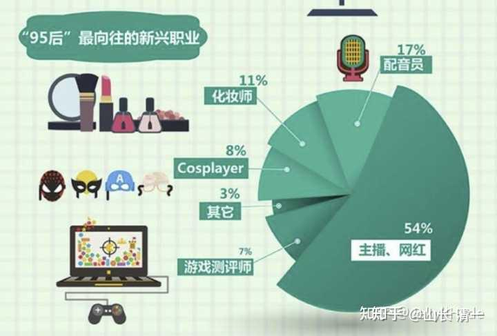

集体意识，决定了集体的未来。我们的国民意识，特别是年轻一代的集体意识，很大情况下决定我们的未来。现在孩子们的理想，愿景，以及追求，可能几十年后，就成为主导我们社会的核心力量和现实！集体意识，真的会深刻地影响这个社会的走向！

60年代，我们还小的时候，理想是“长大要当解放军”。骨子里面，这一代人争强好胜，保家卫国的意识很强。这一代人，也特别的吃苦耐劳，催生了武侠文化。这一代人，也的确特别能战斗，成为了“中国力量”在全世界攻城略地的主角。

70年代生的人，风向变了。这一代人小学的时候，正遇到了改革开放和四个现代化时期。当年70后还是小学生的理想，就是“长大要当科学家，勇登科学高峰”。这也是为国为民的好理想。实际上，这一代人，的确产生了很多科技天才，培养出了大量的工程师。华为，腾讯等高科技企业，就算是老板可能是60年代以前的人，但企业的最核心的力量，肯定是70年代人。马云就是典型---一个不懂计算机的60年代人，带领一批70年代出生的科技精英，主导了一家风云无量的互联网企业。

80年代出生的人读小学的时候，大约就是90年代初期吧。这时候，刻苦，钻研，当兵，当科学家，都不再是孩子们的“理想”。这些东西都有点过时了。由于贫富分化开始产生，物质的丰富和吸引力，开始让孩子们放弃传统的理想，现在，务实的一代人，对于追求物质欲望，生活的档次，追求金钱和富裕的生活，成为孩子们的梦想。很多这个时代的小学生的理想，就开始变成“长大了，我要做生意，我要当老板”。港商，李嘉诚等，成为这一代人的“人生榜样”。这样也不错-----发展经济，成为国家的主流。于是，追求金钱的风气大盛，中国今天成为世界上第二富裕的国家了。中国人，谁都在忙着赚钱，就成了这一代人的主流符号。为了钱，忙了一生。金钱社会，就是现在的写照！

90年代出生，00年代成长的人，他们的理想是什么呢？他们爱国，爱家，还是爱钱？

都不是---现在的画风，有点惊奇了：

新华社两年前，对【95后的最向往的职业选择】。居然有54%的 这一代的年轻人，选择要做“网红”。我的两个大孩子，正好是这个年代的人，现在20多岁？正是谈婚论嫁的时候。我想：万一两孩子，给我娶（嫁）回家这样一个戏子，我不是被毁了三代吗？倒霉透了。幸亏多年前，我就跟孩子说好了----非今日平台之外的女孩男孩，都不能嫁娶回家，我是都不认的。我现在庆幸自己的眼光很超前，看到了悲剧！

*人生理想？戏子当道？*

把这个调查里面的其他的职业加起来，如果用一个词汇，全都是---娱乐业！都想当戏子，这份调查，就是说明了：这些现年20多岁的小年轻理想职业选择倾向，97%的人都想去做娱乐业。连游戏行业，都只想去做“游戏测评师”---指指点点别人该咋设计游戏来满足自己。但---没有人想去编程和设计游戏的，没人想做“游戏设计师”。换一句话说----这里面的职业，没有一个职业，是踏踏实实的“产品创造者”。都是投机取巧，出来打二传手的“服务业”。没有人想去后台辛苦做事，只想台前风光。

网上更看到一个调查：00后们更厉害了，现在的八成小学生想当网红！网红正成为孩子们的“国民理想”。说说明趋势正在或者已经形成了。“不缺钱”环境中成长起来的这一代人，连赚钱都没啥兴趣了。都只想当戏子演员了。

[八成小学生想当网红](http://link.zhihu.com/?target=https%3A//kknews.cc/zh-cn/education/9ny4kmq.html)

我一看这结果，就知道中国的未来完了。没救了！

因为我们的下一代，普遍就只想“轻轻松松的成功”（虽然真实的网红，其实不轻松。真实的明星，也需要努力。但小学生只看到他们在屏幕后面，说说唱唱，跳跳玩玩就赚钱了，以为很行业轻松）。孩子们满心眼里面只想如何玩乐，如何好玩。没有人愿意踏踏实实的努力工作。都想赚快钱。这样的社会，怎么可能成功呢？我们这个民族，吃苦耐劳，勤奋努力，踏实肯干的精神，已经这么快就丢失了这种传统！只剩下一群投机取巧的赚快钱的，想当大骗子的小骗子。

希望这个样本，只是大城市的小孩。也许小城市或者农村的孩子会好一些？如果真的全国的小学生， 中学生，大学生都是这样想的，我认为 这个国家就真完了。一个没人愿意踏实工作的国家，是绝对没有希望的。

**我只想到了四个字：戏子误国！**

中国古代的传统，对于“娱乐业”的人，是很看不起的。属于不正当的职业，对社会没有贡献和价值的行业。古人眼中，戏子们，都是“非正流”的“下流”之人----意思就是没等级的底层人。地位，跟娼妓其实差不多的。古人的词汇，“娼优”就是一个词----优人----戏子，跟妓女的地位是几乎一样的。就是供人取乐的角色。凡是有点身份，真把自己家族和社会地位当回事的家庭，都是严禁孩子与戏子深交。看戏可以，捧角可以----但交朋友不行。谈婚论嫁，更不行。这些规定，甚至会写在家规上，违反者要赶出家门的。

台湾首富王永庆的大儿子，就是因为年轻的时候，违反家规，非要坚持要跟一个女明星结婚，结果他真的被执行家规，被赶出了王家的家门。王家根本就不认有这么一个儿子。他后来就一直在大陆和香港到处蒙混骗人过日子，过得非常的狼狈！因为台湾就没有他的容身之地。

李嘉诚的次子，跟一个女明星好上了。这女明星专心伺候李公子，为李家生下了三个孩子。但最终也没有获得李嘉诚的认可，无法嫁入豪门。李家只认孩子，不认这个明星。也不认这门婚事。因为李家也是传统家族----不接受自己的孩子娶戏子的。

这不是歧视。而是一种家族保护自己的必然。因为“婊子无情，戏子无义”。一个妓女是不可能有真情的，因为她的世界里面，男人都是嫖客。她不可能对男人有啥真感情的。同样“戏子无义”----戏子天天演戏，演习惯了，她是不会有啥原则操守的。让她演啥就是啥。这对于家族传承来说，娶一个戏子回家，家里不就乱套了？完全没章法了？

其实你们看现在的一些演员，日常生活，做事，做人等等，很多人，的确是非常的混乱。大家族讲求取信于人，这种戏精，怎么可以取信于人呢？怎么可能代表家族的形象呢？

但----这种优秀的传统，新中国成立之后，大陆就失传了。因为：主持我们的文化，体育，娱乐的官员，基本上都是原来根红苗壮的江湖卖艺人。这些人有一点文化，读过一些书，会忽悠人，会来事，但却是社会底层。符合D的要求。其他识文断字的人，正经读过书的人，基本上都跟前政权有一些关系，阶级和社会背景有问题，基本上都被镇反了。所以-----跑江湖出身的人做文化，做教育的领导人，倡导的自然是江湖文化，戏子文化就成为了现在的社会主流！

现在，连喝酒，我们都不喝前朝的黄酒，要喝最革命化的白酒了----当初其实这些高度的白酒，是原来廉价，不值钱的民工酒！买醉用的。用的虽然是粮食，但是高粱这种前朝显然是当饲料，或者是苦力才吃的粗粮，用来做的酒，怎么可能高档？怎么可能与用当时饥饿时代就很稀缺的白米，还是产量很低的江南产的糯米来做的黄酒相比，还要放十几二十年才拿出来饮用的女儿红，状元红相比你？酒的档次，到底谁高谁低？谁才是富人喝的酒？你们不用脑子，猜都可以猜出来。当然----现在茅台走红，酿酒的原料高粱，也跟着涨价了。据说比大米还贵了：这也是创造了一个世界奇迹吧？世界翻转了。毛真的做到了改天换地。

为啥会这样？因为当朝的革命者，都是苦出身，所以，肯定不能喝前朝的黄酒。革命者都喜欢喝白酒的习惯，特别是跟随苏联红军学的伏特加豪饮的方式，就快速的改变了上千年的酒传统，变成了打工阶层的白酒文化成为社会上层的代表！所以----现在我们有万亿市值的茅台等白酒企业。传统的江浙黄酒第一企业，也就几十亿而已。寒酸得要命。

这都是概念先行----当朝捧什么，就流行什么。捧革命的白酒，贵州遵义的茅台就成为最新的中国酒文化代表。一个没啥技术含量的酒企业，每年利润也只相当于一家世界五百强企业----中国建筑的年利润。每年的发展速度两家企业也差不多。但茅台的市值，居然最高是中国建筑的20倍左右，现在的市值，也足够买下全部的基建狂魔，外加白白送一堆格力美的等一众企业。这就是典型的社会价值沦陷-----关系国计民生的重要性企业，建设性企业，居然比不上一个没啥实际价值，反而损害人民身体的酒企业。这不是笑话吗？难怪是众生颠倒！做实事的人，不如吹牛的骗子。将来谁还做事？不都去当骗子去了吗？骗子只能骗傻瓜，难道我们是傻瓜国出来的吗？

现在---戏子文化居然到了这个地步---小学生80%，都要去网红了，不得了！未来会怎么样？我们的社会，将来个个都是蔡徐坤吗？我们社会需要这么多的王一博吗？真不得了！

想起戏子，我就想起了大清王朝末年，权贵子弟们最流行的就是看戏，捧角儿，养鸟，玩各种斗鸡走狗的游戏！大清在歌舞升平中，突然就没了！

我还想起了电影【道士下山】中的情节。其中勤勤恳恳的医生，踏踏实实的做工作，养活了一个票友弟弟。这票友弟弟，不仅仅要了他的钱，还要了他的妻，最终---还要了他的命！这个无能却自负，看起来漂亮却冷酷无情的戏子，我相信能够告诉所有的家长：你将来家里是不是要几个戏子？一个就足够让你倾家荡产了，你还多要几个？电影里面的哥哥，好心，也善良，也贴心，给面子贴钱，一直在伺候戏子弟弟，一辈子有什么好下场？无情无义就是这种人的本质。

我知道跟戏子玩，基本上就没啥好下场的。所以----我很保守，我严格禁止下一代娶嫁戏子。戏子当然有好人，娜塔莉波特曼看上去就很有气节，也很有水平。但---我缺乏鉴别的好坏的能力，也没精力，就只能一杆子全扫了。我宁可要一个老挝的本分女子做儿媳，也不要一个戏精娶回家。我伤不起！

不过---中国的家长，估计就不会向我这样想问题的。据我所知，家长别说娶嫁戏子了，还要花钱送自己的孩子去当戏子呢。每年的艺考多少人？用古代的眼光来看，就是花钱送孩子进勾栏之地去训练才艺，供人娱乐。我真服气了---古代，穷人也不愿意送孩子去学“才艺”的，只有实在是穷得养不活孩子，才会狠心送去当戏子的。【霸王别姬】这部戏，张国荣演的角色，就是绝望的妓女母亲，实在是养不活孩子，自己也要寻死了，但放不下孩子，才狠心送孩子去受训的。起码让孩子活下来，有口饭吃。可现在----居然是有钱的富人，争相去送钱给这些“艺术机构”呢。天真的变了，我这老旧的脑子，适应不过来了。慢慢的看吧，只是越看越怕！未来的中国靠什么强大？靠什么与美国争雄？

过去是【穷学文，富练武】。

现在似乎这一条传统也改了---现在，穷人的孩子才练武，为了去当一个保安。富人的孩子，却去“学艺术”，进勾栏“深造”！我真的太想不通了！

慢慢学习适应中！我的孩子，还是送去练武。不学才艺！只当观众，欣赏才艺！