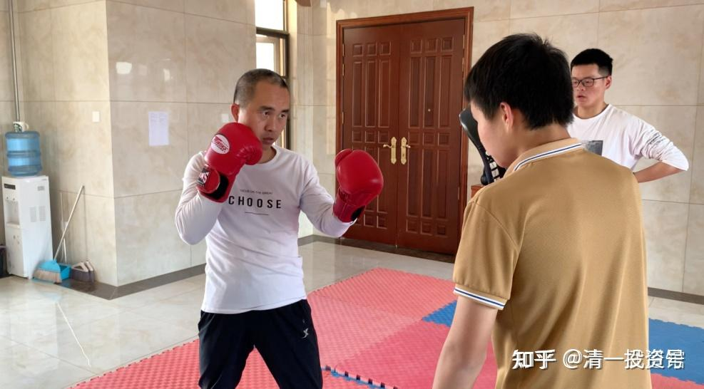

[原雪球专栏](https://zhuanlan.zhihu.com/p/570447582/edit)149篇.[法萨李总的武道馆记录9：武当高手来踢馆了？](http://link.zhihu.com/?target=https%3A//xueqiu.com/9310099567/178291122)

清一山长2021年4月27日

武当山一批从小练武的高手们、教练们，开了武馆的馆长们，约好了来清一武道馆参观访问，因为好奇。基于武林的传统，我们友好地接待了他们，毕竟是“道友”。弟子们当天就已经跟我反馈了接待经过，交流内容。不过，我就不多说了。正好李总也在现场，他写了这次武术交流的经过和情况，你们想了解，就看看他的记录吧！

[走进武道馆（9）：成为世界冠军，是笑话还是神话？](https://zhuanlan.zhihu.com/p/367585242)

[网页链接](https://zhuanlan.zhihu.com/p/367585242)：[https://zhuanlan.zhihu.com/p/367585242](https://zhuanlan.zhihu.com/p/367585242)

**我的点评**：武当山从小练武的师傅们，居然就认为：传武就是锁喉、挖眼、踢裆？这真的令人吐血。只有不懂武术，连外家拳都不懂的人，才会说出这种忽悠外人的话，假装自己会绝招，会功夫。这只是骗子手段罢了。

当年我去深圳，家长推荐一个太极大师跟我认识，还把他写的书送我一本。我去跟大师问了一句话，就知道是假货。我问他，太极如何实战对抗，打人应该怎样打？这种话，就是讨论理和法，风格、战术等，不是啥秘不可宣的东西。如果说不出来，代表你不懂一些基本的原则，就如同讨论拳击与泰拳有何攻击方法区别一样，是武林人基本的素养。比如我随便说一句两者的区别：拳击的抱架位置，比泰拳要高不少。这种技术特点，是泰拳必须防鞭腿击打肋部，要降低手臂身形，来护住该位置。拳击手没有这个顾虑，头部才是重点防守部位。所以肘部会抬高，肋部会完全的暴露。所以两者的抱架姿势很不一样。而且双方对打的时候，距离的保持，也不一样，泰拳会更远一点。这就是攻防方式不同的招数变化，方法变化。

可这个大师却说：我们的门派，特别善于实战，非常的厉害。一动手就要非死即伤，所以本门，就不让谈格斗技术了，这些都是本门的秘传，不能随便讲给外人听的，防止坏人去干坏事——我哑然！知道他就不懂武术，骗子的口气。对一般人，可以令人更加敬仰了吧？神人啊？多谢师父没有用神功打得我内伤[哭泣]。

后来此人为了证明自己的“功力非凡”，就把双手合在一起，让我用双手去压住，看他怎么轻松打开手。我一看就是玩江湖的。这个简单的力学原理，骗不过我这个工程学学士的。我摇头拒绝，不玩这种游戏。刘老师好心，配合了一下。他轻松打开两手，得意起来，叫了一个徒弟来示范，说他练会了太极神功，推不动。其他人去推，也真的推不动。刘老师一推，这人就站不住，让所有人都大惊。这人不服气，让再推一次，又再度站不稳。大师面上无光，就说刘老师练过。刘老师说，跟我会玩玩推我的游戏（她推不动我）。但我教过她推人的要点。后来我回来，教他们怎样让人压不住他们的双手，我教了之后，女子都可以让男生按不住，自己还不费劲。但不懂技巧的话，就打不开手的。这种小意思，我一看就懂！只能骗书呆子。

所以，我知道此人就是跑江湖的，不是啥功夫高手，就不再谈武功了。客客气气地告辞走了，也不肯留下来一起吃饭（带我去的家长要请客，大家一起吃饭，我推说是不吃晚饭的，跑掉了）。所谓的话不投机半句多。我不想浪费时间跟骗子混。但深圳跟他“学功夫”的人不少。因为“很有文化档次”——简单一点，师傅很会忽悠！

练传武的人，居然说传武、太极不能跟现代格斗打的原因，是什么规则不允许，规则不一样，这就是鬼话一堆。原则面前，我也不想客气。如果规则允许，现代格斗不一样收拾你们？比你更快，比你更有力量，一样的对你锁喉、挖眼、踢裆，比你更狠。传武放开规则去打，一样的没有希望。徐晓冬让他做这些动作（挖眼、踢裆）来攻击，我相信一样比马保国更老道！

说这话出来欺世，就是证明：这些人，其实根本不懂传武是练什么的！以为就是练套路的（其实我看过武当的CCTV专访，采访武当山有名的掌门师父，徒弟无数。也看他演练了武功，还讲了实战心法，他的独门应对姿势，据说暗藏玄机，他用来击败过无数人，还没有人击败过他。我一看，他的理论和把戏，就知道是耍把戏的江湖人，不是啥真功夫，更不是武当派的功夫。我对此不想说啥客气话。他打一般没练过的人没问题，要跟现代格斗打，一样闹笑话的。后来徐某东出来了，此人居然也一样缩头乌龟，不敢出来打。如果真的对自己功夫这么自信，出来打垮了徐某，不是名扬四海吗？名利双收吗？为啥就不敢出来掠取这名声？比中央台的专访要有影响力得多了[大笑]。

至于练武一定要吃肉？还要吃牛肉？我知道的武林中人，全都是这样说的。甚至觉得自己练武，还一定要比常人多吃一点。**练武之人，往往还特别的贪吃。弄得身体臃肿的人很多。年龄大一点，身体都全都搞坏了，基本上都是吃坏的**。还认为练武人有豪气，喜欢喝酒，估计都是跟绿林好汉学的。不是跟道家、养身家学的，**完全违背了古人的教诲**。连我们学堂的家长，都私下认为，不吃肉，孩子长身体恐怕不行。家长怎么就没去看看我们的小女生？去武道馆吃素，一个个比吃肉的时候还壮实吗？男生就更不用说了。**明仪**没去武道馆之前就是吃素的，她被家长看到练的功夫，是我教的内家拳发力的练功模式，特别消耗体力。她居然**从中午练到下午一点都一直没休息**，我都难以想象，比我强多了。后来我问她练了多久？说是2点左右才回武道馆吃饭的，同学留了她的饭。你们谁吃肉的，跟她比比这体能去？不说技术了，累都累死你。看你吃肉就比吃素的强？才怪！猎豹是厉害，但知不知道？猎豹只能追上跑得最慢的羚羊。知道为啥羚羊被追击的时候会跳吗？就是炫耀技术的：你看，你追我，我还可以跳着跟你玩，表示自己体能充足。实际上，猎豹看到这种会跳的羚羊，真的会放弃不追的。因为真的追不上。这些事实，都说明吃肉的体力，其实比不过吃素的动物。它们优胜是工具——爪牙不一样。

我们是人，一样可以拥有吃肉人的“爪牙”。明骐对练，已经反馈两次不重的出手，都让不同的两个对练对手，头部受到冲击而出现昏晕现象，不得不休息。这就是正在出来的我要求的太极攻击力（脆快力、透劲）。我看过这两段视频，他的确没有全力出击，很随便的一个出击，脆快的动作，自己也没用力，就导致对手小受伤。这就是真太极。他一旦练到了得心应手，可以随便用出来，不像现在只是偶然一显。到了上擂台的时候，他的对手就要吃大亏了，可能一个照面就被KO了。

这就是我要求的未来实战结果。打啥满12回合，不懂武功才这样耗体力。真懂武功，只要双方交手后，几秒钟就给我出结果！不是胜，就是败。没啥好慢慢磨时间，耗体力的。这才是真太极！

当然，由于拳套等的保护，真实的擂台战，不会这么快！但KO是必然的。

照片说明：李总改练拳击了——这个抱架姿势，一看就很业余。不过半路出家练的，已经比雷雷的抱架强多了。（雷雷的抱架，一看就是挨打的货色）[大笑]。专业人员，看你的动作，就知道水平大致如何了。李总的抱架，空档很多，没有护住关键处，门“开”了。而且手也没有在出击位置。真打的时候会慢一点点，这“一点点”，就是专业拳手与业余拳手的差距，打垮你足够了！我的抱架，会让攻击者犯傻，根本不知道怎样攻击。因为找不到攻击我的点！我变一点动作，移动一下手臂，他们就以为发现找到机会了——就开始攻击，没想到正好进我的圈套，他们一出手就直接撞上拳头！因为我是故意卖的空子，不是真空子。一般人，不知道“卖空子”，其实这是比“没空子”更难的功夫！

（以下内容为编者收录）

**评论回复：**

清一山长[2021-05-07 21:40](http://link.zhihu.com/?target=https%3A//xueqiu.com/9310099567/179224821)

吃肉的狮子，输给了吃素的羊？一场武林大决战——天天吃高级特制牛排的双料格斗冠军，常胜将军康纳·麦格雷戈，却输给了吃素的挑战者。赛前特别看不起吃素的对手，场上却输得很惨。你们还不服气吗？还要迷恋肉食吗？以后会有越来越多的这种事件发生的。清一武道馆的全体人员吃素，是为了得到更快的速度，以及更大的力量，更好的耐力。不是为了作秀的！[网页链接](http://link.zhihu.com/?target=https%3A//mp.weixin.qq.com/s%3F__biz%3DMzA5NDkzMDMxNg%3D%3D%26mid%3D2649777102%26idx%3D1%26sn%3D0beb8520b0603c9bbdfb459f7fde4724%26chksm%3D8843d72dbf345e3b92ca2d462c164f6ad12a709633fa03dad3f69d617cf00cc96bf2dfdd7a56%26mpshare%3D1%26scene%3D23%26srcid%3D0506nNktCFERocFZj6JXqPkB%26sharer_sharetime)

参考链接：

[清一投资号：29篇.食物还是毒物](https://zhuanlan.zhihu.com/p/529676979)（整理文）

[清一投资号：第1篇.身体健康的三个因素：心态、运动、食物](https://zhuanlan.zhihu.com/p/513184686)（整理文）

[清一投资号：第3篇.素食与肉食，养生与医疗，古人与今人](https://zhuanlan.zhihu.com/p/518352472)（整理文）

[山长 清一：日本武士的传统食物是什么？](https://zhuanlan.zhihu.com/p/510535004)（知乎专栏文）

[山长 清一：吃肉才是科学，吃谷物就是不科学吗？](https://zhuanlan.zhihu.com/p/514940531)

[122篇 为何东亚文化圈为以白为美？以胖为福？以懒为贵？以无能为尊？](http://link.zhihu.com/?target=https%3A//www.ximalaya.com/sound/485885449)（音频）

[清一武道馆：走进武道馆（9）：成为世界冠军，是笑话还是神话？](https://zhuanlan.zhihu.com/p/367585242)

[清一投资号：8篇.国际武术比赛：清一书院首日参赛夺得金牌12面！](https://zhuanlan.zhihu.com/p/535445784)

[清一投资号：33篇.家长为啥每天都要给孩子吃XX](https://zhuanlan.zhihu.com/p/543096364)