今天（2022年10月8日）一大早，上午九点，领队明燕就开车带队去清莱比赛了。本来不用这么早去的，路途时间大约4个多小时。但佳慧希望到清莱后找个地方休息，调整好身体状况，晚上才能以最佳状态来投入比赛。比泰国拳手娇气一点。清莱的拳馆来参加清迈的比赛。就是预算好时间，开车直接来拳场就开打了。没有我们这样提前量打这么多的。

今天陪同前去做拳场助理的是艾拉和小明慧。她们两还有一个任务，就是要陪说话：为木兰安排比赛的泰国70岁老裁判，今天也随同前往。说是怕佳慧被当地的拳场坑了，他在现场会保证一些更安全更公平。本来佳慧说了：她的老师会派人一起去陪她的，不用担心安全问题。但最后老裁判还是要跟着一起去。我认为他对这场比赛，还是很担心的。他认为对手的技术很强，实力非常的强大。佳慧的泰拳技术是新手，比赛经验更是不足够，很担心佳慧会输掉比赛。所以想要现场来帮助佳慧。就算被KO也有人在现场让裁判停手吧？我猜的。上一次佳慧打金腰带，显然裁判是得到了指令的，对佳慧的对手非常的关照，第二局一看不行，就赶快叫停了比赛。这个金腰带已经安排好了两周后就要打仑披尼的大比赛，肯定不能受伤的。所以-----在泰国跟裁判关系好，还是很重要的。场上保护就周到的多了。

还有一个好消息是：赛前老拳师就说了，今天的比赛。不管是赢，还是输，他都会帮忙安排仑披尼拳场的全国性的比赛。也就是说：老拳师认为，这场比赛已经是泰国顶尖的比赛了。不管输赢，只要能够打这种比赛，打得不是特别的难看，就有资格参加泰国最高级的拳场比赛。比赛胜负倒不是最重要的，能打这种级别的拳手，就证明了自己的高度。所以----佳慧和明晓的仑披尼之路，已经铺开。就看她们怎样去走了！

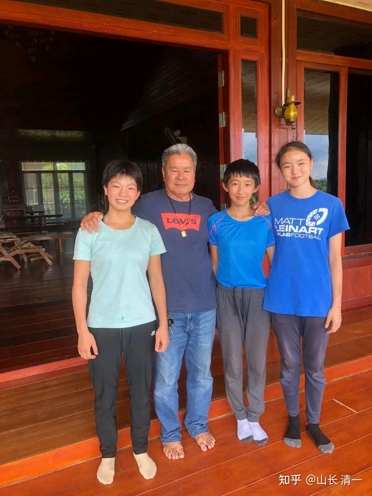

*出征世界冠军的队伍 老裁判和清一木兰公主合影*

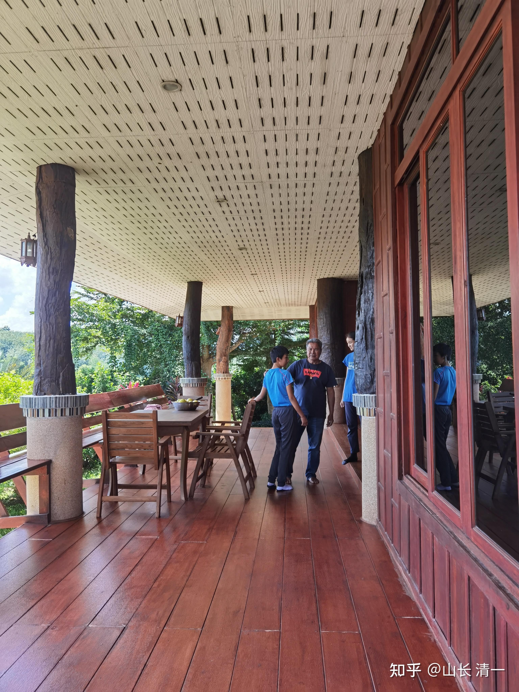

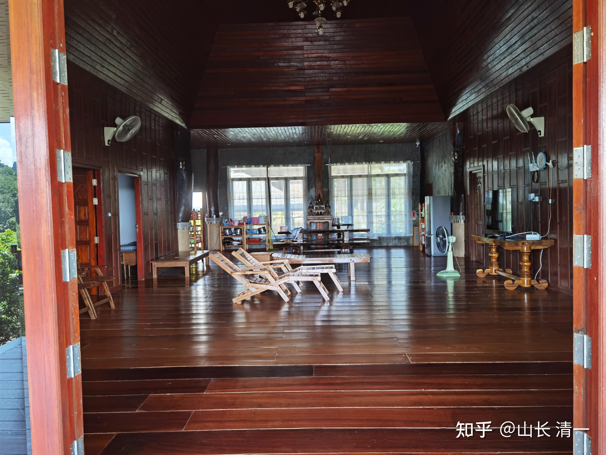

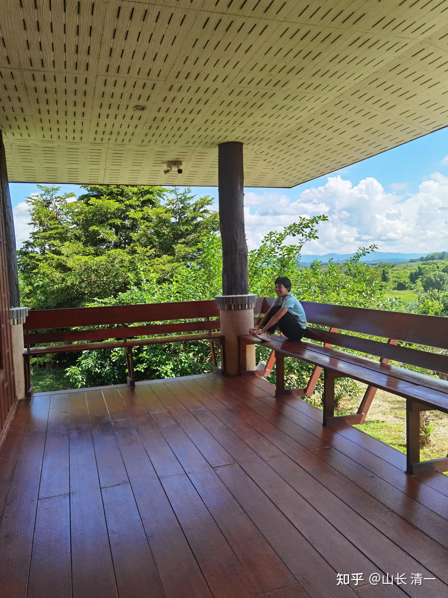

*到达清莱休息点，放松变身“抠脚大汉”的小佳慧*

以上是孩子们到达清莱后，老拳师给她们找的“休息处”，是他一个亲朋的家里面。孩子们在这里休息，调整，准备晚上的“大决战”。看起来环境非常的好。

佳慧的这张照片，抢拍的时机很好，反应了佳慧顺利到达清莱比赛现场后的放松和随意，面对一场重大的比赛却毫不在意的样子。但-----她居然变身“抠脚大汉”，会很影响她“女性优雅指数”的。也许会让追她的男生就此止步吗？她在拳台上太凶了，在拳台下又“太不优雅”了，将来怎么嫁得出去？明燕校长，怎么专拍这种不够优雅的照片？挑几张佳慧温柔优雅的形象照片，再发出来不好吗？

由于佳慧场上的表现，总有点紧张，不太容易放松。而她的对手NAMWAN。就非常的有经验，我看过她在仑披尼输掉的一场比赛。面对强劲的对手不断的攻击，她的反应是不急不躁的。一直打防守反击，非常的有效。还给对手的脸上打出血来了。只是这个对手也极其凶猛，顽强奋战，最终点数获胜。NAMWAN从开始到结束，都表现非常的平静。所以我担心：佳慧别急于求战，有点控不住场，上场后，一紧张蛮攻的话，就会落入对手的陷阱。如果急于攻击，也容易给对手迎击的机会，造成严重后果。所以，赛前，我特别提醒佳慧----注意调整心态。

赛前提示佳慧：马云有句话说得很好，你们不需要害怕竞争对手，不要去担心焦虑。因为：你的竞争对手，也一样会怕你，会担心你。佳慧上场后，应该这样想：对手是泰拳的世界冠军，成名已久。这一次，还在自己的家乡拳馆打比赛。当地她有很多的朋友和伙伴亲人。所以，其实她的压力更大。面对你一个不断KO泰国拳手，创造泰拳新纪录的中国人，她场上比赛的压力更大，她会更怕输掉比赛的。但是----你输了无所谓，你是输给了冠军。而她输了比赛，就是输了世界冠军的荣誉，把名誉送给了一个新来的中国人。所以—谁应该焦虑呀？让对手去焦虑吧！你只管打好自己的比赛。只要你打出了日常训练的水平，就完全满意了，结果，输赢都无所谓了。

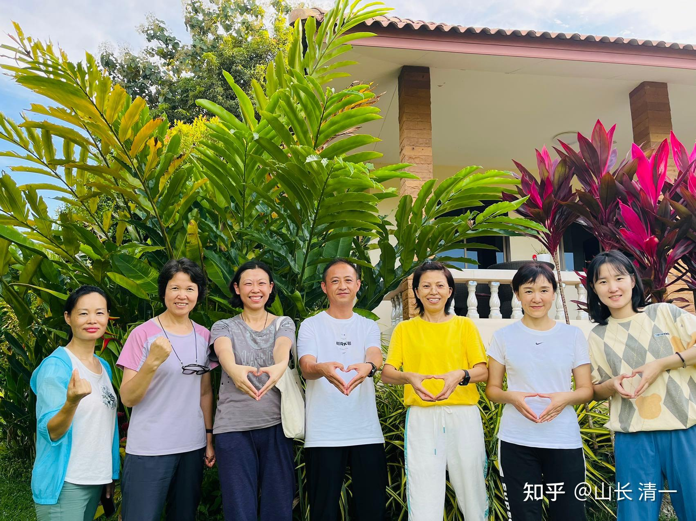

*世界冠军比赛观战亲友团到达清莱*

清莱赛场有一批家长赶去现场观战。主要是公主班和少年军校，高中部的家长一行8人。这是太极征泰以来最豪华的中国阵容。有这一群家长在现场加油，相信这个清莱的客场比赛，会是佳慧打过的，最有【主场感觉】的客场比赛了。原来在泰国的比赛。都是对手方一大堆人，在为泰国的拳手加油助威。我们这边拳台，却冷冷清清的，毫无人气。今晚的比赛，会热闹得多。希望佳慧今晚的表现，对得起这么多粉丝现场千里奔波去观战的热情。

另外、今晚的比赛，总共有12场。与清迈售票的拳场只有6场比赛不一样。应该是当地政府或者什么机构组织的一次节庆活动的比赛。不是日常的常规赛事。家长们这一次看泰拳可以看饱了。妥妥的泰拳大餐。可能还免门票（凡是主要对象是泰国本地的群众的比赛，都不收门票。观战门票的比赛，对象是外国人）

晚上 9:15分追更内容

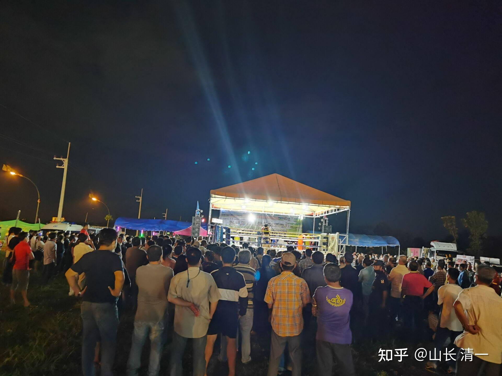

*现场照片：人很多，木兰们参加比赛最多的一次观众*

已经开始比赛了。木兰的比赛是总共12场比赛的第八场。还有点晚！这次比赛来观看的人很多，因为邀请了很多来自外府的高手参加。据说都是要买票入场的。所以，主办的热度很火热

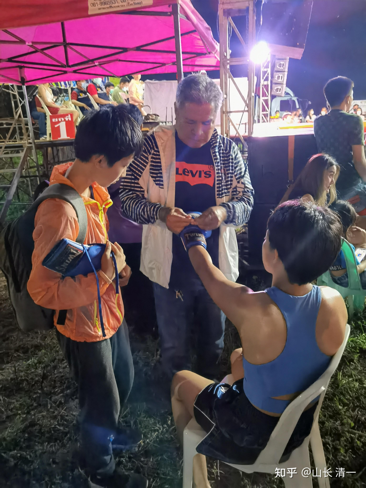

佳慧马上要上场了，老拳师在细心地帮佳慧绑拳套！

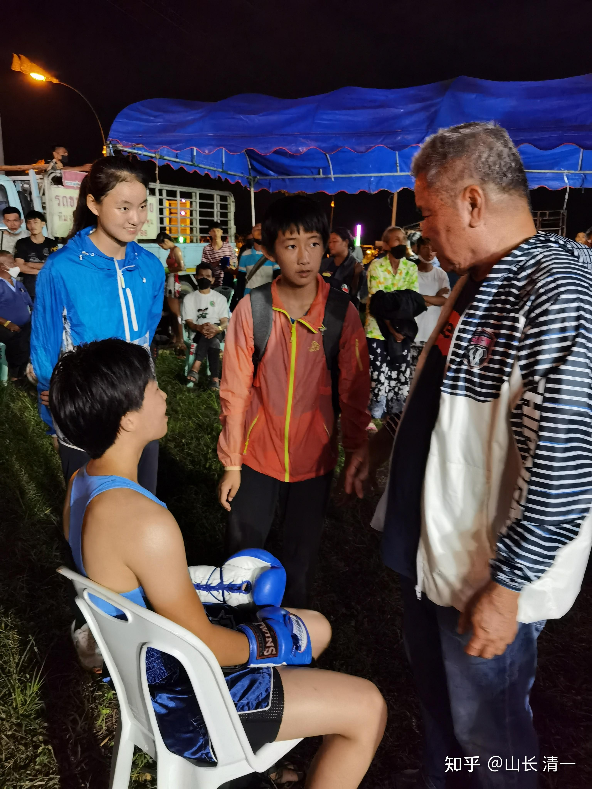

老拳师在指导佳慧上场的注意事项，他知道的对手状况

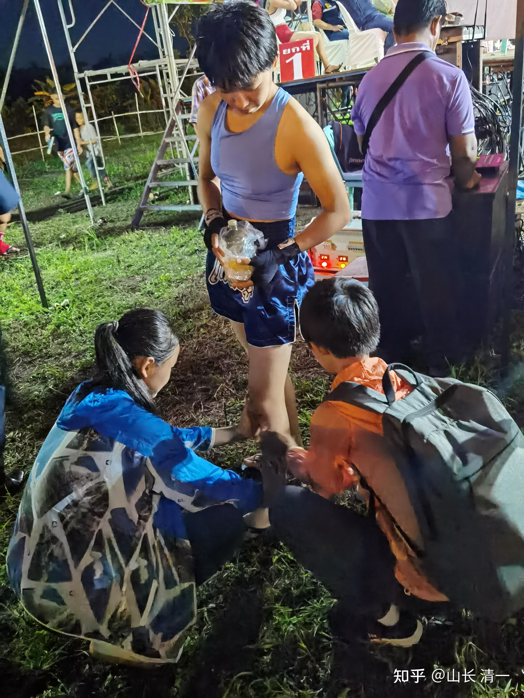

*小公主们再为佳慧上场前的服务*

刚才艾拉完成了对佳慧对手NAMWAN的赛前采访。Namwan对自己获得比赛的胜利非常有信心，说她100%可以击败佳慧。我认为这不是吹的。只要她不被KO，在她的家乡拳场上，佳慧肯定只能判输。所以：我们也真不敢说能赢。只有KO才有可能取胜。所以----为啥NAMWAN不是来清迈挑战，而是让佳慧客场去清莱？

不过----对我们来说，你一个世界冠军，愿意跟我们一个新人打比赛，已经是很给面子了。输赢已经不重要了。裁判怎么判，我们都接受的。输了也高兴！

清迈时间22：02分追更，上一场现场实战视频

下面是打完第四局后，前方传回来的实战视频。看样子，NAMWAN累得够呛，明显是精疲力竭的样子，连抬腿都没力气了。佳慧还有很有力量发出有威胁力的拳腿攻击，NAMWAN基本上只有挨打，躲闪的份，没有进攻的力量了。显然两人的前三局，肯定是打得很激烈的。这一局对手虽然一直在勉强支撑，已经失去了锐气。但佳慧也有些体能下降，而且由于急于进攻，导致失衡情况下被对方反击摔倒了一次。并不是NAMWAN用了什么特别的技术，但NAMWAN抓空挡的本领还是很强的。打出这一下有效攻击，NAMWAN还是很开心的，意外的惊喜。也说明她的正常攻击很难有效击中佳慧。她第四局就已经累到连出拳都没力了，这一场打的双方都很不容易！

佳慧虽然本回合还是打出了有力量的拳腿，但我发现体力也消耗严重。进攻的频率降低了。一些有利的机会也没有抓住。开局一次本可以摔倒对方的内围战，但因为旋转没有到位而放弃。说明佳慧的体能消耗也较大了。

[!\[image\](images/img_010.jpg)

第四回合的实战视频 https://www.zhihu.com/video/1562214307567386625](http://link.zhihu.com/?target=https%3A//www.zhihu.com/video/1562214307567386625)

你们能够根据上面第四回合的视频实况，推导出第五局打完后的结果吗？

最终的结果，是佳慧打满五局，点数判负，裁判又赢了。佳慧表示：不怪裁判，是自己没有打好，还是急躁了。下次有机会再打回来。今晚是一场非常激烈的比赛，现场的泰国观众，一直是提心吊胆的看到他们的拳手，在本场战斗中打得极其狼狈。随时有倒下的可能。NAMWAN主场作战，为了避免被KO，只能选择很没面子的消极避战，被一个新人追着打。虽然是一个非常聪明的格斗手段，要求进攻方必须功力具有压倒性的优势才能击垮他。佳慧显然还没有这种优势。最终，泰国观众，最终看到泰国选手“终于赢了”，现场上千人，看到比赛结果后，都是大声的欢呼，此起彼伏，大家非常的兴奋。我相信这个结果是最好的。泰国主办方也非常满意地看到双方打了一场非常精彩的比赛！

再转一段视频。这一回合，输家一直追着赢家打，而且连续摔倒赢家两次。赢家的攻击效果并不明显。

[!\[image\](images/img_011.jpg)

被打倒的红方冠军是最终的赢家 https://www.zhihu.com/video/1562223047368818690](http://link.zhihu.com/?target=https%3A//www.zhihu.com/video/1562223047368818690)

上面这场比赛好典型。如果我们有选择，是要向红方一样赢，还是像蓝方一样输？我肯定选择输掉更好！这样赢比赛，有点不好看。真没劲！

现场观战家长的感言：今晚是自己有生以来第一次零距离欣赏泰拳赛，太震撼了 虽看不太懂，不懂裁判判决标准，为佳慧勇往直前的精神感动，第五局对方就开始拖时间跑圈圈了。佳慧说下次打回来。

在泰国，客场作战，别指望“公平”这种事情，不KO就算输。其实女拳手的比赛，大多数是无法KO对手的。就算有优势，但职业拳手的抗击打能力远远强过普通人。拳手要KO普通人容易，KO优秀的职业拳手太难了。张伟丽的拳够狠了吧？她和乔安娜打成这样，多凶猛，最终也没有KO乔安娜！所以，在泰国，面对这样的判决标准，显然只能逼木兰们拼命去练出更加强大的攻击力，越来越成为“力量型，攻击型的拳手”。因为不KO就输，她当然成天会去专注练怎样才能KO对手的技术了。泰拳的“爱国裁判”们，他们的偏心，正在帮我们全力锻造一个越来越凶悍的太极拳手！制造越来越多的KO率。

下面是现场观战家长传回来的抓拍照片：谁的技术好？谁的攻击更凌厉？不是裁判说啥就算啥的！都是非常明显的击中得分标志！

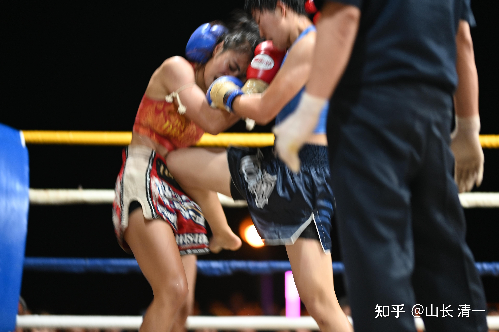

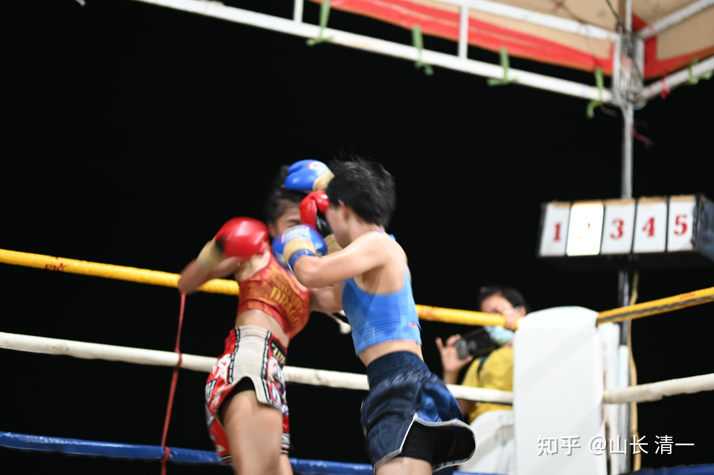

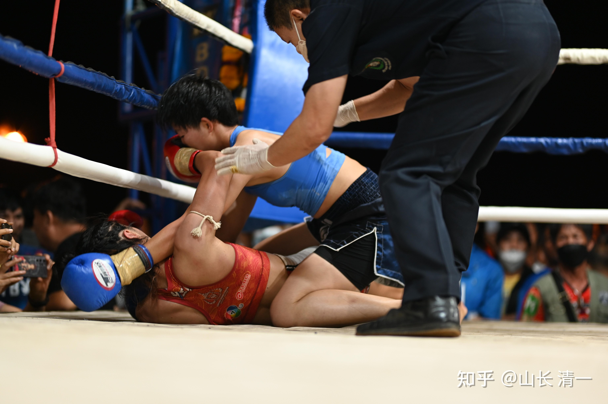

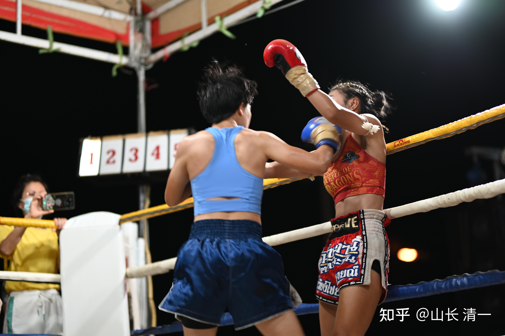

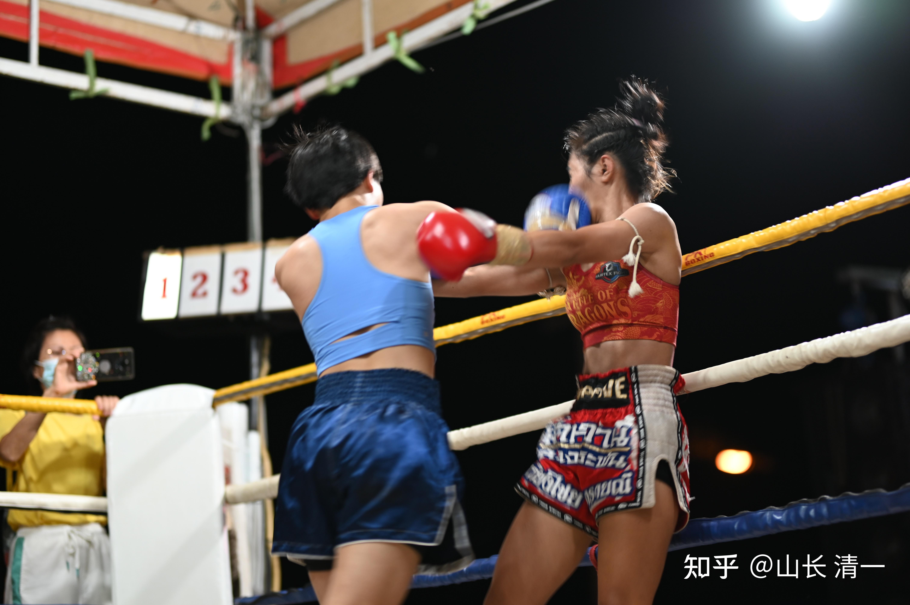

家长对话：

0179叶林琳上海 23:43:07

我发视频到拳友群，所有人都说蓝衣服赢了。真不懂裁判是咋判的[表情]

清一山长：这个时代已经很美好了。一切都可以记录下来。无论是荣誉还是耻辱。我认为：输掉比赛并不是耻辱。输掉荣誉才是耻辱。我们输了比赛，但我们没有输掉荣誉。泰国虽然赢了比赛，这样赢，经得起历史的经验吗？感谢NAMWAN，她打得很顽强。作为拳手，她已经尽力了，顽强战斗到底。她是有荣誉的。只是判决她赢的人，是有荣誉吗？是公正的吗？不好说。我们不做评论。尊重裁判。也尊重我们自己。我们更喜欢这样输掉比赛，也不愿意像红方这样子去赢比赛！

179叶林琳上海 23:56:47

确实如山长所言，NAMWAN是有荣誉的，也确实打出了世界冠军的风范。被踢摔这么多次，依然顽强拼搏到最后一刻。实力明显不在一个纬度。佳惠明显比第一次出场壮实了许多。[表情][表情][表情][表情]为我们的清一派木兰点赞。

佳慧妈妈的发言：对手的比赛经验非常丰富，出拳出腿速度都很快，连续反攻能力很强，世界冠军真实不虚；清一木兰能在那么短的时间，在经验不多的情况下打出这种水平，足以说明中国太极的博大精深与我们常人无法理解的厉害，一改太极是老年人玩的养生功的国人观念，更见证了山长思维的厉害与山长教学的厉害！

两个人的对战，我们在线上看视频都觉得很精彩（估计在现场更是惊心动魂），相信清一木兰有了这一次与世界冠军的实战，更能理解为什么心理素质排在第一位，新教育为什么把心性排在第一位。

祝福木兰与武士们通过打开仑披尼冠军之路，恢复中华的武术精神，光大我们中国的传统文化！祝福清一武道馆，祝福新教育，祝福清粉家园的所有人！[表情][表情][表情]

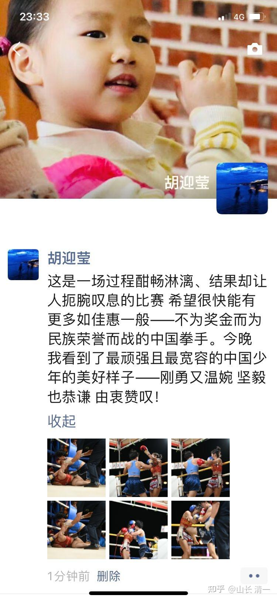

*现场观战家长的感言*

0939王海林北京 05:39:07

佳慧应战世界冠军打得太精彩了！感谢老师们的视频和照片[表情][表情][表情]

“挑”战方打得很顽强！她每次出出腿都会被应战者佳慧连续回击拳打膝击。最终在场上慢跑来增加应战者打到她的难度，除了被动挨打，世界冠军还会主动奔跑，最终稳赢。佳慧输的精彩！她的转身边锤打中了就更精彩了

我的最终总结：这个结果我认为挺好的，打出了太极的实力。虽然打得这么激烈，双方拼的很厉害，但佳慧没有受到严重的伤害（脸上被善于肘击的NAMWAN击中了一次，没破皮，但有一点肿），赛后没啥不适的感觉。对手场上就已经竭尽全力了，显得精疲力竭的，为了家乡的荣誉，勉励支撑下来的。我看就算赢了比赛，也需要好好休息恢复一段时间了。结果虽然是判输了，但泰国裁判们，泰拳的拳手和教练们，心中都是有数，会评估自己的拳手来和佳慧打是什么结果，知道不好打。泰拳的圈子内部，一定会对这个打法奇怪的中国女孩印象深刻。这一次，没有KO对手，而是与世界冠军打满五局，也比两局就KO效果更好。一方面被KO者不服气，认为是意外。另外，这种打满五局的极限拼杀，也让我们获得了尽可能多的与世界冠军比赛的经验值。将来更不会怕这个级别的拳手。同时，还检验了我们拳手的格斗体能极限。

第五局的场面，就是冠军尽量避免接触，逃跑避战当甜跑跑了。让木兰追着打，也打不到，比赛跑步了。估计中间休息，教练看到冠军的体能已经耗尽，给她的指令，就是最后一局不能硬拼，只能尽量避战，不然被KO就太难看了。所以她的教练老师，都知道要真的打赢木兰的难度是不可想象的。圈内人，都会承认木兰是第一流的拳手，有资格走上仑披尼赛场，未来其他顶尖拳手将不得不面对木兰们的铁拳。泰拳世界的国家级，甚至世界级的赛场上，更多的顶尖高手将继续检验清一太极的成色真假。

至于本场比赛的缺点：

1：真太极打人如亲嘴的风格，木兰佳慧还是没有打出来。长距离打人，力量不够。所以KO不了对手。木兰如果敢于放近了来打，NAMWAN就被KO了。这需要更全面，更高级的掌控技术，更需要胆识，希望木兰们早日成熟，更加完善地掌握老祖宗的技艺！

2：佳慧场上依然不够冷静。 这个----说教就没用了，需要多打实战，多磨练才行。打过上百场，甚至19岁就打过三百多场比赛的泰拳手，赛场磨炼出来的心态很好，目前我发现只有极少数几个拳手的心态不如木兰。其他在赛场心态经验上都是超过木兰的。 这一块是我们的短板，需要我们去慢慢补上！