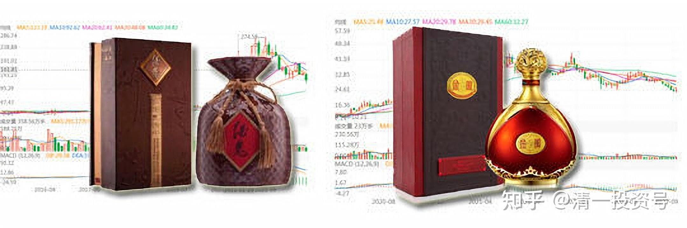
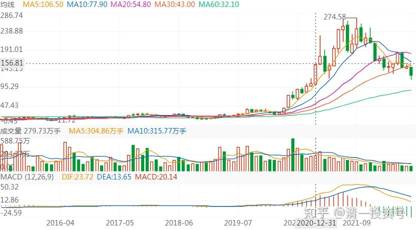
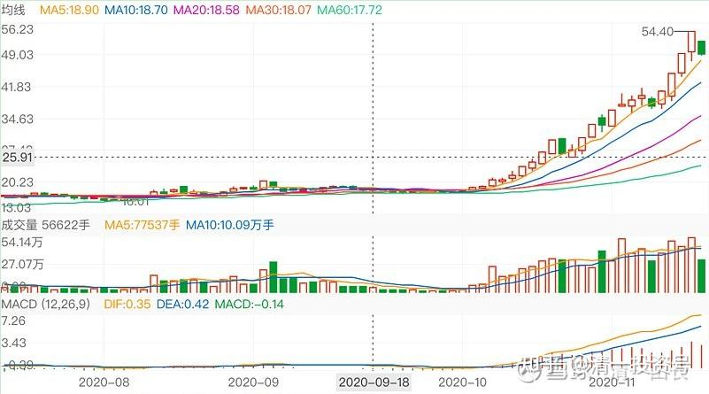
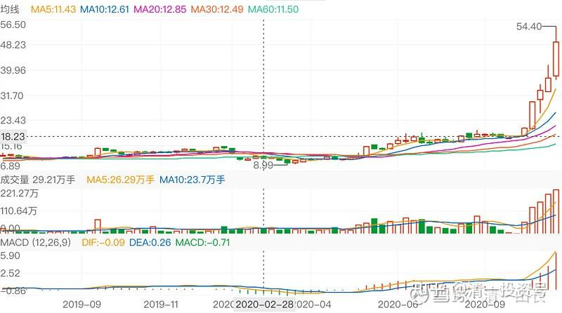
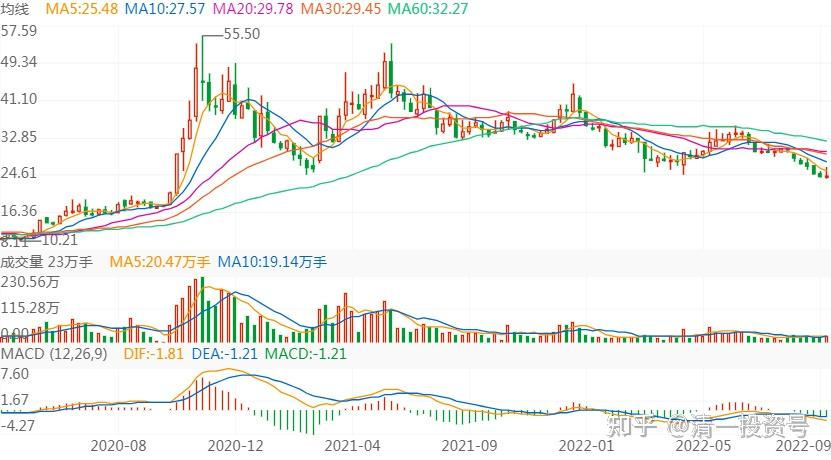

72篇.白酒系列（六）酒鬼酒、金徽酒

2017年9月-2020年11月

**1.酒鬼酒——买入价格很好，可惜数量太少**

清一山长2017-09-13 12:33

$酒鬼酒(SZ000799)$涨得真受打击！我有这股，而且是17元买的。就是因为这个股不能用融资买，我舍不得卖掉其他的股来换。就只买了一万股，然后就——看着它一直飞。[哭泣]

51nxp回复股海摆度人：

你要说偏执也行，对没有泡沫的资产的偏执。

**回到6月，18元的酒鬼和25元的水井坊，你看它们对应的市净率和白酒销售额，我只会选顺鑫。我只有这个本事，赚不到市场追捧它俩2-3季高成长的钱，因为我当时对次高端是完全不感冒的，这是我认知的缺陷，所以我赚不到这样的钱。**

我常常醒来后，后悔的是错过平安、太保的这轮上涨，你可以翻我3月初的贴，我是多么看好保险股啊！那时我就发帖说2017和1997、2007年一样是价值股的大年，且关注到平安、太保的股东数量急剧下降，太保降到上市后的最低点，然而因为4月的降杆杠，潜意识则是新黄浦和天健的捞偏门成功让我放弃了自己固守的保险股。

天道轮回，万事都有因果。

错过了，就固守自己的堡垒，只要自己买入的逻辑还在，那就不忘初心，绝不能两面挨耳光。

[清一山长](http://link.zhihu.com/?target=https%3A//xueqiu.com/9310099567)2017-11-16 17:05回复51nxp：

支持！[很赞]

只有真正看懂了自己投资的人，才会如此淡定地坚持自己的投资逻辑。回头看自己放过了的好股，大多数人都会承认自己的“投资错误”。其实，真正看懂了股票的人买入股票后，只要基本面不变，股价的变化并不能代表“老师的正确答案”。我今年跟随买入顺鑫的逻辑很简单：一个企业业绩正在不断快速成长的股票，有什么放弃的理由？**涨不涨，是市场的事情；买不买，是我的事情。**19元多买入，坐了几次“电梯”，有人遗憾，我不遗憾，因为20元出头，我根本就不想卖。做电梯就是我最理性的选择。

[清一山长](http://link.zhihu.com/?target=https%3A//xueqiu.com/9310099567)2019-09-27 15:07

$酒鬼酒(SZ000799)$酒鬼酒是我今年很失败的投资品种，原因是：**虽然买入的时点以及价格都很好，16～17元每股就买入了，而且一直没卖。失败的原因是买入数量太少，还不到10万股。**迎驾贡酒17元多也在不断买入，买入了50万股，原因是它是白酒股分红率最高的股。**酒鬼酒就因为过往业绩不佳，不敢多拿，有点赌一把“内参”走红的心态才买的。**但是，以百万股为单位买入的燕京，却创造了多年新低。给人的感觉，就是买白酒比啤酒要靠谱一些[哭泣][哭泣]。要不就是今年的运气没有去年好了[捂脸]。

[水深火热2018](http://link.zhihu.com/?target=http%3A//xueqiu.com/n/%25E6%25B0%25B4%25E6%25B7%25B1%25E7%2581%25AB%25E7%2583%25AD2018)回复[清一山长](http://link.zhihu.com/?target=http%3A//xueqiu.com/n/%25E6%25B8%2585%25E4%25B8%2580%25E5%25B1%25B1%25E9%2595%25BF)：

酒鬼酒目标多少啊？

[清一山长](http://link.zhihu.com/?target=https%3A//xueqiu.com/9310099567)2019-09-27 15:21回复水深火热2018

我跟你们不一样，知道自己没本事去决定股票应该以多少价钱交易。**我定的酒鬼酒目标就是：假如还跌破17元，我就继续多买一些。高于现价，可能会随时卖**[大笑]。万一缺钱。我就卖掉土豪股，去买乞丐股。

[51nxp](http://link.zhihu.com/?target=http%3A//xueqiu.com/n/51nxp)回复[夫风生于地](http://link.zhihu.com/?target=http%3A//xueqiu.com/n/%25E5%25A4%25AB%25E9%25A3%258E%25E7%2594%259F%25E4%25BA%258E%25E5%259C%25B0)：

我不会去判断主力如何如何，我只知道当自己精心挑出来的公司，市场充满恐慌情绪而公司经营越来越[好时](http://link.zhihu.com/?target=https%3A//xueqiu.com/S/HSY%3Ffrom%3Dstatus_stock_match)，我会埋头加仓。

山长是看着我这些年怎么走过来的，顺鑫、[健康元](http://link.zhihu.com/?target=https%3A//xueqiu.com/S/SH600380%3Ffrom%3Dstatus_stock_match)、老窖……无论是成功还是失败，我都是按自己的认知去买卖。

[清一山长](http://link.zhihu.com/?target=https%3A//xueqiu.com/9310099567)2020-12-10 11:19:10回复[51nxp](http://link.zhihu.com/?target=http%3A//xueqiu.com/n/51nxp)：

基本面投资其实比看技术更难。要了解企业，了解行业，不然很难判断准确。我是偷懒，看技术，看庄家进出，主力博弈，要比研究企业的基本面容易得多。所以，我很敬佩你们这些潜心研究企业和产品的人。

当然，更多的人，什么都不懂，技术面看不懂，企业也看不懂，行业也不研究。这种人赚钱，全凭运气。

等我慢慢理解一下你的逻辑，如果理解了，也许可以投点[信立泰](http://link.zhihu.com/?target=https%3A//xueqiu.com/S/SZ002294%3Ffrom%3Dstatus_stock_match)。理解不了，就继续等。有时候会失去机会。**[酒鬼酒](http://link.zhihu.com/?target=https%3A//xueqiu.com/S/SZ000799%3Ffrom%3Dstatus_stock_match)我17元买了不到十万股。但没有看懂，只是从技术上觉得很低了，买入很安全。如果我像您一样看懂了，我会买几百万股的，冲到30都敢追。所以，因为不懂酒鬼酒的基本面，我失去了一个赚到大钱的机会。证明技术不是万能的。所以，我要学习您研究企业和产品的精神**[献花花]。

**2.金徽酒——解析主力控盘后的走势**

[清一山长](http://link.zhihu.com/?target=https%3A//xueqiu.com/9310099567)2020-11-13 13:05

$金徽酒(SH603919)$解析：被主力控制后的股票走势，就是这个图形了，非常有代表性。今天解盘供大家娱乐一下：（注明：本人不持有金徽酒，只是看了玩儿。我猜，也许啤酒以后会走出这个图形的。）

这个酒股长期低迷，其实很多人根本就不知道它，知名度并不高。从2016年上市冲高25元后，就一直跌跌不休，最低跌到8元多。主力在2019年开始不动声色的吸筹，开始建了底仓。但真正的主力进入，是从2019年9月份才开始的。把此股从8元多9元的低价，拉升到了14元多，然后震荡洗筹。缓慢下跌，一年后，又再度跌回原地，9元不到。长持的股民都熬死了。这个进入后又跌下来的时间长度快一年了，让股民认为庄家已经拉高出货完成后走了。这是个笑话，仅仅拉高50%的话，主力是出不了货的，只能够降低一点成本。但看好未来的散户，在13～15元之间买进的，会沮丧地退出，主力就赚了这些人的钱。由于看到赌场没派红包（没有拉升给赚钱示范），一直在观察等机会的小散，应该都会慢慢的散去。一些聪明的人，只是赚了一点小钱后就走了。

2020年05月，主力才开始真正的启动，从11元直接拉到了17元左右，涨升空间很有余地。2020年9月3日，此股涨停，直冲20.45元“高价”，就算是长期持股的价投们，应该欢呼着出局了。因为聪明的，低价进入的长期持股者，差不多赚了一倍了。就像是昨天惠泉冲高10.01一样，5元多进入的散户，都高兴地要走了。还有贪心一点的人，第二天就迎来了大跌，吓得赶快卖出，锁定利润。涨停后两天，金徽酒就跌到了18元，吓死人了。此后一直低迷不起。一些念念不舍的人，估计也放弃了。这段时间，成交量大增。几十个亿的盘子，每天几个亿的成交量。远远超过啤酒股的低调做派。最后股价不涨不跌的，在17元左右陷入低迷。持续一个月，很像是做完了一波，游资走掉了，散户们担心该股又会像原来一样，继续跌回9元去。**很多人守不住，不赔本，少赔本就卖掉离开了战场，慢慢散去了。这就是第二阶段的情况**（我认为啤酒就处在这个第二阶段，非常磨人）。

但国庆节开始，此股开始正式的走上牛途（**股票上涨最迷人的，最精彩的第三阶段来到了**）。第一天，涨了2.23%，成交7000多万。第二天，涨了4.26%，成交翻了一倍，到了1.44亿元。第三天，涨了7.08%，成交翻三倍，到了5.54亿。由于该股的实际流通盘并不多，一周就吃掉了12%的流动筹码，这些都是长期看好的底部筹码。后期就进入了大幅拉升阶段，快速脱离主力的成本区。10月20日，拉了第二个涨停价，成交并不大，只有4%左右，说明锁筹很成功。接下来的四天内，拉了三次涨停，人气鼎沸。10月23日涨停，就冲高到快30元。所有拿金徽酒的散户，全都大赚钱了，个个喜气洋洋。这个周末估计都开心去买龙虾吃了。周末过后的26日开盘。结果是直冲跌停价。从走势来看，是略冲高就逐级下跌，最终跌停收市。前一天抢进去的勇敢者全数套牢。从30元多的高峰价格，直接跌到了26元多。但不用着急，追高者只哭了一天，就来了“解放军”。第三天又再度涨停。回到了前高。所有人又全都赚钱了。所以，**涨停买金徽酒也套不住的神话，开始在市场上流传，激动人心的大神股票来了**。之后它就一直涨涨涨的，一直到昨天，涨到了54.40元的最高价。所有参与者热情都很高昂，纷纷涌进去大捞一把，成交不断放出新高，昨天的成交是28亿。

我绝对不会相信是主力拿钱来买的，我知道追买做发财梦的散户，应该贡献了很多的买单。这段时间，每天都是20亿上下的成交，真的够火红的股票。别忘了它的总市值，也才200亿左右，跟珠江、燕京一个级别的。每天大约是流动市值的20%的换手。如果你有头脑的话，你就知道主力其实在这个时间，肯定是大进大出的，大量的股票，已经从主力手中，转移到了散户手中。但由于所有人都是“赚钱”的，所以没有人会有警觉。我相信此阶段散户拿走了不少筹码，每天赚钱，所以热情越来越高。直到今天，现在都没跌停，成交大幅萎缩，说明此股做盘，做得非常的好！极为成功的操盘。

未来怎样，就不知道了。**如果主力货已经出完，你就等腰斩吧！如果主力手中还有货，可能还会涨停，继续拉高的。关键看主力出完了没？没出完，就永远会有故事讲的。出完了，一地鸡毛。散户要花很多年来消化。**（就像这个股2016年上市后，炒新股赚了一波的主力撤退之后，四年后才迎来新的机会）

我认为：如果有实力庄家来操盘的话，未来的珠江啤酒，惠泉啤酒，都会走出类似的图形来。起码冲到20元，是不稀奇的。当然，也不排除跌到5元的可能。毕竟2月份就是这个价格。所以，未来会是很精彩的，可惜我未来不会解盘啤酒了，因为我自己持有啤酒股，不适合出来点评。我只是想：难道珠江和惠泉的价值，还不如一个金徽酒？万一走出这个行情，我就赚了。当然，我也做好了惠泉珠江，跌到五元，我也不亏的准备。珠江持仓2M多，持仓价也是0.8元多一点。所以，我已经准备好了陪珠江、惠泉疯一把！享受一下边涨边卖的快乐。最好是今天涨停卖掉，明年跌停买进来的事情多做几把，15元以下，保持仓位不降低就好。

参考链接：

[59篇.白酒系列（一）老白干——人弃我取，人取我予](https://zhuanlan.zhihu.com/p/554525861)（整理文）

[62篇.白酒系列（二）伊力特——“新疆茅台”（上）](https://zhuanlan.zhihu.com/p/557187863)（整理文）

[64篇.白酒系列（二）伊力特——“新疆茅台”（下）](https://zhuanlan.zhihu.com/p/558774189)（整理文）

[66篇.白酒系列（三）五粮液（上）——好企业还要好价格](https://zhuanlan.zhihu.com/p/561226672)（整理文）

[67篇.白酒系列（三）五粮液（下）——回顾投资过程](https://zhuanlan.zhihu.com/p/563522180)（整理文）

[69篇.白酒系列（四）泸州老窖——切换与比价](https://zhuanlan.zhihu.com/p/565816330)（整理文）

[71篇.白酒系列（五）迎驾贡酒——优秀的分红率](https://zhuanlan.zhihu.com/p/568112813)

