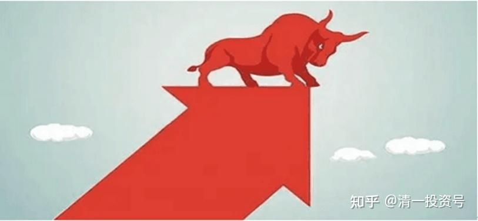
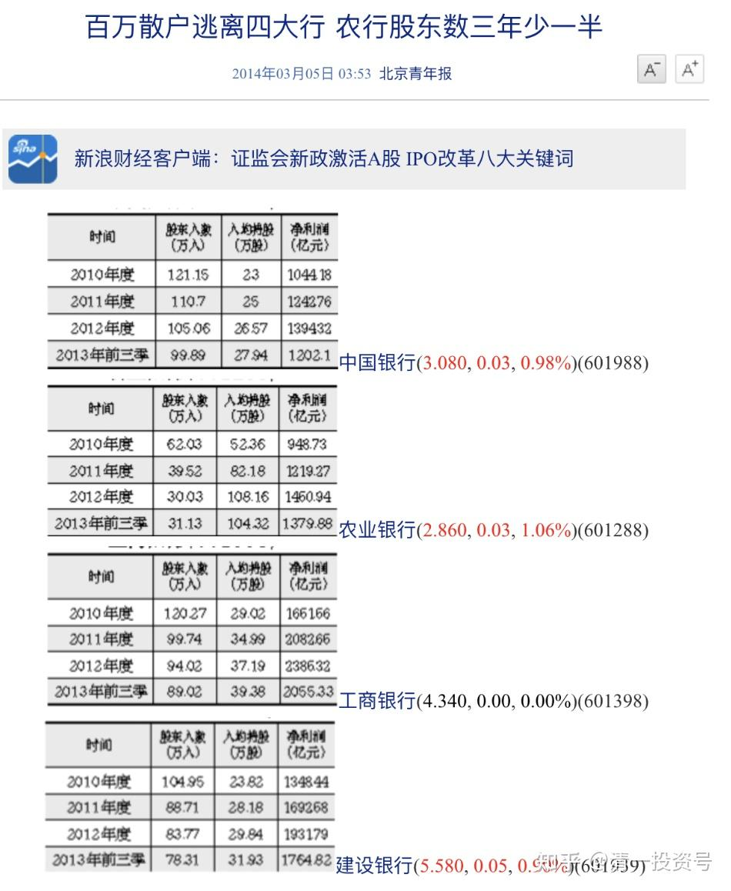
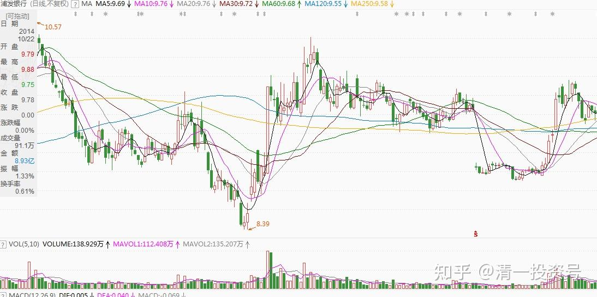
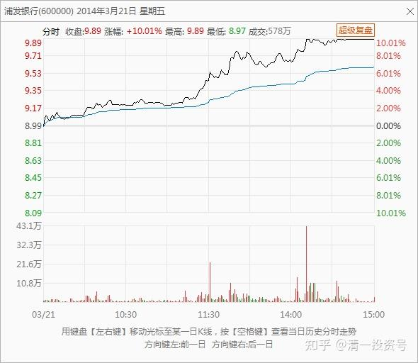
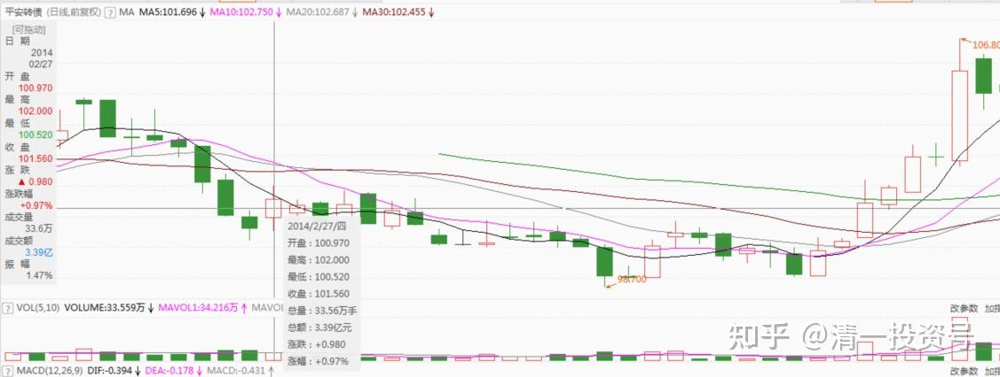
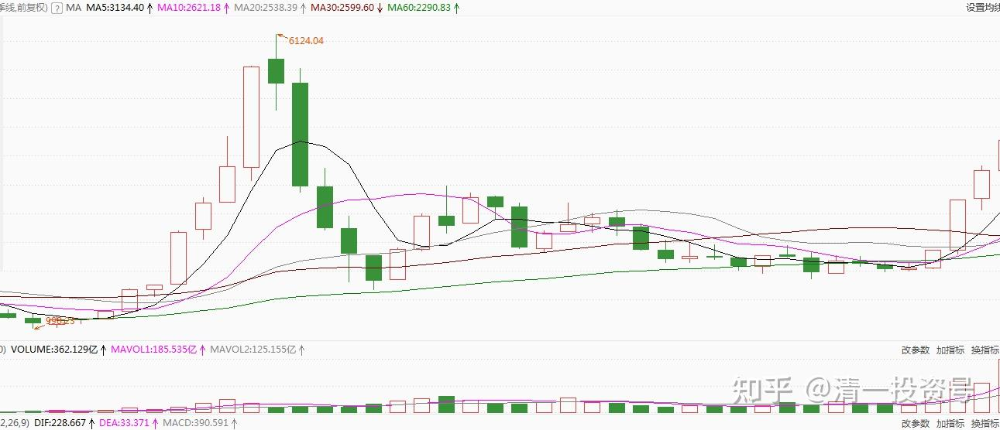

**

**

10篇.上一个牛市的思路及具体操作系列之二

清一山长2014年3月10日～6月27日

**一、牛市前期买入稳健的共和国长子银行股**

清一山长2014-03-10 22:25:21

去年底以来，一个好的迹象是**有一些长期资金在逐步建仓金融、房地产、能源等大盘蓝筹股，说明大周期底部区域就在附近。**但是长期资金进场不代表马上转势，机构大资金有时候会向上建仓，更多的时候是向下建仓。估计，上半年底部区域会形成，之后牛市可能会持续三年。

清一山长2014-03-10 22:30:47

**百万散户逃离银行，所有银行的户均持股大幅增加**（筹码集中了，是谁在收集呢？思考一下！）机构大资金有时候会向上建仓，更多的时候是向下建仓!!!注意，不要上当了，反而要与大机构共进退。

清一山长2014-03-21 19:21:24

三天前把最后的一部分资金全部买入银行股，主要是超跌的兴业以及跌到接近7元的民生、浦发等。今天浦发就涨停了，我以涨停价卖了后，感觉可能是操作错误。因为从盘面来看，主力开始，有意不封涨停，并不是没有资金（55亿元的成交），似乎是想洗净浮筹码。这显然不是冲着“分红”去的资金。因为其他银行股也能给出类似的分红（7%以上）。我认为这是用浦发来引领的新一波银行股行情，大家要关注好，不要乱炒，别以后赚点小钱只能看热闹。

为了防止踏空，我把涨停卖浦发的资金买了平安转债，它基本没有涨，还在底部没动。毕竟浦发已经赚了12%，换成平安转债后，我的安全系数最大。如果股市继续上涨，平安也一定跟涨。但是如果再度下跌的话，已经没有空间了。如果浦发等银行股再跌回原处，我就继续卖掉转债，买入银行股票。

这也是我的“套利思维”操作模式——**安全第一**。供财友们参考。

浦发银行

平安转债

**

**

清一山长2014-04-08 15:25:24

中国人反应真慢——20多天了，才知道来抢**“共和国长子”——银行股**，中间还创了新低（其实是主力故意打出来的坑）。其中兴业莫名其妙的打到8元多，白白送给我18%的好处（刚看到的兴业账面收益）。

这也说明：中国的确是投资的天堂。面对反应慢三拍的，不喜欢动脑子的国民，想不赚钱都难呢！

各位财猫守好自己的筹码，不要轻易被人骗走了。如果搞不清动向，就“死守”阵地，直到发现有新的赚钱机会为止（我判断今年下半年会有新的板块赚钱机会，到时候再分享给各位财子财女。如果到时候银行已经大涨了一票，回头来就是最好的机会，没有机会还是死守银行股）。

清一山长2014-04-08 20:55:11

提醒：

大家注意：你们目前要做的就是要避免受熊市思维影响过早出局。后面的行情比较大：**从大盘季线来看，市场同当年股改行情启动初期一样，史上第二次现主力建仓信号。这种罕见的投资机会，切不可错过。**

(上证季线图)

清一山长2014-04-15 15:38:22

保险公司的投资标的：银行股

数据显示，截至4月11日已披露年报的上市公司中，保险资金持股市值为4636.55亿元，保险重仓股前十的股票有7家是银行股(剔除集团持股的中国人寿和平安银行，分别是招商银行、工商银行、民生银行、农业银行、建设银行、浦发银行、光大银行，持股市值达953.62亿元。)

清一山长2014-04-15 15:52:53

以4月9日收盘价计算，有8家公司手中持有的货币资金未能跑赢总市值。例如，中国铁建货币资金为934.33亿元，当日总市值仅为550.25亿元；中国交建货币资金为854.87亿元，当日总市值为622.72亿元；中国中铁货币资金为814.23亿元，当日总市值为551.66亿元……

清一山长2014-04-20 18:22:48

一个月就完全翻脸？所谓的主力机构，无非就是反复无常的人，大家还是相信自己的脑袋更可靠。

从A股的“空头司令”到“头号多头”，国泰君安只用了不到一个月时间就完成了这个“华丽转身”。**在最近一周时间内，国泰君安更连发五次研报坚定唱多A股，引发市场的高度关注。**

在今年一季度时，国泰君安还是空方的典型代表，多次发表研报认为市场核心矛盾非标风险暴露时点未到，高风险属性行情正在从创业板向主板及更多蓝筹蔓延。在3月23日发布的策略报告中，还是持着看空态度，称优先股改革并不意味着实质性利好的出现，在增长下滑和信用风险不断暴露的过程中，投资需要避过雷区。

然而时隔半个月之后，国泰君安却来了个明显的空翻多，在4月8日发布的一份二季度研报以“400点大反弹：抢蓝筹，夺龙头”为标题，旗帜鲜明地表达了自己的看多意见。认为增量资金流入股市，将推动A股展开大级别反弹；预期二季度沪指将出现20%(约400点)的反弹空间，沪深300将出现25%以上反弹空间。

**二、卖房买股**

清一山长2014-06-16

股市，它是“一个注定最终只有少数人获胜的财富游戏”。可不是一个发钱的慈善机构。**在这里，你的任何缺点将以“亏损”表现出来，你的大缺点，自然就是“巨大的亏损”。想进金融市场来赚钱的人，如果不愿意克服自己人性的缺点，不提升自己的级别，只想玩点小聪明，是绝对走不通的。**

既然是财富课，就必须执行“财富原则”。而不是“大众原则”。**学习今日学堂，就要学会“做小众”，不要与大众在一起，不要“流俗”。**

清一山长2014-06-16

看看银行的贷款政策吧——你就算手里有房子，也卖不掉。就烂在手里好了。（二手房无贷款，多少人买得起？只有去买开放商的新盘）

中国工商银行燕郊支行一位房贷部门负责人也说，中国工商银行燕郊支行目前也针对单价在1万元/平方米以上的楼盘，执行首套房首付四成，利率上浮1.2倍的政策。另外，除了个别特定二手房代理行的业务，他们基本不再接收二手房贷业务。

清一山长2014-06-16 15:56:32

中央降准了，银行股活跃起来了——这一切，都已经证明了我在财富课堂上讲的政策博弈的判断——**政府正在用印钱来稀释风险**。存款的风险更大了，不投资的风险更大了，因为通胀正在快速成长。

不过，好消息是：房价估计可以稳住了，不用太担心房子贬值——因为通胀。

清一山长2014-06-16 16:07:08

我观察到：今年的实体经济表现很差，为了让面子好看一些，政府就只能用印票子哄哄市场了，刺激一下经济。反正小民也不喜欢思考，只要面值没有损失，就高高兴兴的过日子去了。

正因为实体经济很差，估计一时间股市也不会有太大的动作，继续结构调整的可能性更大一些。

清一山长2014-06-21 8:39:03

最近银行股的底部在悄悄的升高。前段时间卖出8.81元的华夏，转而大量购入7.5～7.6元的北京银行，证明操作方向对了（原来操作的时候对群内公开过这种消息的）。目前这单操作，成为我的账户内账面盈利最多的票。北京银行如果继续涨，计划反过来，就要卖出北京银行，重新买入华夏银行了。因为华夏目前的调整幅度太大，很不正常。北京银行接近华夏价位的时候，我认为可以就换股了（除非我发现华夏的调整是陷阱）。如果这两个股是主力做跷跷板互相对应的话，正好踏它们的节奏玩儿。

不过我不赞成把银行股作为唯一的投资，这样可能风险过于集中了。**这段时间我卖房子、**讲课等等回笼的新资金，均全部进入电力和能源行业了，银行股只是调仓买一些。这几天买了60万股的**华电国际**，此股分红都有7.5%，比银行还高。目前煤炭没有涨价的趋势，因此业绩可以维持下去。而且用重置成本法来看此股的话，目前股价是远远低于账面价值的，符合价值投资的原则。

另外，中国神华也是一个具有深度价值投资的股票，也是目前我买入的重点标的。这两个股，最大的好处就是：不管互联网如何发展壮大，都冲击不到了（银行业可能还会受到这种高新技术的影响）。因此电力能源具有巴菲特“消费股”的特征，稳定而持久，可以长期持有。盘面上，神华似乎已经有介入的迹象。

以上操作，均为本人自行投资的思考，不构成投资建议。据此操作，风险自负。

清一山长2014-06-27

神华研发新型机组，全球首次做到燃煤比天然气更环保。

这个东西就很厉害，什么是新能源概念股？这就是新能源，就是国家支持，政策保护的行业标准。如果有这个标准在手上，神华就要创造财富神话了。目前的盘面上，收集筹码的感觉很明显，财友们建议多多关注。我最近几个月的新资金，主要进入能源行业（神华和优质电力股，其中国投电力已经赚了25%了）

你现在可以买PE4.6的华电国际。我的最近入仓品种，2元多的价位。

悄悄地承认，我刚刚买了十万股中石油，用卖出中石化获得的利润干的。希望我的这个小小的动作，将来不会受到老婆的暴力惩罚。

(2014年12月6日评：不会受惩罚了2个涨停,给校长鼓鼓掌)

中石油是资源股，中石化是化工股，而且已经涨了很多，我还做了四次波动差价，基本实现了其价值。（当然，我的判断可能是错的，就接受错误好了）现在中东危机、伊拉克局势不稳，拥有石油资源的价值，比拥有炼化的价值更大。

