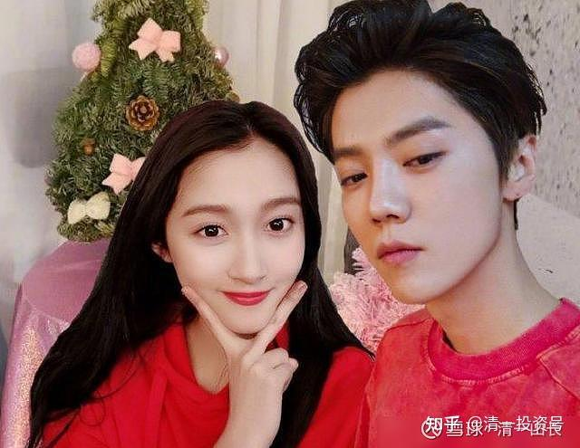
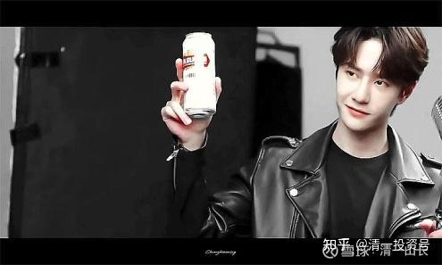

原雪球专栏**[167篇.男人们的划时代机会来临，抓紧了！](http://link.zhihu.com/?target=https%3A//xueqiu.com/9310099567/180926969)**

清一山长2021年5月26日

今日国际学校家长群的讨论

北京周慧春11:34:26

前天被同学叫去开导她女儿，期间孩子告诉我，同学都在迷明星，爱的都是小鲜肉。真无奈，孩子们喜欢的，是屏幕上的角色，现实生活中，是完全不同的人，最重要的是，现在戏子的素质太低，低到没有底线

广州姚力方2021年5月26日11:43:20

前段时间，有个青春期男孩家长拜访时，说到孩子对于自己目前不好好学习、吃喝玩乐的情况，给父母唯一的解释就是：我以后要找个富婆。让父母哭笑不得。无独有偶，这个妈妈说，她与另一个不同校的男孩妈妈聊起来时，对方妈妈居然说与她家儿子想法一样！

她说这种心态在高年级男生当中颇为普遍，妈妈也无力管教，只能听之任之。男生想富婆，女生想小鲜肉。冬令营的时候，学堂里来了一个（国际学校）男生，据说像某个小鲜肉，有的（体制）女生居然在厕所前堵截，要求他给自己签名。

@无际浪子：有次上课，学生们放鹿晗的歌，我问了一下这个唱歌的是男的女的？结果有个女生愤怒地瞪了我一节课。的确，我也弄不清他是男的女的，跟女人在一起，也更像闺蜜！[大笑]

鹿晗金发正面照：双兔傍地走，安能辨我是雄雌？[大笑]

山长清一2021年5月26日13:38:38@广州姚力方

其实吃软饭，现在社会上已经很普遍了。现在的小鲜肉文化，让男性现在也可以靠生殖器来讨生活了？这在过去，是女人的专利呢！现在时代不同了，“文明进步”了，男人也有了女人一样的机会！我们男人应该感到荣幸才对。女人们现在真的强大了。正好现在的媒体培养女生追小鲜肉，以后各位家长的男生，就可以靠颜值生活，以后理直气壮地对自己老婆说：“我负责貌美如花，你负责赚钱养家！”[大笑]

我老婆刚过来，看我写男人们的“机遇”文，就跟我开玩笑，说：“男人们都有机会，建议我现在可以抓紧机会，也去泡个富婆[捂脸]。”我郁闷地告诉她：“年轻时还有点希望。现在，我早就不是小鲜肉了。过时了，就一块干巴老腊肉，没人看得上了！[俏皮] ”