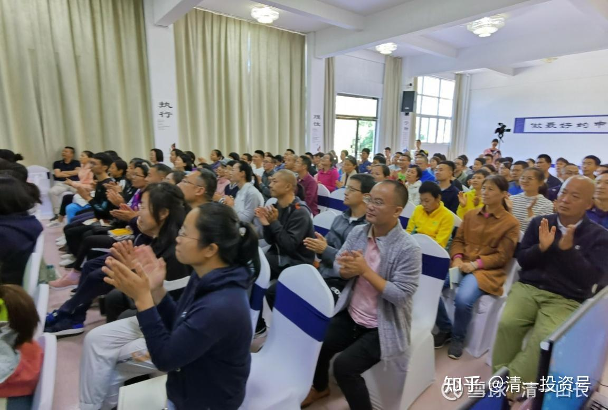

原雪球专栏**[169篇.清华总裁班学员的心理行为学课程记录](http://link.zhihu.com/?target=https%3A//xueqiu.com/9310099567/181564192)**

[清一山长](http://link.zhihu.com/?target=https%3A//xueqiu.com/9310099567/column)2021年6月2日

一场电影看了四天，一个“**你是谁**”居然就讲了17天！才勉强让学员明白了“**身份、愿景、信念**”是什么！学员们反馈说学我的课程很艰难，写作业都累死了。昨天很多人还学到哭——因为正在上的课程是“魔鬼孩子”背后的“魔鬼妈妈”心理分析课程，是分析一个12岁杀掉母亲的孩子的信念系统，以及人格障碍的形成过程，让很多妈妈们看到了自己也在用一样的方式培养孩子，发现正在制造魔鬼。只要你用行动，制造了魔鬼信念，这些信念最终会发展成魔鬼的行动。

以下是学员的课程日记：

记录一：

学员：东莞廖李波

节选：我们学习很费劲，而且效率也很低，新教育的孩子们学习能力强，效率很高，这明显看到了学习结果的优秀与你的能力、年龄、学历是无关的，与我们的信念系统息息相关。我们是体制学校教出来的学生，有很多错误的信念系统影响我们这一生。今天下午的个案分析，看到助教老师与小公主强大的思维和分析问题的能力，帮助案主找到卡点所在，不是亲眼所见，你能相信一个13岁左右的孩子有帮助一个成年人解决人生问题的能力吗？

记录二：

学员：付向东

今天的课程对我来说收获最大的有两点。第一点是：今天的课程让我倍感压力，原因就是课程再有4天就结束了。课程从一开始的时候就着眼于愿景、信念、真实身份和虚假身份，半个多月以来山长从正面的例子、反面的例子，还有电影课，通过申请由3天增加到了4天，但直到昨天，写的作业，我自己还是稀里糊涂，没有能够准确地把握愿景、信念系统、真实身份与虚假身份。今天和山长的答案印证，觉得自己怎么也把握不到核心要点。分析背后的原因主要是，过去自己受体制教育，完全就在于文字上去下功夫，回答问题只要是把那个词或者那个句子答出来就行了，很多都是概念与名词的游戏。而很少去反思这句话、这个人真正表达的是什么？就是对文字的感悟能力很差。觉得自己过去受了十几年的教育，从小学、初中、高中到大学，甚至后来也去清华上了总裁班，直到现在才发现自己过去所受的教育全是假教育、伪教育，对自己的人生很难有这次课程这么大的帮助。

这次课程让我自己更加坚定走新教育的道路，自己确实是有非常大的福报，能有这样的机会走进新教育，接受到真正的教育。但是感到压力大的是，经过将近20天的学习，自己对愿景、信念系统这套心智模式还是没有能够非常好的掌握。这次回去之后把这个21天的课程自己再重新梳理一遍，把课程的一些要点和自己的生活以及实际生活中的人和事相结合，重新审视自己的生活，建立自己的目标，对这次课程做一个更加贴近生活的复习和推进，将来能够把真正课程上学到的这些东西应用到自己的实际生活中去。

今天课程对我第二个比较有触动的点就是，最后讲到的，其实**只有10%的人适合读书，有90%的人要去做事。**真正重要性的排序，我过去也知道是要先做人、再做事，再读书，但是落实到实际中呢？确实总是希望自己的孩子还是要以学习为重，这个可能和自己的成长经历有着密切的关系，因为在自己的成长过程中，父亲也是一个特别重视教育的人。我当时在家里父亲就说你的任务就是读书，你把书读好了，其他什么也不用做。在父亲他们的价值观体系里，离开农村最好的出路就是读书，这可能和中国几千年的科举考试选拔制度有着特别深的关系。这一点我在教育孩子的过程中，也延续了父亲的做法。所以在我们家老大的教育上，当时也是只要把学习搞好，其他方面都可以，我就是选择性的忽略。所以老大尽管上了美国排名前三十的大学，但是她给我的反馈就是：她自己感觉她好像除了读书什么都不会做。所以她当时考研究生的时候，我问她为什么要上研究生？她给我的答复就是她还没有想好自己到底想做什么，可能是想延缓进入社会，觉得自己还没有准备好。我就觉得如果连接受过美国这么好体制教育的一个孩子，到毕业时都没有自己明确的人生目标和信念，我觉得再拥有了多大的能力其实都是没有意义的。

通过今天的课程我放下了对“万般皆下品，唯有读书高”这样的一个根深蒂固的信念，觉得培养孩子真正的要点，还是**先让他们能够有一个良好的品质，具备一个很好的心性**。就像这次的心理行为课，我觉得虽然只有21天，但是我觉得是我整个生命过程中最重要的一个课程。第二是要学会做事，因为学得再好的知识与智慧，最后还是要落实到做事上来，只有通过做事才能把自己的能力、知识转化出去。所以我觉得前两者是个基础，具备了前两者之后，如果有自己的目标，这样的话再去读书、学习才会有价值，最终读书和学习还是要服务于自己的目标的。

我们往往在孩子年龄越小的时候，对孩子的期望越高，但随着孩子年龄的不断增加，我们对孩子的期望又随年龄增长被迫降低。这次的课程只不过是给我们指明了一条正确的道路，就是如果按照我们目前的所思、所想、所做，那只会削弱孩子的能力。我这次课程之后，我才能够对“父母是原件，孩子是复印件”这件事情有了更加深刻的认识，**我们给孩子复制的是信念系统，原来只是停留在表面的行为上。只有我们父母放下了对孩子的期待，孩子才会真正承担起他们自己成长的责任；我们父母放下了对孩子削弱他们能力的帮助，孩子才会自己动手、自食其力。当他自己能够自食其力之后，才会有能力去帮助他人，帮助这个世界，成长为一个更加有价值的人。**

评论回复：

**石头思维2021-06-02** **11:54回复清一山长：**

请问报名学费是多少啊？

**清一山长2021-06-02** **12:46回复石头思维：**

不对外。也早就没名额了。这是我们自己的内部培训，主要是新教育的家长参加。[笑]