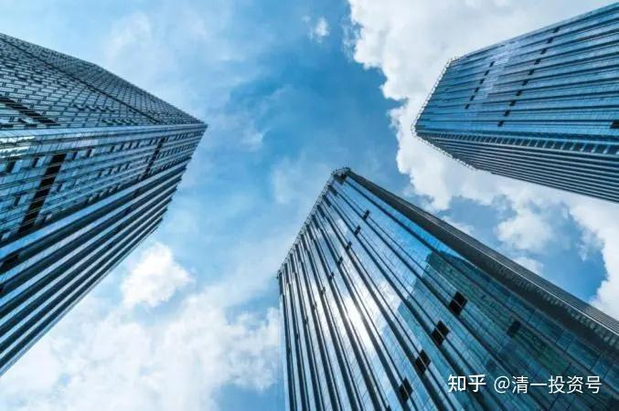

16篇.中国建筑系列之十四：买中国建筑的好处就是可以安心睡觉

清一山长2021年4月21日～4月28日

**导读：**

一、用最老实的方式来买未来可靠性、确定性最高的股

二、每个人只能赚能力圈之内的钱

三、中建关键指标没问题就安心持股

四、中建是资产保值、增值的需要

**正文：**

**一、用最老实的方式来买未来可靠性、确定性最高的股**

[@万物周期](http://link.zhihu.com/?target=http%3A//xueqiu.com/n/%25E4%25B8%2587%25E7%2589%25A9%25E5%2591%25A8%25E6%259C%259F)回复[@清一山长](http://link.zhihu.com/?target=http%3A//xueqiu.com/n/%25E6%25B8%2585%25E4%25B8%2580%25E5%25B1%25B1%25E9%2595%25BF)：

我记得你以前买过融创哦？

[清一山长](http://link.zhihu.com/?target=https%3A//xueqiu.com/9310099567)2021-[04-21 14:50](http://link.zhihu.com/?target=https%3A//xueqiu.com/9310099567/177759438)回复[@万物周期](http://link.zhihu.com/?target=http%3A//xueqiu.com/n/%25E4%25B8%2587%25E7%2589%25A9%25E5%2591%25A8%25E6%259C%259F)：

我重仓过恒大，也的确也买过融创，这是我很成功的记录。5元买入，37元清仓，这又不是啥失败的记录。

这是民企没错，买的时候很纠结，不敢放手大仓进入。买中国建筑，就敢大仓——可惜不赚钱[捂脸]。但我就是不走，不赚钱就不离开！[笑](其实中国建筑是我A股最赚钱的股，只是现在啤酒很快就要超过它了）。我是交易者，赚了就跑了。去年买的这部分还没咋赚。（几毛钱，算是财务成本，不算赚的）。

@在赚一亿的道路上回复@清一山长：

山长，有没有比中国建筑更好的股。虽然我重仓中建，也赚钱了。三年期投资的话。我之所以这么问，因为我发现你眼里就只有中建。

清一山长2021-[04-23 16:12](http://link.zhihu.com/?target=https%3A//xueqiu.com/9310099567/178008584)回复[@在赚一亿的道路上](http://link.zhihu.com/?target=http%3A//xueqiu.com/n/%25E5%259C%25A8%25E8%25B5%259A%25E4%25B8%2580%25E4%25BA%25BF%25E7%259A%2584%25E9%2581%2593%25E8%25B7%25AF%25E4%25B8%258A):

有没有比中国建筑更好的股？

您这句话，就是没有受过教育训练的问话，因为没有内容。没有细节、内涵。“好”只是一个价值判断，怎么说，都是对的。

我可以说：就没有比中国建筑更好的股。因为12345.等等。不信你去找一个世界第一的建筑企业给我？中国300米以上高楼90%都是中建盖的，还有第二家吗？

但我猜：你想问的，其实是：难道就没有未来会比中建涨得更多的股票吗？

答案也很简单：当然有，还很多。我相信未来三年，很多股票都可能比中建涨得多。甚至华侨城都有可能比中建涨得多。

问题是：我不知道是谁，肯定会比中建涨得多。除非我穿越到2024年，看看股票报价，再穿越回来买股。

**如果我没有时空穿梭机的话，我就用最老实的方式来买股：未来涨的可靠性最高的股，确定性最高的股。**基于我的认识能力，目前只有中建。**其他是“可能性”。中建我赌确定性。**

正因为有确定性，我才公开宣扬一下。其他没确定性的，我自己买。比如9.22元的珠江，我也没大肆宣扬。但我买的时候，认为这个价，技术上来说，是安全的。中建是：技术上不知道怎么看，但基本面是安全的。[俏皮]

**二、每个人只能赚能力圈之内的钱**

@在赚一亿的道路上回复@清一山长:

山长，之前我有个朋友说中顺洁柔很好。我也是对应市盈率，增速确定的中建。我觉得中建安全，确定性高。中顺洁柔当时市盈30出了。但他有句话点醒了我。他说确定性是最重要的，但确定性高增长比确定性低增长要更安全，只要估值合理。虽然我还是持中国建筑，但我觉得有些东西正在悄悄改变，但能力圈有限路会越走越窄。

清一山长2021-[04-23 20:13](http://link.zhihu.com/?target=https%3A//xueqiu.com/9310099567/178035750)回复[@在赚一亿的道路上](http://link.zhihu.com/?target=http%3A//xueqiu.com/n/%25E5%259C%25A8%25E8%25B5%259A%25E4%25B8%2580%25E4%25BA%25BF%25E7%259A%2584%25E9%2581%2593%25E8%25B7%25AF%25E4%25B8%258A):

每个人都只能赚能力圈之内的钱。您能弄懂中顺洁柔的上涨逻辑，当然可以去买它。涨了，不一定就是“对了”。赛道股有投资逻辑吗？有。但不是我的逻辑，是我弄不懂的逻辑。

您看来是**“有效市场理论”**的拥护者，可惜我不是。所以，我们两是没法讨论啥好啥不好的。基础的投资逻辑不一样。

晕娜和我的投资持股逻辑不一样，我们能相互了解。

你和我们两人的投资逻辑都不一样，我们能够了解你。但你却不了解我们的逻辑。**我们三人都持有中建，但持有的逻辑，其实完全不一样。心态自然也不一样**[笑]。我相信，您原来认为中建“最好”才买入。现在有点觉得“不太好“，因为它就是不涨。所以你才来问我它好不好？其实真问错人了：我根本不在乎它涨不涨。因为我不用涨跌来判断它好不好。

**三、中建关键指标没问题就安心持股**

@唯宁静方能致远回复@清一山长：

经营现金流持续为负，很可怕的。

清一山长2021-[04-24 09:30](http://link.zhihu.com/?target=https%3A//xueqiu.com/9310099567/178062133)回复[@唯宁静方能致远](http://link.zhihu.com/?target=http%3A//xueqiu.com/n/%25E5%2594%25AF%25E5%25AE%2581%25E9%259D%2599%25E6%2596%25B9%25E8%2583%25BD%25E8%2587%25B4%25E8%25BF%259C)：

你也不看中建的这些现金流，流动到什么地方了。只会呆说，呆算！所谓的呆会计[笑]

今日学堂连续18年现金流为负，这很可怕吗？

没有这十几年的投入，就没有今天的竞争力！未来只需一年，就可以收回和抵消掉18年的负现金流，变成大大的正现金流。

BTW，中建今年的现金流是正的200亿流入。

@速隐刀回复@清一山长:

“要准备好拿十年不涨的心理准备，才能买中建”，这么长时间的资金成本、机会成本有几个人能受得了？千万以上资金量的大户，寻求的是资金安全、稳健增值，拿出一半资金买中建非常合适。而小散们就还是别尝试这种股了，去找从底部已经爬起来的票比较合适。

清一山长2021-[04-24 14:24](http://link.zhihu.com/?target=https%3A//xueqiu.com/9310099567/178073247)回复[@速隐刀](http://link.zhihu.com/?target=http%3A//xueqiu.com/n/%25E9%2580%259F%25E9%259A%2590%25E5%2588%2580):

认为不能买中建：看来您这种人，比较适合买高大上的茅台，您坚持再拿12年也行，也许再涨60倍？这是别人的成功经验喔[笑]。

[@Lu小俊](http://link.zhihu.com/?target=http%3A//xueqiu.com/n/Lu%25E5%25B0%258F%25E4%25BF%258A)回复[@清一山长](http://link.zhihu.com/?target=http%3A//xueqiu.com/n/%25E6%25B8%2585%25E4%25B8%2580%25E5%25B1%25B1%25E9%2595%25BF):

老师是中建代言人。

清一山长2021-[04-28 10:09](http://link.zhihu.com/?target=https%3A//xueqiu.com/9310099567/178438944)回复[@Lu小俊](http://link.zhihu.com/?target=http%3A//xueqiu.com/n/Lu%25E5%25B0%258F%25E4%25BF%258A):

我不是中建代言人。中建的代言人应该是[@晕娜](http://link.zhihu.com/?target=http%3A//xueqiu.com/n/%25E6%2599%2595%25E5%25A8%259C)。他是全仓中建的。守了7年的，我新买入中建也就半年多，不到一年。

其实，我买了不少其他股。**推推破5元的中建，是他这个价格最安全。我是当保险资金玩的。**别的就算损失了，中建可以稳住我的账户。不至于亏惨了。不过，目前是我的风险股都在赚，甚至大赚（比如各种酒），中建却一直不涨，真的“够稳定”了。所以，其他我赚了钱，想要落袋为安的部分资金，就会转投中建了。所以越买越多。总仓位上，中建的配比并不多。30%左右吧！

@愿您开心回复@清一山长：

睡眠质量很好，你自己说中国建筑跌得比荣盛发展还猛，睡眠质量很好？[笑笑笑]

清一山长2021-[04-28 10:56](http://link.zhihu.com/?target=https%3A//xueqiu.com/9310099567/178448585)回复[@愿您开心](http://link.zhihu.com/?target=http%3A//xueqiu.com/n/%25E6%2584%25BF%25E6%2582%25A8%25E5%25BC%2580%25E5%25BF%2583)：

搞搞笑[为什么]。荣盛涨跌，关我啥事？中建涨跌我都不在意的。我连中建的盘都不看的。

昨天中国建筑跌，荣盛还涨。我睡得好好的。今天荣盛破位下跌，又不是我干的。无非是我盘前的解析，财报的问题，被持有者也看到后，不放心抛售的结果。

一句话：荣盛来个涨停，中建来个跌停，我也照样睡得好。因为我相信中建的财务不会有问题！

@深圳属牛的金牛座回复@清一山长：

山长，年报以后中建已经连跌了7日，能否给一些技术上的分析指导[献花花][赞成]

清一山长2021-[04-28 11:12](http://link.zhihu.com/?target=https%3A//xueqiu.com/9310099567/178451464)回复[@深圳属牛的金牛座](http://link.zhihu.com/?target=http%3A//xueqiu.com/n/%25E6%25B7%25B1%25E5%259C%25B3%25E5%25B1%259E%25E7%2589%259B%25E7%259A%2584%25E9%2587%2591%25E7%2589%259B%25E5%25BA%25A7)：

中国建筑，有啥技术走势好谈的？[捂脸]说了，我都不看中建走势的，因为没必要看。我连年报都不多看，关键指标没问题就行了。

你们想看中建技术走势的，自己看去，别找我看！[吐血]

**四、中建是资产保值、增值的需要**

@晕娜回复@清一山长:

山兄：多谢您赞赏！我有点不敢当。有关中建，该说的，都说了，真的没什么要再说的了。我有点累了，想离开雪球了。

清一山长2021-[04-28 11:22](http://link.zhihu.com/?target=https%3A//xueqiu.com/9310099567/178453132)回复[@晕娜](http://link.zhihu.com/?target=http%3A//xueqiu.com/n/%25E6%2599%2595%25E5%25A8%259C):

等中建涨了再走吧[笑]。现在跌跌不休的，正式需要你的勇气来鼓励中建持有人的时候。反正我看中建就是不涨，还跌，我买了被套住了，就会去看看你的文章——看中建的各种数据和报道。然后就安安心心的睡觉了。你走了，总觉得少了一个中建排雷手，在负责监管中建的经营，可能以后就睡不着了[笑]

其实，别人在看中建作死，持有它没希望。我反而认为：中建希望就在眼前！这种走势很意外，但只能说加速赶底。快否极泰来了！

[@小散自由之路](http://link.zhihu.com/?target=http%3A//xueqiu.com/n/%25E5%25B0%258F%25E6%2595%25A3%25E8%2587%25AA%25E7%2594%25B1%25E4%25B9%258B%25E8%25B7%25AF)回复[@清一山长](http://link.zhihu.com/?target=http%3A//xueqiu.com/n/%25E6%25B8%2585%25E4%25B8%2580%25E5%25B1%25B1%25E9%2595%25BF):

这么重大的身家都全仓一只股，也太没有风险意识了。还想做私募，全仓一只股的，谁敢交钱给他？有点风险意识的、有点经验的应该都不敢。

清一山长2021-[04-28 12:06](http://link.zhihu.com/?target=https%3A//xueqiu.com/9310099567/178458853)回复[@小散自由之路](http://link.zhihu.com/?target=http%3A//xueqiu.com/n/%25E5%25B0%258F%25E6%2595%25A3%25E8%2587%25AA%25E7%2594%25B1%25E4%25B9%258B%25E8%25B7%25AF):

真不能这样说:别人全仓茅台的（董宝珍），不照样做私募？

[@晕娜](http://link.zhihu.com/?target=http%3A//xueqiu.com/n/%25E6%2599%2595%25E5%25A8%259C)全仓中建，他没风险意识？

看你全仓谁了。全仓高位的上海机场，的确有点疯。但上海机场十几元，20几元的时候，全仓没毛病。

晕娜回复@德彦4zc:

中建：未来十年，会逐步提升分红率的。这个因素，要考虑进去。本人预测：未来5年，中建分红率会逐步提升到30%。2030年，分红率在30～50%之间。

清一山长2021-[04-28 13:48](http://link.zhihu.com/?target=https%3A//xueqiu.com/9310099567/178469585)回复[@晕娜](http://link.zhihu.com/?target=http%3A//xueqiu.com/n/%25E6%2599%2595%25E5%25A8%259C):

晕总的意思，就是认可2030年每年有450亿的分红。今年是90亿分红！所以2030年，每股分红大约是1.1元。此时的中建总利润，大约是1000亿～1600亿之间。市值：大约万亿吧！

这就是中建的明牌。没啥悬念！也是晕总长持中建的理由，我认同这个理由。

（私底下，我觉得晕总的这个预期，有点保守。没有考虑10年后通胀，货币发行放水的因素[笑]……）

所以，我拿中建，是资产增值，保值的需要。防止手上的现金，被发行货币的人抢劫了。求稳，不求赚钱。未来，肯定赚钱！

标题为编者所加

参考链接：

[清一投资号：1篇.中建背后的神秘大手](https://zhuanlan.zhihu.com/p/481078141)（整理文）

[清一投资号：3篇.中国建筑系列之一：就算是好股，也别谈恋爱](https://zhuanlan.zhihu.com/p/512602669)（整理文）

[清一投资号：4篇.中国建筑系列之二：大A股的稳定器](https://zhuanlan.zhihu.com/p/519506160)（整理文）

[清一投资号：5篇.中国建筑系列之三：发现投资机会的方法](https://zhuanlan.zhihu.com/p/522851722)（整理文）

[清一投资号：6篇.中国建筑系列之四：只有少数人才知道正确的通道](https://zhuanlan.zhihu.com/p/522882446)（整理文）

[清一投资号：7篇.中国建筑系列之五：投资中建的核心逻辑和理由](https://zhuanlan.zhihu.com/p/528942534)（整理文）

[清一投资号：8篇.中国建筑系列之六：熊市布局，牛市收获](https://zhuanlan.zhihu.com/p/534585889)（整理文）

[清一投资号：9篇.中国建筑系列之七：每个人都应有自己的投资逻辑](https://zhuanlan.zhihu.com/p/538090859)（整理文）

[清一投资号：10篇.中国建筑系列之八：为自己的投资负完全的责任](https://zhuanlan.zhihu.com/p/549316895)（整理文）

[清一投资号：11篇.中国建筑系列之九：如何用融资投资中国建筑？](https://zhuanlan.zhihu.com/p/559571938)（整理文）

[清一投资号：12篇.中国建筑系列之十：综合对比下中建的长远价值](https://zhuanlan.zhihu.com/p/564749726)（整理文）

[清一投资号：13篇.中国建筑系列之十一：多年不涨的中建，值得坚守](https://zhuanlan.zhihu.com/p/566546633)[（整理文）](https://zhuanlan.zhihu.com/p/568853074)

[清一投资号：14篇.中国建筑系列十二：长持股的价值投机操作及未来畅想](https://zhuanlan.zhihu.com/p/568853074)（整理文）

[清一投资号：15篇.中国建筑系列之十三：从年报的角度再次解读超低估的中建盘面](https://zhuanlan.zhihu.com/p/572007510)（整理文）

[清一投资号：8篇．建筑的股性正在激活中](https://zhuanlan.zhihu.com/p/476832159)（整理文）

[清一投资号：13篇.中国建筑对话录：不养独子](https://zhuanlan.zhihu.com/p/463971765) （整理文）

[清一投资号：17篇.中建股东数历史新低](https://zhuanlan.zhihu.com/p/505901339)（整理文）

