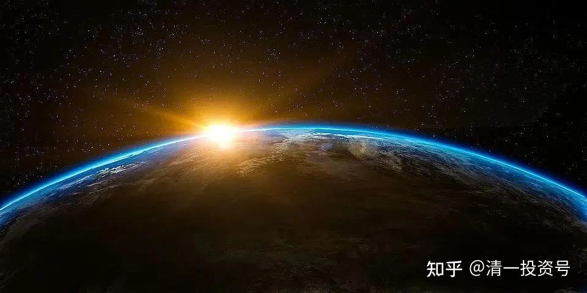
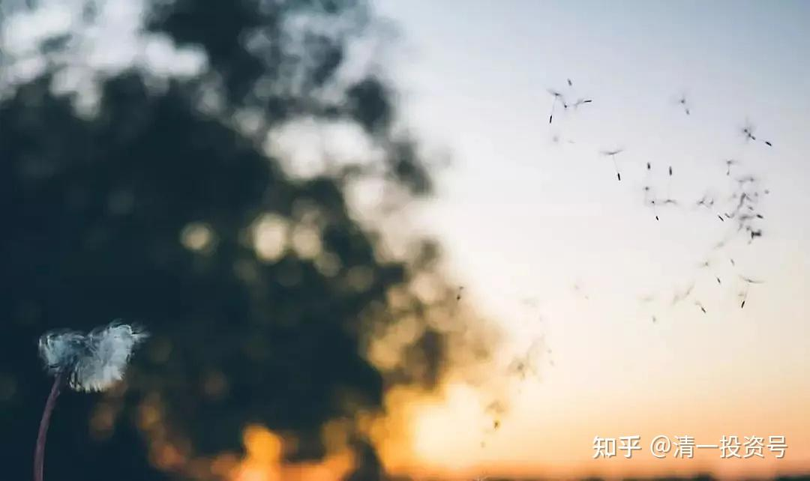
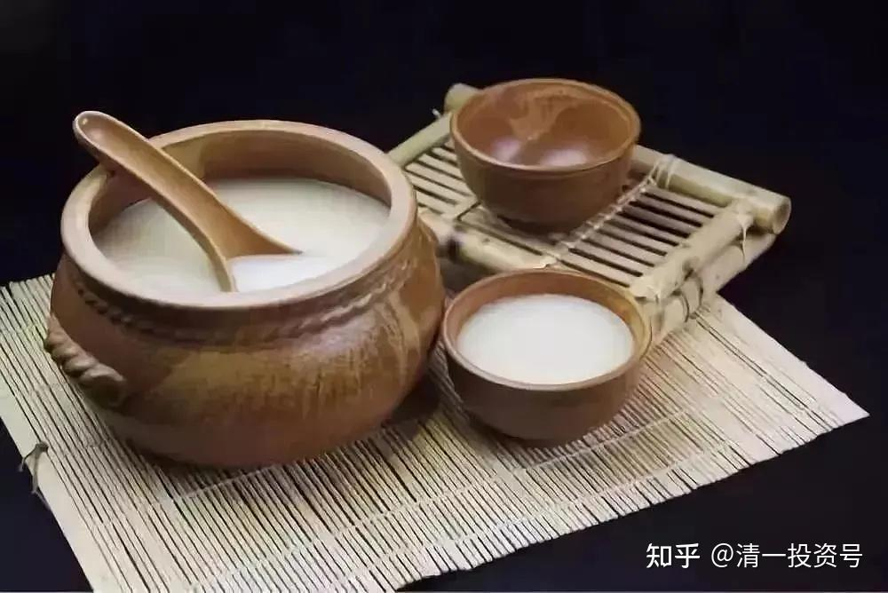
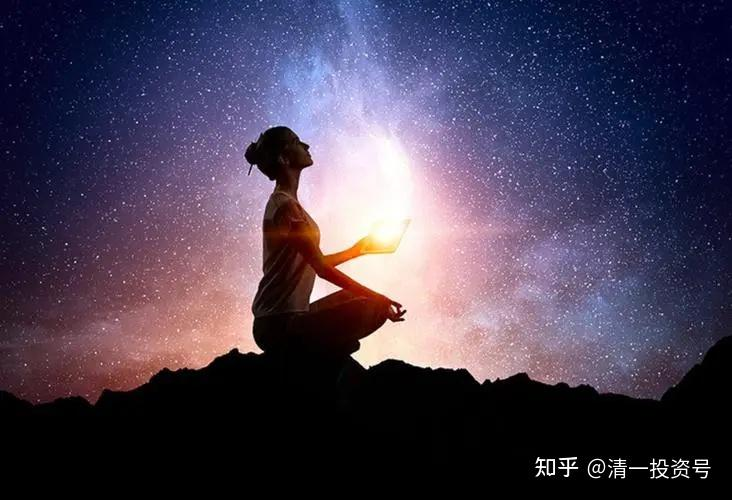
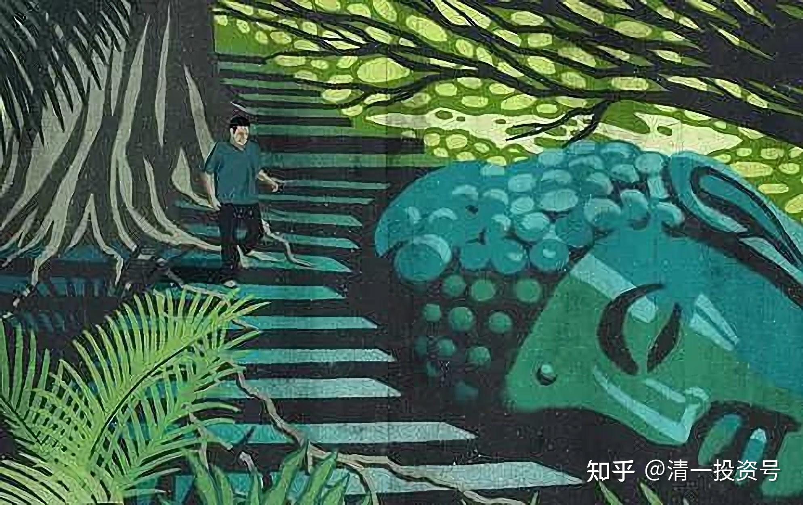

[原雪球专栏](https://zhuanlan.zhihu.com/p/574879071/edit)**[171篇.不懂医学，就用生命来支付无知的代价](http://link.zhihu.com/?target=https%3A//xueqiu.com/9310099567/181954415)**

清一山长 2021年6月6日

这是我8年前讲中西医学系统的课程记录。有兴趣就看看。我的大道医学课程，让西医执业20年的医生叹服：对西医体系的研究深度（分析西医逻辑结构和医学理论）的文章，如果拿到西医的医学杂志上发表，都是优秀论文。更让多名西医再也不愿意继续原来的工作，辞职了事。这说明：我肯定不是不懂西医的医盲，我也不是中医的脑残粉。我对中医的研究，也让很多中医不得不承认我找到的中医盲区。我在新浪博客上的医学文章，你们有谁能够有理有据地写出反驳文章来，我打赏一百万。我找过资深的中医和西医医生，来挑我文章的毛病，他们表示没办法反驳。您有本事挑毛病？我就真打赏，交你这个朋友了，您绝对是大才！谁有本事，就去写出对我的疾病治疗手段的中西医比较文章的反驳文章来吧！我的新浪博客上有我的文章原文。（注意，是反驳，不是谩骂。别拿街头大妈的手段来领奖金，那是不可能的，这种本事我不奖励）

**无知的代价很高，甚至需要用生命来支付**

原创清一山长[清一新教育](http://link.zhihu.com/?target=https%3A//xueqiu.com/)

微信网页链接：

[https://mp.weixin.qq.com/s/cx7DHJz46expMkw2SdK5oQ](http://link.zhihu.com/?target=https%3A//mp.weixin.qq.com/s/cx7DHJz46expMkw2SdK5oQ)

新浪博客网页链接：

[http://blog.sina.com.cn/s/blog_4f7cd6a10102e3um.html](http://link.zhihu.com/?target=http%3A//blog.sina.com.cn/s/blog_4f7cd6a10102e3um.html)

本博文发表于2013年7月8日

大道医学体验班今天结束了。同以往的培训一样，一方面每天的课程，让学员们强烈地感到“这辈子白活了”的失落感，过往日常践行的很多“人生经验”，在大道思想的“照妖镜”检验下，居然是如此的弱智和漏洞百出。学员们发现：因为自己的无知，居然一直在用各种方法残害自己，残害自家孩子和亲人。**无知的代价实在很高**，**社会上充满了很多专门利用你的无知来赚钱，甚至无情地夺走你性命的个体和集团。**因此，“借我一双慧眼”就成了学员们最期待的事情。

另一方面，学员们也感到很庆幸：居然能够在自己“还有救”的时候，得以聆听“大道医学思想”，有机会改变自己和家人的健康和命运；得以了解在“西医无解”和“中医也无解”之后，还可以拥有自我掌控医疗和健康的能力和机会。

大家都想掌握医学的奥秘，从哪里下手呢？一般人会选择从学习某种“医学和健康技术”开始。要让培训班的学员学会一种医疗技术很容易——**这个世界上有太多的医学技术以及健康知识可以去学习。**但是要让学员懂得一种**“医学思想和医学思维模式”**却很难，在世界上几乎就没有这样的培训课程。而一旦掌握了“大道医学思想”以后，学员们自己也可以学习，以及创造自己的“医疗技术体系”了，而且可以很容易地把接触到的各种医学技术融会贯通。

因此，学医想要入门，最简洁，也最高明的方式，并不是去学“某种医疗体系和技术”，而是去**学习“医学之道”，学习医学思想，了解医学模式以及医学的本质。**而这种“为道日损，为学日益”的“医道学习”模式，正好在**“大医学塾培训班”**就可以得到。我相信“大医学塾”目前所做的工作，正在改变一部分“先明白起来”群体的生活和思维方式，让他们有机会“明明白白地生活和工作”。

最有意思的是：这两次的**“大医学塾培训课”**，每一期都有“医学专业人士全程监控”，上一期有两个医疗行业的从业人员参加，因为这个缘故，我通过他们了解到医疗界的很多不为人知的背后黑幕；本期的学员，也有一个是正规医学院毕业，并从事了20年医疗工作的“资深专业医生”。一开始上课，我就特别提醒他：我本次讲课，有很多是讲西医医学治疗案例的，如果有理解错误，请他出来指正，以免我误导其他不懂医的学员。另外，我讲的大道医学理论体系，如果他认为有任何对医学的理解错误，也欢迎随时指出。**我可不是一个爱面子的人，在真理面前人人平等。**学员们花钱来参加医学培训，可不是来听我瞎忽悠人的。

结果，他听完我对西医治疗案例的层层“解剖”，我问他哪里讲错了，他说：“西医的确是这样看待疾病和治疗的。”我说这种处理方式明显有很严重的逻辑缺陷，根本不符合医学常识，他学习和执业20余年，怎么就没有发现呢？结果他很不好意思，说“原来被西医洗脑了”，**只知道按课本的要求就这样做，根本没有去思考“到底为什么要这样做”，更不会想书本上的正规医疗程序会有什么问题。**自己在实践中也奇怪过：为什么医院的“治疗”总是没有效果，以为开发出新的方法就可以了。现在发现西医由于医疗方向的错误，无论如何努力都不会有效的。

这位医学专业人士，成为本次培训班的“收获最大的学员”，他不仅仅学到了全新的医学思想，而且自己的身体还得到了“实证结果”——一周后居然成功地减肥了6斤，成为本班的“减肥冠军”，比参加减肥营的效果还好。更重要的是整个减肥过程一点也不受罪。不过**“减肥”并不是本培训的“唯一方向”**。一些身体比较瘦弱的学员，同期却“增重成功”，证明了大道医学的奇妙之处——“**高者抑之，下者扬之**。”**“平衡”才是道家的核心思想。**因此，同样的生活方式，可以让过重的学员“减肥”，却让瘦弱的学员增重。也证明本班的饮食习惯，的确增强了“脾胃系统”的能力，不仅“能消善化”，而且提供了身体最需要的能量食物。

这一期的学员，除了练功外，还分别体会了“萧氏拍打法”和“清一拍打法”。前四天的拍打法自愈体验，由参加过萧宏慈拍打训练营，并组织过拍打体验班的南京施先生（今宁）带领大家拍打。第五天我另外教给学员们一套“武当派内家拳拍打法”，这是原来的武当山道人用于提高武功修为的一种拍打法，与“萧氏拍打法”有明显的不同，让学生们感到极为新奇——拍打原来还分不同的派别？

学员们体验的结果，认为“萧氏拍打法”要更费劲一些，另外拍打出来可能是浅表的病气，而“清一拍打法”虽然很轻，但是可以拍打出深层的病气——因为前几天没有排出病气的地方，用“清一拍打法”后就出现了很多红黑斑。学员认为：最大的区别是：“清一拍打法”可以明显地感受到身体内气血的流动，而且越拍越想拍。

如学员赵爱丽说：“‘清一拍打法’很是神奇，拍打时没有了萧式拍打的那种痛，而是热热的、痒痒的，能很快的把体内毒素拍出（我的很多，好吓人）。”不过，大家表示：两种拍打法交互使用，应该效果会更好。最重要的是：刘老师教大家在拍打的时候要念“护心诀”，这对于拍打法的良好地实施价值和作用很大，弥补了一般人不会去想的拍打缺陷。不过这里就不多说了。

下面分享一些学员的课后总结帖，满足一些博友想要更多了解“大医培训”的好奇心。

**精诚大医自愈力体验营总结——王大海**

我带着被震撼的心情写这一份总结：我以为能够上张校长的课已经是很大的福分了，但是现在我发现要上刘老师的课需要更大的福分。因为张校长讲的课程包含身体和思维，而刘老师讲的课程有身体还有心灵的部分。说起来这两样课程各有优势，但我认为这一次刘老师更震撼我的原因，是刘老师以前太低调了，而张校长比较高调，所以校长的光芒压住了刘老师的光芒，当近距离接触到刘老师，聆听她的讲课以后才发现：刘老师的智慧丝毫不亚于张校长。这一点让我很震撼。如果说能够上张校长的课程需要很大的福分，那么要上比张校长低调的刘老师的课程就需要更大的福分。对于课程的价值，我个人认为：**这种课程完全无法用金钱来衡量**，仅仅是我们交的数千元钱根本不可能体现这种课程的价值。下面对这期人体自愈力体验班的课程内容做一个简单的梳理：

首先，需要说明这次培训班最独特的地方：饮食。

在来云南之前刘老师就说：这次的饮食完全按照道家最科学的标准来安排。但是又因为科学得有点离谱，所以一直没有试用过。我们这一期学员都是为了健康而来，所以校长就把这一套最科学的饮食习惯教给我们——那就是**每天只吃早餐和中餐，每餐一碗杂粮粥。**这种道家的科学跟我们现代人说的科学完全不是一回事，因为道家的人追求长生不老，所以经过无数的理论和实践的实验，他们得出**在大自然中只有种子的能量才是最高的**，如果这个大自然没有种子，那么也就不会有生物存在，而且**种子最易于我们人体的消化。**所以道家研究所得：**种子是最有利于我们生命需要的食物。**经过学员七天的实践发现，每天仅仅两碗杂粮粥，就完全足够我们人体一天的消耗，根本不需要太多的食物。再次证明了我们以前的饮食观念，饮食习惯是不科学的。

**大道医学自愈力体验班学习总结——蔡文登**

感恩校长和刘老师，以及学堂所有的老师和工作人员，给我们参加这次课程的机会。时间过得很快，为期八天的课程马上就要结束了，总体的感受是每天都过得很充实、很快乐，学到的东西也很多。以下就主要的几点谈一下这七天的学习感受。

**一、强身功法——飞鹰功**

这是校长第一天早上教我们的升阳功法，身体的阳气盛了，外邪自然不会入侵，是强身的基础。五脏排毒法、面功、拍打经络，以及今宁老师教的“萧氏拉筋拍打法”、校长的“清一式拍打法”，都是疏通人体经络、清除垃圾的有效功法。再加上刘老师教的睡前功，调理身体的气机，三者合一，我们的身体质量能够得到更快的提升。

**二、校长的大道医学课**

连续四天，校长一直在教我们**如何像大师一样思考，也即道家追根的思维方式**。通过大量具体的数据案例分析，以及连贯的思维推导，追根溯源，校长一步一步将西医的理论基础给拆掉，让我们看清了西医的谬误，也让我们对自己的无知有了更加深刻的理解。为什么铁一样的事实摆在我们面前，我们就是看不到，还让自己深陷西医的陷阱之中？不愿意思考，以及不负责任的心态是罪魁祸首，需要我们好好地反省。

破完西医，校长又用同样的思维推导，破掉我们对中医的惯性思维，让我们认识到现今中医的状况，使我们从盲从西医转变为依赖中医的想法也落空了。既然中西医都不能信，那我们该相信谁呢？校长通过层层提问的方法，让我们自己渐渐认识到，造物主造的我们，本来就是完美的，是能够适应这个环境的，我们是能够自愈的，我们能够依靠的只有我们自己。而且真正的中华医学也是认为**人体自身才是治病的关键，所有的手法、药物等都只是辅助的作用，真正起作用的是人体自身，这才是真正的“大道医学”。**

**三、刘老师的中医课、心理课和能量疗愈课**

第五天和第六天，通过对《黄帝内经》、五脏六腑与五行之间的关系的讲解，刘老师让我们理解了疾病的源头在哪，疾病与情志、饮食等的关系，使我们对疾病有了更为全面的认识，也让我们对古人的智慧更加的叹服。**想要自愈愈人，一个简单的方法就是去经典中借助古人的智慧**，感谢老师为我们打开的这扇门。第七天上午的心理课，通过大量的家排案例的分析，老师让我们了解了心理以及潜意识对人体的巨大作用，也让我们更好地理解了校长所说的**80%的病都是由心理造成的**。

下午的“能量疗愈法”，老师指引我们与自己的本心对话，经由深深的忏悔，我们将积攒在身体里的垃圾以及负面能量清除出去，让爱和喜悦重新充满自己的身体，去感受这个世界的美好，去感恩一切。以前的我，老是习惯性地往外看，去批判这批判那，对很多东西都不满意，其实是与自己的本心失去了连接，其实**我们都是本自具足的，自己本来就很圆满，只要我们多向内求，我们就会感受到这种圆满，生活也会更加的幸福......**

**自愈力第一期培训总结——钱莉**

七天的培训时间很快就过去了，在张老师和刘老师的引领下，我们推开了“大道医学”的门。一个更加清晰明了的“医”的世界展现在了我们的面前，从“身”到“心”再到“灵”，一层层地往上推进，我感觉自己拥有了新的视角，更高的眼光，内心中也充满了对这些智慧的深深敬畏。在这短短的一周里，每一天都带给了我很多的冲击和震撼。相比来之前，自己对“医”的认识在境界上获得了迅速的提升，而这完全得益于我们站在了老师的肩膀上。如果说张老师的课像一把利剑，把中西医都剖析得清清楚楚的话，刘老师的课就像是营养和精华，大大地丰富了我对人的身、心、灵的了解。感恩老师们的智慧示现和无私付出。

总的来说，这次培训更加彻底地颠覆了我过去的观念。比如说我内心中会认为“医”很复杂，容易找不到北；认为“医”很神秘，是某些特别的人才能掌握的东西；如果身体不舒服了，升起的第一念是去找医生解决；如果自己的亲人身体不好，就很容易着急，希望能帮她解决等等。这些都是无意识的惯性行为，由于没有清楚地去觉知，所以很容易受到这些观念的支配和影响。

首先，大道至简。了解了“疾病”的原理之后，发现“医”并没有我们想象中的复杂和神秘。没有经过西医那种繁琐的专业学习和临场实践，自己也会给人看病了，对于家人的问题能说个十之八九出来。

另外，生活中很多常见的疾病，虽然有各种各样的名字，解决的方式往往都很简单易行，简单到人容易轻视它。**从物质的层面来说，往往都落到了饮食起居**，如**吃清淡的食物，不吃晚饭**等，从这段时间的饮食来看，我们也都发现自己的身体需要的东西其实很少。**从心灵的层面来说，疗愈身体的“大药”就是感恩和忏悔。**

**感恩，即你现在拥有的东西都不是你应该得到的，得到了是老天对我们的眷顾，有这样的心态，负面的情绪要滋长就很难了；**

**忏悔，不论是自己伤害了别人，还是别人伤害了自己，都承认自己的错，道歉并祈求原谅。**

而之所以听课之前会觉得复杂和神秘，是因为我们无法看清它；之所以觉得简单，是因为在张老师的根性思维的示现下，我们能将前因后果，来龙去脉看得明明白白。张老师研究“医”的时间很短，在这短短的时间里他能把“医”弄得很透彻，比很多穷其一生的专业医生境界要高很多，这都是源于根性思维的价值，这也是学堂教育的价值。

对我来说，感受最深的就是对西医的分析。以前知道西医不好，但哪里不好只能说个皮毛。这次感觉，张老师手上就像拿着一把手术刀，把西医解剖得清清楚楚，发现西医不光是不好，而是根都烂了，而这样的医学竟然成了很多人心中的救世主。同时，也感到自己的愚痴，真的就像张老师所说的“**山一样的事实摆在眼前，却看不见。**”**“物有本末，事有终始”**，以后**凡事都要养成追根的习惯，这样自己才能活得更清楚明白。**

其次，**自我负责。生病了要找自己的原因，疾病是自己造成的，从外在的环境到内在的心态以及灵魂层面的挂碍**。高明的医生可以告诉你哪里错了，也可以帮助你进行调整，但真正要彻底并持续地改变还是要靠自己。不管是教育还是医学，学堂都始终教人一个理念：**自助者天助，力量不在外面，而在自己的手上**。这几天的学习，老师也通过各种方式让我们看到了自己拥有的力量。

身：通过《黄帝内经》，我们对人体的运作有了更多、更深的了解。在刘老师的带领之下，发现读《黄帝内经》并不难，也发现了古人的智慧真的是很厉害，很多东西用上面的理论来解释很容易，很多现象也不再神秘。让人不得不感叹，它怎么说得这么清楚呀？内心不由得升起很强的敬畏感，也发现自己真的是很无知。现在在世面上，很多人就是通过自己对《黄帝内经》的解读讲养生，或是对其中的某句话有感悟，就建立了自己的一套方法。但相对《黄帝内经》的智慧来说，这些都只是冰山的一角，我们能直接用刘老师教的方式读原文，收获只会更多。

心：通过对各种情绪的解读，发现它的背后都有更深的含义，即潜意识通过情绪来表达了一些含义。听刘老师讲的时候，感觉内心有个声音说“就是这样”，有一种很舒服和欣喜的感觉。我想，这是因为潜意识得到了理解，所以才感觉刘老师的话虽然简短，但是却很有力量，直指人心。这也让我对自己的情绪有了更深的了解，以后解读起来也有更准确的方向了。

灵：通过对家庭排列理论的解读，发现了人的心灵对疾病有着巨大的影响力。心灵的挂碍如果没有得到消除，哪怕时间再久远，它都一直在那里，对人产生影响，能量也会在系统中一代代地传递下去，并通过疾病的方式表现出来。而一旦深层的挂碍消除了，负能量也就得到了清理，疾病就会很快痊愈。

**无锡学员——涂健**

来之前把裘先生的文章看了几遍，没有发现什么问题。课上听到校长点评傻眼了，这么明显的漏洞我都视而不见。找原因得出结论：我是一个不会思考的人，确切地说是压根就不愿意动脑子，我已经习惯于接受盲从，很少有自己的声音。所以才有现在的自欺、欺人、被人欺。改变的办法是学会批判性思维，即透过表象抓本质的根性思维，具体操作是改写校长的文章。

在根性思维的基础上做事情容易成功，并且可以做到极致。比如学医，像裘先生犯了方向性的错误，没有悟道，辛苦一辈子只在“术”里转圈。

这个课程多年没开了。虽然很多人都不断要求我再开新课，我就是不开，只开教育系列的课程。

原因一：**授课的内容，会得罪相关的医疗利益集团**。这种课程开多了，大家都不去医院看病了，有人就没钱赚了，包括这里的黄大仙极其粉丝买的股票，恐怕就不会涨了，这不拉仇恨吗？这样下去我恐怕迟早连命都没了[捂脸]。

原因二：**中国人身体健康的其实很多，思想健康的很少。**我还是集中精力做做教育，让一部分人先“聪明”起来。我头脑很简单：**一头猪，身体再健康，也依然是猪，摆脱不了猪的命运。**我如果有啥办法，先把猪教育教育，说不定可以变成人呢[笑]！

原因三：如果你们真想学医学健康的常识，也不难。看懂《黄帝内经》就行了。或者孙思邈先生的《千金方》。我讲的东西，里面全都有（除了西医研究的部分）。

这个课程多年没开了。虽然很多人都不断要求我再开新课。我就是不开，只开教育系列的课程。

（以下内容为编者收录）

**评论回复：**

**[王淑兰](http://link.zhihu.com/?target=http%3A//xueqiu.com/n/%25E7%258E%258B%25E6%25B7%2591%25E5%2585%25B0)回复[清一山长](http://link.zhihu.com/?target=http%3A//xueqiu.com/n/%25E6%25B8%2585%25E4%25B8%2580%25E5%25B1%25B1%25E9%2595%25BF)：**

山长，什么时候还有这样的课程？

**[清一山长](http://link.zhihu.com/?target=https%3A//xueqiu.com/9310099567)[2021-06-06 20:42](http://link.zhihu.com/?target=https%3A//xueqiu.com/9310099567/181958654)回复[王淑兰](http://link.zhihu.com/?target=http%3A//xueqiu.com/n/%25E7%258E%258B%25E6%25B7%2591%25E5%2585%25B0)：**

这个课程多年没开了。虽然很多人都不断要求我再开新课，我就是不开，只开教育系列的课程。

原因一：授课的内容，会得罪相关的医疗利益集团。这种课程开多了，大家都不去医院看病了，有人就没钱赚了，包括这里的黄大仙及其粉丝买的股票，恐怕就不会涨了，这不拉仇恨吗？这样下去我恐怕迟早连命都没了[捂脸]。

原因二：**中国人身体健康的其实很多，思想健康的很少。**我还是集中精力做做教育，让一部分人先聪明起来。我头脑很简单：一头猪，身体再健康，也依然是猪，摆脱不了猪的命运。我如果有啥办法，先把“猪”教育教育，说不定可以变成人呢[笑]！

原因三：如果你们真想学医学、健康的常识，也不难。看懂《黄帝内经》就行了，或者孙思邈的《千金方》。我讲的东西，里面全有（除了西医研究的部分）。**老祖宗给我们留下来太多的宝贝，关键你们要珍惜才行。**

**[清一山长](http://link.zhihu.com/?target=https%3A//xueqiu.com/9310099567)2021-06-07 08:36回复[王淑兰](http://link.zhihu.com/?target=https%3A//xueqiu.com/n/%25E7%258E%258B%25E6%25B7%2591%25E5%2585%25B0)**

这个课程多年没开了。虽然很多人都不断要求我再开新课，我就是不开，只开教育系列的课程。

**原因一：授课的内容，会得罪相关的医疗利益集团。**这种课程开多了，大家都不去医院看病了，有人就没钱赚了，包括这里的黄大仙及其粉丝们抢买的医药股，恐怕就不会涨了，这不拉仇恨吗？这样下去，我恐怕迟早连命都没了[捂脸]。

**原因二：中国人身体健康的其实很多，思想健康很少。**我还是集中精力做做教育，让一部分人先“聪明”起来。我的学生告诉我：**“一头猪，身体再健康，也依然是猪，摆脱不了猪的命运。”**所以她不想去给“猪”看病治疗。这是一个原本立志要做大医的学生（明仪），在2016年发生“清黑事件”后的感悟。**我虽然觉悟没有学生这么高，我也没有办法把猪变成人。但有些傻人，表示很愿意学习，想变成聪明人，我还是有点办法教他们的。所以，现在就主要关心教育，只开放教育培训了。**[笑]

原因三：如果你们真想学医学、健康的常识，也不难，看懂《黄帝内经》就行了，或者孙思邈的《千金方》。我讲的东西，里面全有（除了西医研究的部分）。**老祖宗给我们留下来太多的宝贝，关键你们要珍惜才行。**

**[蔡文登0520](http://link.zhihu.com/?target=http%3A//xueqiu.com/n/%25E8%2594%25A1%25E6%2596%2587%25E7%2599%25BB0520)回复[清一山长](http://link.zhihu.com/?target=http%3A//xueqiu.com/n/%25E6%25B8%2585%25E4%25B8%2580%25E5%25B1%25B1%25E9%2595%25BF)：**

感谢山长[献花花]当时能够参加大医课，对我来说真的是非常幸运，因为山长可以说是“救了我一命”。去上课之前，我已经连续一个多星期失眠，原因是脖子和腰部一直发紧，无法放松，不管是站着、坐着还是躺着，都是如此，那种感觉只有经历过的人才有体会，真的非常痛苦。

当时厚着脸皮问山长怎么办，建议是回去练飞鹰功。于是课程结束后，我就听话练了下来。从课上的站5分钟胳膊就不听使唤直往下掉（因为关节处酸痛的不行），到后来的能够坚持更长时间，期间能明显感受到体内气机的运行，以及关节部位（肩、肘、腕）不断被打通。随着每天的坚持练习，不知不觉中，脖子和腰部发紧的现象就慢慢消失了，我终于可以正常睡眠了。

不过很可惜，现在大医课这种结缘课不开了，其中原因清粉们都应该知道。不过有心人还是能够学到的，毕竟博客上都公开了。当然，身、心、灵三方面，身也可以说是最“不重要的”，我认为最高价值的还是**山长讲解的《六祖坛经》和《道德经》，那才是皇冠上的明珠**。是的，后面是我的清粉号[害羞]其实我是10年的老清粉了[大笑]

**[清一山长](http://link.zhihu.com/?target=https%3A//xueqiu.com/9310099567)**[2021-06-06 20:56](http://link.zhihu.com/?target=https%3A//xueqiu.com/9310099567/181959364)回复[蔡文登0520](http://link.zhihu.com/?target=http%3A//xueqiu.com/n/%25E8%2594%25A1%25E6%2596%2587%25E7%2599%25BB0520)：

呵呵。你就是这篇8年前文章中写了课程日记的蔡文登吗？现在你身体好了很棒！真的中医，信者有福。不信中医者，也有福——有吃药住院的福[笑]。8年后你们还继续当清粉，老清粉了[献花花]。

您说得对：**《道德经》和《六祖坛经》，才是最高价值的，而且我还全免费赠送。清一财富课，是我最低价值的课程**，可别人就是爱上（我现在也对外停了财富课了，原因——真没时间上课。我上教育课先，教育课没忙完，就不上财富课。没事了，再考虑上财富课）。

**[先揉个雪团](http://link.zhihu.com/?target=http%3A//xueqiu.com/n/%25E5%2585%2588%25E6%258F%2589%25E4%25B8%25AA%25E9%259B%25AA%25E5%259B%25A2)回复[清一山长](http://link.zhihu.com/?target=http%3A//xueqiu.com/n/%25E6%25B8%2585%25E4%25B8%2580%25E5%25B1%25B1%25E9%2595%25BF)：**

请问山长老师，《黄帝内经》和《千金方》在哪可以买到正宗的白话文呢？文言文我看不懂多少啊！谢谢老师！

**[清一山长](http://link.zhihu.com/?target=https%3A//xueqiu.com/9310099567)[2021-06-06 21:01](http://link.zhihu.com/?target=https%3A//xueqiu.com/9310099567/181959553)回复[先揉个雪团](http://link.zhihu.com/?target=http%3A//xueqiu.com/n/%25E5%2585%2588%25E6%258F%2589%25E4%25B8%25AA%25E9%259B%25AA%25E5%259B%25A2)：**

文言文看不懂的就别看了。如果要翻译成白话，就更不懂了——连我都看不懂[大笑]。

**[逍遥生111](http://link.zhihu.com/?target=http%3A//xueqiu.com/n/%25E9%2580%258D%25E9%2581%25A5%25E7%2594%259F111)回复[清一山长](http://link.zhihu.com/?target=http%3A//xueqiu.com/n/%25E6%25B8%2585%25E4%25B8%2580%25E5%25B1%25B1%25E9%2595%25BF)：**

山长，古代人平均寿命比现代人低，除了战争原因外还有其他原因吗？但是按照《黄帝内经》来看应该比现代人高，还有就是古代的一些皇子也经常夭折又是为什么？求山长解惑！！！

**[清一山长](http://link.zhihu.com/?target=https%3A//xueqiu.com/9310099567)[2021-06-0621:17](http://link.zhihu.com/?target=https%3A//xueqiu.com/9310099567/181960373)回复[逍遥生111](http://link.zhihu.com/?target=http%3A//xueqiu.com/n/%25E9%2580%258D%25E9%2581%25A5%25E7%2594%259F111)：**

古代的一些皇子也经常夭折又是为什么？的确皇家高官，孩子的死亡率超高。原因，我还真的知道，可惜估计没有人相信我的研究结论。**大多数的皇子、皇孙们，其实死于缺氧，或者一氧化碳中毒**。因为大内秋冬季取暖，用的都是很高级的**无烟木炭**，中国古人不知道一氧化碳这回事，没看到烟雾，就以为没问题，造成长期的慢性中毒。宫女们觉得胸闷，可以去外面透透气。可皇子皇孙，谁敢抱出去透气？只好莫名其妙的闷死在“皇家高级专供木炭”上了。连太医都查不出来啥病[大笑]。

穷人，烧不起炭火，用明火取暖。北方室外烧烧炕，土归土，但免了缺氧和一氧化碳中毒。

西方的皇家情况好一些：他们没有高级木炭用，只能烧柴火。为了避免烟气，只能用壁炉和烟囱，室内空气循环良好。

各位去故宫看看：皇家居所，有一个烟囱没有？穷人家才有呢！所以——富贵病，就是钱多了烧包出来的。就像现在富裕人家的子弟，各种病比穷人更多！跟他们得到的医学资源关系不大。

**[新医疗](http://link.zhihu.com/?target=http%3A//xueqiu.com/n/%25E6%2596%25B0%25E5%258C%25BB%25E7%2596%2597)回复[清一山长](http://link.zhihu.com/?target=http%3A//xueqiu.com/n/%25E6%25B8%2585%25E4%25B8%2580%25E5%25B1%25B1%25E9%2595%25BF)：**

请问山长！您是怎样理解黄老之术？学生愚昧，理解为《黄帝内经》和老子《道德经》[https://xueqiu.com/9310099567/181954415](http://link.zhihu.com/?target=https%3A//xueqiu.com/9310099567/181954415)

**[清一山长](http://link.zhihu.com/?target=https%3A//xueqiu.com/9310099567)[2021-06-06 21:46](http://link.zhihu.com/?target=https%3A//xueqiu.com/9310099567/181961794)回复[新医疗](http://link.zhihu.com/?target=http%3A//xueqiu.com/n/%25E6%2596%25B0%25E5%258C%25BB%25E7%2596%2597)：**

黄帝之术，不仅仅是医学而已。你们只知道有《黄帝内经》，其实还有《黄帝外经》。外经——医家以为是“外科经典”，其实是瞎猜的。我认为是经世致用之法（**内经专讲修身养性，外经教修齐治平的功夫**）。**黄帝推崇的社会治理模式，跟老子是一脉的。他们都是道家的得道高人、圣人！学他们，就是学道家的思想和文化，生活方式，以及社会环境**。汉唐更强调学习黄老之术，所以成为当时的世界强国和文化教育中心。现在，真懂黄老之术的人很稀有了，所以，国家就这样了[哭泣]。也许未来文化复兴，会有一点希望。

**[上海yin](http://link.zhihu.com/?target=http%3A//xueqiu.com/n/%25E4%25B8%258A%25E6%25B5%25B7yin)回复[清一山长](http://link.zhihu.com/?target=http%3A//xueqiu.com/n/%25E6%25B8%2585%25E4%25B8%2580%25E5%25B1%25B1%25E9%2595%25BF)：**

道长好，《道德经》推荐哪个版本？我是看熊春锦先生的《德道经》的。

**[清一山长](http://link.zhihu.com/?target=https%3A//xueqiu.com/9310099567)[2021-06-07 21:17](http://link.zhihu.com/?target=https%3A//xueqiu.com/9310099567/181977616)回复[上海yin](http://link.zhihu.com/?target=http%3A//xueqiu.com/n/%25E4%25B8%258A%25E6%25B5%25B7yin)：**

我十几年前见过此人，我认为是念歪嘴经的。精气神，就不像道家人。他讲出来的道理，跟我看的《道德经》理解完全不一样。（不过似乎很多人认同他，可能是大众版的），你们随意好了。

**[51nxp](http://link.zhihu.com/?target=http%3A//xueqiu.com/n/51nxp)回复[清一山长](http://link.zhihu.com/?target=http%3A//xueqiu.com/n/%25E6%25B8%2585%25E4%25B8%2580%25E5%25B1%25B1%25E9%2595%25BF)：**

面对别人的攻击，最好的回复就是成功。我觉得芒格比巴菲特更成功，因为他的后代延续了爱读书的基因。这也是我佩服山长的原因，虽然这两年我们的持股完全不同。

[https://xueqiu.com/6451611049/181978787](http://link.zhihu.com/?target=https%3A//xueqiu.com/6451611049/181978787)

**[清一山长](http://link.zhihu.com/?target=https%3A//xueqiu.com/9310099567)[2021-06-07 12:29](http://link.zhihu.com/?target=https%3A//xueqiu.com/9310099567/182013460)回复[@51nxp](http://link.zhihu.com/?target=http%3A//xueqiu.com/n/51nxp)：**

[很赞]。对，**我最喜欢的，就是用一个一个的成果，来回应一路上鄙视我的人！生命中一路有“黑”，但这些“黑”们，都成了我的推动力，感恩他们的存在。**

**面对骂我的人，鄙视我的人，我每天想的就是：如果我真的活得不好、不开心、不快乐，活得纠结，不就是让瞧不起我的人，都更得意了吗？我干嘛要牺牲自己让他们开心？所以，我要每天都活得比我的敌人更开心、更快乐、更健康、更成功！并和我的朋友一起分享成功和快乐！**

（注：“黑”——污蔑、栽赃、诋毁、造谣、毁谤、抹黑他人的名声、荣誉的人，搞人身攻击的人）