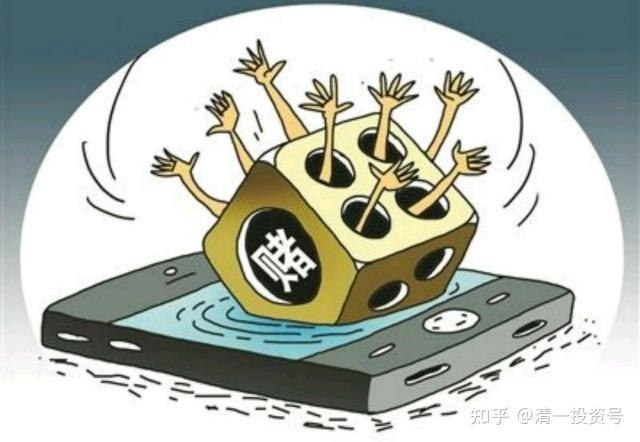

17篇.中国建筑系列之十五：千万不要无原则的在股市中“赌”

清一山长2021年4月29日

**导读：**

1. 是让你做傻猫，不是做傻白甜

2. 与归隐林地谈中国建筑的投资策略

3. 股市投资处处陷阱，入界宜缓、逢危须弃

（说明：此篇与整理文《3篇.入界宜缓，逢危须弃》有较多重复之处，为保留中建系列整理的完整性，所以仍整理于此文中，介意者请自行跳过）

**正文：**

**一、是让你做傻猫不是做傻白甜**

雪莲001回复清一山长:

突然发现从股市新人转型成反面典型。好吧！只要能彰显德者之风，警示他人，我就是那个傻瓜，希望全天下只有我是那个最傻的，大家每个人都顺顺利利的。

清一山长2021-04-29 20:30回复雪莲001:

没见跟我学的人自称傻猫吗？**承认傻，就是变聪明的第一步**。知道自己傻，就不会去买聪明人买的聪明股，就只会傻傻的拿傻子才买的傻子股。就只会拿住价值股不放，算利息够用，就行了。因为知道卖掉不知道买啥好！

傻人，就拿中国建筑。更傻一些，就拿四大行；保证你长期亏不了！

我拿中国建筑，因为我也是傻猫！拿了一直不涨，被人笑话！

雪莲001回复清一山长:

请教四大是建行、兴业、交行、重农商行吗？股市小白实在不知道啊！

清一山长2021-04-29 21:54回复雪莲001：

你真是个傻白甜。都把人傻哭了！一个Sakura人。

算了，教你个傻人的出路：别管四大行了。你就买入中国建筑，然后死死的盯着晕娜，看完他所有的文章，学他的思路。十年后，你就会投资了。

现在，别来到处乱晃，乱学乱问，投资也别学我，我的东西，一般人学不了。特别是你这种樱花人，完全弄不懂我的逻辑的。晕兄实在人，会教你的！

晕娜回复清一山长:

2021年度：中建分红同比增长16～20%，本人认为是靠谱的。是分红，不是业绩增长。

中建股价真的回到了净资产值时，本人肯定离开雪球。说过很多次了。

本人一大把的年龄了，来雪球真的不是混网红的……［俏皮］。

清一山长2021-04-29 22:17回复晕娜：

感谢有您！您对中国建筑的坚守，让我学到了我原来不具备的一些东西。投资体系更完善了。拿现在这么大的仓位来守候中建，是我近30年的投资历史上从来没有过的。虽然暂时还没有赚钱，但另有一番收获。一些无法用金钱来衡量的收获。未来，也许中建会成为我赚钱最多的股票。我认为：**我未来的投资模式，会更多的学习您的这种坚守模式。**现在我的模式，虽然是能赚钱，但有点不够大气。更像是好玩。

**二、与归隐林地谈中国建筑的投资策略**

归隐林地修改于2021-10-01 22:40

我依然在等风来

很久没有在雪球写点什么了，一方面是觉得想说想写的东西都已经说完写完，另一方面也算是找到了新的消磨时间的方向，手里持仓股票的基本面也没有啥特别的变化，关注就相对少了。

有人曾经说，这个世界太大，太忙，如果一个人不管因为什么原因离开，三个月后除家人外还有人想起他，那他算没有白活，如果半年后还有人念叨他，那他就可算比较成功。“归隐林地”作为网上的一个虚拟ID，在雪球已经超过半年没有写一个字了，直到最近，还有朋友挂念我，担心我是不是遇到了什么意外，让我非常感动……

清一山长2021-04-29 22:31评论上贴：

我刚打赏了这篇帖子¥88.00，也推荐给你。

借您本文的吉言：中建的（24个月）目标价是10.35～13.50元，兴业的目标价是38.55～42.8元5。

祝福林地兄借助此两只股票的预期落地，实现投资20年增值200倍的目标（目前您是15年76倍，要实现这个目标很有希望）

大股爱好者2回复清一山长:

请问：中国建筑十大股东中出现的个人投资者是不是山兄？

清一山长2021-04-29 22:35回复大股爱好者2:

不是。您会在燕京2021年的半年报中，看到我进入十大股东（正常情况下）。我没指望进入中建的十大股东。我还猜是不是晕总呢！

归隐林地回复清一山长:

谢谢山长打赏。我的业绩没有那么高啊（那个76倍是假设今年净值能够上涨47%，我的中国梦），现在大概是15年多一点的时间53倍（最近兴业回撤不少），而且也是因为起点刚好是大牛市，去掉2006-2007年的大牛市，比如最近10年，只剩下8倍了。我现在的目标更是低得多，5年1倍（年化15%），10年3倍就满足了。

不管多少倍，只要能够实现在14亿国民中的资产排名略有增长，所谓保值、增值就很满意了。

清一山长2021-04-30 08:54回复归隐林地:

打赏您的帖子，是希望看我帖子的人，去学您和晕娜的方式：**云淡风轻地就把钱赚了。财不入急门！**主要是我得到的粉丝打赏太多了，需要用出去发挥价值。您的投资方式，是值得大家学习和模仿的，希望大家都向您学习这种投资风格。闲适从容。

但**有些人就是喜欢跟着我，看我分析盘面，跟庄，看K线，买进、卖出、做T。其实这是不务正业。**虽然我的确能看懂庄家的心意，也会“与狼共舞”，抢点庄家的饭吃。中国股市玩了三十年的老股民，活下来的老兵，都或多或少会一点。但绝大多数人，是学不会我的。“与狼共舞”的结果，基本上是被狼吃了。但他们学你，是学得会的。我大约与晕娜是同时进入中国建筑的。过去七年，我进出中建大概是五次，最后一次也是5元进入，但6元就跑，居然还成功了。赚到了超额收益。成为我在A股的利润王。看起来比晕娜做得好，其实我内心真正佩服的是晕娜。我是运气好——中建如果不是安邦被抓，不会是现在的价格让我进来的。中建今天，很可能就是建筑行业的招商银行。我就放走了招商银行，一直感到遗憾。原来，我是重仓招商银行的。我内心深深地知道这一点差别。所以，我不会因为做中建的T很成功（五次，都是低点进入，高点退出的）。但我认为晕娜你们这种死死坐电梯的方式，才是正确的投资方式。他笑话我是交易者，不是投资者，其实是对的。交易者，成功一百次，只要失败一次，就把一百次的成功抹去了。2015年，“93老股民”就是这样消失的。长长久久，还是你们的方式更好。中建我马上就快坐了一年的电梯了，越坐，我的股票越多。因为我的其他投机资金，正在慢慢进入中。我正在从交易者的身份，慢慢转变成投资者。

就算您说的，保守一点，您未来10年只有三倍，你就有投资25年150倍的业绩了。不比拿着茅台差。中国建筑的ROE，是可以保障你获得这种结果的。所以基本上是预期的最低结果。这十年，难说会有估值重估的时刻。您就可以“双击”一把。给个10PE给中建，10年就是超过6倍了，你就有300倍收益了。这是一种很稳妥的资产增值方式，也是我大仓中国建筑的原因。（不好意思，目前我也只有30%仓位，不如您的80%多）。如果不涨，我会占比越来越多的。主要是啤酒和低残的港股，拖住我的换股步伐了。

**三、股市投资处处陷阱，入界宜缓、逢危须弃**

速隐刀回复清一山长:

“分析盘面，跟庄，看K线，买进卖出做T”，这些都是你的优势，做的那么成功，赚钱的效率多高啊！多少人想学而不得，真的要放弃？

清一山长2021-04-30 09:36回复速隐刀:

就是因为原来的历史太成功了（我28年是增值了数千倍），所以我怕自己太依赖这种方式。一得意，就钻进别人精心构造的陷阱里面去了。**老是习惯在陷阱旁边抢食吃，难说有一天不会掉进去！**

**人生，能够富裕一次，就已经足够了。**别不知足，还想到处抓钱。要太多，没有意义，我又不给子女留钱的，都要捐给教育基金会的。**我真的不想，再来一次“重新富裕”的努力。**曾经的93老股民，就是我的警告。**看别人生病，**我**要提前吃药！**别到了这一天，回不来了。中国建筑，就是我的人生保险股。就算是别的投资全都赔光了，持有的中国建筑，还可以让我重新翻身做人，再度恢复元气的。所以她是我的第一重仓股。

您说，有这种好处，我难道不应该改邪归正，好好学归隐兄和晕兄吗？

清一山长2021-04-30 10:00

$江苏银行(SH600919)$投机打脸分分钟。看，这就是教训。两边挨耳光。偷鸡不成蚀把米！

还是老实地守着中国建筑好。不惊，也不喜！

归隐林地回复人间五十年:

以我的经验来看，大多数人对股市赚钱方法都是有很大误解的。要么就说技术分析很管用，盘面说明一切；要么就说基本面最了不起，价值投资才是正途。我以前说过一句话，**所谓估值低（价值高）都是走夜路唱歌，自我壮胆**，中国建筑五年来的走势，包括今天在季报超预期依然下跌的走势，可以算是印证了我的话。其实还可以再补充一句，**所谓技术指标走好，更是走夜路唱歌，自我壮胆。坚持技术分析交易到破产的，应该是比比皆是**。

如果做基本面和做技术面都不一定靠谱，大家可能会问，我之前赚了那么多倍，都只是靠运气吗？真的是幸存者偏差吗？实事求是的说，运气是很重要的，比如我有个账户是2006年初开户，长期下来的收益率就很高，而我最早却是从1997年入市的，整体绩效就差很多。但是运气不可能总是站到自己一边，所以**最最重要的还是要有概率思维，做好资金管理，即所谓的风险敞口管理，不要输掉自己输不起的钱，这才是真正的专业化。**市场上讲投资的书，很少讲这方面。真正的保守不是买最低估值的股票，而是在买入任何品种后，不要亏掉太多的钱。“入界宜缓”，“逢危须弃”，这些围棋口诀，在股市中也是一样有用。

我之所以那几年敢在国投电力中投入七成仓位，现在敢在中建上投入八成仓位，是我自己风险评估之后的结果。每个人都有自己输得起的标准，但千万不要无原则的在股市中“赌”。

清一山长晕娜点滴体会，供两位兄批评。

清一山长2021-04-30 15:25回复归隐林地:

林兄这种对股市的理解，是多少股市洗礼换来的。很对。一般人，看不到这种体悟的价值。【**千万不要无原则的在股市中“赌”**。】

是的，买入中建，就是看它的ROE能否保持。根据过去的记录，以及现在的表现，15%是没有问题的。所以，不赌的就是：它跌到一元，我们也能接受。十年后，每股分红都一元了。股价给多少钱？市场先生您看着办，反正市场给一元，我是不卖手上这笔股权的！给个2PB。可以考虑卖一些。这就是不赌！

赌就是：我猜明天一元，现价4元，我就赶快做空。要不我猜明天6元。我赶快买入，做多！

不赌就是：管你是1元，还是6元。我都不卖！不理。假如手上有钱，都可以继续买！

标题为编者所加

参考链接：

[清一投资号：1篇.中建背后的神秘大手](https://zhuanlan.zhihu.com/p/481078141)（整理文）

[清一投资号：3篇.中国建筑系列之一：就算是好股，也别谈恋爱](https://zhuanlan.zhihu.com/p/512602669)（整理文）

[清一投资号：4篇.中国建筑系列之二：大A股的稳定器](https://zhuanlan.zhihu.com/p/519506160)（整理文）

[清一投资号：5篇.中国建筑系列之三：发现投资机会的方法](https://zhuanlan.zhihu.com/p/522851722)（整理文）

[清一投资号：6篇.中国建筑系列之四：只有少数人才知道正确的通道](https://zhuanlan.zhihu.com/p/522882446)（整理文）

[清一投资号：7篇.中国建筑系列之五：投资中建的核心逻辑和理由](https://zhuanlan.zhihu.com/p/528942534)（整理文）

[清一投资号：8篇.中国建筑系列之六：熊市布局，牛市收获](https://zhuanlan.zhihu.com/p/534585889)（整理文）

[清一投资号：9篇.中国建筑系列之七：每个人都应有自己的投资逻辑](https://zhuanlan.zhihu.com/p/538090859)（整理文）

[清一投资号：10篇.中国建筑系列之八：为自己的投资负完全的责任](https://zhuanlan.zhihu.com/p/549316895)（整理文）

[清一投资号：11篇.中国建筑系列之九：如何用融资投资中国建筑？](https://zhuanlan.zhihu.com/p/559571938)（整理文）

[清一投资号：12篇.中国建筑系列之十：综合对比下中建的长远价值](https://zhuanlan.zhihu.com/p/564749726)（整理文）

[清一投资号：13篇.中国建筑系列之十一：多年不涨的中建，值得坚守](https://zhuanlan.zhihu.com/p/566546633)[（整理文）](https://zhuanlan.zhihu.com/p/568853074)

[清一投资号：14篇.中国建筑系列之十二：长持股的价值投机操作及未来畅想](https://zhuanlan.zhihu.com/p/568853074)（整理文）

[清一投资号：15篇.中国建筑系列之十三：从年报的角度再次解读超低估的中建盘面](https://zhuanlan.zhihu.com/p/572007510)（整理文）

[清一投资号：16篇.中国建筑系列之十四：买中国建筑的好处就是可以安心睡觉](https://zhuanlan.zhihu.com/p/574936145)（整理文）

[清一投资号：8篇．建筑的股性正在激活中](https://zhuanlan.zhihu.com/p/476832159)（整理文）

[清一投资号：13篇.中国建筑对话录：不养独子](https://zhuanlan.zhihu.com/p/463971765) （整理文）

[清一投资号：17篇.中建股东数历史新低](https://zhuanlan.zhihu.com/p/505901339)（整理文）

