[原雪球专栏](https://zhuanlan.zhihu.com/p/577583988/edit)[174篇.示范班第二学期&2021届国际今日突破班结业！](http://link.zhihu.com/?target=https%3A//xueqiu.com/9310099567/182699859)

清一山长 2021年6月12日

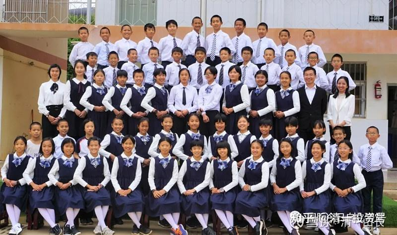

上面的照片，是第二学期的示范班，以及他们的同学，为期一年的2020突破班的全体学生的结业合影，总共两个班。很多朋友已经在B站的示范班直播视频中，见过这批学生了，现在全部亮相给你们看：[哔哩哔哩网页链接](http://link.zhihu.com/?target=https%3A//space.bilibili.com/487498588)：

[https://space.bilibili.com/487498588](http://link.zhihu.com/?target=https%3A//space.bilibili.com/487498588)

[【示范班第二学期】结业视频——致2021的你](http://link.zhihu.com/?target=https%3A//www.bilibili.com/video/BV1Eq4y1s76z/)

[https://www.bilibili.com/video/BV1Eq4y1s76z/](http://link.zhihu.com/?target=https%3A//www.bilibili.com/video/BV1Eq4y1s76z/)

中国人喜欢白胖美，我们的学生黑瘦小。审美观不同，您看这些学生还顺眼吗？也许觉得像非洲难民？跟中国体制学生的样子相比怎么样？这就是两种教育系统的不同。喜欢啥，就学啥，我们不在意您的选择。您更喜欢下面照片中的人吗？

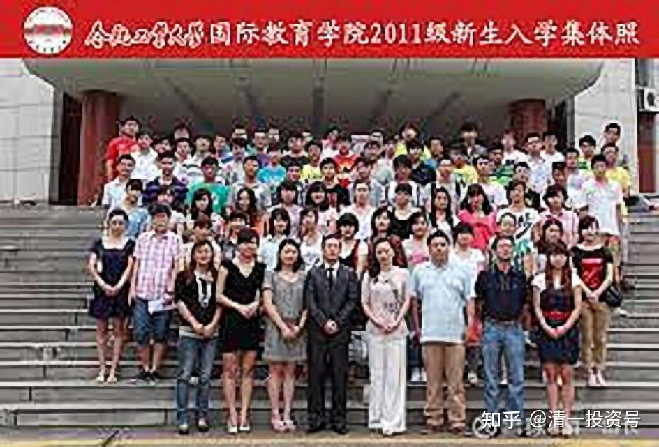

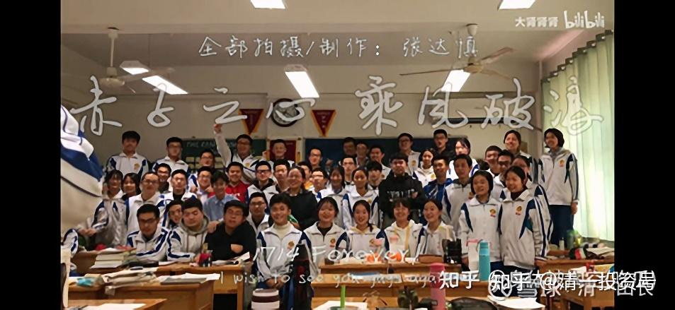

这张是清晰版的。别只看黑白，看学生的精气神吧！

由于我们的校舍和师资均不够满足不断增长的需要（还没有正式的毕业生），今年要腾出新的学位来，迎接新一届的学生入学，所以上述的全部学生，只有一半人能够留下来继续做今年9月份开播的第三学期示范班学习示范项目。其他的学生，结业后都要回家去，在家长的带领下，跟随网络直播班学习。将来15岁再来考今日高中。所以，他们的学习条件，其实跟你们是一样的。别以为我们啥好东西都藏起来，并不是你们想象的这样。外围很多人，都在用示范班的方式跟随学习，不花钱就能上今日。

经过9个月的学习后，第二学期的示范班结业了。其中的快班（示范班）的学习水平，目前已经达到了超速程度：15天就可以学完一部完整的电影，把台词全部背诵熟练并表演出来。要去跟他们拼语言学习能力，中国的其他学校，知名外国语大学，也没这实力的。这就是授之以渔。

**最牛的学校，不是让孩子离不开老师，而是让学生不需要老师，可以自主学习。**今日学堂，可能只需要用一年时间，就可以在家长的支持和配合下，实现这个任务。本届示范班的学生，在结业离校之后，未来的三个月内，并不是暑假回家后就去吃喝玩乐，而是回家去自主学习。我们要测试他们未来三个月，是否已经完全掌握了一门新语言的自我学习方式，本学期教学的方法和理念，是否已经进入到了日常的习惯？所以，这些学生将在假期内，自己在家完成两至三部新电影的学习，以及学习完新概念第二册的课程，还要自己复习完七部电影的学习。这期间，今日的教师团队，不需参与学生学习的辅导，甚至连指导都不给。三个月之后，今年9月份，他们将回校，进行一项自学效果的测试和学习比赛，凡是假期保持了良好学习习惯的学生，表现优秀者，就将获得成为第三学期示范班学生的机会。

下学期，我们将开启第三学期的示范学习内容——**学术英语的学习---用演讲与辩论**的方式学习。很多内容，将是美国大学毕业演讲以及美国总统演讲的内容。其他没有考上示范班的学生，也将在家同步跟随示范班的网络课程学习。他们正常情况下，将在15岁考今日高中，重新回来，参与高中阶段的学习。

国际今日的家长们，为了磨练学生的意志力，将**在假期让学生徒步一千多公里**，训练出强悍的未来一代。在中国很多学校，连跑1000米都有很多学生猝死的情况下，我们的学生击败这种对手，简直就不需要努力。3700万中国大学生，不敢出来面对我们的学生，有一千万元都不敢来拿，关键就是被运动和跨界卡住了。因为一群书呆子，怎么敢面对运动达人？随大流的中国学生，就只有随大流的本事了，自己去红海中沉浮吧！

也就是说：今日学堂的学生，只需经过一年12个月的学习，就完全掌握了一门外语能力。不仅仅掌握了这门语言的使用能力，他们还同时学会了用这种方法，去学习世界上任何一门语言的能力。不再需要今日学堂教师的帮助。成为中国和世界上都很少有的三语生，对他们来说，也只需要再学一年就完成了任务。如果示范班的第四年，他们要对外公开示范今日学堂学习第三语言的任务，但其实到那个时候，学语言就不再需要老师来帮忙，而是学生们自主学习。我们作为**学校，提供的只是一个环境和学习的平台。带班教师更主要的任务，是做学生们的青春期问题梳理和调整**，老师不会花太大力气来讲第三语言学习的。其实，如果各位留心本届示范班的课程内容，老师讲英语的知识和内容很少。最近老师出来公开示范新概念的课程，是因为我们学堂有国外最牛外语大学毕业的教师，发现国内的新概念教学讲解太烂了，有很多错误，所以才讲一讲。其实学语言，也不需要这么准确地掌握的，差不多就行了，其他的慢慢学（这是我的观点）。未来的示范班，将示范学习今日学堂目前还没有学过的一门新的外语。不是泰语，不是西语，可能是法语、德语或者日语。到时候将根据学生和家长的要求来决定。这时候，我们的老师完全不懂这门新语言就靠学生用现在学英语的方法来学习了。**今日示范班，未来将成为“联合国班”**，每一届都要学一门新语言，将来学生们都具有不同国家的语言能力，活跃在不同的国家、地区，为中国和世界服务。成为[中国教育](http://link.zhihu.com/?target=https%3A//xueqiu.com/S/CSI931456%3Ffrom%3Dstatus_stock_match)的一面新榜样，展示中国学生的新面貌。起码不再是东亚病夫。

以下是在本届突破班结业后，未来将在网络上跟随示范班一起学习的家长，自己组建的今日自立学堂的记录和发文。[微信网页链接](http://link.zhihu.com/?target=https%3A//mp.weixin.qq.com/s%3F__biz%3DMzIzODM1MjU0Ng%3D%3D%26mid%3D2247483930%26idx%3D1%26sn%3Daa217a7fef3160df72b132e6c64ad733%26chksm%3De93be3d7de4c6ac10eb66606410d5a763599f90c4dfd32abf1709c8e0ff9d2bb69275c31f61c%26mpshare%3D1%26scene%3D23%26srcid%3D0611hmUJYIh7dbt75gCSYUFg%26sharer_sharetime%3D1623407932738%26sharer_shareid%3D0ce6071d8e2ee570c72476083c3d9fd3%2523rd)：

[https://mp.weixin.qq.com/s/s3giXxM91wlpQKko1K7e7g](http://link.zhihu.com/?target=https%3A//mp.weixin.qq.com/s/s3giXxM91wlpQKko1K7e7g)

（以下内容为编者收录）

**评论回复：**

**[清一山长](http://link.zhihu.com/?target=https%3A//xueqiu.com/9310099567)**[2021-06-12 15:13](http://link.zhihu.com/?target=https%3A//xueqiu.com/9310099567/182720526)：

帖子中这张照片是师生的集体照：您能找到国际今日的校长在何处吗？班主任、助教们都站在哪儿？

各位的习惯，都是往中间找，往第一排找。其实，这些都是学生。只有仔细观察的人，才会发现：着装与学生有明显差别，衣着不同的四个教师，都站在第三派两边最不起眼的地方。照片中，三排右边的是钱校长和赵刚老师，左边边上的两个，是2.0小助教。

这种集体照，体制学校是见不到的。其实也不是刻意安排的。但充分说明了新教育与体制教育的核心差别：**校长和教师，是服务于学生的。**所以，**学生永远是我们的中心。**只要把这种差别落实到细微之处，才会有这种不经意的照片。不是摆拍的亲民照，而是自然地体现了教师的心态。

Mlee0f9回复清一山长：

孩子15岁，想上今日国际。怎样了解更详细或联系？谢谢！

清一山长2021-06-12 15:27 回复Mlee0f9：

国际今日，入学招生考试的年龄是11岁。超过了这个年龄，也不是不让进，您能拼过我们的学生就行了。只是，你们外围跟学的人，要想在外面超过我们自己的本部学生，难度恐怕真比考清华、北大还难。你们喜欢新教育，就网上跟学吧！别指望花钱就能送进来。15岁也可跟随11岁的学，别要啥脸面，您未必能轻松跟上。就算您孩子18岁才学到我们15岁孩子的水平，也足够考上美国前50名的顶尖大学了。

**生为高山，不为草芥——国际今日2020级突破班结业典礼纪实**

原创 今日2020级突破班 国际今日自立学堂 2021-06-11 12:45

光阴荏苒，春华秋实。转眼间，国际今日2020级英语突破班一学年的学习即将结束。6月5日早上9点半，突破班结业典礼在学校正式开始。

**开幕**

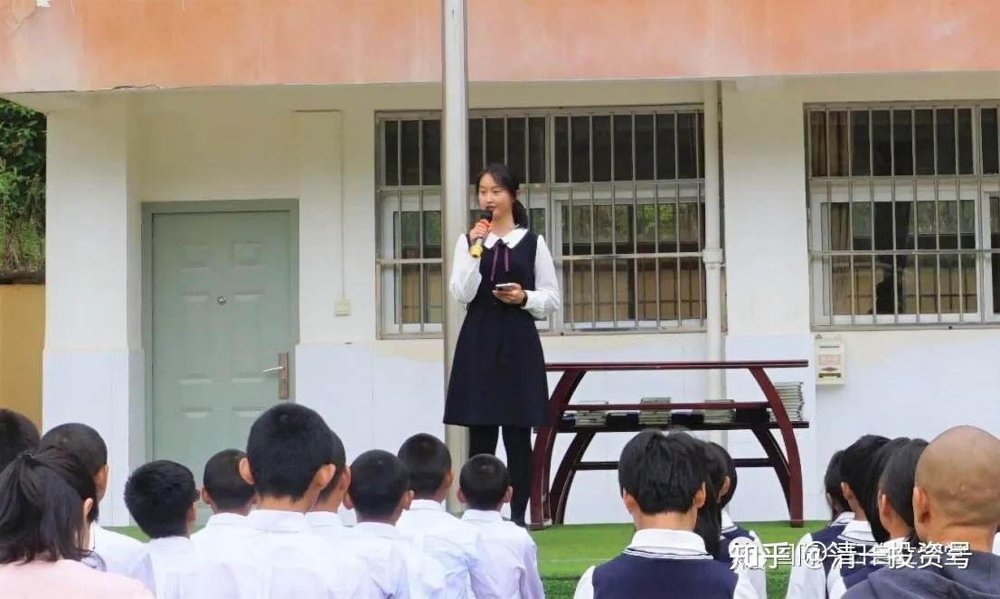

秦玉尧老师担任此次结业典礼的主持人。记得有孩子这么评价秦老师，说她脸上总是带着笑容，像一个知心的大姐姐，让人感到亲切倍至。在简短的开幕词中，秦老师感谢在这一年里，相聚在此的所有今日人，大家为了同一个目标而奋斗，共同捍卫今日荣誉。同时提到在期末的评测中，不管同学们取得什么样的成绩，都是大家过去一年的努力和成长的见证，也不必骄傲和遗憾。因为这只是暂时的成绩，在未来的三个月，我们还可以去创造全新的结果。在未来的赛场上，**只有最自律、自觉，能够持续努力的人才是最终的赢家。**

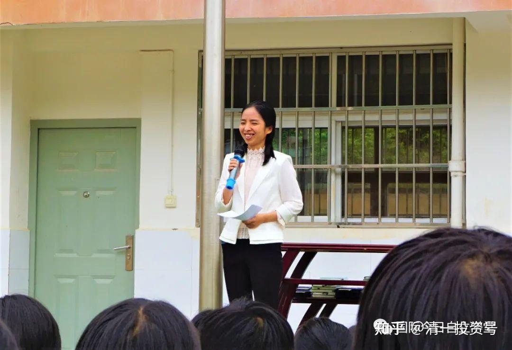

明莉校长总结

接下来，明莉校长做总结致辞，为我们概括了这一学年的五大关键词：

第一个关键词：**PK**。

古人云：**“天行健，君子以自强不息。”**PK是我们这一年的主旋律。在这种PK模式下，大家一起经历了备赛时的焦虑，上场时的紧张，胜利后的兴奋，失败时的沮丧。

但PK给我们带来最宝贵的财富是：**通过PK，让我们不断地认清自己的优势与劣势，从竞争对手身上取长补短，我们的心态变得越来越稳定与宁静、开放与进取，实现了整个团队的高效学习与成长进步！**希望大家未来不管在哪里，都能够保持这种敢于PK，勇于亮剑的强者风范！

第二个关键词：**目标管理。**

**有了愿望，目标不会自动实现，行动才是硬道理。**而目标管理能帮助我们一直走在实现目标与理想的道路上，不至于走弯路、走错路，不会被各种各样的感觉所迷惑，不去满足吃喝玩乐的想法。

**每一天，每一小时都要用目标来锁定，并定位自己该做什么，能做什么。**具体的方法，就是通过填写每天的目标锁定表与积分表，让自己可以通过直观的表格数据与图形就能够看到自己的学习进退情况。刚开始大家可能有点不适应，但慢慢地，大家就会越来越发现，自己正在走上不断进步的快车道。

第三个关键词：**团队。**

在做集体扛木头的项目时，相信大家都深刻地体会到了团队的价值。如果要去承担一个很有挑战性的任务，一个人的力量是有限的，一个人的肩膀也扛不起所有。因此，我们必须依靠团队，集合团队伙伴的力量。那么，谁才是你的团队伙伴？**和你拥有共同目标的，就是我们一起前行的伙伴。**

如何才能调动团队伙伴的力量，让1+1大于2，而不是小于2，甚至小于1呢？关键就是：我们**每个团队成员都要能承担起自己的责任，这样每个人都可以轻松前行。**

但如果有人放弃自己的责任，企图把自己的这一份责任推卸给别人去承担，那么，其实你会更艰难，并且每个人都很难坚持下来，导致团队目标的失败。就像本学期在与清一塾的五天PK中，正是因为每个同学都在自己水平上，尽力地想要多学一点，所以，才有了我们整体的胜利。

第四个关键词：**自我管理。**

俗话说，“授人以鱼不如授人以渔。”也就是说，你想有鱼吃，我直接把鱼送给你，还不如教你自己如何捕鱼。原来，好比是老师做饭，再给你们送饭吃。接下来，你们要学会自己做饭、吃饭。这代表的是你们全新的成长。

经过这一年的英文学习积累，信念系统的更新，我相信你们已经完全具备了自我成长的能力。接下来的三个月时间，就看你们的践行了！

第五个关键词：**感恩。**

我们要感恩每天指导自己，陪伴自己成长的老师，要感恩同甘共苦的伙伴，要感恩迫使我们全力以赴的竞争对手，也要感恩为我们提供各种后勤服务的学堂全体教职工。最后，我们还要重点感恩自己的父母。

我们这一届的家长，是今日有史以来最凝聚、最团结的一届，而且是最拼搏的一届。为了助力你们的成长，经常身体力行，以身作则，动不动就跑个几千公里，示范不断突破自我的精神。你们猜猜你们的家长团队集合起来，现在跑了多少公里了？据我得到的数据是：大干100天，累计两万六千公里，相当于跑了大半个地球！所以，请大家在心中向你的父母鞠躬致谢，表达对他们的感恩和敬意。在接下来三个月时间里，不论你的目标是什么，是去暑期学习点立刻投入来备战九月份的大PK，还是用长征徒步来重新整合自己的信念，都祝福你们收获满满。

在总结致词最后，明莉校长阐述了今日精神：什么是今日？什么才是今日人的精神？所谓今日，就是活在当下。也就是：**永远把当下的事情做好，用行动增强我们的积累和高度。与时俱进，把握今天的时代给予我们的机会，在中国历史上写下光辉的记录。永远对未来怀有愿景，而不是活在对未知的恐惧和逃避当中。**因为，每一天我们都能创造更好的自己，并向着心中的目标进发。永远对过去充满感恩，而不是活在对往事的留恋或失意当中。因为，不论是怎样的经历，它都成就了今天的你，都可以转换成滋养你成长的养分。大家在今日的时间已经过去九个多月了，成绩都属于过去，失败也属于过去。只有今日，只有当下才属于我们，才能呈现我们最鲜活的生命。正是因为有这种今日的精神，我们才有资格发出今日的荣誉宣言：我是今日人，我深感荣耀！我是今日人，我注定不凡！我是今日人，我生来就应为高山，不该为草芥！

在众多孩子心目中，以明莉校长为首的教师团队是恩师，也是明师，他们总能看到孩子们身上的问题以及问题背后的心理原因，帮助孩子们找到症结，从阴影、不良情绪、困境、烦恼之中走出来。他们总是点燃孩子们心中的梦想，引导孩子们迈上一个个更高的台阶。

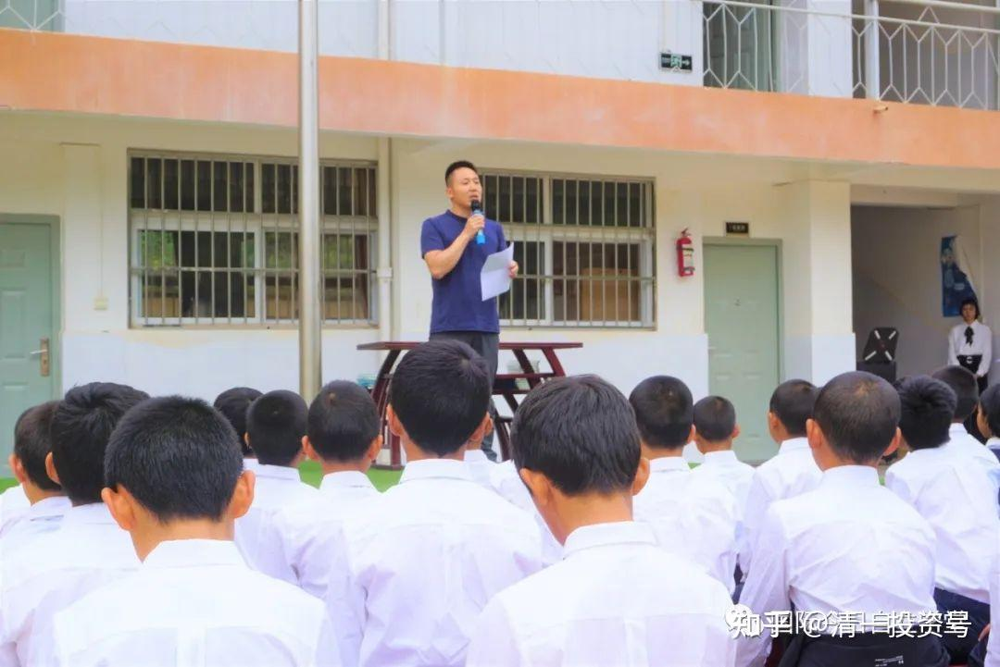

家长代表致词

在家长代表发言环节，董子萱爸爸作为2020级突破班家委代表，对老师们一学年里夜以继日的付出和引领、不辞辛劳的谆谆教导、帮助孩子们不断突破和成长、逐渐具备卓越人生信念，表达了深深的感恩。同时也感恩各位2020级突破班的家长，以身示范，不断突破自己，给孩子们树立很好的示范榜样！董子萱爸爸在致辞中用乔布斯作为榜样来鼓励孩子们，不同的孩子都能从乔布斯的经历和收获中得到启发，从而找到完善自己的契机：

1、如果你们有幸已经进入了挑战班预选30名单，请你们像乔布斯永远改进自己的产品一样，不断树立新的目标，做出更大、更高的示范和引领。同时也要提醒自己，哪怕卓越如乔布斯，也有可能被驱逐出苹果公司。因此你们这个暑假也要继续努力，保证3个月后还能成功考上挑战班。

2、如果你们还暂时没能进入预选30名单，请你们像乔布斯重新杀回苹果公司一样，补强短板，3个月后成功入选挑战班。

3、如果你们选择了徒步，请你们像乔布斯去印度禅修一样，在徒步中思考自己这一年经历中的经验与不足、思考眼下徒步对你们的意义，思考自己要承担哪些责任、在徒步中多做事，多为团队付出，用自己的实际行动来完善自己，调整自己的信念，为将来达成自己的目标积蓄力量。

**人生的每一次经历，都是一笔财富。关键是用什么样的心态来面对，用什么样的角度来解读。**比如，对于挫折，一方面它会让我们难过，另一方面它会让我们看到自己存在的不足，只要我们改进不足，就可以把挫折转变为更大的成长。只要我们积极主动，理性思考，坚持不懈的努力，成功一定属于我们！

最后，董子萱爸爸勉励孩子们，无论我们人在哪里，只要我们时刻不忘自己是国际今日人的身份，时刻践行“智信仁勇严”和“团队第一，坚韧卓越”的精神并以此展示自己的身份，我们将无时无刻与国际今日同在！

**学生代表发言**

这一届国际今日突破班学生，不仅圆满完成了本学年教学示范目标，也赢得了与清一塾赛前PK的胜利。他们中的四名男女生代表，在此次结业典礼上做了分享。

**示范班女生代表：田青宸**

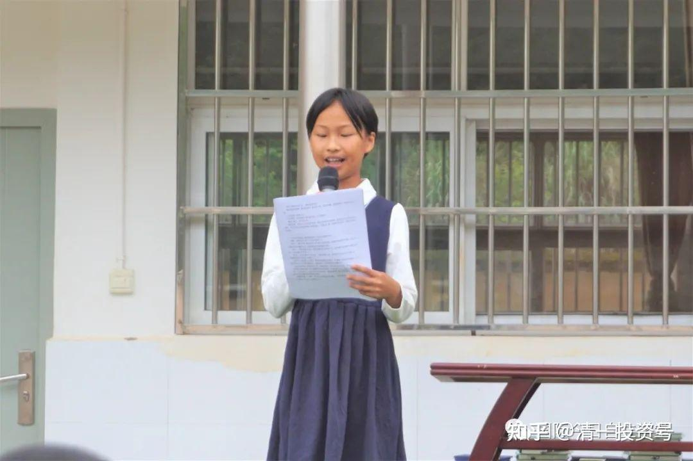

很荣幸能来到讲台上，给大家分享我这一年的成长和收获。一年下来，我在这里有了很多的成长，其中令我印象最深刻的一点是：怎样在运动中提升宁静之心？我先用一个我自己的案例来解释一下。之前在做涅槃训练时我会想“好累啊！什么时候才能结束？”，当我这么想的时候，我就真的很累。但是，我发现其实不管再怎么有情绪，也不可能把涅槃的时间跳过去，一样要练，还会更累。于是我就不想有情绪，情绪来的时候，我就想“我不能有情绪，为什么我还有情绪？”，可当我这么想的时候，我是在和我的情绪对抗，所以我的情绪更重了。后来，我试着换了种方式来处理，情绪来的时候我就看着它走开，像看书一样，于是我就转变了心态。开始投入其中、以平静的状态去做。结果，神奇的是，我发现不太累了。从中我领悟到：其实累只是心理原因，用一个宁静的心去对待，就根本没有想象中的那么累。而且我越去抵抗它，它就会过来，但我用平静的心去面对它，看着它的时候，它就会走开。对于大家都是一样的，**如果你用一个宁静的心去对待，你就会发现困难和失败都是来帮助你的**。所以希望大家也能学会用一个宁静的心去对待一切，你就会获得很大的成长。我在这里成长了很多，也离不开老师和同学的支持和帮助。在这里我想要对所有的老师、同学们说一声：谢谢你们！

**示范班男生代表：吴宇轩**

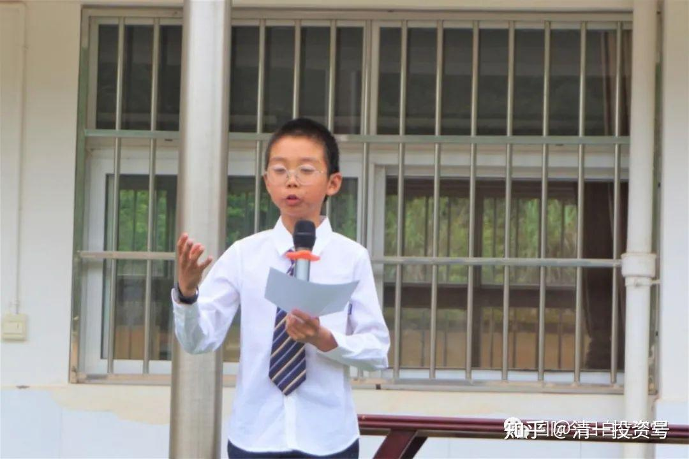

这一年的学习中，我发生了很多的改变。而今天和大家分享的，是《王子经》第六条：担当。这条是我之前做得很不好的地方，因为我很爱哭，为什么这么说呢？我刚来今日时，特别喜欢用哭来逃避责任，一件同样的事情可以哭上四五次，被班里的同学选为“哭王”。当时想到“哭王”这事，就又会开始哭。后来，通过课程和老师的指导，我发现哭其实是我用来逃避责任和现实的手段。我哭其实是想表达：“我都哭了，你们快来关心我一下；我都哭了，你们应该觉得这不是我的责任。”但实际上每件事情的发生都有我的责任，我要100%承担自己的责任。如果你没有担当，就是无法进步的。于是，我决定改掉这个习惯，每当自己受到挫折时，我会开始试着去面对这件事情，而不是以哭来逃避。刚开始其实很难，我改了至少一个学期，我才变得正常了好多。但当我改掉哭的习惯后，我和伙伴的关系也变好了很多。我也发现，自己更有力量能面对挫折和打击了，所以，我获得了很大的成长。这一年的学习中，我发生了很多像这样的改变，这离不开老师的教导和同学的支持，我在这里跟大家说声：谢谢你们！

**突破班男生代表：陈翰仪**

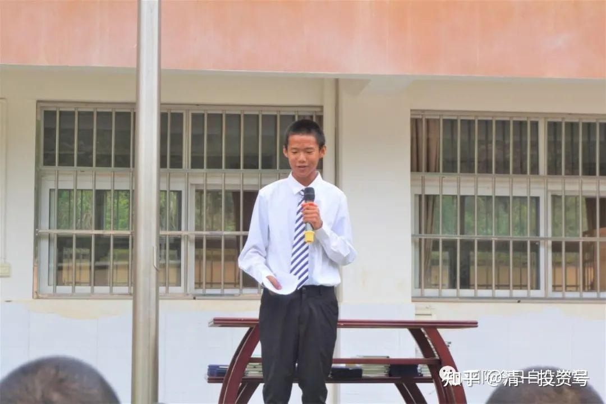

我这一年无论是在学习和运动上都取得很大进步，由学期开始的班级倒数，在7个月的学习成长后，成功考入预录取前20名。我是如何取得如此大的进步呢？我觉得主要原因是通过不断学习、pk、一次次失败、老师指导、反思、从失败中找原因并改进问题（弱点）、不断努力，我意识到：如果我没有别人学习质量好，无法赢得PK，是因为自己不够努力！于是我调整自己的学习方法并提前进入复习，平时除了学习之外，什么事都尽量少干，不做与目标无关的事情，踏踏实实，持续努力，最终公布成绩后，我惊奇的发现我的学习分竟然比大部分人高。总之，如果你想成功一次，需要同时做到以下几点：1、如果你的基础不好，那你就需要付出比别人更多的努力来学习。2、如果在学习中遇到挫折，在PK中失败，不要陷入负面情绪中，不要被失败所打倒，而要从失败中总结经验，找到失败的原因，找出正确的方法去努力，避免瞎努力，最后啥结果都没得到，竹篮打水一场空。3、我的亲身体验：当你全身心做一件事时，就算暂时没有赢过别人，只要持续努力，最终的结果一定出乎意料。祝福所有想要逆袭的人，都能够持续不断的努力，获得成功！

**突破班男生代表：张博川**

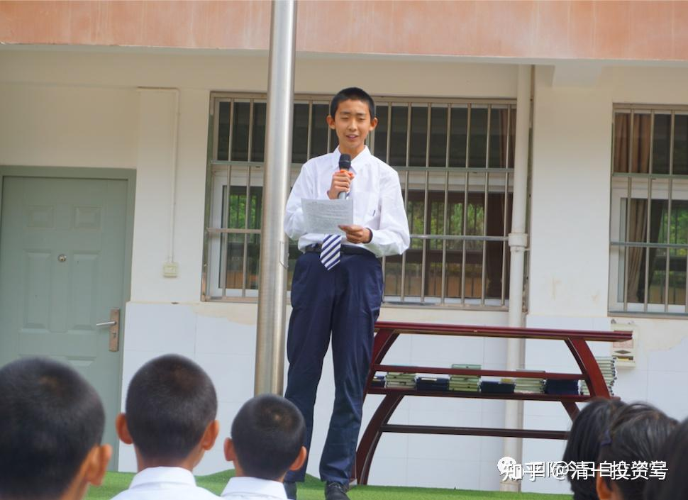

我在学期末测评中排名第44名。我的分享分为两部分，首先是一年来的收获和成长。其次是假期如何行动。我一年来收获最大的是，改善了我的情绪。原来的我像一座军火库，一个小火星就能引起大的爆炸，现在像一枚哑弹，威力明显小了很多。我准备在暑期将自己变成一片海洋，无论什么事情掉里面都不会爆炸，甚至还可以帮助别人改善情绪。另外，是我的学习，我的英语从0基础开始，到现在可以学完3部半电影和将近20课的新概念二学习，电影表演从原来的勉强入门级到现在部分达成精锐级，是一个非常大的突破和进步。我的运动从原来跑1公里11分钟的配速的班级倒数十名左右，到期末测评中拿到2020级突破班综合前15名的成绩，对我来说是一个非常大的进步。我的进步和收获让我明白：“世上无难事，只怕有心人，久有凌云志，重上井冈山”，无论你的基础如何，能力如何，只要你设定一个目标后拼尽全力的去完成，那么你就可以达成。我假期的行动：假期目标是要完成新概念二的学习和剩下3部半电影学习。那么，我就需要向陈翰仪对标，学习他的认真踏实的态度以及持续不断的努力，让自己的学习有较大的进步。另外，用更多的时间来学习，把进度赶上去。同时，运动保持积极进取的状态，不下滑，并通过每日诵读王子经来改正自己的信念。最后比别人更加玩命的学习，提升，才有机会进入前30名。总之，无论是学习、运动、伙评还是考上挑战班都不是一座难以攀登的巨峰，如果我们有攀爬顶峰的目标，每天付出行动去努力，就算在中途出了些小差错和团队分开或者换一条路走，那么我们还是有机会站在顶峰。如果我们自我放弃，走到一半累了不走，坐在原地等死或掉头下山，我们每个人都有机会，就看我们接下来3个月谁更努力，谁爬的更快，我相信我一定可以比原来爬的快！祝福大家也同样如此！从孩子们的言语间，不仅透露着对学校、老师、父母的感恩，更有平和的心态、信念上的进步和对未来满满的信心。

**颁发结业证书**

**

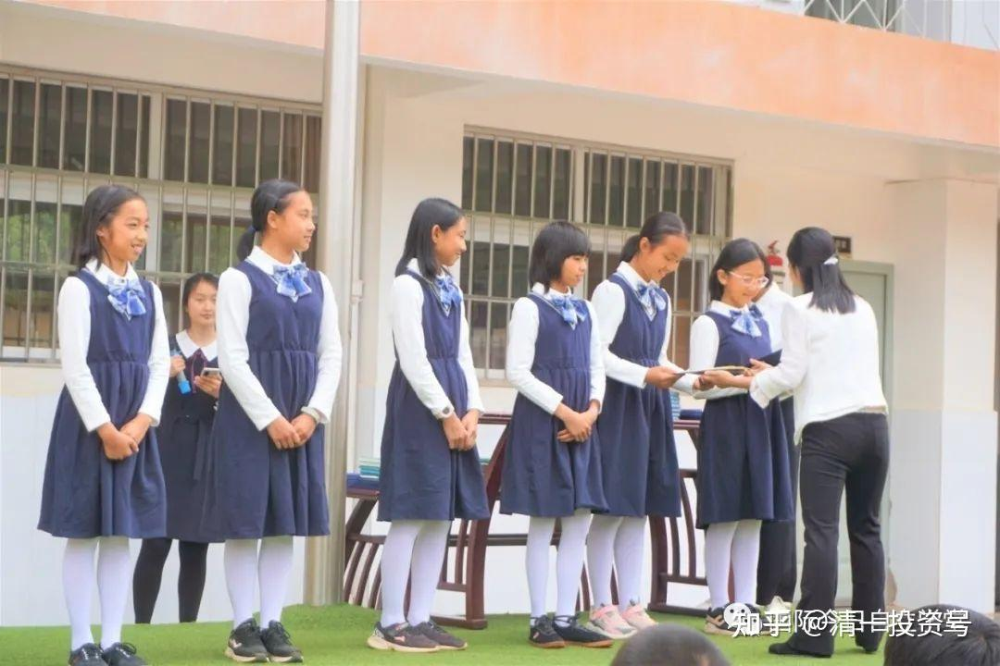

**

随后，也是孩子们最激动的时刻--明莉校长和各位老师为他们颁发突破班结业证书。孩子们在国际今日都度过了不平凡的一年，每个人都收获了属于自己的成长和突破，这些都是孩子们用汗水和泪水浇灌出来的。祝福孩子们未来越来越好！

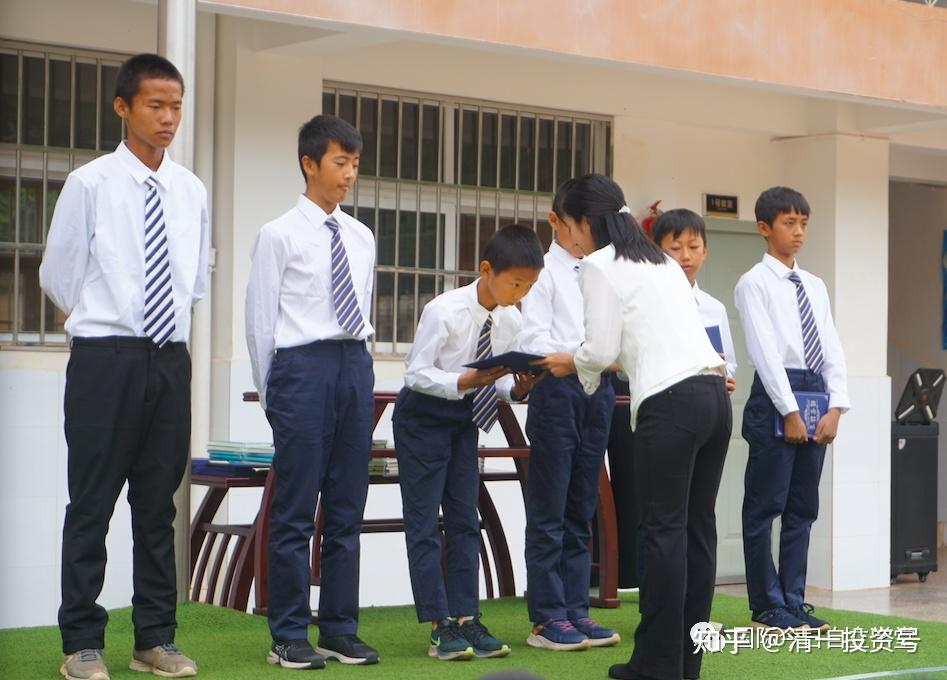

**今日荣誉宣言与假期目标宣读**

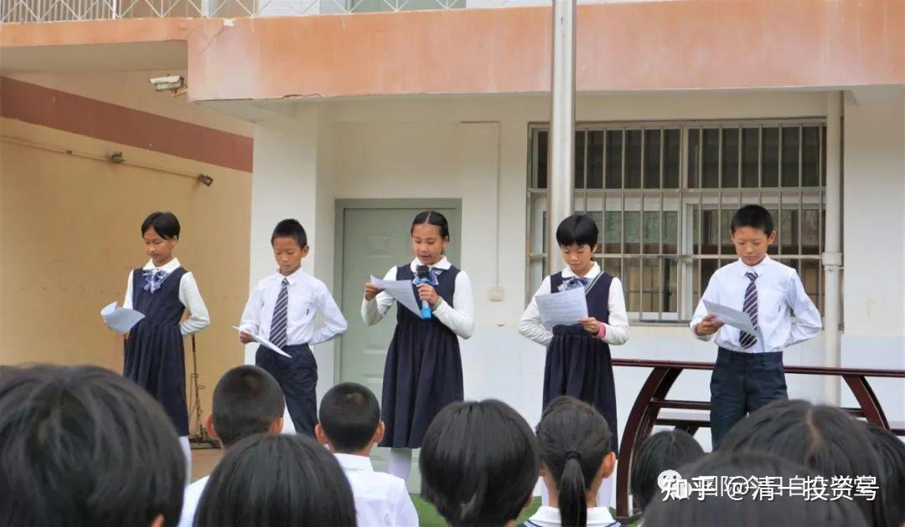

结业并非意味着学习的结束，只是意味着下一个阶段的开始。面对未来暑期的三个月，孩子们首先用宣读假期版今日示范班荣誉宣言来表达自己的身份和态度：“……我可以实现任何目标，只要我愿意去做！因为我就是智慧，我就是诚信，我就是仁爱，我就是勇毅，我就是威严，我就是自强不息！今日是谁？谁是今日？今日是你！今日是我！我们是今日，今日是我们！智信仁勇严，将气在心间！我在这里，我是今日示范班的学生，我是全中国学生的榜样！我承担今日示范班学生的责任，捍卫今日示范班的荣誉。击败美国人，战胜清一塾，做最好的中国人，就是对我最大的奖赏！荣誉要靠具体的目标和行动来捍卫。”

随后暑期学习点的各个学生小组在老师、同学、家长代表的见证下，上台宣读了自己的假期目标。

这将是一个新的征程、新的示范。突破班的孩子们将在接下来的三个月里，在没有学校老师的情况下，依靠团队和自律，完成既定的学习、运动、做事、信念提升等目标，迎接9月初与清一塾的大PK。无论在哪里，他们都决心生为高山，不为草芥！

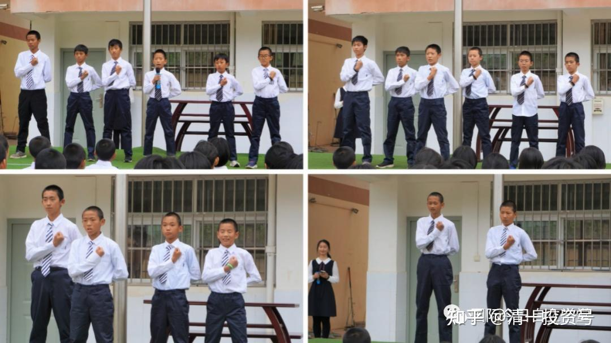

荣誉要靠具体的目标和行动来捍卫。随后暑期学习点的各个学生小组在老师、同学、家长代表的见证下，上台宣读了自己的假期目标。

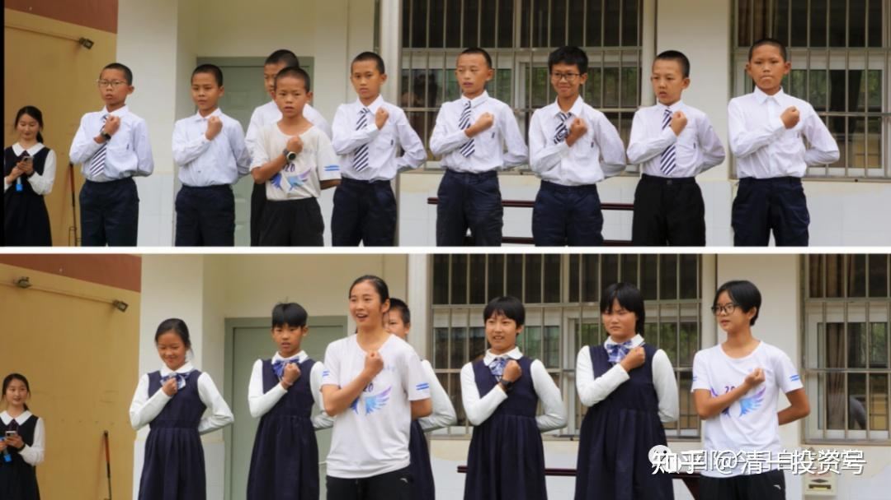

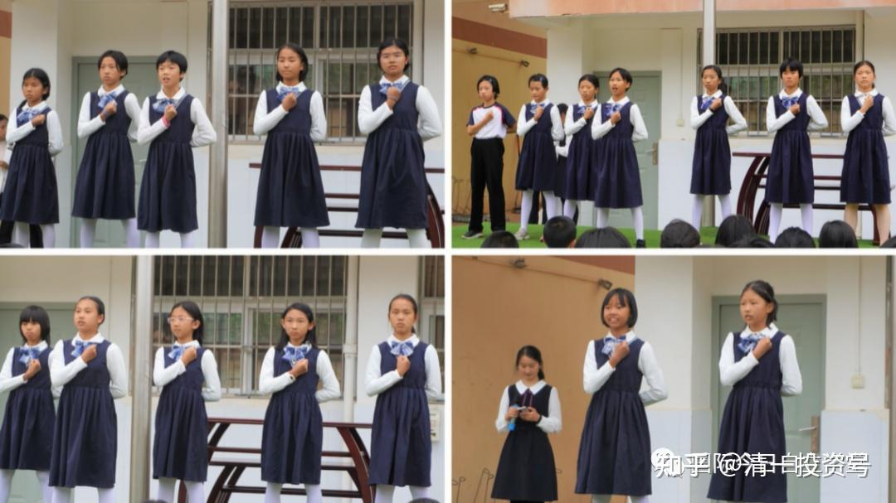

**全校师生合影留念**

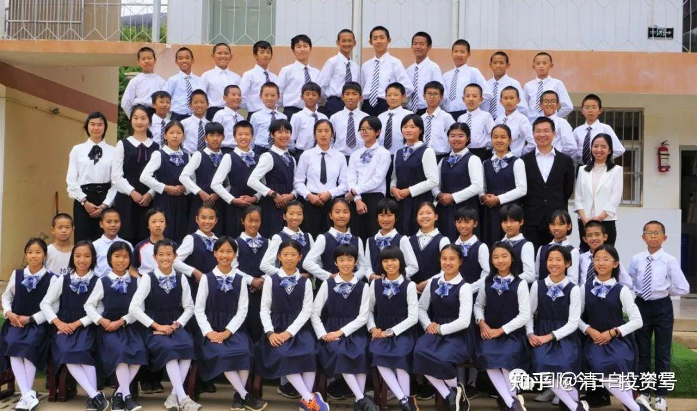

最后，突破班全体师生一起合影留念，留下这难忘的时刻。感恩缘分让我们走到一起！感恩这一年共同学习、成长的美好时光！感恩山长创办新教育！感恩明莉校长和老师们的辛勤教导！感恩同学间的关心帮助！感恩家长们的鼎力支持！愿更多家庭和孩子能进入新教育，受惠于新教育！

文章已于2021-06-11修改

参考链接：

[46篇.新教育送给中国人的礼物——中国公主](https://zhuanlan.zhihu.com/p/553173076)

[56篇.创造历史的清一大学：首届学生集体合影](https://zhuanlan.zhihu.com/p/551968023)

[58篇.明天,清一大学将演出莎士比亚戏剧,迎接新年！](https://zhuanlan.zhihu.com/p/551974574)

[64篇.世界的新未来大学，是怎样的存在？](https://zhuanlan.zhihu.com/p/559554811)

[【清一大学少年班】走进我们的日常生活](http://link.zhihu.com/?target=https%3A//www.bilibili.com/video/BV1Fi4y1F7uK/)

[敬请查阅：比欧三语首届毕业生成绩单](http://link.zhihu.com/?target=https%3A//mp.weixin.qq.com/s/RoyjFZVfB4ybK6NL2-PYjQ)

[这就是今日学堂](http://link.zhihu.com/?target=https%3A//space.bilibili.com/487498588/channel/series)

[2012年今日学堂](http://link.zhihu.com/?target=https%3A//www.bilibili.com/video/BV193411178W)