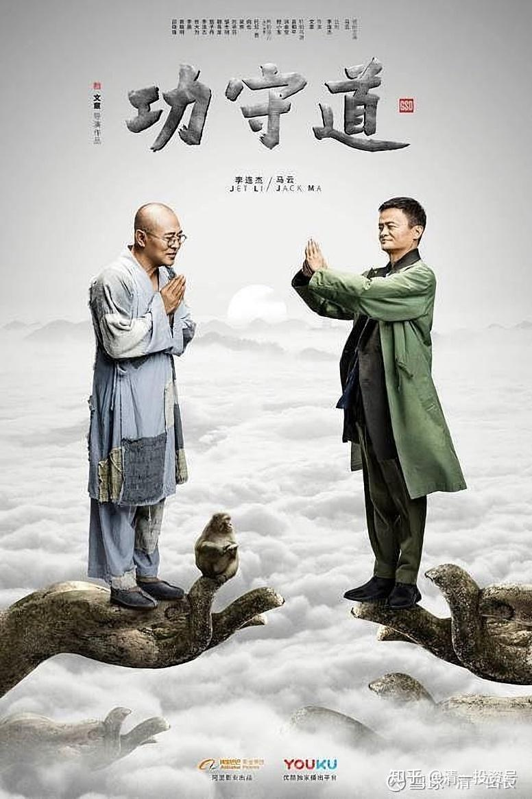

**原雪球专栏**[176篇.李连杰：“中国武术培养出来的只是一代保安。”](http://link.zhihu.com/?target=https%3A//xueqiu.com/9310099567/182930578)

[清一山长](http://link.zhihu.com/?target=https%3A//xueqiu.com/9310099567/column)2021年6月14日

[太极格斗：小女生如何对战身高、体重、力量均大于自己的男生](https://www.zhihu.com/zvideo/1387855776208203776)

[网页链接](https://www.zhihu.com/zvideo/1387855776208203776)：

[https://www.zhihu.com/zvideo/1387855776208203776](https://www.zhihu.com/zvideo/1387855776208203776)

《少林寺》对李连杰的成名来说，是一次非常成功的影片。但是，《少林寺》电影所传递的底层价值观，是很糟糕的破坏性的社会文化。《少林寺》的电影，带动起来的中国武术热，数百万年轻人，因为《少林寺》电影，而开启学武之路，除了养活一堆投机的江湖卖艺的武师之外，最终却成为误国误民的精神毒品，也严重败坏了中华武术的荣誉。由于影片传递的是底层意识，下层阶级的文化，所以导致大批学武之人练武之后，没有啥真正的出路。只能去当保安，以及继续当新一代的江湖骗子。最终结果，就是现在的传武界，没几个真有文化品质的人。江湖气十足，匪气重，梁山文化盛行。实在是中国武术的不幸。

日本的武道传承良好，就因为他们的武士道文化，并不是底层意识，天生具有一定的“贵族性”。所以，现在日本的中级干部提升，一定是要有武道馆的训练和段位证书的。这种文化，培养了亚洲的强大国民和竞争力。

各位想要知道《少林寺》的价值观档次级别如何？去比一比日本拍的另一部影片《黑带》就够了，这才是真正的武道精神。两者还真不是一个级别的。但后者，根本就没几个人看，所谓的曲高和寡。中国人恐怕就只能得到《少林寺》这样的作品吧？

李连杰中年以后，觉得自己拍《少林寺》罪过太大，颇有懊悔之意。甚至想要彻底地退出武术界，退出社交界。一位佛家大师点拨他：他的影响力很大，固然做错了，会影响社会风气变坏，但他也可以利用自己的影响力去做好事。他已经没有了经济的压力，可以不被动去拍自己不想拍的，不符合自己价值观的打打杀杀的电影，而可以选择做一些自己喜欢的、有价值的事情，拍一些自己认为有价值的电影。他后来开始做基金会，弘扬善的文化。武术上，也拍了《霍元甲》这样的电影，传递了类似于《黑带》的传武价值观——武，不是用来炫耀的、不是用来欺负人的。武术，是用来保护自己所爱的事，所爱的人的。

李连杰的心中，一直还是有“传武梦”的，一直想实现让中华武术提升档次的愿望。古代的军事体育，成为了现代奥运会的运动项目。他很想让中国的军事结晶——传统武术，也有机会走上奥运舞台，成为一个世界级别的文化赛事，让传武也有种子留下来，成为一种文化的代表。这种心愿，促使他和中国最有钱的人之一——马云一拍即合。当传武遇到了资本，会带来什么样的结果？

“功守道”：其实是李连杰想要借助资本的力量，弘扬传统武术的一次积极的尝试。上面这张宣传画，两人的身姿，其实已经蕴藏马云要倒霉的兆头了——他太好出风头了。不是传武的精神所在，更不是太极的风范——他一出手，就违道了。倒是李连杰，有点高人的样子了。看上去平淡无奇的扫地僧，其实是功力深厚的大师。

我不看好李连杰和马云的合作。理由就是马云的心，未必在文化上。虽然他一直表示关注文化和教育，但我认为他更多的是作秀，他应该不会真正地尊重文化和教育的。文化教育，也许只是他用来点缀门面的一块招牌罢了。所以，好几年前，传出消息说马云要办自己的阿里特色学校，第一时间就有人要找我谈建校的事情。因为阿里有干部是我学堂的家长，他们希望我去阿里“面圣”，提供一套新教育的教学方案，去协助马云们把这个新学校办起来，成为中国的示范学校。我拒绝了这个美好的提议和可能。我说：“我要真去了，是听马云的，还是听我的？居人篱下，我是不可能自己拿主意的，必须服从资本的意志。”所以，我还是现在这样，老老实实的自己做自己的小学堂，先办出成绩来再说。

现在回过头来看，守住寂寞，也是一份智慧。假如我当年真去了阿里当他的校长，绑上了阿里的战车，今天会有什么样的结局，恐怕都说不清了。

就像“功守道”，几年前，热热闹闹地推出来，未播先热。一大波的武林高手为马云捧场。当年还办了第一届的“功守道”比赛，很快就夭折了。传武弘扬，不是有钱就能任性的。

**新教育也一样，不是有钱就行，而且——钱多了，还很可能坏事！**所以，**文化和教育，应该自己有自己的骨气，不要去依附金钱资本，要走出自己的路来。**

中国武术，将来能够熬过日本这一关，不再沦落吗？我看靠资本也不行了。只能靠一批有理想的年轻人吧！清一武道馆今年将有一批新人加入，而且是三语人才。未来，新一代文武双全的人才，将由这里走出来。他们将是中国第一批“武人文相”的武术人士。庄子、李白这样的古代人物形象，宋明以来，就已经绝版很久的了。希望未来20年，能够恢复一点中华文明的形象——起码有一点盛唐时代的影子，可以在现实中见到。

下文是佛山的李总，记录的一批中国富裕家庭对清一武道馆的关注和参访，以及示范班的学生和家长参访武道馆的记录，也许将来会成为一个中国真正的武术文化成长的记录。靠金钱推动不起来的传武核心文化，绵延千年的庄子、老子的武道，我们现在正用心去传承，恢复历史的辉煌。

[知乎网页链接](https://zhuanlan.zhihu.com/p/380003986)：

[走进武道馆（12）下：见自己、见天地、见众生](https://zhuanlan.zhihu.com/p/380003986)