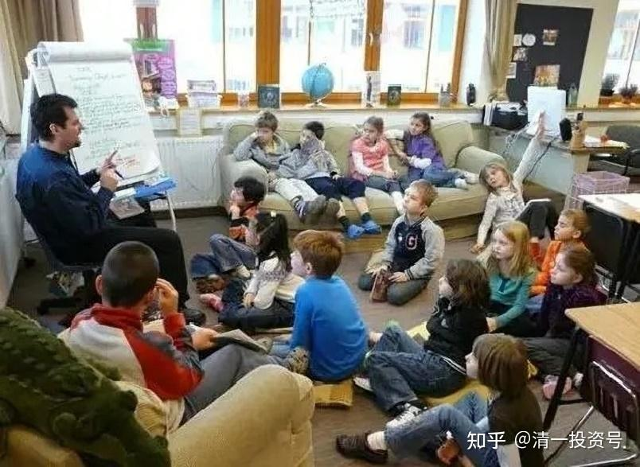
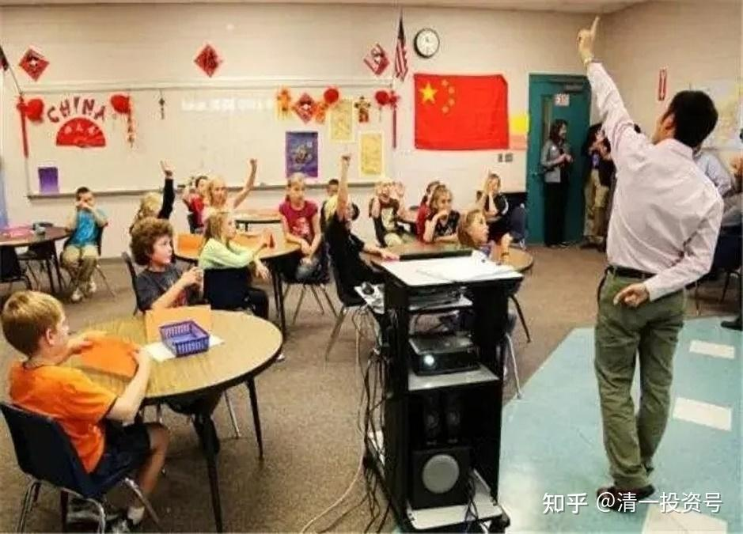

原雪球专栏[180篇.总算找到美国公立教育太差的原因了！](http://link.zhihu.com/?target=http%3A//xueqiu.com/9310099567/187142141)

清一山长 2021年6月25日

在企业界、科技界都在不断创新，激烈竞争的全球市场上，教育界居然置身事外。**全球教育依然用100年前的方法在“教育下一代”**。全球的教师，大多数都是平庸无能之辈。在“政府保障”下面舒舒服服地混日子。这给我们带来了最美好的机会：在全球教育创新，领先世界方面，似乎是一条没有人走的路，对手很多，但水平、能力、态度都很差。我们其实很容易就成为世界教育的“顶尖高手”，这种机会，实在是太幸福了！

以世界教育的典范——美国为例：**美国的学校，好的很好，但差的很差**。特别是公立教育，水平特别差，感觉就是混日子的。美国总统每年都在叫教育改革，却总是没有啥结果。相反：德国、日本、欧洲的教育，要比美国强得多。如果不是靠美国的私立教育，精英大学出来装装面子，美国的教育，早就毁掉形象了。

从一个案例来看美国，就知道美国的教育有多“好”了：美国总共有5000多所大学。排名美国前100名的大学，就像是美国的985、211一样，代表美国的精英大学水平了。按道理学生应该很优秀。但我查看美国前100名的学生SAT录取成绩，居然才刚过1200分，甚至最高分也就1300分左右。这个成绩，说实话根本就没啥技术含量。我们新教育的学生，作为外国学生的身份，从零开始学美国的母语课程，最多三年就可以达到美国前100大学的录取标准。可是，美国人这些学校的笨蛋教师，教学生教了12年，居然绝大多数学生都达不到这个水平。**有一半的学生，学了12年的母语课程，居然只能考1000分左右**，这个就是很低的分数了。大致相当于我们高考不到300分的样子。因为SAT的打分模式很奇怪，什么都不做，都有几百分的。

您非要说：美国排名前一百的大学学生就是成绩不够好，但别人综合素质好，整体很优秀，我就无语了。1200分算什么水平？根本就是不用努力学习，混日子也能混得极其平庸的水平。要提高到1400分，还真的要努力，也要聪明才做得到。1500分以上，基本就是天才的分数了。但1200分，真的不算啥学术水平的。这个分数就能上美国的前100大学，才让我对美国的大学感到好笑。猜都可以猜到：就是一群笨蛋在一起玩游乐园，才导致这种结果。当然——我不得不**对美国前30名的大学表示敬意，这些学校的教师和学生，的确都是世界一流的**。但我们别以为全美国的大学都这样。其实不是，差别可大了。

澳洲的学生去美国上大学，也发现美国的学生很差劲。学习基础和学习能力、愿望，比澳洲学生差得多。也弄不清美国的学生咋这么差。我也觉得：白痴都能学会的东西，似乎大多数的美国人就是学不会。比如：连美国总统，都会公开的闹出防疫很简单，干嘛不直接让国民喝消毒水，直接就杀死病毒了。闹出这种笑话来，可见其基础教育的白痴程度。要不是美国可以从全世界吸引精英学生来上大学，美国早垮掉了。现在硅谷的精英学生，主要是印度人和华裔在撑起大半边天。美国人比例上，并不是太多。但重要位置的确都是美国人。

从学生的普遍成绩上来看，去美国上学，特别是中小学，基本上就是找抽的。我认为从成绩上反应出来的，就是美国的中小学基本上是混日子的。教师和学生都在混日子。当然，少数精英家庭和精英学生还是很拼的，但你不能把这些学生当成美国的普遍状况，以为你去了美国都能做精英学生。比如我知道美国一些精英高中，要申请进入的难度比哈佛、耶鲁更难（录取比例，推荐难度）！这种学校，当然批量生产常春藤大学的学生了。可是，你中国人进得去吗？连大多数中产美国人都进不去的。

最近有一遍文章，研究了美国的公务员制度。我才知道原来美国教师是公务员。只要混进去了，一辈子旱涝保收。只要不犯原则性的错误（违法、犯罪、性侵犯等）。基本上是不能被开除的。

微信网页链接：

[https://mp.weixin.qq.com/s/C0Ti_YzqSnVKw2laesAD0Q](http://link.zhihu.com/?target=https%3A//mp.weixin.qq.com/s/C0Ti_YzqSnVKw2laesAD0Q)

**复旦杀人者如果换个身份会如何?**

搜狐网页链接：[https://www.sohu.com/a/405505302_120417488](http://link.zhihu.com/?target=https%3A//www.sohu.com/a/405505302_120417488)

[微信网页链接](http://link.zhihu.com/?target=https%3A//mp.weixin.qq.com/s/z74JeCE-fuNjAjdGWALLkg)：[https://mp.weixin.qq.com/s/z74JeCE-fuNjAjdGWALLkg](http://link.zhihu.com/?target=https%3A//mp.weixin.qq.com/s/z74JeCE-fuNjAjdGWALLkg)

**[美国公立学校的荒谬：教师铁饭碗，宁可祸害学生，也不赶走一个](http://link.zhihu.com/?target=https%3A//baijiahao.baidu.com/s%3Fid%3D1671170267269467909%26wfr)**

【美国公办教师的淘汰率却是2500分之一。2500个老师，才会有一个被裁的倒霉蛋。

如果真的想要开除老师，光流程就有23步，万一哪一步出错，就要全部推倒重来。

额滴神，这真是请神容易送神难。那老师犯了错怎么办呢？学校当然可以选择不要这个老师，这样老师就会进一个叫“橡皮屋”的地方，等待再次被分配到其他学校。

这些教学水平糟糕的老师在“橡皮屋”里每天待7小时，聊天、打牌、打瞌睡，干什么的都有，钱一分都不会少。

号称自由民主的美国，光联邦政府2021年就计划支出近八万亿美元，折算成人民币是50万亿人民币。再加上各州约2万亿美元的支出，总支出要达到近十万亿美元，也就是六十万亿人民币。

美国一共也才三亿多人口，人均为政府支出的税款高达三万美元，这个数字恐怖吧？

根据人口普查局“2013年公务员就业及工资年度报告”（Annual Survey of Public Employment & Payroll Summary Report:2013）的统计，截至2013年3月，包括全职与半职雇员在内，美国共有2183万公务员。全职雇员指每周工作30小时以上者，半职雇员指每周工作不到30小时者。在2183万公务员中，61%为公立学校教职员工（49.9%）、公立医院雇员（5.8%）以及警务人员（5.3%）。】

**“在2183万公务员中，公立学校教职员工为（49.9%）”**

美国政府养公务员，跟中国养还有一些不一样：中国的公务员，其实很辛苦的，指令特别多。中国的教师，虽然也算稳定的工作，不会轻易开除，但是要求、考核还是很多的。特别是中国的精英学校，比如衡水高中这样的学校，对教师的要求很高。我听说类似这样的学校，每年都有跳楼的教师——压力实在太大。但美国的教师，其实基本上不管教学成绩的，也不按教学大纲上课，只要混日子，不出事就没事。

美国的学校，差不多就是一个快乐儿童游乐园

中国的家长，看不透美国教育的本质，居然会拼命地赚钱、移民，把孩子从小送到美国去读中小学，最后收获一个一个的留学垃圾。不是钱多了把脑子烧坏了吗？能进美国最牛的高中、最牛的大学上学的学生，这种人在国内也是不差的学生。你把一个厌学的孩子，花钱送出国去上“游乐园”，不是找抽吗？

其实：国内的很多国际学校，把美国学校这种“自由散漫”的学习风气当做“时尚”加以模仿。所以，全世界的国际学校我看都差不多，混日子的占多数。今日学堂有不少从国际学校，甚至从国外转学来上学的学生。有一些学生从小读国际学校，结果却连英语水平都一般般，还赶不上我们自己培养的学生。这就是美国教育的毒素，已经深入到海外的国际学校了。除了学费高以外，我没看到啥高级的东西。

今日新教育，走在一条没有敌手的路上。**我们用对教师以及学生严厉的淘汰，实现了优异的成绩。这是奉行中国古代教诲的“天行健，君子以自强不息”的精神；这是奉行道法自然的态度：优胜劣汰是天道。**我们把人分为五种级别，让不同的人，到不同的层级去，别来骗人。**今日不养不进取的教师，也不养不努力的学生**。我们奉行企业竞争模式——**不优秀，毋宁死**。所以，我相信**我们培养出来的学生，未来是全世界最有竞争力的学生！**

**代价：就是师生们都用汗水来浇灌。总比用鲜血来浇灌更人性化**吧？比兵哥哥们更温柔吧？

如果美国人，以及一些中国高级家庭，更喜欢用游乐园模式来养下一代，你们继续你们的游戏吧！我们奉行真正的教育——教书，同时育人。想看我们是怎样教育人的，就请看示范班的教育和课程直播吧！

哔哩哔哩网页链接：[https://space.bilibili.com/487498588](http://link.zhihu.com/?target=https%3A//space.bilibili.com/487498588)

我们的学生是怎样的状态：请看他们的生活视频15～16岁少年的日常生活。

**[【清一大学少年班】走进我们的日常生活](http://link.zhihu.com/?target=https%3A//www.bilibili.com/video/BV1Fi4y1F7uK)**

哔哩哔哩网页链接：[https://www.bilibili.com/video/BV1Fi4y1F7uK](http://link.zhihu.com/?target=https%3A//www.bilibili.com/video/BV1Fi4y1F7uK)

[这就是今日学堂：把普通人培养成天才的中国第一学校！（海外版）](http://link.zhihu.com/?target=https%3A//www.bilibili.com/video/BV19K411g7tp)

哔哩哔哩网页链接：[https://www.bilibili.com/video/BV19K411g7tp](http://link.zhihu.com/?target=https%3A//www.bilibili.com/video/BV19K411g7tp)